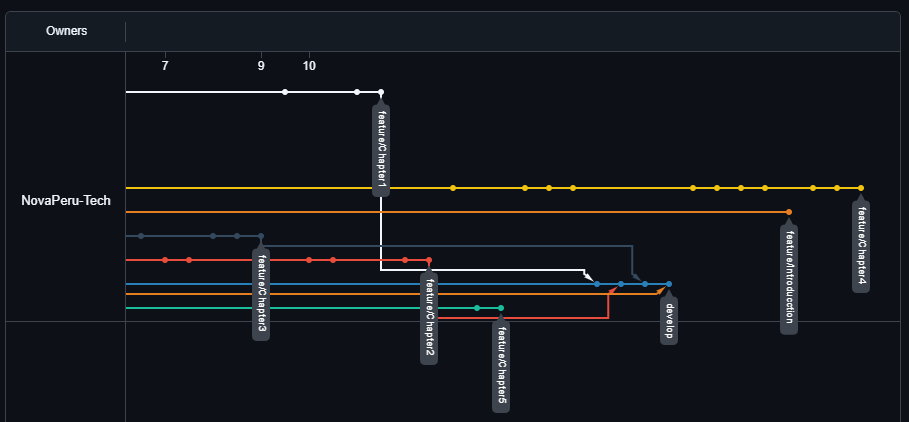

  <h1>Universidad Peruana de Ciencias Aplicadas</h1>
   
  
  

     
    <strong>Carrera:</strong> Ingeniería de Software
      
    <strong>Ciclo:</strong> 5° Ciclo
      
    1ASI0729-Desarrollo de Aplicaciones Open Source
      
    <strong>Sección:</strong> 7338.
      
    <strong>Nombre del profesor:</strong> Angel Augusto Velasquez Nuñez
  

  <h3>"Informe de Trabajo Final"</h3>
  

     
    <strong>Nombre del Startup:</strong> NovaPeru Tech
      
    <strong>Nombre del Producto:</strong> Veyra
      
    <strong>Integrantes:</strong>
      
    Calvo Yalan, Renato Guillermo - U202217053
      
      Oscar Javier Armas Sánchez - U20211G192
      
     Ariana Lizeth Ramirez Carrasco - U202312932
      
     Miguel Angel Junior Roman Lopez - U202212897
      
      Billy Jake Ruiz Madrid - U202116401
      
    Adrian Alonso Quiroz Caceres - U202214864
      
  

  <h3>Noviembre, 2025</h3>

 

## Registro de Versiones del Informe

<table border="1" cellpadding="5" cellspacing="0">
  <thead>
    <tr>
      <th>Versión</th>
      <th>Fecha</th>
      <th>Autor</th>
      <th>Descripción</th>
    </tr>
  </thead>
  <tbody>
    <tr>
      <td>1.0</td>
      <td>19/09/2025</td>
      <td>Renato Calvo Yalan</td>
      <td>
        Se elaboró y documentó la sección del <strong>Class Diagram</strong> en el capítulo 4, representando las entidades principales del sistema y sus relaciones. El diagrama fue desarrollado siguiendo los principios de modelado UML, permitiendo visualizar la estructura lógica del sistema y las interacciones entre clases. Esta contribución facilitó la comprensión del modelo de datos y sirvió como base para la posterior implementación del módulo de gestión de residentes.
      </td>
    </tr>
    <tr>
      <td>1.0</td>
      <td>13/09/2025</td>
      <td>Ariana Ramirez Carrasco</td>
      <td>
        Se desarrolló la sección del <strong>Lean UX Canvas</strong> en el capítulo 1, donde se definieron los objetivos estratégicos del proyecto, el público objetivo y las suposiciones clave sobre las necesidades del usuario. Se identificaron los principales retos de diseño y se establecieron hipótesis iniciales de validación. Esta actividad permitió al equipo construir una visión clara y alineada sobre el propósito de la plataforma Veyra.
      </td>
    </tr>
    <tr>
      <td>1.0</td>
      <td>13/09/2025</td>
      <td>Billy Jake Ruiz Madrid</td>
      <td>
        Se redactó y añadió la sección de <strong>Lean UX Problem Statements y Hypothesis Statements</strong> en el capítulo 1. En esta fase, se detallaron los problemas detectados a partir de la investigación preliminar y se formularon hipótesis verificables que orientaron las primeras pruebas con usuarios. El documento incluyó métricas de éxito, criterios de validación y un mapa de impacto en la experiencia del usuario.
      </td>
    </tr>
    <tr>
      <td>1.0</td>
      <td>14/09/2025</td>
      <td>Oscar Armas Sánchez</td>
      <td>
        Se realizó una revisión completa de la redacción del <strong>Problem Statement</strong> dentro del capítulo 1, corrigiendo inconsistencias y mejorando la claridad del lenguaje. Se enfatizó la relación entre los problemas identificados y las soluciones propuestas, con el fin de fortalecer la coherencia narrativa del documento y facilitar la lectura por parte de los revisores.
      </td>
    </tr>
    <tr>
      <td>1.0</td>
      <td>15/09/2025</td>
      <td>Miguel Angel Junior Roman Lopez</td>
      <td>
        Se desarrolló la sección de <strong>Competidores y Análisis de la Competencia</strong> en el capítulo 2. El análisis incluyó la identificación de plataformas similares en el mercado, comparando funcionalidades, diseño y propuesta de valor. Se elaboró una tabla comparativa que permitió al equipo identificar oportunidades de mejora e innovación para Veyra.
      </td>
    </tr>
    <tr>
      <td>1.0</td>
      <td>20/09/2025</td>
      <td>Renato Calvo Yalan</td>
      <td>
        Se elaboró la primera versión de la <strong>Information Architecture</strong> incluida en el capítulo 4. En ella se definieron los sistemas de organización, etiquetado y navegación de la Landing Page. El trabajo contribuyó a mejorar la experiencia del usuario mediante una estructura jerárquica clara, facilitando el acceso rápido a la información más relevante.
      </td>
    </tr>
    <tr>
      <td>1.0</td>
      <td>17/09/2025</td>
      <td>Ariana Ramirez Carrasco</td>
      <td>
        Se creó el <strong>Empathy Mapping</strong> correspondiente al capítulo 2. Este mapa permitió identificar las emociones, pensamientos y motivaciones de los usuarios finales —familiares y administradores— mediante la representación visual de sus experiencias. Los hallazgos obtenidos fueron fundamentales para definir los requerimientos funcionales de la plataforma.
      </td>
    </tr>
    <tr>
      <td>1.0</td>
      <td>19/09/2025</td>
      <td>Billy Jake Ruiz Madrid</td>
      <td>
        Se diseñaron los <strong>Wireframes y Mockups</strong> de la aplicación web, incluidos en el capítulo 4. Se desarrollaron versiones de escritorio y móviles, priorizando la claridad visual y la facilidad de navegación. Estos prototipos sirvieron como guía visual para el desarrollo del frontend, asegurando consistencia con la identidad visual del proyecto.
      </td>
    </tr>
    <tr>
      <td>1.0</td>
      <td>20/09/2025</td>
      <td>Miguel Angel Junior Roman Lopez</td>
      <td>
        Se redactó la sección de <strong>Análisis de Entrevistas</strong> en el capítulo 2, sintetizando los resultados obtenidos de las entrevistas con los principales grupos de usuarios. El análisis permitió validar los pain points y ajustar las hipótesis del Lean UX Canvas, proporcionando una visión realista sobre las expectativas del público objetivo.
      </td>
    </tr>
    <tr>
      <td>1.0</td>
      <td>19/09/2025</td>
      <td>Renato Calvo Yalan</td>
      <td>
        Se documentó la sección de <strong>Entrevistas</strong> del capítulo 2, donde se detalló la metodología de aplicación, las preguntas empleadas y los perfiles de los participantes. Los resultados se utilizaron como insumo clave para la elaboración de los User Personas y el Empathy Map, fortaleciendo la validez de los hallazgos.
      </td>
    </tr>
    <tr>
      <td>1.0</td>
      <td>12/09/2025</td>
      <td>Ariana Ramirez Carrasco</td>
      <td>
        Se elaboró el <strong>Journey Mapping</strong> dentro del capítulo 2, representando visualmente la experiencia del usuario familiar desde su primer contacto con la casa de reposo hasta la gestión de la información en Veyra. El mapa identificó puntos críticos de fricción y oportunidades de mejora, sirviendo de base para definir nuevas funcionalidades del sistema.
      </td>
    </tr>
    <tr>
      <td>1.0</td>
      <td>16/09/2025</td>
      <td>Billy Jake Ruiz Madrid</td>
      <td>
        Se incorporó la <strong>Entrevista del Segmento de Familiares</strong> dentro del capítulo 2, complementando el análisis cualitativo. El documento incluyó citas textuales de los participantes, sus percepciones sobre el proceso de comunicación con las casas de reposo y las principales frustraciones detectadas. Esta información alimentó la definición de requerimientos funcionales iniciales.
      </td>
    </tr>
    <tr>
      <td>1.0</td>
      <td>19/09/2025</td>
      <td>Oscar Armas Sánchez</td>
      <td>
        Se desarrolló la sección de <strong>Deployment</strong> correspondiente al capítulo 5, describiendo los pasos técnicos necesarios para el despliegue de la aplicación. Incluyó la configuración del entorno, dependencias utilizadas, estructura del servidor y lineamientos de mantenimiento. Este apartado sirvió como guía técnica para futuras implementaciones.
      </td>
    </tr>
    <tr>
      <td>1.0</td>
      <td>18/09/2025</td>
      <td>Miguel Angel Junior Roman Lopez</td>
      <td>
        Se diseñaron los <strong>Wireframes del Landing Page</strong> para el capítulo 4. El trabajo se centró en la organización visual de las secciones principales (Hero, About, Services, Contact) y en la coherencia estética con los principios de diseño definidos. Los resultados sirvieron como blueprint visual para el desarrollo del prototipo funcional.
      </td>
    </tr>
    <tr>
      <td>2.0</td>
      <td>22/09/2025</td>
      <td>Ariana Ramirez Carrasco</td>
      <td>
        Actualización inicial de la interfaz de usuario y arquitectura de contenidos. Se realizó una revisión profunda del orden de secciones de la Landing Page (Hero, What We Offer, Features, Benefits) y se propusieron ajustes para mejorar la jerarquía de información y la lectura rápida por parte de familiares y administradores. Se documentaron las decisiones visuales en el capítulo 4 (Web Style Guidelines) y se añadieron mockups de referencia para dispositivos móviles y desktop.
      </td>
    </tr>
    <tr>
      <td>2.0</td>
      <td>28/09/2025</td>
      <td>Ariana Ramirez Carrasco</td>
      <td>
        Revisión de accesibilidad y tipografía. Se implementaron recomendaciones para cumplir WCAG 2.1 AA en contraste y tamaños tipográficos (Rubik). Se añadió tabla de jerarquía tipográfica y ejemplos prácticos para H1–H4, párrafos y botones. Se llevaron a cabo pruebas manuales de legibilidad en móviles y tablets, documentando hallazgos y correcciones.
      </td>
    </tr>
    <tr>
      <td>2.0</td>
      <td>05/10/2025</td>
      <td>Ariana Ramirez Carrasco</td>
      <td>
        Entrega final de artefactos visuales para el Keynote. Se prepararon las pantallas principales, se crearon assets optimizados (logos, íconos y fotografías) y se generó la guía de estilo resumida para inclusión en el PDF final. Además, se coordinó con el equipo de frontend la hoja de estilos (assets/style.css) y se validó la consistencia con los mockups desplegados.
      </td>
    </tr>
    <tr>
      <td>2.0</td>
      <td>23/09/2025</td>
      <td>Renato Calvo Yalan</td>
      <td>
        Revisión técnica del módulo de Information Architecture. Se corrigieron diagramas y se añadió una sección detallada sobre sistemas de búsqueda y navegación (Search & Navigation Systems). Se documentó el flujo de búsqueda para residentes y la priorización de resultados por roles.
      </td>
    </tr>
    <tr>
      <td>2.0</td>
      <td>01/10/2025</td>
      <td>Renato Calvo Yalan</td>
      <td>
        Preparación y verificación de evidencias de despliegue. Se generaron los scripts de build y deployment, se verificó la versión desplegada del Landing Page en el entorno de staging y se documentó el procedimiento de despliegue en el capítulo 5. Se incluyeron logs y capturas como evidencia para el Sprint Review.
      </td>
    </tr>
    <tr>
      <td>2.0</td>
      <td>10/10/2025</td>
      <td>Renato Calvo Yalan</td>
      <td>
        Consolidación técnica final y revisión integradora. Como responsable de la integración, revisé y validé todas las mejoras técnicas aplicadas a los capítulos 3, 4 y 5; corregí inconsistencias en diagramas UML y añadí notas sobre compatibilidad y requisitos de infraestructura. Entregué también el paquete .zip final con el Frontend Web Application y documentación técnica.
      </td>
    </tr>
    <tr>
      <td>2.0</td>
      <td>24/09/2025</td>
      <td>Billy Jake Ruiz Madrid</td>
      <td>
        Documentación ampliada de Lean UX y validación de hipótesis. Se incorporaron métricas propuestas (KPI) y se redactaron las hipótesis en formato 3R (We believe / If / Attain / With). Se añadió la sección de Business Outcomes y User Outcomes con objetivos cuantitativos para los primeros seis meses.
      </td>
    </tr>
    <tr>
      <td>2.0</td>
      <td>30/09/2025</td>
      <td>Billy Jake Ruiz Madrid</td>
      <td>
        Evidencia de ejecución del Sprint 2: se documentó el proceso de integración del Frontend con servicios simulados (mocks) y se elaboraron las pruebas funcionales realizadas por QA. Se adjuntaron capturas de pantallas, logs de interacción y un resumen de aceptación por cada User Story implementada.
      </td>
    </tr>
    <tr>
      <td>2.0</td>
      <td>07/10/2025</td>
      <td>Billy Jake Ruiz Madrid</td>
      <td>
        Revisión final de la sección de User Personas y Empathy Maps. Se ampliaron los perfiles (Recoba y Yvonne) con insights adicionales de entrevistas y se añadieron los Journey Maps As-Is. Se garantizó que cada arquetipo esté sustentado por datos recogidos en entrevistas y se enlazaron las conclusiones con las features priorizadas.
      </td>
    </tr>
    <tr>
      <td>2.0</td>
      <td>25/09/2025</td>
      <td>Oscar Armas Sánchez</td>
      <td>
        Ajustes en la redacción de Problem Statements y Hypotheses. Se reescribieron las secciones para alinear el lenguaje con el template Lean UX, incorporando domain, customer segments, pain points y la visión estratégica. Además, se mejoró la fluidez textual para facilitar la lectura por parte del docente.
      </td>
    </tr>
    <tr>
      <td>2.0</td>
      <td>01/10/2025</td>
      <td>Oscar Armas Sánchez</td>
      <td>
        Coordinación del Sprint Review y preparación del reporte individual. Preparé las plantillas para el <em>Final Project Individual Member Performance Report</em>, recopilé los aportes de cada integrante y redacté observaciones sobre las actividades realizadas durante el Sprint 2. Documenté métricas de cumplimiento y recomendaciones para mejoras.
      </td>
    </tr>
    <tr>
      <td>2.0</td>
      <td>08/10/2025</td>
      <td>Oscar Armas Sánchez</td>
      <td>
        Elaboración del apartado "Team Collaboration Insights". Se registraron las dinámicas de trabajo, canales utilizados (Slack/WhatsApp/Meet), incidencias de coordinación y propuestas de mejora en la colaboración. Se añadió un resumen ejecutivo con lecciones aprendidas para futuros sprints.
      </td>
    </tr>
    <tr>
      <td>2.0</td>
      <td>26/09/2025</td>
      <td>Miguel Angel Junior Roman Lopez</td>
      <td>
        Inclusión y verificación del análisis de entrevistas ampliado. Se transcribieron y sintetizaron nuevas observaciones, se añadieron notas de contexto sobre los entrevistados (tecnología, canales, expectativas) y se mejoraron los resúmenes para reflejar datos objetivos y subjetivos.
      </td>
    </tr>
    <tr>
      <td>2.0</td>
      <td>02/10/2025</td>
      <td>Miguel Angel Junior Roman Lopez</td>
      <td>
        Redacción de la sección "Project Report Collaboration Insights". Documenté la contribución individual por fase (investigación, diseño, desarrollo, QA) y generé un cronograma de actividades actualizado. Además, validé las evidencias de sprint solicitadas por el docente.
      </td>
    </tr>
    <tr>
      <td>2.0</td>
      <td>09/10/2025</td>
      <td>Miguel Angel Junior Roman Lopez</td>
      <td>
        Actualización de Student Outcomes y cierre de entregables. Se revisó el cumplimiento de los resultados de aprendizaje esperados, se documentaron las evidencias que sustentan cada outcome y se preparó el índice de entrega final con los archivos (Keynote, documentación, .zip con código y videos).
      </td>
    </tr>
    <tr>
      <td>2.0</td>
      <td>10/10/2025</td>
      <td>Renato Calvo Yalan</td>
      <td>
        Revisión integradora y cierre de versión 2.0. A modo de revisión final, realicé una lectura completa de todo el informe, corregí errores ortográficos y de formato, consolidé las referencias cruzadas entre capítulos, verifiqué la presencia de los artefactos requeridos (Sprint 2: planificación, backlog, evidencias de desarrollo y ejecución, documentación de servicios y despliegue), y validé la inclusión de los entregables: 
        <ul>
          <li>Final Project Documentation Report</li>
          <li>Final Project Keynote</li>
          <li>Final Project Individual Member Performance Report (by Team Leader)</li>
          <li>Archivo .zip con activos y evidencias (código, videos, documentación)</li>
        </ul>
        Se dejó constancia de todas las correcciones aplicadas entre el 22/09/2025 y 10/10/2025 y se preparó la versión lista para entrega formal al docente.
      </td>
    </tr>
<tr>
  <td>3.0</td>
  <td>10/10/2025</td>
  <td>Ariana Ramírez Carrasco</td>
  <td>
    Actualización visual de la arquitectura de contenidos. Ariana reorganizó secciones clave de la Landing Page 
    (Hero, What We Offer, Features y Benefits), aplicando jerarquía visual y mejora de lectura. Documentó las 
    decisiones en la Web Style Guidelines e incluyó mockups para desktop y mobile.
  </td>
</tr>

<tr>
  <td>3.0</td>
  <td>18/10/2025</td>
  <td>Ariana Ramírez Carrasco</td>
  <td>
    Responsable del Bounded Context <strong>Payment</strong>, diseñando y estructurando el flujo de pagos, historial y gestión de cuotas.
    Diseño de pantallas, mejora de accesibilidad, guía de estilo y arquitectura visual del proyecto.
  </td>
</tr>

<tr>
  <td>3.0</td>
  <td>25/10/2025</td>
  <td>Ariana Ramírez Carrasco</td>
  <td>
    Preparación de artefactos visuales para el Keynote y el Video About-the-Product. 
    Se generaron assets optimizados, se validaron pantallas del flujo de Payment y 
    se definió la narrativa audiovisual inicial del video promocional. Todo se integró en los anexos finales.
  </td>
</tr>
<tr>
  <td>3.0</td>
  <td>12/10/2025</td>
  <td>Adrián Alonso Quiroz Cáceres</td>
  <td>
    Implementación de la infraestructura base del backend. Incluyó creación del proyecto, configuración de dependencias,
    estructura multicapa, controladores iniciales y pruebas de conexión con servicios de Nursing y Activity.
  </td>
</tr>

<tr>
  <td>3.0</td>
  <td>20/10/2025</td>
  <td>Adrián Alonso Quiroz Cáceres</td>
  <td>
    Desarrollo de Web Services del Sprint 3. Se implementaron endpoints de consulta, registro y actualización para entidades clave.
    Además, se documentó su funcionamiento y respuesta JSON en el capítulo 5.2.3.4 como parte del Sprint Review.
  </td>
</tr>

<tr>
  <td>3.0</td>
  <td>16/11/2025</td>
  <td>Adrián Alonso Quiroz Cáceres</td>
  <td>
    Revisión técnica final del backend. Adrián optimizó endpoints, verificó la correcta integración con los módulos Nursing,
    Activity y Payment y registró evidencias de consumo desde el frontend para el Sprint Review 3.
  </td>
</tr>
<tr>
  <td>3.0</td>
  <td>11/10/2025</td>
  <td>Renato Calvo Yalán</td>
  <td>
    Desarrollo inicial del módulo Nursing. Renato estructuró sus entidades, rutas y servicios, 
    además de definir flujos críticos como registro de residentes y supervisión. 
    Documentó el comportamiento esperado y dependencias del bounded context.
  </td>
</tr>

<tr>
  <td>3.0</td>
  <td>29/10/2025</td>
  <td>Renato Calvo Yalán</td>
  <td>
    Despliegue actualizado del Landing Page y Web App. Renato realizó pruebas de compatibilidad, validó rutas, 
    verificó el funcionamiento general y registró capturas y logs en el capítulo 5.2.3.5.
  </td>
</tr>

<tr>
  <td>3.0</td>
  <td>12/11/2025</td>
  <td>Renato Calvo Yalan</td>
  <td>
    Elaboración del Sprint Planning 3. Renato documentó objetivos, criterios de éxito y tareas priorizadas. 
    Coordinó además la verificación final del despliegue de Web Services junto con Adrián.
  </td>
</tr>
<tr>
  <td>3.0</td>
  <td>13/10/2025</td>
  <td>Oscar Armas Sánchez</td>
  <td>
    Recopilación de evidencias del Sprint 1 y 2. Oscar consolidó commits, capturas y 
    documentación generada por el equipo, asegurando consistencia entre entregables y el Sprint Backlog.
  </td>
</tr>

<tr>
  <td>3.0</td>
  <td>01/11/2025</td>
  <td>Oscar Armas Sánchez</td>
  <td>
    Elaboración del apartado Sprint 3 – Development & Execution Evidence. 
    Oscar organizó las pruebas, integró resultados y validó que la documentación técnica estuviera alineada al avance real del equipo.
  </td>
</tr>

<tr>
  <td>3.0</td>
  <td>14/11/2025</td>
  <td>Oscar Armas Sánchez</td>
  <td>
    Responsable del <strong>despliegue</strong> del proyecto junto con Renato, configurando entorno, dependencias y scripts.
  </td>
</tr>
<tr>
  <td>3.0</td>
  <td>09/10/2025</td>
  <td>Billy Jake Ruiz Madrid</td>
  <td>
    Desarrollo del bounded context Activity. Billy definió entidades, rutas y servicios principales, 
    además de documentar la lógica relacionada con registros y seguimiento de actividades.
  </td>
</tr>

<tr>
  <td>3.0</td>
  <td>03/11/2025</td>
  <td>Billy Jake Ruiz Madrid</td>
  <td>
    Documentación del Sprint Backlog 3 y definición de Aspect Leaders & Collaborators. 
    Asignó responsabilidades por bounded context y organizó dependencias internas del equipo.
  </td>
</tr>

<tr>
  <td>3.0</td>
  <td>15/11/2025</td>
  <td>Billy Jake Ruiz Madrid</td>
  <td>
    Responsable del Bounded Context <strong>Activity</strong>, implementando interfaces de actividades, rutinas y reportes diarios.
  </td>
</tr>
<tr>
  <td>3.0</td>
  <td>08/10/2025</td>
  <td>Miguel Ángel Junior Román López</td>
  <td>
    Elaboración inicial del Journey Mapping de usuarios familiares. 
    Miguel analizó puntos de fricción, oportunidades de mejora y propuso sugerencias para 
    un flujo más intuitivo dentro de Veyra.
  </td>
</tr>

<tr>
  <td>3.0</td>
  <td>26/10/2025</td>
  <td>Miguel Ángel Junior Román López</td>
  <td>
    Redacción del borrador de Conclusiones del informe. 
    Miguel estructuró logros, aprendizajes y resultados del equipo, preparando la base del cierre oficial del documento.
  </td>
</tr>

<tr>
  <td>3.0</td>
  <td>07/11/2025</td>
  <td>Miguel Ángel Junior Román López</td>
  <td>
    Preparación del apartado About the Team. 
    Redactó perfiles, roles y contribuciones del equipo para el video About-the-Team 
    y dejó la documentación lista para ser incluida en los anexos del informe.
  </td>
</tr>
  </tbody>
</table>

## Project Report Collaboration Insights

**Link de los repositorios de la organización**: https://github.com/NovaPeru-Tech

**Link del repositorio-Informe**: https://github.com/NovaPeru-Tech/NovaPeru-Tech-Project-Report

**Reporte de colaboración de la entrega del TB1**:

Durante la primera fase de elaboración del informe, el equipo Veyra centró sus esfuerzos en la construcción de los fundamentos conceptuales, de investigación y diseño inicial del proyecto. Cada integrante asumió un rol activo en la redacción, modelado y documentación de secciones clave del reporte, asegurando una coherencia entre la teoría, la metodología y la propuesta tecnológica.

**Ariana Ramírez Carrasco**

Ariana desarrolló el Lean UX Canvas (capítulo 1), estableciendo los objetivos estratégicos del proyecto, las suposiciones sobre el público objetivo y los principales retos de diseño. También elaboró el Empathy Mapping (capítulo 2), donde representó las emociones y motivaciones de los usuarios finales, y construyó el Journey Mapping (capítulo 2), visualizando la experiencia de los familiares en su interacción con la plataforma. Estos artefactos fueron esenciales para definir requerimientos funcionales realistas y una experiencia centrada en el usuario.

**Renato Calvo Yalán**

Renato lideró la elaboración del Class Diagram (capítulo 4), donde modeló las entidades principales del sistema, sus atributos y relaciones UML, facilitando la comprensión del modelo de datos. Posteriormente, construyó la primera versión de la Information Architecture, definiendo la estructura jerárquica del sitio y los sistemas de navegación. Además, documentó la sección de Entrevistas, detallando metodología y perfiles de participantes. Sus contribuciones sentaron las bases técnicas del proyecto y conectaron los hallazgos del UX con la arquitectura del sistema.

**Billy Jake Ruiz Madrid**

Billy se encargó de redactar los Problem Statements y Hypothesis Statements del capítulo 1, donde tradujo los hallazgos de la investigación en hipótesis verificables. Además, diseñó los Wireframes y Mockups de la aplicación (capítulo 4), tanto para escritorio como para dispositivos móviles, asegurando coherencia con la identidad visual definida. Finalmente, documentó entrevistas y validaciones cualitativas, lo cual permitió al equipo refinar los criterios de aceptación y preparar la transición hacia el desarrollo del front-end.

**Oscar Armas Sánchez**

Oscar realizó una revisión completa del Problem Statement del capítulo 1, mejorando la claridad y coherencia narrativa. En la fase final de esta entrega, redactó el Deployment Plan (capítulo 5), detallando la configuración técnica del entorno, dependencias y estructura del servidor. Su trabajo técnico permitió anticipar los procesos de despliegue del proyecto y garantizar la reproducibilidad del entorno de desarrollo.

**Miguel Ángel Junior Román López**

Miguel desarrolló la sección de Competidores y Análisis de la Competencia (capítulo 2), donde identificó plataformas similares, comparó funcionalidades y propuso oportunidades de diferenciación. También elaboró el Análisis de Entrevistas, sintetizando hallazgos de usuarios y validando hipótesis de diseño. Finalmente, diseñó los Wireframes del Landing Page, asegurando coherencia estética y funcionalidad intuitiva. Su trabajo consolidó la base visual y analítica del proyecto.

Finalmente, estos gráficos representan la cantidad de commits realizados por cada miembro del equipo en el repositorio del proyecto. Cada barra representa a un miembro del equipo y la altura de la barra indica el número total de commits realizados por esa persona.

**Ramificación del proyecto usando GitFlow:**

Este gráfico ofrece una visualización de las veces que se ha clonado nuestro repositorio, junto con las fechas correspondientes a cada evento. También muestran datos sobre el número de visitas que ha recibido el repositorio de nuestro equipo a lo largo del tiempo.

**Reporte de colaboración de la entrega del TP1**:

En la segunda fase, el equipo Veyra se enfocó en la consolidación técnica, visual y documental del informe. Esta etapa implicó la actualización del contenido, la mejora de los artefactos visuales, la documentación de procesos de despliegue y la integración final de entregables. Cada miembro aportó desde su especialidad, reflejando un trabajo colaborativo maduro y bien estructurado.

**Ariana Ramírez Carrasco**

Ariana lideró la actualización visual de la interfaz y arquitectura de contenidos, reorganizando las secciones de la Landing Page para optimizar la jerarquía informativa. Incorporó ajustes de accesibilidad y tipografía basados en las guías WCAG 2.1, documentando pruebas manuales de legibilidad en distintos dispositivos. Finalmente, elaboró la entrega de artefactos visuales para el Keynote, preparando logos, íconos y assets optimizados para la presentación final. Su aporte fue decisivo para consolidar la identidad visual de Veyra y garantizar su consistencia con el desarrollo técnico.

**Renato Calvo Yalán**

Renato asumió un rol técnico clave durante esta versión. Corrigió y amplió la sección de Information Architecture, incluyendo los sistemas de búsqueda y navegación. Además, preparó y verificó las evidencias de despliegue, documentando los scripts y logs técnicos, y finalmente lideró la revisión integradora de toda la versión 2.0, verificando compatibilidades, corrigiendo diagramas UML y consolidando los entregables requeridos. Su liderazgo técnico aseguró la estabilidad del proyecto antes de la entrega formal.

**Billy Jake Ruiz Madrid**

Billy amplió la documentación del Lean UX y validación de hipótesis, añadiendo métricas de impacto (KPI) y objetivos medibles. También documentó la evidencia de ejecución del Sprint 2, elaborando un registro de pruebas funcionales con capturas, logs y resultados por historia de usuario. Finalmente, revisó los User Personas y Empathy Maps, asegurando que los perfiles se basaran en datos de entrevistas reales. Su aporte integró la visión del usuario dentro del proceso de validación técnica y de experiencia.

**Oscar Armas Sánchez**

Oscar refinó los Problem Statements y Hypotheses, mejorando su alineación con el formato Lean UX y adaptando el lenguaje para mayor claridad. Posteriormente, coordinó el Sprint Review, recopilando aportes de los miembros y redactando observaciones sobre el cumplimiento de actividades. Finalmente, elaboró el apartado Team Collaboration Insights, donde documentó los canales de comunicación, incidencias y aprendizajes del equipo, consolidando la reflexión colectiva del proceso de trabajo.

**Miguel Ángel Junior Román López**

Miguel amplió el análisis de entrevistas, añadiendo notas contextuales y observaciones adicionales de los usuarios. Posteriormente, redactó la primera versión de esta misma sección, Project Report Collaboration Insights, describiendo los aportes individuales por fase y generando un cronograma de actividades actualizado. Finalmente, revisó los Student Outcomes, asegurando que todas las evidencias documentaran los resultados de aprendizaje esperados. Su trabajo cerró la entrega del informe de manera ordenada y coherente.

En esta versión, se refleja una coordinación fluida entre las áreas de investigación, diseño y desarrollo técnico. Las contribuciones en GitHub muestran un incremento en la frecuencia de commits y revisiones cruzadas, evidenciando la madurez del flujo de trabajo colaborativo y la consistencia en la gestión de versiones.

**Ramificación del proyecto usando GitFlow:**

Este gráfico ofrece una visualización de las veces que se ha clonado nuestro repositorio, junto con las fechas correspondientes a cada evento. También muestran datos sobre el número de visitas que ha recibido el repositorio de nuestro equipo a lo largo del tiempo.

**Reporte de colaboración de la entrega del TB2**:

En esta tercera fase, el equipo Veyra centró sus esfuerzos en la consolidación final del proyecto antes de la evaluación integradora. Esta etapa se caracterizó por una coordinación técnica más madura, una revisión exhaustiva de los artefactos producidos en versiones previas y la integración coherente entre UX, frontend, backend y documentación. Además, se incorporaron mejoras solicitadas por el profesor y se completaron los ajustes necesarios para garantizar que el informe final reflejara una propuesta sólida, funcional y bien fundamentada.

A continuación se describen los aportes individuales de cada miembro durante esta entrega:

**Ariana Ramírez Carrasco**

Ariana se enfocó en el refinamiento visual y estructural del documento final, reorganizando capítulos, jerarquías textuales y la estructura narrativa del informe. Realizó una mejora completa del apartado visual correspondiente al Bounded Context de Payment, ajustando pantallas, flujos de pago y accesibilidad visual para garantizar consistencia con las guías WCAG 2.1. Además, consolidó los artefactos visuales (logos, íconos, paletas cromáticas y assets optimizados) para la presentación final en Keynote. Finalmente, participó en la revisión transversal del documento asegurando coherencia entre la arquitectura visual, la navegación y la documentación técnica.

**Renato Calvo Yalán**

Renato reforzó la estabilidad técnica del proyecto revisando la arquitectura del sistema, la estructura de carpetas, los diagramas UML y la documentación del Bounded Context Nursing, desarrollado en conjunto con Adrián. Asimismo, ajustó procesos de despliegue, verificando rutas, logs y funcionamiento de servicios. Su aporte también incluyó la corrección final de la Information Architecture y la verificación de compatibilidad entre el contenido del informe, los servicios backend y la interfaz. Lideró la revisión integradora final de los entregables antes de la presentación oficial del TB2.

**Billy Jake Ruiz Madrid**

Billy centró sus esfuerzos en complementar los artefactos del Bounded Context Activity, ajustando pantallas y flujos de actividades para mejorar claridad y usabilidad. Amplió la documentación de validación del Lean UX, incorporando métricas de evaluación y resultados contrastados con entrevistas previas. También refinó los registros de pruebas funcionales del Sprint 2 y 3, ensamblando capturas, logs y trazabilidad por historia de usuario. Su aporte reforzó la conexión entre la visión del usuario, el diseño interactivo y la evidencia técnica del desarrollo.

**Oscar Armas Sánchez**

Oscar se encargó de consolidar los apartados relacionados al despliegue del proyecto, trabajando junto con Renato en la verificación del entorno, la estabilidad del servidor y preparación del registro de evidencias (capturas, comandos, scripts). Refinó los Problem Statements y Hypotheses del informe, asegurando su alineación con los hallazgos actuales del proyecto. Finalmente, redactó la sección final de Team Collaboration Insights, donde organizó los aprendizajes del equipo, las incidencias durante el proceso y la evolución del flujo de trabajo durante TB2.

**Miguel Ángel Junior Román López**

Miguel reforzó la sección de entrevistas y análisis contextual, complementando hallazgos previos e integrando nuevas observaciones relacionadas con la experiencia del adulto mayor y sus familiares. Elaboró una versión extendida del cronograma consolidado del proyecto, especificando entregables por fase y participación individual. Además, verificó nuevamente el cumplimiento de los Student Outcomes, garantizando que las evidencias producidas en TB2 documentaran adecuadamente las competencias logradas por el equipo. Su aporte cerró la fase con una integración documental clara y coherente.

**Adrian Alonso Quiroz Caceres**

Adrián se encargó de la revisión técnica profunda del backend, completando ajustes finales en controladores, entidades y servicios. Refinó el Bounded Context Nursing junto con Renato, asegurando la correcta definición de agregados, repositorios y conectividad con el frontend. Realizó pruebas finales de los endpoints, optimizó respuestas JSON y verificó la integración con los módulos Activity y Payment implementados por Billy y Ariana. Además, consolidó la documentación técnica de la API para el informe y participó en la revisión del Sprint Backlog correspondiente a la integración final del sistema.

Durante esta tercera fase se evidenció una colaboración madura entre los equipos de UX, frontend, backend e investigación. Las contribuciones en GitHub demostraron un incremento en commits, revisiones cruzadas y validaciones técnicas compartidas. Esta integración fortaleció la consistencia entre los artefactos visuales, la arquitectura del sistema y la documentación técnica, consolidando una entrega final cohesionada, estable y alineada con los objetivos del curso.

**Ramificación del proyecto usando GitFlow:**

Este gráfico ofrece una visualización de las veces que se ha clonado nuestro repositorio, junto con las fechas correspondientes a cada evento. También muestran datos sobre el número de visitas que ha recibido el repositorio de nuestro equipo a lo largo del tiempo.

## ABET – EAC - Student Outcome 3

**Criterio:** *Capacidad de comunicarse efectivamente con un rango de audiencias*

En el siguiente cuadro se describen las acciones realizadas y enunciados de conclusiones por parte del grupo, que permiten sustentar el haber alcanzado el logro del ABET – EAC – Student Outcome 3.

<table border="1" cellpadding="5" cellspacing="0" width="100%"> 
  <thead> 
    <tr> 
      <th width="25%">Criterio específico</th> 
      <th width="55%">Acciones realizadas</th> 
      <th width="20%">Conclusiones</th> 
    </tr> 
  </thead> 

  <tbody> 
    <tr> 
      <td><strong>Comunica oralmente con efectividad a diferentes rangos de audiencia.</strong></td> 
      <td> 
        <strong>Miguel Ángel Junior Román López:</strong> 
          
        <strong>TB1:</strong> Transformé los hallazgos de entrevistas y los wireframes en mensajes claros durante las sesiones grupales, permitiendo que cada miembro comprendiera la intención detrás de cada decisión de diseño. Además, participé en la exposición del proceso Lean UX, transmitiendo de forma ordenada los principales descubrimientos del equipo.
          
        <strong>TP1:</strong> Expuse los avances del análisis de entrevistas y la sección “Project Report Collaboration Insights”, organizando la información para distintos tipos de audiencia, desde diseñadores hasta revisores técnicos, logrando una comunicación transversal y efectiva.
          
        <strong>TB2:</strong> Expuse los resultados del Sprint 3 ante el equipo, explicando los cambios aplicados al flujo del usuario y aclarando las dependencias entre módulos, para asegurar que el equipo mantuviera una visión unificada del sistema.
           
        <strong>Ariana Lizeth Ramírez Carrasco:</strong> 
          
        <strong>TB1:</strong> Presenté los resultados del Lean UX Canvas y Empathy Mapping en reuniones, adaptando el lenguaje a públicos técnicos y no técnicos. Esto facilitó la comprensión del enfoque centrado en el usuario y la alineación del equipo.
          
        <strong>TP1:</strong> Dirigí la presentación de los entregables visuales finales (Landing Page y Keynote), utilizando una narrativa clara que resaltó los aspectos visuales y conceptuales del proyecto frente a distintos grupos de evaluación.
          
        <strong>TB2:</strong> Comunqué el funcionamiento del Bounded Context de Payment, explicando la lógica de validación y la usabilidad del flujo de pagos, asegurando que los miembros comprendieran la importancia del diseño centrado en el usuario.
           
        <strong>Billy Jake Ruiz Madrid:</strong> 
          
        <strong>TB1:</strong> Comunicado las hipótesis de diseño y validación de entrevistas en exposiciones internas, facilitando el alineamiento del equipo respecto a los hallazgos principales del proceso de Needfinding.
          
        <strong>TP1:</strong> Durante el Sprint Review, presentó los resultados de validación de hipótesis y pruebas funcionales ante el equipo y docente, explicando con claridad el impacto de cada funcionalidad implementada y las mejoras sugeridas.
          
        <strong>TB2:</strong> Expuso la estructura del Bounded Context de Activity y cómo sus funcionalidades se integran con Nursing y Payment, permitiendo que los evaluadores entendieran la importancia del módulo dentro del sistema.
           
        <strong>Oscar Armas Sánchez:</strong> 
          
        <strong>TB1:</strong> Explicó la arquitectura visual del proyecto y los diagramas técnicos durante las sesiones de revisión, utilizando lenguaje comprensible para diseñadores y programadores, logrando así una comprensión conjunta de la estructura del sistema.
          
        <strong>TP1:</strong> Encabezó la exposición sobre el proceso de despliegue y la configuración del entorno, comunicando los aspectos técnicos con precisión y coherencia frente a audiencias diversas, lo que facilitó la validación del entorno de desarrollo.
          
        <strong>TB2:</strong> Presentó el impacto del despliegue final del Sprint 3 y explicó la coordinación con Renato para asegurar que todas las rutas y servicios estuvieran alineados antes del cierre del ciclo.
           
        <strong>Renato Calvo Yalán:</strong> 
          
        <strong>TB1:</strong> Presentó el diagrama de clases y la arquitectura del sistema en reuniones de equipo, adaptando el nivel de detalle según el perfil del público. Esto contribuyó a la integración de los componentes en la arquitectura general.
          
        <strong>TP1:</strong> Lideró la presentación del despliegue y la validación del entorno técnico, utilizando lenguaje claro y visualizaciones precisas para explicar la relación entre módulos y componentes del sistema.
          
        <strong>TB2:</strong> Explicó los avances del Bounded Context de Nursing, detallando su integración con Activity y Payment, destacando su relevancia dentro de la estructura del proyecto.
          
        <strong>Adrian Alonso Quiroz Caceres:</strong> 
          
        <strong>TB2:</strong> Durante el Sprint 3 expuse ante el equipo los avances del desarrollo del backend y la consolidación de los Web Services. Expliqué el funcionamiento de los endpoints, las dependencias entre módulos y los ajustes realizados para asegurar la correcta integración con el bounded context de Nursing. Además, comuniqué de manera clara los criterios técnicos utilizados para optimizar las respuestas del servidor y la estructura final del API, permitiendo al equipo comprender el flujo completo de comunicación entre frontend y backend.
          
      </td>
      <td> 
        <strong>Conclusión TB1:</strong>  
        La comunicación oral fue clave para unificar criterios y garantizar que todos los integrantes comprendieran los objetivos del proyecto. Las presentaciones internas y discusiones guiadas permitieron consolidar decisiones de diseño y técnica de manera efectiva.
           
        <strong>Conclusión TP1:</strong>  
        En esta etapa, la comunicación oral evolucionó hacia un nivel más técnico y estructurado. El equipo demostró fluidez al exponer resultados, defender propuestas y articular información compleja frente a públicos mixtos, fortaleciendo su capacidad argumentativa y colaborativa. 
           
        <strong>Conclusión TB2:</strong>  
        Durante esta etapa, la comunicación oral se consolidó como un elemento clave para coordinar dependencias técnicas entre módulos y asegurar la coherencia del sistema. Las exposiciones del Sprint 3 permitieron al equipo expresar con claridad los avances, justificar decisiones y mantener la alineación entre frontend, backend y diseño, fortaleciendo la comprensión compartida del proyecto.
      </td> 
    </tr>
    <tr>
      <td><strong>Comunica por escrito con efectividad a diferentes rangos de audiencia.</strong></td>
      <td>
        <strong>Miguel Ángel Junior Román López:</strong>
          
        <strong>TB1:</strong> Redacté los análisis de entrevistas y los resúmenes de hallazgos, empleando un lenguaje accesible para todas las áreas del equipo. Los documentos sirvieron como guía para estructurar el Problem Statement y las Assumptions.
          
        <strong>TP1:</strong> Elaboré la documentación del apartado “Project Report Collaboration Insights” y actualicé los Student Outcomes, asegurando consistencia en la estructura, claridad en el lenguaje y alineación con los objetivos de aprendizaje.
          
        <strong>TB2:</strong> Redacté el capítulo correspondiente al Sprint Review 3, documentando evidencias, conclusiones y el análisis del progreso técnico del equipo de manera organizada.
           
        <strong>Ariana Lizeth Ramírez Carrasco:</strong>
          
        <strong>TB1:</strong> Documenté el proceso de Lean UX y los entregables visuales con un formato técnico y comprensible, generando insumos reutilizables para posteriores entregas. Además, redacté la descripción del dominio y la organización de contenidos para el capítulo 4.
          
        <strong>TP1:</strong> Redacté los informes de revisión visual y accesibilidad, así como las directrices gráficas para el despliegue final, manteniendo una comunicación escrita clara y profesional, acorde con los estándares del curso.
          
        <strong>TB2:</strong> Escribí la documentación del Bounded Context de Payment, incluyendo las validaciones, flujos de usuario y la estructura del módulo, asegurando claridad conceptual y técnica.
           
        <strong>Billy Jake Ruiz Madrid:</strong>
          
        <strong>TB1:</strong> Elaboré reportes que relacionaban tareas de usuario con módulos funcionales, utilizando un lenguaje técnico unificado con el lenguaje ubicuo del dominio. Esto ayudó a mantener coherencia entre las áreas de negocio y desarrollo.
          
        <strong>TP1:</strong> Documenté la ejecución del Sprint 2, registrando pruebas funcionales, evidencias y resultados en un formato detallado y comprensible para el equipo técnico y docente.
          
        <strong>TB2:</strong> Redacté la sección del Bounded Context de Activity, explicando la funcionalidad central, sus dependencias y las reglas del dominio, garantizando una comprensión clara del módulo.
           
        <strong>Oscar Armas Sánchez:</strong>
          
        <strong>TB1:</strong> Documenté la arquitectura visual y técnica del proyecto con descripciones precisas y ejemplos ilustrativos, adecuando el contenido para distintas audiencias. Asimismo, organicé las secciones de diseño web con redacción técnica y clara.
          
        <strong>TP1:</strong> Redacté el informe de Sprint Review y la documentación de despliegue, empleando un tono profesional, estructurado y coherente con los estándares del curso. Incluí detalles técnicos que facilitaron la validación de los resultados.
          
        <strong>TB2:</strong> Redacté el documento final del despliegue del Sprint 3, integrando las evidencias recopiladas por el equipo de backend y frontend, manteniendo una redacción clara y técnica.
           
        <strong>Renato Calvo Yalán:</strong>
          
        <strong>TB1:</strong> Elaboré diagramas explicativos del funcionamiento del sistema y sus componentes, acompañados de textos que facilitaban su comprensión tanto a nivel técnico como conceptual. Esto fortaleció la claridad del Capítulo 4.
          
        <strong>TP1:</strong> Redacté la documentación técnica de despliegue, organizando los procedimientos de instalación, logs y evidencias de configuración en un formato detallado y legible, complementando el informe de validación de entorno.
          
        <strong>TB2:</strong> Documenté la integración del Bounded Context de Nursing y su relación con los demás módulos, explicando sus responsabilidades y justificación técnica dentro del sistema.
          
        <strong>Adrian Alonso Quiroz Caceres:</strong> 
          
        <strong>TB2:</strong> Documenté la actualización de los Web Services, detallando los endpoints implementados, los parámetros requeridos, los esquemas JSON y las validaciones incorporadas. Asimismo, registré las pruebas realizadas para garantizar la integración con los módulos del frontend, describiendo evidencias técnicas, capturas, logs y resultados de pruebas. La redacción permitió que el equipo tuviera una referencia clara para consumir los servicios y que los revisores comprendieran la estructura final del backend.
          
      </td>
      <td>
        <strong>Conclusión TB1:</strong> 
        La redacción técnica y descriptiva permitió estructurar el conocimiento de manera ordenada, asegurando que todos los miembros y revisores comprendieran los avances y objetivos del proyecto. La claridad escrita mejoró la trazabilidad de decisiones y artefactos.
          
        <strong>Conclusión TP1:</strong> 
        En esta fase, el equipo fortaleció su capacidad para redactar documentación técnica integral. Cada entrega reflejó precisión, cohesión y adaptación del lenguaje al público objetivo, lo cual consolidó la calidad del informe final y su comprensión transversal.
          
        <strong>Conclusión TB2:</strong>  
        La documentación generada en esta fase permitió detallar con precisión la evolución técnica del proyecto, registrando integraciones, cambios y dependencias entre los módulos. La claridad en la redacción facilitó que el equipo y los revisores comprendieran el aporte de cada sprint, mejorando la coherencia del informe final y la trazabilidad de los artefactos desarrollados.
      </td>
    </tr>
  </tbody>
</table>

<h2>Contenido</h2>

- [Capítulo I: Introducción](https://github.com/NovaPeru-Tech/NovaPeru-Tech-Project-Report/blob/main/docs/ChapterI.md#cap%C3%ADtulo-i-introducci%C3%B3n)
  - [1.1. Startup Profile](https://github.com/NovaPeru-Tech/NovaPeru-Tech-Project-Report/blob/main/docs/ChapterI.md#11-startup-profile)
    - [1.1.1. Descripción de la Startup](https://github.com/NovaPeru-Tech/NovaPeru-Tech-Project-Report/blob/main/docs/ChapterI.md#111-descripci%C3%B3n-de-la-startup)
    - [1.1.2. Perfiles de integrantes del equipo](https://github.com/NovaPeru-Tech/NovaPeru-Tech-Project-Report/blob/main/docs/ChapterI.md#112-perfiles-de-integrantes-del-equipo)
  - [1.2. Solution Profile](https://github.com/NovaPeru-Tech/NovaPeru-Tech-Project-Report/blob/main/docs/ChapterI.md#12-solution-profile)
    - [1.2.1. Antecedentes y problemática](https://github.com/NovaPeru-Tech/NovaPeru-Tech-Project-Report/blob/main/docs/ChapterI.md#121-antecedentes-y-problem%C3%A1tica)
    - [1.2.2. Lean UX Process](https://github.com/NovaPeru-Tech/NovaPeru-Tech-Project-Report/blob/main/docs/ChapterI.md#122-lean-ux-process)
      - [1.2.2.1. Lean UX Problem Statements](https://github.com/NovaPeru-Tech/NovaPeru-Tech-Project-Report/blob/main/docs/ChapterI.md#1221-lean-ux-problem-statements)
      - [1.2.2.2. Lean UX Assumptions](https://github.com/NovaPeru-Tech/NovaPeru-Tech-Project-Report/blob/main/docs/ChapterI.md#1222-lean-ux-assumptions)
      - [1.2.2.3. Lean UX Hypothesis Statements](https://github.com/NovaPeru-Tech/NovaPeru-Tech-Project-Report/blob/main/docs/ChapterI.md#1223-lean-ux-hypothesis-statements)
      - [1.2.2.4. Lean UX Canvas](https://github.com/NovaPeru-Tech/NovaPeru-Tech-Project-Report/blob/main/docs/ChapterI.md#1224-lean-ux-canvas)
  - [1.3. Segmentos objetivo](https://github.com/NovaPeru-Tech/NovaPeru-Tech-Project-Report/blob/main/docs/ChapterI.md#13-segmentos-objetivo)

- [Capítulo II: Requirements Elicitation & Analysis](https://github.com/NovaPeru-Tech/NovaPeru-Tech-Project-Report/blob/main/docs/ChapterII.md#cap%C3%ADtulo-ii-requirements-elicitation--analysis)
  - [2.1. Competidores](https://github.com/NovaPeru-Tech/NovaPeru-Tech-Project-Report/blob/main/docs/ChapterII.md#21-competidores)
    - [2.1.1. Análisis competitivo](https://github.com/NovaPeru-Tech/NovaPeru-Tech-Project-Report/blob/main/docs/ChapterII.md#211-an%C3%A1lisis-competitivo)
    - [2.1.2. Estrategias y tácticas frente a competidores](https://github.com/NovaPeru-Tech/NovaPeru-Tech-Project-Report/blob/main/docs/ChapterII.md#212-estrategias-y-t%C3%A1cticas-frente-a-competidores)
  - [2.2. Entrevistas](https://github.com/NovaPeru-Tech/NovaPeru-Tech-Project-Report/blob/main/docs/ChapterII.md#22-entrevistas)
    - [2.2.1. Diseño de entrevistas](https://github.com/NovaPeru-Tech/NovaPeru-Tech-Project-Report/blob/main/docs/ChapterII.md#221-dise%C3%B1o-de-entrevistas)
    - [2.2.2. Registro de entrevistas](https://github.com/NovaPeru-Tech/NovaPeru-Tech-Project-Report/blob/main/docs/ChapterII.md#222-registro-de-entrevistas)
    - [2.2.3. Análisis de entrevistas](https://github.com/NovaPeru-Tech/NovaPeru-Tech-Project-Report/blob/main/docs/ChapterII.md#223-an%C3%A1lisis-de-entrevistas)
  - [2.3. Needfinding](https://github.com/NovaPeru-Tech/NovaPeru-Tech-Project-Report/blob/main/docs/ChapterII.md#23-needfinding)
    - [2.3.1. User Personas](https://github.com/NovaPeru-Tech/NovaPeru-Tech-Project-Report/blob/main/docs/ChapterII.md#231-user-personas)
    - [2.3.2. User Task Matrix](https://github.com/NovaPeru-Tech/NovaPeru-Tech-Project-Report/blob/main/docs/ChapterII.md#232-user-task-matrix)
    - [2.3.3. User Journey Mapping](https://github.com/NovaPeru-Tech/NovaPeru-Tech-Project-Report/blob/main/docs/ChapterII.md#233-user-journey-mapping)
    - [2.3.4. Empathy Mapping](https://github.com/NovaPeru-Tech/NovaPeru-Tech-Project-Report/blob/main/docs/ChapterII.md#234-empathy-mapping)
  - [2.4. Big Picture Event Storming](https://github.com/NovaPeru-Tech/NovaPeru-Tech-Project-Report/blob/main/docs/ChapterII.md#24-big-picture-event-storming)
  - [2.5. Ubiquitous Language](https://github.com/NovaPeru-Tech/NovaPeru-Tech-Project-Report/blob/main/docs/ChapterII.md#25-ubiquitous-language)

- [Capítulo III: Requirements Specification](https://github.com/NovaPeru-Tech/NovaPeru-Tech-Project-Report/blob/main/docs/ChapterIII.md#cap%C3%ADtulo-iii-requirements-specification)
  - [3.1. User Stories](https://github.com/NovaPeru-Tech/NovaPeru-Tech-Project-Report/blob/main/docs/ChapterIII.md#31-user-stories)
  - [3.2. Impact Mapping](https://github.com/NovaPeru-Tech/NovaPeru-Tech-Project-Report/blob/main/docs/ChapterIII.md#32-impact-mapping)
  - [3.3. Product Backlog](https://github.com/NovaPeru-Tech/NovaPeru-Tech-Project-Report/blob/main/docs/ChapterIII.md#33-product-backlog)

- [Capítulo IV: Product Design](https://github.com/NovaPeru-Tech/NovaPeru-Tech-Project-Report/blob/main/docs/ChapterIV.md#cap%C3%ADtulo-iv-product-design)
  - [4.1. Style Guidelines](https://github.com/NovaPeru-Tech/NovaPeru-Tech-Project-Report/blob/main/docs/ChapterIV.md#41-style-guidelines)
    - [4.1.1. General Style Guidelines](https://github.com/NovaPeru-Tech/NovaPeru-Tech-Project-Report/blob/main/docs/ChapterIV.md#411-general-style-guidelines)
    - [4.1.2. Web Style Guidelines](https://github.com/NovaPeru-Tech/NovaPeru-Tech-Project-Report/blob/main/docs/ChapterIV.md#412-web-style-guidelines)
  - [4.2. Information Architecture](https://github.com/NovaPeru-Tech/NovaPeru-Tech-Project-Report/blob/main/docs/ChapterIV.md#42-information-architecture)
    - [4.2.1. Organization Systems](https://github.com/NovaPeru-Tech/NovaPeru-Tech-Project-Report/blob/main/docs/ChapterIV.md#421-organization-systems)
    - [4.2.2. Labeling Systems](https://github.com/NovaPeru-Tech/NovaPeru-Tech-Project-Report/blob/main/docs/ChapterIV.md#422-labeling-systems)
    - [4.2.3. SEO Tags and Meta Tags](https://github.com/NovaPeru-Tech/NovaPeru-Tech-Project-Report/blob/main/docs/ChapterIV.md#423-seo-tags-and-meta-tags)
    - [4.2.4. Searching Systems](https://github.com/NovaPeru-Tech/NovaPeru-Tech-Project-Report/blob/main/docs/ChapterIV.md#424-searching-systems)
    - [4.2.5. Navigation Systems](https://github.com/NovaPeru-Tech/NovaPeru-Tech-Project-Report/blob/main/docs/ChapterIV.md#425-navigation-systems)
  - [4.3. Landing Page UI Design](https://github.com/NovaPeru-Tech/NovaPeru-Tech-Project-Report/blob/main/docs/ChapterIV.md#43-landing-page-ui-design)
    - [4.3.1. Landing Page Wireframe](https://github.com/NovaPeru-Tech/NovaPeru-Tech-Project-Report/blob/main/docs/ChapterIV.md#431-landing-page-wireframe)
    - [4.3.2. Landing Page Mock-up](https://github.com/NovaPeru-Tech/NovaPeru-Tech-Project-Report/blob/main/docs/ChapterIV.md#432-landing-page-mock-up)
  - [4.4. Web Applications UX/UI Design](https://github.com/NovaPeru-Tech/NovaPeru-Tech-Project-Report/blob/main/docs/ChapterIV.md#44-web-applications-uxui-design)
    - [4.4.1. Web Applications Wireframes](https://github.com/NovaPeru-Tech/NovaPeru-Tech-Project-Report/blob/main/docs/ChapterIV.md#441-web-applications-wireframes)
    - [4.4.2. Web Applications Wireflow Diagrams](https://github.com/NovaPeru-Tech/NovaPeru-Tech-Project-Report/blob/main/docs/ChapterIV.md#442-web-applications-wireflow-diagrams)
    - [4.4.3. Web Applications Mock-ups](https://github.com/NovaPeru-Tech/NovaPeru-Tech-Project-Report/blob/main/docs/ChapterIV.md#443-web-applications-mock-ups)
    - [4.4.4. Web Applications User Flow Diagrams](https://github.com/NovaPeru-Tech/NovaPeru-Tech-Project-Report/blob/main/docs/ChapterIV.md#444-web-applications-user-flow-diagrams)
  - [4.5. Web Applications Prototyping](https://github.com/NovaPeru-Tech/NovaPeru-Tech-Project-Report/blob/main/docs/ChapterIV.md#45-web-applications-prototyping)
  - [4.6. Domain-Driven Software Architecture](https://github.com/NovaPeru-Tech/NovaPeru-Tech-Project-Report/blob/main/docs/ChapterIV.md#46-domain-driven-software-architecture)
    - [4.6.1. Design-Level Event Storming](https://github.com/NovaPeru-Tech/NovaPeru-Tech-Project-Report/blob/main/docs/ChapterIV.md#461-design-level-event-storming)
    - [4.6.2. Software Architecture Context Diagram](https://github.com/NovaPeru-Tech/NovaPeru-Tech-Project-Report/blob/main/docs/ChapterIV.md#462-software-architecture-context-diagram)
    - [4.6.3. Software Architecture Container Diagrams](https://github.com/NovaPeru-Tech/NovaPeru-Tech-Project-Report/blob/main/docs/ChapterIV.md#463-software-architecture-container-diagrams)
    - [4.6.4. Software Architecture Components Diagrams](https://github.com/NovaPeru-Tech/NovaPeru-Tech-Project-Report/blob/main/docs/ChapterIV.md#464-software-architecture-components-diagrams)
  - [4.7. Software Object-Oriented Design](https://github.com/NovaPeru-Tech/NovaPeru-Tech-Project-Report/blob/main/docs/ChapterIV.md#47-software-object-oriented-design)
    - [4.7.1. Class Diagrams](https://github.com/NovaPeru-Tech/NovaPeru-Tech-Project-Report/blob/main/docs/ChapterIV.md#471-class-diagrams)
  - [4.8. Database Design](https://github.com/NovaPeru-Tech/NovaPeru-Tech-Project-Report/blob/main/docs/ChapterIV.md#48-database-design)
    - [4.8.1. Database Diagrams](https://github.com/NovaPeru-Tech/NovaPeru-Tech-Project-Report/blob/main/docs/ChapterIV.md#481-database-diagrams)
- [Capítulo V: Product Implementation, Validation & Deployment](https://github.com/NovaPeru-Tech/NovaPeru-Tech-Project-Report/blob/main/docs/ChapterV.md#cap%C3%ADtulo-v-product-implementation-validation--deployment)
  - [5.1. Software Configuration Management](https://github.com/NovaPeru-Tech/NovaPeru-Tech-Project-Report/blob/main/docs/ChapterV.md#51-software-configuration-management)
    - [5.1.1. Software Development Environment Configuration](https://github.com/NovaPeru-Tech/NovaPeru-Tech-Project-Report/blob/main/docs/ChapterV.md#511-software-development-environment-configuration)
    - [5.1.2. Source Code Management](https://github.com/NovaPeru-Tech/NovaPeru-Tech-Project-Report/blob/main/docs/ChapterV.md#512-source-code-management)
    - [5.1.3. Source Code Style Guide & Conventions](https://github.com/NovaPeru-Tech/NovaPeru-Tech-Project-Report/blob/main/docs/ChapterV.md#513-source-code-style-guide--conventions)
    - [5.1.4. Software Deployment Configuration](https://github.com/NovaPeru-Tech/NovaPeru-Tech-Project-Report/blob/main/docs/ChapterV.md#514-software-deployment-configuration)

  - [5.2. Landing Page, Services & Applications Implementation](https://github.com/NovaPeru-Tech/NovaPeru-Tech-Project-Report/blob/main/docs/ChapterV.md#52-landing-page-services--applications-implementation)
    - [5.2.1. Sprint 1](https://github.com/NovaPeru-Tech/NovaPeru-Tech-Project-Report/blob/main/docs/ChapterV.md#521-sprint-1)
      - [5.2.1.1. Sprint Planning 1](https://github.com/NovaPeru-Tech/NovaPeru-Tech-Project-Report/blob/main/docs/ChapterV.md#5211-sprint-planning-1)
      - [5.2.1.2. Aspect Leaders and Collaborators](https://github.com/NovaPeru-Tech/NovaPeru-Tech-Project-Report/blob/main/docs/ChapterV.md#5212-aspect-leaders-and-collaborators)
      - [5.2.1.3. Sprint Backlog 1](https://github.com/NovaPeru-Tech/NovaPeru-Tech-Project-Report/blob/main/docs/ChapterV.md#5213-sprint-backlog-1)
      - [5.2.1.4. Development Evidence for Sprint Review](https://github.com/NovaPeru-Tech/NovaPeru-Tech-Project-Report/blob/main/docs/ChapterV.md#5214-development-evidence-for-sprint-review)
      - [5.2.1.5. Execution Evidence for Sprint Review](https://github.com/NovaPeru-Tech/NovaPeru-Tech-Project-Report/blob/main/docs/ChapterV.md#5215-execution-evidence-for-sprint-review)
      - [5.2.1.6. Services Documentation Evidence for Sprint Review](https://github.com/NovaPeru-Tech/NovaPeru-Tech-Project-Report/blob/main/docs/ChapterV.md#5216-services-documentation-evidence-for-sprint-review)
      - [5.2.1.7. Software Deployment Evidence for Sprint Review](https://github.com/NovaPeru-Tech/NovaPeru-Tech-Project-Report/blob/main/docs/ChapterV.md#5217-software-deployment-evidence-for-sprint-review)
      - [5.2.1.8. Team Collaboration Insights during Sprint](https://github.com/NovaPeru-Tech/NovaPeru-Tech-Project-Report/blob/main/docs/ChapterV.md#5218-team-collaboration-insights-during-sprint)

    - [5.2.2. Sprint 2](https://github.com/NovaPeru-Tech/NovaPeru-Tech-Project-Report/blob/main/docs/ChapterV.md#522-sprint-2)
      - [5.2.2.1. Sprint Planning 2](https://github.com/NovaPeru-Tech/NovaPeru-Tech-Project-Report/blob/main/docs/ChapterV.md#5221-sprint-planning-2)
      - [5.2.2.2. Aspect Leaders and Collaborators](https://github.com/NovaPeru-Tech/NovaPeru-Tech-Project-Report/blob/main/docs/ChapterV.md#5222-aspect-leaders-and-collaborators)
      - [5.2.2.3. Sprint Backlog 2](https://github.com/NovaPeru-Tech/NovaPeru-Tech-Project-Report/blob/main/docs/ChapterV.md#5223-sprint-backlog-2)
      - [5.2.2.4. Development Evidence for Sprint Review](https://github.com/NovaPeru-Tech/NovaPeru-Tech-Project-Report/blob/main/docs/ChapterV.md#5224-development-evidence-for-sprint-review)
      - [5.2.2.5. Execution Evidence for Sprint Review](https://github.com/NovaPeru-Tech/NovaPeru-Tech-Project-Report/blob/main/docs/ChapterV.md#5225-execution-evidence-for-sprint-review)
      - [5.2.2.6. Services Documentation Evidence for Sprint Review](https://github.com/NovaPeru-Tech/NovaPeru-Tech-Project-Report/blob/main/docs/ChapterV.md#5226-services-documentation-evidence-for-sprint-review)
      - [5.2.2.7. Software Deployment Evidence for Sprint Review](https://github.com/NovaPeru-Tech/NovaPeru-Tech-Project-Report/blob/main/docs/ChapterV.md#5227-software-deployment-evidence-for-sprint-review)
      - [5.2.2.8. Team Collaboration Insights during Sprint](https://github.com/NovaPeru-Tech/NovaPeru-Tech-Project-Report/blob/main/docs/ChapterV.md#5228-team-collaboration-insights-during-sprint)

    - [5.2.3. Sprint 3](https://github.com/NovaPeru-Tech/NovaPeru-Tech-Project-Report/blob/main/docs/ChapterV.md#523-sprint-3)
      - [5.2.3.1. Sprint Planning 3](https://github.com/NovaPeru-Tech/NovaPeru-Tech-Project-Report/blob/main/docs/ChapterV.md#5231-sprint-planning-3)
      - [5.2.3.2. Aspect Leaders and Collaborators](https://github.com/NovaPeru-Tech/NovaPeru-Tech-Project-Report/blob/main/docs/ChapterV.md#5232-aspect-leaders-and-collaborators)
      - [5.2.3.3. Sprint Backlog 3](https://github.com/NovaPeru-Tech/NovaPeru-Tech-Project-Report/blob/main/docs/ChapterV.md#5233-sprint-backlog-3)
      - [5.2.3.4. Development Evidence for Sprint Review](https://github.com/NovaPeru-Tech/NovaPeru-Tech-Project-Report/blob/main/docs/ChapterV.md#5234-development-evidence-for-sprint-review)
      - [5.2.3.5. Execution Evidence for Sprint Review](https://github.com/NovaPeru-Tech/NovaPeru-Tech-Project-Report/blob/main/docs/ChapterV.md#5235-execution-evidence-for-sprint-review)
      - [5.2.3.6. Services Documentation Evidence for Sprint Review](https://github.com/NovaPeru-Tech/NovaPeru-Tech-Project-Report/blob/main/docs/ChapterV.md#5236-services-documentation-evidence-for-sprint-review)
      - [5.2.3.7. Software Deployment Evidence for Sprint Review](https://github.com/NovaPeru-Tech/NovaPeru-Tech-Project-Report/blob/main/docs/ChapterV.md#5237-software-deployment-evidence-for-sprint-review)
      - [5.2.3.8. Team Collaboration Insights during Sprint](https://github.com/NovaPeru-Tech/NovaPeru-Tech-Project-Report/blob/main/docs/ChapterV.md#5238-team-collaboration-insights-during-sprint)

    - [5.2.4. Sprint 4](https://github.com/NovaPeru-Tech/NovaPeru-Tech-Project-Report/blob/main/docs/ChapterV.md#524-sprint-4)
      - [5.2.4.1. Sprint Planning 4](https://github.com/NovaPeru-Tech/NovaPeru-Tech-Project-Report/blob/main/docs/ChapterV.md#5241-sprint-planning-4)
      - [5.2.4.2. Aspect Leaders and Collaborators](https://github.com/NovaPeru-Tech/NovaPeru-Tech-Project-Report/blob/main/docs/ChapterV.md#5242-aspect-leaders-and-collaborators)
      - [5.2.4.3. Sprint Backlog 4](https://github.com/NovaPeru-Tech/NovaPeru-Tech-Project-Report/blob/main/docs/ChapterV.md#5243-sprint-backlog-4)
      - [5.2.4.4. Development Evidence for Sprint Review](https://github.com/NovaPeru-Tech/NovaPeru-Tech-Project-Report/blob/main/docs/ChapterV.md#5244-development-evidence-for-sprint-review)
      - [5.2.4.5. Execution Evidence for Sprint Review](https://github.com/NovaPeru-Tech/NovaPeru-Tech-Project-Report/blob/main/docs/ChapterV.md#5245-execution-evidence-for-sprint-review)
      - [5.2.4.6. Services Documentation Evidence for Sprint Review](https://github.com/NovaPeru-Tech/NovaPeru-Tech-Project-Report/blob/main/docs/ChapterV.md#5246-services-documentation-evidence-for-sprint-review)
      - [5.2.4.7. Software Deployment Evidence for Sprint Review](https://github.com/NovaPeru-Tech/NovaPeru-Tech-Project-Report/blob/main/docs/ChapterV.md#5247-software-deployment-evidence-for-sprint-review)
      - [5.2.4.8. Team Collaboration Insights during Sprint](https://github.com/NovaPeru-Tech/NovaPeru-Tech-Project-Report/blob/main/docs/ChapterV.md#5248-team-collaboration-insights-during-sprint)

  - [5.3. Validation Interviews](https://github.com/NovaPeru-Tech/NovaPeru-Tech-Project-Report/blob/main/docs/ChapterV.md#53-validation-interviews)
    - [5.3.1. Diseño de Entrevistas](https://github.com/NovaPeru-Tech/NovaPeru-Tech-Project-Report/blob/main/docs/ChapterV.md#531-dise%C3%B1o-de-entrevistas)
    - [5.3.2. Registro de Entrevistas](https://github.com/NovaPeru-Tech/NovaPeru-Tech-Project-Report/blob/main/docs/ChapterV.md#532-registro-de-entrevistas)
    - [5.3.3. Evaluaciones según heurísticas](https://github.com/NovaPeru-Tech/NovaPeru-Tech-Project-Report/blob/main/docs/ChapterV.md#533-evaluaciones-seg%C3%BAn-heur%C3%ADsticas)

  - [5.4. Video About-the-Product](https://github.com/NovaPeru-Tech/NovaPeru-Tech-Project-Report/blob/main/docs/ChapterV.md#54-video-about-the-product)

- [Conclusiones](https://github.com/NovaPeru-Tech/NovaPeru-Tech-Project-Report/blob/main/docs/ChapterV.md#conclusiones)
  - [Conclusiones y recomendaciones](https://github.com/NovaPeru-Tech/NovaPeru-Tech-Project-Report/blob/main/docs/ChapterV.md#conclusiones-y-recomendaciones)
  - [Video About-the-Team](https://github.com/NovaPeru-Tech/NovaPeru-Tech-Project-Report/blob/main/docs/ChapterV.md#video-about-the-team)

- [Bibliografía](https://github.com/NovaPeru-Tech/NovaPeru-Tech-Project-Report/blob/main/docs/ChapterV.md#bibliograf%C3%ADa)
- [Anexos](https://github.com/NovaPeru-Tech/NovaPeru-Tech-Project-Report/blob/main/docs/ChapterV.md#anexos)

