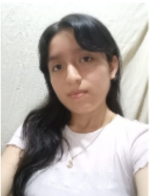

<h2 id="introduction">Capítulo I: Introducción</h2>
La introducción desempeña un papel fundamental en la estructuración y comprensión del proyecto, ya que establece el marco conceptual y contextual sobre el cual se desarrollará el trabajo. En esta sección inicial, se presenta una visión general que permite al lector comprender los objetivos principales que se desean alcanzar, así como los antecedentes que han llevado a la formulación del proyecto. También se delimita el alcance del mismo, es decir, hasta dónde se pretende llegar con el desarrollo de la propuesta. Asimismo, la introducción cumple la función de contextualizar la relevancia del proyecto en un entorno específico, destacando las razones que justifican su realización, los desafíos que se pretenden abordar y los beneficios esperados a partir de su implementación. En suma, esta parte inicial no solo informa, sino que también orienta y motiva al lector a profundizar en el contenido que se presentará a lo largo del documento.

<h3 id="startupProfile">1.1. Startup Profile</h3>

El perfil de la startup es un elemento fundamental para comprender la identidad y el rumbo estratégico de una empresa emergente. A través de este perfil, se revela su visión de futuro, sus valores esenciales y la propuesta de valor que la diferencia en el mercado competitivo.

En esta sección se describen los aspectos clave que definen a la startup, incluyendo su origen, las motivaciones que impulsaron su creación, el problema específico que busca solucionar y el enfoque innovador que emplea para posicionarse frente a sus competidores.

Asimismo, se analizan los objetivos a mediano y largo plazo, junto con las estrategias diseñadas para su crecimiento y consolidación dentro del sector. Entender estos elementos resulta vital para evaluar el potencial de la startup y el impacto que puede generar en su entorno.

<h4 id="descriptionStartup">1.1.1. Descripción de la Startup</h4>
<h4 id="teamProfile">1.1.2. Perfiles de integrantes del equipo</h4>

<table style="width: 100%; border-collapse: collapse;">
        <tr>
            <td style="width: 70%; border: 1px solid #FFF; padding: 10px; vertical-align: top;">
            
            </td>
            <td style="width: 50%; border: 1px solid #FFF; padding: 10px; vertical-align: top;">
                <strong>Renato Guillermo Calvo Yalan - (U202217053)</strong> - Ingeniería de Software  
                Tengo 21 años me llama la atención la cyberseguridad y la inteligencia artificial , mis principal fortaleza es el poder liderar a los grupos de trabajo además de que soy perseverante manejo algunos lenguajes de programación y quiero seguir aprendiendo.Espero poder hace un gran proyecto con mi grupo de manera exitosa.
            </td>
        </tr>
        <tr>
            <td style="width: 70%; border: 1px solid #FFF; padding: 10px; vertical-align: top;">
                
            </td>
            <td style="width: 50%; border: 1px solid #FFF; padding: 10px; vertical-align: top;">
                <strong>Billy - (U202116401)</strong> - Ingeniería de Software  
              Tengo 21 años, soy una persona tranquila, colaborativa y adaptable. Me gusta trabajar en equipo, aportando ideas y soluciones que contribuyan al desarrollo de los proyectos. Prefiero colaborar antes que liderar y suelo integrarme bien con distintos estilos de trabajo, lo que me permite adaptarme fácilmente al grupo.
Cuento con conocimientos en lenguajes de programación como C++ y Python. Siempre busco formas de hacer las cosas bien, de manera eficiente y sin complicaciones.
            </td>
        </tr>
        <tr>
            <td style="width: 70%; border: 1px solid #FFF; padding: 10px; vertical-align: top;">
                
            </td>
            <td style="width: 50%; border: 1px solid #FFF; padding: 10px; vertical-align: top;">
                <strong>Ariana Lizeth Ramírez Carrasco (U202312932)</strong> - Ingeniería de Software  
                Tengo 21 años y actualmente me estoy formando en la Universidad Peruana de Ciencias Aplicadas. Me considero una persona curiosa, tanto en el ámbito tecnológico como en la gestión y dirección de proyectos. Mis principales experiencias están relacionadas con el liderazgo y el manejo de equipos bajo marcos de trabajo ágiles, el análisis de datos y el desarrollo con enfoque web. Espero que mi compromiso y mis ganas de enseñar logren hacer que el proyecto tome un direccionamiento hacia el éxito.
            </td>
        </tr>
        <tr>
            <td style="width: 70%; border: 1px solid #FFF; padding: 10px; vertical-align: top;">
            
            </td>
            <td style="width: 50%; border: 1px solid #FFF; padding: 10px; vertical-align: top;">
                <strong>Miguel (U20)</strong> - Ingeniería de Software  
                ....
            </td>
        </tr>
        <tr>
            <td style="width: 70%; border: 1px solid #FFF; padding: 10px; vertical-align: top;">
                
            </td>
            <td style="width: 50%; border: 1px solid #FFF; padding: 10px; vertical-align: top;">
                <strong>Oscar - (U20)</strong> - Ingeniería de Software  
              .....
            </td>
        </tr>
</table>

<h3 id="solutionProfile">1.2. Solution Profile</h3>
<h4 id="antecedents">1.2.1. Antecedentes y problemática</h4>
<h4 id="leanUXProcess">1.2.2. Lean UX Process</h4>
<h5 id="problemStatement">1.2.2.1. Lean UX Problem Statements</h5>
<h5 id="assumptions">1.2.2.2. Lean UX Assumptions</h5>

**Business Assumptions:**
 

**Sabremos que hemos tenido éxito cuando observemos los siguientes cambios en el comportamiento de nuestros usuarios:**

- Aumento en el uso diario de la plataforma para registrar servicios y cargar evidencias.

- Reducción de incidencias derivadas de mantenimientos no planificados.

- Mayor participación de los familiares en el seguimiento del estado de salud de los adultos mayores.

- Uso frecuente de reportes médicos y estadísticas por parte de administradores para la toma de decisiones.

- Adopción sostenida de la aplicación por nuevas casas de reposo y familiares que se suscriben a los diferentes planes.

 

**User Assumptions:**

**1) ¿Quién es el usuario?**

Nuestros usuarios principales son:
- **Administradores y personal de casas de reposo**, que buscan optimizar la gestión clínica, reducir riesgos y fortalecer la comunicación con familiares.

- **Familiares y apoderados de adultos mayores**, que necesitan acceder de forma segura, rápida y transparente a la información de sus seres queridos.

Los administradores valoran herramientas que centralicen información, mejoren la coordinación y garanticen el cumplimiento de protocolos médicos.

Los familiares priorizan la facilidad de acceso, la claridad de la información y la confianza en el cuidado de sus adultos mayores.

 

**2) ¿Dónde encaja nuestro producto en su vida o trabajo?**

- Para los **administradores y personal de casas de reposo**, Veyra se convierte en un panel de control integral para la gestión de residentes, medicamentos, citas médicas y reportes de salud.

- Para los **familiares y apoderados de adultos mayores**, es un portal accesible que ofrece información actualizada, notificaciones oportunas y comunicación directa con la institución.

Veyra encaja como un puente digital entre familias y casas de reposo, mejorando la coordinación y reduciendo la incertidumbre.

 

**3) ¿Qué problemas tiene nuestro producto y cómo se pueden resolver?**

**Problemas detectados:**

- Falta de acceso rápido y seguro a la información médica de los adultos mayores.

- Dificultad de comunicación entre familiares y personal de las casas de reposo.

- Errores en la administración de medicamentos o seguimiento de tratamientos.

- Uso de registros físicos o sistemas desactualizados que generan pérdida de información.

**Solución propuesta:**

Veyra responde a estos desafíos mediante una plataforma digital centralizada que:

- Permite la gestión clínica completa y accesible en línea.

- Facilita la comunicación segura entre familiares y cuidadores.

- Automatiza recordatorios y alertas sobre medicamentos, citas y cambios en la salud.

- Ofrece reportes avanzados y estadísticas que ayudan a optimizar la toma de decisiones.

 

**4) ¿Qué características son más importantes?**

Características clave que deben estar presentes:

- Perfil clínico digital completo del adulto mayor (historial médico, alergias, medicamentos).

- Agenda médica con recordatorios automáticos.

- Acceso diferenciado y seguro para administradores y familiares.

- Reportes descargables y panel de estadísticas en tiempo real.

- Sistema de notificaciones y alertas sobre medicación y citas.

- Preparación para integrar dispositivos IoT como brazaletes de monitoreo de signos vitales.

 

**5) ¿Cómo debe verse nuestro producto y cómo comportarse?**

Veyra debe contar con una interfaz clara, moderna y amigable, pensada para dos públicos distintos:

- Para administradores y personal de casas de reposo: un panel robusto con herramientas de gestión clínica avanzada, reportes y opciones de configuración.

- Para familiares y apoderados de adultos mayores: una interfaz sencilla, accesible desde dispositivos móviles y escritorio, con navegación intuitiva y lenguaje claro.

La experiencia debe ser fluida, confiable y segura, priorizando la transparencia y la confianza en el cuidado de los adultos mayores.
 

<h5 id="hypothesisStatements">1.2.2.3. Lean UX Hypothesis Statements</h5>
<h5 id="uxCanvas">1.2.2.4. Lean UX Canvas</h5>

<h3 id="objectiveSegment">1.3. Segmentos objetivo</h3>
