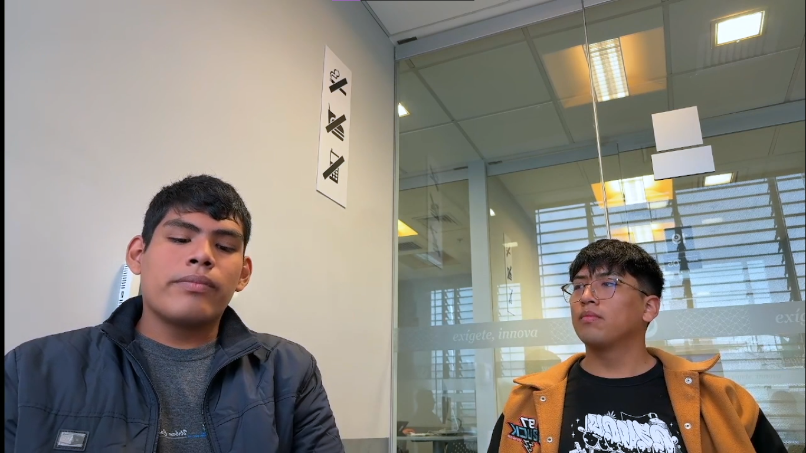
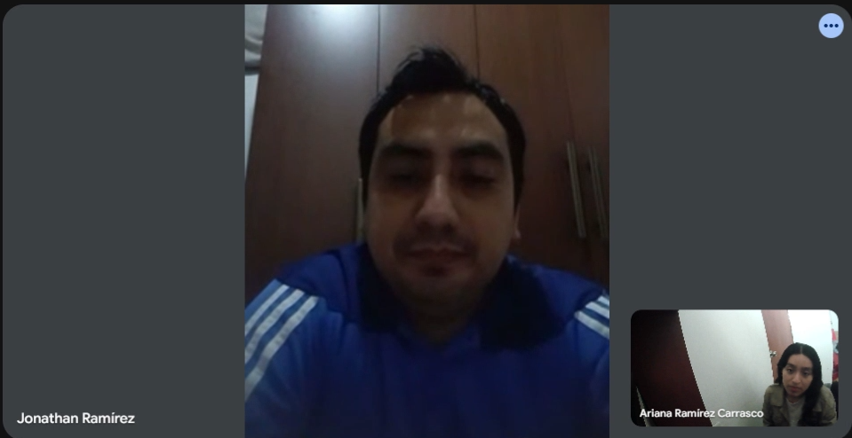
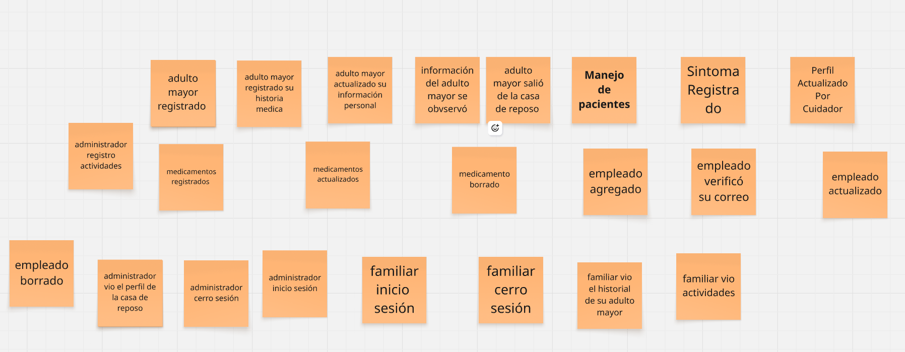

# Capítulo II: Requirements Elicitation & Analysis

## 2.1. Competidores
### 2.1.1. Análisis competitivo

<table border="1" cellpadding="8" cellspacing="0" style="border-collapse:collapse; width:100%; font-family:Arial, sans-serif;">
    <tr>
        <th colspan="7" style="background-color:#d9ead3;">Competitive Analysis Landscape</th>
    </tr>
    <tr>
        <td colspan="2" rowspan="2" style="background-color:#f4cccc;"><strong>¿Por qué llevar a cabo este análisis?</strong></td>
        <td colspan="5">¿Cómo se posiciona Veyra frente a sus competidores en cuanto a propuesta de valor, marketing, producto y estrategia?</td>
    </tr>
    <tr>
        <td colspan="5">
            Es un análisis comparativo que permite identificar fortalezas, debilidades, oportunidades y amenazas, así como entender mejor la posición del producto frente a otros actores relevantes del mercado.
        </td>
    </tr>
    <tr>
        <td colspan="3"></td>
        <td style="text-align:center;">
            <strong>Veyra</strong> 
            
        </td>
        <td style="text-align:center;">
            <strong>StoriiCare</strong> 
            
        </td>
        <td style="text-align:center;">
            <strong>SeniorSoft</strong> 
            
        </td>
        <td style="text-align:center;">
            <strong>CareCloud</strong> 
            
        </td>
    </tr>
    <tr>
        <td rowspan="2">Perfil</td>
        <td colspan="2">Overview</td>
        <td>Plataforma SaaS integral enfocada en la gestión de casas de reposo y conexión con familias en Perú y Latinoamérica.</td>
        <td>Software SaaS global para residencias de adultos mayores. Fundado en Reino Unido, con presencia en varios países.</td>
        <td>Software de escritorio dirigido a grandes clínicas y residencias geriátricas.</td>
        <td>Plataforma cloud completa para la gestión de salud general (EE.UU.). Ofrece EHR, facturación, scheduling y portal de pacientes.</td>
    </tr>
    <tr>
        <td colspan="2">Ventaja competitiva ¿Qué valor ofrece a los clientes?</td>
        <td>Especialización regional: Diseñada para normativas peruanas y latinas. Modelo de suscripción escalable. Acceso granular y bidireccional para familias. Preparación para IoT.</td>
        <td>Portal familiar muy desarrollado, integración de historias de vida y fotos, planificación de cuidados centrada en la persona.</td>
        <td>Gestión integral (historial clínico, facturación, inventario, camas). Potente para operaciones internas.</td>
        <td>Amplia suite de funcionalidades para gestión clínica y administrativa, integración con sistemas de pago.</td>
    </tr>
    <tr>
        <td rowspan="2">Perfil de Marketing</td>
        <td colspan="2">Mercado objetivo</td>
        <td>Mercado objetivo: Casas de reposo medianas/pequeñas y familias en LATAM.</td>
        <td>Mercado: Residencias en UK, US, Australia y Canadá. </td>
        <td>Mercado: Grandes clínicas geriátricas en mercados específicos.</td>
        <td>Mercado: Clínicas y centros de salud de todos los tamaños en EE.UU.</td>
    </tr>
    <tr>
        <td colspan="2">Estrategias de marketing</td>
        <td>Estrategia: Marketing digital, alianzas con asociaciones geriátricas, precios flexibles.</td>
        <td>Estrategia: Marketing de contenidos, redes sociales, testimonios.</td>
        <td>Estrategia: Ventas directas a grandes clientes.</td>
        <td>Estrategia: Ventas directas, marketing sector salud.</td>
    </tr>
    <tr>
        <td rowspan="3">Perfil de Producto</td>
        <td colspan="2">Productos & Servicios.</td>
        <td>Productos: Plataforma web y app móvil.</td>
        <td>Productos: Plataforma web, app para familias.</td>
        <td>Productos: Software de escritorio.</td>
        <td>Productos: CareCloud Central, Pulse, Companion.</td>
    </tr>
    <tr>
        <td colspan="2">Precios & Costos</td>
        <td>Precios: Planes modular (Gratuito, Estándar, Premium).</td>
        <td>Precios: Precios en libras/euros, no transparentes en web.</td>
        <td>Precios: No públicos, likely alto.</td>
        <td>Precios: Elevados (para mercado LATAM), cotización upon request.</td>
    </tr>
    <tr>
        <td colspan="2">Canales de distribución (Web y/o Móvil)</td>
        <td>Canales: Web, móvil (iOS/Android), API para integraciones.</td>
        <td>Canales: Web, móvil.</td>
        <td>Canales: Instalación local, sin acceso móvil nativo.</td>
        <td>Canales: Web, móvil.</td>
    </tr>
    <tr>
        <td rowspan="5">Análisis SWOT</td>
    <tr>
        <td colspan="2">Fortalezas</td>
        <td>Fortalezas: Especialización local, modelo escalable.</td>
        <td>Fortalezas: Enfoque en experiencia familiar, fácil de usar.</td>
        <td>Fortalezas: Funcionalidades de gestión sólidas.</td>
        <td>Fortalezas: Producto muy completo, robusto.</td>
    </tr>
    <tr>
        <td colspan="2">Debilidades</td>
        <td>Debilidades: Nuevo en el mercado.</td>
        <td>Debilidades: Poca adaptación a normativas latinoamericanas, precios no accesibles para mercado LATAM.</td>
        <td>Debilidades: Tecnología obsoleta (desktop), sin acceso para familias, sin movilidad.</td>
        <td>Debilidades: Precio muy alto para LATAM, no especializado en geriatría, complejo de implementar.</td>
    </tr>
    <tr>
        <td colspan="2">Oportunidades</td>
        <td>Oportunidades: Crecimiento del sector en LATAM.</td>
        <td>Oportunidades: Expansión a nuevos mercados.</td>
        <td>Oportunidades: Modernizar su plataforma.</td>
        <td>Oportunidades: Vender a grandes cadenas.</td>
    </tr>
    <tr>
        <td colspan="2">Amenazas</td>
        <td>Amenazas: Competidores globales con más recursos.</td>
        <td>Amenazas: Competencia local en cada región.</td>
        <td>Amenazas: Migración general a la nube.</td>
        <td>Amenazas: Soluciones más niche y económicas.</td>
    </tr>
</table>

### 2.1.2. Estrategias y tácticas frente a competidores
<table border="1" style="border-collapse: collapse; width: 100%;">
  <tr>
    <td>Estrategia</td><td>Tácticas Concretas </td>
  </tr>
  <tr>
    <td>Diferenciación por especialización </td><td>Desarrollar funcionalidades específicas para adultos mayores: alertas de medicación, dietas especiales, permisos diferenciados para familiares, e integración futura con sensores IoT. </td>
  </tr>
  <tr>
    <td>Enfoque en transparencia</td><td>Implementar acceso en tiempo real para familiares, reportes detallados, y notificaciones automáticas para generar confianza.</td>
  </tr>
  <tr>
    <td>Integración con normativas locales</td><td>Asegurar cumplimiento con regulaciones latinoamericanas (ej. estándares de cuidado en México ), lo que competidores globales como StoriiCare no hacen.</td>
  </tr>
  <tr>
    <td>Precios escalables y flexibles</td><td>Ofrecer planes modulares (Individual, Estándar, Premium) adaptados a distintos tamaños de residencias, con precios más competitivos que soluciones genéricas como CareCloud.</td>
  </tr>
</table>

## 2.2. Entrevistas

### 2.2.1. Diseño de entrevistas
<h4 id="Segment" >Segmento objetivo: Administrador de casa de reposo</h4> 
<h4 id="PreguntPersonal">Preguntas Personales:</h4> 
¿Cuál es su nombre?.

¿Cuál es su edad?.

¿Cuál es su rol en la casa de reposo?. 

¿Cuál es su experiencia en la industria de las casas de reposo?.

<h4 id="PreguntComplement">Preguntas Complementarias</h4>

¿Cómo se comunican actualmente con los familiares para informarles sobre el estado de salud, citas médicas o incidencias?.
<h4 id="PreguntEspe">Preguntas específicas:</h4> 

¿Cuáles son los mayores desafíos o inconvenientes que enfrentan en la gestión diaria de la información y el cuidado de los residentes?

¿Qué sistema o método utilizan actualmente para gestionar la información de los residentes (historias clínicas, medicamentos, citas)?  .

¿Qué funcionalidades consideran  esenciales en una plataforma de gestión?.
<h4 id="Segment" >Segmento objetivo: Familiares de adultos mayores </h4> 
<h4 id="PreguntPersonal">Preguntas Personales:</h4> 
¿Cuál es su nombre?.

¿Cuál es su edad?.

¿Cuál es su rol en la casa de reposo?. 

¿Cuál es su ocupación?.

¿Donde reside actualmente?.

<h4 id="PreguntESP">Preguntas específicas :</h4> 
¿Qué dificultades ha tenido para acceder a información sobre la salud o atención de su familiar?

¿Qué tipo de información le gustaría poder consultar de manera más frecuente y organizada? 

 ¿Qué tan cómodo se sentiría  utilizando plataformas web para consultar información médica sobre su aduelto mayor?

 Cuando ocurre una urgencia médica, ¿cómo suele enterarse y cuánto tiempo demora en recibir la notificación?
 
¿Qué aspectos le generarían más confianza al usar una plataforma de este tipo? 

### 2.2.2. Registro de entrevistas

En esta sección presentamos los registros de las entrevistas que hicimos para cada segmento objetivo de nuestra aplicación.

**Segmento 1: Administradores de casas de reposo** 

<table>
<colgroup>
</colgroup>
<thead>
  <tr>
    <th colspan="2">Entrevista #1 </th>
  </tr>
</thead>
<tbody>
  <tr>
    <td>Nombre</td>
    <td>Milagros Beatriz</td>
  </tr>
  <tr>
    <td>Apellidos</td>
    <td>Caycho Mata</td>
  </tr>
  <tr>
    <td>Edad</td>
    <td>59 años</td>
  </tr>
  <tr>
    <td>Rol</td>
    <td>Gerente administrativa</td>
  </tr>
  <tr>
    <td>Evidencia</td>
    <td>
</td>
  </tr>
  <tr>
    <td>Link</td>
    <td>
<a target="_blank"  href="https://upcedupe-my.sharepoint.com/:v:/g/personal/u202312932_upc_edu_pe/EaQiu80hMRRHqX6_496l0K4BlrFUbLLE_l3BdRLyircE6Q?nav=eyJyZWZlcnJhbEluZm8iOnsicmVmZXJyYWxBcHAiOiJTdHJlYW1XZWJBcHAiLCJyZWZlcnJhbFZpZXciOiJTaGFyZURpYWxvZy1MaW5rIiwicmVmZXJyYWxBcHBQbGF0Zm9ybSI6IldlYiIsInJlZmVycmFsTW9kZSI6InZpZXcifX0%3D&e=iLdPe9" title="Title">Microsoft Stream
</td>
  </tr>
  <tr>
    <td>Duracion </td>
    <td>0:00 min - 10:35 min</td>
  </tr>
  <tr>
    <td>Resumen</td>
    <td>
		La entrevistada tiene 26 años de experiencia en la gestión de casas de reposo. Su rol combina labores administrativas con la supervisión del personal asistencial. La comunicación con familiares se realiza de forma permanente por teléfono, WhatsApp y videollamadas. Entre los principales desafíos, destacó la pandemia, que exigió un control minucioso y protocolos estrictos de bioseguridad. La gestión de la información se lleva en expedientes físicos y bases de datos básicas, donde registran evolución del paciente, medicación, higiene, actividades recreativas y útiles de aseo. Mantienen comunicación constante con las familias e incentivan su participación.
</td>
  </tr>
</tbody>
</table>

<table>
<colgroup>
</colgroup>
<thead>
  <tr>
    <th colspan="2">Entrevista #2 </th>
  </tr>
</thead>
<tbody>
  <tr>
    <td>Nombre</td>
    <td>Oscar Alberto</td>
  </tr>
  <tr>
    <td>Apellidos</td>
    <td>Navarrete Mendoza</td>
  </tr>
  <tr>
    <td>Edad</td>
    <td>54 años</td>
  </tr>
  <tr>
    <td>Rol</td>
    <td>Gerente general de residencia geriátrica</td>
  </tr>
  <tr>
    <td>Evidencia</td>
    <td>
</td>
  </tr>
  <tr>
    <td>Link</td>
    <td>
<a target="_blank"  href="https://upcedupe-my.sharepoint.com/:v:/g/personal/u202312932_upc_edu_pe/EaQiu80hMRRHqX6_496l0K4BlrFUbLLE_l3BdRLyircE6Q?nav=eyJyZWZlcnJhbEluZm8iOnsicmVmZXJyYWxBcHAiOiJTdHJlYW1XZWJBcHAiLCJyZWZlcnJhbFZpZXciOiJTaGFyZURpYWxvZy1MaW5rIiwicmVmZXJyYWxBcHBQbGF0Zm9ybSI6IldlYiIsInJlZmVycmFsTW9kZSI6InZpZXcifX0%3D&e=iLdPe9" title="Title">Microsoft Stream
</td>
  </tr>
  <tr>
    <td>Duracion </td>
    <td>10:35 min - 24:55 min</td>
  </tr>
  <tr>
    <td>Resumen</td>
    <td>
		El entrevistado, con 21 años de experiencia, dirige tres casas de reposo. La comunicación con familiares se realiza mediante grupos de WhatsApp, lo que permite informar de forma inmediata y a todos los miembros a la vez. Señala que el mayor inconveniente está en la rotación de personal, más que en la organización interna. Actualmente gestionan la información en formato físico (historias clínicas, contratos, tarjetas de medicación), mientras que los temas administrativos los maneja en Excel, donde lleva un control detallado de gastos e ingresos. Considera necesario digitalizar el sistema para evitar pérdida de documentos y optimizar procesos. Para una plataforma de gestión, sugiere incluir secciones simples para contratos, historias clínicas, informes médicos, archivos adjuntos y un módulo de información básica accesible a los familiares.
</td>
  </tr>
</tbody>
</table>

<table>
<colgroup>
</colgroup>
<thead>
  <tr>
    <th colspan="2">Entrevista #3 </th>
  </tr>
</thead>
<tbody>
  <tr>
    <td>Nombre</td>
    <td>Recoba Funciyu</td>
  </tr>
  <tr>
    <td>Apellidos</td>
    <td>Valenzuela Huaynillo</td>
  </tr>
  <tr>
    <td>Edad</td>
    <td>27 años</td>
  </tr>
  <tr>
    <td>Distrito</td>
    <td>Lima</td>
  </tr>
  <tr>
    <td>Evidencia</td>
    <td>
</td>
  </tr>
  <tr>
    <td>Link</td>
    <td>
<a target="_blank"  href="https://upcedupe-my.sharepoint.com/:v:/g/personal/u202312932_upc_edu_pe/EaQiu80hMRRHqX6_496l0K4BlrFUbLLE_l3BdRLyircE6Q?nav=eyJyZWZlcnJhbEluZm8iOnsicmVmZXJyYWxBcHAiOiJTdHJlYW1XZWJBcHAiLCJyZWZlcnJhbFZpZXciOiJTaGFyZURpYWxvZy1MaW5rIiwicmVmZXJyYWxBcHBQbGF0Zm9ybSI6IldlYiIsInJlZmVycmFsTW9kZSI6InZpZXcifX0%3D&e=iLdPe9" title="Title">Microsoft Stream
</td>
  </tr>
  <tr>
    <td>Duracion </td>
    <td>24:55 min - 30:21 min</td>
  </tr>
  <tr>
    <td>Resumen</td>
    <td>
		El entrevistado señaló que el principal desafío es personalizar la atención, ya que cada adulto mayor tiene necesidades diferentes. En comunicación, un problema frecuente es que los familiares no siempre están disponibles. Actualmente gestionan la información en un sistema propio de la casa de reposo, aunque este resulta complejo y presenta limitaciones, especialmente en la gestión de recetas médicas, que no siempre están integradas. Considera esencial que una plataforma de gestión sea amplia, integrando todos los aspectos médicos y administrativos en un solo lugar, incluyendo recetas externas. También destacó la importancia de notificaciones claras y rápidas a los familiares.
</td>
  </tr>
</tbody>
</table>

**Segmento 2: Familiares de adultos mayores** 

<table>
<colgroup>
</colgroup>
<thead>
  <tr>
    <th colspan="2">Entrevista #1 </th>
  </tr>
</thead>
<tbody>
  <tr>
    <td>Nombre</td>
    <td>Ivonne</td>
  </tr>
  <tr>
    <td>Apellidos</td>
    <td>Madrid Ruisco</td>
  </tr>
  <tr>
    <td>Edad</td>
    <td>49 años</td>
  </tr>
  <tr>
    <td>Distrito</td>
    <td>Sullana</td>
  </tr>
  <tr>
    <td>Evidencia</td>
    <td>
</td>
  </tr>
  <tr>
    <td>Link</td>
    <td>
<a target="_blank"  href="https://upcedupe-my.sharepoint.com/:v:/g/personal/u202312932_upc_edu_pe/EaQiu80hMRRHqX6_496l0K4BlrFUbLLE_l3BdRLyircE6Q?nav=eyJyZWZlcnJhbEluZm8iOnsicmVmZXJyYWxBcHAiOiJTdHJlYW1XZWJBcHAiLCJyZWZlcnJhbFZpZXciOiJTaGFyZURpYWxvZy1MaW5rIiwicmVmZXJyYWxBcHBQbGF0Zm9ybSI6IldlYiIsInJlZmVycmFsTW9kZSI6InZpZXcifX0%3D&e=iLdPe9" title="Title">Microsoft Stream
</td>
  </tr>
  <tr>
    <td>Duracion </td>
    <td>30:21 min - 32:48 min</td>
  </tr>
  <tr>
    <td>Resumen</td>
    <td>
		La entrevistada, comerciante de Sullana, señala que le gustaría tener información del tratamiento y evolucion de su familiar mientras está trabajando. También menciona que cuando ocurre una urgencia médica, nunca se entera de lo sucedido a tiempo. Finalmente, le gustaría que la plataforma sea intuitiva y sencillo de usar.
</td>
  </tr>
</tbody>
</table>

<table>
<colgroup>
</colgroup>
<thead>
  <tr>
    <th colspan="2">Entrevista #2 </th>
  </tr>
</thead>
<tbody>
  <tr>
    <td>Nombre</td>
    <td>Leo Gerardo</td>
  </tr>
  <tr>
    <td>Apellidos</td>
    <td>Gómez Ferrua</td>
  </tr>
  <tr>
    <td>Edad</td>
    <td>30 años</td>
  </tr>
  <tr>
    <td>Distrito</td>
    <td>Chorrillos</td>
  </tr>
  <tr>
    <td>Evidencia</td>
    <td>
</td>
  </tr>
  <tr>
    <td>Link</td>
    <td>
<a target="_blank"  href="https://upcedupe-my.sharepoint.com/:v:/g/personal/u202312932_upc_edu_pe/EaQiu80hMRRHqX6_496l0K4BlrFUbLLE_l3BdRLyircE6Q?nav=eyJyZWZlcnJhbEluZm8iOnsicmVmZXJyYWxBcHAiOiJTdHJlYW1XZWJBcHAiLCJyZWZlcnJhbFZpZXciOiJTaGFyZURpYWxvZy1MaW5rIiwicmVmZXJyYWxBcHBQbGF0Zm9ybSI6IldlYiIsInJlZmVycmFsTW9kZSI6InZpZXcifX0%3D&e=iLdPe9" title="Title">Microsoft Stream
</td>
  </tr>
  <tr>
    <td>Duracion </td>
    <td>32:48 min - 38:59 min</td>
  </tr>
  <tr>
    <td>Resumen</td>
    <td>
		El entrevistado, señaló que tiene dificultades para obtener información clara y oportuna, pues debe llamar varias veces y recibe datos breves o inconsistentes. Le gustaría acceder de forma organizada al estado de salud, medicación, citas, resultados médicos y reportes de alimentación o actividades. Indicó que se sentiría cómodo usando una plataforma web segura, fácil y accesible desde cualquier dispositivo. Sobre las urgencias, comentó que hoy se entera solo por llamadas, a veces con demoras, y preferiría notificaciones inmediatas por varios canales. Finalmente, resaltó que confiaría en la plataforma si garantiza seguridad, acceso restringido, información actualizada, comunicación directa con el personal y protocolos claros en emergencias.

</td>
  </tr>
</tbody>
</table>

<table>
<colgroup>
</colgroup>
<thead>
  <tr>
    <th colspan="2">Entrevista #3 </th>
  </tr>
</thead>
<tbody>
  <tr>
    <td>Nombre</td>
    <td>Jonathan</td>
  </tr>
  <tr>
    <td>Apellidos</td>
    <td>Ramirez</td>
  </tr>
  <tr>
    <td>Edad</td>
    <td>40 años</td>
  </tr>
  <tr>
    <td>Distrito</td>
    <td>Lima</td>
  </tr>
  <tr>
    <td>Evidencia</td>
    <td>
</td>
  </tr>
  <tr>
    <td>Link</td>
    <td>
<a target="_blank"  href="https://upcedupe-my.sharepoint.com/:v:/g/personal/u202312932_upc_edu_pe/EaQiu80hMRRHqX6_496l0K4BlrFUbLLE_l3BdRLyircE6Q?nav=eyJyZWZlcnJhbEluZm8iOnsicmVmZXJyYWxBcHAiOiJTdHJlYW1XZWJBcHAiLCJyZWZlcnJhbFZpZXciOiJTaGFyZURpYWxvZy1MaW5rIiwicmVmZXJyYWxBcHBQbGF0Zm9ybSI6IldlYiIsInJlZmVycmFsTW9kZSI6InZpZXcifX0%3D&e=iLdPe9" title="Title">Microsoft Stream
</td>
  </tr>
  <tr>
    <td>Duracion </td>
    <td>38:59 min - 41:57 min</td>
  </tr>
  <tr>
    <td>Resumen</td>
    <td>
		El entrevistado señaló que enfrenta dificultades para acceder a información sobre la salud de su familiar, ya que debe esperar llamadas de la casa de reposo y muchas veces la información no llega de manera inmediata, lo que le genera preocupación, sobre todo en temas médicos o de medicación. Expresó que le gustaría consultar de forma organizada la medicación diaria, informes de chequeos médicos, citas programadas y cambios en el tratamiento. Indicó sentirse cómodo utilizando plataformas web para este propósito, ya que está familiarizado con herramientas digitales en su trabajo y considera que centralizar la información sería de gran ayuda. Respecto a las urgencias médicas, comentó que suele enterarse por teléfono, pero no siempre de inmediato, lo cual le provoca ansiedad al no poder estar informado en tiempo real. Finalmente, afirmó que una plataforma de este tipo le generaría confianza si es segura, rápida, confiable, con información actualizada y con alertas instantáneas ante urgencias o cambios en la salud de su mamá.
</td>
  </tr>
</tbody>
</table>

### 2.2.3. Análisis de entrevistas

El objetivo de las entrevistas fue identificar los problemas, necesidades y expectativas de los **administradores de casas de reposo** y los **familiares de adultos mayores**, con el fin de validar hipótesis sobre la comunicación, gestión de información y funciones necesarias en una aplicación que facilite la coordinación y el cuidado.

### Síntesis de hallazgos  

#### Canales de comunicación  
Actualmente predominan las **llamadas telefónicas (50%)** y **WhatsApp (33.3%)**, mientras que las videollamadas son poco frecuentes (16.7%). Esto indica la necesidad de centralizar la comunicación en un único sistema confiable.  

**Tabla de resultados:**

| Canal         | Porcentaje |
|---------------|------------|
| Llamadas      | 50%        |
| WhatsApp      | 33.3%      |
| Videollamadas | 16.7%      |

#### Gestión de información  
Un **33.3% aún depende de papel o Excel**, un **16.7% usa sistemas propios** y el resto emplea métodos variados. Esto evidencia falta de estandarización en la gestión de datos.  

**Tabla de resultados:**

| Método           | Porcentaje |
|------------------|------------|
| Papel/Excel      | 33.3%      |
| Sistema propio   | 16.7%      |
| Otros            | 50%        |

#### Problemas más frecuentes  
Los principales problemas reportados fueron:  

- **Urgencias sin aviso (50%)**  
- **Procesos manuales y duplicados (33.3%)**  
- **Rotación de personal y dificultad de continuidad (16.7%)**  
- **Sistemas complejos que dificultan el uso (16.7%)**  

**Tabla de resultados:**

| Problema                      | Porcentaje |
|-------------------------------|------------|
| Urgencias sin aviso           | 50%        |
| Procesos manuales/duplicados  | 33.3%      |
| Rotación de personal          | 16.7%      |
| Sistemas complejos            | 16.7%      |

#### Funciones más valoradas  
Las funciones que los entrevistados consideran más útiles son:  

- **Acceso organizado a la información (83.3%)**  
- **Notificaciones inmediatas (66.7%)**  
- **Interfaz sencilla (50%)**  
- **Módulos para contratos y documentos (16.7%)**  

**Tabla de resultados:**

| Función                        | Porcentaje |
|--------------------------------|------------|
| Acceso organizado a la info    | 83.3%      |
| Notificaciones inmediatas      | 66.7%      |
| Interfaz sencilla              | 50%        |
| Módulos contratos/documentos   | 16.7%      |

### Conclusiones  

1. Existe una **fuerte necesidad de digitalización**: todavía se depende de llamadas, papel o Excel, lo que genera ineficiencia.  
2. Los problemas más críticos se relacionan con **la falta de aviso en urgencias y la duplicidad de procesos**, lo que impacta directamente en la seguridad de los adultos mayores.  
3. Las soluciones más esperadas giran en torno a **notificaciones automáticas, centralización de información y facilidad de uso**, lo que indica que la aplicación debe ser intuitiva y accesible.  
4. Se valida la hipótesis de que tanto administradores como familiares requieren un sistema **integrado y confiable** para comunicación, gestión de información y alertas inmediatas.  

## 2.3. Needfinding

### 2.3.1. User Personas

A partir del análisis de entrevistas y la recolección de información sobre las dinámicas en casas de reposo, se identificaron los principales perfiles de usuarios que interactúan directamente con la solución Veyra. Estos perfiles representan los segmentos clave para el sistema, ya que concentran tanto la necesidad de gestión operativa como la necesidad de acceso confiable a información médica en tiempo real. La construcción de los *User Persona* permite al equipo de desarrollo comprender mejor sus motivaciones, frustraciones y hábitos, lo que resulta esencial para diseñar funcionalidades adecuadas y experiencias de usuario efectivas.

**1) Segmento 1: Administradores de casas de reposo**

Para los administradores se elaboró el User Persona **Recoba Funciyu Valenzuela Huaynillo**. Se consideraron factores como su edad, rol en la gestión de una casa de reposo, experiencia en la administración del cuidado de adultos mayores y su necesidad de optimizar procesos de comunicación y gestión de la información. Sus principales frustraciones giran en torno a la falta de un sistema centralizado para el control de historias clínicas, medicamentos y citas médicas, lo que genera demoras en la comunicación con familiares y dificultades en el seguimiento de residentes. Asimismo, se tomó en cuenta su familiaridad con herramientas digitales básicas y la necesidad de contar con una plataforma moderna, intuitiva y segura que le permita centralizar toda la información de manera ágil y confiable.

 

**2) Segmento 2: Familiares de adultos mayores**

Para los familiares se elaboró el User Persona **Yvonne Madrid Risco**. Se consideraron aspectos como su edad, ocupación y su rol como familiar de un adulto mayor residente en una casa de reposo. Sus principales motivaciones están orientadas a mantenerse informada en tiempo real sobre el estado de salud, el tratamiento y la administración de medicamentos de su familiar, incluso mientras desarrolla sus actividades laborales. Entre sus frustraciones se encuentra la falta de información clara, la demora en las notificaciones sobre urgencias y la necesidad de depender de llamadas o visitas presenciales. Su perfil refleja una predisposición positiva hacia el uso de soluciones digitales, siempre que estas sean rápidas, confiables y fáciles de utilizar.

<h3>2.3.2. User Task Matrix</h3>

<table border="1" cellpadding="8" cellspacing="0" style="border-collapse:collapse; width:100%; font-family:Arial, sans-serif; text-align:center;">
  <thead>
    <tr style="background:#eee; font-weight:bold;">
      <th rowspan="2">Tarea</th>
      <th colspan="2" style="background-color:#d9ead3;">Administrador (Recoba)</th>
      <th colspan="2" style="background-color:#cfe2f3;">Familiar (Yvonne)</th>
    </tr>
    <tr style="background:#f7f7f7;">
      <th>Frecuencia</th>
      <th>Importancia</th>
      <th>Frecuencia</th>
      <th>Importancia</th>
    </tr>
  </thead>
  <tbody>
    <tr>
      <td style="text-align:left;">Registrar y actualizar residentes</td>
      <td>Often</td><td>High</td>
      <td>—</td><td>—</td>
    </tr>
    <tr>
      <td style="text-align:left;">Programar citas y agenda médica</td>
      <td>Often</td><td>High</td>
      <td>—</td><td>—</td>
    </tr>
    <tr>
      <td style="text-align:left;">Generar / descargar reportes clínicos</td>
      <td>Occasionally</td><td>High</td>
      <td>Occasionally</td><td>Medium</td>
    </tr>
    <tr>
      <td style="text-align:left;">Notificar a familiares sobre cambios</td>
      <td>Occasionally</td><td>High</td>
      <td>—</td><td>—</td>
    </tr>
    <tr>
      <td style="text-align:left;">Coordinar al personal de cuidado</td>
      <td>Occasionally</td><td>Medium</td>
      <td>—</td><td>—</td>
    </tr>
    <tr>
      <td style="text-align:left;">Consultar historial médico digital</td>
      <td>—</td><td>—</td>
      <td>Often</td><td>High</td>
    </tr>
    <tr>
      <td style="text-align:left;">Recibir notificaciones en tiempo real</td>
      <td>—</td><td>—</td>
      <td>Often</td><td>High</td>
    </tr>
    <tr>
      <td style="text-align:left;">Revisar agenda y recordatorios</td>
      <td>—</td><td>—</td>
      <td>Often</td><td>High</td>
    </tr>
    <tr>
      <td style="text-align:left;">Comunicarse con el personal de cuidado</td>
      <td>—</td><td>—</td>
      <td>Occasionally</td><td>High</td>
    </tr>
  </tbody>
</table>

### 2.3.3. User Journey Mapping

<strong>Segmento 1 – Administrador de casa de reposo (Recoba Funciyu Valenzuela)</strong>

<table border="1" cellpadding="8" cellspacing="0" style="border-collapse:collapse; width:100%; font-family:Arial, sans-serif; text-align:center;">
  <tr style="background-color:#d9ead3;">
    <th></th>
    <th>AWARENESS</th>
    <th>CONSIDERATION</th>
    <th>PURCHASE</th>
    <th>SERVICE</th>
    <th>LOYALTY</th>
  </tr>
  <tr>
    <td><strong>CUSTOMER ACTIONS</strong></td>
    <td>Detecta la necesidad de digitalizar la gestión de residentes y mejorar la comunicación con familiares.</td>
    <td>Evalúa si Veyra cumple con las normativas locales y se adapta a su flujo de trabajo.</td>
    <td>Se registra en Veyra y configura su primera casa de reposo.</td>
    <td>Usa el panel para gestionar residentes, citas y generar reportes.</td>
    <td>Se beneficia de la eficiencia lograda, mantiene su suscripción y recomienda la plataforma.</td>
  </tr>
  <tr>
    <td><strong>TOUCH POINTS</strong></td>
    <td>Publicidad en redes sociales, recomendaciones de colegas, ferias del sector salud.</td>
    <td>Webinars, demo guiada, comparativa con métodos tradicionales.</td>
    <td>Sitio web de Veyra, registro en línea, onboarding inicial.</td>
    <td>Panel web, soporte técnico, capacitaciones online.</td>
    <td>Comunidad de usuarios, reportes avanzados, comunicación directa con soporte.</td>
  </tr>
  <tr>
    <td><strong>CUSTOMER EXPERIENCE</strong></td>
    <td>🤔</td>
    <td>😐</td>
    <td>😅</td>
    <td>😃</td>
    <td>😄</td>
  </tr>
  <tr>
    <td><strong>PAIN POINTS</strong></td>
    <td>Duda en abandonar su sistema manual con Excel y papeles.</td>
    <td>No sabe si todo su personal se adaptará al nuevo sistema.</td>
    <td>Al inicio le cuesta cargar información médica al sistema.</td>
    <td>Necesita generar reportes rápidos y confiables para familiares.</td>
    <td>Quiere personalización de métricas e integración futura con IoT.</td>
  </tr>
  <tr>
    <td><strong>SOLUTIONS</strong></td>
    <td>Mostrar casos de éxito locales y testimonios de otros administradores.</td>
    <td>Ofrecer capacitaciones y soporte en la migración de datos.</td>
    <td>Importación asistida de historiales médicos y residentes.</td>
    <td>Reportes automáticos y notificaciones configurables.</td>
    <td>Módulos avanzados, precios escalables y comunidad de soporte.</td>
  </tr>
</table>

 

<strong>Segmento 2 – Familiar de adulto mayor (Yvonne Madrid Risco)</strong>

<table border="1" cellpadding="8" cellspacing="0" style="border-collapse:collapse; width:100%; font-family:Arial, sans-serif; text-align:center;">
  <tr style="background-color:#cfe2f3;">
    <th></th>
    <th>AWARENESS</th>
    <th>CONSIDERATION</th>
    <th>PURCHASE</th>
    <th>SERVICE</th>
    <th>LOYALTY</th>
  </tr>
  <tr>
    <td><strong>CUSTOMER ACTIONS</strong></td>
    <td>Se da cuenta de que no tiene información en tiempo real sobre la salud de su familiar.</td>
    <td>Evalúa si la plataforma le permite acceder de forma fácil y rápida a reportes médicos.</td>
    <td>Descarga la app Veyra e ingresa con el código asignado por el administrador.</td>
    <td>Consulta el historial, recibe notificaciones y accede a la agenda de su familiar.</td>
    <td>Usa la app con frecuencia, confía en la información recibida y recomienda la plataforma.</td>
  </tr>
  <tr>
    <td><strong>TOUCH POINTS</strong></td>
    <td>Recomendación del administrador, publicidad digital, boca a boca entre familiares.</td>
    <td>Demo en la web, video explicativo de funciones familiares.</td>
    <td>App móvil de Veyra (iOS/Android), registro con credenciales.</td>
    <td>Interfaz móvil con notificaciones push y acceso a reportes.</td>
    <td>Soporte en línea, comunidad de usuarios, nuevas funcionalidades.</td>
  </tr>
  <tr>
    <td><strong>CUSTOMER EXPERIENCE</strong></td>
    <td>😢</td>
    <td>🤔</td>
    <td>🙂</td>
    <td>😃</td>
    <td>😄</td>
  </tr>
  <tr>
    <td><strong>PAIN POINTS</strong></td>
    <td>Frustración por depender de llamadas para obtener información.</td>
    <td>Duda si la información será confiable y segura.</td>
    <td>Le cuesta familiarizarse con la app al inicio.</td>
    <td>Desea información clara y notificaciones inmediatas.</td>
    <td>Quiere más funciones como exportar reportes o seguimiento personalizado.</td>
  </tr>
  <tr>
    <td><strong>SOLUTIONS</strong></td>
    <td>Mostrar la seguridad de la plataforma y testimonios de otros familiares.</td>
    <td>Explicar beneficios con ejemplos claros de uso.</td>
    <td>Onboarding simple y tutorial interactivo en la app.</td>
    <td>Alertas en tiempo real y reportes visuales fáciles de entender.</td>
    <td>Lanzamiento de nuevas funcionalidades y precios accesibles.</td>
  </tr>
</table>

### 2.3.4. Empathy Mapping

Para la elaboración de los *Empathy Maps*, el equipo partió del conocimiento y observaciones recolectadas durante el análisis de los User Persona. Se colocó al centro de cada mapa al usuario correspondiente (Recoba Funciyu Valenzuela y Yvonne Madrid Risco) y se respondieron las preguntas claves sobre su entorno, emociones, comportamientos y necesidades.

**1) Segmento 1: Administradores de casas de reposo**

En este mapa se analizó a Recoba Funciyu Valenzuela, un administrador joven con la responsabilidad de garantizar la calidad del servicio en una casa de reposo. Se identificó que piensa constantemente en la necesidad de organizar y centralizar la información médica y operativa de los residentes, ya que le preocupa que los procesos manuales generen errores y retrasos. Escucha las quejas de familiares por falta de comunicación oportuna y observa cómo sus colegas deben invertir tiempo en tareas repetitivas en lugar de enfocarse en el bienestar de los residentes. Recoba expresa la necesidad de contar con una solución moderna que mejore la gestión y actúa implementando estrategias de control básicas con las herramientas disponibles, aunque estas son limitadas. Su dolor principal es la sobrecarga administrativa y la falta de un sistema ágil, mientras que su ganancia esperada es lograr eficiencia en la gestión, confianza de los familiares y un mejor control de la información.

 

**2) Segmento 2: Familiares de adultos mayores**

En este mapa se analizó a Yvonne Madrid Risco, una comerciante que busca mantenerse informada sobre el estado de salud de su familiar mientras desarrolla sus actividades diarias. Ella piensa en la tranquilidad que le daría tener acceso rápido y claro a la evolución médica, medicación y tratamientos de su ser querido. Escucha a otros familiares compartir la frustración por la falta de información y observa que depender de llamadas o visitas no siempre es suficiente. Yvonne suele expresar la necesidad de contar con una aplicación confiable y fácil de usar, y actúa buscando cualquier canal de comunicación disponible para mantenerse al tanto. Su dolor principal es la incertidumbre y la demora en recibir notificaciones sobre emergencias, mientras que su ganancia esperada es tener confianza, tranquilidad y control al poder consultar la información médica en tiempo real desde cualquier lugar.

## 2.4. Big Picture Event Storming

## 2.5. Ubiquitous Language

In this project, whose main objective is to improve transparency and efficiency in elderly care within nursing homes through a web platform, 
the following <strong>ubiquitous language</strong> has been defined to ensure clarity and consistency among users, developers, and stakeholders:

<table border="1" style="border-collapse: collapse; width: 100%;">
  <tr>
    <td><strong>Term</strong></td>
    <td><strong>Definition</strong></td>
  </tr>
  <tr>
    <td>Resident</td>
    <td>Elderly person living in a nursing home whose clinical care, activities, and well-being are managed on the platform.</td>
  </tr>
  <tr>
    <td>Family Member</td>
    <td>Authorized user who accesses the resident’s information, receives notifications, and participates in the supervision of care.</td>
  </tr>
  <tr>
    <td>Administrator</td>
    <td>Responsible for the overall management of the nursing home; manages residents, staff, subscription plans, and reports.</td>
  </tr>
  <tr>
    <td>Care Staff</td>
    <td>Doctors, nurses, or caregivers who record health data, treatments, appointments, and observations in the platform.</td>
  </tr>
  <tr>
    <td>Digital Medical Record</td>
    <td>Centralized record with the resident’s medical information (diagnoses, allergies, medications, check-ups, notes).</td>
  </tr>
  <tr>
    <td>Treatment</td>
    <td>Prescribed medical plan that may include medications, therapies, and periodic appointments.</td>
  </tr>
  <tr>
    <td>Medical Schedule</td>
    <td>Set of appointments, reminders, and scheduled activities for the resident; accessible to staff and family members.</td>
  </tr>
  <tr>
    <td>Medical Alert</td>
    <td>Automatic notification generated by the system (e.g., medication reminder, emergency, upcoming appointment).</td>
  </tr>
  <tr>
    <td>Clinical Report</td>
    <td>Digital document automatically generated with consolidated information on the resident’s care and progress.</td>
  </tr>
  <tr>
    <td>Notification</td>
    <td>Message sent to family members or staff about relevant events (medication, visits, clinical changes).</td>
  </tr>
  <tr>
    <td>Control Panel</td>
    <td>Main view for administrators and staff, showing metrics, reports, and the overall status of residents.</td>
  </tr>
  <tr>
    <td>Subscription Plan</td>
    <td>Access modality to the platform (Individual, Standard, Premium) that defines available functionalities depending on the residence.</td>
  </tr>
  <tr>
    <td>Session</td>
    <td>Authenticated period in which a user (administrator, family member, or staff) accesses the system with secure credentials.</td>
  </tr>
  <tr>
    <td>Family Dashboard</td>
    <td>Simplified interface for family members, where they can check health status, appointments, and relevant notifications.</td>
  </tr>
  <tr>
    <td>Roles and Permissions</td>
    <td>Validations that ensure each profile (administrator, staff, family) only accesses the operations they are authorized for.</td>
  </tr>
</table>

<strong>Expected benefits of the ubiquitous language:</strong>

<ul>
  <li>Facilitates communication among developers, users, and system administrators.</li>
  <li>Improves understanding of the system’s main functionalities.</li>
  <li>Avoids ambiguities and interpretation errors in design and implementation.</li>
  <li>Ensures consistency in documentation, interfaces, and project processes.</li>
</ul>

