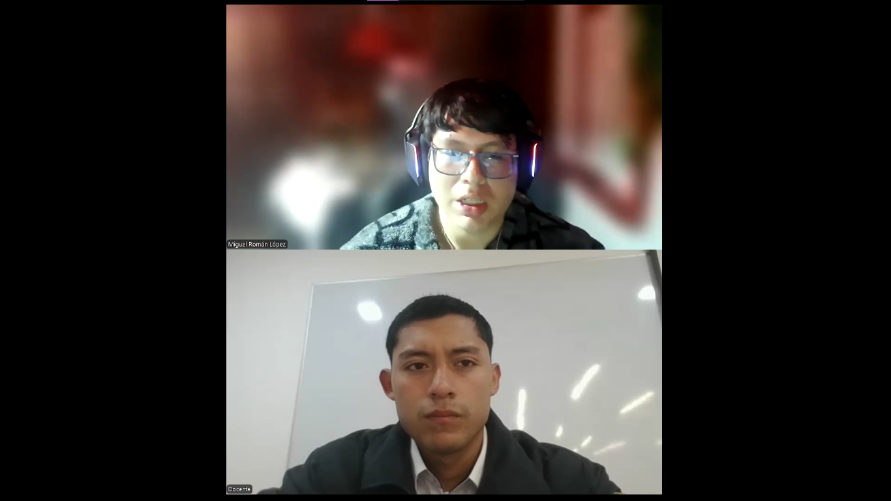

# Capítulo II: Requirements Elicitation & Analysis

## 2.1. Competidores
### 2.1.1. Análisis competitivo

<table border="1" cellpadding="8" cellspacing="0" style="border-collapse:collapse; width:100%; font-family:Arial, sans-serif;">
    <tr>
        <th colspan="7" style="background-color:#d9ead3;">Competitive Analysis Landscape</th>
    </tr>
    <tr>
        <td colspan="2" rowspan="2" style="background-color:#f4cccc;"><strong>¿Por qué llevar a cabo este análisis?</strong></td>
        <td colspan="5">¿Cómo se posiciona Veyra frente a sus competidores en cuanto a propuesta de valor, marketing, producto y estrategia?</td>
    </tr>
    <tr>
        <td colspan="5">
            Es un análisis comparativo que permite identificar fortalezas, debilidades, oportunidades y amenazas, así como entender mejor la posición del producto frente a otros actores relevantes del mercado.
        </td>
    </tr>
    <tr>
        <td colspan="3"></td>
        <td style="text-align:center;">
            <strong>Veyra</strong> 
            
        </td>
        <td style="text-align:center;">
            <strong>StoriiCare</strong> 
            
        </td>
        <td style="text-align:center;">
            <strong>SeniorSoft</strong> 
            
        </td>
        <td style="text-align:center;">
            <strong>CareCloud</strong> 
            
        </td>
    </tr>
    <tr>
        <td rowspan="2">Perfil</td>
        <td colspan="2">Overview</td>
        <td>Plataforma SaaS integral enfocada en la gestión de casas de reposo y conexión con familias en Perú y Latinoamérica.</td>
        <td>Software SaaS global para residencias de adultos mayores. Fundado en Reino Unido, con presencia en varios países.</td>
        <td>Software de escritorio dirigido a grandes clínicas y residencias geriátricas.</td>
        <td>Plataforma cloud completa para la gestión de salud general (EE.UU.). Ofrece EHR, facturación, scheduling y portal de pacientes.</td>
    </tr>
    <tr>
        <td colspan="2">Ventaja competitiva ¿Qué valor ofrece a los clientes?</td>
        <td>Especialización regional: Diseñada para normativas peruanas y latinas. Modelo de suscripción escalable. Acceso granular y bidireccional para familias. Preparación para IoT.</td>
        <td>Portal familiar muy desarrollado, integración de historias de vida y fotos, planificación de cuidados centrada en la persona.</td>
        <td>Gestión integral (historial clínico, facturación, inventario, camas). Potente para operaciones internas.</td>
        <td>Amplia suite de funcionalidades para gestión clínica y administrativa, integración con sistemas de pago.</td>
    </tr>
    <tr>
        <td rowspan="2">Perfil de Marketing</td>
        <td colspan="2">Mercado objetivo</td>
        <td>Mercado objetivo: Casas de reposo medianas/pequeñas y familias en LATAM.</td>
        <td>Mercado: Residencias en UK, US, Australia y Canadá. </td>
        <td>Mercado: Grandes clínicas geriátricas en mercados específicos.</td>
        <td>Mercado: Clínicas y centros de salud de todos los tamaños en EE.UU.</td>
    </tr>
    <tr>
        <td colspan="2">Estrategias de marketing</td>
        <td>Estrategia: Marketing digital, alianzas con asociaciones geriátricas, precios flexibles.</td>
        <td>Estrategia: Marketing de contenidos, redes sociales, testimonios.</td>
        <td>Estrategia: Ventas directas a grandes clientes.</td>
        <td>Estrategia: Ventas directas, marketing sector salud.</td>
    </tr>
    <tr>
        <td rowspan="3">Perfil de Producto</td>
        <td colspan="2">Productos & Servicios.</td>
        <td>Productos: Plataforma web y app móvil.</td>
        <td>Productos: Plataforma web, app para familias.</td>
        <td>Productos: Software de escritorio.</td>
        <td>Productos: CareCloud Central, Pulse, Companion.</td>
    </tr>
    <tr>
        <td colspan="2">Precios & Costos</td>
        <td>Precios: Planes modular (Gratuito, Estándar, Premium).</td>
        <td>Precios: Precios en libras/euros, no transparentes en web.</td>
        <td>Precios: No públicos, likely alto.</td>
        <td>Precios: Elevados (para mercado LATAM), cotización upon request.</td>
    </tr>
    <tr>
        <td colspan="2">Canales de distribución (Web y/o Móvil)</td>
        <td>Canales: Web, móvil (iOS/Android), API para integraciones.</td>
        <td>Canales: Web, móvil.</td>
        <td>Canales: Instalación local, sin acceso móvil nativo.</td>
        <td>Canales: Web, móvil.</td>
    </tr>
    <tr>
        <td rowspan="5">Análisis SWOT</td>
    <tr>
        <td colspan="2">Fortalezas</td>
        <td>Fortalezas: Especialización local, modelo escalable.</td>
        <td>Fortalezas: Enfoque en experiencia familiar, fácil de usar.</td>
        <td>Fortalezas: Funcionalidades de gestión sólidas.</td>
        <td>Fortalezas: Producto muy completo, robusto.</td>
    </tr>
    <tr>
        <td colspan="2">Debilidades</td>
        <td>Debilidades: Nuevo en el mercado.</td>
        <td>Debilidades: Poca adaptación a normativas latinoamericanas, precios no accesibles para mercado LATAM.</td>
        <td>Debilidades: Tecnología obsoleta (desktop), sin acceso para familias, sin movilidad.</td>
        <td>Debilidades: Precio muy alto para LATAM, no especializado en geriatría, complejo de implementar.</td>
    </tr>
    <tr>
        <td colspan="2">Oportunidades</td>
        <td>Oportunidades: Crecimiento del sector en LATAM.</td>
        <td>Oportunidades: Expansión a nuevos mercados.</td>
        <td>Oportunidades: Modernizar su plataforma.</td>
        <td>Oportunidades: Vender a grandes cadenas.</td>
    </tr>
    <tr>
        <td colspan="2">Amenazas</td>
        <td>Amenazas: Competidores globales con más recursos.</td>
        <td>Amenazas: Competencia local en cada región.</td>
        <td>Amenazas: Migración general a la nube.</td>
        <td>Amenazas: Soluciones más niche y económicas.</td>
    </tr>
</table>

### 2.1.2. Estrategias y tácticas frente a competidores

Luego de haber realizado el análisis de nuestra solución con respecto a soluciones ya existentes, nuestro equipo procederá a plantear estrategias y tácticas que debemos poner en marcha para sobresalir de las otras soluciones.

**Matriz CAME para el desarrollo de estrategias en base al análisis FODA**

| **Análisis FODA cruzado** | **Oportunidades** | **Amenazas** |
|---|---|---|
| **Fortalezas (F)** 1. Especialización regional en normativa y necesidades de LATAM. 2. Diseño centrado en familias: acceso bidireccional familia ↔ residencia y comunicación en tiempo real. 3. Modelo modular de precios proyectado (freemium → estándar → premium). | **Estrategia (FO) — Estrategias Ofensivas** 1. Alianzas académicas/institucionales con asociaciones geriátricas y universidades para certificación, formación y co-marketing. 2. Priorizar integraciones IoT/telemedicina en el roadmap (conectores para wearables, sensores de caída, medidores de signos vitales) y ofrecer paquetes piloto conjuntos con proveedores de hardware. 3. Implementar estrategia freemium → up-sell: plan entry para residencias pequeñas que permita adopción rápida y rutas de crecimiento a planes institucionales premium. 4. Campañas de posicionamiento como especialista LATAM destacando cumplimiento normativo local y enfoque humano-familiar. | **Estrategia (FA) — Estrategias Defensivas** 1. Implementar y documentar políticas de protección de datos y seguridad adaptadas a LATAM, y comunicarlo claramente a clientes e instituciones. 2. Ofrecer soporte local y SLAs competitivos que las grandes plataformas globales no siempre proporcionan en la región. 3. Enfatizar diferenciadores de valor (transparencia con familias, formación continua, soporte local) en la comunicación para competir por valor, no solo por precio. 4. Diseñar funcionalidades con modo offline/parcial (sincronización cuando haya conectividad) para minimizar la fricción en zonas con conectividad limitada en LATAM. 5. Difundir resultados de pilotos y testimonios para contrarrestar la ventaja presupuestal y reputacional de competidores globales. |
| **Debilidades (D)** 1. Bajo reconocimiento de marca (proyecto nuevo). 2. Recursos limitados (equipo y presupuesto) frente a los competidores. 3. Madurez limitada en integraciones empresariales completas (Facturación, contabilidad). 4. Necesidad de localización y validación en múltiples países de LATAM.| **Estrategia (DO) — Reorientación** 1. Validación rápida con Lean UX: ejecutar pruebas de usabilidad y pilotos documentados (usar wireframes, mockups y Product Backlog del repo) para generar testimonios y material comercial publicable. 2. Buscar subvenciones, programas públicos y fondos de digitalización para financiar pilotos y reducir el coste inicial para residencias piloto. 3. Generar contenido técnico y autoridad: whitepapers, casos de estudio y guías para decisores (directores clínicos / gerentes de casas de reposo) enfatizando seguridad. 4. Priorizar desarrollo de APIs públicas y conectores básicos (facturación, contabilidad, laboratorios) y ofrecer SDKs/documentación para integradores; esto reduce fricción de adopción en clientes con sistemas legados. 5. Crear un programa de partners/implementadores locales (consultoras e integradores) que permitan escalar despliegues sin aumentar fuertemente la plantilla interna. | **Estrategia (DA) — Supervivencia** 1. Priorizar seguridad e infraestructura crítica: backups automáticos, alta disponibilidad, pruebas de penetración periódicas y planes de recuperación ante desastres para minimizar riesgos operacionales. 2. Aplicar una política de precios defensiva inicial: oferta entry-level competitiva y promociones temporales para ganar masa crítica en mercados clave y bloquear nichos frente a competidores low-cost. 3. Contratar auditorías externas y obtener certificaciones de seguridad/compliance que sirvan como sello de confianza ante reguladores y clientes institucionales. 4. Buscar aceleradoras, grants o socios estratégicos (capital/mentoría) que aporten recursos sin diluir el control del producto; negociar alianzas que incluyan soporte de implementación. 5. Formalizar un plan de gestión de incidentes y comunicación (scripts, FAQs, canales dedicados) para notificar rápidamente a residencias y familias y reducir impacto reputacional. |

## 2.2. Entrevistas

### 2.2.1. Diseño de entrevistas
<h4 id="Segment" >Segmento objetivo: Administrador de casa de reposo</h4> 
<h4 id="PreguntPersonal">Preguntas Personales:</h4> 
¿Cuál es su nombre?.

¿Cuál es su edad?.

¿Cuál es su rol en la casa de reposo?. 

¿Cuál es su experiencia en la industria de las casas de reposo?.

<h4 id="PreguntComplement">Preguntas Complementarias</h4>

¿Cómo se comunican actualmente con los familiares para informarles sobre el estado de salud, citas médicas o incidencias?.
<h4 id="PreguntEspe">Preguntas específicas:</h4> 

¿Cuáles son los mayores desafíos o inconvenientes que enfrentan en la gestión diaria de la información y el cuidado de los residentes?

¿Qué sistema o método utilizan actualmente para gestionar la información de los residentes (historias clínicas, medicamentos, citas)?  .

¿Qué funcionalidades consideran  esenciales en una plataforma de gestión?.
<h4 id="Segment" >Segmento objetivo: Familiares de adultos mayores </h4> 
<h4 id="PreguntPersonal">Preguntas Personales:</h4> 
¿Cuál es su nombre?.

¿Cuál es su edad?.

¿Cuál es su rol en la casa de reposo?. 

¿Cuál es su ocupación?.

¿Donde reside actualmente?.

<h4 id="PreguntESP">Preguntas específicas :</h4> 
¿Qué dificultades ha tenido para acceder a información sobre la salud o atención de su familiar?

¿Qué tipo de información le gustaría poder consultar de manera más frecuente y organizada? 

 ¿Qué tan cómodo se sentiría  utilizando plataformas web para consultar información médica sobre su aduelto mayor?

 Cuando ocurre una urgencia médica, ¿cómo suele enterarse y cuánto tiempo demora en recibir la notificación?
 
¿Qué aspectos le generarían más confianza al usar una plataforma de este tipo? 

### 2.2.2. Registro de entrevistas

En esta sección presentamos los registros de las entrevistas que hicimos para cada segmento objetivo de nuestra aplicación.

**Segmento 1: Administradores de casas de reposo** 

<table>
<colgroup>
</colgroup>
<thead>
  <tr>
    <th colspan="2">Entrevista #1 </th>
  </tr>
</thead>
<tbody>
  <tr>
    <td>Nombre</td>
    <td>Milagros Beatriz</td>
  </tr>
  <tr>
    <td>Apellidos</td>
    <td>Caycho Mata</td>
  </tr>
  <tr>
    <td>Edad</td>
    <td>59 años</td>
  </tr>
  <tr>
    <td>Rol</td>
    <td>Gerente administrativa</td>
  </tr>
  <tr>
    <td>Evidencia</td>
    <td>
</td>
  </tr>
  <tr>
    <td>Link</td>
    <td>
<a target="_blank"  href="https://shorturl.at/uoNBn" title="Title">Entrevista grabada – Microsoft Stream
</td>
  </tr>
  <tr>
    <td>Duracion </td>
    <td>0:00 min - 04:28 min</td>
  </tr>
  <tr>
    <td>Resumen</td>
    <td>
		La Lic. Milagros Caycho Mata es una profesional con 26 años de experiencia en la gestión del centro residencial “La Virgen de la Medalla Milagrosa”. Se caracteriza por una personalidad metódica, organizada y de liderazgo colaborativo, con un enfoque claro hacia la mejora continua y la innovación gradual. Su tono comunicativo es sereno y reflexivo, evidenciando una alta empatía hacia los adultos mayores y su personal de trabajo.

En su rol, coordina tanto la parte administrativa como la supervisión asistencial, lo cual la mantiene en contacto constante con distintos actores (médicos, cuidadores, familiares). Destaca que la comunicación con las familias es fundamental y se realiza principalmente mediante llamadas telefónicas, mensajes de WhatsApp y videollamadas, sobre todo en casos donde los familiares viven en el extranjero. Promueve además las visitas presenciales como parte del vínculo emocional entre residente y familia.

En cuanto a tecnología, utiliza una base de datos local para registrar la información de los residentes, aunque sin un sistema especializado. Complementa esta gestión con expedientes físicos y planillas digitales elaboradas en programas de ofimática, principalmente Microsoft Excel. Su nivel de alfabetización digital es intermedio: domina las herramientas básicas de oficina y comunicación, pero reconoce que la integración tecnológica total aún es un desafío. Utiliza una computadora de escritorio para gestión administrativa y un smartphone (probablemente Android) para mensajería. Se infiere que su navegador habitual es Google Chrome.

Entre las marcas o herramientas que influyen en su trabajo, menciona indirectamente los servicios de Microsoft y WhatsApp como indispensables. Durante la pandemia, implementó por iniciativa propia la comunicación por videollamada, lo que demuestra una capacidad de adaptación y resiliencia frente a la crisis sanitaria.

Los principales desafíos que enfrenta son la duplicidad de registros (físicos y digitales), la fragmentación de la información y la dificultad para mantener la trazabilidad de los datos clínicos de cada residente. Considera vital una herramienta que le permita centralizar toda la información en un solo lugar y mejorar la comunicación con los familiares.
</td>
  </tr>
</tbody>
</table>

<table>
<colgroup>
</colgroup>
<thead>
  <tr>
    <th colspan="2">Entrevista #2 </th>
  </tr>
</thead>
<tbody>
  <tr>
    <td>Nombre</td>
    <td>Oscar Alberto</td>
  </tr>
  <tr>
    <td>Apellidos</td>
    <td>Navarrete Mendoza</td>
  </tr>
  <tr>
    <td>Edad</td>
    <td>54 años</td>
  </tr>
  <tr>
    <td>Rol</td>
    <td>Gerente general de residencia geriátrica</td>
  </tr>
  <tr>
    <td>Evidencia</td>
    <td>
</td>
  </tr>
  <tr>
    <td>Link</td>
    <td>
<a target="_blank"  href="https://shorturl.at/uoNBn" title="Title">Entrevista grabada – Microsoft Stream
</td>
  </tr>
  <tr>
    <td>Duracion </td>
    <td>04:29 min - 08:16 min</td>
  </tr>
  <tr>
    <td>Resumen</td>
    <td>
		El Sr. Oscar Navarrete, gerente general con 21 años de experiencia en la administración de una residencia geriátrica, muestra una personalidad estructurada, disciplinada y altamente orientada al control y la eficiencia. Se autodescribe como alguien “de cuadros y procesos”, lo que refleja su estilo de gestión metódico y basado en la planificación.

Su canal de comunicación principal con los familiares es WhatsApp, donde organiza grupos por cada residente para enviar información de manera simultánea y transparente. Valora la inmediatez, la trazabilidad de los mensajes y la participación colectiva de los familiares, incluso aquellos que residen fuera del país.

Tecnológicamente, Navarrete se considera usuario experimentado de Microsoft Excel, herramienta con la cual gestiona desde finanzas hasta control de inventario y pagos. Sin embargo, el manejo de las historias clínicas sigue siendo completamente físico. Reconoce que le cuesta adaptarse a nuevas plataformas (“más difícil que me metan otras cosas”), aunque manifiesta interés en digitalizar los expedientes médicos para mejorar el orden y la accesibilidad. Utiliza una laptop personal y un smartphone Android, con navegadores como Microsoft Edge y Google Chrome.

Su marca de referencia es Microsoft, por la estabilidad de sus herramientas. En términos de influencias, menciona que toma como modelo de organización los sistemas hospitalarios del MINSA, aunque considera que estos son “muy complejos” para el entorno residencial.

Entre sus principales problemas se encuentran la falta de digitalización clínica, la dependencia excesiva del personal técnico y la dificultad para estandarizar la comunicación con familiares. Considera esencial una plataforma de gestión digital sencilla, funcional y adaptada al contexto de residencias, que no requiera conocimientos técnicos avanzados y permita acceso rápido a información relevante.
</td>
  </tr>
</tbody>
</table>

<table>
<colgroup>
</colgroup>
<thead>
  <tr>
    <th colspan="2">Entrevista #3 </th>
  </tr>
</thead>
<tbody>
  <tr>
    <td>Nombre</td>
    <td>Recoba Funciyu</td>
  </tr>
  <tr>
    <td>Apellidos</td>
    <td>Valenzuela Huaynillo</td>
  </tr>
  <tr>
    <td>Edad</td>
    <td>27 años</td>
  </tr>
  <tr>
    <td>Distrito</td>
    <td>Lima</td>
  </tr>
  <tr>
    <td>Evidencia</td>
    <td>
</td>
  </tr>
  <tr>
    <td>Link</td>
    <td>
<a target="_blank"  href="https://shorturl.at/uoNBn" title="Title">Entrevista grabada – Microsoft Stream
</td>
  </tr>
  <tr>
    <td>Duracion </td>
    <td>08:16 min - 12:20 min</td>
  </tr>
  <tr>
    <td>Resumen</td>
    <td>
		Recoba Valenzuela es un cuidador joven con experiencia previa en entornos hospitalarios. Su personalidad es práctica, empática y centrada en la acción, con una visión operativa del trabajo diario. Se enfoca en atender las necesidades individuales de los adultos mayores, destacando la importancia de la personalización del cuidado.

Indica que la comunicación con los familiares se da mediante llamadas, SMS y WhatsApp, aunque a veces depende de un solo contacto que no siempre responde, lo que genera retrasos y confusiones.

Respecto al uso tecnológico, maneja un nivel básico a intermedio: utiliza smartphone para comunicación y una computadora compartida en el centro. Comenta que en su trabajo anterior se implementó un sistema digital “muy complejo”, con una mala experiencia debido a su baja usabilidad y la falta de integración de módulos (por ejemplo, las recetas no estaban sincronizadas con los registros médicos).

No menciona marcas específicas, pero deja claro que valora la simplicidad, accesibilidad y rapidez en una herramienta digital. Considera que una plataforma adecuada debe centralizar toda la información del residente (recetas, citas, informes, alertas) y permitir múltiples canales de notificación para mantener informada a la familia.

Su experiencia revela la necesidad de interfaces intuitivas y accesibles al personal operativo, con funcionalidades que faciliten su labor sin sobrecargarla con tareas digitales complejas.
</td>
  </tr>
</tbody>
</table>

**Segmento 2: Familiares de adultos mayores** 

<table>
<colgroup>
</colgroup>
<thead>
  <tr>
    <th colspan="2">Entrevista #1 </th>
  </tr>
</thead>
<tbody>
  <tr>
    <td>Nombre</td>
    <td>Ivonne</td>
  </tr>
  <tr>
    <td>Apellidos</td>
    <td>Madrid Ruisco</td>
  </tr>
  <tr>
    <td>Edad</td>
    <td>49 años</td>
  </tr>
  <tr>
    <td>Distrito</td>
    <td>Sullana</td>
  </tr>
  <tr>
    <td>Evidencia</td>
    <td>
</td>
  </tr>
  <tr>
    <td>Link</td>
    <td>
<a target="_blank"  href="https://shorturl.at/uoNBn" title="Title">Entrevista grabada – Microsoft Stream
</td>
  </tr>
  <tr>
    <td>Duracion </td>
    <td>12:21 min - 14:46 min</td>
  </tr>
  <tr>
    <td>Resumen</td>
    <td>
		Ivonne Madrid es una comerciante de 49 años, residente en Sullana, de personalidad práctica, empática y orientada a la familia. Muestra un nivel intermedio de competencia digital: utiliza constantemente su smartphone para negocios y redes sociales, pero no es usuaria avanzada de sistemas especializados.

Su principal frustración es la falta de acceso inmediato y confiable a la información médica de su familiar residente. Señala que cuando ocurre una urgencia médica, suele enterarse con mucho retraso o solo cuando logra comunicarse con el personal, lo que le genera ansiedad y desconfianza.

Ivonne utiliza principalmente WhatsApp, llamadas y Facebook Messenger para comunicarse. Usa Google Chrome como navegador en su laptop personal y aplicaciones móviles en su teléfono Android.

Desea una aplicación sencilla y rápida que le brinde reportes claros sobre tratamientos, medicamentos, citas médicas, actividades y alertas. Subraya que su confianza aumentaría si la plataforma es segura, intuitiva y actualizada en tiempo real. Su motivación principal es poder monitorear la salud de su familiar sin depender de intermediarios.
</td>
  </tr>
</tbody>
</table>

<table>
<colgroup>
</colgroup>
<thead>
  <tr>
    <th colspan="2">Entrevista #2 </th>
  </tr>
</thead>
<tbody>
  <tr>
    <td>Nombre</td>
    <td>Leo Gerardo</td>
  </tr>
  <tr>
    <td>Apellidos</td>
    <td>Gómez Ferrua</td>
  </tr>
  <tr>
    <td>Edad</td>
    <td>30 años</td>
  </tr>
  <tr>
    <td>Distrito</td>
    <td>Chorrillos</td>
  </tr>
  <tr>
    <td>Evidencia</td>
    <td>
</td>
  </tr>
  <tr>
    <td>Link</td>
    <td>
<a target="_blank"  href="https://shorturl.at/uoNBn" title="Title">Entrevista grabada – Microsoft Stream
</td>
  </tr>
  <tr>
    <td>Duracion </td>
    <td>14:47 min - 19:27 min</td>
  </tr>
  <tr>
    <td>Resumen</td>
    <td>
		Leo Gómez, de 30 años, es un profesional joven encargado del cuidado de su abuela. Posee una personalidad analítica, racional y metódica, con alta afinidad por la tecnología. Considera que la comunicación con el centro geriátrico es ineficiente, pues debe llamar varias veces para recibir información fragmentada.

Utiliza smartphone, laptop y tablet en su vida diaria, tanto para el trabajo como para el seguimiento familiar. Sus navegadores principales son Google Chrome y Safari, y está habituado al uso de herramientas digitales como Google Drive, Zoom y Gmail.

Su frustración radica en la falta de reportes médicos completos y oportunos. Quiere acceder a información sobre medicación, chequeos médicos, alimentación y actividades recreativas en una plataforma segura. Le gustaría recibir notificaciones inmediatas ante cambios en el estado de salud o emergencias.

Manifiesta que confiaría plenamente en un sistema si garantiza seguridad, acceso restringido y comunicación directa con el personal. Representa al segmento de usuarios jóvenes, digitales y demandantes de transparencia.

</td>
  </tr>
</tbody>
</table>

<table>
<colgroup>
</colgroup>
<thead>
  <tr>
    <th colspan="2">Entrevista #3 </th>
  </tr>
</thead>
<tbody>
  <tr>
    <td>Nombre</td>
    <td>Jonathan</td>
  </tr>
  <tr>
    <td>Apellidos</td>
    <td>Ramirez</td>
  </tr>
  <tr>
    <td>Edad</td>
    <td>40 años</td>
  </tr>
  <tr>
    <td>Distrito</td>
    <td>Lima</td>
  </tr>
  <tr>
    <td>Evidencia</td>
    <td>
</td>
  </tr>
  <tr>
    <td>Link</td>
    <td>
<a target="_blank"  href="https://shorturl.at/uoNBn" title="Title">Entrevista grabada – Microsoft Stream
</td>
  </tr>
  <tr>
    <td>Duracion </td>
    <td>19:28 min - 22:33 min</td>
  </tr>
  <tr>
    <td>Resumen</td>
    <td>
		Jonathan Ramírez, de 40 años, es apoderado legal de su madre residente. Posee una personalidad responsable, reflexiva y tecnológica, con experiencia en el uso de plataformas digitales en su entorno laboral.

Actualmente recibe información sobre su madre solo mediante llamadas telefónicas, las cuales suelen demorar. Esto le genera incertidumbre, especialmente en temas médicos y de medicación. Utiliza laptop, smartphone y correo electrónico, y su navegador principal es Google Chrome.

Su perfil tecnológico es alto: maneja herramientas como Microsoft Teams, Google Drive y aplicaciones de comunicación corporativa. Busca una plataforma que le ofrezca transparencia, inmediatez y trazabilidad de la información médica, incluyendo medicación diaria, resultados de exámenes, citas programadas y alertas ante urgencias.

Expresa que confiaría en un sistema como Veyra siempre que sea rápido, confiable, seguro y con interfaz clara, destacando la importancia de las alertas automáticas para mantener la tranquilidad familiar.
</td>
  </tr>
</tbody>
</table>

### 2.2.3. Análisis de entrevistas

El objetivo de las entrevistas fue identificar los problemas, necesidades y expectativas de los **administradores de casas de reposo** y los **familiares de adultos mayores**, con el fin de validar hipótesis sobre la comunicación, gestión de información y funciones necesarias en una aplicación que facilite la coordinación y el cuidado.
<td></td>
<td></td>
<td></td>

### Conclusiones  
1. Existe una **fuerte necesidad de digitalización**: todavía se depende de llamadas, papel o Excel, lo que genera ineficiencia.  
2. Los problemas más críticos se relacionan con **la falta de aviso en urgencias y la duplicidad de procesos**, lo que impacta directamente en la seguridad de los adultos mayores.  
3. Las soluciones más esperadas giran en torno a **notificaciones automáticas, centralización de información y facilidad de uso**, lo que indica que la aplicación debe ser intuitiva y accesible.  
4. Se valida la hipótesis de que tanto administradores como familiares requieren un sistema **integrado y confiable** para comunicación, gestión de información y alertas inmediatas.  

## 2.3. Needfinding

### 2.3.1. User Personas

A partir del análisis de entrevistas y la recolección de información sobre las dinámicas en casas de reposo, se identificaron los principales perfiles de usuarios que interactúan directamente con la solución Veyra. Estos perfiles representan los segmentos clave para el sistema, ya que concentran tanto la necesidad de gestión operativa como la necesidad de acceso confiable a información médica en tiempo real. La construcción de los *User Persona* permite al equipo de desarrollo comprender mejor sus motivaciones, frustraciones y hábitos, lo que resulta esencial para diseñar funcionalidades adecuadas y experiencias de usuario efectivas.

**1) Segmento 1: Administradores de casas de reposo**

Para los administradores se elaboró el User Persona **Recoba Funciyu Valenzuela Huaynillo**. Se consideraron factores como su edad, rol en la gestión de una casa de reposo, experiencia en la administración del cuidado de adultos mayores y su necesidad de optimizar procesos de comunicación y gestión de la información. Sus principales frustraciones giran en torno a la falta de un sistema centralizado para el control de historias clínicas, medicamentos y citas médicas, lo que genera demoras en la comunicación con familiares y dificultades en el seguimiento de residentes. Asimismo, se tomó en cuenta su familiaridad con herramientas digitales básicas y la necesidad de contar con una plataforma moderna, intuitiva y segura que le permita centralizar toda la información de manera ágil y confiable.

 

**2) Segmento 2: Familiares de adultos mayores**

Para los familiares se elaboró el User Persona **Yvonne Madrid Risco**. Se consideraron aspectos como su edad, ocupación y su rol como familiar de un adulto mayor residente en una casa de reposo. Sus principales motivaciones están orientadas a mantenerse informada en tiempo real sobre el estado de salud, el tratamiento y la administración de medicamentos de su familiar, incluso mientras desarrolla sus actividades laborales. Entre sus frustraciones se encuentra la falta de información clara, la demora en las notificaciones sobre urgencias y la necesidad de depender de llamadas o visitas presenciales. Su perfil refleja una predisposición positiva hacia el uso de soluciones digitales, siempre que estas sean rápidas, confiables y fáciles de utilizar.

<h3>2.3.2. User Task Matrix</h3>

El <em>User Task Matrix</em> concentra las tareas que realizan los segmentos considerados de este proyecto, independientemente de la existencia del software. 
Se evalúan con dos criterios por cada User Persona: <strong>Frecuencia</strong> (Rarely / Occasionally / Often) e <strong>Importancia</strong> (Low / Medium / High). 
Segmentos considerados: <strong>Administrador de casa de reposo (Recoba Funciyu Valenzuela)</strong> y <strong>Familiar de adulto mayor (Yvonne Madrid Risco)</strong>.

<table border="1" cellpadding="8" cellspacing="0" style="border-collapse:collapse; width:100%; font-family:Arial, sans-serif; text-align:center;">
  <thead>
    <tr style="background-color:#eef3f7;">
      <th rowspan="2">Tarea</th>
      <th colspan="2">Administrador – Recoba Funciyu Valenzuela</th>
      <th colspan="2">Familiar – Yvonne Madrid Risco</th>
    </tr>
    <tr style="background-color:#eef3f7;">
      <th>Frecuencia</th>
      <th>Importancia</th>
      <th>Frecuencia</th>
      <th>Importancia</th>
    </tr>
  </thead>
  <tbody>
    <tr>
      <td style="text-align:left;">Registrar y actualizar residentes</td>
      <td>Often</td><td>High</td>
      <td>Rarely</td><td>Low</td>
    </tr>
    <tr>
      <td style="text-align:left;">Programar citas y agenda médica</td>
      <td>Often</td><td>High</td>
      <td>Occasionally</td><td>High</td>
    </tr>
    <tr>
      <td style="text-align:left;">Generar y descargar reportes</td>
      <td>Occasionally</td><td>High</td>
      <td>Occasionally</td><td>Medium</td>
    </tr>
    <tr>
      <td style="text-align:left;">Notificar a familiares sobre cambios</td>
      <td>Occasionally</td><td>High</td>
      <td>—</td><td>—</td>
    </tr>
    <tr>
      <td style="text-align:left;">Coordinar al personal de cuidado</td>
      <td>Occasionally</td><td>Medium</td>
      <td>Rarely</td><td>Medium</td>
    </tr>
    <tr>
      <td style="text-align:left;">Consultar historial médico digital</td>
      <td>Occasionally</td><td>High</td>
      <td>Often</td><td>High</td>
    </tr>
    <tr>
      <td style="text-align:left;">Recibir notificaciones en tiempo real</td>
      <td>Rarely</td><td>Medium</td>
      <td>Often</td><td>High</td>
    </tr>
    <tr>
      <td style="text-align:left;">Revisar agenda y recordatorios</td>
      <td>Often</td><td>High</td>
      <td>Often</td><td>High</td>
    </tr>
    <tr>
      <td style="text-align:left;">Comunicarse con el personal de cuidado</td>
      <td>Often</td><td>High</td>
      <td>Occasionally</td><td>High</td>
    </tr>
    <tr>
      <td style="text-align:left;">Descargar reportes clínicos en PDF</td>
      <td>Occasionally</td><td>High</td>
      <td>Occasionally</td><td>Medium</td>
    </tr>
  </tbody>
</table>

Leyenda: “—” indica que la tarea no aplica para el segmento.

<strong>Análisis:</strong> 
El Administrador concentra tareas operativas y de control con <em>alta frecuencia e importancia</em>, destacando: registrar/actualizar residentes, programar agenda, revisar agenda y coordinar al personal, además de notificar a familiares sobre cambios. 
El Familiar prioriza tareas de <em>seguimiento y comunicación</em> con alta frecuencia e importancia: consultar historial médico, recibir notificaciones en tiempo real y revisar agenda; además, mantiene comunicación con el personal cuando requiere aclaraciones. 
Como coincidencia crítica para ambos, “revisar agenda y recordatorios” es <em>Often–High</em>, lo que justifica diseñar vistas de calendario claras y recordatorios fiables. 
Las principales diferencias: el Administrador es dueño de procesos (creación/gestión de datos y notificación), mientras que el Familiar es consumidor de información (consulta, seguimiento y validación), lo que implica perfiles y permisos diferenciados en la solución.

### 2.3.3. User Journey Mapping

<strong>Segmento 1 – Administrador de casa de reposo (Recoba Funciyu Valenzuela)</strong>

El User Journey Map de Recoba representa el recorrido actual que experimenta como administrador de una casa de reposo, en la gestión diaria de información médica, coordinación con el personal y comunicación con familiares de los residentes.
El mapa ilustra el proceso end-to-end, desde la recolección de datos de los pacientes hasta la generación de reportes y la respuesta a consultas externas.

En la situación **As-Is**, Recoba enfrenta un flujo de trabajo manual y fragmentado: revisa documentos físicos, consolida información en hojas de cálculo y mantiene la comunicación por canales informales como llamadas o mensajes.
Esto genera demoras, sobrecarga de tareas y posibles errores en la actualización de datos.

El Journey busca evidenciar los puntos críticos de su experiencia actual, identificando las emociones, tareas, fricciones y oportunidades de mejora a lo largo de cada etapa (Awareness, Data Collection, Daily Management, Communication, Reporting y Decision-Making).
Este análisis servirá como base para diseñar una solución tecnológica que automatice procesos, mejore la eficiencia y facilite la interacción entre administración, personal y familiares.

 

<strong>Segmento 2 – Familiar de adulto mayor (Yvonne Madrid Risco)</strong>

El User Journey Map de Ivonne describe la experiencia completa que vive como familiar de un adulto mayor residente en la casa de reposo, desde el momento en que busca información sobre su ser querido hasta que recibe actualizaciones sobre su estado de salud.
El mapa detalla las etapas de su recorrido end-to-end, reflejando las acciones, pensamientos, emociones y frustraciones que enfrenta actualmente sin contar con una plataforma digital centralizada.

En la situación **As-Is**, Yvonne depende de medios tradicionales como llamadas telefónicas, correos o mensajes de WhatsApp para comunicarse con el personal del centro.
Esto provoca demoras, pérdida de información y una sensación constante de incertidumbre sobre el bienestar de su familiar.

El Journey permite comprender su perspectiva emocional y sus puntos de dolor, mostrando los momentos clave en los que necesita información rápida, confiable y accesible.
Este análisis busca sentar las bases para una futura solución tecnológica que le brinde tranquilidad, transparencia y confianza, fortaleciendo su vínculo con el centro y con el cuidado de su familiar.

 

### 2.3.4. Empathy Mapping

Para la elaboración de los *Empathy Maps*, el equipo partió del conocimiento y observaciones recolectadas durante el análisis de los User Persona. Se colocó al centro de cada mapa al usuario correspondiente (Recoba Funciyu Valenzuela y Yvonne Madrid Risco) y se respondieron las preguntas claves sobre su entorno, emociones, comportamientos y necesidades.

**Segmento 1: Administradores de casas de reposo**

En este mapa se analizó a Recoba Funciyu Valenzuela, un administrador joven con la responsabilidad de garantizar la calidad del servicio en una casa de reposo. Se identificó que piensa constantemente en la necesidad de organizar y centralizar la información médica y operativa de los residentes, ya que le preocupa que los procesos manuales generen errores y retrasos. Escucha las quejas de familiares por falta de comunicación oportuna y observa cómo sus colegas deben invertir tiempo en tareas repetitivas en lugar de enfocarse en el bienestar de los residentes. Recoba expresa la necesidad de contar con una solución moderna que mejore la gestión y actúa implementando estrategias de control básicas con las herramientas disponibles, aunque estas son limitadas. Su dolor principal es la sobrecarga administrativa y la falta de un sistema ágil, mientras que su ganancia esperada es lograr eficiencia en la gestión, confianza de los familiares y un mejor control de la información.

 

**Segmento 2: Familiares de adultos mayores**

En este mapa se analizó a Yvonne Madrid Risco, una comerciante que busca mantenerse informada sobre el estado de salud de su familiar mientras desarrolla sus actividades diarias. Ella piensa en la tranquilidad que le daría tener acceso rápido y claro a la evolución médica, medicación y tratamientos de su ser querido. Escucha a otros familiares compartir la frustración por la falta de información y observa que depender de llamadas o visitas no siempre es suficiente. Yvonne suele expresar la necesidad de contar con una aplicación confiable y fácil de usar, y actúa buscando cualquier canal de comunicación disponible para mantenerse al tanto. Su dolor principal es la incertidumbre y la demora en recibir notificaciones sobre emergencias, mientras que su ganancia esperada es tener confianza, tranquilidad y control al poder consultar la información médica en tiempo real desde cualquier lugar.

## 2.4. Big Picture Event Storming

## 2.5. Ubiquitous Language

In this project, whose main objective is to improve transparency and efficiency in elderly care within nursing homes through a web platform, 
the following <strong>ubiquitous language</strong> has been defined to ensure clarity and consistency among users, developers, and stakeholders:

<table border="1" style="border-collapse: collapse; width: 100%;">
  <tr>
    <td><strong>Term</strong></td>
    <td><strong>Definition</strong></td>
  </tr>
  <tr>
    <td>Resident</td>
    <td>Elderly person living in a nursing home whose clinical care, activities, and well-being are managed on the platform.</td>
  </tr>
  <tr>
    <td>Family Member</td>
    <td>Authorized user who accesses the resident’s information, receives notifications, and participates in the supervision of care.</td>
  </tr>
  <tr>
    <td>Administrator</td>
    <td>Responsible for the overall management of the nursing home; manages residents, staff, subscription plans, and reports.</td>
  </tr>
  <tr>
    <td>Care Staff</td>
    <td>Doctors, nurses, or caregivers who record health data, treatments, appointments, and observations in the platform.</td>
  </tr>
  <tr>
    <td>Digital Medical Record</td>
    <td>Centralized record with the resident’s medical information (diagnoses, allergies, medications, check-ups, notes).</td>
  </tr>
  <tr>
    <td>Treatment</td>
    <td>Prescribed medical plan that may include medications, therapies, and periodic appointments.</td>
  </tr>
  <tr>
    <td>Medical Schedule</td>
    <td>Set of appointments, reminders, and scheduled activities for the resident; accessible to staff and family members.</td>
  </tr>
  <tr>
    <td>Medical Alert</td>
    <td>Automatic notification generated by the system (e.g., medication reminder, emergency, upcoming appointment).</td>
  </tr>
  <tr>
    <td>Clinical Report</td>
    <td>Digital document automatically generated with consolidated information on the resident’s care and progress.</td>
  </tr>
  <tr>
    <td>Notification</td>
    <td>Message sent to family members or staff about relevant events (medication, visits, clinical changes).</td>
  </tr>
  <tr>
    <td>Control Panel</td>
    <td>Main view for administrators and staff, showing metrics, reports, and the overall status of residents.</td>
  </tr>
  <tr>
    <td>Subscription Plan</td>
    <td>Access modality to the platform (Individual, Standard, Premium) that defines available functionalities depending on the residence.</td>
  </tr>
  <tr>
    <td>Session</td>
    <td>Authenticated period in which a user (administrator, family member, or staff) accesses the system with secure credentials.</td>
  </tr>
  <tr>
    <td>Family Dashboard</td>
    <td>Simplified interface for family members, where they can check health status, appointments, and relevant notifications.</td>
  </tr>
  <tr>
    <td>Roles and Permissions</td>
    <td>Validations that ensure each profile (administrator, staff, family) only accesses the operations they are authorized for.</td>
  </tr>
</table>

<strong>Expected benefits of the ubiquitous language:</strong>

<ul>
  <li>Facilitates communication among developers, users, and system administrators.</li>
  <li>Improves understanding of the system’s main functionalities.</li>
  <li>Avoids ambiguities and interpretation errors in design and implementation.</li>
  <li>Ensures consistency in documentation, interfaces, and project processes.</li>
</ul>

