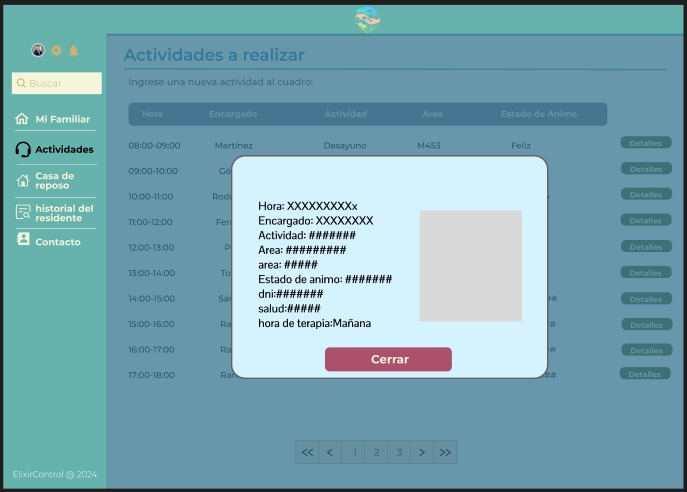
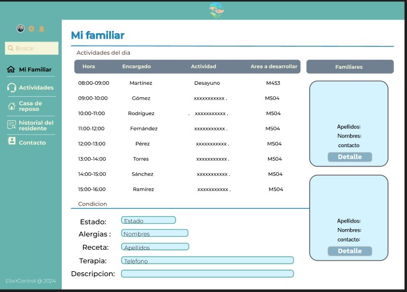
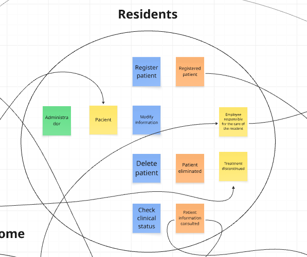
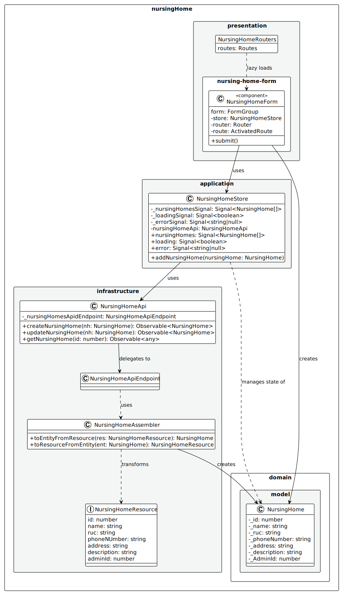
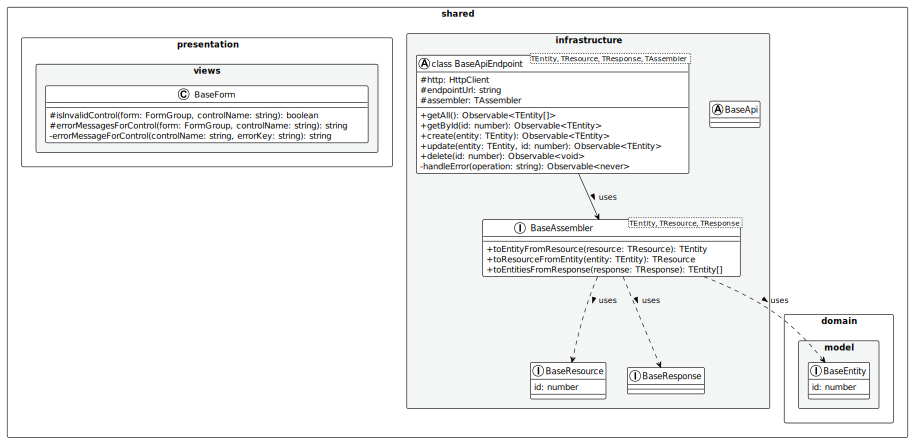

# Capítulo IV: Product Design

## 4.1. Style Guidelines

### 4.1.1. General Style Guidelines

El diseño visual de la plataforma **Veyra** se inclina hacia una estética moderna, limpia y amigable, en línea con nuestro compromiso de ofrecer soluciones de cuidado que transmitan confianza, claridad y facilidad de uso. Nuestro objetivo es crear una experiencia digital que sea tanto eficiente como reconfortante para las familias y las instituciones de cuidado.

En este capítulo, detallaremos cada uno de los elementos visuales y de estilo que guían el desarrollo de la aplicación Veyra, siempre siguiendo los principios de Diseño de Experiencia de Usuario (UX) e Interfaz de Usuario (UI) para garantizar la máxima usabilidad y accesibilidad.

**Branding**

El logo principal de nuestra plataforma es *Veyra*, un nombre que evoca cercanía y visión en el cuidado. Nuestro propósito es ser un puente digital para el cuidado de los adultos mayores, ofreciendo una solución integral para gestores de cuidado y familias. El branding se enfoca en transmitir innovación, soporte y confiabilidad, valores esenciales para quienes confían en nosotros el bienestar de sus seres queridos.
 

  

**Typography**

La tipografía empleada en Veyra será **Rubik**, con sus variantes Regular, Medium, SemiBold y Bold. La elección de Jost se basa en su estética moderna y profesional, que se equilibra con una excelente legibilidad en diversas resoluciones y dispositivos (móviles, tabletas, ordenadores). Además, su disponibilidad a través de Google Fonts asegura una carga eficiente y consistente.

La jerarquía tipográfica se establece de la siguiente manera para garantizar claridad y ritmo visual:

- **Títulos principales (H1/Sección heading):** 4rem (aprox. 64px) en escritorio, 2.8rem (aprox. 45px) en móvil.

- **Subtítulos (H2/Sub-headings):** 2.8rem (aprox. 45px) en escritorio, 2.2rem (aprox. 35px) en móvil.

- **Títulos de componentes (H3/H4):** 2rem (aprox. 32px) a 2.2rem (aprox. 35px).

- **Cuerpo del texto (p):** 1.6rem (aprox. 16px) con un interlineado de 1.6.

- **Botones y etiquetas (span):** 1.4rem (aprox. 14px) a 1.8rem (aprox. 18px).

  

Esta distribución garantiza un contraste óptimo entre el texto y el fondo, superando un ratio mínimo de 4.5:1 según las WCAG 2.1 AA para una accesibilidad superior.

 

**Colors**

Nuestra paleta de colores ha sido cuidadosamente seleccionada para evocar sensaciones de calma, profesionalismo y confianza. Se ha distribuido en tres categorías principales:

**Paleta principal**: Colores que definen la identidad de Veyra y se usan en elementos clave.
* **Primario (Azul Veyra):** var(--primary-color) (referencia principal).
* **Secundario (Azul Profundo):** var(--secondary-color) (para texto principal y elementos interactivos).
* **Terciario (Gris Oscuro):** var(--tertiary-color) (para texto secundario y detalles).
* **Fondo Claro:** var(--bg-light) (fondos de secciones).
* **Fondo Blanco:** var(--white) (fondos de tarjetas y elementos principales).
  
**Paleta de Soporte**: Colores complementarios que añaden profundidad y contraste.
* **Gris Neutro:** Para bordes sutiles, líneas divisorias y fondos de alternancia.

**Colores Funcionales**: Reservados para comunicar estados específicos al usuario.
* **Éxito:** Verde (#4CAF50) para confirmaciones y acciones exitosas.
* **Error:** Rojo (#F44336) para alertas y mensajes de error.
* **Advertencia:** Amarillo (#FFC107) para notificaciones y avisos importantes.

  

Esta combinación cromática refleja los valores de nuestra marca y busca transmitir al público una imagen de profesionalismo, seguridad y calidez en el cuidado de adultos mayores.
 

**Spacing**

El espaciado en Veyra sigue un sistema de espaciado modular y consistente para garantizar un ritmo visual armonioso y una jerarquía clara en toda la interfaz. La consistencia en el espaciado ayuda a reducir la carga cognitiva del usuario y mejora la legibilidad.

* **Espaciado Básico:** Usamos un espaciado base de 0.5rem (8px) para elementos pequeños como iconos, botones y texto. Este valor es la unidad mínima y se multiplica para crear espacios más grandes.

* **Margen Interno (Padding) Generoso:** Las secciones principales de la página utilizan un padding vertical de 6rem (96px) para crear pausas visuales claras. Los contenedores de tarjetas o elementos secundarios usan padding más pequeños, como 2.5rem (40px), para agrupar el contenido de forma lógica.

* **Espacio entre Elementos:** El espaciado entre elementos relacionados, como las tarjetas de planes o los miembros del equipo, varía entre 1.5rem (24px) y 3rem (48px). Esto mantiene una densidad de información adecuada sin abrumar visualmente al usuario.

* **Line Height del Texto:** El interlineado del texto (line-height) está configurado en 1.6, lo que facilita la lectura de párrafos largos y evita que las líneas se sientan demasiado juntas.

 

**Tono de Comunicación**

La voz y el tono de Veyra están diseñados para ser tan confiables y amigables como nuestra plataforma. Nuestro objetivo es conectar con familias e instituciones de cuidado de manera empática y profesional.

* **Tono: Amigable y empático,** con un toque de profesionalismo. Buscamos proyectar cercanía y comprensión de las necesidades de nuestros usuarios (familias), mientras mantenemos la autoridad y la seriedad que esperan las instituciones de cuidado.

* **Actitud: Confiable y serena.** El 90% de nuestra comunicación es tranquilizadora y segura, mientras que el 10% restante es entusiasta, especialmente en los llamados a la acción (CTAs) para motivar al usuario.

* **Lenguaje: Claro y directo.** Evitamos la jerga técnica innecesaria. Nos enfocamos en los beneficios que Veyra aporta a la vida diaria de las familias y los gestores de cuidado, hablando en términos de paz mental, eficiencia y conexión.

* **Voz: Experta y cálida.** Posicionamos a Veyra como una solución líder en tecnología de cuidado, pero siempre con un enfoque humano y comprensivo.

Este enfoque comunicacional busca generar confianza y lealtad, asegurando a las familias que están tomando la mejor decisión para sus seres queridos, y a las instituciones, que están optimizando sus procesos con una herramienta de vanguardia.

### 4.1.2. Web Style Guidelines

Las directrices de estilo web de Veyra se centran en la simplicidad, la accesibilidad y la modernidad. Nuestro objetivo es crear una experiencia visual que refleje la misión de nuestra plataforma: conectar y simplificar el cuidado de los adultos mayores con un diseño limpio e intuitivo.

**1) Layout**

* **Sistema de Grid:** Utilizamos un diseño de cuadrícula flexible para garantizar que el contenido de Veyra se vea bien en cualquier dispositivo. Este enfoque permite que las tarjetas de servicios y planes se ajusten dinámicamente, manteniendo el orden y la coherencia visual.
* **Headers y Footers:** El encabezado (header) es fijo en la parte superior, proporcionando acceso constante a la navegación principal y los botones de acción (Sign In, Sign Up). El pie de página (footer) es completo y funcional, con enlaces esenciales que complementan la experiencia del usuario.
* **Cards:** Las tarjetas son un componente central en nuestro diseño. Se usan para destacar los servicios, beneficios y testimonios. Tienen bordes redondeados y sombras suaves para darles una apariencia moderna y hacer que el contenido se sienta "elevado" y fácil de leer.

**2) Responsive Design**

* **Desktop:** La navegación principal es visible en la barra superior junto a los botones de inicio de sesión. El contenido se presenta en múltiples columnas para un uso eficiente del espacio de la pantalla.
* **Tablet:** El menú de navegación se oculta en un botón de hamburguesa para maximizar el espacio. Los elementos de la cuadrícula se adaptan a un diseño de dos columnas. Los botones y formularios se expanden para ser fáciles de tocar.
* **Mobile:** La experiencia está optimizada para la visualización en una sola columna. La navegación se realiza a través de un menú desplegable, y todos los elementos interactivos, como botones y campos de entrada, son grandes y claros, ideales para pantallas táctiles.

**3) Interaction Design**

* **Botones:** Nuestros botones son llamativos y fáciles de hacer clic, con efectos visuales sutiles al pasar el cursor para confirmar la interactividad. El botón principal de llamado a la acción (Start now →) destaca claramente del resto.

* **Formularios:** El formulario de contacto en el pie de página es sencillo y directo. Los campos son claros y están bien espaciados para evitar errores del usuario.

**4) Images and Icons**

* **Imágenes:** Se utilizan fotografías de alta calidad que evocan calidez, conexión y cuidado. Las imágenes de personas mayores y familias interactuando refuerzan el mensaje de Veyra. Las imágenes están optimizadas para una carga rápida.

* **Íconos:** Empleamos un conjunto de íconos de estilo lineal y minimalista. Estos iconos se utilizan para representar servicios y características, ofreciendo una guía visual rápida y coherente en toda la página.

**5) Repositorio Central**

* **Organización:** El proyecto sigue una estructura de archivos lógica. Los estilos están en la carpeta assets/style.css, y los archivos JavaScript en assets/scripts. Todos los activos visuales (imágenes, logos) se encuentran centralizados en assets/images y assets/logos, respectivamente.

* **Versionado:** Usamos un sistema de control de versiones como Git para gestionar los cambios en los archivos de estilo y contenido. Esto asegura que todos los colaboradores trabajen en la versión más reciente del proyecto.

## 4.2. Information Architecture

La arquitectura de la información de la página de inicio de Veyra está diseñada para una navegación intuitiva, permitiendo que los usuarios encuentren rápidamente la información que necesitan y comprendan el valor de nuestra plataforma.

### 4.2.1. Organization Systems

* **Jerarquía de Contenidos:** La información está estructurada de lo general a lo específico. Comenzamos con un mensaje de impacto en la sección Hero, seguido de un resumen de nuestros servicios, y luego profundizamos en las características y beneficios en las secciones subsiguientes.
  
* **Secciones Principales:** La página de inicio está organizada en secciones clave:
    * **Hero:** La promesa de Veyra.

    * **What We Offer:** Una visión general de los servicios.

    * **Features:** Los beneficios clave del producto.

    * **Benefits:** Cómo Veyra ayuda a los usuarios.

    * **About Us:** Quiénes somos.

    * **Our Team:** Las personas detrás del proyecto.

    * **Plans:** Opciones de precios.

    * **Testimonials & CTA:** Reseñas y llamado a la acción final.

* **Agrupación de Contenidos:** El contenido se agrupa lógicamente para facilitar la comprensión. Por ejemplo, los beneficios se agrupan en tarjetas con títulos claros y párrafos descriptivos, mientras que los testimonios se presentan en un formato de cuadrícula fácil de escanear.

### 4.2.2. Labeling Systems

* **Nomenclatura:** Se utiliza un lenguaje claro y directo en los títulos de las secciones (What we offer, Features, Plans). Los botones tienen etiquetas descriptivas como Start now →, Sign In y Sign Up para que el usuario sepa exactamente qué esperar.

* **Consistencia:** Mantenemos una nomenclatura uniforme. Por ejemplo, la sección de precios se llama Plans en la barra de navegación y en el título de la sección, evitando confusiones.

* **Lenguaje Adaptativo:** El contenido está diseñado para ser fácil de entender para todos, utilizando un lenguaje que resuena con familias y cuidadores de personas mayores, sin jerga técnica.

### 4.2.3. SEO Tags and Meta Tags

* **Title Tags:**
  
    * **Landing Page:** "Veyra - The Best Care is Always Connected"

* **Meta Description:**
  
    * **Landing Page:** "Veyra es una plataforma digital que conecta a familias y cuidadores, ofreciendo una gestión transparente y segura del cuidado de adultos mayores."

* **Keywords:**
  
    * **Landing Page:** "cuidado de adultos mayores, gestión de cuidado, plataforma para cuidadores, salud familiar, bienestar senior, Veyra"

* **Meta Author:**
  
    * **Landing Page:** "NovaPeru Tech"
 
* **Meta Charset:**
  
    * "UTF-8"
 
* **Meta Viewport:**
  
    * "width=device-width, initial-scale=1.0"
 
### 4.2.4. Searching Systems

* **Barra de Búsqueda:** Aunque la página de inicio no requiere una barra de búsqueda, una vez que el usuario inicia sesión en la aplicación principal, esta funcionalidad será clave. Estará ubicada en un lugar prominente y permitirá buscar rápidamente información de residentes, historial médico y otros datos relevantes.

* **Filtros y Facetas:** Dentro de la aplicación, los usuarios podrán filtrar la información por residente, tipo de medicamento, fecha, etc., para encontrar lo que necesitan de manera eficiente.

* **Historial de Búsqueda:** Se implementará un historial para que el personal de enfermería y los administradores puedan acceder rápidamente a las búsquedas frecuentes.

* **Resultados Relevantes:** Los resultados de búsqueda se priorizarán según la relevancia para la cuenta y las funciones del usuario.

### 4.2.5. Navigation Systems

* **Navegación Global:** La barra de navegación en el encabezado proporciona acceso principal a las secciones de la página de inicio. El menú de hamburguesa en dispositivos móviles asegura que esta navegación sea siempre accesible.

* **Navegación Contextual:** Enlaces internos, como los botones en la sección What We Offer y los botones de llamado a la acción, guían al usuario de manera contextual a la siguiente etapa de su recorrido.

* **Navegación Secundaria:** Enlaces internos, como los botones en la sección What We Offer y los botones de llamado a la acción, guían al usuario de manera contextual a la siguiente etapa de su recorrido.

## 4.3. Landing Page UI Design

El diseño de la interfaz de usuario (UI) de la página de inicio de Veyra es fundamental para captar la atención de los visitantes y guiarlos hacia una acción clara: conectar con el cuidado de sus seres queridos. Nos hemos centrado en la creación de una experiencia intuitiva y fluida, garantizando que cada elemento de la página sea interactivo y fácil de usar, reflejando el compromiso de Veyra con la simplicidad y la transparencia.

### 4.3.1. Landing Page Wireframe

El wireframe de nuestra página de inicio sirve como un mapa visual que define la estructura y el flujo de la información. Este esquema asegura una disposición lógica de los componentes, facilitando la navegación y destacando la propuesta de valor de Veyra. Las secciones del wireframe están diseñadas para contar una historia completa y persuasiva:

**Nav y Hero:**

Esta sección de entrada incluye el logotipo de Veyra, acompañado de un eslogan que resume nuestra promesa: "The Best Care is Always Connected" (El Mejor Cuidado Siempre Está Conectado). La barra de navegación permite un acceso rápido a secciones clave como Features, Benefits, y About Us, mientras que el área principal ofrece una visión concisa del producto, acompañada de un claro llamado a la acción: "Start now →" (Empieza ahora →). Un visual atractivo refuerza el mensaje de calidez y conexión familiar.

**Services (What We Offer):**

Aquí se detallan los servicios principales de Veyra: Home Health Care, Pediatric Care, Companion Care y Conditions Treated. Cada servicio se presenta con un ícono representativo y una breve descripción, haciendo que nuestra oferta sea fácil de entender y visualmente accesible.

**Acerca de la aplicación (About the Platform):**

Esta sección presenta lo que hace única a Veyra: una plataforma diseñada para centros de cuidado de adultos mayores que optimiza la gestión clínica y la comunicación. Explicamos cómo Veyra centraliza la información para mejorar la eficiencia, reducir errores y, lo más importante, dar tranquilidad a las familias. Enfatizamos nuestros valores de transparencia, seguridad y conexión, mostrando una lista de beneficios clave como la comunicación fluida, el acceso a información en tiempo real y la seguridad de los datos.

**Sobre el Equipo (Our Team):**

En esta sección, se humaniza la marca al presentar al equipo detrás de Veyra. Con fotos y descripciones de los miembros, mostramos a las personas dedicadas a este proyecto, construyendo confianza y una conexión personal con los visitantes.

**Precios (Plans):**

La sección de Precios ofrece una visión clara de los planes disponibles. Presentamos el Family Plan y el Nursing Home Plan, con un comparativo de características para ayudar a los usuarios a elegir la opción que mejor se adapte a sus necesidades, ya sea para el cuidado en casa o para una institución. Un conmutador entre tarifas mensuales y anuales, junto con la indicación de un ahorro, hace la elección más informada.

**Footer:**
El pie de página es un elemento crucial para la usabilidad. Contiene enlaces a información vital como "Terms of Service" y "Privacy Policy", además de detalles de contacto (correo electrónico, teléfono y ubicación). Esto proporciona un acceso rápido a la información sin saturar la interfaz, ofreciendo un cierre limpio y funcional a la página.

Este wireframe sienta las bases para un diseño visual que no solo se ve bien, sino que también guía al usuario de manera intuitiva a través de nuestra propuesta de valor, reforzando la confianza y la conexión que Veyra promete.

### 4.3.2. Landing Page Mock-up

**Hero de la aplicación** 

El hero de nuestra plataforma Veyra presenta una imagen principal que evoca cuidado y conexión, con un título claro: "The Best Care is Always Connected". Una breve descripción capta nuestra esencia, y un botón de llamado a la acción "Start for free →" invita a los usuarios a dar el primer paso. Una barra de navegación en la parte superior permite acceder de forma fluida a todas las secciones de la página, proporcionando una experiencia de usuario intuitiva.

**What We Offer** 

En la sección "What We Offer", presentamos nuestras principales áreas de servicio a través de tarjetas con iconos representativos. Cada tarjeta tiene un título y una breve descripción, como "Home Health Care" o "Pediatric Care", lo que permite a los usuarios entender rápidamente el alcance de nuestra plataforma y los tipos de cuidado que apoyamos.

**Features** 

La sección de "Features" muestra las funcionalidades clave de Veyra. El diseño tipo acordeón permite a los usuarios expandir cada característica para leer su descripción completa, mientras que un video de demostración de YouTube al lado les ofrece una vista visual de la plataforma en acción. Esto combina información detallada con un formato interactivo y dinámico.

**Benefits** 

En "Benefits", destacamos las ventajas de utilizar Veyra. A través de un diseño de tarjetas con imágenes, títulos y descripciones, comunicamos cómo nuestra plataforma mejora la comunicación, agiliza la gestión clínica y aumenta la tranquilidad tanto para las familias como para las instituciones de cuidado.

**About Us** 

La sección "About Us" presenta a NovaPeru Tech, la empresa detrás de Veyra. Aquí, compartimos nuestra misión y los valores de innovación y confianza que nos impulsan. Un video o imagen animada acompaña el texto, reforzando nuestro mensaje de una manera visualmente atractiva y moderna.

**Our Team** 

La sección "Our Team" presenta a los ingenieros de software detrás de Veyra. Las tarjetas de perfil muestran una foto, el nombre, el cargo y una breve biografía de cada miembro. El diseño de 3 tarjetas arriba y 2 abajo, centradas, brinda un aspecto organizado y profesional, permitiendo a los usuarios conocer al equipo de desarrollo.

**Plans** 

En la sección de "Plans", ofrecemos los detalles de nuestros planes de precios. Las tarjetas de "Family Plan" y "Nursing Home Plan" incluyen descripciones, precios con opciones mensuales y anuales, y listas de características. El diseño permite un fácil cambio entre planes mensuales y anuales, facilitando la elección del plan adecuado.

**Footer** 

El "Footer" de nuestra landing page contiene enlaces útiles y recursos adicionales. Un formulario de suscripción invita a los usuarios a unirse a nuestra comunidad. El logo de Veyra, enlaces de contacto, información legal y de derechos de autor se encuentran aquí, asegurando que toda la información relevante esté fácilmente accesible para los usuarios.

## 4.4. Web Applications UX/UI Design

### 4.4.1. Web Applications Wireframes

En esta sección se presentan los <strong>wireframes diseñados para la aplicación web de NovaPeru Tech (Veyra)</strong>. 
Cada pantalla responde a las funcionalidades principales del sistema y a los distintos roles de usuario 
(Administrador, Familiar, Personal de cuidado).

<h5>Login – NovaPeru Tech</h5>

Pantalla de inicio donde los usuarios acceden a la aplicación según su rol 
(Administrador, Familiar, Personal de cuidado). Incluye campos de correo y contraseña, además de validaciones de acceso.

<h5>Inicio de Sesión – NovaPeru Tech</h5>

Formulario de acceso con credenciales de usuario. Presenta opciones de recuperación de contraseña y mantiene consistencia visual con la identidad de NovaPeru Tech.

<h5>Registrar Familiar – NovaPeru Tech</h5>

Formulario para que los familiares creen una cuenta, ingresando datos personales básicos, correo electrónico y contraseña. Incluye validaciones de formato y confirmación de correo.

<h5>Registrar Administrador – NovaPeru Tech</h5>

Pantalla destinada a registrar un nuevo administrador en la plataforma. Permite ingresar información personal, datos de contacto y credenciales de acceso.

<h5>Inventario – NovaPeru Tech</h5>

Módulo donde el administrador puede visualizar el inventario de medicamentos y recursos clínicos. Permite filtrar, ordenar y consultar detalles de cada ítem.

<h5>Inventario – Modificar – NovaPeru Tech</h5>

Sección para editar la información de medicamentos en el inventario: nombre, cantidad, fecha de vencimiento, laboratorio y observaciones.

<h5>Paciente – NovaPeru Tech</h5>

Pantalla que muestra la información general de un residente (datos personales, estado clínico, actividades recientes).

<h5>Paciente – Agregar – NovaPeru Tech</h5>

Formulario para registrar un nuevo residente en la institución. Incluye datos personales, médicos, contactos de emergencia y observaciones.

<h5>Paciente – Eliminar – NovaPeru Tech</h5>

Módulo que permite al administrador eliminar registros de pacientes, con mensaje de confirmación para evitar acciones accidentales.

<h5>Empleado – NovaPeru Tech</h5>

Pantalla donde se listan los empleados de la institución, mostrando nombre, rol, contacto y estado laboral.

<h5>Empleado – Card Detalles – NovaPeru Tech</h5>

Vista detallada de un empleado en formato de card, mostrando información personal, turno asignado, horas extra y contacto de emergencia.

<h5>Actividad – Familiar – NovaPeru Tech</h5>

Pantalla que muestra las actividades recientes del residente (ejercicios, visitas, terapias). 
El familiar puede visualizar fotos, descripciones y fechas.

<h5>Historial de Pedido – NovaPeru Tech</h5>

Pantalla que permite consultar pedidos realizados, con detalles de estado, fecha y productos solicitados.

### 4.4.2. Web Applications Wireflow Diagrams

Los Wireflows se emplean principalmente en el diseño de la experiencia de usuario (UX) y son especialmente útiles para aplicaciones que incluyen flujos de trabajo e interacciones complejas.

### 4.4.3. Web Applications Mock-ups

En esta sección se presentan los <strong>mock-ups diseñados para la aplicación web de NovaPeru Tech (Veyra)</strong>. 
Cada pantalla responde a las funcionalidades principales del sistema y a los distintos roles de usuario 
(Administrador, Familiar, Personal de cuidado).

<h5>Login – NovaPeru Tech</h5>

Pantalla de inicio donde los usuarios acceden a la aplicación según su rol 
(Administrador, Familiar, Personal de cuidado). Incluye campos de correo y contraseña, además de validaciones de acceso.

<h5>Inicio de Sesión – NovaPeru Tech</h5>

Formulario de acceso con credenciales de usuario. Presenta opciones de recuperación de contraseña y mantiene consistencia visual con la identidad de NovaPeru Tech.

<h5>Registrar Familiar – NovaPeru Tech</h5>

Formulario para que los familiares creen una cuenta, ingresando datos personales básicos, correo electrónico y contraseña. Incluye validaciones de formato y confirmación de correo.

<h5>Registrar Administrador – NovaPeru Tech</h5>

Pantalla destinada a registrar un nuevo administrador en la plataforma. Permite ingresar información personal, datos de contacto y credenciales de acceso.

<h5>Inventario – NovaPeru Tech</h5>

Módulo donde el administrador puede visualizar el inventario de medicamentos y recursos clínicos. Permite filtrar, ordenar y consultar detalles de cada ítem.

<h5>Inventario – Modificar – NovaPeru Tech</h5>

Sección para editar la información de medicamentos en el inventario: nombre, cantidad, fecha de vencimiento, laboratorio y observaciones.

<h5>Paciente – NovaPeru Tech</h5>

Pantalla que muestra la información general de un residente (datos personales, estado clínico, actividades recientes).

<h5>Paciente – Agregar – NovaPeru Tech</h5>

Formulario para registrar un nuevo residente en la institución. Incluye datos personales, médicos, contactos de emergencia y observaciones.

<h5>Paciente – Eliminar – NovaPeru Tech</h5>

Módulo que permite al administrador eliminar registros de pacientes, con mensaje de confirmación para evitar acciones accidentales.

<h5>Empleado – NovaPeru Tech</h5>

Pantalla donde se listan los empleados de la institución, mostrando nombre, rol, contacto y estado laboral.

<h5>Empleado – Card Detalles – NovaPeru Tech</h5>

Vista detallada de un empleado en formato de card, mostrando información personal, turno asignado, horas extra y contacto de emergencia.

<h5>Actividad – Familiar – NovaPeru Tech</h5>

Pantalla que muestra las actividades recientes del residente (ejercicios, visitas, terapias). 
El familiar puede visualizar fotos, descripciones y fechas.

<h5>Historial de Pedido – NovaPeru Tech</h5>

Pantalla que permite consultar pedidos realizados, con detalles de estado, fecha y productos solicitados.

### Mock-ups Version Mobile

En esta sección se muestran los mock-ups realizados para nuestro Web Application version Mobile.

### 4.4.4. Web Applications User Flow Diagrams

El *user flow* es la representación visual del camino que un usuario sigue dentro de la aplicación Veyra para alcanzar un objetivo específico. Estos diagramas son esenciales para asegurar que la navegación sea lógica, intuitiva y libre de obstáculos, garantizando una experiencia de usuario satisfactoria y eficiente para cada uno de los roles: **Administrador**, **Familiar** y **Personal de Cuidado**. A continuación, se detallan los flujos para las tareas clave de la plataforma.

---

- #### **Objetivo 1: Un administrador desea registrar un nuevo residente en el sistema.**

  **Happy Path**

  En esta ruta ideal, el administrador inicia sesión y accede al panel de control. Desde allí, navega a la sección de "Pacientes" y selecciona la opción para agregar un nuevo residente. Completa todos los campos del formulario con la información correcta del residente (datos personales, médicos, etc.) y guarda el registro. El sistema confirma que el residente ha sido agregado exitosamente y lo muestra en la lista de pacientes.

  

  **Unhappy Paths**

  En este escenario alternativo, el administrador intenta guardar el formulario con campos obligatorios vacíos o con datos en un formato incorrecto (por ejemplo, un número de teléfono con letras). El sistema muestra mensajes de error específicos junto a los campos problemáticos, impidiendo que el registro se complete hasta que la información sea corregida.

  

---

- #### **Objetivo 2: Un familiar desea registrarse en la plataforma Veyra.**

  **Happy Path**

  El familiar accede a la página de inicio y selecciona la opción "Registrarse". Completa el formulario con sus datos personales, correo electrónico y una contraseña segura. Al enviar el formulario, el sistema valida la información, crea la cuenta y le envía un correo de confirmación. El familiar es redirigido a la pantalla de inicio de sesión o directamente a su panel, listo para vincularse con un residente.

  

  **Unhappy Paths**

  La ruta infeliz ocurre si el familiar intenta registrarse con un correo electrónico que ya existe en el sistema o si las contraseñas no coinciden. La plataforma mostrará un mensaje de error claro, indicando el problema específico para que el usuario pueda corregirlo y completar su registro.

  

---

- #### **Objetivo 3: Un administrador desea agregar un nuevo medicamento al inventario.**

  **Happy Path**

  El administrador, después de iniciar sesión, navega a la sección de "Inventario". Hace clic en el botón para agregar un nuevo ítem, completa los detalles del medicamento (nombre, cantidad, fecha de vencimiento, etc.) y guarda la información. El sistema confirma la adición y el nuevo medicamento aparece inmediatamente en la lista del inventario.

  

  **Unhappy Paths**

  En este caso, el administrador intenta registrar un medicamento sin completar campos clave como el nombre o la cantidad. El sistema previene el registro y resalta los campos obligatorios que faltan, mostrando un mensaje que guía al usuario para que complete la información necesaria antes de poder guardar.

  

---

- #### **Objetivo 4: Un familiar desea ver las actividades recientes de su ser querido.**

  **Happy Path**

  El familiar inicia sesión en su cuenta y es dirigido a su panel principal. Desde allí, accede a la sección "Actividades del Residente". La aplicación muestra una lista cronológica de las últimas actividades (terapias, comidas, visitas), incluyendo fotos y descripciones publicadas por el personal de cuidado, brindando tranquilidad y conexión.

  

---

- #### **Objetivo 5: Un usuario (administrador o familiar) ha olvidado su contraseña y desea recuperarla.**

  **Happy Path**

  En la pantalla de inicio de sesión, el usuario hace clic en "¿Olvidaste tu contraseña?". Ingresa su dirección de correo electrónico registrada y recibe un enlace o código de recuperación. Al seguir las instrucciones, puede establecer una nueva contraseña y acceder nuevamente a su cuenta sin problemas.

  

  **Unhappy Paths**

  Si el usuario ingresa un correo electrónico que no está registrado en la base de datos de Veyra, el sistema le informará que el correo no fue encontrado, protegiendo la seguridad de los datos y pidiéndole que verifique la dirección ingresada.

  

## 4.5. Web Applications Prototyping

http://bit.ly/4q6AhWP

## 4.6. Domain-Driven Software Architecture

### 4.6.1. Design-Level Event Storming

Para identificar los eventos de dominio, es recomendable realizar una sesión de Event Storming. Esta técnica permite visualizar y comprender el flujo de eventos dentro del dominio, facilitando la identificación de los Bounded Context.

El desarrollo del proceso del Domain-Driven Design se realizó en la aplicación Miro: https://bit.ly/433FTaw

1. Bounded Context **IAM**

   El bounded context IAM se encarga de la autenticación y autorización de los usuarios dentro del sistema. Gestiona procesos como el inicio de sesión, el registro de nuevos usuarios y la validación de credenciales para los diferentes roles: administrador, empleado y familiar. Su propósito principal es garantizar que solo los usuarios verificados puedan acceder a las funcionalidades que les corresponden según su rol. Este contexto asegura la seguridad, el control de accesos y la coherencia de permisos en toda la plataforma Veyra.
   
   

   
2. Bounded Context **Inventories**

   El bounded context Inventories gestiona el registro, modificación y control de los productos médicos, recursos y suministros disponibles en la institución. Se encarga de mantener actualizada la información sobre existencias, fechas de vencimiento y disponibilidad de insumos. Este contexto se conecta directamente con Residents y Nursing Home, permitiendo la trazabilidad de los medicamentos asignados y la administración eficiente de los recursos. Su función principal es garantizar una gestión confiable del inventario, favoreciendo la seguridad del paciente y la continuidad de los servicios.
   
   

3. Bounded Context **Employees**

   El bounded context Employees tiene como objetivo administrar la información del personal que labora en la institución, abarcando desde el registro de nuevos empleados hasta la asignación de roles y turnos. Facilita el seguimiento de las responsabilidades y del desempeño del personal, asegurando una gestión organizada. Este contexto se vincula con Nursing Home y Residents, permitiendo coordinar las actividades del personal con los cuidados brindados a los residentes. Promueve una comunicación clara y una asignación eficiente de tareas dentro del entorno institucional.
   
   

4. Bounded Context **Nursing Home**

   El bounded context Nursing Home representa el núcleo operativo donde se desarrollan las actividades médicas, administrativas y de atención al residente. Administra la información general de la institución, la asignación de empleados y la gestión de los recursos clínicos. Además, actúa como punto de conexión entre los contextos Employees, Residents e Inventories, garantizando una coordinación fluida entre el personal, los pacientes y los insumos médicos. Su objetivo principal es optimizar la operación integral de la casa de reposo y mantener la calidad del servicio.
   
   

5. Bounded Context **Residents**

   El bounded context Residents se encarga de administrar toda la información relacionada con los pacientes de la casa de reposo. Incluye el registro de nuevos residentes, la actualización de su información clínica y la consulta de su estado de salud. Se conecta directamente con los contextos Familiar e Inventories, lo que permite mantener actualizados los tratamientos, la comunicación con los familiares y la trazabilidad de los medicamentos asignados. Su propósito es centralizar y proteger los datos clínicos, garantizando un cuidado personalizado y transparente.
   
   

6. Bounded Context **Familiar**

   El bounded context Familiar gestiona la interacción entre el sistema y los familiares de los residentes. Permite la creación de cuentas familiares, la visualización de actividades y la consulta de historiales de tratamientos o pedidos. Este contexto fomenta la confianza y la transparencia al ofrecer a los familiares una visión clara del estado y las actividades de sus seres queridos. Se conecta con Residents e Inventories para mostrar información actualizada y mantener una comunicación constante entre la familia y la institución.
   
   

7. Bounded Context **Analytics**
  
   El bounded context Analytics está orientado al análisis de datos y la generación de indicadores visuales que apoyen la toma de decisiones. Recolecta información proveniente de Inventories, Residents y Nursing Home para elaborar reportes, estadísticas y gráficos que reflejan el estado del stock, el uso de medicamentos y el desempeño general de la institución. Su función es brindar una visión global y estratégica, permitiendo identificar patrones, anticipar necesidades y mejorar la eficiencia operativa mediante el análisis continuo de la información.

   

   
### 4.6.2. Software Architecture Context Diagram

El esquema de contexto ofrece una perspectiva general de las interacciones entre el sistema de software Veyra, los usuarios y sistemas externos.

### 4.6.3. Software Architecture Container Diagrams

El diagrama de contenedores ofrece una visión general de las conexiones entre aplicaciones y fuentes de datos en el sistema de Veyra. Muestra cómo interactúan y dependen entre sí para su funcionamiento.

### 4.6.4. Software Architecture Components Diagrams

El diagrama de componentes proporciona una vista más detallada de la arquitectura del sistema Veyra. 
Este nivel de diseño se centra en los módulos internos de cada contenedor definido en el diagrama de contenedores, 
mostrando cómo se organizan, qué responsabilidades cumplen y cómo se comunican entre sí.

## 4.7. Software Object-Oriented Design

### 4.7.1. Class Diagrams

<h3>IAM Diagram (Frontend)</h3>

<ul>
<li>
<strong>Contexto:</strong> Gestión de la interfaz de usuario para la identidad y acceso (IAM), siguiendo una arquitectura limpia (Clean Architecture) en Angular.
</li>
<li>
<strong>Módulos principales:</strong>
<ul>
<li>Domain: Modela las entidades <code>SignIn</code> y <code>SignUp</code> como objetos de negocio puros, sin dependencias de frameworks.</li>
<li>Application: El <code>IamStore</code> centraliza el estado (usuario autenticado, carga, errores) usando Angular Signals y orquesta los casos de uso.</li>
<li>Infrastructure: Gestiona la comunicación con la API a través de una fachada (<code>IamApi</code>), endpoints especializados y traductores (<code>Assemblers</code>) que convierten los datos de la API en entidades de dominio.</li>
<li>Presentation: Incluye componentes de UI (<code>SignInComponent</code>, <code>SignUpComponent</code>), componentes reutilizables (<code>AuthenticationSection</code>) y la configuración de rutas (<code>IamRouters</code>) que utiliza carga perezosa (lazy loading).</li>
</ul>
</li>
<li>
<strong>Operaciones clave:</strong> Flujos de inicio de sesión y registro desacoplados, validación de formularios reactivos y manejo de estado centralizado y reactivo (loading, error) que se refleja automáticamente en la UI.
</li>
<li>
<strong>Característica destacada:</strong> Reutilización del <code>SignUpComponent</code> para diferentes roles ('administrator', 'familiar') mediante el paso de datos estáticos en la configuración de rutas, optimizando el código y la mantenibilidad.
</li>
</ul>

<h3>Nursing Home Diagram (Frontend)</h3>

<ul>
<li>
<strong>Contexto:</strong> Interfaz de usuario para la gestión y registro de residencias geriátricas.
</li>
<li>
<strong>Módulos principales:</strong>
<ul>
<li>Domain: Define la entidad <code>NursingHome</code> con sus propiedades de negocio.</li>
<li>Application: El <code>NursingHomeStore</code> gestiona el estado de la lista de residencias y las operaciones CRUD.</li>
<li>Infrastructure: Capa de comunicación con la API, siguiendo el patrón de fachada, endpoint y assembler.</li>
<li>Presentation: Proporciona el componente <code>NursingHomeForm</code> para el registro de nuevas residencias y su enrutador asociado.</li>
</ul>
</li>
<li>
<strong>Operaciones clave:</strong> Creación de una nueva residencia a través de un formulario reactivo. El componente de UI delega la lógica de negocio al <code>NursingHomeStore</code>, que a su vez se comunica con la capa de infraestructura.
</li>
</ul>

<h3>Employees Diagram (Frontend)</h3>

<ul>
<li>
<strong>Contexto:</strong> Interfaz de usuario para la gestión completa del personal (empleados) de la residencia.
</li>
<li>
<strong>Módulos principales:</strong>
<ul>
<li>Domain: Define la entidad <code>Staff</code> con toda la información personal y contractual del empleado.</li>
<li>Application: <code>EmployeesStore</code> actúa como el gestor de estado central para la lista de empleados.</li>
<li>Infrastructure: Capa de comunicación con la API REST de empleados.</li>
<li>Presentation: Proporciona un conjunto completo de componentes para el CRUD de empleados (<code>StaffFormCreate</code>, <code>StaffFormList</code>, <code>StaffFormEdit</code>, <code>StaffDetail</code>) y su enrutador.</li>
</ul>
</li>
<li>
<strong>Operaciones clave:</strong> Registro, edición, eliminación y listado de empleados. El estado se gestiona en el <code>EmployeesStore</code>, asegurando que la UI siempre refleje los datos más recientes de forma reactiva.
</li>
</ul>

<h3>Residents Diagram (Frontend)</h3>

<ul>
<li>
<strong>Contexto:</strong> Interfaz de usuario para la gestión integral de residentes, abarcando su información personal, médica y administrativa.
</li>
<li>
<strong>Módulos principales:</strong>
<ul>
<li>Domain: Una entidad <code>Residents</code> muy detallada que modela toda la información relevante de un residente.</li>
<li>Application: <code>ResidentStore</code> gestiona el estado de los residentes, proveyendo una única fuente de verdad para toda la UI.</li>
<li>Infrastructure: Capa de comunicación que interactúa con la API de residentes.</li>
<li>Presentation: Un conjunto completo de vistas para listar, ver detalles, crear y editar residentes, cada una interactuando con el <code>ResidentStore</code>.</li>
</ul>
</li>
<li>
<strong>Operaciones clave:</strong> CRUD completo para la gestión de residentes. La arquitectura reactiva asegura que cualquier cambio (ej. editar un residente) se propague inmediatamente a todas las vistas relevantes (como la lista de residentes).
</li>
</ul>

<h3>Shared Diagram (Frontend)</h3>

<ul>
<li>
<strong>Contexto:</strong> Proporciona un conjunto de clases base, interfaces y patrones reutilizables que actúan como el fundamento para todos los demás módulos del frontend.
</li>
<li>
<strong>Módulos principales:</strong>
<ul>
<li>Domain: Define <code>BaseEntity</code> para estandarizar las entidades de negocio.</li>
<li>Infrastructure: Contiene la lógica genérica para la comunicación con APIs. <code>BaseApiEndpoint</code> es la pieza central, implementando las operaciones CRUD (Crear, Leer, Actualizar, Borrar) de forma reutilizable para cualquier entidad.</li>
<li>Presentation: Incluye <code>BaseForm</code>, una clase con utilidades para simplificar la gestión de errores y validaciones en los formularios de toda la aplicación.</li>
</ul>
</li>
<li>
<strong>Operaciones clave:</strong> El propósito de este módulo es ofrecer herramientas para reducir el código duplicado y forzar una arquitectura consistente. No implementa lógica de negocio, sino el andamiaje sobre el cual se construye dicha lógica.
</li>
</ul>

<h3>Employees diagram (Backend)</h3>

<ul>
  <li>
    <strong>Contexto:</strong> Gestión de empleados bajo el contexto "Employees Bounded Context".
  </li>
  <li>
    <strong>Módulos principales:</strong>
    <ul>
      <li>Domain: Agrega la entidad Employee, objetos valor (Position, WorkShift, TypeOfContract, ProfileId), y excepciones de negocio.</li>
      <li>Application: Define servicios de consulta y comando para operaciones CRUD y filtros.</li>
      <li>Infrastructure: Maneja persistencia y repositorios (JPA).</li>
      <li>Interfaces: Expone API REST y recursos externos.</li>
    </ul>
  </li>
  <li>
    <strong>Operaciones clave:</strong> Consultar empleados por posición o contrato, asignación de turnos, creación, edición y borrado.
  </li>
  <li>
    <strong>Manejo de errores:</strong> Excepciones a nivel de dominio como empleado no encontrado, contrato inválido, conflictos en horarios.
  </li>
</ul>

<h3>Medications diagram (Backend)</h3>

<ul>
  <li>
    <strong>Contexto:</strong> Gestión de medicamentos bajo el "Medication Bounded Context".
  </li>
  <li>
    <strong>Módulos principales:</strong>
    <ul>
      <li>Domain: Agregado central "Medication", con objetos valor (Stock, Type, Brand, Laboratory, Dosage, ExpireDate, etc.), y excepciones específicas del dominio.</li>
      <li>Application: Servicios y comandos para crear, actualizar, eliminar y consultar medicamentos, así como operaciones que incluyen filtros por tipo, marca, laboratorio y expiración.</li>
      <li>Infrastructure: Incluye repositorios para persistencia de entidades.</li>
      <li>Interfaces: Controlador REST para exponer las operaciones CRUD de medicamentos.</li>
    </ul>
  </li>
  <li>
    <strong>Operaciones clave:</strong> Consultar medicamentos por laboratorio, tipo, marca, fecha de expiración, stock bajo, así como comandos para mantenimiento y eliminación.</li>
  <li>
    <strong>Manejo de errores:</strong> Excepciones para situaciones como medicamento no encontrado, laboratorio inválido, tipo inválido y stock inválido.</li>
</ul>

<h3>IAM diagram (Backend)</h3>

<ul>
  <li>
    <strong>Contexto:</strong> Gestión de identidades y accesos bajo el dominio IAM (Identity and Access Management).
  </li>
  <li>
    <strong>Módulos principales:</strong>
    <ul>
      <li>Domain: Modela entidades como Usuario, Rol y Permisos, relacionando usuarios con roles y controles de acceso.</li>
      <li>Application: Incluye servicios de aplicación para la gestión de usuarios y roles (creación, actualización, asignación).</li>
      <li>Infrastructure: Implementa mecanismos de persistencia y repositorios para entidades de Seguridad.</li>
      <li>Interfaces: Expone controladores y recursos API REST para autenticación y autorización.</li>
    </ul>
  </li>
  <li>
    <strong>Operaciones clave:</strong> Alta, edición y consulta de usuarios; asignación de roles y permisos; flujos de autenticación y autorización.
  </li>
  <li>
    <strong>Manejo de relaciones:</strong> Conexión entre usuarios, roles, y permisos, respaldado por servicios y controladores específicos.
  </li>
</ul>

<h3>Profiles Diagram (Backend)</h3>

<ul>
  <li>
    <strong>Contexto:</strong> gestión de perfiles dentro de un contexto delimitado especializado.</li>
  <li>
    <strong>Módulos principales:</strong>
    <ul>
      <li>Dominio: agregado central "Profile", incluye objetos valor (FullName, EmailAddress, Address, etc.) y comandos relacionados al manejo de perfiles.</li>
      <li>Aplicación: servicios internos para consultas y comandos de crear, actualizar y recuperar perfiles; módulo ACL para control de acceso.</li>
      <li>Infraestructura: persistencia en repositorios JPA y utilidades para transformación de datos.</li>
      <li>Interfaces: controlador REST y recursos para acceso vía API, más una capa facade para integrar los servicios de consulta.</li>
    </ul>
  </li>
  <li>
    <strong>Operaciones clave:</strong> crear, actualizar y recuperar perfiles usando capas de servicio y repositorio, con utilidades para mapear objetos de solicitud/respuesta al dominio.</li>
  <li>
    <strong>Integración:</strong> conecta el dominio con APIs, control de acceso y transformación interna para una gestión segura y consistente de perfiles.</li>
</ul>

<h3>Nursing Diagram (Backend)</h3>

<ul>
  <li>
    <strong>Contexto:</strong> gestión de residencias geriátricas en un contexto delimitado.</li>
  <li>
    <strong>Módulos principales:</strong>
    <ul>
      <li>Dominio: agregado principal "Nursing", entidades asociadas (admin, facility) y objetos valor (Name, PhoneNumber, Address, Ruc, Description, Email).</li>
      <li>Aplicación: servicios internos para consultas y comandos administrativos, y servicios outbound para integración con sistemas externos.</li>
      <li>Infraestructura: persistencia de entidades mediante repositorios JPA.</li>
      <li>Interfaces: API REST, manejo de recursos, transformaciones y control de acceso.</li>
    </ul>
  </li>
  <li>
    <strong>Operaciones clave:</strong> creación, administración y consulta de residencias y administradores utilizando un diseño modular y seguro.</li>
</ul>

## 4.8. Database Design

### 4.8.1. Database Diagrams

<h3><strong>Contextos principales:</strong></h3>

<h4>IAM Context:</h4>

<strong>Responsabilidad:</strong> Gestión de usuarios, roles y asignaciones de acceso.

<h4>Platform-Profiles Context:</h4>

<strong>Responsabilidad:</strong> Administra los perfiles de todas las personas en el sistema (residentes, empleados, familiares) y la información específica de los residentes.

<h4>Employee Context:</h4>

<strong>Responsabilidad:</strong> Almacena información contractual y laboral de los empleados, vinculándolos a un perfil y una residencia.

<h4>Medications Context:</h4>

<strong>Responsabilidad:</strong> Gestión del catálogo de medicamentos, las prescripciones asignadas a residentes y el registro de cada administración.

<h4>ResidentFamily Context:</h4>

<strong>Responsabilidad:</strong> Define los vínculos entre residentes y sus familiares, especificando el tipo de relación.

<h4>IAM Context:</h4>

<strong>Responsabilidad:</strong> Gestión de usuarios, roles y asignaciones de acceso.

<h4>Platform-Appointments Context:</h4>

<strong>Responsabilidad:</strong> Agenda y gestión de citas para los residentes, registrando quiénes asisten (empleados o familiares).

<h4>Shared Context:</h4>

<strong>Responsabilidad:</strong> Contiene entidades transversales como las notificaciones, que pueden ser generadas desde cualquier otro contexto y dirigidas a un usuario.

<strong>Relaciones clave:</strong> Integración flexible entre usuarios, perfiles, residentes, familiares y empleados; trazabilidad para médicos, medicamentos, citas, notificaciones y administración de entidades residenciales.</li>
</ul>
