<html lang="es">
<body>
  
# Capítulo V: Product Implementation, Validation & Deployment
  
## 5.1. Software Configuration Management
  
En este punto del informe se describe las decisiones y los principios que ayudarán al equipo a garantizar la coherencia durante el desarrollo de la solución.

  
### 5.1.1. Software Development Environment Configuration
  
En este apartado se proporcionan los enlaces a las aplicaciones y productos de software creados durante el ciclo del proyecto utilizando los programas correspondientes.

  
Con ese fin, se organizará en las siguientes secciones:

  <ol>
    <li>Project Management</li>
    <li>Requirements Management</li>
    <li>Product UX/UI Design</li>
    <li>Software Development</li>
    <li>Software Testing</li>
    <li>Software Documentation</li>
  </ol>
  
Asimismo, se clasificarán los elementos de estas secciones como rutas de referencia (para software basado en modelos Saas) o rutas de descarga (para productos que se ejecuten en las computadoras de los miembros del equipo) para cada uno de los productos de software.

<h4>Project Management</h4>
  
Esta disciplina se fundamenta en la administración de proyectos y busca principalmente la mejora de procesos y su entorno con el propósito de lograr los resultados esperados.

  
<em>Durante el ciclo digital del proyecto, se llevará a cabo la implementación de un producto de software basado en el modelo SaaS, el cual funcionará a través de un navegador web; no obstante, no se desarrollará una versión de la aplicación móvil correspondiente.</em>

<h4>Requirements Management:</h4>
  
Este proceso se enfoca en asegurar que una organización documente, verifique y satisfaga las necesidades y expectativas de sus clientes, así como las de las partes interesadas internas o externas.

  <ul>
    <li><strong>Trello:</strong> Trello es una plataforma digital de gestión de proyectos basada en tableros, listas y tarjetas, que permite organizar tareas, colaborar en equipo y supervisar el progreso de manera visual y eficiente. <a href="https://trello.com">trello.com</a></li>
  </ul>

<h4>Product UX/UI Design</h4>
  
Estamos desarrollando un modelo de sitio web compatible tanto con computadoras como con dispositivos móviles.

  
Para lograrlo, utilizamos diferentes herramientas de diseño y colaboración, que incluyen:

  <ol>
    <li><strong>Uxpressia:</strong> plataforma para mapeo de la trayectoria del cliente. <a href="https://uxpressia.com/">uxpressia.com</a></li>
    <li><strong>MIRO:</strong> pizarra digital colaborativa. <a href="https://miro.com/es/">miro.com/es</a></li>
    <li><strong>Figma:</strong> herramienta para prototipos web. <a href="https://www.figma.com/es-es/">figma.com</a></li>
    <li><strong>Lucid Chart:</strong> aplicación de diagramación colaborativa. <a href="https://www.lucidchart.com/pages/es">lucidchart.com</a></li>
    <li><strong>Overflow:</strong> herramienta para diagramas de Userflows. <a href="https://overflow.io/">overflow.io</a></li>
  </ol>

<h4>Software Development:</h4>
  
El desarrollo de software es una metodología aplicada en la creación de productos de software. A continuación, algunas herramientas y tecnologías clave:

  <ol>
    <li><strong>GitHub:</strong> repositorio del proyecto: <a href="https://github.com/NovaPeru-Tech">https://github.com/NovaPeru-Tech</a></li>
    <li><strong>Webstorm:</strong> IDE orientado al desarrollo web. <a href="https://www.jetbrains.com/webstorm/">webstorm</a></li>
    <li><strong>HTML, CSS, JavaScript:</strong> tecnologías para la implementación web.</li>
  </ol>

<h4>Software Testing:</h4>
  
Acción de evaluar los elementos y el funcionamiento del software mediante validación y verificación.

  
<strong>Lenguaje Gherkin:</strong> DSL para escribir historias de usuario y escenarios de prueba (Feature, Scenario, Given, When, Then, etc.).

<h4>Software Documentation</h4>
  
Textos o ilustraciones que acompañan al software para explicar su funcionamiento o uso.

### 5.1.2. Source Code Management

  
Se describe la gestión del código fuente (SCM). Usaremos GitHub como sistema de control de versiones.

  <ol>
    <li>URL de la organización: NovaPeru Tech - <a href="https://github.com/NovaPeru-Tech">https://github.com/NovaPeru-Tech</a></li>
    <li>URL del repositorio de la Landing Page: <a href="https://github.com/NovaPeru-Tech/NovaPeru-Tech-LandingPage">NovaPeru-Tech-LandingPage</a></li>
  </ol>

<h4>GitFlow</h4>
  
GitFlow es un modelo de ramas para Git. Ramas principales y de soporte:

  <ul>
    <li><strong>Main:</strong> rama principal (history oficial de versiones).</li>
    <li><strong>Develop:</strong> integración de features estables.</li>
    <li><strong>Feature branches:</strong> se ramifican de <code>develop</code> y vuelven a fusionarse en <code>develop</code>.</li>
  </ul>

  
<strong>Convenciones para naming de Features y Conventional Commits:</strong>

  <pre><code>&lt;type&gt;[optional scope]: &lt;description&gt;

Tipos comunes:
feat: nuevo feature
fix: corrección
build: cambios en build/deps
chore: tareas internas
docs: documentación
refractor: refactor
perf: mejoras de rendimiento
style: estilo
test: pruebas
</pre></code>

  
Ejemplos:

  <pre><code>feat(welcome): add welcome section
build(release): bump version to 1.0.0
style: remove empty line
</code></pre>

  
Instrucciones rápidas para vincular WebStorm con GitHub (resumen):

  <ol>
    <li>VCS &gt; Enable Version Control Integration (seleccionar Git).</li>
    <li>Agregar cuenta de GitHub desde Settings.</li>
    <li>Configurar nombre de usuario y realizar commits.</li>
    <li>Manage Remotes &gt; pegar URL del repositorio.</li>
  </ol>

### 5.1.3. Source Code Style Guide & Conventions

  
Pautas, convenciones y estilos para los lenguajes usados: HTML, CSS, JavaScript, C#, TypeScript y Gherkin.

<h4>Nomenclatura General</h4>
  
Se usará inglés relacionado con la entidad representada, en minúsculas. Ejemplos:

  <pre><code>.gallery {}
.video {}
.login {}
</code></pre>

<h4>Sangría</h4>
  
Espaciado de dos espacios dentro de bloques. Ejemplo HTML:

  <pre><code>&lt;!DOCTYPE html&gt;
&lt;html&gt;
  &lt;head&gt;
    &lt;title&gt;Título del Documento&lt;/title&gt;
  &lt;/head&gt;
  &lt;body&gt;
    &lt;h1&gt;Encabezado Principal&lt;/h1&gt;
    &lt;p&gt;Este es un párrafo dentro del cuerpo del documento.&lt;/p&gt;
  &lt;/body&gt;
&lt;/html&gt;
</code></pre>

<h4>Especificaciones generales por lenguaje</h4>

<h5>HTML</h5>
  <ul>
    <li>Declarar <code>&lt;!DOCTYPE html&gt;</code> en la primera línea.</li>
    <li>Usar líneas en blanco para separar bloques largos.</li>
    <li>Usar comillas dobles para atributos: <code>&lt;table class="striped"&gt;</code></li>
    <li>No omitir el elemento <code>&lt;title&gt;</code>.</li>
    <li>Evitar líneas de código extremadamente largas; usar saltos y sangrías.</li>
  </ul>

<h5>CSS</h5>
  <ul>
    <li>Preferir shorthand properties cuando sea posible.</li>
    <li>Declaraciones terminadas con punto y coma.</li>
    <li>Un espacio después de ":" en propiedades.</li>
    <li>Usar comillas simples para valores (p. ej. <code>font-family: 'open sans', arial, sans-serif;</code>).</li>
  </ul>

<h5>JavaScript</h5>
  <ul>
    <li>Espacios alrededor de operadores.</li>
    <li>Instrucciones simples terminan con punto y coma.</li>
    <li>Llaves de función en la misma línea de la declaración.</li>
    <li>Objetos con llave final seguida de punto y coma.</li>
  </ul>

<h5>Gherkin</h5>
  
Reglas de sangrado y ejemplos:

  <pre><code>Scenario: Ingreso de requisitos con claridad
  Given que en el formulario de ingreso de oferta laboral
  When escribo claramente los requisitos
  Then se mostrará el mensaje
  And mi oferta solo aparecerá a quienes cumplan con estos
</code></pre>

<h5>C#</h5>
  
Pautas y ejemplos breves:

  <pre><code>// Interpolación de cadenas
string displayName = $"{nameList[n].LastName}, {nameList[n].FirstName}";

// StringBuilder para concatenaciones grandes
var manyPhrases = new StringBuilder();
for (var i = 0; i &lt; 10000; i++) {
manyPhrases.Append(phrase);
}
</code></pre>

<h5>Typescript</h5>
  
Ejemplos de declaración de variables:

  <pre><code>let edad: number;
edad = 20;

let edadAitor: number = 18;
</code></pre>

### 5.1.4. Software Deployment Configuration

  
Para desplegar la Landing Page desde GitHub Pages hay que seguir estos pasos:

  <ol>
    <li>Ubicar el repositorio y dirigirse a <strong>Settings</strong>.</li>
    <li>Seleccionar la sección <strong>Pages</strong>.</li>
    <li>Configurar la rama que será usada para deploy.</li>
  </ol>

## 5.2. Landing Page, Services & Applications Implementation

### 5.2.1. Sprint 1

  
Implementación del diseño de la Landing Page en WebStorm. Se espera completar Home, Services, Pricing, Testimonials y About Us al concluir el Sprint.

  
Repositorio: <a href="https://github.com/NovaPeru-Tech/NovaPeru-Tech-LandingPage">https://github.com/NovaPeru-Tech/NovaPeru-Tech-LandingPage</a>

  
Landing Page Deployed: <a href="https://novaperu-tech.github.io/NovaPeru-Tech-NovaPeru-Tech-LandingPage/">https://novaperu-tech.github.io/NovaPeru-Tech-NovaPeru-Tech-LandingPage/</a>

#### 5.2.1.1. Sprint Planning
  <table>
    <thead>
      <tr><th>Sprint #</th><th>Sprint 1</th></tr>
    </thead>
    <tbody>
      <tr><td colspan="2" style="text-align:center;">Sprint Planning Background</td></tr>
      <tr><td>Date</td><td>14/09/2025</td></tr>
      <tr><td>Time</td><td>10:00 p.m.</td></tr>
      <tr><td>Location</td><td>Discord</td></tr>
      <tr><td>Prepared By</td><td>Renato Calvo</td></tr>
      <tr>
        <td>Attendees (to planning meeting)</td>
        <td>
          Calvo Yalan, Renato Guillermo 
          Armas Sánchez, Oscar Javier 
          Ramirez Carrasco, Ariana Lizeth 
          Roman Lopez, Miguel Angel Junior 
          Ruiz Madrid, Billy Jake
        </td>
      </tr>
      <tr><td colspan="2" style="text-align:center;">Sprint 0 Review Summary</td></tr>
      <tr><td colspan="2">N/A (Este es el primer sprint del proyecto)</td></tr>
      <tr><td colspan="2" style="text-align:center;">Sprint 0 Retrospective Summary</td></tr>
      <tr><td colspan="2">N/A (Este es el primer sprint del proyecto)</td></tr>
      <tr><td colspan="2" style="text-align:center;">Sprint Goal &amp; User Stories</td></tr>
      <tr>
        <td>Sprint 1 Goal</td>
        <td>
          <em>Our focus is on delivering the first deployed version of VEYRA’s landing page, featuring all defined sections and bilingual support (Spanish/English).</em> 
          <em>We believe it delivers a clear and accessible introduction to VEYRA for first-time visitors.</em> 
          <em>This will be confirmed when users can navigate through all sections in both languages without interface errors.</em>
        </td>
      </tr>
      <tr><td>Sprint 1 Velocity</td><td>13 Story Points</td></tr>
      <tr><td>Sum of Story Points</td><td>13 SP (≈ 53 horas estimadas)</td></tr>
    </tbody>
  </table>

#### 5.2.1.2. Aspect Leaders and Collaborators

En esta sección se presenta la matriz <strong>Leadership-and-Collaboration Matrix (LACX)</strong> correspondiente al Sprint 1. 
Su propósito es identificar claramente los aspectos principales del sprint y asignar responsabilidades de liderazgo (<strong>L</strong>) y colaboración (<strong>C</strong>) para fortalecer la comunicación, coordinación y trazabilidad del trabajo dentro del equipo.

Estos aspectos se derivan directamente de los objetivos definidos en el Sprint 1 Goal, asegurando cobertura total de los entregables planificados.

<ul>
  <li><strong>Landing Page Development & Deployment:</strong> Diseño, estructura, contenido y funcionalidad de la página principal del proyecto, incluyendo su despliegue.</li>
  <li><strong>Report Module Implementation:</strong> Desarrollo y presentación del módulo que permitirá crear, visualizar y exportar el reporte requerido.</li>
</ul>

<table border="1" cellpadding="4" cellspacing="0" align="center">
  <thead>
    <tr>
      <th>Team Member (Last Name, First Name)</th>
      <th>Aspect: Landing Page</th>
      <th>Aspect: Report Module</th>
    </tr>
  </thead>
  <tbody>
    <tr><td>Calvo Yalan, Renato Guillermo</td><td>L</td><td>C</td></tr>
    <tr><td>Armas Sánchez, Oscar Javier</td><td>C</td><td>L</td></tr>
    <tr><td>Ramirez Carrasco, Ariana Lizeth</td><td>C</td><td>C</td></tr>
    <tr><td>Roman Lopez, Miguel Angel Junior</td><td>C</td><td>C</td></tr>
    <tr><td>Ruiz Madrid, Billy Jake</td><td>C</td><td>C</td></tr>
  </tbody>
</table>

<ul>
  <li><strong>L</strong> = Líder del aspecto</li>
  <li><strong>C</strong> = Colaborador en el aspecto</li>
</ul>

Esta organización de roles está alineada con la posterior asignación de tareas del Sprint Backlog, permitiendo que cada líder supervise la ejecución de su aspecto con apoyo de sus colaboradores. 
Con ello, se garantiza una gestión más eficiente del progreso y una mejor sincronización entre los miembros del equipo.

#### 5.2.1.3. Sprint Backlog 1

El siguiente Sprint Backlog detalla las historias de usuario y tareas planificadas para el Sprint 1, incluyendo las estimaciones de esfuerzo y el estado de cada una al inicio del sprint.

<table border="1" cellpadding="4" cellspacing="0">
  <thead>
    <tr>
      <th>User Story</th>
      <th>Work Item / Task</th>
    </tr>
  </thead>
  <tbody>
    <tr>
      <td>US-001 <strong>Menú de navegación</strong></td>
      <td>
        <strong>T001</strong> Definir estructura del menú (2h) — To-do 
        <strong>T002</strong> Implementar menú en HTML (3h) — To-do 
        <strong>T003</strong> Estilos del menú (2h) — To-do 
        <strong>T004</strong> Pruebas de navegación (2h) — To-do
      </td>
    </tr>
    <tr>
      <td>US-002 <strong>Visualización de planes</strong></td>
      <td>
        <strong>T005</strong> Diseñar estructura de planes (3h) — To-do 
        <strong>T006</strong> Implementar sección de planes (4h) — To-do 
        <strong>T007</strong> Pruebas de carga de planes (2h) — To-do
      </td>
    </tr>
    <tr>
      <td>US-003 <strong>Selección de plan en Landing Page</strong></td>
      <td>
        <strong>T008</strong> Diseñar formulario de confirmación (3h) — To-do 
        <strong>T009</strong> Implementar selección y confirmación (4h) — To-do 
        <strong>T010</strong> Pruebas de validación (2h) — To-do
      </td>
    </tr>
    <tr>
      <td>US-004 <strong>Visualización de creadores</strong></td>
      <td>
        <strong>T011</strong> Definir información de creadores (2h) — To-do 
        <strong>T012</strong> Implementar sección del equipo (3h) — To-do 
        <strong>T013</strong> Pruebas de visualización de equipo (2h) — To-do
      </td>
    </tr>
    <tr>
      <td>US-005 <strong>Redes sociales</strong></td>
      <td>
        <strong>T014</strong> Implementar íconos de redes sociales (2h) — To-do 
        <strong>T015</strong> Pruebas de enlaces sociales (1h) — To-do
      </td>
    </tr>
    <tr>
      <td>US-006 <strong>Formulario de contacto</strong></td>
      <td>
        <strong>T016</strong> Diseñar formulario de contacto (2h) — To-do 
        <strong>T017</strong> Implementar formulario (3h) — To-do 
        <strong>T018</strong> Pruebas de envío (2h) — To-do
      </td>
    </tr>
    <tr>
      <td>US-007 <strong>Cambio de idioma</strong></td>
      <td>
        <strong>T019</strong> Implementar botón de idioma (3h) — To-do 
        <strong>T020</strong> Definir textos traducidos (4h) — To-do 
        <strong>T021</strong> Pruebas de funcionalidad (2h) — To-do
      </td>
    </tr>
  </tbody>
</table>

El seguimiento y la actualización del Sprint Backlog se realizan mediante <strong>Jira Software</strong>, donde cada historia de usuario y tarea se gestiona a través del tablero Scrum del proyecto. 
Los miembros del equipo actualizan el estado de las tareas (To-do, In-Process, To-Review, Done) durante las reuniones diarias (<em>Daily Scrum</em>), asegurando transparencia y control continuo del progreso.

#### 5.2.1.4. Development Evidence for Sprint Review

  <table>
    <thead>
      <tr>
        <th>Repository</th>
        <th>Branch</th>
        <th>Commit Id</th>
        <th>Commit Message</th>
        <th>Committed on (Date)</th>
      </tr>
    </thead>
    <tbody>
      <tr>
        <td rowspan="11">https://github.com/NovaPeru-Tech/NovaPeru-Tech-LandingPage</td>
        <td>main</td>
        <td>5499fe0fb5d24b7e18b29f76616d3751d1b05056</td>
        <td>Initial commit</td>
        <td>[10-09-2025]</td>
      </tr>
      <tr><td>main</td><td>741b864bf4d3adb5c285c2b57266cc2eef9aad35</td><td>chore: add hero and home section.</td><td>[12-09-2025]</td></tr>
      <tr><td>main</td><td>84569edd53373a0dda20fae41a127d0a6573953f</td><td>chore: add home and what we offer section style.</td><td>13-09-2025</td></tr>
      <tr><td>main</td><td>66d1d439ba86f7a9f2be00a27b65f59550b595f7</td><td>feat(section):added css Features Section</td><td>14-09-2025</td></tr>
      <tr><td>main</td><td>e3f8b84b35396c70673120464c4eebc57a843fd3</td><td>chore: added Features Section</td><td>15-09-2025</td></tr>
      <tr><td>main</td><td>cfe8b66050e1c25e4b62a06c413192ef09406a45</td><td>chore: add about us section and benefits</td><td>16-09-2025</td></tr>
      <tr><td>main</td><td>fe01ab208e248862dd8f260f18750bed27d0d528</td><td>chore: added Our Team Section</td><td>17-09-2025</td></tr>
      <tr><td>main</td><td>f3da531e6de86e8d2737d29d0586d7947f8eb0e9</td><td>feat(section):added css Plans Section</td><td>18-09-2025</td></tr>
      <tr><td>main</td><td>ca8bf2e835f2ad94d068573c5fc7533e38c68f04</td><td>chore:added hero section</td><td>19-09-2025</td></tr>
      <tr><td>main</td><td>ea08eae9d315d89fa351c5abf6bfd4cda57fd278</td><td>chore:added style</td><td>20-09-2025</td></tr>
      <tr><td>main</td><td>dcd349d3cb0a5f40146aac3fd9edf1684b39d308</td><td>fix: update asset paths to include public directory</td><td>21-09-2025</td></tr>
    </tbody>
  </table>

#### 5.2.1.5. Execution Evidence for Sprint Review
  
Después de completar el Sprint 1, logramos implementar todas las secciones de nuestra Landing Page para garantizar una visualización perfecta. Además, le dimos un formato atractivo y añadimos navegación interna con botones de desplazamiento.

<h5>Capturas (referencias):</h5>
  
Encabezado y botones de desplazamiento:

  

  
Sección Hero:

  

  
Sección Services:

  

  
Sección Pricing:

  

  
Sección About the App:

  

  
Sección Testimonials:

  

  
Sección About the Team:

  

  
Sección Contact:

  

  
Footer:

  

#### 5.2.1.6. Services Documentation Evidence for Sprint Review
  
En el primer Sprint el equipo diseñó, programó y puso en funcionamiento la Landing Page para presentar la aplicación web "Veyra".

  <table>
    <thead>
      <tr><th>End Point</th><th>Funciones</th></tr>
    </thead>
    <tbody>
      <tr>
        <td>https://novaperu-tech.github.io/NovaPeru-Tech-LandingPage/</td>
        <td>Mostrar la Landing Page Desplegada</td>
      </tr>
    </tbody>
  </table>

#### 5.2.1.7. Software Deployment Evidence for Sprint Review

  <a href="https://novaperu-tech.github.io/NovaPeru-Tech-LandingPage/">Landing Page NovaPeru-Tech</a> -
  <a href="https://novaperu-tech.github.io/NovaPeru-Tech-LandingPage/">https://novaperu-tech.github.io/NovaPeru-Tech-LandingPage/</a>

#### 5.2.1.8. Team Collaboration Insights during Sprint

### 5.2.2. Sprint 2

Durante el Sprint 2 se desarrolló la interfaz frontend del módulo de gestión de tareas, miembros y grupos de la aplicación web “VEYRA”. Este sprint se centró en integrar los componentes con el backend mediante servicios REST, crear flujos de navegación funcionales entre vistas y aplicar mejoras en la interfaz visual con Angular y Angular Material.
 

Repositorio: <a href="https://github.com/NovaPeru-Tech/NovaPeruTech-Frontend">https://github.com/NovaPeruTech/NovaPeruTech-Frontend</a>
 
Backend Localhost API: <a href="http://localhost:8080/swagger-ui/index.html">http://localhost:8080/swagger-ui/index.html</a>

#### 5.2.2.1. Sprint Planning 2

  <table>
    <thead>
      <tr><th>Sprint #</th><th>Sprint 2</th></tr>
    </thead>
    <tbody>
      <tr><td colspan="2" style="text-align:center;">Sprint Planning Background</td></tr>
      <tr><td>Date</td><td>28/09/2025</td></tr>
      <tr><td>Time</td><td>09:30 p.m.</td></tr>
      <tr><td>Location</td><td>Discord</td></tr>
      <tr><td>Prepared By</td><td>Oscar Javier Armas Sánchez</td></tr>
      <tr>
        <td>Attendees (to planning meeting)</td>
        <td>
          Calvo Yalan, Renato Guillermo 
          Armas Sánchez, Oscar Javier 
          Ramirez Carrasco, Ariana Lizeth 
          Roman Lopez, Miguel Angel Junior 
          Ruiz Madrid, Billy Jake
        </td>
      </tr>
      <tr><td colspan="2" style="text-align:center;">Sprint 2 Review Summary</td></tr>
      <tr>
        <td colspan="2" style="text-align:center;">
          Se completó el desarrollo y despliegue de la Landing Page, incluyendo todas las secciones planificadas y la funcionalidad de cambio de idioma. 
          Quedaron pendientes pequeños ajustes visuales en la sección de “Planes” y optimizaciones de carga, los cuales se trasladarán al Sprint 2 para su refinamiento.
        </td>
      </tr>
      <tr><td colspan="2" style="text-align:center;">Sprint 2 Retrospective Summary</td></tr>
      <tr>
        <td colspan="2" style="text-align:center;">
          El equipo identificó la necesidad de mejorar la comunicación diaria y la asignación de sub-tareas en Jira para evitar solapamientos. 
          Se acordó utilizar etiquetas más claras por responsable y realizar revisiones de código colaborativas al cierre de cada día.
        </td>
      </tr>
      <tr><td colspan="2" style="text-align:center;">Sprint Goal &amp; User Stories</td></tr>
      <tr>
        <td>Sprint 2 Goal (Outcome–Impact–Customer–Confirmation)</td>
        <td>
          <em>Our focus is to develop the frontend module for task, member, and group management integrated with the local backend API.</em> 
          <em>We believe this will provide a functional and interactive interface that allows users to visualize and filter project data dynamically.</em> 
          <em>This will be confirmed when users can access, create, and view task information synchronized with the backend without display or performance issues.</em>
        </td>
      </tr>
      <tr><td>Sprint 2 Velocity</td><td>16 Story Points</td></tr>
      <tr><td>Sum of Story Points</td><td>16 SP (≈ 64 horas estimadas)</td></tr>
    </tbody>
  </table>

#### 5.2.2.2. Aspect Leaders and Collaborators

Para el Sprint 2 se presenta la matriz <strong>Leadership-and-Collaboration Matrix (LACX)</strong>, donde se definen los roles de liderazgo (<strong>L</strong>) y colaboración (<strong>C</strong>) por aspecto técnico y funcional del desarrollo frontend basado en Angular.

Estos aspectos se derivan directamente de los objetivos establecidos en el <em>Sprint 2 Goal</em>, garantizando que cada componente clave del módulo frontend cuente con un responsable principal y con el apoyo colaborativo necesario para su implementación efectiva.

<ul>
  <li><strong>Integración Frontend–Backend:</strong> Consumo de endpoints, configuración de servicios HTTP y validación de la conexión con la API local.</li>
  <li><strong>Gestión de Tareas (UI):</strong> Desarrollo de componentes Angular para la visualización, filtrado y navegación entre tareas.</li>
  <li><strong>Gestión de Miembros y Grupos:</strong> Creación de componentes de detalle y listado de miembros y grupos asociados al proyecto.</li>
</ul>

<table border="1" cellpadding="4" cellspacing="0" align="center">
  <thead>
    <tr>
      <th>Team Member (Last Name, First Name)</th>
      <th>Aspect: API Integration</th>
      <th>Aspect: Task UI</th>
      <th>Aspect: Members &amp; Groups</th>
    </tr>
  </thead>
  <tbody>
    <tr><td>Armas Sánchez, Oscar Javier</td><td>L</td><td>C</td><td>C</td></tr>
    <tr><td>Calvo Yalan, Renato Guillermo</td><td>C</td><td>L</td><td>C</td></tr>
    <tr><td>Ramirez Carrasco, Ariana Lizeth</td><td>C</td><td>C</td><td>L</td></tr>
    <tr><td>Roman Lopez, Miguel Angel Junior</td><td>C</td><td>C</td><td>C</td></tr>
    <tr><td>Ruiz Madrid, Billy Jake</td><td>C</td><td>C</td><td>C</td></tr>
  </tbody>
</table>

<ul>
  <li><strong>L</strong> = Líder del aspecto</li>
  <li><strong>C</strong> = Colaborador en el aspecto</li>
</ul>

La asignación de roles busca optimizar la ejecución del sprint, favoreciendo la especialización técnica y la cooperación entre los miembros. 
Cada líder coordina las tareas relacionadas con su aspecto a través de <strong>Jira Software</strong>, supervisando avances, revisiones de código y validaciones funcionales con sus colaboradores.

#### 5.2.2.3. Sprint Backlog 2

El siguiente Sprint Backlog presenta las historias de usuario y tareas planificadas para el Sprint 2. 
Cada elemento está vinculado al objetivo de implementar el módulo frontend de gestión de tareas, miembros y grupos, 
asegurando la integración con el backend y una interfaz coherente y funcional. 
Todas las tareas son monitoreadas y actualizadas mediante <strong>Jira Software</strong>.

<table border="1" cellpadding="4" cellspacing="0">
  <thead>
    <tr>
      <th>User Story</th>
      <th>Work-Item / Task</th>
    </tr>
  </thead>
  <tbody>
    <tr>
      <td>US-01 <strong>Menú de navegación</strong></td>
      <td>
        <strong>T022</strong> Definir estructura del menú para frontend (2h) — To-do 
        <strong>T023</strong> Implementar menú en Angular y Angular Material (3h) — To-do 
        <strong>T024</strong> Añadir navegación dinámica y pruebas (2h) — In-Process
      </td>
    </tr>
    <tr>
      <td>US-02 <strong>Visualización de Planes</strong></td>
      <td>
        <strong>T025</strong> Crear componentes para mostrar planes (3h) — To-do 
        <strong>T026</strong> Integrar datos de planes desde backend (4h) — In-Process 
        <strong>T027</strong> Pruebas funcionales y de UI (2h) — To-do
      </td>
    </tr>
    <tr>
      <td>US-03 <strong>Selección de Plan en Landing Page</strong></td>
      <td>
        <strong>T028</strong> Implementar formulario de selección y validación (3h) — To-do 
        <strong>T029</strong> Manejar envío y confirmación de plan (4h) — To-do 
        <strong>T030</strong> Validar interacción usuario y feedback visual (2h) — To-do
      </td>
    </tr>
    <tr>
      <td>US-04 <strong>Visualización de creadores</strong></td>
      <td>
        <strong>T031</strong> Diseñar componente para mostrar equipo (2h) — To-do 
        <strong>T032</strong> Integrar datos y pruebas (3h) — To-do 
        <strong>T033</strong> Ajustar estilos para responsividad (2h) — To-do
      </td>
    </tr>
    <tr>
      <td>US-05 <strong>Redes sociales</strong></td>
      <td>
        <strong>T034</strong> Incorporar íconos sociales en header y footer (2h) — To-do 
        <strong>T035</strong> Configurar enlaces y pruebas (1h) — To-do
      </td>
    </tr>
    <tr>
      <td>US-06 <strong>Formulario de contacto</strong></td>
      <td>
        <strong>T036</strong> Crear formulario con validación Angular (2h) — To-do 
        <strong>T037</strong> Integrar envío y confirmación (3h) — To-do 
        <strong>T038</strong> Test de funcionalidad y usabilidad (2h) — To-do
      </td>
    </tr>
    <tr>
      <td>US-07 <strong>Cambio de idioma</strong></td>
      <td>
        <strong>T039</strong> Añadir selector de idioma en menú (3h) — To-do 
        <strong>T040</strong> Configurar textos traducidos en frontend (4h) — In-Process 
        <strong>T041</strong> Validar cambio dinámico y pruebas (2h) — To-do
      </td>
    </tr>
    <tr>
      <td>US-40 <strong>Menú de navegación consistente</strong></td>
      <td>
        <strong>T042</strong> Asegurar estilo uniforme en todas las páginas (2h) — To-do 
        <strong>T043</strong> Ajustar comportamiento de menú en rutas (2h) — To-do
      </td>
    </tr>
    <tr>
      <td>US-41 <strong>Paleta de colores y tipografía</strong></td>
      <td>
        <strong>T044</strong> Aplicar esquema de colores accesible (2h) — To-do 
        <strong>T045</strong> Configurar tipografía coherente en estilos globales (2h) — To-do
      </td>
    </tr>
    <tr>
      <td>US-42 <strong>Diseño de formularios usables</strong></td>
      <td>
        <strong>T046</strong> Crear formularios con validación clara (3h) — To-do 
        <strong>T047</strong> Pruebas de usabilidad y accesibilidad (2h) — To-do
      </td>
    </tr>
    <tr>
      <td>US-43 <strong>Patrones de diseño coherentes</strong></td>
      <td>
        <strong>T048</strong> Definir y aplicar patrones UI comunes (2h) — To-do 
        <strong>T049</strong> Revisar consistencia en todos los componentes (2h) — To-do
      </td>
    </tr>
    <tr>
      <td>US-44 <strong>Manejo de errores comprensible</strong></td>
      <td>
        <strong>T050</strong> Implementar mensajes de error amigables (3h) — To-do 
        <strong>T051</strong> Pruebas de errores y soluciones claras (2h) — To-do
      </td>
    </tr>
  </tbody>
</table>

El seguimiento y la actualización del Sprint Backlog se realizan en <strong>Jira Software</strong> mediante el tablero Scrum del proyecto, 
donde se registran los estados de cada tarea (<em>To-do</em>, <em>In-Process</em>, <em>To-Review</em>, <em>Done</em>). 
Durante las reuniones diarias (<em>Daily Scrum</em>), el equipo actualiza el progreso y revisa bloqueos para garantizar el cumplimiento de la <em>velocity</em> planificada de 16 Story Points.

#### 5.2.2.4. Development Evidence for Sprint Review

<table>
  <thead>
    <tr>
      <th>Repository</th>
      <th>Branch</th>
      <th>Commit Id</th>
      <th>Commit Message</th>
      <th>Committed on (Date)</th>
    </tr>
  </thead>
  <tbody>
    <tr>
      <td rowspan="9">https://github.com/NovaPeru-Tech/NovaPeruTech-Frontend</td>
      <td>main</td>
      <td>d2e8b00</td>
      <td>Feature/jam</td>
      <td>29-09-2025</td>
    </tr>
    <tr><td>main</td><td>ff01fea</td><td>feat: SignIn component added</td><td>29-09-2025</td></tr>
    <tr><td>main</td><td>fa75547</td><td>feat: Familiar and SignUpFamiliar components added</td><td>29-09-2025</td></tr>
    <tr><td>main</td><td>ec5cece</td><td>feat: add Welcome component</td><td>29-09-2025</td></tr>
    <tr><td>main</td><td>0fbc1ac</td><td>feat: AuthenticationSection component added</td><td>29-09-2025</td></tr>
    <tr><td>main</td><td>b8cb684</td><td>feat: add Administrator and SignUpAdministrator components with associated HTML and CSS files</td><td>29-09-2025</td></tr>
    <tr><td>main</td><td>4e12667</td><td>feat: add English and Spanish language support files</td><td>29-09-2025</td></tr>
    <tr><td>main</td><td>9763508</td><td>feat: add language switcher, layout nursing home, and toolbar components</td><td>29-09-2025</td></tr>
    <tr><td>main</td><td>4ccacbc</td><td>chore: default setup</td><td>28-09-2025</td></tr>
    <tr><td>main</td><td>40695f2</td><td>initial commit</td><td>28-09-2025</td></tr>
    <tr>
      <td rowspan="4">https://github.com/NovaPeru-Tech/NovaPeruTech-Frontend</td>
      <td>develop</td>
      <td>5f14512</td>
      <td>feat(env): update API base URL for development and production environments</td>
      <td>10-10-2025</td>
    </tr>
    <tr><td>develop</td><td>2886e0b</td><td>feat(firebase): update hosting configuration and change destination to app.html</td><td>10-10-2025</td></tr>
    <tr><td>develop</td><td>251c8a9</td><td>feat(env): add employee endpoint to development environment</td><td>10-10-2025</td></tr>
    <tr><td>develop</td><td>ee86134</td><td>feat(firebase): configure Firebase hosting and update budget limits</td><td>10-10-2025</td></tr>
  </tbody>
</table>

#### 5.2.2.5. Execution Evidence for Sprint Review

Durante el Sprint 2, se logró implementar completamente el módulo de gestión de tareas con integración a la Fake API. El frontend permite listar, filtrar y navegar entre tareas por miembro y estado, así como visualizar detalles asociados. Además, se mejoró la navegación y el diseño visual adaptando elementos con Angular Material.

<h5>Capturas :</h5>

New-Resident:

  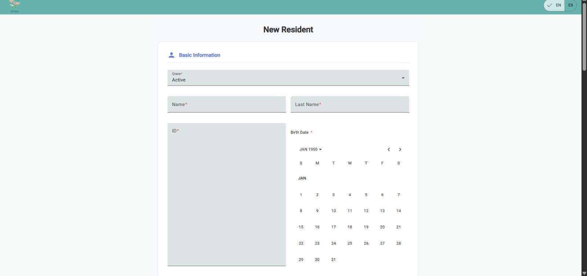

  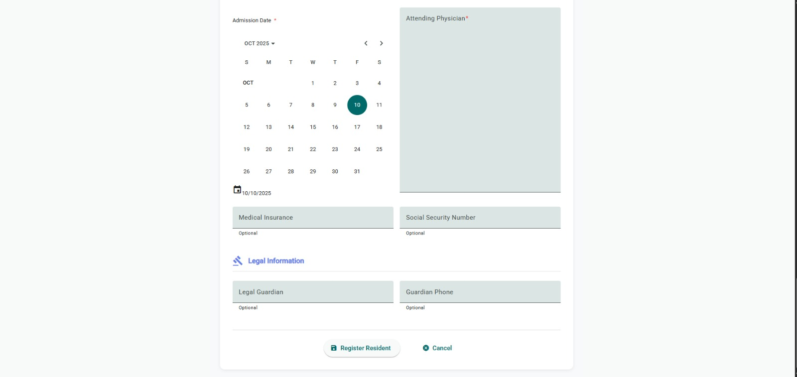

  
Resident-List:

  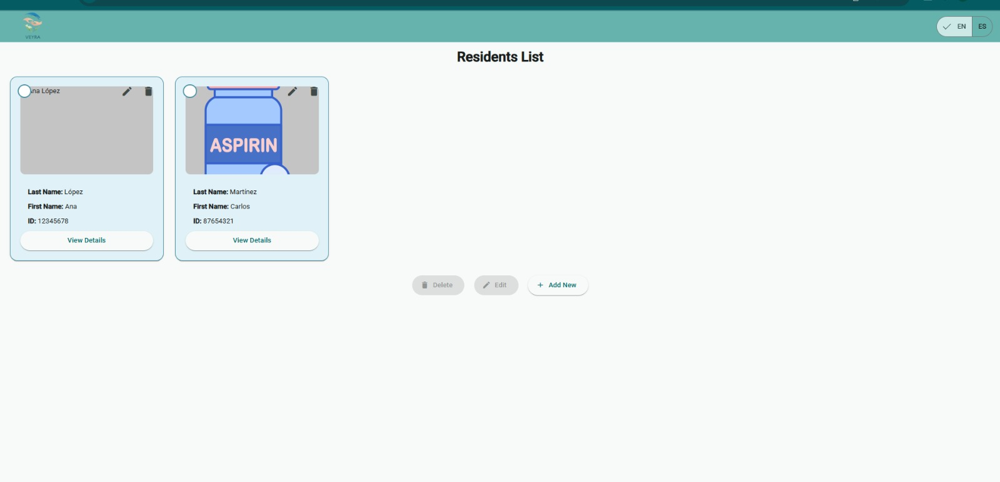

  
Resident:

  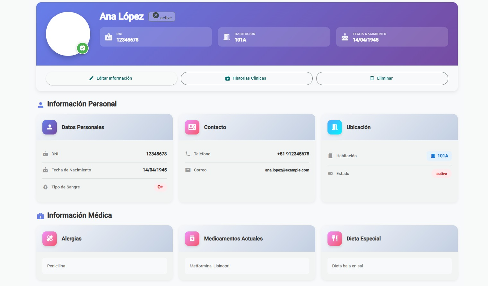

  
Medication-List:

  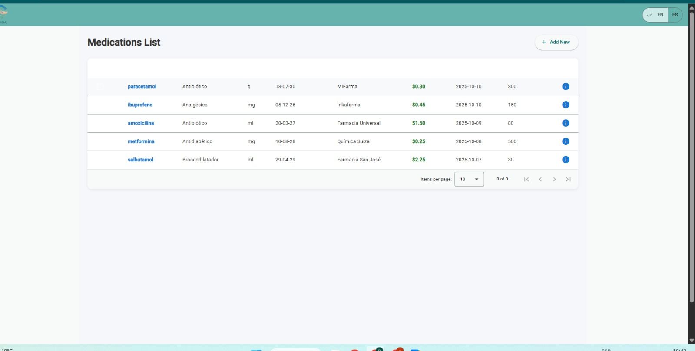

  
Medication:

  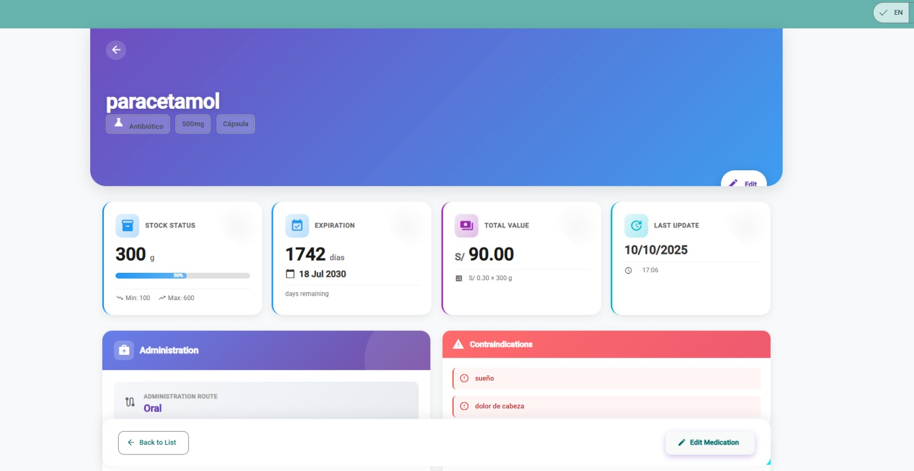

#### 5.2.2.6. Services Documentation Evidence for Sprint Review

  
En el segundo Sprint el equipo diseñó, programó y puso en funcionamiento el Front-end para presentar la aplicación web "Veyra".

  <table>
    <thead>
      <tr><th>End Point</th><th>Funciones</th></tr>
    </thead>
    <tbody>
      <tr>
        <td>https://nova-peru-tech-frontend-v1-2w9r.vercel.app/home</td>
        <td>Mostrar el Front-end Desplegado</td>
      </tr>
    </tbody>
  </table>
  
#### 5.2.2.7. Software Deployment Evidence for Sprint Review

  <a href="https://nova-peru-tech-frontend-v1-2w9r.vercel.app/home">Front-end NovaPeru-Tech</a> -
  <a href="https://nova-peru-tech-frontend-v1-2w9r.vercel.app/home">https://nova-peru-tech-frontend-v1-2w9r.vercel.app/home</a>

#### 5.2.2.8. Team Collaboration Insights during Sprint

### 5.2.3. Sprint 3

Durante el Sprint 3, el equipo se enfocó en dos pilares críticos: la implementación de la capa de persistencia y lógica de negocio en el <strong>Backend</strong> utilizando Java Spring Boot y el <strong>Despliegue (Deploy) del Frontend</strong> desarrollado previamente. Este sprint fue crucial para establecer la infraestructura de la aplicación Veyra en un entorno de producción, sentando las bases para las pruebas de integración.

Repositorio Frontend: <a href="https://github.com/NovaPeru-Tech/NovaPeruTech-Frontend">https://github.com/NovaPeru-Tech/NovaPeruTech-Frontend</a>  
Repositorio Backend: <a href="https://veyrav01.azurewebsites.net/swagger-ui/index.html#/">https://veyrav01.azurewebsites.net/swagger-ui/index.html#/</a>

#### 5.2.3.1. Sprint Planning 3
<table>
    <thead>
      <tr><th>Sprint #</th><th>Sprint 3</th></tr>
    </thead>
    <tbody>
      <tr><td colspan="2" style="text-align:center;">Sprint Planning Background</td></tr>
      <tr><td>Date</td><td>10/11/2025</td></tr>
      <tr><td>Time</td><td>10:00 p.m.</td></tr>
      <tr><td>Location</td><td>Discord</td></tr>
      <tr><td>Prepared By</td><td>Ramirez Carrasco, Ariana Lizeth</td></tr>
      <tr>
        <td>Attendees (to planning meeting)</td>
        <td>
          Calvo Yalan, Renato Guillermo 
          Armas Sánchez, Oscar Javier 
          Ramirez Carrasco, Ariana Lizeth 
          Roman Lopez, Miguel Angel Junior 
          Ruiz Madrid, Billy Jake 
          Quiroz Caceres, Adrian Alonso
        </td>
      </tr>
      <tr><td colspan="2" style="text-align:center;">Sprint 3 Review Summary</td></tr>
      <tr>
        <td colspan="2" style="text-align:center;">
          Se completó el desarrollo del Frontend para los módulos de Tareas, Miembros y Grupos. La interfaz está lista para el usuario y se integró satisfactoriamente con los servicios mockeados. 
          Quedó pendiente la implementación del sistema de autenticación y la configuración de las variables de entorno para el despliegue final.
        </td>
      </tr>
      <tr><td colspan="2" style="text-align:center;">Sprint 3 Retrospective Summary</td></tr>
      <tr>
        <td colspan="2" style="text-align:center;">
          Se mejoró la comunicación, pero se identificó la necesidad de estandarizar la nomenclatura de los servicios y DTOs en el Backend, lo cual se abordará antes de iniciar la programación. 
          El equipo acordó asignar un “guardián de la calidad” (Quality Keeper) rotativo para el Backend en cada sprint.
        </td>
      </tr>
      <tr><td colspan="2" style="text-align:center;">Sprint Goal &amp; User Stories</td></tr>
      <tr>
        <td>Sprint 3 Goal (Outcome–Impact–Customer–Confirmation)</td>
        <td>
          <em>Our focus is to deploy the VEYRA frontend to a live environment and establish the core data management capabilities in the backend (Registration, Login, User Data).</em> 
          <em>We believe this will provide the entire team with a stable environment for integration and testing, permitiendo a los stakeholders ver el progreso real.</em> 
          <em>This will be confirmed when the live URL is accessible and the backend is capable of managing user registration and basic entity data (CRUD) en local y desarrollo.</em>
        </td>
      </tr>
      <tr><td>Sprint 3 Velocity</td><td>18 Story Points</td></tr>
      <tr><td>Sum of Story Points</td><td>18 SP (≈ 72 horas estimadas)</td></tr>
    </tbody>
  </table>

#### 5.2.3.2. Aspect Leaders and Collaborators

Para el Sprint 3 se presenta la matriz <strong>Leadership-and-Collaboration Matrix (LACX)</strong>, donde se definen los roles de liderazgo (<strong>L</strong>) y colaboración (<strong>C</strong>) por aspecto clave del desarrollo.

Los aspectos clave se centran en el despliegue y la implementación del Backend, que son la prioridad de este sprint. El nuevo participante se integra en el rol de colaboración dentro del equipo.

<ul>
  <li><strong>Despliegue & Configuración (DevOps):</strong> Configuración de variables de entorno, pipeline CI/CD y monitoreo del frontend desplegado.</li>
  <li><strong>Desarrollo Backend (Core):</strong> Implementación de la arquitectura MVC/Capas para la gestión de datos (Java Spring Boot, JPA).</li>
  <li><strong>Autenticación & Seguridad:</strong> Desarrollo de los endpoints de registro/login, JWT generation y configuración de seguridad.</li>
</ul>

<table border="1" cellpadding="4" cellspacing="0" align="center">
  <thead>
    <tr>
      <th>Team Member (Last Name, First Name)</th>
      <th>Aspect: DevOps & Deploy</th>
      <th>Aspect: Backend Core (CRUD)</th>
      <th>Aspect: Auth & Security</th>
    </tr>
  </thead>
  <tbody>
    <tr><td>Armas Sánchez, Oscar Javier</td><td>L</td><td>C</td><td>C</td></tr>
    <tr><td>Calvo Yalan, Renato Guillermo</td><td>C</td><td>C</td><td>L</td></tr>
    <tr><td>Ramirez Carrasco, Ariana Lizeth</td><td>C</td><td>L</td><td>C</td></tr>
    <tr><td>Roman Lopez, Miguel Angel Junior</td><td>C</td><td>C</td><td>C</td></tr>
    <tr><td>Ruiz Madrid, Billy Jake</td><td>C</td><td>C</td><td>C</td></tr>
    <tr><td>Quiroz Caceres, Adrian Alonso</td><td>C</td><td>C</td><td>C</td></tr>
  </tbody>
</table>

<ul>
  <li><strong>L</strong> = Líder del aspecto</li>
  <li><strong>C</strong> = Colaborador en el aspecto</li>
</ul>

Los líderes de aspecto son responsables de guiar las decisiones técnicas en su área y asegurar que los entregables cumplan con los estándares definidos, utilizando <strong>GitLab o GitHub Actions</strong> para gestionar los procesos de despliegue.

#### 5.2.3.3. Sprint Backlog 3

El siguiente Sprint Backlog presenta las historias de usuario y <em>technical stories</em> planificadas para el Sprint 3.  
El foco estuvo en implementar los módulos de gestión de residentes, medicamentos, empleados, casas de reposo y actividades en el
<strong>Backend</strong> (Java Spring Boot), así como las estadísticas, notificaciones e integraciones externas necesarias para el despliegue
de VEYRA en un entorno funcional.  
Todos los ítems fueron gestionados y monitoreados en <strong>Jira Software</strong>, utilizando el tablero Scrum del proyecto con los estados
<em>To-do</em>, <em>In-Process</em>, <em>To-Review</em> y <em>Done</em>, de acuerdo con la <em>velocity</em> planificada de 18 Story Points para este sprint.

<table border="1" cellpadding="4" cellspacing="0">
  <thead>
    <tr>
      <th>Epic / User Story</th>
      <th>Work-Item / Task (Sprint 3)</th>
    </tr>
  </thead>
  <tbody>
    <tr>
      <td>
        EP04 – Gestión de Administración 
        <strong>Módulo de Residentes y su información clínica</strong>
      </td>
      <td>
        <strong>TS-RM001</strong> Agregar pacientes — To-do 
        <strong>TS-RM002</strong> Ver información detallada de los pacientes — To-do 
        <strong>TS-RM003</strong> Ver información detallada de todos los pacientes — To-do 
        <strong>TS-RM004</strong> Eliminar paciente — To-do 
        <strong>TS-RM005</strong> Actualizar información de los pacientes — To-do 
        <strong>US08</strong> Historial médico — To-do 
        <strong>US10</strong> Consulta de información personal — To-do 
        <strong>US15</strong> Gestión de visitas familiares — To-do
      </td>
    </tr>
    <tr>
      <td>
        EP07 – Gestión de Medicamentos 
        <strong>Módulo de Inventario y manejo de medicación</strong>
      </td>
      <td>
        <strong>TS-I001</strong> Eliminar medicamentos — To-do 
        <strong>TS-I002</strong> Agregar medicamentos — To-do 
        <strong>TS-I003</strong> Ver información de un medicamento — To-do 
        <strong>TS-I004</strong> Ver todos los medicamentos — To-do 
        <strong>TS-I005</strong> Actualizar información de medicamentos — To-do 
        <strong>US17</strong> Notificaciones de cambios en medicación — To-do 
        <strong>US25</strong> Alertas de vencimiento — To-do
      </td>
    </tr>
    <tr>
      <td>
        EP08 – Gestión de Personal 
        <strong>Módulo de Empleados y gestión de turnos</strong>
      </td>
      <td>
        <strong>TS-EM001</strong> Agregar empleado — To-do 
        <strong>TS-EM002</strong> Eliminar empleado — To-do 
        <strong>TS-EM003</strong> Actualizar información del empleado — To-do 
        <strong>TS-EM004</strong> Ver información de un empleado — To-do 
        <strong>TS-EM005</strong> Ver información de todos los empleados — To-do 
        <strong>US30</strong> Baja de personal — To-do 
        <strong>US31</strong> Búsqueda y filtrado de empleados — To-do 
        <strong>US32</strong> Gestión de horas extra — To-do
      </td>
    </tr>
    <tr>
      <td>
        EP09 – Gestión de Infraestructura 
        <strong>Módulo de Casas de Reposo (Nursing Home)</strong>
      </td>
      <td>
        <strong>TS-NH001</strong> Crear Nursing Home (después del registro) — To-do 
        <strong>TS-NH002</strong> Obtener casa de reposo para el administrador — To-do 
        <strong>TS-NH003</strong> Obtener Nursing Home por ID — To-do 
        <strong>TS-NH004</strong> Listar Nursing Homes — To-do 
        <strong>TS-NH005</strong> Actualizar Nursing Home — To-do
      </td>
    </tr>
    <tr>
      <td>
        EP12 – Gestión de Actividades 
        <strong>Módulo de actividades y agenda</strong>
      </td>
      <td>
        <strong>TS-A001</strong> Crear Actividad — To-do 
        <strong>TS-A002</strong> Listar Actividades — To-do 
        <strong>TS-A003</strong> Ver información de una Actividad — To-do 
        <strong>TS-A004</strong> Eliminar una Actividad — To-do 
        <strong>TS-A005</strong> Inscribir residente a Actividad — To-do 
        <strong>US09</strong> Agenda de citas médicas — To-do 
        <strong>US11</strong> Galería de fotos y actividades — To-do 
        <strong>US23</strong> Planificación de eventos familiares — To-do
      </td>
    </tr>
    <tr>
      <td>
        EP13 – Analítica y Estadísticas 
        <strong>Módulo de reportes y métricas</strong>
      </td>
      <td>
        <strong>TS-ST001</strong> Obtener estadísticas generales — To-do 
        <strong>TS-ST002</strong> Obtener estadísticas de inventario — To-do 
        <strong>TS-ST003</strong> Obtener estadísticas de residentes — To-do
      </td>
    </tr>
    <tr>
      <td>
        EP14 – Integraciones Externas 
        <strong>Integraciones con servicios de terceros</strong>
      </td>
      <td>
        <strong>TS16</strong> Consumir API de Google Maps — To-do 
        <strong>TS18</strong> Integración con Stripe (pagos) — To-do 
        <strong>TS19</strong> Autenticación y 2FA (MFA) — To-do
      </td>
    </tr>
    <tr>
      <td>
        EP03 – Acceso a Información 
        <strong>Acceso a datos clínicos y de agenda</strong>
      </td>
      <td>
        <strong>US09</strong> Agenda de citas médicas — To-do 
        <strong>US11</strong> Galería de fotos y actividades — To-do 
        <strong>US13</strong> Historial médico institucional — To-do
      </td>
    </tr>
    <tr>
      <td>
        EP05 – Notificaciones 
        EP06 – Comunicación Familia–Residencia 
        <strong>Recordatorios, alertas y comunicación con familiares</strong>
      </td>
      <td>
        <strong>US16</strong> Recordatorios de citas y consultas — To-do 
        <strong>US18</strong> Recordatorios de visitas familiares — To-do 
        <strong>US19</strong> Alertas de actualización de datos personales — To-do 
        <strong>US20</strong> Preguntas sobre rutina de cuidados — To-do 
        <strong>US21</strong> Peticiones de modificación de cuidados — To-do 
        <strong>US22</strong> Seguimiento del bienestar emocional — To-do
      </td>
    </tr>
    <tr>
      <td>
        EP10 – Seguridad y Privacidad 
        <strong>Protección de datos y cumplimiento</strong>
      </td>
      <td>
        <strong>US38</strong> Protección de datos mediante cifrado — To-do
      </td>
    </tr>
  </tbody>
</table>

Este Sprint Backlog permitió organizar el trabajo del equipo alrededor de los módulos centrales del sistema (residentes, medicamentos,
empleados, infraestructura, actividades, analítica, integraciones y seguridad), asegurando que cada <em>feature</em> del Backend y las
funcionalidades críticas del Frontend desplegado contribuyan directamente al cumplimiento del Sprint Goal definido para el Sprint 3.

#### 5.2.3.4. Development Evidence for Sprint Review

#### 5.2.3.5. Execution Evidence for Sprint Review

#### 5.2.3.6. Services Documentation Evidence for Sprint Review

### Medications

| URL | Endpoint | HTTP Verb | Acción Implementada | Sintaxis de Llamada | Parámetros Posibles | Ejemplo de Response | Explicación del Response |
| :--- | :--- | :--- | :--- | :--- | :--- | :--- | :--- |
| https://veyrav01.azurewebsites.net/swagger-ui/index.html#/ | `/api/v1/medications/{medicationId}` | GET | Get medication by ID | `'accept: application/json'` | `medicationId (path)` | `{ "id": 0, "residentId": 0, "name": "string", "description": "string", "amount": 0, "expirationDate": "2025-11-17", "drugPresentation": "string", "dosage": "string" }` | Retorna un objeto con los detalles de la medicación. |

---

### Person profiles

| URL | Endpoint | HTTP Verb | Acción Implementada | Sintaxis de Llamada | Parámetros Posibles | Ejemplo de Response | Explicación del Response |
| :--- | :--- | :--- | :--- | :--- | :--- | :--- | :--- |
| https://veyrav01.azurewebsites.net/swagger-ui/index.html#/ | `/api/v1/person-profiles/{personProfileId}` | GET | Get person profile by id | `'accept: application/json'` | `personProfileId (path)` | `{ "id": 0, "fullName": "string", "dni": "string", "birthDate": "2025-11-17", "age": 0, "photo": "string", "phoneNumber": "string", "emailAddress": "string", "StreetAddress": "string" }` | Retorna un objeto con los detalles del perfil de persona. |
| https://veyrav01.azurewebsites.net/swagger-ui/index.html#/ | `/api/v1/person-profiles/{personProfileId}` | PUT | Person profile updated by id | `'Content-Type: application/json' -d '{ "dni": "string", "firstName": "string", ... }'` | `personProfileId (path)` y `JSON con datos del perfil` | `{ "id": 0, "fullName": "string", "dni": "string", "birthDate": "2025-11-17", "age": 0, ... }` | Retorna el objeto del perfil de persona actualizado. |
| https://veyrav01.azurewebsites.net/swagger-ui/index.html#/ | `/api/v1/person-profiles/{personProfileId}` | DELETE | Person profile delete by id | `'accept: application/json'` | `personProfileId (path)` | `{}` | Retorna una respuesta vacía confirmando la eliminación. |
| https://veyrav01.azurewebsites.net/swagger-ui/index.html#/ | `/api/v1/person-profiles` | GET | Get all person profiles | `'accept: application/json'` | `Ninguno` | `[ { "id": 0, "fullName": "string", "dni": "string", ... } ]` | Retorna un array con todos los perfiles de persona. |
| https://veyrav01.azurewebsites.net/swagger-ui/index.html#/ | `/api/v1/person-profiles` | POST | Create a new person profile | `'Content-Type: application/json' -d '{ "dni": "string", "firstName": "string", ... }'` | `JSON con datos del perfil` | `{ "id": 123, "fullName": "string", "dni": "string", ... }` | Retorna el objeto del perfil de persona recién creado. |

---

### Nursing Homes

| URL | Endpoint | HTTP Verb | Acción Implementada | Sintaxis de Llamada | Parámetros Posibles | Ejemplo de Response | Explicación del Response |
| :--- | :--- | :--- | :--- | :--- | :--- | :--- | :--- |
| https://veyrav01.azurewebsites.net/swagger-ui/index.html#/ | `/api/v1/nursing-homes` | GET | Get all nursing homes | `'accept: application/json'` | `Ninguno` | `[ { "id": 0, "businessProfileId": 0 } ]` | Retorna un array con todos los nursing homes. |
| https://veyrav01.azurewebsites.net/swagger-ui/index.html#/ | `/api/v1/nursing-homes` | POST | Create a new nursing home | `'Content-Type: application/json' -d '{ "businessName": "Veyra Tech SAC", ... }'` | `JSON con datos del nursing home` | `{ "id": 1, "businessProfileId": 123 }` | Retorna el objeto nursing home recién creado. |
| https://veyrav01.azurewebsites.net/swagger-ui/index.html#/ | `/api/v1/nursing-homes/{nursingHomeId}/residents` | GET | Get residents for nursing home | `'accept: application/json'` | `nursingHomeId (path)` | `[ { "id": 0, "personProfileId": 0, "status": "string", ... } ]` | Retorna un array de residentes para un nursing home específico. |
| https://veyrav01.azurewebsites.net/swagger-ui/index.html#/ | `/api/v1/nursing-homes/{nursingHomeId}/residents` | POST | Create a new resident in a nursing home | `'Content-Type: application/json' -d '{ "dni": "string", "firstName": "string", ... }'` | `nursingHomeId (path)` y `JSON con datos del residente` | `{ "id": 1, "personProfileId": 456, "status": "ACTIVE", ... }` | Retorna el objeto residente recién creado. |
| https://veyrav01.azurewebsites.net/swagger-ui/index.html#/ | `/api/v1/nursing-homes/{nursingHomeId}` | GET | Get Nursing Home by ID | `'accept: application/json'` | `nursingHomeId (path)` | `{ "id": 0, "businessProfileId": 0 }` | Retorna un objeto con los detalles de un nursing home. |
| https://veyrav01.azurewebsites.net/swagger-ui/index.html#/ | `/api/v1/nursing-homes/{nursingHomeId}/residents/active` | GET | Get all active residents by nursing home | `'accept: application/json'` | `nursingHomeId (path)` | `[ { "id": 0, "personProfileId": 0, "status": "ACTIVE", ... } ]` | Retorna un array de los residentes activos de un nursing home. |

---

### Business Profiles

| URL | Endpoint | HTTP Verb | Acción Implementada | Sintaxis de Llamada | Parámetros Posibles | Ejemplo de Response | Explicación del Response |
| :--- | :--- | :--- | :--- | :--- | :--- | :--- | :--- |
| https://veyrav01.azurewebsites.net/swagger-ui/index.html#/ | `/api/v1/business-profiles` | GET | Get all business profiles | `'accept: application/json'` | `Ninguno` | `[ { "id": 0, "businessName": "string", "ruc": "string", ... } ]` | Retorna un array con todos los perfiles de negocio. |
| https://veyrav01.azurewebsites.net/swagger-ui/index.html#/ | `/api/v1/business-profiles` | POST | Create a new business profile | `'Content-Type: application/json' -d '{ "businessName": "string", ... }'` | `JSON con datos del perfil de negocio` | `{ "id": 1, "businessName": "string", "ruc": "string", ... }` | Retorna el objeto del perfil de negocio recién creado. |
| https://veyrav01.azurewebsites.net/swagger-ui/index.html#/ | `/api/v1/business-profiles/{businessId}` | GET | Get business profile by Id | `'accept: application/json'` | `businessId (path)` | `{ "id": 0, "businessName": "string", "ruc": "string", ... }` | Retorna un objeto con los detalles de un perfil de negocio. |

---

### Contracts Endpoints

| URL | Endpoint | HTTP Verb | Acción Implementada | Sintaxis de Llamada | Parámetros Posibles | Ejemplo de Response | Explicación del Response |
| :--- | :--- | :--- | :--- | :--- | :--- | :--- | :--- |
| https://veyrav01.azurewebsites.net/swagger-ui/index.html#/ | `/api/v1/staff/{staffMemberId}/contract` | GET | Get contracts for staff member | `'accept: application/json'` | `staffMemberId (path)` | `[ { "id": 0, "staffId": 0, "startDate": "2025-11-17", ... } ]` | Retorna un array con los contratos de un miembro del personal. |
| https://veyrav01.azurewebsites.net/swagger-ui/index.html#/ | `/api/v1/staff/{staffMemberId}/contract` | POST | Add a contract to the contract | `'Content-Type: application/json' -d '{ "startDate": "2025-11-17", ... }'` | `staffMemberId (path)` y `JSON con datos del contrato` | `{ "id": 1, "staffId": 0, "startDate": "2025-11-17", "status": "ACTIVE", ... }` | Retorna el objeto del contrato recién creado. |
| https://veyrav01.azurewebsites.net/swagger-ui/index.html#/ | `/api/v1/staff/{staffMemberId}/contract/{contractId}` | GET | Get a specific contract of a staff member | `'accept: application/json'` | `staffMemberId (path)`, `contractId (path)` | `{ "id": 0, "staffId": 0, "startDate": "2025-11-17", ... }` | Retorna un objeto con los detalles de un contrato específico. |
| https://veyrav01.azurewebsites.net/swagger-ui/index.html#/ | `/api/v1/staff/{staffMemberId}/contract/{contractId}` | PATCH | Update contract status | `'Content-Type: application/json' -d '{ "newStatus": "string" }'` | `staffMemberId (path)`, `contractId (path)`, `JSON con nuevo status` | `{ "id": 0, "staffId": 0, "status": "INACTIVE", ... }` | Retorna el objeto del contrato con el estado actualizado. |

---

### Staff Endpoint

| URL | Endpoint | HTTP Verb | Acción Implementada | Sintaxis de Llamada | Parámetros Posibles | Ejemplo de Response | Explicación del Response |
| :--- | :--- | :--- | :--- | :--- | :--- | :--- | :--- |
| https://veyrav01.azurewebsites.net/swagger-ui/index.html#/ | `/api/v1/staff/{staffId}` | PUT | Staff updated by ID | `'Content-Type: application/json' -d '{ "dni": "string", "firstName": "string", ... }'` | `staffId (path)` y `JSON con datos del staff` | `{ "id": 0, "profileId": 0, "emergencyContactFirstName": "string", ... }` | Retorna el objeto del staff actualizado. |
| https://veyrav01.azurewebsites.net/swagger-ui/index.html#/ | `/api/v1/staff` | GET | Get all staff | `'accept: application/json'` | `Ninguno` | `[ { "id": 0, "profileId": 0, "emergencyContactFirstName": "string", ... } ]` | Retorna un array con todo el personal. |
| https://veyrav01.azurewebsites.net/swagger-ui/index.html#/ | `/api/v1/staff` | POST | Create new Staff | `'Content-Type: application/json' -d '{ "dni": "string", "firstName": "string", ... }'` | `JSON con datos del staff` | `{ "id": 1, "profileId": 123, "emergencyContactFirstName": "string", ... }` | Retorna el objeto del staff recién creado. |

---

### Residents

| URL | Endpoint | HTTP Verb | Acción Implementada | Sintaxis de Llamada | Parámetros Posibles | Ejemplo de Response | Explicación del Response |
| :--- | :--- | :--- | :--- | :--- | :--- | :--- | :--- |
| https://veyrav01.azurewebsites.net/swagger-ui/index.html#/ | `/api/v1/residents/{residentId}` | GET | Get resident by ID | `'accept: application/json'` | `residentId (path)` | `{ "id": 1, "personProfileId": 1, "status": "ACTIVE", ... }` | Retorna un objeto con los detalles de un residente. |
| https://veyrav01.azurewebsites.net/swagger-ui/index.html#/ | `/api/v1/residents/{residentId}` | PUT | Update resident by ID | `'Content-Type: application/json' -d '{ "dni": "string", "firstName": "string", ... }'` | `residentId (path)` y `JSON con datos del residente` | `{ "id": 1, "personProfileId": 1, "status": "ACTIVE", ... }` | Retorna el objeto del residente actualizado. |
| https://veyrav01.azurewebsites.net/swagger-ui/index.html#/ | `/api/v1/residents/{residentId}` | DELETE | Delete resident by ID | `'accept: application/json'` | `residentId (path)` | `{}` | Retorna una respuesta vacía confirmando la eliminación. |
| https://veyrav01.azurewebsites.net/swagger-ui/index.html#/ | `/api/v1/residents/{residentId}/medications` | GET | Get medications for resident | `'accept: application/json'` | `residentId (path)` | `[ { "id": 0, "residentId": 0, "name": "string", ... } ]` | Retorna un array con las medicaciones de un residente. |
| https://veyrav01.azurewebsites.net/swagger-ui/index.html#/ | `/api/v1/residents/{residentId}/medications` | POST | Create a new medication for resident | `'Content-Type: application/json' -d '{ "name": "string", "description": "string", ... }'` | `residentId (path)` y `JSON con datos de la medicación` | `{ "id": 1, "residentId": 0, "name": "string", ... }` | Retorna el objeto de la medicación recién creada. |

---

### analytics-controller

| URL | Endpoint | HTTP Verb | Acción Implementada | Sintaxis de Llamada | Parámetros Posibles | Ejemplo de Response | Explicación del Response |
| :--- | :--- | :--- | :--- | :--- | :--- | :--- | :--- |
| https://veyrav01.azurewebsites.net/swagger-ui/index.html#/ | `/api/v1/analytics/{nursingHomeId}` | GET | Get general analytics | `'accept: application/json'` | `nursingHomeId (path)` | `{ "totalResidents": 0, "activeResidents": 0, "totalEmployees": 0, ... }` | Retorna un objeto con las analíticas generales del nursing home. |
| https://veyrav01.azurewebsites.net/swagger-ui/index.html#/ | `/api/v1/analytics/{nursingHomeId}/statistics/residents` | GET | Get resident statistics | `'accept: application/json'` | `nursingHomeId (path)` | `{ "totalResidents": 0, "byGender": { ... }, "byAgeRange": { ... }, ... }` | Retorna un objeto con estadísticas detalladas de residentes. |
| https://veyrav01.azurewebsites.net/swagger-ui/index.html#/ | `/api/v1/analytics/{nursingHomeId}/inventory` | GET | Get inventory analytics | `'accept: application/json'` | `nursingHomeId (path)` | `{ "totalMedications": 0, "totalValue": 0, "expiringThisMonth": 0, ... }` | Retorna un objeto con analíticas del inventario de medicación. |

#### 5.2.3.7. Software Deployment Evidence for Sprint Review

En esta sección se describen los procesos de despliegue de la base de datos y el Web Service realizados durante el Sprint. Para la base de datos, se utilizó **Azure**, donde se creó una instancia de [Azure SQL Database o Azure Database for MySQL/PostgreSQL]. El Web Service se desplegó en **Azure App Service**, configurando un plan de servicio, activando el centro de implementación y publicando directamente desde **IntelliJ IDEA** con el plugin de Azure. Ambos componentes quedaron listos para su uso.

### Despliegue de la base de datos

Para el despliegue de la base de datos se utilizó **Azure**.

1.  Inicio sesión en el portal de Azure, me dirijo a "Bases de datos" y selecciono "Crear" [ej. Azure SQL Database].
    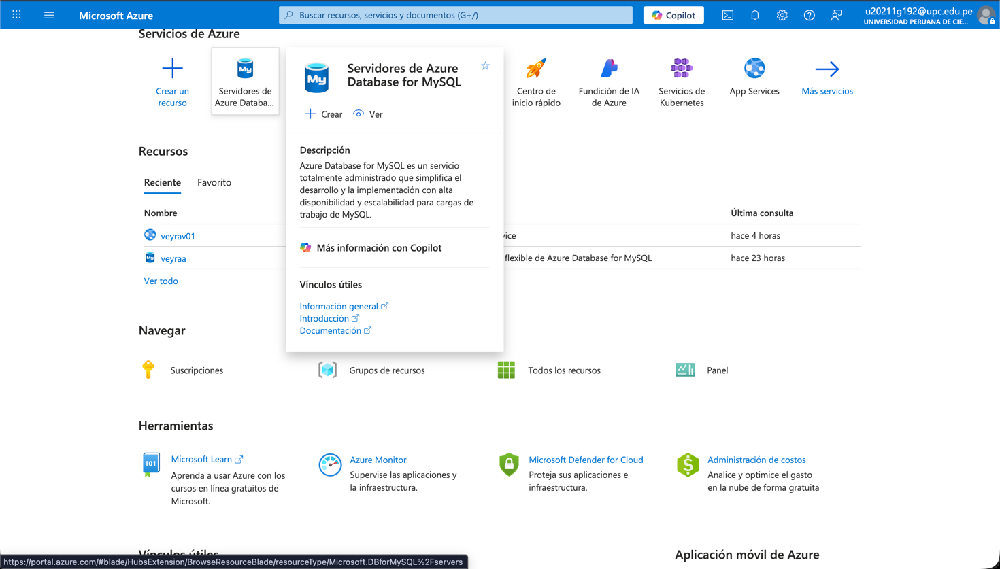

2.  Se selecciona la suscripción, el grupo de recursos y se especifican los detalles de la base de datos (nombre, servidor).
    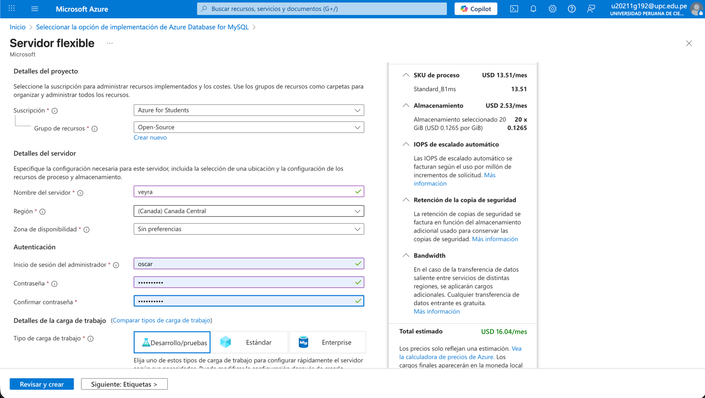

3.  Se crea un nuevo servidor (si no existe) y se configuran las credenciales de administrador.
    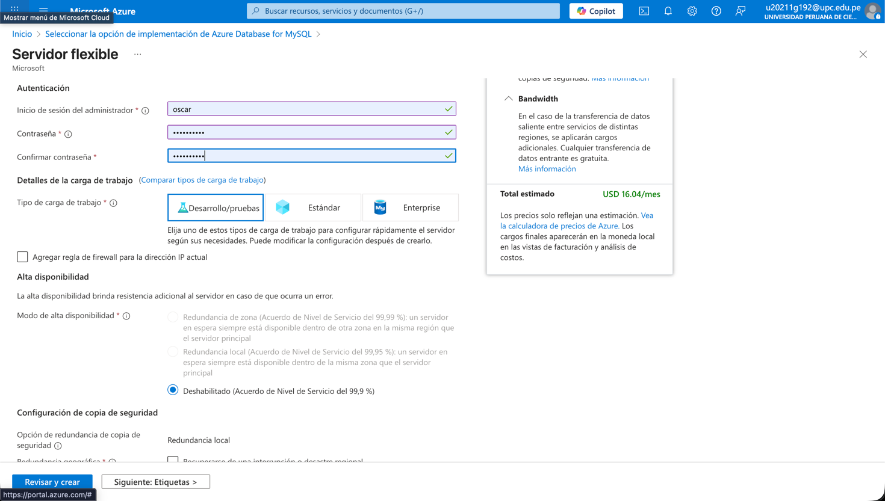

4.  Se elige el plan de servicio (ej. Básico o un plan de desarrollo) y se revisan las configuraciones.
    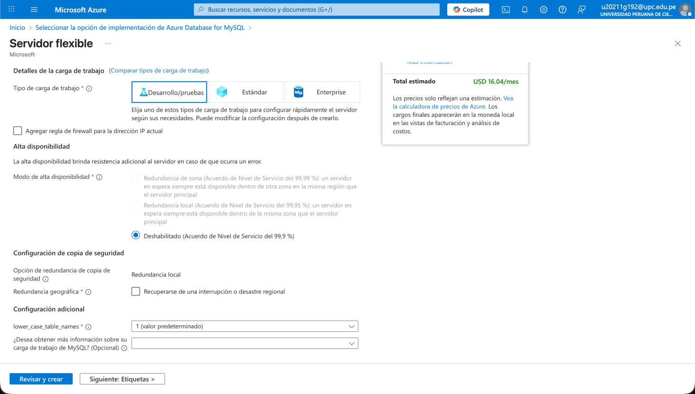

5.  Se confirma la creación y se espera a que el recurso esté disponible.
    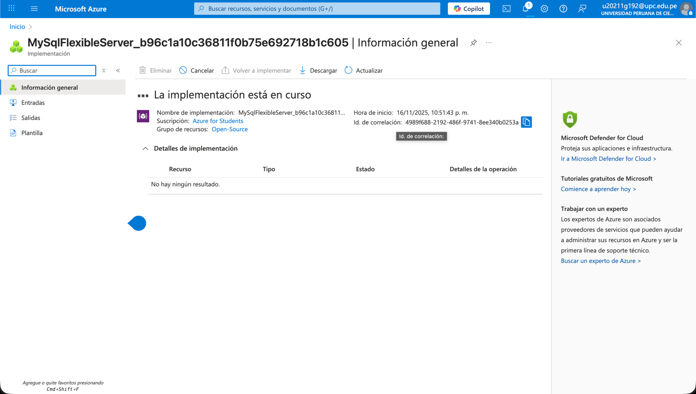

6.  Finalmente, se configura el **Firewall** del servidor de la base de datos para permitir las conexiones desde el Web Service y el acceso local.
    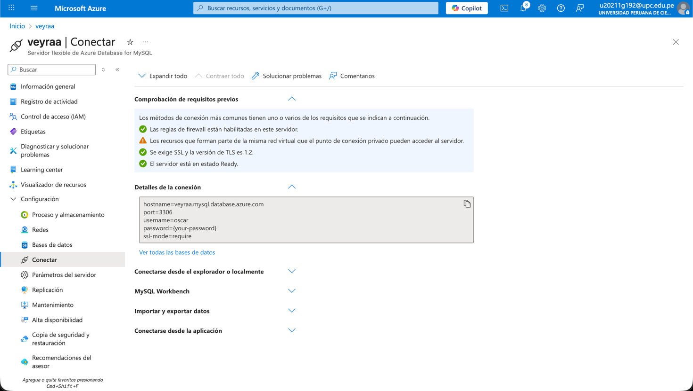

### Despliegue del Web Service

1.  En **IntelliJ IDEA**, se completa el archivo de configuración (ej. `application.properties` o `.yml`) con los datos (URL, usuario, contraseña) de la base de datos creada en Azure.
    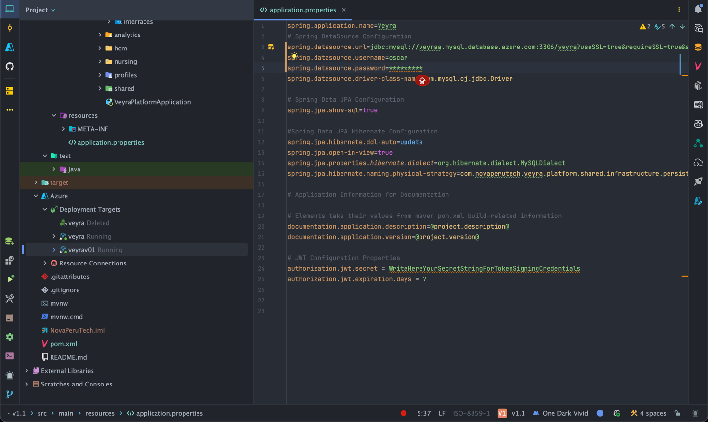

2.  Se ejecuta el proyecto localmente para probar y verificar que la conexión al servicio de base de datos de Azure es exitosa.
    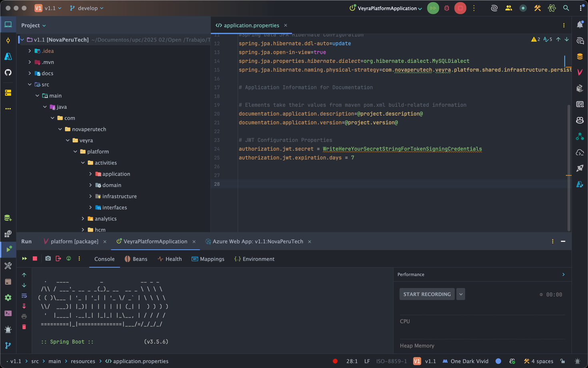

3.  Una vez validado, se busca en el explorador de proyecto, se hace clic derecho y se selecciona "Azure" -> "Deploy to Azure Web Apps".
    

4.  Se completa la ventana de configuración: se inicia sesión en Azure, se selecciona la suscripción y el App Service (ej. "veyrav01") creado previamente.
    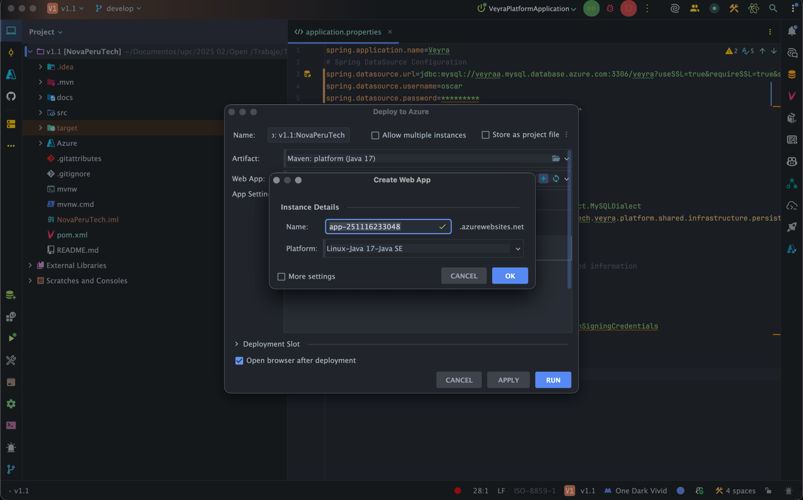

5.  En la configuración de runtime, se selecciona **Java 17**, ya que no es posible desplegar con Java 25 [o la versión deseada] en el plan actual.
    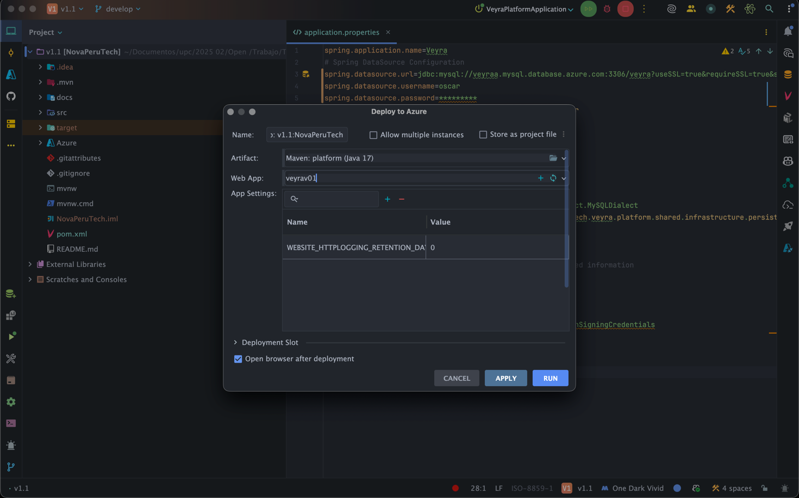

6. .  Se presiona "Run" y se espera a que el proceso de despliegue compile, empaquete y suba el artefacto a Azure.
    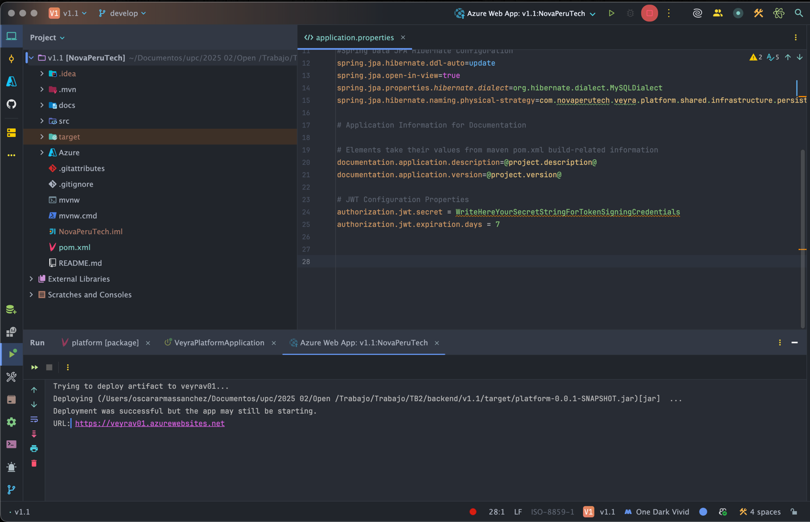

7.  Al finalizar, la consola de IntelliJ muestra "Successfully deployed..." y provee el link del sitio.
    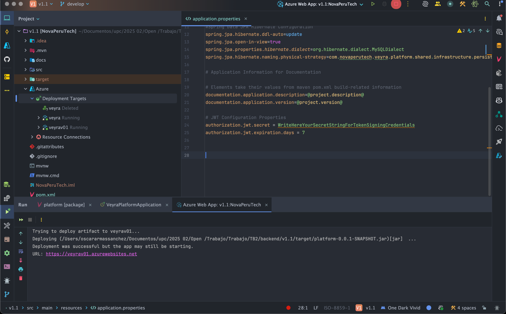

8.  Para verificar el despliegue, se toma el link (ej. `https://veyrav01.azurewebsites.net`) y se le agrega la ruta `/swagger-ui/index.html` en el navegador.
    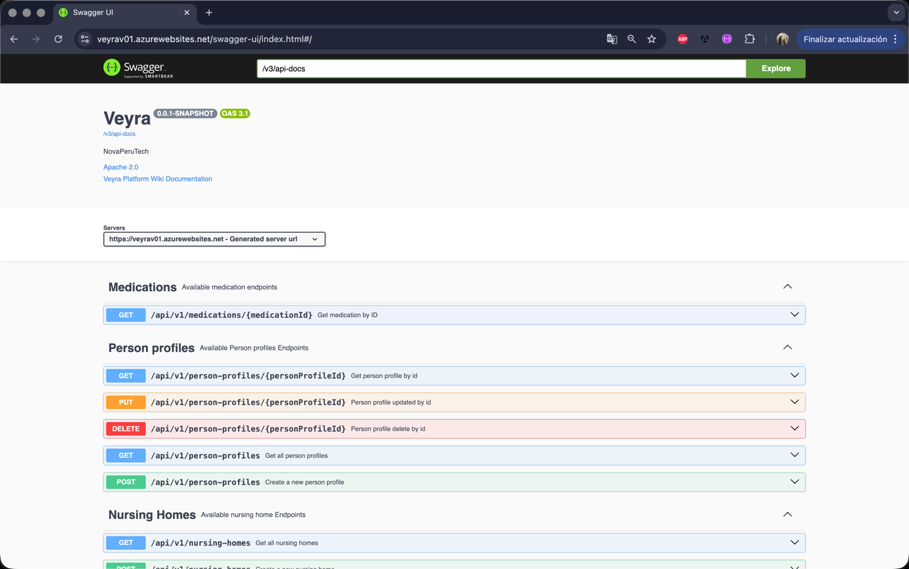

**Link del Web Service desplegado:** [https://veyrav01.azurewebsites.net/swagger-ui/index.html](https://veyrav01.azurewebsites.net/swagger-ui/index.html)

#### 5.2.3.8. Team Collaboration Insights during Sprint

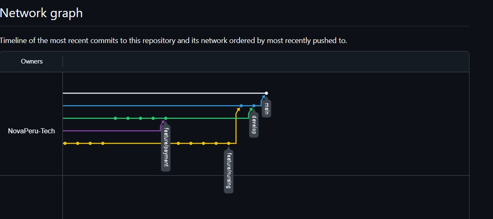
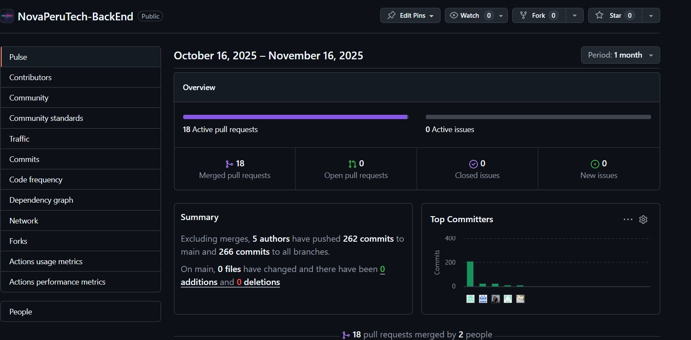
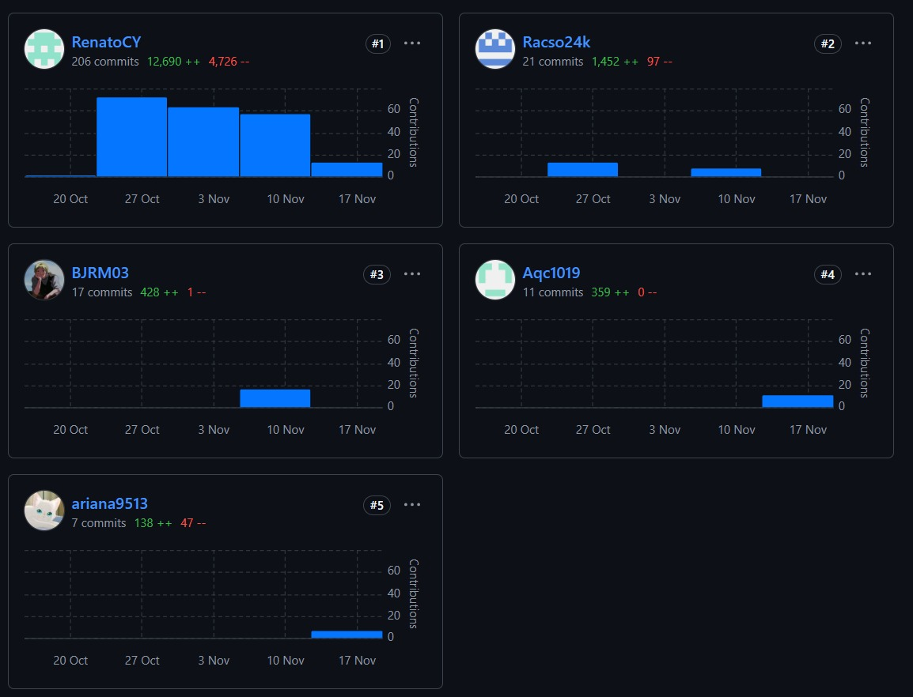

## 5.3. Validation Interviews

Para validar nuestros entregables (Landing Page y aplicación web), realizaremos entrevistas con nuestros segmentos objetivo: **Administradores de casas de reposo y Familiares de adultos mayores.**
El propósito es recopilar su opinión sobre la utilidad, claridad y facilidad de uso de la solución propuesta por el Team Veyra, así como detectar mejoras a nivel de UI/UX y funcionalidad.

Las preguntas se plantean de forma cercana pero estructurada, buscando obtener feedback sobre navegación, claridad, accesibilidad y valor percibido en su experiencia diaria.

### 5.3.1. Diseño de Entrevistas

**Preguntas Segmento 1 — Administradores de Casas de Reposo:**

1. ¿Qué tan fácil te fue registrar nuevos residentes en el sistema?

2. ¿Pudiste acceder rápidamente al historial clínico de cada residente?

3. ¿La información disponible es suficiente para gestionar el cuidado diario?

4. ¿Qué tan intuitivo te pareció registrar actividades o tratamientos?

5. ¿Te resultó clara la forma en que se muestran alertas o notificaciones?

6. ¿Consideras que Veyra facilita la comunicación con los familiares? ¿Cómo?

7. ¿Crees que el sistema podría reducir carga administrativa? ¿De qué manera?

8. ¿Hay funciones que te gustaría automatizar (por ejemplo: recordatorios, reportes, actividades)?

9. En comparación con tus métodos actuales, ¿Veyra mejora la organización?

10. ¿Sentiste que el flujo para buscar información es natural o requiere muchos pasos?

**Preguntas Segmento 2 — Familiares de Adultos Mayores**

1. ¿Qué tan fácil fue registrarte e ingresar a la plataforma?

2. ¿Pudiste encontrar rápidamente la información sobre tu familiar?

3. ¿La información sobre salud, medicación y actividades fue clara?

4. ¿Con qué frecuencia te gustaría recibir notificaciones o actualizaciones?

5. ¿Te resultó útil tener un registro de actividades diarias? ¿Por qué?

6. ¿La interfaz te transmite confianza y seguridad respecto al manejo de datos?

7. ¿Qué tan útil sería para ti recibir alertas en tiempo real sobre emergencias?

8. ¿Consideras sencillo contactar al personal desde la plataforma?

9. ¿Hay información o funciones que te gustaría ver agregadas?

10. ¿Te ayudó Veyra a sentir mayor tranquilidad sobre el bienestar del adulto mayor?

### 5.3.2. Registro de Entrevistas

En esta sección presentamos los registros de las entrevistas que hicimos para cada segmento objetivo de nuestra aplicación.

**Segmento 1: Administradores de casas de reposo** 

<table>
<colgroup>
</colgroup>
<thead>
  <tr>
    <th colspan="2">Entrevista #1 </th>
  </tr>
</thead>
<tbody>
  <tr>
    <td>Nombre</td>
    <td>Milagros Beatriz</td>
  </tr>
  <tr>
    <td>Apellidos</td>
    <td>Caycho Mata</td>
  </tr>
  <tr>
    <td>Edad</td>
    <td>59 años</td>
  </tr>
  <tr>
    <td>Rol</td>
    <td>Gerente administrativa</td>
  </tr>
  <tr>
    <td>Evidencia</td>
    <td>
</td>
  </tr>
  <tr>
    <td>Link</td>
    <td>
<a target="_blank"  href="https://shorturl.at/uoNBn" title="Title">Entrevista grabada – Microsoft Stream
</td>
  </tr>
  <tr>
    <td>Duracion </td>
    <td>0:00 min - 04:28 min</td>
  </tr>
  <tr>
    <td>Resumen</td>
    <td>
		....
</td>
  </tr>
</tbody>
</table>

<table>
<colgroup>
</colgroup>
<thead>
  <tr>
    <th colspan="2">Entrevista #2 </th>
  </tr>
</thead>
<tbody>
  <tr>
    <td>Nombre</td>
    <td>Oscar Alberto</td>
  </tr>
  <tr>
    <td>Apellidos</td>
    <td>Navarrete Mendoza</td>
  </tr>
  <tr>
    <td>Edad</td>
    <td>54 años</td>
  </tr>
  <tr>
    <td>Rol</td>
    <td>Gerente general de residencia geriátrica</td>
  </tr>
  <tr>
    <td>Evidencia</td>
    <td>
</td>
  </tr>
  <tr>
    <td>Link</td>
    <td>
<a target="_blank"  href="https://shorturl.at/uoNBn" title="Title">Entrevista grabada – Microsoft Stream
</td>
  </tr>
  <tr>
    <td>Duracion </td>
    <td>04:29 min - 08:16 min</td>
  </tr>
  <tr>
    <td>Resumen</td>
    <td>
		.....
</td>
  </tr>
</tbody>
</table>

<table>
<colgroup>
</colgroup>
<thead>
  <tr>
    <th colspan="2">Entrevista #3 </th>
  </tr>
</thead>
<tbody>
  <tr>
    <td>Nombre</td>
    <td>Recoba Funciyu</td>
  </tr>
  <tr>
    <td>Apellidos</td>
    <td>Valenzuela Huaynillo</td>
  </tr>
  <tr>
    <td>Edad</td>
    <td>27 años</td>
  </tr>
  <tr>
    <td>Distrito</td>
    <td>Lima</td>
  </tr>
  <tr>
    <td>Evidencia</td>
    <td>
</td>
  </tr>
  <tr>
    <td>Link</td>
    <td>
<a target="_blank"  href="https://shorturl.at/uoNBn" title="Title">Entrevista grabada – Microsoft Stream
</td>
  </tr>
  <tr>
    <td>Duracion </td>
    <td>08:16 min - 12:20 min</td>
  </tr>
  <tr>
    <td>Resumen</td>
    <td>
		.....
</td>
  </tr>
</tbody>
</table>

**Segmento 2: Familiares de adultos mayores** 

<table>
<colgroup>
</colgroup>
<thead>
  <tr>
    <th colspan="2">Entrevista #1 </th>
  </tr>
</thead>
<tbody>
  <tr>
    <td>Nombre</td>
    <td>Ivonne</td>
  </tr>
  <tr>
    <td>Apellidos</td>
    <td>Madrid Ruisco</td>
  </tr>
  <tr>
    <td>Edad</td>
    <td>49 años</td>
  </tr>
  <tr>
    <td>Distrito</td>
    <td>Sullana</td>
  </tr>
  <tr>
    <td>Evidencia</td>
    <td>
</td>
  </tr>
  <tr>
    <td>Link</td>
    <td>
<a target="_blank"  href="https://shorturl.at/uoNBn" title="Title">Entrevista grabada – Microsoft Stream
</td>
  </tr>
  <tr>
    <td>Duracion </td>
    <td>12:21 min - 14:46 min</td>
  </tr>
  <tr>
    <td>Resumen</td>
    <td>
		.....
</td>
  </tr>
</tbody>
</table>

<table>
<colgroup>
</colgroup>
<thead>
  <tr>
    <th colspan="2">Entrevista #2 </th>
  </tr>
</thead>
<tbody>
  <tr>
    <td>Nombre</td>
    <td>Leo Gerardo</td>
  </tr>
  <tr>
    <td>Apellidos</td>
    <td>Gómez Ferrua</td>
  </tr>
  <tr>
    <td>Edad</td>
    <td>30 años</td>
  </tr>
  <tr>
    <td>Distrito</td>
    <td>Chorrillos</td>
  </tr>
  <tr>
    <td>Evidencia</td>
    <td>
</td>
  </tr>
  <tr>
    <td>Link</td>
    <td>
<a target="_blank"  href="https://shorturl.at/uoNBn" title="Title">Entrevista grabada – Microsoft Stream
</td>
  </tr>
  <tr>
    <td>Duracion </td>
    <td>14:47 min - 19:27 min</td>
  </tr>
  <tr>
    <td>Resumen</td>
    <td>
		.....

</td>
  </tr>
</tbody>
</table>

<table>
<colgroup>
</colgroup>
<thead>
  <tr>
    <th colspan="2">Entrevista #3 </th>
  </tr>
</thead>
<tbody>
  <tr>
    <td>Nombre</td>
    <td>Jonathan</td>
  </tr>
  <tr>
    <td>Apellidos</td>
    <td>Ramirez</td>
  </tr>
  <tr>
    <td>Edad</td>
    <td>40 años</td>
  </tr>
  <tr>
    <td>Distrito</td>
    <td>Lima</td>
  </tr>
  <tr>
    <td>Evidencia</td>
    <td>
</td>
  </tr>
  <tr>
    <td>Link</td>
    <td>
<a target="_blank"  href="https://shorturl.at/uoNBn" title="Title">Entrevista grabada – Microsoft Stream
</td>
  </tr>
  <tr>
    <td>Duracion </td>
    <td>19:28 min - 22:33 min</td>
  </tr>
  <tr>
    <td>Resumen</td>
    <td>
		.....
</td>
  </tr>
</tbody>
</table>

### 5.3.3. Evaluaciones según heurísticas

    <h2>UX Heuristics & Principles Evaluation</h2>
    <h3>Usability – Inclusive Design – Information Architecture</h3>

<strong>CARRERA:</strong> Ingeniería de Software

<strong>CURSO: Desarrollo de Aplicaciones Open Source </strong> 

<strong>SECCIÓN:</strong> 7338

<strong>PROFESORES: Angel Augusto Velasquez Nuñez</strong> 

<strong>AUDITOR: El equipo de Veyra</strong> 

<strong>CLIENTE(S):</strong> [Información del Cliente]

 

<strong>SITE O APP A EVALUAR:</strong>

Veyra Application

 

<strong>TAREAS A EVALUAR:</strong>

El alcance de esta evaluación incluye la revisión de las siguientes tareas:

<ol>
    <li>Revisión de la consistencia de lenguaje (Inglés/Español)</li>
    <li>Validación de los flujos de registro y acceso</li>
    <li>Comprobar si el diseño transmite confianza y profesionalismo</li>
        <li>Validar si la información presentada resulta atractiva y relevante para posibles usuarios</li>
    <li>Evaluar la gestión de errores en vistas de tabla</li>
    <li>Revisión de la usabilidad de formularios de inventario</li>
    <li>Evaluación de la carga de información crítica (habitaciones)</li>
    <li>Revisión de la claridad de los botones de acción (CTAs)</li>
</ol>

 

No están incluidas en esta versión de la evaluación las siguientes tareas:

<ol>
    <li>Pruebas de estrés y rendimiento.</li>
    <li>Revisión de código fuente.</li>
    <li>Análisis de seguridad.</li>
    <li>Evaluación de accesibilidad para usuarios con discapacidades visuales.</li>
    <li>Test A/B de diseño.</li>
    <li>Análisis de <em>feedback</em> de usuarios reales.</li>
</ol>

<strong>ESCALA DE SEVERIDAD:</strong>

Los errores serán puntuados tomando en cuenta la siguiente escala de severidad

<table>
    <tr>
        <th style="border: 1px solid #dddddd; padding: 8px; text-align: center;">Nivel</th>
        <th style="border: 1px solid #dddddd; padding: 8px; text-align: center;">Descripción</th>
    </tr>
    <tr>
        <td style="border: 1px solid #dddddd; padding: 8px; text-align: center;">1</td>
        <td style="border: 1px solid #dddddd; padding: 8px; text-align: justify;">Problema superficial: puede ser fácilmente superador por el usuario ó ocurre con muy poco frecuencia. No necesita ser arreglado a no ser que exista disponibilidad de tiempo.</td>
    </tr>
    <tr>
        <td style="border: 1px solid #dddddd; padding: 8px; text-align: center;">2</td>
        <td style="border: 1px solid #dddddd; padding: 8px; text-align: justify;">Problema menor: puede ocurrir un poco más frecuentemente o es un poco más difícil de superar para el usuario. Se le debería asignar una prioridad baja resolverlo de cara al siguiente reléase</td>
    </tr>
    <tr>
        <td style="border: 1px solid #dddddd; padding: 8px; text-align: center;">3</td>
        <td style="border: 1px solid #dddddd; padding: 8px; text-align: justify;">Problema mayor: ocurre frecuentemente o los usuarios no son capaces de resolverlos. Es importante que sean corregidos y se les debe asignar una prioridad alta.</td>
    </tr>
    <tr>
        <td style="border: 1px solid #dddddd; padding: 8px; text-align: center;">4</td>
        <td style="border: 1px solid #dddddd; padding: 8px; text-align: justify;">Problema muy grave: un error de gran impacto que impide al usuario continuar con el uso dela herramienta. Es imperativo que sea corregido antes del lanzamiento.</td>
    </tr>
</table>

<strong>TABLA RESUMEN:</strong>

<table>
    <tr>
        <th style="border: 1px solid #dddddd; padding: 8px; text-align: center;">#</th>
        <th style="border: 1px solid #dddddd; padding: 8px; text-align: center;">Problema</th>
        <th style="border: 1px solid #dddddd; padding: 8px; text-align: center;">Escala de severidad</th>
        <th style="border: 1px solid #dddddd; padding: 8px; text-align: center;">Heurística/Principio violada(o)</th>
    </tr>
    <tr>
        <td style="border: 1px solid #dddddd; padding: 8px; text-align: center;">1</td>
        <td style="border: 1px solid #dddddd; padding: 8px; text-align: justify;"><strong>Confusión de rol en formulario de registro</strong> (Staff vs. Resident) y mezcla de idiomas en campos obligatorios.</td>
        <td style="border: 1px solid #dddddd; padding: 8px; text-align: center;">3</td>
        <td style="border: 1px solid #dddddd; padding: 8px; text-align: justify;">Usability: <strong>Visibility of system status</strong> y <strong>Consistency and standards</strong></td>
    </tr>
    <tr>
        <td style="border: 1px solid #dddddd; padding: 8px; text-align: justify;">2</td>
        <td style="border: 1px solid #dddddd; padding: 8px; text-align: justify;"><strong>Error de carga de datos críticos</strong> de Habitaciones ("Failed to fetch entities") sin mensaje amigable o acción de recuperación.</td>
        <td style="border: 1px solid #dddddd; padding: 8px; text-align: center;">4</td>
        <td style="border: 1px solid #dddddd; padding: 8px; text-align: justify;">Usability: <strong>Help users recognize, diagnose, and recover from errors</strong></td>
    </tr>
    <tr>
        <td style="border: 1px solid #dddddd; padding: 8px; text-align: center;">3</td>
        <td style="border: 1px solid #dddddd; padding: 8px; text-align: justify;">Botón de acción con <strong>etiqueta de código</strong> ("medication.add") en el formulario de inventario.</td>
        <td style="border: 1px solid #dddddd; padding: 8px; text-align: center;">3</td>
        <td style="border: 1px solid #dddddd; padding: 8px; text-align: justify;">Usability: <strong>Match between system and the real world</strong> y <strong>Consistency and standards</strong></td>
    </tr>
    <tr>
        <td style="border: 1px solid #dddddd; padding: 8px; text-align: center;">4</td>
        <td style="border: 1px solid #dddddd; padding: 8px; text-align: justify;"><strong>Llamadas a la acción (CTAs) técnicas</strong> en la página de inicio de sesión (e.g., `auth.sign-in`).</td>
        <td style="border: 1px solid #dddddd; padding: 8px; text-align: center;">4</td>
        <td style="border: 1px solid #dddddd; padding: 8px; text-align: justify;">Usability: <strong>Match between system and the real world</strong> y <strong>Aesthetic and minimalist design</strong></td>
    </tr>
    <tr>
        <td style="border: 1px solid #dddddd; padding: 8px; text-align: center;">5</td>
        <td style="border: 1px solid #dddddd; padding: 8px; text-align: justify;">Uso de <strong>"0" como valor inicial</strong> en campos de entrada numérica y mezcla de idiomas en títulos de sección de Inventario.</td>
        <td style="border: 1px solid #dddddd; padding: 8px; text-align: center;">2</td>
        <td style="border: 1px solid #dddddd; padding: 8px; text-align: justify;">Usability: <strong>Error Prevention</strong> y <strong>Consistency and standards</strong></td>
    </tr>
    <tr>
        <td style="border: 1px solid #dddddd; padding: 8px; text-align: center;">6</td>
        <td style="border: 1px solid #dddddd; padding: 8px; text-align: justify;">Etiqueta <strong>"Optional" redundante</strong> en el campo 'Barcode' e inconsistencia de idioma en la sección de Lote y Proveedor.</td>
        <td style="border: 1px solid #dddddd; padding: 8px; text-align: center;">1</td>
        <td style="border: 1px solid #dddddd; padding: 8px; text-align: justify;">Usability: <strong>Consistency and standards</strong> y <strong>Flexibility and efficiency of use</strong></td>
    </tr>
</table>

 

<strong>DESCRIPCIÓN DE PROBLEMAS:</strong>

<strong>Problema #1:</strong> <strong>Confusión de rol en formulario de registro y mezcla de idiomas</strong>

<strong>Severidad:</strong> 3

<strong>Heurística/Principio violada(o):</strong> Usability: <strong>Visibility of system status</strong> y <strong>Consistency and standards</strong>

<strong>Problema:</strong>

El contexto de la navegación lateral indica "Staff", pero el botón de acción dice "Register Resident" (Registrar Residente), confundiendo al usuario sobre qué rol está registrando. Además, el formulario utiliza una mezcla de inglés y español para las etiquetas de los campos (`dni*`, `birthdate*`, `phone number*`).

    

 

<strong>Recomendación:</strong>

Corregir la <strong>consistencia</strong> del sistema. Si la sección es "Staff", el botón debe ser "Register Staff" o "Registrar Personal". <strong>Estandarizar el idioma de todos los campos</strong> a español para mantener la coherencia lingüística en la interfaz y mejorar la experiencia del usuario.

 

<strong>Problema #2:</strong> <strong>Error de carga de datos críticos de Habitaciones</strong>

<strong>Severidad:</strong> 4

<strong>Heurística/Principio violada(o):</strong> Usability: <strong>Help users recognize, diagnose, and recover from errors</strong>

<strong>Problema:</strong>

La vista de "Rooms" (Habitaciones) muestra un error técnico grave: "Resource not found: Failed to fetch entities", que impide la carga de información fundamental. El mensaje técnico no es útil para el usuario, no explica qué sucedió y no ofrece una solución. Adicionalmente, los encabezados de la tabla presentan inconsistencia lingüística.

    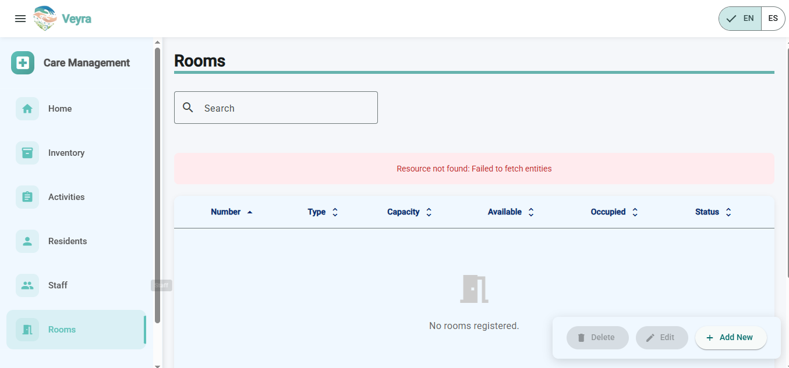

 

<strong>Recomendación:</strong>

Reemplazar el error técnico por un mensaje amigable y orientador, como <strong>"No se pudieron cargar las habitaciones. Por favor, intente recargar la página o contacte a soporte."</strong> Asegurar que las columnas de la tabla tengan una <strong>nomenclatura consistente</strong> (ej. "Número", "Tipo", "Estado").

 

<strong>Problema #3:</strong> <strong>Botón de acción con etiqueta de código en inventario</strong>

<strong>Severidad:</strong> 3

<strong>Heurística/Principio violada(o):</strong> Usability: <strong>Match between system and the real world</strong> y <strong>Consistency and standards</strong>

<strong>Problema:</strong>

El botón de acción principal al final del formulario de inventario muestra la etiqueta de código <strong>"medication.add"</strong>. Este error impide la usabilidad, rompe la confianza y es una inconsistencia grave. También persiste la mezcla de idiomas en los botones, como <strong>"Cancel"</strong>.

    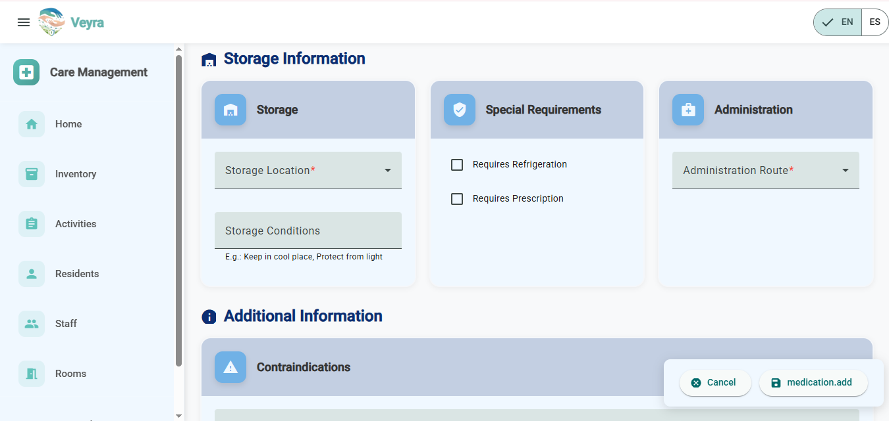

 

<strong>Recomendación:</strong>

Corregir la etiqueta del botón de acción principal a un texto claro y legible, como <strong>"Añadir Medicamento"</strong> o <strong>"Guardar"</strong>. Estandarizar el idioma de todos los botones de acción a español (ej. <strong>"Cancelar"</strong>).

 

<strong>Problema #4:</strong> <strong>Llamadas a la acción (CTAs) con etiquetas de desarrollo en Login</strong>

<strong>Severidad:</strong> 4

<strong>Heurística/Principio violada(o):</strong> Usability: <strong>Match between system and the real world</strong> y <strong>Aesthetic and minimalist design</strong>

<strong>Problema:</strong>

La página de inicio de sesión muestra etiquetas de código como <strong>`auth.already-have-account`</strong>, <strong>`-> auth.sign-in`</strong> y <strong>`AUTH.OR-CREATE-ACCOUNT`</strong> en lugar del texto destinado al usuario. Esto es un error de alto impacto que impide la tarea fundamental de acceso al sistema y afecta la credibilidad.

    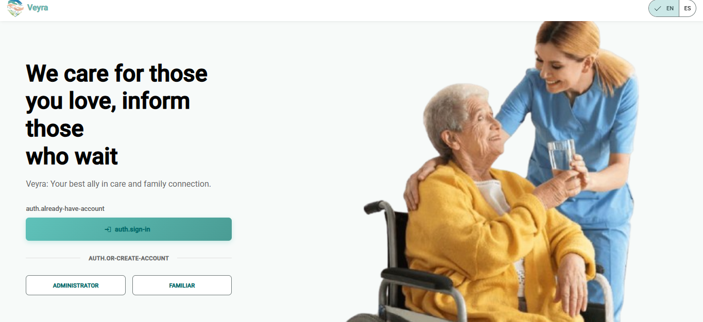

 

<strong>Recomendación:</strong>

Corregir las etiquetas de localización/texto a frases amigables y claras, como <strong>"¿Ya tienes una cuenta?"</strong>, el botón debe decir <strong>"Iniciar Sesión"</strong>, y el separador <strong>"O crear una cuenta"</strong>.

 

<strong>Problema #5:</strong> <strong>"0" como valor inicial y mezcla de idiomas en Inventario</strong>

<strong>Severidad:</strong> 2

<strong>Heurística/Principio violada(o):</strong> Usability: <strong>Error Prevention</strong> y <strong>Consistency and standards</strong>

<strong>Problema:</strong>

El uso del valor "0" como valor inicial en campos de entrada numérica (`Quantity*`, `Unit Cost*`, etc.) puede confundir al usuario, quien podría no borrarlo o pensar que es un <em>placeholder</em>. La inconsistencia en los títulos de las secciones (`Stock Status`, `Value`) en inglés es un problema constante.

    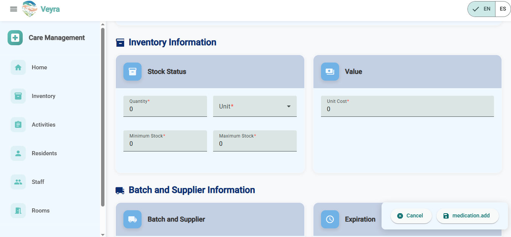

 

<strong>Recomendación:</strong>

Asegurarse de que los campos de entrada de datos estén <strong>vacíos o utilicen un <em>placeholder</em> de texto</strong> para evitar confusiones. Estandarizar la nomenclatura de las secciones a español (ej. <strong>"Estado de Stock"</strong> y <strong>"Valoración"</strong>).

 

<strong>Problema #6:</strong> <strong>Etiqueta 'Optional' redundante en Barcode</strong>

<strong>Severidad:</strong> 1

<strong>Heurística/Principio violada(o):</strong> Usability: <strong>Consistency and standards</strong> y <strong>Flexibility and efficiency of use</strong>

<strong>Problema:</strong>

El campo <strong>`Barcode`</strong> está etiquetado como "Optional", lo cual es redundante si la convención para indicar campos obligatorios es el asterisco (`*`). Esto rompe la uniformidad visual. El título de la sección <strong>"Batch and Supplier Information"</strong> está en inglés.

    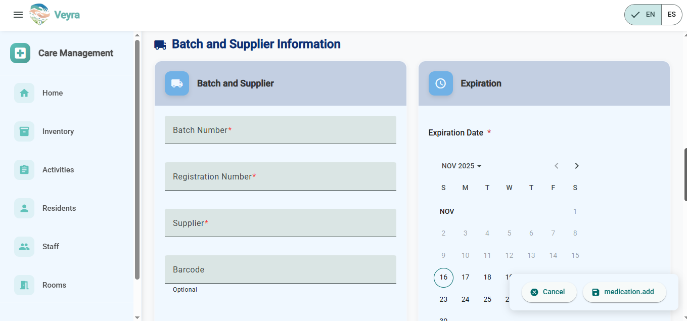

 

<strong>Recomendación:</strong>

Estandarizar el idioma del título de la sección a español (ej. <strong>"Información de Lote y Proveedor"</strong>). Eliminar la etiqueta redundante <strong>"Optional"</strong> del campo `Barcode` para mantener la consistencia en el formulario.

## Video About-the-Product

    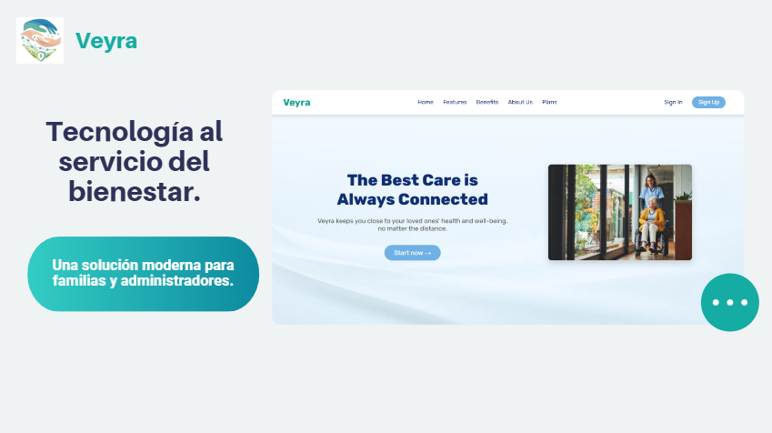

 

   Enlace del <strong>Video About-the-Product</strong>: <a href="https://youtu.be/DCPqVW0C2Po">https://youtu.be/DCPqVW0C2Po</a>

## Video About-the-Team

    

 

   Enlace del <strong>Video About-the-Team</strong>: <a href="https://youtu.be/-tBBZ8lwbts">https://youtu.be/-tBBZ8lwbts</a>

## Bibliografía
  <ul>
    <li>Refactoring.Guru. <em>Design patterns</em>. <a href="https://refactoring.guru/es/design-patterns">refactoring.guru</a></li>
    <li>Gothelf, J., &amp; Seiden, J. (2021). <em>Lean UX: Designing great products with agile teams</em> (3rd ed.). O’Reilly Media.</li>
    <li>Evans, E. (2004). <em>Domain-driven design</em>. Addison-Wesley.</li>
    <li>Vernon, V. <em>Domain-driven design reference</em>. <a href="https://domainlanguage.com/ddd/reference/">domainlanguage.com</a></li>
    <li>Martin, R. C. (2017). <em>Clean architecture</em>. Prentice Hall.</li>
  </ul>

## Anexos
  <ul>
    - Deploy de Landing Page: https://novaperu-tech.github.io/NovaPeru-Tech-LandingPage/  
    - Deploy del Backend: https://veyrav01.azurewebsites.net/swagger-ui/index.html#/  
    - Video de Exposición TB1: http://bit.ly/4h2grbc  
    - Video de Exposición TB2: http://bit.ly/4h2grbc  
    - Video About the Product en Youtube: https://youtu.be/DCPqVW0C2Po  
	- Video About the Product en Microsoft Stream: https://shorturl.at/W0vMy  
    - Video About the Team en Youtube: https://youtu.be/-tBBZ8lwbts  
	- Video About the Team en Microsoft Stream: https://shorturl.at/jAp77

  </ul>
</body>
</html>

