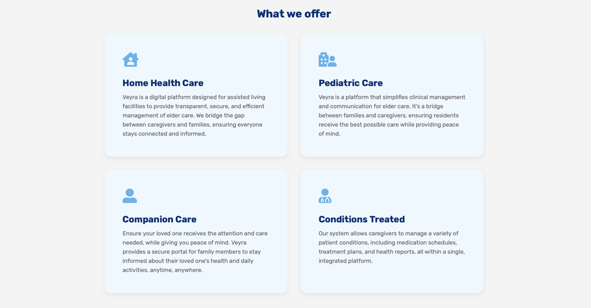
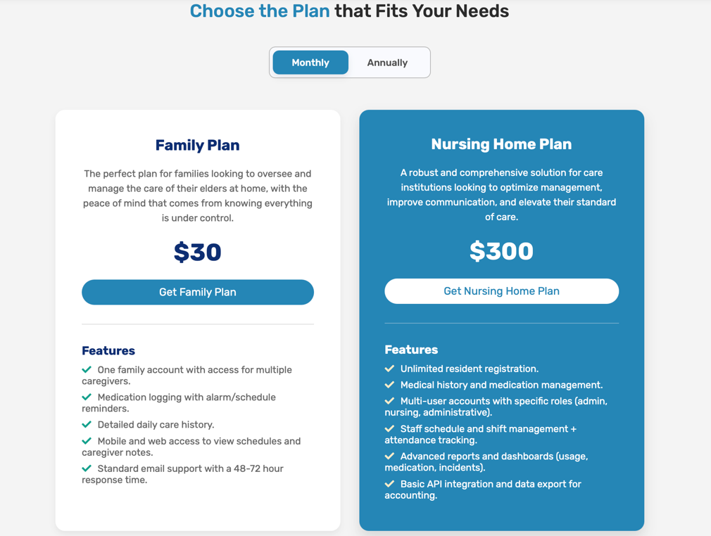
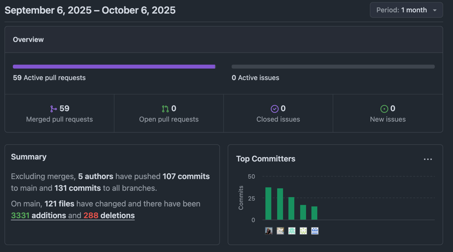
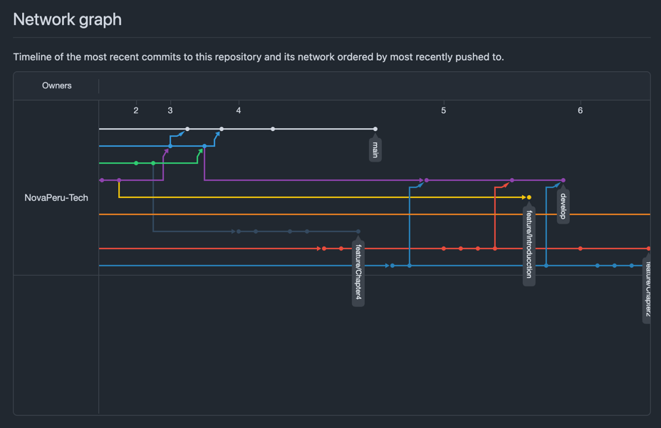
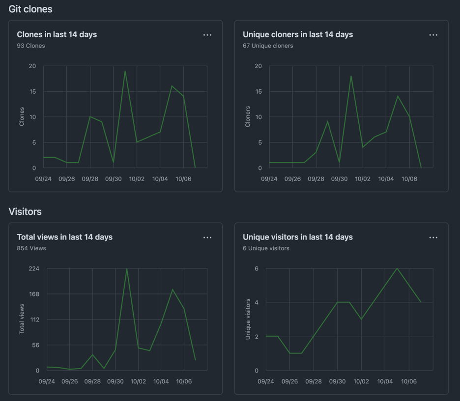
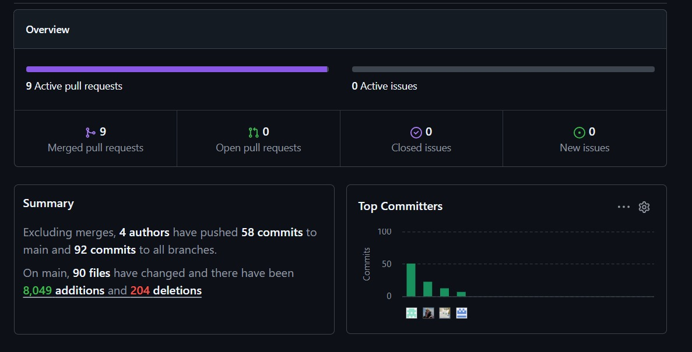
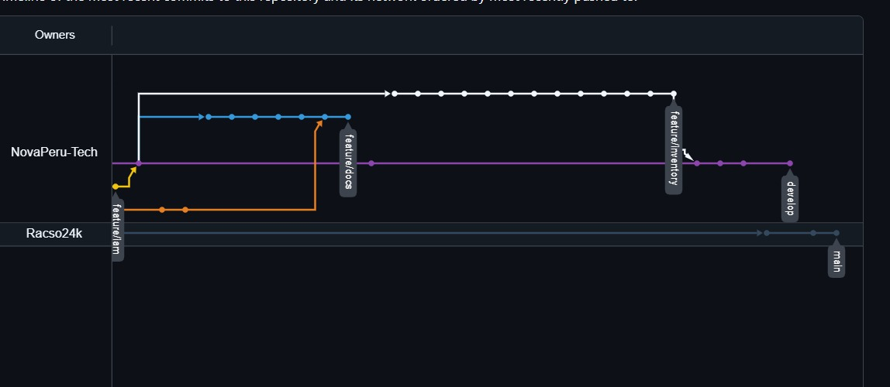
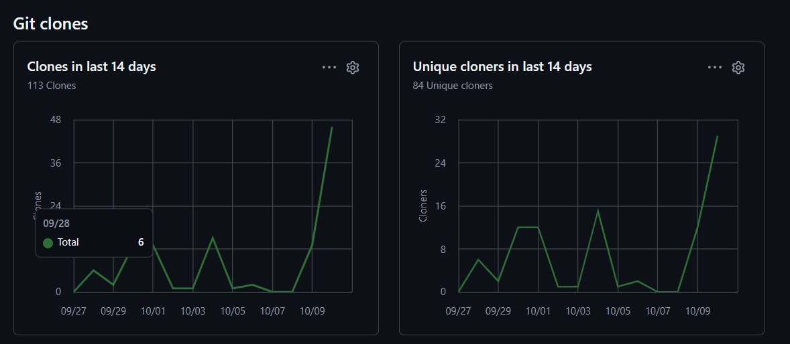

<html lang="es">
<body>
  
# Capítulo V: Product Implementation, Validation & Deployment
  
## 5.1. Software Configuration Management
  
En este punto del informe se describe las decisiones y los principios que ayudarán al equipo a garantizar la coherencia durante el desarrollo de la solución.

  
### 5.1.1. Software Development Environment Configuration
  
En este apartado se proporcionan los enlaces a las aplicaciones y productos de software creados durante el ciclo del proyecto utilizando los programas correspondientes.

  
Con ese fin, se organizará en las siguientes secciones:

  <ol>
    <li>Project Management</li>
    <li>Requirements Management</li>
    <li>Product UX/UI Design</li>
    <li>Software Development</li>
    <li>Software Testing</li>
    <li>Software Documentation</li>
  </ol>
  
Asimismo, se clasificarán los elementos de estas secciones como rutas de referencia (para software basado en modelos Saas) o rutas de descarga (para productos que se ejecuten en las computadoras de los miembros del equipo) para cada uno de los productos de software.

<h4>Project Management</h4>
  
Esta disciplina se fundamenta en la administración de proyectos y busca principalmente la mejora de procesos y su entorno con el propósito de lograr los resultados esperados.

  
<em>Durante el ciclo digital del proyecto, se llevará a cabo la implementación de un producto de software basado en el modelo SaaS, el cual funcionará a través de un navegador web; no obstante, no se desarrollará una versión de la aplicación móvil correspondiente.</em>

<h4>Requirements Management:</h4>
  
Este proceso se enfoca en asegurar que una organización documente, verifique y satisfaga las necesidades y expectativas de sus clientes, así como las de las partes interesadas internas o externas.

  <ul>
    <li><strong>Trello:</strong> Trello es una plataforma digital de gestión de proyectos basada en tableros, listas y tarjetas, que permite organizar tareas, colaborar en equipo y supervisar el progreso de manera visual y eficiente.</li>
  </ul>

<h4>Product UX/UI Design</h4>
  
Esta herramienta facilita la creación digital de modelos que se integran en la vida del consumidor. En este caso, estamos desarrollando un modelo de sitio web compatible tanto con computadoras como con dispositivos móviles.

  
Para lograrlo, utilizamos varias herramientas de diseño y colaboración, que incluyen:

  <ol>
    <li><strong>Uxpressia:</strong> plataforma para mapeo de la trayectoria del cliente. <a href="https://uxpressia.com/">uxpressia.com</a></li>
    <li><strong>MIRO:</strong> pizarra digital colaborativa. <a href="https://miro.com/es/">miro.com/es</a></li>
    <li><strong>Figma:</strong> herramienta de prototipado web. <a href="https://www.figma.com/es-es/">figma.com</a></li>
    <li><strong>Lucid Chart:</strong> aplicación de diagramación colaborativa. <a href="https://www.lucidchart.com/pages/es">lucidchart.com</a></li>
    <li><strong>Overflow:</strong> herramienta para diagramas de Userflows. <a href="https://overflow.io/">overflow.io</a></li>
  </ol>

<h4>Software Development:</h4>
  
El desarrollo de software es una metodología aplicada en la creación de productos de software. A continuación, algunas herramientas y tecnologías clave:

  <ol>
    <li><strong>GitHub:</strong> repositorio del proyecto: <a href="https://github.com/NovaPeru-Tech">https://github.com/NovaPeru-Tech</a></li>
    <li><strong>Webstorm:</strong> IDE orientado al desarrollo web. <a href="https://www.jetbrains.com/webstorm/">webstorm</a></li>
    <li><strong>HTML, CSS, JavaScript:</strong> tecnologías para la implementación web.</li>
  </ol>

<h4>Software Testing:</h4>
  
Acción de evaluar los elementos y el funcionamiento del software mediante validación y verificación.

  
<strong>Lenguaje Gherkin:</strong> DSL para escribir historias de usuario y escenarios de prueba (Feature, Scenario, Given, When, Then, etc.).

<h4>Software Documentation</h4>
  
Textos o ilustraciones que acompañan al software para explicar su funcionamiento o uso.

### 5.1.2. Source Code Management

  
Se describe la gestión del código fuente (SCM). Usaremos GitHub como sistema de control de versiones.

  <ol>
    <li>URL de la organización: NovaPeru Tech - <a href="https://github.com/NovaPeru-Tech">https://github.com/NovaPeru-Tech</a></li>
    <li>URL del repositorio de la Landing Page: <a href="https://github.com/NovaPeru-Tech/NovaPeru-Tech-LandingPage">NovaPeru-Tech-LandingPage</a></li>
  </ol>

<h4>GitFlow</h4>
  
GitFlow es un modelo de ramas para Git. Ramas principales y de soporte:

  <ul>
    <li><strong>Main:</strong> rama principal (history oficial de versiones).</li>
    <li><strong>Develop:</strong> integración de features estables.</li>
    <li><strong>Feature branches:</strong> se ramifican de <code>develop</code> y vuelven a fusionarse en <code>develop</code>.</li>
  </ul>

  
<strong>Convenciones para naming de Features y Conventional Commits:</strong>

  <pre><code>&lt;type&gt;[optional scope]: &lt;description&gt;

Tipos comunes:
- feat: nuevo feature
- fix: corrección
- build: cambios en build/deps
- chore: tareas internas
- docs: documentación
- refractor: refactor
- perf: mejoras de rendimiento
- style: estilo
- test: pruebas
  </code></pre>

  
Ejemplos:

  <pre><code>feat(welcome): add welcome section
build(release): bump version to 1.0.0
style: remove empty line
</code></pre>

  
Instrucciones rápidas para vincular WebStorm con GitHub (resumen):

  <ol>
    <li>VCS &gt; Enable Version Control Integration (seleccionar Git).</li>
    <li>Agregar cuenta de GitHub desde Settings.</li>
    <li>Configurar nombre de usuario y realizar commits.</li>
    <li>Manage Remotes &gt; pegar URL del repositorio.</li>
  </ol>

### 5.1.3. Source Code Style Guide & Conventions

  
Pautas, convenciones y estilos para los lenguajes usados: HTML, CSS, JavaScript, C#, TypeScript y Gherkin.

<h4>Nomenclatura General</h4>
  
Se usará inglés relacionado con la entidad representada, en minúsculas. Ejemplos:

  <pre><code>.gallery {}
.video {}
.login {}
</code></pre>

<h4>Sangría</h4>
  
Espaciado de dos espacios dentro de bloques. Ejemplo HTML:

  <pre><code>&lt;!DOCTYPE html&gt;
&lt;html&gt;
  &lt;head&gt;
    &lt;title&gt;Título del Documento&lt;/title&gt;
  &lt;/head&gt;
  &lt;body&gt;
    &lt;h1&gt;Encabezado Principal&lt;/h1&gt;
    &lt;p&gt;Este es un párrafo dentro del cuerpo del documento.&lt;/p&gt;
  &lt;/body&gt;
&lt;/html&gt;
</code></pre>

<h4>Especificaciones generales por lenguaje</h4>

<h5>HTML</h5>
  <ul>
    <li>Declarar <code>&lt;!DOCTYPE html&gt;</code> en la primera línea.</li>
    <li>Usar líneas en blanco para separar bloques largos.</li>
    <li>Usar comillas dobles para atributos: <code>&lt;table class="striped"&gt;</code></li>
    <li>No omitir el elemento <code>&lt;title&gt;</code>.</li>
    <li>Evitar líneas de código extremadamente largas; usar saltos y sangrías.</li>
  </ul>

<h5>CSS</h5>
  <ul>
    <li>Preferir shorthand properties cuando sea posible.</li>
    <li>Declaraciones terminadas con punto y coma.</li>
    <li>Un espacio después de ":" en propiedades.</li>
    <li>Usar comillas simples para valores (p. ej. <code>font-family: 'open sans', arial, sans-serif;</code>).</li>
  </ul>

<h5>JavaScript</h5>
  <ul>
    <li>Espacios alrededor de operadores.</li>
    <li>Instrucciones simples terminan con punto y coma.</li>
    <li>Llaves de función en la misma línea de la declaración.</li>
    <li>Objetos con llave final seguida de punto y coma.</li>
  </ul>

<h5>Gherkin</h5>
  
Reglas de sangrado y ejemplos:

  <pre><code>Scenario: Ingreso de requisitos con claridad
  Given que en el formulario de ingreso de oferta laboral
  When escribo claramente los requisitos
  Then se mostrará el mensaje
  And mi oferta solo aparecerá a quienes cumplan con estos
</code></pre>

<h5>C#</h5>
  
Pautas y ejemplos breves:

  <pre><code>// Interpolación de cadenas
string displayName = $"{nameList[n].LastName}, {nameList[n].FirstName}";

// StringBuilder para concatenaciones grandes
var manyPhrases = new StringBuilder();
for (var i = 0; i &lt; 10000; i++) {
manyPhrases.Append(phrase);
}
</code></pre>

<h5>Typescript</h5>
  
Ejemplos de declaración de variables:

  <pre><code>let edad: number;
edad = 20;

let edadAitor: number = 18;
</code></pre>

### 5.1.4. Software Deployment Configuration

  
Para desplegar la Landing Page desde GitHub Pages hay que seguir estos pasos:

  <ol>
    <li>Ubicar el repositorio y dirigirse a <strong>Settings</strong>.</li>
    <li>Seleccionar la sección <strong>Pages</strong>.</li>
    <li>Configurar la rama que será usada para deploy.</li>
  </ol>

## 5.2. Landing Page, Services & Applications Implementation

### 5.2.1. Sprint 1

  
Implementación del diseño de la Landing Page en WebStorm. Se espera completar Home, Services, Pricing, Testimonials y About Us al concluir el Sprint.

  
Repositorio: <a href="https://github.com/NovaPeru-Tech/NovaPeru-Tech-LandingPage">https://github.com/NovaPeru-Tech/NovaPeru-Tech-LandingPage</a>

  
Landing Page Deployed: <a href="https://novaperu-tech.github.io/NovaPeru-Tech-NovaPeru-Tech-LandingPage/">https://novaperu-tech.github.io/NovaPeru-Tech-NovaPeru-Tech-LandingPage/</a>

#### 5.2.1.1. Sprint Planning
  <table>
    <thead>
      <tr><th>Sprint #</th><th>Sprint 1</th></tr>
    </thead>
    <tbody>
      <tr><td colspan="2" style="text-align:center;">Sprint Planning Background</td></tr>
      <tr><td>Date</td><td>14-09-2025</td></tr>
      <tr><td>Time</td><td>10:00 p.m</td></tr>
      <tr><td>Location</td><td>Discord</td></tr>
      <tr><td>Prepared By</td><td>Renato Calvo</td></tr>
      <tr>
        <td>Attendees (to planning meeting)</td>
        <td>
          Calvo Yalan, Renato Guillermo 
          Oscar Javier Armas Sánchez 
          Ariana Lizeth Ramirez Carrasco 
          Miguel Angel Junior Roman Lopez 
          Billy Jake Ruiz Madrid
        </td>
      </tr>
      <tr><td colspan="2" style="text-align:center;">Sprint Goal &amp; User Stories</td></tr>
      <tr><td>Sprint 1 Goal</td><td>Implementar la landing page incluyendo las distintas secciones acordadas y el requisito de cambio de idioma para la aplicación de VEYRA</td></tr>
      <tr><td>Sprint 1 Velocity</td><td>13 Story Points</td></tr>
      <tr><td>Sum of Story Points</td><td>13 SP (≈ 53 horas estimadas)</td></tr>
    </tbody>
  </table>

#### 5.2.1.2. Aspect Leaders and Collaborators

En esta sección se presenta la matriz Leadership-and-Collaboration Matrix (LACX) para el Sprint 1, donde se detallan los aspectos principales del Sprint, y para cada aspecto se indica quién es el líder (L) y quiénes son colaboradores (C). Esto tiene como objetivo brindar mayor claridad y efectividad en la comunicación interna del equipo y facilitar la asignación y seguimiento de tareas.

Para el Sprint 1, se han definido los siguientes aspectos:

<ul>
  <li><strong>Desarrollo de la Landing Page:</strong> Diseño, estructura, contenido y funcionalidad de la página principal del proyecto.</li>
  <li><strong>Generación y presentación del Reporte:</strong> Implementación del módulo que permita crear, visualizar y exportar el reporte requerido.</li>
</ul>

<table border="1" cellpadding="4" cellspacing="0">
  <thead>
    <tr>
      <th>Team Member (Last Name, First Name)</th>
      <th>Aspecto: Landing Page</th>
      <th>Aspecto: Reporte</th>
    </tr>
  </thead>
  <tbody>
    <tr>
      <td>Calvo Yalan, Renato Guillermo</td>
      <td>L</td>
      <td>C</td>
    </tr>
    <tr>
      <td>Oscar Javier Armas Sánchez</td>
      <td>C</td>
      <td>L</td>
    </tr>
    <tr>
      <td>Ariana Lizeth Ramirez Carrasco</td>
      <td>C</td>
      <td>C</td>
    </tr>
    <tr>
      <td>Miguel Angel Junior Roman Lopez</td>
      <td>C</td>
      <td>C</td>
    </tr>
    <tr>
      <td>Billy Jake Ruiz Madrid</td>
      <td>C</td>
      <td>C</td>
    </tr>
  </tbody>
</table>

<ul>
  <li><strong>L</strong> = Líder del aspecto</li>
  <li><strong>C</strong> = Colaborador en el aspecto</li>
</ul>

La organización de roles de líderes y colaboradores está alineada con la posterior selección y asignación de tareas en el Sprint, permitiendo que cada líder lleve el seguimiento y gestión de su aspecto con apoyo de sus colaboradores, mejorando así la coordinación y efectividad del equipo.

#### 5.2.1.3. Sprint Backlog 1

  
<!--Status -> (To-do / In-Process / To-Review / Done) -->

  <table>
    <thead>
      <tr>
        <th>User Story</th>
        <th>Work-Item / Task</th>
      </tr>
    </thead>
    <tbody>
      <tr>
        <td>US-001 <strong>Menú de navegación</strong></td>
        <td>
          <strong>T001</strong> Definir estructura del menú (2h) — To-do 
          <strong>T002</strong> Implementar menú en HTML (3h) — To-do 
          <strong>T003</strong> Estilos del menú (2h) — To-do 
          <strong>T004</strong> Pruebas de navegación (2h) — To-do
        </td>
      </tr>
      <tr>
        <td>US-002 <strong>Visualización de planes</strong></td>
        <td>
          <strong>T005</strong> Diseñar estructura de planes (3h) — To-do 
          <strong>T006</strong> Implementar sección de planes (4h) — To-do 
          <strong>T007</strong> Pruebas de carga de planes (2h) — To-do
        </td>
      </tr>
      <tr>
        <td>US-003 <strong>Selección de plan en Landing Page</strong></td>
        <td>
          <strong>T008</strong> Diseñar formulario de confirmación (3h) — To-do 
          <strong>T009</strong> Implementar selección y confirmación (4h) — To-do 
          <strong>T010</strong> Pruebas de validación (2h) — To-do
        </td>
      </tr>
      <tr>
        <td>US-004 <strong>Visualización de creadores</strong></td>
        <td>
          <strong>T011</strong> Definir información de creadores (2h) — To-do 
          <strong>T012</strong> Implementar sección del equipo (3h) — To-do 
          <strong>T013</strong> Pruebas de visualización de equipo (2h) — To-do
        </td>
      </tr>
      <tr>
        <td>US-005 <strong>Redes sociales</strong></td>
        <td>
          <strong>T014</strong> Implementar íconos de redes sociales (2h) — To-do 
          <strong>T015</strong> Pruebas de enlaces sociales (1h) — To-do
        </td>
      </tr>
      <tr>
        <td>US-006 <strong>Formulario de contacto</strong></td>
        <td>
          <strong>T016</strong> Diseñar formulario de contacto (2h) — To-do 
          <strong>T017</strong> Implementar formulario (3h) — To-do 
          <strong>T018</strong> Pruebas de envío (2h) — To-do
        </td>
      </tr>
      <tr>
        <td>US-007 <strong>Cambio de idioma</strong></td>
        <td>
          <strong>T019</strong> Implementar botón de idioma (3h) — To-do 
          <strong>T020</strong> Definir textos traducidos (4h) — To-do 
          <strong>T021</strong> Pruebas de funcionalidad (2h) — To-do
        </td>
      </tr>
    </tbody>
  </table>

#### 5.2.1.4. Development Evidence for Sprint Review

  <table>
    <thead>
      <tr>
        <th>Repository</th>
        <th>Branch</th>
        <th>Commit Id</th>
        <th>Commit Message</th>
        <th>Committed on (Date)</th>
      </tr>
    </thead>
    <tbody>
      <tr>
        <td rowspan="11">https://github.com/NovaPeru-Tech/NovaPeru-Tech-LandingPage</td>
        <td>main</td>
        <td>5499fe0fb5d24b7e18b29f76616d3751d1b05056</td>
        <td>Initial commit</td>
        <td>[10-09-2025]</td>
      </tr>
      <tr><td>main</td><td>741b864bf4d3adb5c285c2b57266cc2eef9aad35</td><td>chore: add hero and home section.</td><td>[12-09-2025]</td></tr>
      <tr><td>main</td><td>84569edd53373a0dda20fae41a127d0a6573953f</td><td>chore: add home and what we offer section style.</td><td>13-09-2025</td></tr>
      <tr><td>main</td><td>66d1d439ba86f7a9f2be00a27b65f59550b595f7</td><td>feat(section):added css Features Section</td><td>14-09-2025</td></tr>
      <tr><td>main</td><td>e3f8b84b35396c70673120464c4eebc57a843fd3</td><td>chore: added Features Section</td><td>15-09-2025</td></tr>
      <tr><td>main</td><td>cfe8b66050e1c25e4b62a06c413192ef09406a45</td><td>chore: add about us section and benefits</td><td>16-09-2025</td></tr>
      <tr><td>main</td><td>fe01ab208e248862dd8f260f18750bed27d0d528</td><td>chore: added Our Team Section</td><td>17-09-2025</td></tr>
      <tr><td>main</td><td>f3da531e6de86e8d2737d29d0586d7947f8eb0e9</td><td>feat(section):added css Plans Section</td><td>18-09-2025</td></tr>
      <tr><td>main</td><td>ca8bf2e835f2ad94d068573c5fc7533e38c68f04</td><td>chore:added hero section</td><td>19-09-2025</td></tr>
      <tr><td>main</td><td>ea08eae9d315d89fa351c5abf6bfd4cda57fd278</td><td>chore:added style</td><td>20-09-2025</td></tr>
      <tr><td>main</td><td>dcd349d3cb0a5f40146aac3fd9edf1684b39d308</td><td>fix: update asset paths to include public directory</td><td>21-09-2025</td></tr>
    </tbody>
  </table>

#### 5.2.1.5. Execution Evidence for Sprint Review
  
Después de completar el Sprint 1, logramos implementar todas las secciones de nuestra Landing Page para garantizar una visualización perfecta. Además, le dimos un formato atractivo y añadimos navegación interna con botones de desplazamiento.

<h5>Capturas (referencias):</h5>
  
Encabezado y botones de desplazamiento:

  

  
Sección Hero:

  

  
Sección Services:

  

  
Sección Pricing:

  

  
Sección About the App:

  

  
Sección Testimonials:

  

  
Sección About the Team:

  

  
Sección Contact:

  

  
Footer:

  

#### 5.2.1.6. Services Documentation Evidence for Sprint Review
  
En el primer Sprint el equipo diseñó, programó y puso en funcionamiento la Landing Page para presentar la aplicación web "Veyra".

  <table>
    <thead>
      <tr><th>End Point</th><th>Funciones</th></tr>
    </thead>
    <tbody>
      <tr>
        <td>https://novaperu-tech.github.io/NovaPeru-Tech-LandingPage/</td>
        <td>Mostrar la Landing Page Desplegada</td>
      </tr>
    </tbody>
  </table>

#### 5.2.1.7. Software Deployment Evidence for Sprint Review

  <a href="https://novaperu-tech.github.io/NovaPeru-Tech-LandingPage/">Landing Page NovaPeru-Tech</a> -
  <a href="https://novaperu-tech.github.io/NovaPeru-Tech-LandingPage/">https://novaperu-tech.github.io/NovaPeru-Tech-LandingPage/</a>

#### 5.2.1.8. Team Collaboration Insights during Sprint

### 5.2.2. Sprint 2

Durante el Sprint 2 se desarrolló la interfaz frontend del módulo de gestión de tareas, miembros y grupos de la aplicación web “VEYRA”. Este sprint se centró en integrar los componentes con el backend mediante servicios REST, crear flujos de navegación funcionales entre vistas y aplicar mejoras en la interfaz visual con Angular y Angular Material.
 

Repositorio: <a href="https://github.com/NovaPeru-Tech/NovaPeruTech-Frontend">https://github.com/NovaPeruTech/NovaPeruTech-Frontend</a>
 
Backend Localhost API: <a href="http://localhost:8080/swagger-ui/index.html">http://localhost:8080/swagger-ui/index.html</a>

#### 5.2.2.1. Sprint Planning 2

<table>
  <thead>
    <tr><th>Sprint #</th><th>Sprint 2</th></tr>
  </thead>
  <tbody>
    <tr><td colspan="2" style="text-align:center;">Sprint Planning Background</td></tr>
    <tr><td>Date</td><td>28-09-2025</td></tr>
    <tr><td>Time</td><td>09:30 p.m</td></tr>
    <tr><td>Location</td><td>Discord</td></tr>
    <tr><td>Prepared By</td><td>Oscar Javier Armas Sánchez</td></tr>
    <tr>
      <td>Attendees (to planning meeting)</td>
      <td>
        Calvo Yalan, Renato Guillermo 
        Oscar Javier Armas Sánchez 
        Ariana Lizeth Ramirez Carrasco 
        Miguel Angel Junior Roman Lopez 
        Billy Jake Ruiz Madrid
      </td>
    </tr>
    <tr><td colspan="2" style="text-align:center;">Sprint Goal &amp; User Stories</td></tr>
    <tr><td>Sprint 2 Goal</td><td>Implementar el módulo frontend de gestión de tareas, miembros y grupos, estableciendo la conexión con la API de backend local y asegurando la correcta visualización y filtrado dinámico de los datos.</td></tr>
    <tr><td>Sprint 2 Velocity</td><td>16 Story Points</td></tr>
    <tr><td>Sum of Story Points</td><td>16 SP (≈ 64 horas estimadas)</td></tr>
  </tbody>
</table>

#### 5.2.2.2. Aspect Leaders and Collaborators

Para el Sprint 2 se presenta la matriz Leadership-and-Collaboration Matrix (LACX), donde se definen los roles de liderazgo y colaboración por aspecto técnico y funcional del frontend basado en Angular.

<ul>
  <li><strong>Integración Frontend–Backend:</strong> Consumo de endpoints, servicios HTTP y pruebas de conexión con la API.</li>
  <li><strong>Gestión de Tareas (UI):</strong> Desarrollo de componentes Angular para mostrar, filtrar y navegar entre tareas.</li>
  <li><strong>Gestión de Miembros y Grupos:</strong> Creación de componentes de visualización y detalle de miembros y grupos asociados.</li>
</ul>

<table border="1" cellpadding="4" cellspacing="0">
  <thead>
    <tr>
      <th>Team Member (Last Name, First Name)</th>
      <th>Aspecto: Integración API</th>
      <th>Aspecto: Tareas UI</th>
      <th>Aspecto: Miembros &amp; Grupos</th>
    </tr>
  </thead>
  <tbody>
    <tr><td>Oscar Javier Armas Sánchez</td><td>L</td><td>C</td><td>C</td></tr>
    <tr><td>Calvo Yalan, Renato Guillermo</td><td>C</td><td>L</td><td>C</td></tr>
    <tr><td>Ariana Lizeth Ramirez Carrasco</td><td>C</td><td>C</td><td>L</td></tr>
    <tr><td>Miguel Angel Junior Roman Lopez</td><td>C</td><td>C</td><td>C</td></tr>
    <tr><td>Billy Jake Ruiz Madrid</td><td>C</td><td>C</td><td>C</td></tr>
  </tbody>
</table>

<ul>
  <li><strong>L</strong> = Líder del aspecto</li>
  <li><strong>C</strong> = Colaborador en el aspecto</li>
</ul>

#### 5.2.2.3. Sprint Backlog 2

<table>
  <thead>
    <tr>
      <th>User Story</th>
      <th>Work-Item / Task</th>
    </tr>
  </thead>
  <tbody>
    <tr>
      <td>US01 <strong>Menú de navegación</strong></td>
      <td>
        <strong>T022</strong> Definir estructura del menú para frontend (2h) — To-do 
        <strong>T023</strong> Implementar menú en Angular y Angular Material (3h) — To-do 
        <strong>T024</strong> Añadir navegación dinámica y pruebas (2h) — To-do
      </td>
    </tr>
    <tr>
      <td>US02 <strong>Visualización de Planes</strong></td>
      <td>
        <strong>T025</strong> Crear componentes para mostrar planes (3h) — To-do 
        <strong>T026</strong> Integrar datos de planes desde backend (4h) — To-do 
        <strong>T027</strong> Pruebas funcionales y de UI (2h) — To-do
      </td>
    </tr>
    <tr>
      <td>US03 <strong>Selección de Plan en Landing Page</strong></td>
      <td>
        <strong>T028</strong> Implementar formulario de selección y validación (3h) — To-do 
        <strong>T029</strong> Manejar envío y confirmación de plan (4h) — To-do 
        <strong>T030</strong> Validar interacción usuario y feedback visual (2h) — To-do
      </td>
    </tr>
    <tr>
      <td>US04 <strong>Visualización de creadores</strong></td>
      <td>
        <strong>T031</strong> Diseñar componente para mostrar equipo (2h) — To-do 
        <strong>T032</strong> Integrar datos y pruebas (3h) — To-do 
        <strong>T033</strong> Ajustar estilos para responsividad (2h) — To-do
      </td>
    </tr>
    <tr>
      <td>US05 <strong>Redes sociales</strong></td>
      <td>
        <strong>T034</strong> Incorporar íconos sociales en header y footer (2h) — To-do 
        <strong>T035</strong> Configurar enlaces y pruebas (1h) — To-do
      </td>
    </tr>
    <tr>
      <td>US06 <strong>Formulario de contacto</strong></td>
      <td>
        <strong>T036</strong> Crear formulario con validación Angular (2h) — To-do 
        <strong>T037</strong> Integrar envío y confirmación (3h) — To-do 
        <strong>T038</strong> Test de funcionalidad y usabilidad (2h) — To-do
      </td>
    </tr>
    <tr>
      <td>US07 <strong>Cambio de idioma</strong></td>
      <td>
        <strong>T039</strong> Añadir selector de idioma en menú (3h) — To-do 
        <strong>T040</strong> Configurar textos traducidos en frontend (4h) — To-do 
        <strong>T041</strong> Validar cambio dinámico y pruebas (2h) — To-do
      </td>
    </tr>
    <tr>
      <td>US40 <strong>Menú de navegación consistente</strong></td>
      <td>
        <strong>T042</strong> Asegurar estilo uniforme en todas las páginas (2h) — To-do 
        <strong>T043</strong> Ajustar comportamiento de menú en rutas (2h) — To-do
      </td>
    </tr>
    <tr>
      <td>US41 <strong>Paleta de colores y tipografía</strong></td>
      <td>
        <strong>T044</strong> Aplicar esquema de colores accesible (2h) — To-do 
        <strong>T045</strong> Configurar tipografía coherente en estilos globales (2h) — To-do
      </td>
    </tr>
    <tr>
      <td>US42 <strong>Diseño de formularios usables</strong></td>
      <td>
        <strong>T046</strong> Crear formularios con validación clara (3h) — To-do 
        <strong>T047</strong> Pruebas de usabilidad y accesibilidad (2h) — To-do
      </td>
    </tr>
    <tr>
      <td>US43 <strong>Patrones de diseño coherentes</strong></td>
      <td>
        <strong>T048</strong> Definir y aplicar patrones UI comunes (2h) — To-do 
        <strong>T049</strong> Revisar consistencia en todos los componentes (2h) — To-do
      </td>
    </tr>
    <tr>
      <td>US44 <strong>Manejo de errores comprensible</strong></td>
      <td>
        <strong>T050</strong> Implementar mensajes de error amigables (3h) — To-do 
        <strong>T051</strong> Pruebas de errores y soluciones claras (2h) — To-do
      </td>
    </tr>    
  </tbody>
</table>

#### 5.2.2.4. Development Evidence for Sprint Review

<table>
  <thead>
    <tr>
      <th>Repository</th>
      <th>Branch</th>
      <th>Commit Id</th>
      <th>Commit Message</th>
      <th>Committed on (Date)</th>
    </tr>
  </thead>
  <tbody>
    <tr>
      <td rowspan="9">https://github.com/NovaPeru-Tech/NovaPeruTech-Frontend</td>
      <td>main</td>
      <td>d2e8b00</td>
      <td>Feature/jam</td>
      <td>29-09-2025</td>
    </tr>
    <tr><td>main</td><td>ff01fea</td><td>feat: SignIn component added</td><td>29-09-2025</td></tr>
    <tr><td>main</td><td>fa75547</td><td>feat: Familiar and SignUpFamiliar components added</td><td>29-09-2025</td></tr>
    <tr><td>main</td><td>ec5cece</td><td>feat: add Welcome component</td><td>29-09-2025</td></tr>
    <tr><td>main</td><td>0fbc1ac</td><td>feat: AuthenticationSection component added</td><td>29-09-2025</td></tr>
    <tr><td>main</td><td>b8cb684</td><td>feat: add Administrator and SignUpAdministrator components with associated HTML and CSS files</td><td>29-09-2025</td></tr>
    <tr><td>main</td><td>4e12667</td><td>feat: add English and Spanish language support files</td><td>29-09-2025</td></tr>
    <tr><td>main</td><td>9763508</td><td>feat: add language switcher, layout nursing home, and toolbar components</td><td>29-09-2025</td></tr>
    <tr><td>main</td><td>4ccacbc</td><td>chore: default setup</td><td>28-09-2025</td></tr>
    <tr><td>main</td><td>40695f2</td><td>initial commit</td><td>28-09-2025</td></tr>
    <tr>
      <td rowspan="4">https://github.com/NovaPeru-Tech/NovaPeruTech-Frontend</td>
      <td>develop</td>
      <td>5f14512</td>
      <td>feat(env): update API base URL for development and production environments</td>
      <td>10-10-2025</td>
    </tr>
    <tr><td>develop</td><td>2886e0b</td><td>feat(firebase): update hosting configuration and change destination to app.html</td><td>10-10-2025</td></tr>
    <tr><td>develop</td><td>251c8a9</td><td>feat(env): add employee endpoint to development environment</td><td>10-10-2025</td></tr>
    <tr><td>develop</td><td>ee86134</td><td>feat(firebase): configure Firebase hosting and update budget limits</td><td>10-10-2025</td></tr>
  </tbody>
</table>

#### 5.2.2.5. Execution Evidence for Sprint Review

Durante el Sprint 2, se logró implementar completamente el módulo de gestión de tareas con integración a la Fake API. El frontend permite listar, filtrar y navegar entre tareas por miembro y estado, así como visualizar detalles asociados. Además, se mejoró la navegación y el diseño visual adaptando elementos con Angular Material.

<h5>Capturas :</h5>

#### 5.2.2.6. Services Documentation Evidence for Sprint Review

  
En el segundo Sprint el equipo diseñó, programó y puso en funcionamiento el Front-end para presentar la aplicación web "Veyra".

  <table>
    <thead>
      <tr><th>End Point</th><th>Funciones</th></tr>
    </thead>
    <tbody>
      <tr>
        <td>https://nova-peru-tech-frontend-v1-2w9r.vercel.app/home</td>
        <td>Mostrar el Front-end Desplegado</td>
      </tr>
    </tbody>
  </table>
  
#### 5.2.2.7. Software Deployment Evidence for Sprint Review

  <a href="https://nova-peru-tech-frontend-v1-2w9r.vercel.app/home">Front-end NovaPeru-Tech</a> -
  <a href="https://nova-peru-tech-frontend-v1-2w9r.vercel.app/home">https://nova-peru-tech-frontend-v1-2w9r.vercel.app/home</a>

#### 5.2.2.8. Team Collaboration Insights during Sprint

### 5.2.3. Sprint 3
#### 5.2.3.1. Sprint Planning 3
#### 5.2.3.2. Aspect Leaders and Collaborators
#### 5.2.3.3. Sprint Backlog 3
#### 5.2.3.4. Development Evidence for Sprint Review
#### 5.2.3.5. Execution Evidence for Sprint Review
#### 5.2.3.6. Services Documentation Evidence for Sprint Review
#### 5.2.3.7. Software Deployment Evidence for Sprint Review
#### 5.2.3.8. Team Collaboration Insights during Sprint

### 5.2.4. Sprint 4
#### 5.2.4.1. Sprint Planning 4
#### 5.2.4.2. Aspect Leaders and Collaborators
#### 5.2.4.3. Sprint Backlog 4
#### 5.2.4.4. Development Evidence for Sprint Review
#### 5.2.4.5. Execution Evidence for Sprint Review
#### 5.2.4.6. Services Documentation Evidence for Sprint Review
#### 5.2.4.7. Software Deployment Evidence for Sprint Review
#### 5.2.4.8. Team Collaboration Insights during Sprint

## 5.3. Validation Interviews

### 5.3.1. Diseño de Entrevistas

### 5.3.2. Registro de Entrevistas

### 5.3.3. Evaluaciones según heurísticas

## 5.4. Video About-the-Product

## Conclusiones

## Conclusiones y recomendaciones

Veyra representa una solución integral para la gestión eficiente del cuidado de pacientes, centralizando funcionalidades clave como registro de datos de salud, comunicación entre familia y cuidadores, y administración de planes de cuidado personalizados.

  
La implementación con tecnologías modernas permite escalabilidad, modularidad y adaptabilidad. Se recomienda ampliar la cobertura de pruebas, especialmente en módulos críticos (alertas de emergencia y sincronización de dispositivos de salud).

## Video About-the-Team

## Bibliografía
  <ul>
    <li>Refactoring.Guru. <em>Design patterns</em>. <a href="https://refactoring.guru/es/design-patterns">refactoring.guru</a></li>
    <li>Gothelf, J., &amp; Seiden, J. (2021). <em>Lean UX: Designing great products with agile teams</em> (3rd ed.). O’Reilly Media.</li>
    <li>Evans, E. (2004). <em>Domain-driven design</em>. Addison-Wesley.</li>
    <li>Vernon, V. <em>Domain-driven design reference</em>. <a href="https://domainlanguage.com/ddd/reference/">domainlanguage.com</a></li>
    <li>Martin, R. C. (2017). <em>Clean architecture</em>. Prentice Hall.</li>
  </ul>

## Anexos
  <ul>
    <li>Deploy Landing Page: <em>Ver Landing Page</em></li>
    <li>Entrevistas: <em>Ver Entrevistas</em></li>
    <li>Diagrama C4, Diagramas de clases y Diagrama de base de datos (referencias en el original).</li>
  </ul>
</body>
</html>

