<html lang="es">
<body>
  
# Capítulo V: Product Implementation, Validation & Deployment
  
## 5.1. Software Configuration Management

	En esta sección se describen las decisiones, convenciones y principios adoptados por el equipo para garantizar la coherencia, trazabilidad y control de versiones durante el ciclo de vida del desarrollo de la solución Veyra. Se establecen los lineamientos para la configuración del entorno de desarrollo, gestión del código fuente, convenciones de estilo y configuración de despliegue.

  
### 5.1.1. Software Development Environment Configuration

	  En esta sección se especifican los productos de software utilizados durante el ciclo de vida del proyecto, incluyendo el nombre de cada herramienta, su propósito técnico específico dentro del proyecto Veyra, y la ruta de referencia (para software SaaS) o ruta de descarga (para productos de instalación local). Las herramientas se organizan según las siguientes disciplinas:

  
<ol>
	<li>Project Management</li>
    <li>Requirements Management</li>
    <li>Product UX/UI Design</li>
    <li>Software Development</li>
    <li>Software Testing</li>
    <li>Software Documentation</li>
</ol>

<h4>Project Management</h4>

	  Esta disciplina se centra en la planificación, seguimiento y control de las actividades del proyecto, asegurando el cumplimiento de los objetivos dentro del tiempo y recurso establecidos

<ul>
  <li>
    <strong>Jira:</strong> Plataforma de gestión de proyectos ágiles utilizada para la administración del Product Backlog, planificación de Sprints, asignación de User Stories y Tasks a los miembros del equipo, y seguimiento del progreso mediante tableros Scrum con estados To-Do, In-Process, To-Review y Done.  
    <strong>Ruta de referencia:</strong> <a href="https://www.atlassian.com/software/jira">https://www.atlassian.com/software/jira</a>
  </li>
</ul>

<h4>Requirements Management:</h4>

	Este proceso se enfoca en la documentación, verificación y seguimiento de los requisitos del proyecto, asegurando que las necesidades de los stakeholders sean satisfechas.

<ul>
  <li>
    <strong>Trello:</strong> Plataforma de gestión visual basada en tableros, listas y tarjetas, utilizada para la organización del Sprint Backlog, gestión de User Stories por estado (To-Do, In-Progress, Done) y colaboración del equipo en la priorización de requisitos del proyecto Veyra.  
    <strong>Ruta de referencia:</strong> <a href="https://trello.com">https://trello.com</a>
  </li>
</ul>

<h4>Product UX/UI Design</h4>

	El diseño de la experiencia de usuario y la interfaz de usuario para Veyra contempla un modelo de sitio web responsivo, compatible con navegadores de escritorio y dispositivos móviles. Se utilizan las siguientes herramientas.

<ol>
  <li>
    <strong>UXPressia:</strong> Plataforma para la elaboración de User Personas, Empathy Maps, Customer Journey Maps e Impact Maps de los segmentos objetivo del proyecto Veyra (Administradores de casas de reposo y Familiares de adultos mayores).  
    <strong>Ruta de referencia:</strong> <a href="https://uxpressia.com/">https://uxpressia.com/</a>
  </li>
  <li>
    <strong>Miro:</strong> Pizarra digital colaborativa utilizada para sesiones de Big Picture EventStorming y Design-Level EventStorming, facilitando la identificación de Bounded Contexts, Events, Commands y Aggregates del dominio Veyra.  
    <strong>Ruta de referencia:</strong> <a href="https://miro.com/es/">https://miro.com/es/</a>
  </li>
  <li>
    <strong>Figma:</strong> Herramienta de diseño colaborativo para la creación de Wireframes, Mock-ups y Prototipos interactivos del Landing Page y Web Applications de Veyra, aplicando el Design System basado en Material Design.  
    <strong>Ruta de referencia:</strong> <a href="https://www.figma.com/es-es/">https://www.figma.com/es-es/</a>
  </li>
  <li>
    <strong>LucidChart:</strong> Aplicación de diagramación colaborativa para la creación de Wireflows, User Flows, diagramas UML (Class Diagrams) y Database Diagrams de la arquitectura de Veyra.  
    <strong>Ruta de referencia:</strong> <a href="https://www.lucidchart.com/pages/es">https://www.lucidchart.com/pages/es</a>
  </li>
  <li>
    <strong>Overflow:</strong> Herramienta para la elaboración de User Flow Diagrams detallados, ilustrando las rutas de navegación (happy paths y unhappy paths) de los usuarios en las aplicaciones web de Veyra.  
    <strong>Ruta de referencia:</strong> <a href="https://overflow.io/">https://overflow.io/</a>
  </li>
</ol>

<h4>Software Development:</h4>

  

	  El desarrollo de software del proyecto Veyra abarca la implementación del Langin Page, Frontend Web Application y Backend Web Services. Se utilizan las siguientes herramientas y tecnologías.

<ol>
  <li>
    <strong>GitHub:</strong> Sistema de control de versiones distribuido y plataforma de hosting para repositorios de código fuente. Gestión de la organización NovaPeru-Tech, implementación de GitFlow Workflow, Conventional Commits y Semantic Versioning.  
    <strong>Ruta de referencia:</strong> <a href="https://github.com">https://github.com</a>  
    <strong>Organización del proyecto:</strong> <a href="https://github.com/NovaPeru-Tech">https://github.com/NovaPeru-Tech</a>
  </li>
  <li>
    <strong>WebStorm:</strong> Entorno de desarrollo integrado (IDE) de JetBrains para la implementación del Frontend utilizando Angular Framework, HTML5, CSS3, JavaScript y TypeScript. Incluye integración con GitHub para control de versiones.  
    <strong>Ruta de descarga:</strong> <a href="https://www.jetbrains.com/webstorm/">https://www.jetbrains.com/webstorm/</a>  
    <strong>Licencia de estudiante:</strong> <a href="https://www.jetbrains.com/community/education/">https://www.jetbrains.com/community/education/</a>
  </li>
  <li>
    <strong>IntelliJ IDEA:</strong> Entorno de desarrollo integrado (IDE) de JetBrains para la implementación del Backend con Spring Boot Framework y Java. Incluye integración con Azure para despliegue de Web Services.  
    <strong>Ruta de descarga:</strong> <a href="https://www.jetbrains.com/idea/">https://www.jetbrains.com/idea/</a>  
    <strong>Licencia de estudiante:</strong> <a href="https://www.jetbrains.com/community/education/">https://www.jetbrains.com/community/education/</a>
  </li>
  <li>
    <strong>Angular Framework:</strong> Framework de desarrollo para Frontend Web Applications. Construcción de componentes reutilizables, gestión de estado mediante Services y RxJS, enrutamiento entre vistas y consumo de APIs REST.  
    <strong>Ruta de referencia:</strong> <a href="https://angular.io/">https://angular.io/</a>
  </li>
  <li>
    <strong>Angular Material:</strong> Biblioteca de componentes UI basada en Material Design para Angular. Proporciona componentes pre-construidos (buttons, forms, tables, dialogs) que garantizan consistencia visual en la interfaz de VEYRA.  
    <strong>Ruta de referencia:</strong> <a href="https://material.angular.io/">https://material.angular.io/</a>
  </li>
  <li>
    <strong>Spring Boot Framework:</strong> Framework para desarrollo de Web Services RESTful del Backend de VEYRA. Implementación de lógica de negocio, persistencia de datos con JPA/Hibernate, y documentación de API con OpenAPI/Swagger.  
    <strong>Ruta de referencia:</strong> <a href="https://spring.io/projects/spring-boot">https://spring.io/projects/spring-boot</a>
  </li>
  <li>
    <strong>HTML5, CSS3, JavaScript:</strong> Tecnologías fundamentales para la implementación del Landing Page y estructura base de las Web Applications.  
    <strong>Referencias:</strong>
    <ul>
      <li>HTML5: <a href="https://html.spec.whatwg.org/">https://html.spec.whatwg.org/</a></li>
      <li>CSS3: <a href="https://www.w3.org/Style/CSS/">https://www.w3.org/Style/CSS/</a></li>
      <li>JavaScript: <a href="https://developer.mozilla.org/es/docs/Web/JavaScript">https://developer.mozilla.org/es/docs/Web/JavaScript</a></li>
    </ul>
  </li>
  <li>
    <strong>TypeScript:</strong> Lenguaje de programación tipado para desarrollo de Frontend Web Applications con Angular. Proporciona tipado estático, detección temprana de errores y mejor soporte de IDE.  
    <strong>Ruta de referencia:</strong> <a href="https://www.typescriptlang.org/">https://www.typescriptlang.org/</a>
  </li>
  <li>
    <strong>Java:</strong> Lenguaje de programación para el desarrollo del Backend con Spring Boot. Se utiliza Java 17 para compatibilidad con Azure App Service.  
    <strong>Ruta de referencia:</strong> <a href="https://openjdk.org/">https://openjdk.org/</a>
  </li>
</ol>

<h4>Software Testing:</h4>
  

	  Las pruebas de software permiten evaluar y verificar que los productos desarrollados cumplen con los requisitos especificados y funcionan correctamente.
  

<ul>
  <li>
    <strong>Lenguaje Gherkin:</strong> Lenguaje de dominio específico (DSL) para la redacción de Acceptance Criteria de User Stories en formato estructurado Given-When-Then. Permite definir escenarios de prueba legibles por stakeholders y ejecutables por herramientas de automatización. Los keywords principales son: Feature, Scenario, Given, When, Then, And, But.  
    <strong>Ruta de referencia:</strong> <a href="https://cucumber.io/docs/gherkin/">https://cucumber.io/docs/gherkin/</a>
  </li>
</ul>

<h4>Software Documentation</h4>
  

	  La documentación de software permite explicar el funcionamiento, uso y arquitectura de los productos desarrollados, facilitando su mantenimiento y evolución.
  

<ul>
  <li>
    <strong>OpenAPI Specification / Swagger:</strong> Estándar para la documentación interactiva y machine-readable de los Web Services RESTful del Backend de Veyra. Especificación de endpoints, parámetros, request/response bodies, códigos de estado HTTP y ejemplos de uso.  
    <strong>Ruta de referencia:</strong> <a href="https://swagger.io/">https://swagger.io/</a>  
    <strong>URL de documentación desplegada:</strong> <a href="https://veyrav01.azurewebsites.net/swagger-ui/index.html">https://veyrav01.azurewebsites.net/swagger-ui/index.html</a>
  </li>
  <li>
    <strong>Markdown:</strong> Lenguaje de marcado ligero para la elaboración del Project Report en el repositorio GitHub. Permite estructurar documentación con formato consistente y compatible con control de versiones.  
    <strong>Ruta de referencia:</strong> <a href="https://www.markdownguide.org/">https://www.markdownguide.org/</a>
  </li>
</ul>

### 5.1.2. Source Code Management

  

	  En esta sección se establecen los medios y esquemas de organización aplicados para el seguimiento de modificaciones del código fuente. Se utiliza GitHub como plataforma y sistema de control de versiones distribuido.
  

<h4>Repositorios del Proyecto</h4>

<table>
  <thead>
    <tr>
      <th>Producto</th>
      <th>URL del Repositorio</th>
    </tr>
  </thead>
  <tbody>
    <tr>
      <td>Organización NovaPeru-Tech</td>
      <td><a href="https://github.com/NovaPeru-Tech">https://github.com/NovaPeru-Tech</a></td>
    </tr>
    <tr>
      <td>Landing Page</td>
      <td><a href="https://github.com/NovaPeru-Tech/NovaPeru-Tech-LandingPage">https://github.com/NovaPeru-Tech/NovaPeru-Tech-LandingPage</a></td>
    </tr>
    <tr>
      <td>Frontend Web Application</td>
      <td><a href="https://github.com/NovaPeru-Tech/NovaPeruTech-Frontend">https://github.com/NovaPeru-Tech/NovaPeruTech-Frontend</a></td>
    </tr>
    <tr>
      <td>Backend Web Services</td>
      <td><a href="https://github.com/NovaPeru-Tech/NovaPeruTech-Backend">https://github.com/NovaPeru-Tech/NovaPeruTech-Backend</a></td>
    </tr>
    <tr>
      <td>Project Report</td>
      <td><a href="https://github.com/NovaPeru-Tech/NovaPeru-Tech-Project-Report">https://github.com/NovaPeru-Tech/NovaPeru-Tech-Project-Report</a></td>
    </tr>
  </tbody>
</table>

<h4>GitFlow Workflow</h4>

  Se implementa GitFlow como modelo de flujo de trabajo para el control de versiones, estableciendo una estructura de ramas que facilita el desarrollo paralelo y la gestión de releases.

<strong>Ramas Principales:</strong>

<ul>
  <li>
    <strong>main:</strong> Rama principal que contiene el historial oficial de versiones estables listas para producción. Solo recibe merges de release branches y hotfix branches.
  </li>
  <li>
    <strong>develop:</strong> Rama de integración donde se consolidan los features completados y probados. Sirve como base para la creación de release branches.
  </li>
</ul>

<strong>Ramas de Soporte:</strong>

<ul>
  <li>
    <strong>feature/&lt;feature-name&gt;:</strong> Ramas creadas a partir de develop para implementar nuevas funcionalidades. Se fusionan de vuelta a develop una vez completadas y revisadas.
  </li>
  <li>
    <strong>release/&lt;version&gt;:</strong> Ramas creadas a partir de develop para preparar una nueva versión de producción. Permiten correcciones menores y ajustes antes del merge a main.
  </li>
  <li>
    <strong>hotfix/&lt;issue&gt;:</strong> Ramas creadas a partir de main para correcciones urgentes en producción. Se fusionan tanto a main como a develop.
  </li>
</ul>

<h4>Convenciones de Nomenclatura para Ramas</h4>

<table>
  <thead>
    <tr>
      <th>Tipo de Rama</th>
      <th>Formato</th>
      <th>Ejemplo</th>
    </tr>
  </thead>
  <tbody>
    <tr>
      <td>Feature</td>
      <td><code>feature/&lt;bounded-context&gt;-&lt;feature-description&gt;</code></td>
      <td><code>feature/residents-add-medical-history</code></td>
    </tr>
    <tr>
      <td>Release</td>
      <td><code>release/&lt;major.minor.patch&gt;</code></td>
      <td><code>release/1.0.0</code></td>
    </tr>
    <tr>
      <td>Hotfix</td>
      <td><code>hotfix/&lt;issue-description&gt;</code></td>
      <td><code>hotfix/fix-login-validation</code></td>
    </tr>
  </tbody>
</table>

<h4>Conventional Commits</h4>

  Se aplica la especificación Conventional Commits para los mensajes de commit, siguiendo la estructura:

<pre><code>&lt;type&gt;[optional scope]: &lt;description&gt;

[optional body]

[optional footer(s)]
</code></pre>

<strong>Tipos de Commit:</strong>

<table>
  <thead>
    <tr>
      <th>Tipo</th>
      <th>Descripción</th>
    </tr>
  </thead>
  <tbody>
    <tr>
      <td><code>feat</code></td>
      <td>Nueva funcionalidad para el usuario</td>
    </tr>
    <tr>
      <td><code>fix</code></td>
      <td>Corrección de un bug</td>
    </tr>
    <tr>
      <td><code>docs</code></td>
      <td>Cambios en documentación</td>
    </tr>
    <tr>
      <td><code>style</code></td>
      <td>Cambios de formato (espacios, comas, etc.) sin afectar lógica</td>
    </tr>
    <tr>
      <td><code>refactor</code></td>
      <td>Refactorización de código sin cambiar funcionalidad</td>
    </tr>
    <tr>
      <td><code>perf</code></td>
      <td>Mejoras de rendimiento</td>
    </tr>
    <tr>
      <td><code>test</code></td>
      <td>Adición o corrección de pruebas</td>
    </tr>
    <tr>
      <td><code>build</code></td>
      <td>Cambios en sistema de build o dependencias externas</td>
    </tr>
    <tr>
      <td><code>chore</code></td>
      <td>Tareas de mantenimiento sin afectar código de producción</td>
    </tr>
  </tbody>
</table>

<strong>Ejemplos de Commits:</strong>

<pre><code>feat(residents): add medical history registration form
fix(auth): resolve token expiration validation issue
docs(readme): update deployment instructions
build(deps): upgrade Angular to version 17
chore(config): update environment variables for production
</code></pre>

<h4>Semantic Versioning</h4>

  Se aplica Semantic Versioning 2.0.0 para el versionado de releases, siguiendo el formato <code>MAJOR.MINOR.PATCH</code>:

<ul>
  <li><strong>MAJOR:</strong> Cambios incompatibles con versiones anteriores (breaking changes)</li>
  <li><strong>MINOR:</strong> Nuevas funcionalidades compatibles con versiones anteriores</li>
  <li><strong>PATCH:</strong> Correcciones de bugs compatibles con versiones anteriores</li>
</ul>

<strong>Ejemplo de evolución de versiones:</strong>

<ul>
  <li><code>1.0.0</code> → Primera versión estable</li>
  <li><code>1.1.0</code> → Nueva funcionalidad agregada</li>
  <li><code>1.1.1</code> → Corrección de bug</li>
  <li><code>2.0.0</code> → Cambio incompatible en API</li>
</ul>

<h4>Configuración de GitHub en WebStorm</h4>

Instrucciones para vincular WebStorm con GitHub:

<ol>
  <li>Abrir WebStorm y navegar a <strong>VCS &gt; Enable Version Control Integration</strong>, seleccionar Git.</li>
  <li>Ir a <strong>File &gt; Settings &gt; Version Control &gt; GitHub</strong> y agregar la cuenta de GitHub.</li>
  <li>Configurar el nombre de usuario en <strong>File &gt; Settings &gt; Version Control &gt; Git</strong>.</li>
  <li>Para conectar con el repositorio remoto: <strong>Git &gt; Manage Remotes</strong> y agregar la URL del repositorio.</li>
  <li>Realizar commits con <strong>Ctrl+K</strong> y push con <strong>Ctrl+Shift+K</strong>.</li>
</ol>

### 5.1.3. Source Code Style Guide & Conventions

  

	  En esta sección se establecen las convenciones de estilo y nomenclatura adoptadas para los lenguajes utilizados en el proyecto Veyra: HTML, CSS, JavaScript, TypeScript, Java y Gherkin. Se aplica nomenclatura en inglés para todos los elementos del código, siguiendo el Ubiquitous Language definido para el dominio.
  

<h4>Referencias de Guías de Estilo Adoptadas</h4>

<table>
  <thead>
    <tr>
      <th>Lenguaje/Tecnología</th>
      <th>Guía de Estilo</th>
    </tr>
  </thead>
  <tbody>
    <tr>
      <td>HTML/CSS</td>
      <td><a href="https://google.github.io/styleguide/htmlcssguide.html">Google HTML/CSS Style Guide</a></td>
    </tr>
    <tr>
      <td>JavaScript</td>
      <td><a href="https://google.github.io/styleguide/jsguide.html">Google JavaScript Style Guide</a></td>
    </tr>
    <tr>
      <td>TypeScript</td>
      <td><a href="https://google.github.io/styleguide/tsguide.html">Google TypeScript Style Guide</a></td>
    </tr>
    <tr>
      <td>Angular</td>
      <td><a href="https://angular.io/guide/styleguide">Angular Coding Style Guide</a></td>
    </tr>
    <tr>
      <td>Java</td>
      <td><a href="https://google.github.io/styleguide/javaguide.html">Google Java Style Guide</a></td>
    </tr>
    <tr>
      <td>Spring Boot</td>
      <td><a href="https://docs.spring.io/spring-boot/docs/current/reference/html/features.html">Spring Boot Reference Documentation</a></td>
    </tr>
    <tr>
      <td>Gherkin</td>
      <td><a href="https://cucumber.io/docs/gherkin/reference/">Gherkin Reference</a></td>
    </tr>
  </tbody>
</table>

<h4>Nomenclatura General</h4>

  Se utiliza nomenclatura en inglés para todos los elementos del código, relacionada con la entidad que representan dentro del dominio del negocio.

<table>
  <thead>
    <tr>
      <th>Elemento</th>
      <th>Convención</th>
      <th>Ejemplo</th>
    </tr>
  </thead>
  <tbody>
    <tr>
      <td>Clases (Java/TypeScript)</td>
      <td>PascalCase</td>
      <td><code>ResidentService</code>, <code>MedicationController</code></td>
    </tr>
    <tr>
      <td>Interfaces (TypeScript)</td>
      <td>PascalCase</td>
      <td><code>IResidentRepository</code>, <code>Resident</code></td>
    </tr>
    <tr>
      <td>Métodos/Funciones</td>
      <td>camelCase</td>
      <td><code>getResidentById()</code>, <code>createMedication()</code></td>
    </tr>
    <tr>
      <td>Variables</td>
      <td>camelCase</td>
      <td><code>residentName</code>, <code>medicationList</code></td>
    </tr>
    <tr>
      <td>Constantes</td>
      <td>SCREAMING_SNAKE_CASE</td>
      <td><code>MAX_RESIDENTS</code>, <code>API_BASE_URL</code></td>
    </tr>
    <tr>
      <td>Archivos de componentes Angular</td>
      <td>kebab-case</td>
      <td><code>resident-list.component.ts</code></td>
    </tr>
    <tr>
      <td>Clases CSS</td>
      <td>kebab-case</td>
      <td><code>.resident-card</code>, <code>.medication-form</code></td>
    </tr>
    <tr>
      <td>Endpoints REST</td>
      <td>kebab-case (plural)</td>
      <td><code>/api/v1/residents</code>, <code>/api/v1/medications</code></td>
    </tr>
  </tbody>
</table>

<h4>Sangría</h4>

Se aplica un espaciado de dos espacios para la indentación en todos los archivos HTML, CSS, JavaScript y TypeScript.

<strong>Ejemplo HTML:</strong>

<pre><code>&lt;!DOCTYPE html&gt;
&lt;html&gt;
  &lt;head&gt;
    &lt;title&gt;VEYRA - Nursing Home Management&lt;/title&gt;
  &lt;/head&gt;
  &lt;body&gt;
    &lt;header&gt;
      &lt;h1&gt;Welcome to VEYRA&lt;/h1&gt;
    &lt;/header&gt;
    &lt;main&gt;
      &lt;p&gt;Comprehensive care management platform.&lt;/p&gt;
    &lt;/main&gt;
  &lt;/body&gt;
&lt;/html&gt;
</code></pre>

<h4>Convenciones por Lenguaje</h4>

<h5>HTML</h5>

<ul>
  <li>Declarar <code>&lt;!DOCTYPE html&gt;</code> en la primera línea.</li>
  <li>Utilizar minúsculas para nombres de elementos y atributos.</li>
  <li>Utilizar comillas dobles para valores de atributos: <code>&lt;div class="container"&gt;</code></li>
  <li>Incluir atributos <code>alt</code> en todas las imágenes para accesibilidad.</li>
  <li>No omitir elementos <code>&lt;title&gt;</code> y meta tags.</li>
  <li>Usar líneas en blanco para separar bloques de código extensos.</li>
</ul>

<h5>CSS</h5>

<ul>
  <li>Utilizar shorthand properties cuando sea posible: <code>margin: 10px 20px;</code></li>
  <li>Terminar todas las declaraciones con punto y coma.</li>
  <li>Un espacio después de los dos puntos en propiedades: <code>color: #333;</code></li>
  <li>Usar comillas simples para valores de font-family: <code>font-family: 'Open Sans', sans-serif;</code></li>
  <li>Organizar propiedades alfabéticamente dentro de cada selector.</li>
</ul>

<h5>JavaScript / TypeScript</h5>

<ul>
  <li>Usar <code>const</code> y <code>let</code> en lugar de <code>var</code>.</li>
  <li>Espacios alrededor de operadores: <code>const result = a + b;</code></li>
  <li>Punto y coma al final de instrucciones.</li>
  <li>Llaves de apertura en la misma línea de la declaración.</li>
  <li>Usar arrow functions para callbacks: <code>items.map(item => item.name)</code></li>
</ul>

<strong>Ejemplo TypeScript:</strong>

<pre><code>export class ResidentService {
  private residents: Resident[] = [];

  getResidentById(id: number): Resident | undefined {
    return this.residents.find(resident => resident.id === id);
  }

  createResident(resident: Resident): void {
    this.residents.push(resident);
  }
}
</code></pre>

<h5>Java</h5>

<ul>
  <li>Seguir convenciones de nomenclatura de Spring Boot.</li>
  <li>Documentar clases y métodos públicos con Javadoc.</li>
  <li>Organizar imports alfabéticamente, separando imports de java.*, javax.*, org.*, com.*</li>
  <li>Máximo 120 caracteres por línea.</li>
  <li>Usar anotaciones de Spring en líneas separadas.</li>
</ul>

<strong>Ejemplo Java:</strong>

<pre><code>@RestController
@RequestMapping("/api/v1/residents")
public class ResidentController {

    private final ResidentService residentService;

    public ResidentController(ResidentService residentService) {
        this.residentService = residentService;
    }

    @GetMapping("/{id}")
    public ResponseEntity&lt;Resident&gt; getResidentById(@PathVariable Long id) {
        return residentService.findById(id)
            .map(ResponseEntity::ok)
            .orElse(ResponseEntity.notFound().build());
    }
}
</code></pre>

<h5>Gherkin</h5>

<ul>
  <li>Escribir escenarios en inglés.</li>
  <li>Un escenario por comportamiento específico.</li>
  <li>Mantener pasos atómicos y reutilizables.</li>
  <li>Usar indentación de dos espacios para los pasos.</li>
</ul>

<strong>Ejemplo Gherkin:</strong>

<pre><code>Feature: Resident Management

  Scenario: Successfully register a new resident
    Given the administrator is authenticated
    And the administrator is on the resident registration form
    When the administrator enters valid resident information
    And clicks the "Register" button
    Then the system should display a success message
    And the new resident should appear in the residents list

  Scenario: Attempt to register resident with missing required fields
    Given the administrator is authenticated
    And the administrator is on the resident registration form
    When the administrator submits the form with empty required fields
    Then the system should display validation error messages
    And the resident should not be registered
</code></pre>

### 5.1.4. Software Deployment Configuration

  

	  En esta sección se especifica la configuración de despliegue para cada uno de los producto digitales de la solución Veyra: Landing Page, Frontend Web Application y Backend Web Services. 
  

<h4>Landing Page - GitHub Pages</h4>

  El Landing Page se despliega mediante GitHub Pages directamente desde el repositorio, aprovechando el hosting gratuito para sitios estáticos.

<strong>Pasos de configuración:</strong>

<ol>
  <li>Acceder al repositorio <code>NovaPeru-Tech-LandingPage</code> en GitHub.</li>
  <li>Navegar a <strong>Settings &gt; Pages</strong> en el menú lateral.</li>
  <li>En la sección "Source", seleccionar la rama <code>main</code> y carpeta <code>/ (root)</code>.</li>
  <li>Hacer clic en <strong>Save</strong> y esperar la generación del sitio (1-2 minutos).</li>
  <li>Verificar el despliegue accediendo a la URL generada.</li>
</ol>

<strong>URL de despliegue:</strong> <a href="https://novaperu-tech.github.io/NovaPeru-Tech-LandingPage/">https://novaperu-tech.github.io/NovaPeru-Tech-LandingPage/</a>

<h4>Frontend Web Application - Vercel</h4>

  El Frontend desarrollado con Angular se despliega en Vercel, plataforma que ofrece hosting optimizado para aplicaciones frontend con CDN global y despliegue automático.

<strong>Pasos de configuración:</strong>

<ol>
  <li>Crear cuenta en <a href="https://vercel.com">Vercel</a> y vincular con GitHub.</li>
  <li>Importar el repositorio <code>NovaPeruTech-Frontend</code> desde GitHub.</li>
  <li>Configurar el proyecto:
    <ul>
      <li><strong>Framework Preset:</strong> Angular</li>
      <li><strong>Build Command:</strong> <code>ng build --configuration production</code></li>
      <li><strong>Output Directory:</strong> <code>dist/nova-peru-tech-frontend</code></li>
    </ul>
  </li>
  <li>Configurar variables de entorno:
    <ul>
      <li><code>API_BASE_URL</code>: URL del Backend API</li>
    </ul>
  </li>
  <li>Habilitar despliegue automático en cada push a la rama <code>main</code>.</li>
  <li>Hacer clic en <strong>Deploy</strong> y esperar la compilación.</li>
</ol>

<strong>URL de despliegue:</strong> <a href="https://nova-peru-tech-frontend-v1-2w9r.vercel.app/home">https://nova-peru-tech-frontend-v1-2w9r.vercel.app/home</a>

<h4>Backend Web Services - Azure App Service</h4>

  El Backend desarrollado con Spring Boot se despliega en Azure App Service, servicio de plataforma como servicio (PaaS) que facilita el hosting de aplicaciones web Java.

<strong>Pasos de configuración:</strong>

<strong>1. Creación del Azure App Service:</strong>

<ol>
  <li>Acceder al <a href="https://portal.azure.com">Portal de Azure</a>.</li>
  <li>Crear un nuevo recurso: <strong>App Service</strong>.</li>
  <li>Configurar:
    <ul>
      <li><strong>Runtime stack:</strong> Java 17</li>
      <li><strong>Operating System:</strong> Linux</li>
      <li><strong>Region:</strong> East US (o región más cercana)</li>
      <li><strong>App Service Plan:</strong> Seleccionar o crear plan según necesidades</li>
    </ul>
  </li>
</ol>

<strong>2. Configuración de Base de Datos (Azure SQL Database):</strong>

<ol>
  <li>Crear instancia de Azure SQL Database o MySQL.</li>
  <li>Configurar reglas de firewall para permitir conexiones desde App Service.</li>
  <li>Obtener cadena de conexión JDBC.</li>
</ol>

<strong>3. Configuración de Variables de Entorno:</strong>

En <strong>App Service &gt; Configuration &gt; Application settings</strong>, agregar:

<table>
  <thead>
    <tr>
      <th>Variable</th>
      <th>Descripción</th>
    </tr>
  </thead>
  <tbody>
    <tr>
      <td><code>SPRING_DATASOURCE_URL</code></td>
      <td>Cadena de conexión JDBC a la base de datos</td>
    </tr>
    <tr>
      <td><code>SPRING_DATASOURCE_USERNAME</code></td>
      <td>Usuario de la base de datos</td>
    </tr>
    <tr>
      <td><code>SPRING_DATASOURCE_PASSWORD</code></td>
      <td>Contraseña de la base de datos</td>
    </tr>
    <tr>
      <td><code>SPRING_PROFILES_ACTIVE</code></td>
      <td><code>prod</code></td>
    </tr>
  </tbody>
</table>

<strong>4. Despliegue desde IntelliJ IDEA:</strong>

<ol>
  <li>Instalar el plugin <strong>Azure Toolkit for IntelliJ</strong>.</li>
  <li>Autenticarse con la cuenta de Azure.</li>
  <li>Clic derecho en el proyecto &gt; <strong>Azure &gt; Deploy to Azure Web Apps</strong>.</li>
  <li>Seleccionar el App Service de destino.</li>
  <li>Ejecutar el despliegue y verificar en los logs.</li>
</ol>

<strong>URLs de despliegue:</strong>

<ul>
  <li><strong>API Base URL:</strong> <a href="https://veyrav01.azurewebsites.net">https://veyrav01.azurewebsites.net</a></li>
  <li><strong>Documentación Swagger UI:</strong> <a href="https://veyrav01.azurewebsites.net/swagger-ui/index.html">https://veyrav01.azurewebsites.net/swagger-ui/index.html</a></li>
</ul>

## 5.2. Landing Page, Services & Applications Implementation

### 5.2.1. Sprint 1

  Durante el Sprint 1, el equipo se enfocó en el desarrollo e implementación del Landing Page de VEYRA, 
  incluyendo todas las secciones de presentación del negocio con soporte bilingüe (español/inglés) y 
  despliegue mediante GitHub Pages.

  <strong>Repositorio:</strong> <a href="https://github.com/NovaPeru-Tech/NovaPeru-Tech-LandingPage">https://github.com/NovaPeru-Tech/NovaPeru-Tech-LandingPage</a>

  <strong>Landing Page Desplegada:</strong> <a href="https://novaperu-tech.github.io/NovaPeru-Tech-LandingPage/">https://novaperu-tech.github.io/NovaPeru-Tech-LandingPage/</a>

#### 5.2.1.1. Sprint Planning
<table border="1" cellpadding="4" cellspacing="0">
  <thead>
    <tr>
      <th colspan="2" style="text-align: center;">Sprint Planning Sprint 1</th>
    </tr>
  </thead>
  <tbody>
    <tr>
      <td colspan="2" style="text-align: center;"><strong>Sprint Planning Background</strong></td>
    </tr>
    <tr>
      <td>Date</td>
      <td>14/09/2025</td>
    </tr>
    <tr>
      <td>Time</td>
      <td>10:00 p.m.</td>
    </tr>
    <tr>
      <td>Location</td>
      <td>Discord</td>
    </tr>
    <tr>
      <td>Prepared By</td>
      <td>Renato Calvo Yalan</td>
    </tr>
    <tr>
      <td>Attendees (to planning meeting)</td>
      <td>
        Calvo Yalan, Renato Guillermo 
        Armas Sánchez, Oscar Javier 
        Ramirez Carrasco, Ariana Lizeth 
        Roman Lopez, Miguel Angel Junior 
        Ruiz Madrid, Billy Jake
      </td>
    </tr>
    <tr>
      <td colspan="2" style="text-align: center;"><strong>Sprint 0 Review Summary</strong></td>
    </tr>
    <tr>
      <td colspan="2">N/A (Este es el primer sprint del proyecto)</td>
    </tr>
    <tr>
      <td colspan="2" style="text-align: center;"><strong>Sprint 0 Retrospective Summary</strong></td>
    </tr>
    <tr>
      <td colspan="2">N/A (Este es el primer sprint del proyecto)</td>
    </tr>
    <tr>
      <td colspan="2" style="text-align: center;"><strong>Sprint Goal & User Stories</strong></td>
    </tr>
    <tr>
      <td colspan="2"><strong>Sprint 1 Goal (Outcome–Impact–Customer–Confirmation):</strong>  
        <em>Our focus is on delivering the first deployed version of VEYRA's Landing Page with all core sections 
        (Hero, Services, Pricing, About Us, Team, Contact) and bilingual support (Spanish/English).</em>  
        <em>We believe it delivers a clear and professional introduction to VEYRA for first-time visitors from both 
        target segments (Nursing Home Administrators and Family Members).</em>  
        <em>This will be confirmed when users can navigate through all sections in both languages without interface 
        errors and the page is accessible via GitHub Pages with proper performance metrics.</em>
      </td>
    </tr>
    <tr>
      <td>Sprint 1 Velocity</td>
      <td>13 Story Points</td>
    </tr>
    <tr>
      <td>Sum of Story Points</td>
      <td>13 SP (≈ 53 horas estimadas)</td>
    </tr>
  </tbody>
</table>

#### 5.2.1.2. Aspect Leaders and Collaborators

En esta sección se presenta la matriz <strong>Leadership-and-Collaboration Matrix (LACX)</strong> correspondiente al Sprint 1. 
Su propósito es identificar claramente los aspectos principales del sprint y asignar responsabilidades de liderazgo (<strong>L</strong>) y colaboración (<strong>C</strong>) para fortalecer la comunicación, coordinación y trazabilidad del trabajo dentro del equipo.

Estos aspectos se derivan directamente de los objetivos definidos en el Sprint 1 Goal, asegurando cobertura total de los entregables planificados.

<ul>
  <li><strong>Landing Page Development & Deployment:</strong> Diseño, estructura, contenido y funcionalidad de la página principal del proyecto, incluyendo su despliegue.</li>
  <li><strong>Report Module Implementation:</strong> Desarrollo y presentación del módulo que permitirá crear, visualizar y exportar el reporte requerido.</li>
</ul>

<table border="1" cellpadding="4" cellspacing="0" align="center">
  <thead>
    <tr>
      <th>Team Member (Last Name, First Name)</th>
      <th>Aspect: Landing Page</th>
      <th>Aspect: Report Module</th>
    </tr>
  </thead>
  <tbody>
    <tr><td>Calvo Yalan, Renato Guillermo</td><td>L</td><td>C</td></tr>
    <tr><td>Armas Sánchez, Oscar Javier</td><td>C</td><td>L</td></tr>
    <tr><td>Ramirez Carrasco, Ariana Lizeth</td><td>C</td><td>C</td></tr>
    <tr><td>Roman Lopez, Miguel Angel Junior</td><td>C</td><td>C</td></tr>
    <tr><td>Ruiz Madrid, Billy Jake</td><td>C</td><td>C</td></tr>
  </tbody>
</table>

<ul>
  <li><strong>L</strong> = Líder del aspecto</li>
  <li><strong>C</strong> = Colaborador en el aspecto</li>
</ul>

Esta organización de roles está alineada con la posterior asignación de tareas del Sprint Backlog, permitiendo que cada líder supervise la ejecución de su aspecto con apoyo de sus colaboradores. 
Con ello, se garantiza una gestión más eficiente del progreso y una mejor sincronización entre los miembros del equipo.

#### 5.2.1.3. Sprint Backlog 1

El siguiente Sprint Backlog detalla las historias de usuario y tareas planificadas para el Sprint 1, incluyendo las estimaciones de esfuerzo y el estado de cada una al inicio del sprint.

<table border="1" cellpadding="4" cellspacing="0">
  <thead>
    <tr>
      <th>User Story</th>
      <th>Work Item / Task</th>
    </tr>
  </thead>
  <tbody>
    <tr>
      <td>US-001 <strong>Menú de navegación</strong></td>
      <td>
        <strong>T001</strong> Definir estructura del menú (2h) — To-do 
        <strong>T002</strong> Implementar menú en HTML (3h) — To-do 
        <strong>T003</strong> Estilos del menú (2h) — To-do 
        <strong>T004</strong> Pruebas de navegación (2h) — To-do
      </td>
    </tr>
    <tr>
      <td>US-002 <strong>Visualización de planes</strong></td>
      <td>
        <strong>T005</strong> Diseñar estructura de planes (3h) — To-do 
        <strong>T006</strong> Implementar sección de planes (4h) — To-do 
        <strong>T007</strong> Pruebas de carga de planes (2h) — To-do
      </td>
    </tr>
    <tr>
      <td>US-003 <strong>Selección de plan en Landing Page</strong></td>
      <td>
        <strong>T008</strong> Diseñar formulario de confirmación (3h) — To-do 
        <strong>T009</strong> Implementar selección y confirmación (4h) — To-do 
        <strong>T010</strong> Pruebas de validación (2h) — To-do
      </td>
    </tr>
    <tr>
      <td>US-004 <strong>Visualización de creadores</strong></td>
      <td>
        <strong>T011</strong> Definir información de creadores (2h) — To-do 
        <strong>T012</strong> Implementar sección del equipo (3h) — To-do 
        <strong>T013</strong> Pruebas de visualización de equipo (2h) — To-do
      </td>
    </tr>
    <tr>
      <td>US-005 <strong>Redes sociales</strong></td>
      <td>
        <strong>T014</strong> Implementar íconos de redes sociales (2h) — To-do 
        <strong>T015</strong> Pruebas de enlaces sociales (1h) — To-do
      </td>
    </tr>
    <tr>
      <td>US-006 <strong>Formulario de contacto</strong></td>
      <td>
        <strong>T016</strong> Diseñar formulario de contacto (2h) — To-do 
        <strong>T017</strong> Implementar formulario (3h) — To-do 
        <strong>T018</strong> Pruebas de envío (2h) — To-do
      </td>
    </tr>
    <tr>
      <td>US-007 <strong>Cambio de idioma</strong></td>
      <td>
        <strong>T019</strong> Implementar botón de idioma (3h) — To-do 
        <strong>T020</strong> Definir textos traducidos (4h) — To-do 
        <strong>T021</strong> Pruebas de funcionalidad (2h) — To-do
      </td>
    </tr>
  </tbody>
</table>

El seguimiento y la actualización del Sprint Backlog se realizan mediante <strong>Jira Software</strong>, donde cada historia de usuario y tarea se gestiona a través del tablero Scrum del proyecto. 
Los miembros del equipo actualizan el estado de las tareas (To-do, In-Process, To-Review, Done) durante las reuniones diarias (<em>Daily Scrum</em>), asegurando transparencia y control continuo del progreso.

#### 5.2.1.4. Development Evidence for Sprint Review

<table border="1" cellpadding="4" cellspacing="0">
  <thead>
    <tr>
      <th>Repository</th>
      <th>Branch</th>
      <th>Commit Id</th>
      <th>Commit Message</th>
      <th>Committed on (Date)</th>
    </tr>
  </thead>
  <tbody>
    <tr>
      <td rowspan="11">https://github.com/NovaPeru-Tech/NovaPeru-Tech-LandingPage</td>
      <td>main</td>
      <td>5499fe0fb5d24b7e18b29f76616d3751d1b05056</td>
      <td>Initial commit</td>
      <td>10-09-2025</td>
    </tr>
    <tr>
      <td>main</td>
      <td>741b864bf4d3adb5c285c2b57266cc2eef9aad35</td>
      <td>chore: add hero and home section</td>
      <td>12-09-2025</td>
    </tr>
    <tr>
      <td>main</td>
      <td>84569edd53373a0dda20fae41a127d0a6573953f</td>
      <td>chore: add home and services section styling</td>
      <td>13-09-2025</td>
    </tr>
    <tr>
      <td>main</td>
      <td>66d1d439ba86f7a9f2be00a27b65f59550b595f7</td>
      <td>feat(section): add features section with CSS</td>
      <td>14-09-2025</td>
    </tr>
    <tr>
      <td>main</td>
      <td>e3f8b84b35396c70673120464c4eebc57a843fd3</td>
      <td>chore: add features section</td>
      <td>15-09-2025</td>
    </tr>
    <tr>
      <td>main</td>
      <td>cfe8b66050e1c25e4b62a06c413192ef09406a45</td>
      <td>chore: add about us section and benefits</td>
      <td>16-09-2025</td>
    </tr>
    <tr>
      <td>main</td>
      <td>fe01ab208e248862dd8f260f18750bed27d0d528</td>
      <td>chore: add team section</td>
      <td>17-09-2025</td>
    </tr>
    <tr>
      <td>main</td>
      <td>f3da531e6de86e8d2737d29d0586d7947f8eb0e9</td>
      <td>feat(section): add pricing section with CSS</td>
      <td>18-09-2025</td>
    </tr>
    <tr>
      <td>main</td>
      <td>ca8bf2e835f2ad94d068573c5fc7533e38c68f04</td>
      <td>chore: add hero section styling</td>
      <td>19-09-2025</td>
    </tr>
    <tr>
      <td>main</td>
      <td>ea08eae9d315d89fa351c5abf6bfd4cda57fd278</td>
      <td>chore: add responsive styling improvements</td>
      <td>20-09-2025</td>
    </tr>
    <tr>
      <td>main</td>
      <td>dcd349d3cb0a5f40146aac3fd9edf1684b39d308</td>
      <td>fix: update asset paths to include public directory</td>
      <td>21-09-2025</td>
    </tr>
  </tbody>
</table>

#### 5.2.1.5. Execution Evidence for Sprint Review

  Durante el Sprint 1, se completó exitosamente la implementación de todas las secciones del Landing Page de VEYRA, 
  incluyendo navegación responsiva, soporte bilingüe y despliegue en GitHub Pages. A continuación se presentan 
  evidencias de ejecución mediante capturas de pantalla de las principales vistas.

<h5>Video de demostración de navegación:</h5>

  <strong>URL Microsoft Stream:</strong> [Incluir URL del video de demostración del Sprint 1] 
  <strong>Duración:</strong> [HH:MM:SS]

<h5>Capturas de las principales secciones:</h5>

<strong>Encabezado y menú de navegación:</strong>

<strong>Sección Hero:</strong>

<strong>Sección Services:</strong>

<strong>Sección Pricing:</strong>

<strong>Sección About the App:</strong>

<strong>Sección Testimonials:</strong>

<strong>Sección About the Team:</strong>

<strong>Sección Contact:</strong>

<strong>Footer:</strong>

#### 5.2.1.6. Services Documentation Evidence for Sprint Review

  En el Sprint 1, el equipo diseñó, programó y desplegó el Landing Page de VEYRA. Esta es una página web estática, 
  por lo que no hay Web Services disponibles en este sprint.

<table border="1" cellpadding="4" cellspacing="0">
  <thead>
    <tr>
      <th>End Point</th>
      <th>Funciones</th>
    </tr>
  </thead>
  <tbody>
    <tr>
      <td>N/A</td>
      <td>No hay Web Services implementados en el Sprint 1 (Landing Page estático)</td>
    </tr>
  </tbody>
</table>

#### 5.2.1.7. Software Deployment Evidence for Sprint Review

  <a href="https://novaperu-tech.github.io/NovaPeru-Tech-LandingPage/">Landing Page NovaPeru-Tech</a> — 
  <a href="https://novaperu-tech.github.io/NovaPeru-Tech-LandingPage/">https://novaperu-tech.github.io/NovaPeru-Tech-LandingPage/</a>

#### 5.2.1.8. Team Collaboration Insights during Sprint

#### 5.2.1.8. Team Collaboration Insights during Sprint

### 5.2.2. Sprint 2

  Durante el Sprint 2, el equipo se enfocó en el desarrollo del módulo frontend de gestión de tareas, 
  miembros y grupos de la aplicación web VEYRA. Este sprint se centró en integrar componentes con el 
  backend mediante servicios REST, crear flujos de navegación funcionales entre vistas y aplicar mejoras 
  en la interfaz visual con Angular y Angular Material.

  <strong>Repositorio Frontend:</strong> <a href="https://github.com/NovaPeru-Tech/NovaPeruTech-Frontend">https://github.com/NovaPeru-Tech/NovaPeruTech-Frontend</a>

  <strong>Backend API (Local):</strong> <a href="http://localhost:8080/swagger-ui/index.html">http://localhost:8080/swagger-ui/index.html</a>

#### 5.2.2.1. Sprint Planning 2

<table border="1" cellpadding="4" cellspacing="0">
  <thead>
    <tr>
      <th colspan="2" style="text-align: center;">Sprint Planning Sprint 2</th>
    </tr>
  </thead>
  <tbody>
    <tr>
      <td colspan="2" style="text-align: center;"><strong>Sprint Planning Background</strong></td>
    </tr>
    <tr>
      <td>Date</td>
      <td>28/09/2025</td>
    </tr>
    <tr>
      <td>Time</td>
      <td>09:30 p.m.</td>
    </tr>
    <tr>
      <td>Location</td>
      <td>Discord</td>
    </tr>
    <tr>
      <td>Prepared By</td>
      <td>Oscar Javier Armas Sánchez</td>
    </tr>
    <tr>
      <td>Attendees (to planning meeting)</td>
      <td>
        Calvo Yalan, Renato Guillermo 
        Armas Sánchez, Oscar Javier 
        Ramirez Carrasco, Ariana Lizeth 
        Roman Lopez, Miguel Angel Junior 
        Ruiz Madrid, Billy Jake
      </td>
    </tr>
    <tr>
      <td colspan="2" style="text-align: center;"><strong>Sprint 1 Review Summary</strong></td>
    </tr>
    <tr>
      <td colspan="2">
        Se completó el desarrollo y despliegue de la Landing Page, incluyendo todas las secciones planificadas 
        y la funcionalidad de cambio de idioma. Quedaron pendientes pequeños ajustes visuales en la sección 
        de "Planes" y optimizaciones de carga, los cuales se trasladarán al Sprint 2 para su refinamiento.
      </td>
    </tr>
    <tr>
      <td colspan="2" style="text-align: center;"><strong>Sprint 1 Retrospective Summary</strong></td>
    </tr>
    <tr>
      <td colspan="2">
        El equipo identificó la necesidad de mejorar la comunicación diaria y la asignación de sub-tareas 
        en Jira para evitar solapamientos. Se acordó utilizar etiquetas más claras por responsable y realizar 
        revisiones de código colaborativas al cierre de cada día.
      </td>
    </tr>
    <tr>
      <td colspan="2" style="text-align: center;"><strong>Sprint Goal & User Stories</strong></td>
    </tr>
    <tr>
      <td colspan="2"><strong>Sprint 2 Goal (Outcome–Impact–Customer–Confirmation):</strong>  
        <em>Our focus is to develop the frontend module for task, member, and group management integrated 
        with the local backend API.</em>  
        <em>We believe this will provide a functional and interactive interface that allows users to visualize 
        and filter project data dynamically.</em>  
        <em>This will be confirmed when users can access, create, and view task information synchronized with 
        the backend without display or performance issues.</em>
      </td>
    </tr>
    <tr>
      <td>Sprint 2 Velocity</td>
      <td>16 Story Points</td>
    </tr>
    <tr>
      <td>Sum of Story Points</td>
      <td>16 SP (≈ 64 horas estimadas)</td>
    </tr>
  </tbody>
</table>

#### 5.2.2.2. Aspect Leaders and Collaborators

Para el Sprint 2 se presenta la matriz <strong>Leadership-and-Collaboration Matrix (LACX)</strong>, donde se definen los roles de liderazgo (<strong>L</strong>) y colaboración (<strong>C</strong>) por aspecto técnico y funcional del desarrollo frontend basado en Angular.

Estos aspectos se derivan directamente de los objetivos establecidos en el <em>Sprint 2 Goal</em>, garantizando que cada componente clave del módulo frontend cuente con un responsable principal y con el apoyo colaborativo necesario para su implementación efectiva.

<ul>
  <li><strong>Integración Frontend–Backend:</strong> Consumo de endpoints, configuración de servicios HTTP y validación de la conexión con la API local.</li>
  <li><strong>Gestión de Tareas (UI):</strong> Desarrollo de componentes Angular para la visualización, filtrado y navegación entre tareas.</li>
  <li><strong>Gestión de Miembros y Grupos:</strong> Creación de componentes de detalle y listado de miembros y grupos asociados al proyecto.</li>
</ul>

<table border="1" cellpadding="4" cellspacing="0" align="center">
  <thead>
    <tr>
      <th>Team Member (Last Name, First Name)</th>
      <th>Aspect: API Integration</th>
      <th>Aspect: Task UI</th>
      <th>Aspect: Members &amp; Groups</th>
    </tr>
  </thead>
  <tbody>
    <tr><td>Armas Sánchez, Oscar Javier</td><td>L</td><td>C</td><td>C</td></tr>
    <tr><td>Calvo Yalan, Renato Guillermo</td><td>C</td><td>L</td><td>C</td></tr>
    <tr><td>Ramirez Carrasco, Ariana Lizeth</td><td>C</td><td>C</td><td>L</td></tr>
    <tr><td>Roman Lopez, Miguel Angel Junior</td><td>C</td><td>C</td><td>C</td></tr>
    <tr><td>Ruiz Madrid, Billy Jake</td><td>C</td><td>C</td><td>C</td></tr>
  </tbody>
</table>

<ul>
  <li><strong>L</strong> = Líder del aspecto</li>
  <li><strong>C</strong> = Colaborador en el aspecto</li>
</ul>

La asignación de roles busca optimizar la ejecución del sprint, favoreciendo la especialización técnica y la cooperación entre los miembros. 
Cada líder coordina las tareas relacionadas con su aspecto a través de <strong>Jira Software</strong>, supervisando avances, revisiones de código y validaciones funcionales con sus colaboradores.

#### 5.2.2.3. Sprint Backlog 2

El siguiente Sprint Backlog presenta las historias de usuario y tareas planificadas para el Sprint 2. 
Cada elemento está vinculado al objetivo de implementar el módulo frontend de gestión de tareas, miembros y grupos, 
asegurando la integración con el backend y una interfaz coherente y funcional. 
Todas las tareas son monitoreadas y actualizadas mediante <strong>Jira Software</strong>.

<table border="1" cellpadding="4" cellspacing="0">
  <thead>
    <tr>
      <th>User Story</th>
      <th>Work-Item / Task</th>
    </tr>
  </thead>
  <tbody>
    <tr>
      <td>US-01 <strong>Menú de navegación</strong></td>
      <td>
        <strong>T022</strong> Definir estructura del menú para frontend (2h) — To-do 
        <strong>T023</strong> Implementar menú en Angular y Angular Material (3h) — To-do 
        <strong>T024</strong> Añadir navegación dinámica y pruebas (2h) — In-Process
      </td>
    </tr>
    <tr>
      <td>US-02 <strong>Visualización de Planes</strong></td>
      <td>
        <strong>T025</strong> Crear componentes para mostrar planes (3h) — To-do 
        <strong>T026</strong> Integrar datos de planes desde backend (4h) — In-Process 
        <strong>T027</strong> Pruebas funcionales y de UI (2h) — To-do
      </td>
    </tr>
    <tr>
      <td>US-03 <strong>Selección de Plan en Landing Page</strong></td>
      <td>
        <strong>T028</strong> Implementar formulario de selección y validación (3h) — To-do 
        <strong>T029</strong> Manejar envío y confirmación de plan (4h) — To-do 
        <strong>T030</strong> Validar interacción usuario y feedback visual (2h) — To-do
      </td>
    </tr>
    <tr>
      <td>US-04 <strong>Visualización de creadores</strong></td>
      <td>
        <strong>T031</strong> Diseñar componente para mostrar equipo (2h) — To-do 
        <strong>T032</strong> Integrar datos y pruebas (3h) — To-do 
        <strong>T033</strong> Ajustar estilos para responsividad (2h) — To-do
      </td>
    </tr>
    <tr>
      <td>US-05 <strong>Redes sociales</strong></td>
      <td>
        <strong>T034</strong> Incorporar íconos sociales en header y footer (2h) — To-do 
        <strong>T035</strong> Configurar enlaces y pruebas (1h) — To-do
      </td>
    </tr>
    <tr>
      <td>US-06 <strong>Formulario de contacto</strong></td>
      <td>
        <strong>T036</strong> Crear formulario con validación Angular (2h) — To-do 
        <strong>T037</strong> Integrar envío y confirmación (3h) — To-do 
        <strong>T038</strong> Test de funcionalidad y usabilidad (2h) — To-do
      </td>
    </tr>
    <tr>
      <td>US-07 <strong>Cambio de idioma</strong></td>
      <td>
        <strong>T039</strong> Añadir selector de idioma en menú (3h) — To-do 
        <strong>T040</strong> Configurar textos traducidos en frontend (4h) — In-Process 
        <strong>T041</strong> Validar cambio dinámico y pruebas (2h) — To-do
      </td>
    </tr>
    <tr>
      <td>US-40 <strong>Menú de navegación consistente</strong></td>
      <td>
        <strong>T042</strong> Asegurar estilo uniforme en todas las páginas (2h) — To-do 
        <strong>T043</strong> Ajustar comportamiento de menú en rutas (2h) — To-do
      </td>
    </tr>
    <tr>
      <td>US-41 <strong>Paleta de colores y tipografía</strong></td>
      <td>
        <strong>T044</strong> Aplicar esquema de colores accesible (2h) — To-do 
        <strong>T045</strong> Configurar tipografía coherente en estilos globales (2h) — To-do
      </td>
    </tr>
    <tr>
      <td>US-42 <strong>Diseño de formularios usables</strong></td>
      <td>
        <strong>T046</strong> Crear formularios con validación clara (3h) — To-do 
        <strong>T047</strong> Pruebas de usabilidad y accesibilidad (2h) — To-do
      </td>
    </tr>
    <tr>
      <td>US-43 <strong>Patrones de diseño coherentes</strong></td>
      <td>
        <strong>T048</strong> Definir y aplicar patrones UI comunes (2h) — To-do 
        <strong>T049</strong> Revisar consistencia en todos los componentes (2h) — To-do
      </td>
    </tr>
    <tr>
      <td>US-44 <strong>Manejo de errores comprensible</strong></td>
      <td>
        <strong>T050</strong> Implementar mensajes de error amigables (3h) — To-do 
        <strong>T051</strong> Pruebas de errores y soluciones claras (2h) — To-do
      </td>
    </tr>
  </tbody>
</table>

El seguimiento y la actualización del Sprint Backlog se realizan en <strong>Jira Software</strong> mediante el tablero Scrum del proyecto, 
donde se registran los estados de cada tarea (<em>To-do</em>, <em>In-Process</em>, <em>To-Review</em>, <em>Done</em>). 
Durante las reuniones diarias (<em>Daily Scrum</em>), el equipo actualiza el progreso y revisa bloqueos para garantizar el cumplimiento de la <em>velocity</em> planificada de 16 Story Points.

#### 5.2.2.4. Development Evidence for Sprint Review

<table border="1" cellpadding="4" cellspacing="0">
  <thead>
    <tr>
      <th>Repository</th>
      <th>Branch</th>
      <th>Commit Id</th>
      <th>Commit Message</th>
      <th>Committed on (Date)</th>
    </tr>
  </thead>
  <tbody>
    <tr>
      <td rowspan="9">https://github.com/NovaPeru-Tech/NovaPeruTech-Frontend</td>
      <td>main</td>
      <td>d2e8b00</td>
      <td>feat(jam): add JAM module scaffolding</td>
      <td>29-09-2025</td>
    </tr>
    <tr>
      <td>main</td>
      <td>ff01fea</td>
      <td>feat: add SignIn component with validation</td>
      <td>29-09-2025</td>
    </tr>
    <tr>
      <td>main</td>
      <td>fa75547</td>
      <td>feat: add Familiar and SignUpFamiliar components</td>
      <td>29-09-2025</td>
    </tr>
    <tr>
      <td>main</td>
      <td>ec5cece</td>
      <td>feat: add Welcome component with greeting</td>
      <td>29-09-2025</td>
    </tr>
    <tr>
      <td>main</td>
      <td>0fbc1ac</td>
      <td>feat: add AuthenticationSection component</td>
      <td>29-09-2025</td>
    </tr>
    <tr>
      <td>main</td>
      <td>b8cb684</td>
      <td>feat: add Administrator and SignUpAdministrator components</td>
      <td>29-09-2025</td>
    </tr>
    <tr>
      <td>main</td>
      <td>4e12667</td>
      <td>feat(i18n): add English and Spanish language support</td>
      <td>29-09-2025</td>
    </tr>
    <tr>
      <td>main</td>
      <td>9763508</td>
      <td>feat: add language switcher and layout components</td>
      <td>29-09-2025</td>
    </tr>
    <tr>
      <td>main</td>
      <td>4ccacbc</td>
      <td>chore: default Angular setup</td>
      <td>28-09-2025</td>
    </tr>
    <tr>
      <td rowspan="4">https://github.com/NovaPeru-Tech/NovaPeruTech-Frontend</td>
      <td>develop</td>
      <td>5f14512</td>
      <td>feat(env): update API base URL for development and production</td>
      <td>10-10-2025</td>
    </tr>
    <tr>
      <td>develop</td>
      <td>2886e0b</td>
      <td>feat(firebase): update hosting configuration</td>
      <td>10-10-2025</td>
    </tr>
    <tr>
      <td>develop</td>
      <td>251c8a9</td>
      <td>feat(env): add employee endpoint to development</td>
      <td>10-10-2025</td>
    </tr>
    <tr>
      <td>develop</td>
      <td>ee86134</td>
      <td>feat(firebase): configure Firebase hosting</td>
      <td>10-10-2025</td>
    </tr>
  </tbody>
</table>

#### 5.2.2.5. Execution Evidence for Sprint Review

  Durante el Sprint 2, se logró implementar completamente el módulo de gestión de tareas con integración 
  a la API Backend. El frontend permite listar, filtrar y navegar entre tareas por miembro y estado, 
  así como visualizar detalles asociados. Además, se mejoró la navegación y el diseño visual adaptando 
  elementos con Angular Material.

<h5>Video de demostración de funcionalidad:</h5>

  <strong>URL Microsoft Stream:</strong> [Incluir URL del video de demostración del Sprint 2] 
  <strong>Duración:</strong> [HH:MM:SS]

<h5>Capturas de pantalla principales:</h5>

<strong>Módulo de Residentes - Nueva entrada:</strong>

<strong>Módulo de Residentes - Listado:</strong>

<strong>Módulo de Residentes - Detalle:</strong>

<strong>Módulo de Medicamentos - Listado:</strong>

<strong>Módulo de Medicamentos - Detalle:</strong>

#### 5.2.2.6. Services Documentation Evidence for Sprint Review

  En el Sprint 2, el equipo diseñó, programó e integró el módulo frontend con la API Backend de VEYRA. 
  Se estableció la comunicación entre el Frontend y los servicios REST proporcionados por el Backend.

<table border="1" cellpadding="4" cellspacing="0">
  <thead>
    <tr>
      <th>End Point</th>
      <th>Funciones</th>
    </tr>
  </thead>
  <tbody>
    <tr>
      <td>http://localhost:8080/api/v1/residents</td>
      <td>Obtener listado de residentes, crear, actualizar y eliminar residentes</td>
    </tr>
    <tr>
      <td>http://localhost:8080/api/v1/medications</td>
      <td>Obtener listado de medicamentos, crear, actualizar y eliminar medicamentos</td>
    </tr>
    <tr>
      <td>http://localhost:8080/api/v1/employees</td>
      <td>Obtener listado de empleados, crear, actualizar y eliminar empleados</td>
    </tr>
  </tbody>
</table>
  
#### 5.2.2.7. Software Deployment Evidence for Sprint Review

  <a href="https://nova-peru-tech-frontend-v1-2w9r.vercel.app/home">Frontend NovaPeru-Tech</a> — 
  <a href="https://nova-peru-tech-frontend-v1-2w9r.vercel.app/home">https://nova-peru-tech-frontend-v1-2w9r.vercel.app/home</a>

#### 5.2.2.8. Team Collaboration Insights during Sprint

### 5.2.3. Sprint 3

Durante el Sprint 3, el equipo se enfocó en dos pilares críticos: la implementación de la capa de persistencia y lógica de negocio en el <strong>Backend</strong> utilizando Java Spring Boot y el <strong>Despliegue (Deploy) del Frontend</strong> desarrollado previamente. Este sprint fue crucial para establecer la infraestructura de la aplicación Veyra en un entorno de producción, sentando las bases para las pruebas de integración.

Repositorio Frontend: <a href="https://github.com/NovaPeru-Tech/NovaPeruTech-Frontend">https://github.com/NovaPeru-Tech/NovaPeruTech-Frontend</a>  
Repositorio Backend: <a href="https://veyrav01.azurewebsites.net/swagger-ui/index.html#/">https://veyrav01.azurewebsites.net/swagger-ui/index.html#/</a>

#### 5.2.3.1. Sprint Planning 3
<table>
    <thead>
      <tr><th>Sprint #</th><th>Sprint 3</th></tr>
    </thead>
    <tbody>
      <tr><td colspan="2" style="text-align:center;">Sprint Planning Background</td></tr>
      <tr><td>Date</td><td>10/11/2025</td></tr>
      <tr><td>Time</td><td>10:00 p.m.</td></tr>
      <tr><td>Location</td><td>Discord</td></tr>
      <tr><td>Prepared By</td><td>Ramirez Carrasco, Ariana Lizeth</td></tr>
      <tr>
        <td>Attendees (to planning meeting)</td>
        <td>
          Calvo Yalan, Renato Guillermo 
          Armas Sánchez, Oscar Javier 
          Ramirez Carrasco, Ariana Lizeth 
          Roman Lopez, Miguel Angel Junior 
          Ruiz Madrid, Billy Jake 
          Quiroz Caceres, Adrian Alonso
        </td>
      </tr>
      <tr><td colspan="2" style="text-align:center;">Sprint 3 Review Summary</td></tr>
      <tr>
        <td colspan="2" style="text-align:center;">
          Se completó el desarrollo del Frontend para los módulos de Tareas, Miembros y Grupos. La interfaz está lista para el usuario y se integró satisfactoriamente con los servicios mockeados. 
          Quedó pendiente la implementación del sistema de autenticación y la configuración de las variables de entorno para el despliegue final.
        </td>
      </tr>
      <tr><td colspan="2" style="text-align:center;">Sprint 3 Retrospective Summary</td></tr>
      <tr>
        <td colspan="2" style="text-align:center;">
          Se mejoró la comunicación, pero se identificó la necesidad de estandarizar la nomenclatura de los servicios y DTOs en el Backend, lo cual se abordará antes de iniciar la programación. 
          El equipo acordó asignar un “guardián de la calidad” (Quality Keeper) rotativo para el Backend en cada sprint.
        </td>
      </tr>
      <tr><td colspan="2" style="text-align:center;">Sprint Goal &amp; User Stories</td></tr>
      <tr>
        <td>Sprint 3 Goal (Outcome–Impact–Customer–Confirmation)</td>
        <td>
          <em>Our focus is to deploy the VEYRA frontend to a live environment and establish the core data management capabilities in the backend (Registration, Login, User Data).</em> 
          <em>We believe this will provide the entire team with a stable environment for integration and testing, permitiendo a los stakeholders ver el progreso real.</em> 
          <em>This will be confirmed when the live URL is accessible and the backend is capable of managing user registration and basic entity data (CRUD) en local y desarrollo.</em>
        </td>
      </tr>
      <tr><td>Sprint 3 Velocity</td><td>18 Story Points</td></tr>
      <tr><td>Sum of Story Points</td><td>18 SP (≈ 72 horas estimadas)</td></tr>
    </tbody>
  </table>

#### 5.2.3.2. Aspect Leaders and Collaborators

Para el Sprint 3 se presenta la matriz <strong>Leadership-and-Collaboration Matrix (LACX)</strong>, donde se definen los roles de liderazgo (<strong>L</strong>) y colaboración (<strong>C</strong>) por aspecto clave del desarrollo.

Los aspectos clave se centran en el despliegue y la implementación del Backend, que son la prioridad de este sprint. El nuevo participante se integra en el rol de colaboración dentro del equipo.

<ul>
  <li><strong>Despliegue & Configuración (DevOps):</strong> Configuración de variables de entorno, pipeline CI/CD y monitoreo del frontend desplegado.</li>
  <li><strong>Desarrollo Backend (Core):</strong> Implementación de la arquitectura MVC/Capas para la gestión de datos (Java Spring Boot, JPA).</li>
  <li><strong>Autenticación & Seguridad:</strong> Desarrollo de los endpoints de registro/login, JWT generation y configuración de seguridad.</li>
</ul>

<table border="1" cellpadding="4" cellspacing="0" align="center">
  <thead>
    <tr>
      <th>Team Member (Last Name, First Name)</th>
      <th>Aspect: DevOps & Deploy</th>
      <th>Aspect: Backend Core (CRUD)</th>
      <th>Aspect: Auth & Security</th>
    </tr>
  </thead>
  <tbody>
    <tr><td>Armas Sánchez, Oscar Javier</td><td>L</td><td>C</td><td>C</td></tr>
    <tr><td>Calvo Yalan, Renato Guillermo</td><td>C</td><td>C</td><td>L</td></tr>
    <tr><td>Ramirez Carrasco, Ariana Lizeth</td><td>C</td><td>L</td><td>C</td></tr>
    <tr><td>Roman Lopez, Miguel Angel Junior</td><td>C</td><td>C</td><td>C</td></tr>
    <tr><td>Ruiz Madrid, Billy Jake</td><td>C</td><td>C</td><td>C</td></tr>
    <tr><td>Quiroz Caceres, Adrian Alonso</td><td>C</td><td>C</td><td>C</td></tr>
  </tbody>
</table>

<ul>
  <li><strong>L</strong> = Líder del aspecto</li>
  <li><strong>C</strong> = Colaborador en el aspecto</li>
</ul>

Los líderes de aspecto son responsables de guiar las decisiones técnicas en su área y asegurar que los entregables cumplan con los estándares definidos, utilizando <strong>GitLab o GitHub Actions</strong> para gestionar los procesos de despliegue.

#### 5.2.3.3. Sprint Backlog 3

El siguiente Sprint Backlog presenta las historias de usuario y <em>technical stories</em> planificadas para el Sprint 3.  
El foco estuvo en implementar los módulos de gestión de residentes, medicamentos, empleados, casas de reposo y actividades en el
<strong>Backend</strong> (Java Spring Boot), así como las estadísticas, notificaciones e integraciones externas necesarias para el despliegue
de VEYRA en un entorno funcional.  
Todos los ítems fueron gestionados y monitoreados en <strong>Jira Software</strong>, utilizando el tablero Scrum del proyecto con los estados
<em>To-do</em>, <em>In-Process</em>, <em>To-Review</em> y <em>Done</em>, de acuerdo con la <em>velocity</em> planificada de 18 Story Points para este sprint.

<table border="1" cellpadding="4" cellspacing="0">
  <thead>
    <tr>
      <th>Epic / User Story</th>
      <th>Work-Item / Task (Sprint 3)</th>
    </tr>
  </thead>
  <tbody>
    <tr>
      <td>
        EP04 – Gestión de Administración 
        <strong>Módulo de Residentes y su información clínica</strong>
      </td>
      <td>
        <strong>TS-RM001</strong> Agregar pacientes — To-do 
        <strong>TS-RM002</strong> Ver información detallada de los pacientes — To-do 
        <strong>TS-RM003</strong> Ver información detallada de todos los pacientes — To-do 
        <strong>TS-RM004</strong> Eliminar paciente — To-do 
        <strong>TS-RM005</strong> Actualizar información de los pacientes — To-do 
        <strong>US08</strong> Historial médico — To-do 
        <strong>US10</strong> Consulta de información personal — To-do 
        <strong>US15</strong> Gestión de visitas familiares — To-do
      </td>
    </tr>
    <tr>
      <td>
        EP07 – Gestión de Medicamentos 
        <strong>Módulo de Inventario y manejo de medicación</strong>
      </td>
      <td>
        <strong>TS-I001</strong> Eliminar medicamentos — To-do 
        <strong>TS-I002</strong> Agregar medicamentos — To-do 
        <strong>TS-I003</strong> Ver información de un medicamento — To-do 
        <strong>TS-I004</strong> Ver todos los medicamentos — To-do 
        <strong>TS-I005</strong> Actualizar información de medicamentos — To-do 
        <strong>US17</strong> Notificaciones de cambios en medicación — To-do 
        <strong>US25</strong> Alertas de vencimiento — To-do
      </td>
    </tr>
    <tr>
      <td>
        EP08 – Gestión de Personal 
        <strong>Módulo de Empleados y gestión de turnos</strong>
      </td>
      <td>
        <strong>TS-EM001</strong> Agregar empleado — To-do 
        <strong>TS-EM002</strong> Eliminar empleado — To-do 
        <strong>TS-EM003</strong> Actualizar información del empleado — To-do 
        <strong>TS-EM004</strong> Ver información de un empleado — To-do 
        <strong>TS-EM005</strong> Ver información de todos los empleados — To-do 
        <strong>US30</strong> Baja de personal — To-do 
        <strong>US31</strong> Búsqueda y filtrado de empleados — To-do 
        <strong>US32</strong> Gestión de horas extra — To-do
      </td>
    </tr>
    <tr>
      <td>
        EP09 – Gestión de Infraestructura 
        <strong>Módulo de Casas de Reposo (Nursing Home)</strong>
      </td>
      <td>
        <strong>TS-NH001</strong> Crear Nursing Home (después del registro) — To-do 
        <strong>TS-NH002</strong> Obtener casa de reposo para el administrador — To-do 
        <strong>TS-NH003</strong> Obtener Nursing Home por ID — To-do 
        <strong>TS-NH004</strong> Listar Nursing Homes — To-do 
        <strong>TS-NH005</strong> Actualizar Nursing Home — To-do
      </td>
    </tr>
    <tr>
      <td>
        EP12 – Gestión de Actividades 
        <strong>Módulo de actividades y agenda</strong>
      </td>
      <td>
        <strong>TS-A001</strong> Crear Actividad — To-do 
        <strong>TS-A002</strong> Listar Actividades — To-do 
        <strong>TS-A003</strong> Ver información de una Actividad — To-do 
        <strong>TS-A004</strong> Eliminar una Actividad — To-do 
        <strong>TS-A005</strong> Inscribir residente a Actividad — To-do 
        <strong>US09</strong> Agenda de citas médicas — To-do 
        <strong>US11</strong> Galería de fotos y actividades — To-do 
        <strong>US23</strong> Planificación de eventos familiares — To-do
      </td>
    </tr>
    <tr>
      <td>
        EP13 – Analítica y Estadísticas 
        <strong>Módulo de reportes y métricas</strong>
      </td>
      <td>
        <strong>TS-ST001</strong> Obtener estadísticas generales — To-do 
        <strong>TS-ST002</strong> Obtener estadísticas de inventario — To-do 
        <strong>TS-ST003</strong> Obtener estadísticas de residentes — To-do
      </td>
    </tr>
    <tr>
      <td>
        EP14 – Integraciones Externas 
        <strong>Integraciones con servicios de terceros</strong>
      </td>
      <td>
        <strong>TS16</strong> Consumir API de Google Maps — To-do 
        <strong>TS18</strong> Integración con Stripe (pagos) — To-do 
        <strong>TS19</strong> Autenticación y 2FA (MFA) — To-do
      </td>
    </tr>
    <tr>
      <td>
        EP03 – Acceso a Información 
        <strong>Acceso a datos clínicos y de agenda</strong>
      </td>
      <td>
        <strong>US09</strong> Agenda de citas médicas — To-do 
        <strong>US11</strong> Galería de fotos y actividades — To-do 
        <strong>US13</strong> Historial médico institucional — To-do
      </td>
    </tr>
    <tr>
      <td>
        EP05 – Notificaciones 
        EP06 – Comunicación Familia–Residencia 
        <strong>Recordatorios, alertas y comunicación con familiares</strong>
      </td>
      <td>
        <strong>US16</strong> Recordatorios de citas y consultas — To-do 
        <strong>US18</strong> Recordatorios de visitas familiares — To-do 
        <strong>US19</strong> Alertas de actualización de datos personales — To-do 
        <strong>US20</strong> Preguntas sobre rutina de cuidados — To-do 
        <strong>US21</strong> Peticiones de modificación de cuidados — To-do 
        <strong>US22</strong> Seguimiento del bienestar emocional — To-do
      </td>
    </tr>
    <tr>
      <td>
        EP10 – Seguridad y Privacidad 
        <strong>Protección de datos y cumplimiento</strong>
      </td>
      <td>
        <strong>US38</strong> Protección de datos mediante cifrado — To-do
      </td>
    </tr>
  </tbody>
</table>

Este Sprint Backlog permitió organizar el trabajo del equipo alrededor de los módulos centrales del sistema (residentes, medicamentos,
empleados, infraestructura, actividades, analítica, integraciones y seguridad), asegurando que cada <em>feature</em> del Backend y las
funcionalidades críticas del Frontend desplegado contribuyan directamente al cumplimiento del Sprint Goal definido para el Sprint 3.

#### 5.2.3.4. Development Evidence for Sprint Review

#### 5.2.3.5. Execution Evidence for Sprint Review

#### 5.2.3.6. Services Documentation Evidence for Sprint Review

### Medications

| URL | Endpoint | HTTP Verb | Acción Implementada | Sintaxis de Llamada | Parámetros Posibles | Ejemplo de Response | Explicación del Response |
| :--- | :--- | :--- | :--- | :--- | :--- | :--- | :--- |
| https://veyrav01.azurewebsites.net/swagger-ui/index.html#/ | `/api/v1/medications/{medicationId}` | GET | Get medication by ID | `'accept: application/json'` | `medicationId (path)` | `{ "id": 0, "residentId": 0, "name": "string", "description": "string", "amount": 0, "expirationDate": "2025-11-17", "drugPresentation": "string", "dosage": "string" }` | Retorna un objeto con los detalles de la medicación. |

---

### Person profiles

| URL | Endpoint | HTTP Verb | Acción Implementada | Sintaxis de Llamada | Parámetros Posibles | Ejemplo de Response | Explicación del Response |
| :--- | :--- | :--- | :--- | :--- | :--- | :--- | :--- |
| https://veyrav01.azurewebsites.net/swagger-ui/index.html#/ | `/api/v1/person-profiles/{personProfileId}` | GET | Get person profile by id | `'accept: application/json'` | `personProfileId (path)` | `{ "id": 0, "fullName": "string", "dni": "string", "birthDate": "2025-11-17", "age": 0, "photo": "string", "phoneNumber": "string", "emailAddress": "string", "StreetAddress": "string" }` | Retorna un objeto con los detalles del perfil de persona. |
| https://veyrav01.azurewebsites.net/swagger-ui/index.html#/ | `/api/v1/person-profiles/{personProfileId}` | PUT | Person profile updated by id | `'Content-Type: application/json' -d '{ "dni": "string", "firstName": "string", ... }'` | `personProfileId (path)` y `JSON con datos del perfil` | `{ "id": 0, "fullName": "string", "dni": "string", "birthDate": "2025-11-17", "age": 0, ... }` | Retorna el objeto del perfil de persona actualizado. |
| https://veyrav01.azurewebsites.net/swagger-ui/index.html#/ | `/api/v1/person-profiles/{personProfileId}` | DELETE | Person profile delete by id | `'accept: application/json'` | `personProfileId (path)` | `{}` | Retorna una respuesta vacía confirmando la eliminación. |
| https://veyrav01.azurewebsites.net/swagger-ui/index.html#/ | `/api/v1/person-profiles` | GET | Get all person profiles | `'accept: application/json'` | `Ninguno` | `[ { "id": 0, "fullName": "string", "dni": "string", ... } ]` | Retorna un array con todos los perfiles de persona. |
| https://veyrav01.azurewebsites.net/swagger-ui/index.html#/ | `/api/v1/person-profiles` | POST | Create a new person profile | `'Content-Type: application/json' -d '{ "dni": "string", "firstName": "string", ... }'` | `JSON con datos del perfil` | `{ "id": 123, "fullName": "string", "dni": "string", ... }` | Retorna el objeto del perfil de persona recién creado. |

---

### Nursing Homes

| URL | Endpoint | HTTP Verb | Acción Implementada | Sintaxis de Llamada | Parámetros Posibles | Ejemplo de Response | Explicación del Response |
| :--- | :--- | :--- | :--- | :--- | :--- | :--- | :--- |
| https://veyrav01.azurewebsites.net/swagger-ui/index.html#/ | `/api/v1/nursing-homes` | GET | Get all nursing homes | `'accept: application/json'` | `Ninguno` | `[ { "id": 0, "businessProfileId": 0 } ]` | Retorna un array con todos los nursing homes. |
| https://veyrav01.azurewebsites.net/swagger-ui/index.html#/ | `/api/v1/nursing-homes` | POST | Create a new nursing home | `'Content-Type: application/json' -d '{ "businessName": "Veyra Tech SAC", ... }'` | `JSON con datos del nursing home` | `{ "id": 1, "businessProfileId": 123 }` | Retorna el objeto nursing home recién creado. |
| https://veyrav01.azurewebsites.net/swagger-ui/index.html#/ | `/api/v1/nursing-homes/{nursingHomeId}/residents` | GET | Get residents for nursing home | `'accept: application/json'` | `nursingHomeId (path)` | `[ { "id": 0, "personProfileId": 0, "status": "string", ... } ]` | Retorna un array de residentes para un nursing home específico. |
| https://veyrav01.azurewebsites.net/swagger-ui/index.html#/ | `/api/v1/nursing-homes/{nursingHomeId}/residents` | POST | Create a new resident in a nursing home | `'Content-Type: application/json' -d '{ "dni": "string", "firstName": "string", ... }'` | `nursingHomeId (path)` y `JSON con datos del residente` | `{ "id": 1, "personProfileId": 456, "status": "ACTIVE", ... }` | Retorna el objeto residente recién creado. |
| https://veyrav01.azurewebsites.net/swagger-ui/index.html#/ | `/api/v1/nursing-homes/{nursingHomeId}` | GET | Get Nursing Home by ID | `'accept: application/json'` | `nursingHomeId (path)` | `{ "id": 0, "businessProfileId": 0 }` | Retorna un objeto con los detalles de un nursing home. |
| https://veyrav01.azurewebsites.net/swagger-ui/index.html#/ | `/api/v1/nursing-homes/{nursingHomeId}/residents/active` | GET | Get all active residents by nursing home | `'accept: application/json'` | `nursingHomeId (path)` | `[ { "id": 0, "personProfileId": 0, "status": "ACTIVE", ... } ]` | Retorna un array de los residentes activos de un nursing home. |

---

### Business Profiles

| URL | Endpoint | HTTP Verb | Acción Implementada | Sintaxis de Llamada | Parámetros Posibles | Ejemplo de Response | Explicación del Response |
| :--- | :--- | :--- | :--- | :--- | :--- | :--- | :--- |
| https://veyrav01.azurewebsites.net/swagger-ui/index.html#/ | `/api/v1/business-profiles` | GET | Get all business profiles | `'accept: application/json'` | `Ninguno` | `[ { "id": 0, "businessName": "string", "ruc": "string", ... } ]` | Retorna un array con todos los perfiles de negocio. |
| https://veyrav01.azurewebsites.net/swagger-ui/index.html#/ | `/api/v1/business-profiles` | POST | Create a new business profile | `'Content-Type: application/json' -d '{ "businessName": "string", ... }'` | `JSON con datos del perfil de negocio` | `{ "id": 1, "businessName": "string", "ruc": "string", ... }` | Retorna el objeto del perfil de negocio recién creado. |
| https://veyrav01.azurewebsites.net/swagger-ui/index.html#/ | `/api/v1/business-profiles/{businessId}` | GET | Get business profile by Id | `'accept: application/json'` | `businessId (path)` | `{ "id": 0, "businessName": "string", "ruc": "string", ... }` | Retorna un objeto con los detalles de un perfil de negocio. |

---

### Contracts Endpoints

| URL | Endpoint | HTTP Verb | Acción Implementada | Sintaxis de Llamada | Parámetros Posibles | Ejemplo de Response | Explicación del Response |
| :--- | :--- | :--- | :--- | :--- | :--- | :--- | :--- |
| https://veyrav01.azurewebsites.net/swagger-ui/index.html#/ | `/api/v1/staff/{staffMemberId}/contract` | GET | Get contracts for staff member | `'accept: application/json'` | `staffMemberId (path)` | `[ { "id": 0, "staffId": 0, "startDate": "2025-11-17", ... } ]` | Retorna un array con los contratos de un miembro del personal. |
| https://veyrav01.azurewebsites.net/swagger-ui/index.html#/ | `/api/v1/staff/{staffMemberId}/contract` | POST | Add a contract to the contract | `'Content-Type: application/json' -d '{ "startDate": "2025-11-17", ... }'` | `staffMemberId (path)` y `JSON con datos del contrato` | `{ "id": 1, "staffId": 0, "startDate": "2025-11-17", "status": "ACTIVE", ... }` | Retorna el objeto del contrato recién creado. |
| https://veyrav01.azurewebsites.net/swagger-ui/index.html#/ | `/api/v1/staff/{staffMemberId}/contract/{contractId}` | GET | Get a specific contract of a staff member | `'accept: application/json'` | `staffMemberId (path)`, `contractId (path)` | `{ "id": 0, "staffId": 0, "startDate": "2025-11-17", ... }` | Retorna un objeto con los detalles de un contrato específico. |
| https://veyrav01.azurewebsites.net/swagger-ui/index.html#/ | `/api/v1/staff/{staffMemberId}/contract/{contractId}` | PATCH | Update contract status | `'Content-Type: application/json' -d '{ "newStatus": "string" }'` | `staffMemberId (path)`, `contractId (path)`, `JSON con nuevo status` | `{ "id": 0, "staffId": 0, "status": "INACTIVE", ... }` | Retorna el objeto del contrato con el estado actualizado. |

---

### Staff Endpoint

| URL | Endpoint | HTTP Verb | Acción Implementada | Sintaxis de Llamada | Parámetros Posibles | Ejemplo de Response | Explicación del Response |
| :--- | :--- | :--- | :--- | :--- | :--- | :--- | :--- |
| https://veyrav01.azurewebsites.net/swagger-ui/index.html#/ | `/api/v1/staff/{staffId}` | PUT | Staff updated by ID | `'Content-Type: application/json' -d '{ "dni": "string", "firstName": "string", ... }'` | `staffId (path)` y `JSON con datos del staff` | `{ "id": 0, "profileId": 0, "emergencyContactFirstName": "string", ... }` | Retorna el objeto del staff actualizado. |
| https://veyrav01.azurewebsites.net/swagger-ui/index.html#/ | `/api/v1/staff` | GET | Get all staff | `'accept: application/json'` | `Ninguno` | `[ { "id": 0, "profileId": 0, "emergencyContactFirstName": "string", ... } ]` | Retorna un array con todo el personal. |
| https://veyrav01.azurewebsites.net/swagger-ui/index.html#/ | `/api/v1/staff` | POST | Create new Staff | `'Content-Type: application/json' -d '{ "dni": "string", "firstName": "string", ... }'` | `JSON con datos del staff` | `{ "id": 1, "profileId": 123, "emergencyContactFirstName": "string", ... }` | Retorna el objeto del staff recién creado. |

---

### Residents

| URL | Endpoint | HTTP Verb | Acción Implementada | Sintaxis de Llamada | Parámetros Posibles | Ejemplo de Response | Explicación del Response |
| :--- | :--- | :--- | :--- | :--- | :--- | :--- | :--- |
| https://veyrav01.azurewebsites.net/swagger-ui/index.html#/ | `/api/v1/residents/{residentId}` | GET | Get resident by ID | `'accept: application/json'` | `residentId (path)` | `{ "id": 1, "personProfileId": 1, "status": "ACTIVE", ... }` | Retorna un objeto con los detalles de un residente. |
| https://veyrav01.azurewebsites.net/swagger-ui/index.html#/ | `/api/v1/residents/{residentId}` | PUT | Update resident by ID | `'Content-Type: application/json' -d '{ "dni": "string", "firstName": "string", ... }'` | `residentId (path)` y `JSON con datos del residente` | `{ "id": 1, "personProfileId": 1, "status": "ACTIVE", ... }` | Retorna el objeto del residente actualizado. |
| https://veyrav01.azurewebsites.net/swagger-ui/index.html#/ | `/api/v1/residents/{residentId}` | DELETE | Delete resident by ID | `'accept: application/json'` | `residentId (path)` | `{}` | Retorna una respuesta vacía confirmando la eliminación. |
| https://veyrav01.azurewebsites.net/swagger-ui/index.html#/ | `/api/v1/residents/{residentId}/medications` | GET | Get medications for resident | `'accept: application/json'` | `residentId (path)` | `[ { "id": 0, "residentId": 0, "name": "string", ... } ]` | Retorna un array con las medicaciones de un residente. |
| https://veyrav01.azurewebsites.net/swagger-ui/index.html#/ | `/api/v1/residents/{residentId}/medications` | POST | Create a new medication for resident | `'Content-Type: application/json' -d '{ "name": "string", "description": "string", ... }'` | `residentId (path)` y `JSON con datos de la medicación` | `{ "id": 1, "residentId": 0, "name": "string", ... }` | Retorna el objeto de la medicación recién creada. |

---

### analytics-controller

| URL | Endpoint | HTTP Verb | Acción Implementada | Sintaxis de Llamada | Parámetros Posibles | Ejemplo de Response | Explicación del Response |
| :--- | :--- | :--- | :--- | :--- | :--- | :--- | :--- |
| https://veyrav01.azurewebsites.net/swagger-ui/index.html#/ | `/api/v1/analytics/{nursingHomeId}` | GET | Get general analytics | `'accept: application/json'` | `nursingHomeId (path)` | `{ "totalResidents": 0, "activeResidents": 0, "totalEmployees": 0, ... }` | Retorna un objeto con las analíticas generales del nursing home. |
| https://veyrav01.azurewebsites.net/swagger-ui/index.html#/ | `/api/v1/analytics/{nursingHomeId}/statistics/residents` | GET | Get resident statistics | `'accept: application/json'` | `nursingHomeId (path)` | `{ "totalResidents": 0, "byGender": { ... }, "byAgeRange": { ... }, ... }` | Retorna un objeto con estadísticas detalladas de residentes. |
| https://veyrav01.azurewebsites.net/swagger-ui/index.html#/ | `/api/v1/analytics/{nursingHomeId}/inventory` | GET | Get inventory analytics | `'accept: application/json'` | `nursingHomeId (path)` | `{ "totalMedications": 0, "totalValue": 0, "expiringThisMonth": 0, ... }` | Retorna un objeto con analíticas del inventario de medicación. |

#### 5.2.3.7. Software Deployment Evidence for Sprint Review

En esta sección se describen los procesos de despliegue de la base de datos y el Web Service realizados durante el Sprint. Para la base de datos, se utilizó **Azure**, donde se creó una instancia de [Azure SQL Database o Azure Database for MySQL/PostgreSQL]. El Web Service se desplegó en **Azure App Service**, configurando un plan de servicio, activando el centro de implementación y publicando directamente desde **IntelliJ IDEA** con el plugin de Azure. Ambos componentes quedaron listos para su uso.

### Despliegue de la base de datos

Para el despliegue de la base de datos se utilizó **Azure**.

1.  Inicio sesión en el portal de Azure, me dirijo a "Bases de datos" y selecciono "Crear" [ej. Azure SQL Database].
    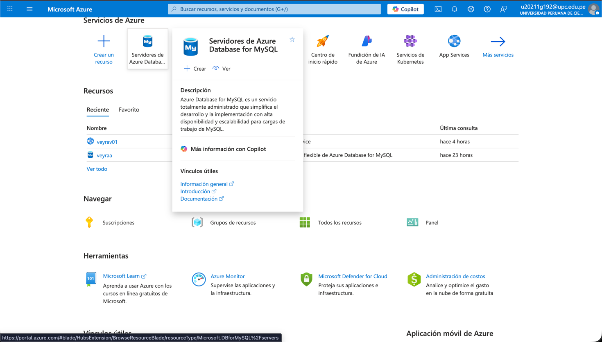

2.  Se selecciona la suscripción, el grupo de recursos y se especifican los detalles de la base de datos (nombre, servidor).
    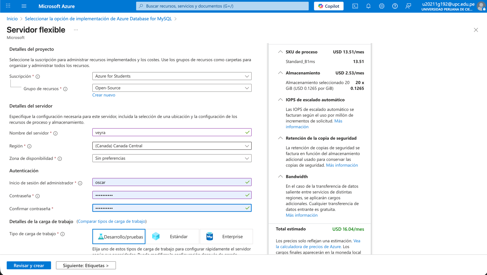

3.  Se crea un nuevo servidor (si no existe) y se configuran las credenciales de administrador.
    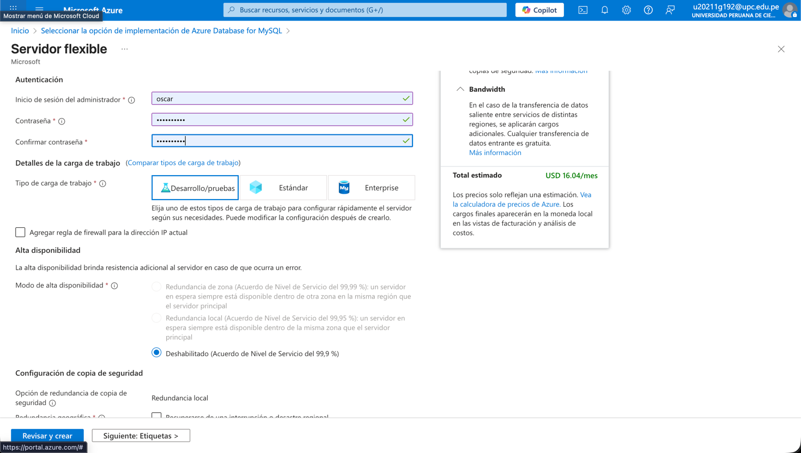

4.  Se elige el plan de servicio (ej. Básico o un plan de desarrollo) y se revisan las configuraciones.
    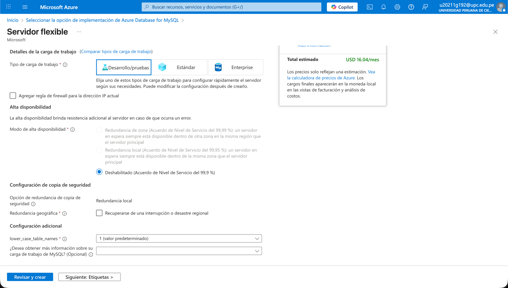

5.  Se confirma la creación y se espera a que el recurso esté disponible.
    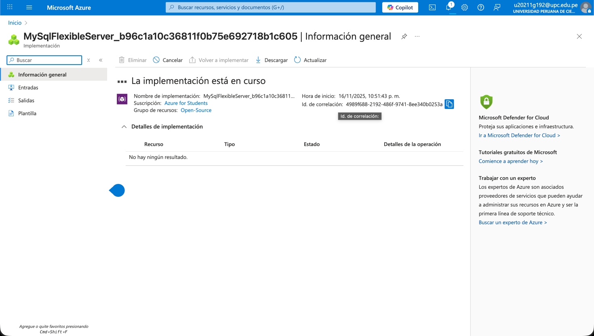

6.  Finalmente, se configura el **Firewall** del servidor de la base de datos para permitir las conexiones desde el Web Service y el acceso local.
    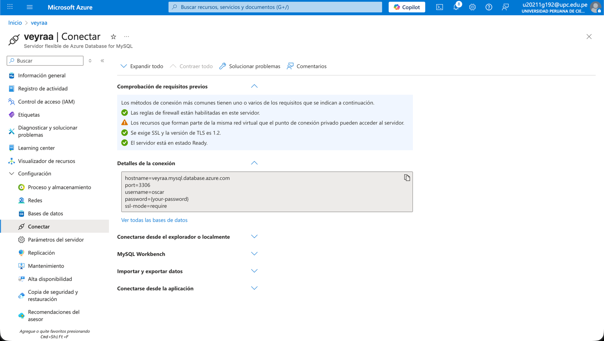

### Despliegue del Web Service

1.  En **IntelliJ IDEA**, se completa el archivo de configuración (ej. `application.properties` o `.yml`) con los datos (URL, usuario, contraseña) de la base de datos creada en Azure.
    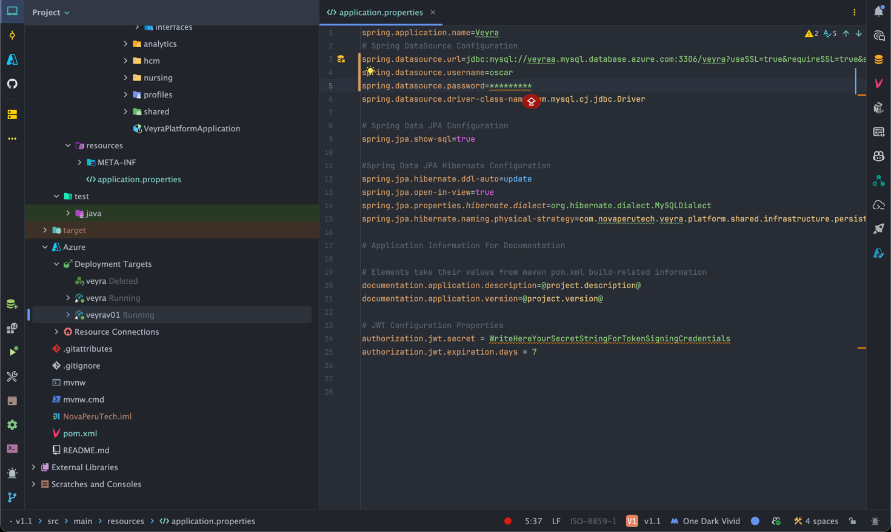

2.  Se ejecuta el proyecto localmente para probar y verificar que la conexión al servicio de base de datos de Azure es exitosa.
    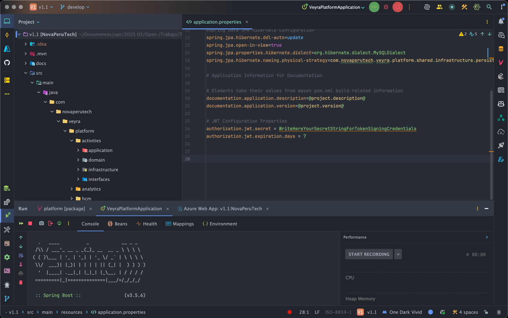

3.  Una vez validado, se busca en el explorador de proyecto, se hace clic derecho y se selecciona "Azure" -> "Deploy to Azure Web Apps".
    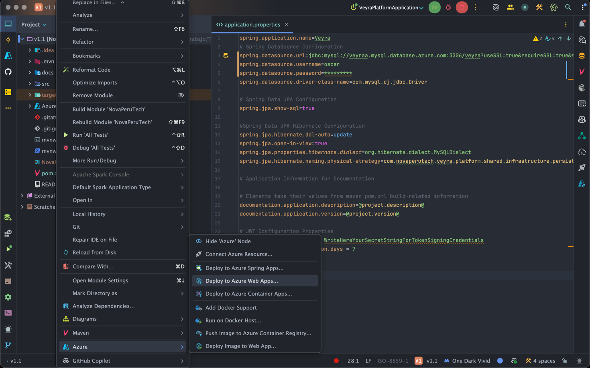

4.  Se completa la ventana de configuración: se inicia sesión en Azure, se selecciona la suscripción y el App Service (ej. "veyrav01") creado previamente.
    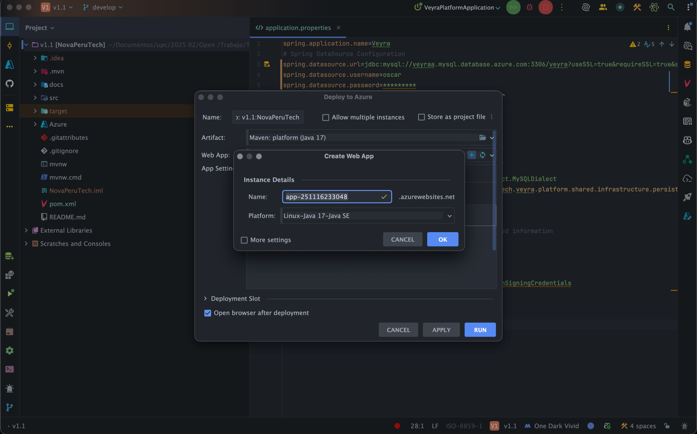

5.  En la configuración de runtime, se selecciona **Java 17**, ya que no es posible desplegar con Java 25 [o la versión deseada] en el plan actual.
    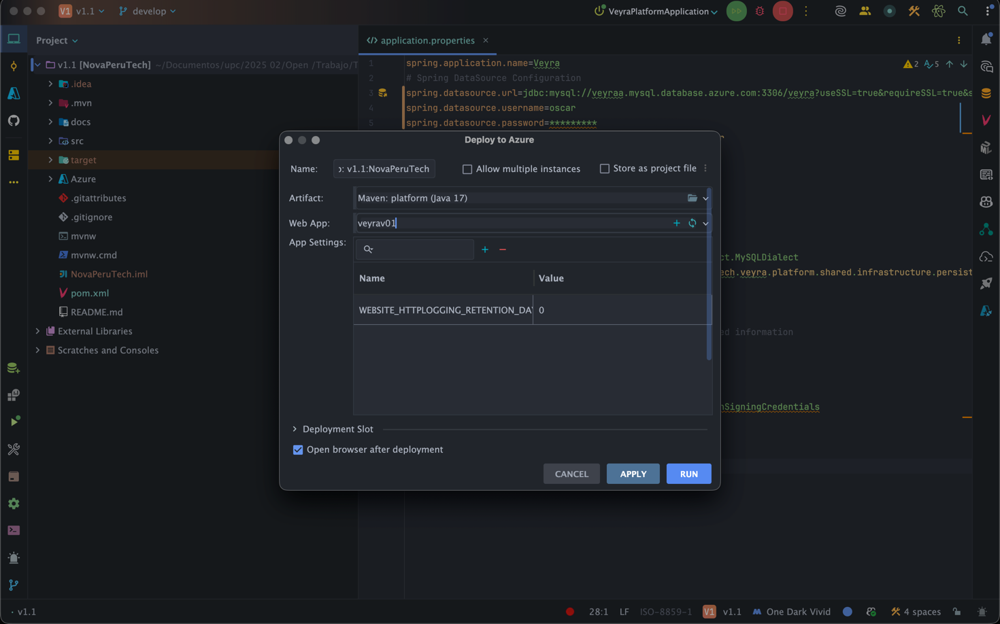

6. .  Se presiona "Run" y se espera a que el proceso de despliegue compile, empaquete y suba el artefacto a Azure.
    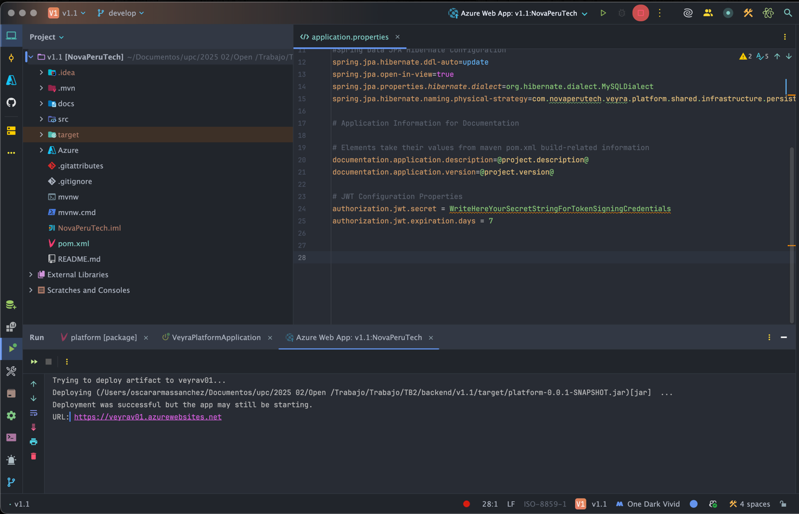

7.  Al finalizar, la consola de IntelliJ muestra "Successfully deployed..." y provee el link del sitio.
    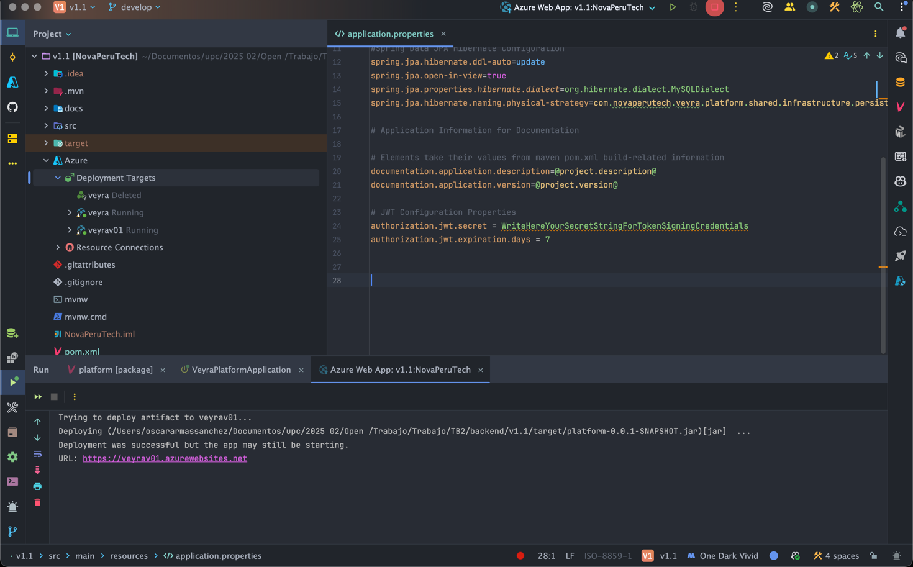

8.  Para verificar el despliegue, se toma el link (ej. `https://veyrav01.azurewebsites.net`) y se le agrega la ruta `/swagger-ui/index.html` en el navegador.
    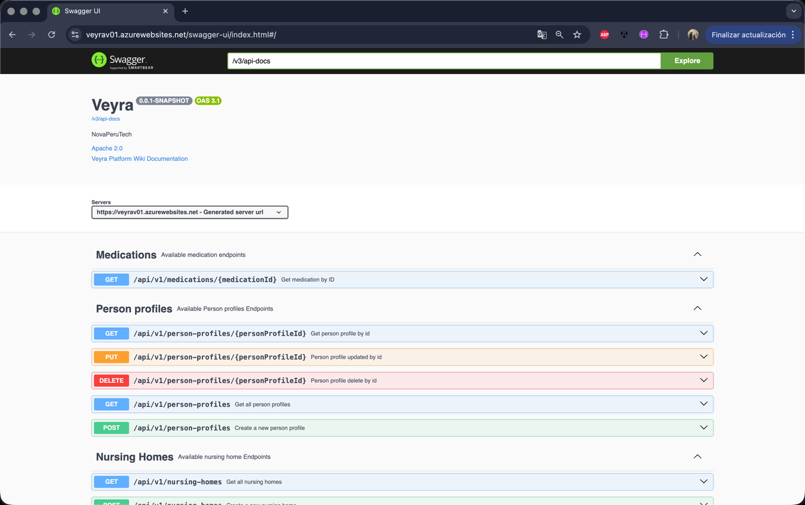

**Link del Web Service desplegado:** [https://veyrav01.azurewebsites.net/swagger-ui/index.html](https://veyrav01.azurewebsites.net/swagger-ui/index.html)

#### 5.2.3.8. Team Collaboration Insights during Sprint

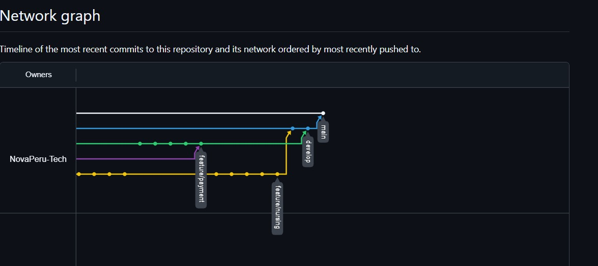
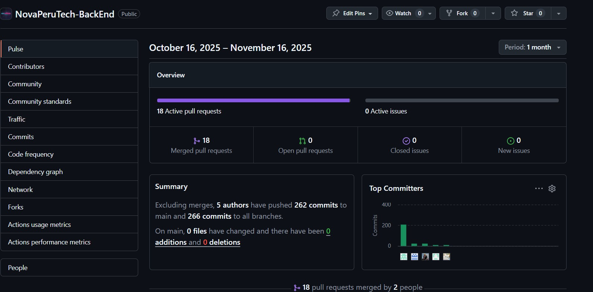
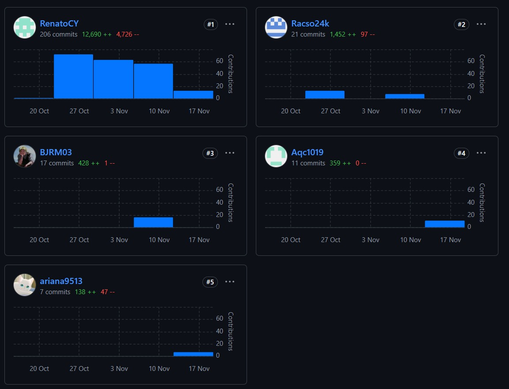

## 5.3. Validation Interviews

Para validar nuestros entregables (Landing Page y aplicación web), realizaremos entrevistas con nuestros segmentos objetivo: **Administradores de casas de reposo y Familiares de adultos mayores.**
El propósito es recopilar su opinión sobre la utilidad, claridad y facilidad de uso de la solución propuesta por el Team Veyra, así como detectar mejoras a nivel de UI/UX y funcionalidad.

Las preguntas se plantean de forma cercana pero estructurada, buscando obtener feedback sobre navegación, claridad, accesibilidad y valor percibido en su experiencia diaria.

### 5.3.1. Diseño de Entrevistas

**Preguntas Segmento 1 — Administradores de Casas de Reposo:**

1. ¿Qué tan fácil te fue registrar nuevos residentes en el sistema?

2. ¿Pudiste acceder rápidamente al historial clínico de cada residente?

3. ¿La información disponible es suficiente para gestionar el cuidado diario?

4. ¿Qué tan intuitivo te pareció registrar actividades o tratamientos?

5. ¿Te resultó clara la forma en que se muestran alertas o notificaciones?

6. ¿Consideras que Veyra facilita la comunicación con los familiares? ¿Cómo?

7. ¿Crees que el sistema podría reducir carga administrativa? ¿De qué manera?

8. ¿Hay funciones que te gustaría automatizar (por ejemplo: recordatorios, reportes, actividades)?

9. En comparación con tus métodos actuales, ¿Veyra mejora la organización?

10. ¿Sentiste que el flujo para buscar información es natural o requiere muchos pasos?

**Preguntas Segmento 2 — Familiares de Adultos Mayores**

1. ¿Qué tan fácil fue registrarte e ingresar a la plataforma?

2. ¿Pudiste encontrar rápidamente la información sobre tu familiar?

3. ¿La información sobre salud, medicación y actividades fue clara?

4. ¿Con qué frecuencia te gustaría recibir notificaciones o actualizaciones?

5. ¿Te resultó útil tener un registro de actividades diarias? ¿Por qué?

6. ¿La interfaz te transmite confianza y seguridad respecto al manejo de datos?

7. ¿Qué tan útil sería para ti recibir alertas en tiempo real sobre emergencias?

8. ¿Consideras sencillo contactar al personal desde la plataforma?

9. ¿Hay información o funciones que te gustaría ver agregadas?

10. ¿Te ayudó Veyra a sentir mayor tranquilidad sobre el bienestar del adulto mayor?

### 5.3.2. Registro de Entrevistas

En esta sección presentamos los registros de las entrevistas que hicimos para cada segmento objetivo de nuestra aplicación.

**Segmento 1: Administradores de casas de reposo** 

<table>
<colgroup>
</colgroup>
<thead>
  <tr>
    <th colspan="2">Entrevista #1 </th>
  </tr>
</thead>
<tbody>
  <tr>
    <td>Nombre</td>
    <td>Milagros Beatriz</td>
  </tr>
  <tr>
    <td>Apellidos</td>
    <td>Caycho Mata</td>
  </tr>
  <tr>
    <td>Edad</td>
    <td>59 años</td>
  </tr>
  <tr>
    <td>Rol</td>
    <td>Gerente administrativa</td>
  </tr>
  <tr>
    <td>Evidencia</td>
    <td>
</td>
  </tr>
  <tr>
    <td>Link</td>
    <td>
<a target="_blank"  href="https://shorturl.at/uoNBn" title="Title">Entrevista grabada – Microsoft Stream
</td>
  </tr>
  <tr>
    <td>Duracion </td>
    <td>0:00 min - 04:28 min</td>
  </tr>
  <tr>
    <td>Resumen</td>
    <td>
		....
</td>
  </tr>
</tbody>
</table>

<table>
<colgroup>
</colgroup>
<thead>
  <tr>
    <th colspan="2">Entrevista #2 </th>
  </tr>
</thead>
<tbody>
  <tr>
    <td>Nombre</td>
    <td>Oscar Alberto</td>
  </tr>
  <tr>
    <td>Apellidos</td>
    <td>Navarrete Mendoza</td>
  </tr>
  <tr>
    <td>Edad</td>
    <td>54 años</td>
  </tr>
  <tr>
    <td>Rol</td>
    <td>Gerente general de residencia geriátrica</td>
  </tr>
  <tr>
    <td>Evidencia</td>
    <td>
</td>
  </tr>
  <tr>
    <td>Link</td>
    <td>
<a target="_blank"  href="https://shorturl.at/uoNBn" title="Title">Entrevista grabada – Microsoft Stream
</td>
  </tr>
  <tr>
    <td>Duracion </td>
    <td>04:29 min - 08:16 min</td>
  </tr>
  <tr>
    <td>Resumen</td>
    <td>
		.....
</td>
  </tr>
</tbody>
</table>

<table>
<colgroup>
</colgroup>
<thead>
  <tr>
    <th colspan="2">Entrevista #3 </th>
  </tr>
</thead>
<tbody>
  <tr>
    <td>Nombre</td>
    <td>Recoba Funciyu</td>
  </tr>
  <tr>
    <td>Apellidos</td>
    <td>Valenzuela Huaynillo</td>
  </tr>
  <tr>
    <td>Edad</td>
    <td>27 años</td>
  </tr>
  <tr>
    <td>Distrito</td>
    <td>Lima</td>
  </tr>
  <tr>
    <td>Evidencia</td>
    <td>
</td>
  </tr>
  <tr>
    <td>Link</td>
    <td>
<a target="_blank"  href="https://shorturl.at/uoNBn" title="Title">Entrevista grabada – Microsoft Stream
</td>
  </tr>
  <tr>
    <td>Duracion </td>
    <td>08:16 min - 12:20 min</td>
  </tr>
  <tr>
    <td>Resumen</td>
    <td>
		.....
</td>
  </tr>
</tbody>
</table>

**Segmento 2: Familiares de adultos mayores** 

<table>
<colgroup>
</colgroup>
<thead>
  <tr>
    <th colspan="2">Entrevista #1 </th>
  </tr>
</thead>
<tbody>
  <tr>
    <td>Nombre</td>
    <td>Ivonne</td>
  </tr>
  <tr>
    <td>Apellidos</td>
    <td>Madrid Ruisco</td>
  </tr>
  <tr>
    <td>Edad</td>
    <td>49 años</td>
  </tr>
  <tr>
    <td>Distrito</td>
    <td>Sullana</td>
  </tr>
  <tr>
    <td>Evidencia</td>
    <td>
</td>
  </tr>
  <tr>
    <td>Link</td>
    <td>
<a target="_blank"  href="https://shorturl.at/uoNBn" title="Title">Entrevista grabada – Microsoft Stream
</td>
  </tr>
  <tr>
    <td>Duracion </td>
    <td>12:21 min - 14:46 min</td>
  </tr>
  <tr>
    <td>Resumen</td>
    <td>
		.....
</td>
  </tr>
</tbody>
</table>

<table>
<colgroup>
</colgroup>
<thead>
  <tr>
    <th colspan="2">Entrevista #2 </th>
  </tr>
</thead>
<tbody>
  <tr>
    <td>Nombre</td>
    <td>Leo Gerardo</td>
  </tr>
  <tr>
    <td>Apellidos</td>
    <td>Gómez Ferrua</td>
  </tr>
  <tr>
    <td>Edad</td>
    <td>30 años</td>
  </tr>
  <tr>
    <td>Distrito</td>
    <td>Chorrillos</td>
  </tr>
  <tr>
    <td>Evidencia</td>
    <td>
</td>
  </tr>
  <tr>
    <td>Link</td>
    <td>
<a target="_blank"  href="https://shorturl.at/uoNBn" title="Title">Entrevista grabada – Microsoft Stream
</td>
  </tr>
  <tr>
    <td>Duracion </td>
    <td>14:47 min - 19:27 min</td>
  </tr>
  <tr>
    <td>Resumen</td>
    <td>
		.....

</td>
  </tr>
</tbody>
</table>

<table>
<colgroup>
</colgroup>
<thead>
  <tr>
    <th colspan="2">Entrevista #3 </th>
  </tr>
</thead>
<tbody>
  <tr>
    <td>Nombre</td>
    <td>Jonathan</td>
  </tr>
  <tr>
    <td>Apellidos</td>
    <td>Ramirez</td>
  </tr>
  <tr>
    <td>Edad</td>
    <td>40 años</td>
  </tr>
  <tr>
    <td>Distrito</td>
    <td>Lima</td>
  </tr>
  <tr>
    <td>Evidencia</td>
    <td>
</td>
  </tr>
  <tr>
    <td>Link</td>
    <td>
<a target="_blank"  href="https://shorturl.at/uoNBn" title="Title">Entrevista grabada – Microsoft Stream
</td>
  </tr>
  <tr>
    <td>Duracion </td>
    <td>19:28 min - 22:33 min</td>
  </tr>
  <tr>
    <td>Resumen</td>
    <td>
		.....
</td>
  </tr>
</tbody>
</table>

### 5.3.3. Evaluaciones según heurísticas

    <h2>UX Heuristics & Principles Evaluation</h2>
    <h3>Usability – Inclusive Design – Information Architecture</h3>

<strong>CARRERA:</strong> Ingeniería de Software

<strong>CURSO: Desarrollo de Aplicaciones Open Source </strong> 

<strong>SECCIÓN:</strong> 7338

<strong>PROFESORES: Angel Augusto Velasquez Nuñez</strong> 

<strong>AUDITOR: El equipo de Veyra</strong> 

<strong>CLIENTE(S):</strong> [Información del Cliente]

 

<strong>SITE O APP A EVALUAR:</strong>

Veyra Application

 

<strong>TAREAS A EVALUAR:</strong>

El alcance de esta evaluación incluye la revisión de las siguientes tareas:

<ol>
    <li>Revisión de la consistencia de lenguaje (Inglés/Español)</li>
    <li>Validación de los flujos de registro y acceso</li>
    <li>Comprobar si el diseño transmite confianza y profesionalismo</li>
        <li>Validar si la información presentada resulta atractiva y relevante para posibles usuarios</li>
    <li>Evaluar la gestión de errores en vistas de tabla</li>
    <li>Revisión de la usabilidad de formularios de inventario</li>
    <li>Evaluación de la carga de información crítica (habitaciones)</li>
    <li>Revisión de la claridad de los botones de acción (CTAs)</li>
</ol>

 

No están incluidas en esta versión de la evaluación las siguientes tareas:

<ol>
    <li>Pruebas de estrés y rendimiento.</li>
    <li>Revisión de código fuente.</li>
    <li>Análisis de seguridad.</li>
    <li>Evaluación de accesibilidad para usuarios con discapacidades visuales.</li>
    <li>Test A/B de diseño.</li>
    <li>Análisis de <em>feedback</em> de usuarios reales.</li>
</ol>

<strong>ESCALA DE SEVERIDAD:</strong>

Los errores serán puntuados tomando en cuenta la siguiente escala de severidad

<table>
    <tr>
        <th style="border: 1px solid #dddddd; padding: 8px; text-align: center;">Nivel</th>
        <th style="border: 1px solid #dddddd; padding: 8px; text-align: center;">Descripción</th>
    </tr>
    <tr>
        <td style="border: 1px solid #dddddd; padding: 8px; text-align: center;">1</td>
        <td style="border: 1px solid #dddddd; padding: 8px; text-align: justify;">Problema superficial: puede ser fácilmente superador por el usuario ó ocurre con muy poco frecuencia. No necesita ser arreglado a no ser que exista disponibilidad de tiempo.</td>
    </tr>
    <tr>
        <td style="border: 1px solid #dddddd; padding: 8px; text-align: center;">2</td>
        <td style="border: 1px solid #dddddd; padding: 8px; text-align: justify;">Problema menor: puede ocurrir un poco más frecuentemente o es un poco más difícil de superar para el usuario. Se le debería asignar una prioridad baja resolverlo de cara al siguiente reléase</td>
    </tr>
    <tr>
        <td style="border: 1px solid #dddddd; padding: 8px; text-align: center;">3</td>
        <td style="border: 1px solid #dddddd; padding: 8px; text-align: justify;">Problema mayor: ocurre frecuentemente o los usuarios no son capaces de resolverlos. Es importante que sean corregidos y se les debe asignar una prioridad alta.</td>
    </tr>
    <tr>
        <td style="border: 1px solid #dddddd; padding: 8px; text-align: center;">4</td>
        <td style="border: 1px solid #dddddd; padding: 8px; text-align: justify;">Problema muy grave: un error de gran impacto que impide al usuario continuar con el uso dela herramienta. Es imperativo que sea corregido antes del lanzamiento.</td>
    </tr>
</table>

<strong>TABLA RESUMEN:</strong>

<table>
    <tr>
        <th style="border: 1px solid #dddddd; padding: 8px; text-align: center;">#</th>
        <th style="border: 1px solid #dddddd; padding: 8px; text-align: center;">Problema</th>
        <th style="border: 1px solid #dddddd; padding: 8px; text-align: center;">Escala de severidad</th>
        <th style="border: 1px solid #dddddd; padding: 8px; text-align: center;">Heurística/Principio violada(o)</th>
    </tr>
    <tr>
        <td style="border: 1px solid #dddddd; padding: 8px; text-align: center;">1</td>
        <td style="border: 1px solid #dddddd; padding: 8px; text-align: justify;"><strong>Confusión de rol en formulario de registro</strong> (Staff vs. Resident) y mezcla de idiomas en campos obligatorios.</td>
        <td style="border: 1px solid #dddddd; padding: 8px; text-align: center;">3</td>
        <td style="border: 1px solid #dddddd; padding: 8px; text-align: justify;">Usability: <strong>Visibility of system status</strong> y <strong>Consistency and standards</strong></td>
    </tr>
    <tr>
        <td style="border: 1px solid #dddddd; padding: 8px; text-align: justify;">2</td>
        <td style="border: 1px solid #dddddd; padding: 8px; text-align: justify;"><strong>Error de carga de datos críticos</strong> de Habitaciones ("Failed to fetch entities") sin mensaje amigable o acción de recuperación.</td>
        <td style="border: 1px solid #dddddd; padding: 8px; text-align: center;">4</td>
        <td style="border: 1px solid #dddddd; padding: 8px; text-align: justify;">Usability: <strong>Help users recognize, diagnose, and recover from errors</strong></td>
    </tr>
    <tr>
        <td style="border: 1px solid #dddddd; padding: 8px; text-align: center;">3</td>
        <td style="border: 1px solid #dddddd; padding: 8px; text-align: justify;">Botón de acción con <strong>etiqueta de código</strong> ("medication.add") en el formulario de inventario.</td>
        <td style="border: 1px solid #dddddd; padding: 8px; text-align: center;">3</td>
        <td style="border: 1px solid #dddddd; padding: 8px; text-align: justify;">Usability: <strong>Match between system and the real world</strong> y <strong>Consistency and standards</strong></td>
    </tr>
    <tr>
        <td style="border: 1px solid #dddddd; padding: 8px; text-align: center;">4</td>
        <td style="border: 1px solid #dddddd; padding: 8px; text-align: justify;"><strong>Llamadas a la acción (CTAs) técnicas</strong> en la página de inicio de sesión (e.g., `auth.sign-in`).</td>
        <td style="border: 1px solid #dddddd; padding: 8px; text-align: center;">4</td>
        <td style="border: 1px solid #dddddd; padding: 8px; text-align: justify;">Usability: <strong>Match between system and the real world</strong> y <strong>Aesthetic and minimalist design</strong></td>
    </tr>
    <tr>
        <td style="border: 1px solid #dddddd; padding: 8px; text-align: center;">5</td>
        <td style="border: 1px solid #dddddd; padding: 8px; text-align: justify;">Uso de <strong>"0" como valor inicial</strong> en campos de entrada numérica y mezcla de idiomas en títulos de sección de Inventario.</td>
        <td style="border: 1px solid #dddddd; padding: 8px; text-align: center;">2</td>
        <td style="border: 1px solid #dddddd; padding: 8px; text-align: justify;">Usability: <strong>Error Prevention</strong> y <strong>Consistency and standards</strong></td>
    </tr>
    <tr>
        <td style="border: 1px solid #dddddd; padding: 8px; text-align: center;">6</td>
        <td style="border: 1px solid #dddddd; padding: 8px; text-align: justify;">Etiqueta <strong>"Optional" redundante</strong> en el campo 'Barcode' e inconsistencia de idioma en la sección de Lote y Proveedor.</td>
        <td style="border: 1px solid #dddddd; padding: 8px; text-align: center;">1</td>
        <td style="border: 1px solid #dddddd; padding: 8px; text-align: justify;">Usability: <strong>Consistency and standards</strong> y <strong>Flexibility and efficiency of use</strong></td>
    </tr>
</table>

 

<strong>DESCRIPCIÓN DE PROBLEMAS:</strong>

<strong>Problema #1:</strong> <strong>Confusión de rol en formulario de registro y mezcla de idiomas</strong>

<strong>Severidad:</strong> 3

<strong>Heurística/Principio violada(o):</strong> Usability: <strong>Visibility of system status</strong> y <strong>Consistency and standards</strong>

<strong>Problema:</strong>

El contexto de la navegación lateral indica "Staff", pero el botón de acción dice "Register Resident" (Registrar Residente), confundiendo al usuario sobre qué rol está registrando. Además, el formulario utiliza una mezcla de inglés y español para las etiquetas de los campos (`dni*`, `birthdate*`, `phone number*`).

    

 

<strong>Recomendación:</strong>

Corregir la <strong>consistencia</strong> del sistema. Si la sección es "Staff", el botón debe ser "Register Staff" o "Registrar Personal". <strong>Estandarizar el idioma de todos los campos</strong> a español para mantener la coherencia lingüística en la interfaz y mejorar la experiencia del usuario.

 

<strong>Problema #2:</strong> <strong>Error de carga de datos críticos de Habitaciones</strong>

<strong>Severidad:</strong> 4

<strong>Heurística/Principio violada(o):</strong> Usability: <strong>Help users recognize, diagnose, and recover from errors</strong>

<strong>Problema:</strong>

La vista de "Rooms" (Habitaciones) muestra un error técnico grave: "Resource not found: Failed to fetch entities", que impide la carga de información fundamental. El mensaje técnico no es útil para el usuario, no explica qué sucedió y no ofrece una solución. Adicionalmente, los encabezados de la tabla presentan inconsistencia lingüística.

    

 

<strong>Recomendación:</strong>

Reemplazar el error técnico por un mensaje amigable y orientador, como <strong>"No se pudieron cargar las habitaciones. Por favor, intente recargar la página o contacte a soporte."</strong> Asegurar que las columnas de la tabla tengan una <strong>nomenclatura consistente</strong> (ej. "Número", "Tipo", "Estado").

 

<strong>Problema #3:</strong> <strong>Botón de acción con etiqueta de código en inventario</strong>

<strong>Severidad:</strong> 3

<strong>Heurística/Principio violada(o):</strong> Usability: <strong>Match between system and the real world</strong> y <strong>Consistency and standards</strong>

<strong>Problema:</strong>

El botón de acción principal al final del formulario de inventario muestra la etiqueta de código <strong>"medication.add"</strong>. Este error impide la usabilidad, rompe la confianza y es una inconsistencia grave. También persiste la mezcla de idiomas en los botones, como <strong>"Cancel"</strong>.

    

 

<strong>Recomendación:</strong>

Corregir la etiqueta del botón de acción principal a un texto claro y legible, como <strong>"Añadir Medicamento"</strong> o <strong>"Guardar"</strong>. Estandarizar el idioma de todos los botones de acción a español (ej. <strong>"Cancelar"</strong>).

 

<strong>Problema #4:</strong> <strong>Llamadas a la acción (CTAs) con etiquetas de desarrollo en Login</strong>

<strong>Severidad:</strong> 4

<strong>Heurística/Principio violada(o):</strong> Usability: <strong>Match between system and the real world</strong> y <strong>Aesthetic and minimalist design</strong>

<strong>Problema:</strong>

La página de inicio de sesión muestra etiquetas de código como <strong>`auth.already-have-account`</strong>, <strong>`-> auth.sign-in`</strong> y <strong>`AUTH.OR-CREATE-ACCOUNT`</strong> en lugar del texto destinado al usuario. Esto es un error de alto impacto que impide la tarea fundamental de acceso al sistema y afecta la credibilidad.

    

 

<strong>Recomendación:</strong>

Corregir las etiquetas de localización/texto a frases amigables y claras, como <strong>"¿Ya tienes una cuenta?"</strong>, el botón debe decir <strong>"Iniciar Sesión"</strong>, y el separador <strong>"O crear una cuenta"</strong>.

 

<strong>Problema #5:</strong> <strong>"0" como valor inicial y mezcla de idiomas en Inventario</strong>

<strong>Severidad:</strong> 2

<strong>Heurística/Principio violada(o):</strong> Usability: <strong>Error Prevention</strong> y <strong>Consistency and standards</strong>

<strong>Problema:</strong>

El uso del valor "0" como valor inicial en campos de entrada numérica (`Quantity*`, `Unit Cost*`, etc.) puede confundir al usuario, quien podría no borrarlo o pensar que es un <em>placeholder</em>. La inconsistencia en los títulos de las secciones (`Stock Status`, `Value`) en inglés es un problema constante.

    

 

<strong>Recomendación:</strong>

Asegurarse de que los campos de entrada de datos estén <strong>vacíos o utilicen un <em>placeholder</em> de texto</strong> para evitar confusiones. Estandarizar la nomenclatura de las secciones a español (ej. <strong>"Estado de Stock"</strong> y <strong>"Valoración"</strong>).

 

<strong>Problema #6:</strong> <strong>Etiqueta 'Optional' redundante en Barcode</strong>

<strong>Severidad:</strong> 1

<strong>Heurística/Principio violada(o):</strong> Usability: <strong>Consistency and standards</strong> y <strong>Flexibility and efficiency of use</strong>

<strong>Problema:</strong>

El campo <strong>`Barcode`</strong> está etiquetado como "Optional", lo cual es redundante si la convención para indicar campos obligatorios es el asterisco (`*`). Esto rompe la uniformidad visual. El título de la sección <strong>"Batch and Supplier Information"</strong> está en inglés.

    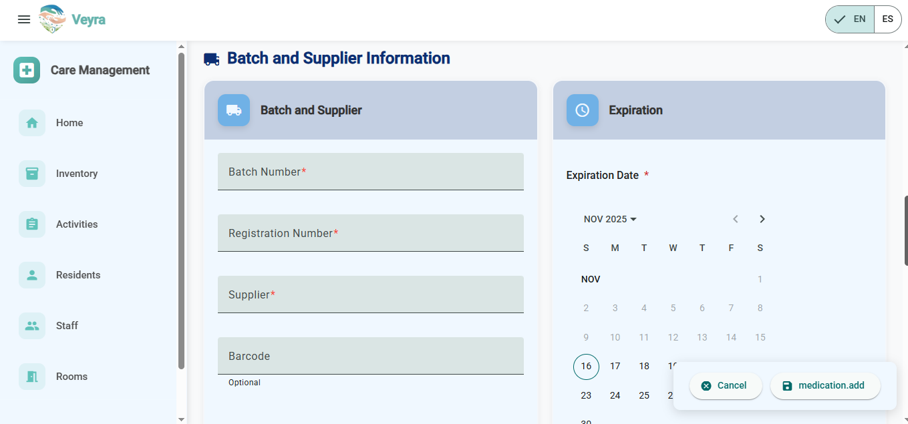

 

<strong>Recomendación:</strong>

Estandarizar el idioma del título de la sección a español (ej. <strong>"Información de Lote y Proveedor"</strong>). Eliminar la etiqueta redundante <strong>"Optional"</strong> del campo `Barcode` para mantener la consistencia en el formulario.

## Video About-the-Product

    

 

   Enlace del <strong>Video About-the-Product</strong>: <a href="https://youtu.be/DCPqVW0C2Po">https://youtu.be/DCPqVW0C2Po</a>

## Video About-the-Team

    

 

   Enlace del <strong>Video About-the-Team</strong>: <a href="https://youtu.be/-tBBZ8lwbts">https://youtu.be/-tBBZ8lwbts</a>

## Bibliografía
  <ul>
    <li>Refactoring.Guru. <em>Design patterns</em>. <a href="https://refactoring.guru/es/design-patterns">refactoring.guru</a></li>
    <li>Gothelf, J., &amp; Seiden, J. (2021). <em>Lean UX: Designing great products with agile teams</em> (3rd ed.). O’Reilly Media.</li>
    <li>Evans, E. (2004). <em>Domain-driven design</em>. Addison-Wesley.</li>
    <li>Vernon, V. <em>Domain-driven design reference</em>. <a href="https://domainlanguage.com/ddd/reference/">domainlanguage.com</a></li>
    <li>Martin, R. C. (2017). <em>Clean architecture</em>. Prentice Hall.</li>
  </ul>

## Anexos
  <ul>
    - Deploy de Landing Page: https://novaperu-tech.github.io/NovaPeru-Tech-LandingPage/  
    - Deploy del Backend: https://veyrav01.azurewebsites.net/swagger-ui/index.html#/  
    - Video de Exposición TB1: http://bit.ly/4h2grbc  
    - Video de Exposición TB2: http://bit.ly/4h2grbc  
    - Video About the Product en Youtube: https://youtu.be/DCPqVW0C2Po  
	- Video About the Product en Microsoft Stream: https://shorturl.at/W0vMy  
    - Video About the Team en Youtube: https://youtu.be/-tBBZ8lwbts  
	- Video About the Team en Microsoft Stream: https://shorturl.at/jAp77

  </ul>
</body>
</html>

