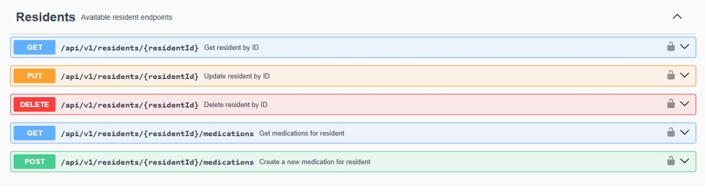

<html lang="es">
<body>
  
# Capítulo V: Product Implementation, Validation & Deployment
  
## 5.1. Software Configuration Management

	En esta sección se describen las decisiones, convenciones y principios adoptados por el equipo para garantizar la coherencia, trazabilidad y control de versiones durante el ciclo de vida del desarrollo de la solución Veyra. Se establecen los lineamientos para la configuración del entorno de desarrollo, gestión del código fuente, convenciones de estilo y configuración de despliegue.

  
### 5.1.1. Software Development Environment Configuration

	  En esta sección se especifican los productos de software utilizados durante el ciclo de vida del proyecto, incluyendo el nombre de cada herramienta, su propósito técnico específico dentro del proyecto Veyra, y la ruta de referencia (para software SaaS) o ruta de descarga (para productos de instalación local). Las herramientas se organizan según las siguientes disciplinas:

  
<ol>
	<li>Project Management</li>
    <li>Requirements Management</li>
    <li>Product UX/UI Design</li>
    <li>Software Development</li>
    <li>Software Testing</li>
    <li>Software Documentation</li>
</ol>

<h4>Project Management</h4>

	  Esta disciplina se centra en la planificación, seguimiento y control de las actividades del proyecto, asegurando el cumplimiento de los objetivos dentro del tiempo y recurso establecidos

<ul>
  <li>
    <strong>Jira:</strong> Plataforma de gestión de proyectos ágiles utilizada para la administración del Product Backlog, planificación de Sprints, asignación de User Stories y Tasks a los miembros del equipo, y seguimiento del progreso mediante tableros Scrum con estados To-Do, In-Process, To-Review y Done.  
    <strong>Ruta de referencia:</strong> <a href="https://www.atlassian.com/software/jira">https://www.atlassian.com/software/jira</a>
  </li>
</ul>

<h4>Requirements Management:</h4>

	Este proceso se enfoca en la documentación, verificación y seguimiento de los requisitos del proyecto, asegurando que las necesidades de los stakeholders sean satisfechas.

<ul>
  <li>
    <strong>Trello:</strong> Plataforma de gestión visual basada en tableros, listas y tarjetas, utilizada para la organización del Sprint Backlog, gestión de User Stories por estado (To-Do, In-Progress, Done) y colaboración del equipo en la priorización de requisitos del proyecto Veyra.  
    <strong>Ruta de referencia:</strong> <a href="https://trello.com">https://trello.com</a>
  </li>
</ul>

<h4>Product UX/UI Design</h4>

	El diseño de la experiencia de usuario y la interfaz de usuario para Veyra contempla un modelo de sitio web responsivo, compatible con navegadores de escritorio y dispositivos móviles. Se utilizan las siguientes herramientas.

<ol>
  <li>
    <strong>UXPressia:</strong> Plataforma para la elaboración de User Personas, Empathy Maps, Customer Journey Maps e Impact Maps de los segmentos objetivo del proyecto Veyra (Administradores de casas de reposo y Familiares de adultos mayores).  
    <strong>Ruta de referencia:</strong> <a href="https://uxpressia.com/">https://uxpressia.com/</a>
  </li>
  <li>
    <strong>Miro:</strong> Pizarra digital colaborativa utilizada para sesiones de Big Picture EventStorming y Design-Level EventStorming, facilitando la identificación de Bounded Contexts, Events, Commands y Aggregates del dominio Veyra.  
    <strong>Ruta de referencia:</strong> <a href="https://miro.com/es/">https://miro.com/es/</a>
  </li>
  <li>
    <strong>Figma:</strong> Herramienta de diseño colaborativo para la creación de Wireframes, Mock-ups y Prototipos interactivos del Landing Page y Web Applications de Veyra, aplicando el Design System basado en Material Design.  
    <strong>Ruta de referencia:</strong> <a href="https://www.figma.com/es-es/">https://www.figma.com/es-es/</a>
  </li>
  <li>
    <strong>LucidChart:</strong> Aplicación de diagramación colaborativa para la creación de Wireflows, User Flows, diagramas UML (Class Diagrams) y Database Diagrams de la arquitectura de Veyra.  
    <strong>Ruta de referencia:</strong> <a href="https://www.lucidchart.com/pages/es">https://www.lucidchart.com/pages/es</a>
  </li>
  <li>
    <strong>Overflow:</strong> Herramienta para la elaboración de User Flow Diagrams detallados, ilustrando las rutas de navegación (happy paths y unhappy paths) de los usuarios en las aplicaciones web de Veyra.  
    <strong>Ruta de referencia:</strong> <a href="https://overflow.io/">https://overflow.io/</a>
  </li>
</ol>

<h4>Software Development:</h4>

  

	  El desarrollo de software del proyecto Veyra abarca la implementación del Langin Page, Frontend Web Application y Backend Web Services. Se utilizan las siguientes herramientas y tecnologías.

<ol>
  <li>
    <strong>GitHub:</strong> Sistema de control de versiones distribuido y plataforma de hosting para repositorios de código fuente. Gestión de la organización NovaPeru-Tech, implementación de GitFlow Workflow, Conventional Commits y Semantic Versioning.  
    <strong>Ruta de referencia:</strong> <a href="https://github.com">https://github.com</a>  
    <strong>Organización del proyecto:</strong> <a href="https://github.com/NovaPeru-Tech">https://github.com/NovaPeru-Tech</a>
  </li>
  <li>
    <strong>WebStorm:</strong> Entorno de desarrollo integrado (IDE) de JetBrains para la implementación del Frontend utilizando Angular Framework, HTML5, CSS3, JavaScript y TypeScript. Incluye integración con GitHub para control de versiones.  
    <strong>Ruta de descarga:</strong> <a href="https://www.jetbrains.com/webstorm/">https://www.jetbrains.com/webstorm/</a>  
    <strong>Licencia de estudiante:</strong> <a href="https://www.jetbrains.com/community/education/">https://www.jetbrains.com/community/education/</a>
  </li>
  <li>
    <strong>IntelliJ IDEA:</strong> Entorno de desarrollo integrado (IDE) de JetBrains para la implementación del Backend con Spring Boot Framework y Java. Incluye integración con Azure para despliegue de Web Services.  
    <strong>Ruta de descarga:</strong> <a href="https://www.jetbrains.com/idea/">https://www.jetbrains.com/idea/</a>  
    <strong>Licencia de estudiante:</strong> <a href="https://www.jetbrains.com/community/education/">https://www.jetbrains.com/community/education/</a>
  </li>
  <li>
    <strong>Angular Framework:</strong> Framework de desarrollo para Frontend Web Applications. Construcción de componentes reutilizables, gestión de estado mediante Services y RxJS, enrutamiento entre vistas y consumo de APIs REST.  
    <strong>Ruta de referencia:</strong> <a href="https://angular.io/">https://angular.io/</a>
  </li>
  <li>
    <strong>Angular Material:</strong> Biblioteca de componentes UI basada en Material Design para Angular. Proporciona componentes pre-construidos (buttons, forms, tables, dialogs) que garantizan consistencia visual en la interfaz de VEYRA.  
    <strong>Ruta de referencia:</strong> <a href="https://material.angular.io/">https://material.angular.io/</a>
  </li>
  <li>
    <strong>Spring Boot Framework:</strong> Framework para desarrollo de Web Services RESTful del Backend de VEYRA. Implementación de lógica de negocio, persistencia de datos con JPA/Hibernate, y documentación de API con OpenAPI/Swagger.  
    <strong>Ruta de referencia:</strong> <a href="https://spring.io/projects/spring-boot">https://spring.io/projects/spring-boot</a>
  </li>
  <li>
    <strong>HTML5, CSS3, JavaScript:</strong> Tecnologías fundamentales para la implementación del Landing Page y estructura base de las Web Applications.  
    <strong>Referencias:</strong>
    <ul>
      <li>HTML5: <a href="https://html.spec.whatwg.org/">https://html.spec.whatwg.org/</a></li>
      <li>CSS3: <a href="https://www.w3.org/Style/CSS/">https://www.w3.org/Style/CSS/</a></li>
      <li>JavaScript: <a href="https://developer.mozilla.org/es/docs/Web/JavaScript">https://developer.mozilla.org/es/docs/Web/JavaScript</a></li>
    </ul>
  </li>
  <li>
    <strong>TypeScript:</strong> Lenguaje de programación tipado para desarrollo de Frontend Web Applications con Angular. Proporciona tipado estático, detección temprana de errores y mejor soporte de IDE.  
    <strong>Ruta de referencia:</strong> <a href="https://www.typescriptlang.org/">https://www.typescriptlang.org/</a>
  </li>
  <li>
    <strong>Java:</strong> Lenguaje de programación para el desarrollo del Backend con Spring Boot. Se utiliza Java 17 para compatibilidad con Azure App Service.  
    <strong>Ruta de referencia:</strong> <a href="https://openjdk.org/">https://openjdk.org/</a>
  </li>
</ol>

<h4>Software Testing:</h4>
  

	  Las pruebas de software permiten evaluar y verificar que los productos desarrollados cumplen con los requisitos especificados y funcionan correctamente.
  

<ul>
  <li>
    <strong>Lenguaje Gherkin:</strong> Lenguaje de dominio específico (DSL) para la redacción de Acceptance Criteria de User Stories en formato estructurado Given-When-Then. Permite definir escenarios de prueba legibles por stakeholders y ejecutables por herramientas de automatización. Los keywords principales son: Feature, Scenario, Given, When, Then, And, But.  
    <strong>Ruta de referencia:</strong> <a href="https://cucumber.io/docs/gherkin/">https://cucumber.io/docs/gherkin/</a>
  </li>
</ul>

<h4>Software Documentation</h4>
  

	  La documentación de software permite explicar el funcionamiento, uso y arquitectura de los productos desarrollados, facilitando su mantenimiento y evolución.
  

<ul>
  <li>
    <strong>OpenAPI Specification / Swagger:</strong> Estándar para la documentación interactiva y machine-readable de los Web Services RESTful del Backend de Veyra. Especificación de endpoints, parámetros, request/response bodies, códigos de estado HTTP y ejemplos de uso.  
    <strong>Ruta de referencia:</strong> <a href="https://swagger.io/">https://swagger.io/</a>  
    <strong>URL de documentación desplegada:</strong> <a href="https://veyrav01.azurewebsites.net/swagger-ui/index.html">https://veyrav01.azurewebsites.net/swagger-ui/index.html</a>
  </li>
  <li>
    <strong>Markdown:</strong> Lenguaje de marcado ligero para la elaboración del Project Report en el repositorio GitHub. Permite estructurar documentación con formato consistente y compatible con control de versiones.  
    <strong>Ruta de referencia:</strong> <a href="https://www.markdownguide.org/">https://www.markdownguide.org/</a>
  </li>
</ul>

### 5.1.2. Source Code Management

  

	  En esta sección se establecen los medios y esquemas de organización aplicados para el seguimiento de modificaciones del código fuente. Se utiliza GitHub como plataforma y sistema de control de versiones distribuido.
  

<h4>Repositorios del Proyecto</h4>

<table>
  <thead>
    <tr>
      <th>Producto</th>
      <th>URL del Repositorio</th>
    </tr>
  </thead>
  <tbody>
    <tr>
      <td>Organización NovaPeru-Tech</td>
      <td><a href="https://github.com/NovaPeru-Tech">https://github.com/NovaPeru-Tech</a></td>
    </tr>
    <tr>
      <td>Landing Page</td>
      <td><a href="https://github.com/NovaPeru-Tech/NovaPeru-Tech-LandingPage">https://github.com/NovaPeru-Tech/NovaPeru-Tech-LandingPage</a></td>
    </tr>
    <tr>
      <td>Frontend Web Application</td>
      <td><a href="https://github.com/NovaPeru-Tech/NovaPeruTech-Frontend">https://github.com/NovaPeru-Tech/NovaPeruTech-Frontend</a></td>
    </tr>
    <tr>
      <td>Backend Web Services</td>
      <td><a href="https://github.com/NovaPeru-Tech/NovaPeruTech-Backend">https://github.com/NovaPeru-Tech/NovaPeruTech-Backend</a></td>
    </tr>
    <tr>
      <td>Project Report</td>
      <td><a href="https://github.com/NovaPeru-Tech/NovaPeru-Tech-Project-Report">https://github.com/NovaPeru-Tech/NovaPeru-Tech-Project-Report</a></td>
    </tr>
  </tbody>
</table>

<h4>GitFlow Workflow</h4>

  Se implementa GitFlow como modelo de flujo de trabajo para el control de versiones, estableciendo una estructura de ramas que facilita el desarrollo paralelo y la gestión de releases.

<strong>Ramas Principales:</strong>

<ul>
  <li>
    <strong>main:</strong> Rama principal que contiene el historial oficial de versiones estables listas para producción. Solo recibe merges de release branches y hotfix branches.
  </li>
  <li>
    <strong>develop:</strong> Rama de integración donde se consolidan los features completados y probados. Sirve como base para la creación de release branches.
  </li>
</ul>

<strong>Ramas de Soporte:</strong>

<ul>
  <li>
    <strong>feature/&lt;feature-name&gt;:</strong> Ramas creadas a partir de develop para implementar nuevas funcionalidades. Se fusionan de vuelta a develop una vez completadas y revisadas.
  </li>
  <li>
    <strong>release/&lt;version&gt;:</strong> Ramas creadas a partir de develop para preparar una nueva versión de producción. Permiten correcciones menores y ajustes antes del merge a main.
  </li>
  <li>
    <strong>hotfix/&lt;issue&gt;:</strong> Ramas creadas a partir de main para correcciones urgentes en producción. Se fusionan tanto a main como a develop.
  </li>
</ul>

<h4>Convenciones de Nomenclatura para Ramas</h4>

<table>
  <thead>
    <tr>
      <th>Tipo de Rama</th>
      <th>Formato</th>
      <th>Ejemplo</th>
    </tr>
  </thead>
  <tbody>
    <tr>
      <td>Feature</td>
      <td><code>feature/&lt;bounded-context&gt;-&lt;feature-description&gt;</code></td>
      <td><code>feature/residents-add-medical-history</code></td>
    </tr>
    <tr>
      <td>Release</td>
      <td><code>release/&lt;major.minor.patch&gt;</code></td>
      <td><code>release/1.0.0</code></td>
    </tr>
    <tr>
      <td>Hotfix</td>
      <td><code>hotfix/&lt;issue-description&gt;</code></td>
      <td><code>hotfix/fix-login-validation</code></td>
    </tr>
  </tbody>
</table>

<h4>Conventional Commits</h4>

  Se aplica la especificación Conventional Commits para los mensajes de commit, siguiendo la estructura:

<pre><code>&lt;type&gt;[optional scope]: &lt;description&gt;

[optional body]

[optional footer(s)]
</code></pre>

<strong>Tipos de Commit:</strong>

<table>
  <thead>
    <tr>
      <th>Tipo</th>
      <th>Descripción</th>
    </tr>
  </thead>
  <tbody>
    <tr>
      <td><code>feat</code></td>
      <td>Nueva funcionalidad para el usuario</td>
    </tr>
    <tr>
      <td><code>fix</code></td>
      <td>Corrección de un bug</td>
    </tr>
    <tr>
      <td><code>docs</code></td>
      <td>Cambios en documentación</td>
    </tr>
    <tr>
      <td><code>style</code></td>
      <td>Cambios de formato (espacios, comas, etc.) sin afectar lógica</td>
    </tr>
    <tr>
      <td><code>refactor</code></td>
      <td>Refactorización de código sin cambiar funcionalidad</td>
    </tr>
    <tr>
      <td><code>perf</code></td>
      <td>Mejoras de rendimiento</td>
    </tr>
    <tr>
      <td><code>test</code></td>
      <td>Adición o corrección de pruebas</td>
    </tr>
    <tr>
      <td><code>build</code></td>
      <td>Cambios en sistema de build o dependencias externas</td>
    </tr>
    <tr>
      <td><code>chore</code></td>
      <td>Tareas de mantenimiento sin afectar código de producción</td>
    </tr>
  </tbody>
</table>

<strong>Ejemplos de Commits:</strong>

<pre><code>feat(residents): add medical history registration form
fix(auth): resolve token expiration validation issue
docs(readme): update deployment instructions
build(deps): upgrade Angular to version 17
chore(config): update environment variables for production
</code></pre>

<h4>Semantic Versioning</h4>

  Se aplica Semantic Versioning 2.0.0 para el versionado de releases, siguiendo el formato <code>MAJOR.MINOR.PATCH</code>:

<ul>
  <li><strong>MAJOR:</strong> Cambios incompatibles con versiones anteriores (breaking changes)</li>
  <li><strong>MINOR:</strong> Nuevas funcionalidades compatibles con versiones anteriores</li>
  <li><strong>PATCH:</strong> Correcciones de bugs compatibles con versiones anteriores</li>
</ul>

<strong>Ejemplo de evolución de versiones:</strong>

<ul>
  <li><code>1.0.0</code> → Primera versión estable</li>
  <li><code>1.1.0</code> → Nueva funcionalidad agregada</li>
  <li><code>1.1.1</code> → Corrección de bug</li>
  <li><code>2.0.0</code> → Cambio incompatible en API</li>
</ul>

<h4>Configuración de GitHub en WebStorm</h4>

Instrucciones para vincular WebStorm con GitHub:

<ol>
  <li>Abrir WebStorm y navegar a <strong>VCS &gt; Enable Version Control Integration</strong>, seleccionar Git.</li>
  <li>Ir a <strong>File &gt; Settings &gt; Version Control &gt; GitHub</strong> y agregar la cuenta de GitHub.</li>
  <li>Configurar el nombre de usuario en <strong>File &gt; Settings &gt; Version Control &gt; Git</strong>.</li>
  <li>Para conectar con el repositorio remoto: <strong>Git &gt; Manage Remotes</strong> y agregar la URL del repositorio.</li>
  <li>Realizar commits con <strong>Ctrl+K</strong> y push con <strong>Ctrl+Shift+K</strong>.</li>
</ol>

### 5.1.3. Source Code Style Guide & Conventions

  

	  En esta sección se establecen las convenciones de estilo y nomenclatura adoptadas para los lenguajes utilizados en el proyecto Veyra: HTML, CSS, JavaScript, TypeScript, Java y Gherkin. Se aplica nomenclatura en inglés para todos los elementos del código, siguiendo el Ubiquitous Language definido para el dominio.
  

<h4>Referencias de Guías de Estilo Adoptadas</h4>

<table>
  <thead>
    <tr>
      <th>Lenguaje/Tecnología</th>
      <th>Guía de Estilo</th>
    </tr>
  </thead>
  <tbody>
    <tr>
      <td>HTML/CSS</td>
      <td><a href="https://google.github.io/styleguide/htmlcssguide.html">Google HTML/CSS Style Guide</a></td>
    </tr>
    <tr>
      <td>JavaScript</td>
      <td><a href="https://google.github.io/styleguide/jsguide.html">Google JavaScript Style Guide</a></td>
    </tr>
    <tr>
      <td>TypeScript</td>
      <td><a href="https://google.github.io/styleguide/tsguide.html">Google TypeScript Style Guide</a></td>
    </tr>
    <tr>
      <td>Angular</td>
      <td><a href="https://angular.io/guide/styleguide">Angular Coding Style Guide</a></td>
    </tr>
    <tr>
      <td>Java</td>
      <td><a href="https://google.github.io/styleguide/javaguide.html">Google Java Style Guide</a></td>
    </tr>
    <tr>
      <td>Spring Boot</td>
      <td><a href="https://docs.spring.io/spring-boot/docs/current/reference/html/features.html">Spring Boot Reference Documentation</a></td>
    </tr>
    <tr>
      <td>Gherkin</td>
      <td><a href="https://cucumber.io/docs/gherkin/reference/">Gherkin Reference</a></td>
    </tr>
  </tbody>
</table>

<h4>Nomenclatura General</h4>

  Se utiliza nomenclatura en inglés para todos los elementos del código, relacionada con la entidad que representan dentro del dominio del negocio.

<table>
  <thead>
    <tr>
      <th>Elemento</th>
      <th>Convención</th>
      <th>Ejemplo</th>
    </tr>
  </thead>
  <tbody>
    <tr>
      <td>Clases (Java/TypeScript)</td>
      <td>PascalCase</td>
      <td><code>ResidentService</code>, <code>MedicationController</code></td>
    </tr>
    <tr>
      <td>Interfaces (TypeScript)</td>
      <td>PascalCase</td>
      <td><code>IResidentRepository</code>, <code>Resident</code></td>
    </tr>
    <tr>
      <td>Métodos/Funciones</td>
      <td>camelCase</td>
      <td><code>getResidentById()</code>, <code>createMedication()</code></td>
    </tr>
    <tr>
      <td>Variables</td>
      <td>camelCase</td>
      <td><code>residentName</code>, <code>medicationList</code></td>
    </tr>
    <tr>
      <td>Constantes</td>
      <td>SCREAMING_SNAKE_CASE</td>
      <td><code>MAX_RESIDENTS</code>, <code>API_BASE_URL</code></td>
    </tr>
    <tr>
      <td>Archivos de componentes Angular</td>
      <td>kebab-case</td>
      <td><code>resident-list.component.ts</code></td>
    </tr>
    <tr>
      <td>Clases CSS</td>
      <td>kebab-case</td>
      <td><code>.resident-card</code>, <code>.medication-form</code></td>
    </tr>
    <tr>
      <td>Endpoints REST</td>
      <td>kebab-case (plural)</td>
      <td><code>/api/v1/residents</code>, <code>/api/v1/medications</code></td>
    </tr>
  </tbody>
</table>

<h4>Sangría</h4>

Se aplica un espaciado de dos espacios para la indentación en todos los archivos HTML, CSS, JavaScript y TypeScript.

<strong>Ejemplo HTML:</strong>

<pre><code>&lt;!DOCTYPE html&gt;
&lt;html&gt;
  &lt;head&gt;
    &lt;title&gt;VEYRA - Nursing Home Management&lt;/title&gt;
  &lt;/head&gt;
  &lt;body&gt;
    &lt;header&gt;
      &lt;h1&gt;Welcome to VEYRA&lt;/h1&gt;
    &lt;/header&gt;
    &lt;main&gt;
      &lt;p&gt;Comprehensive care management platform.&lt;/p&gt;
    &lt;/main&gt;
  &lt;/body&gt;
&lt;/html&gt;
</code></pre>

<h4>Convenciones por Lenguaje</h4>

<h5>HTML</h5>

<ul>
  <li>Declarar <code>&lt;!DOCTYPE html&gt;</code> en la primera línea.</li>
  <li>Utilizar minúsculas para nombres de elementos y atributos.</li>
  <li>Utilizar comillas dobles para valores de atributos: <code>&lt;div class="container"&gt;</code></li>
  <li>Incluir atributos <code>alt</code> en todas las imágenes para accesibilidad.</li>
  <li>No omitir elementos <code>&lt;title&gt;</code> y meta tags.</li>
  <li>Usar líneas en blanco para separar bloques de código extensos.</li>
</ul>

<h5>CSS</h5>

<ul>
  <li>Utilizar shorthand properties cuando sea posible: <code>margin: 10px 20px;</code></li>
  <li>Terminar todas las declaraciones con punto y coma.</li>
  <li>Un espacio después de los dos puntos en propiedades: <code>color: #333;</code></li>
  <li>Usar comillas simples para valores de font-family: <code>font-family: 'Open Sans', sans-serif;</code></li>
  <li>Organizar propiedades alfabéticamente dentro de cada selector.</li>
</ul>

<h5>JavaScript / TypeScript</h5>

<ul>
  <li>Usar <code>const</code> y <code>let</code> en lugar de <code>var</code>.</li>
  <li>Espacios alrededor de operadores: <code>const result = a + b;</code></li>
  <li>Punto y coma al final de instrucciones.</li>
  <li>Llaves de apertura en la misma línea de la declaración.</li>
  <li>Usar arrow functions para callbacks: <code>items.map(item => item.name)</code></li>
</ul>

<strong>Ejemplo TypeScript:</strong>

<pre><code>export class ResidentService {
  private residents: Resident[] = [];

  getResidentById(id: number): Resident | undefined {
    return this.residents.find(resident => resident.id === id);
  }

  createResident(resident: Resident): void {
    this.residents.push(resident);
  }
}
</code></pre>

<h5>Java</h5>

<ul>
  <li>Seguir convenciones de nomenclatura de Spring Boot.</li>
  <li>Documentar clases y métodos públicos con Javadoc.</li>
  <li>Organizar imports alfabéticamente, separando imports de java.*, javax.*, org.*, com.*</li>
  <li>Máximo 120 caracteres por línea.</li>
  <li>Usar anotaciones de Spring en líneas separadas.</li>
</ul>

<strong>Ejemplo Java:</strong>

<pre><code>@RestController
@RequestMapping("/api/v1/residents")
public class ResidentController {

    private final ResidentService residentService;

    public ResidentController(ResidentService residentService) {
        this.residentService = residentService;
    }

    @GetMapping("/{id}")
    public ResponseEntity&lt;Resident&gt; getResidentById(@PathVariable Long id) {
        return residentService.findById(id)
            .map(ResponseEntity::ok)
            .orElse(ResponseEntity.notFound().build());
    }
}
</code></pre>

<h5>Gherkin</h5>

<ul>
  <li>Escribir escenarios en inglés.</li>
  <li>Un escenario por comportamiento específico.</li>
  <li>Mantener pasos atómicos y reutilizables.</li>
  <li>Usar indentación de dos espacios para los pasos.</li>
</ul>

<strong>Ejemplo Gherkin:</strong>

<pre><code>Feature: Resident Management

  Scenario: Successfully register a new resident
    Given the administrator is authenticated
    And the administrator is on the resident registration form
    When the administrator enters valid resident information
    And clicks the "Register" button
    Then the system should display a success message
    And the new resident should appear in the residents list

  Scenario: Attempt to register resident with missing required fields
    Given the administrator is authenticated
    And the administrator is on the resident registration form
    When the administrator submits the form with empty required fields
    Then the system should display validation error messages
    And the resident should not be registered
</code></pre>

### 5.1.4. Software Deployment Configuration

  

	  En esta sección se especifica la configuración de despliegue para cada uno de los producto digitales de la solución Veyra: Landing Page, Frontend Web Application y Backend Web Services. 
  

<h4>Landing Page - GitHub Pages</h4>

  El Landing Page se despliega mediante GitHub Pages directamente desde el repositorio, aprovechando el hosting gratuito para sitios estáticos.

<strong>Pasos de configuración:</strong>

<ol>
  <li>Acceder al repositorio <code>NovaPeru-Tech-LandingPage</code> en GitHub.</li>
  <li>Navegar a <strong>Settings &gt; Pages</strong> en el menú lateral.</li>
  <li>En la sección "Source", seleccionar la rama <code>main</code> y carpeta <code>/ (root)</code>.</li>
  <li>Hacer clic en <strong>Save</strong> y esperar la generación del sitio (1-2 minutos).</li>
  <li>Verificar el despliegue accediendo a la URL generada.</li>
</ol>

<strong>URL de despliegue:</strong> <a href="https://novaperu-tech.github.io/NovaPeru-Tech-LandingPage/">https://novaperu-tech.github.io/NovaPeru-Tech-LandingPage/</a>

<h4>Frontend Web Application - Vercel</h4>

  El Frontend desarrollado con Angular se despliega en Vercel, plataforma que ofrece hosting optimizado para aplicaciones frontend con CDN global y despliegue automático.

<strong>Pasos de configuración:</strong>

<ol>
  <li>Crear cuenta en <a href="https://vercel.com">Vercel</a> y vincular con GitHub.</li>
  <li>Importar el repositorio <code>NovaPeruTech-Frontend</code> desde GitHub.</li>
  <li>Configurar el proyecto:
    <ul>
      <li><strong>Framework Preset:</strong> Angular</li>
      <li><strong>Build Command:</strong> <code>ng build --configuration production</code></li>
      <li><strong>Output Directory:</strong> <code>dist/nova-peru-tech-frontend</code></li>
    </ul>
  </li>
  <li>Configurar variables de entorno:
    <ul>
      <li><code>API_BASE_URL</code>: URL del Backend API</li>
    </ul>
  </li>
  <li>Habilitar despliegue automático en cada push a la rama <code>main</code>.</li>
  <li>Hacer clic en <strong>Deploy</strong> y esperar la compilación.</li>
</ol>

<strong>URL de despliegue:</strong> <a href="https://nova-peru-tech-frontend-v1-2w9r.vercel.app/home">https://nova-peru-tech-frontend-v1-2w9r.vercel.app/home</a>

<h4>Backend Web Services - Azure App Service</h4>

  El Backend desarrollado con Spring Boot se despliega en Azure App Service, servicio de plataforma como servicio (PaaS) que facilita el hosting de aplicaciones web Java.

<strong>Pasos de configuración:</strong>

<strong>1. Creación del Azure App Service:</strong>

<ol>
  <li>Acceder al <a href="https://portal.azure.com">Portal de Azure</a>.</li>
  <li>Crear un nuevo recurso: <strong>App Service</strong>.</li>
  <li>Configurar:
    <ul>
      <li><strong>Runtime stack:</strong> Java 17</li>
      <li><strong>Operating System:</strong> Linux</li>
      <li><strong>Region:</strong> East US (o región más cercana)</li>
      <li><strong>App Service Plan:</strong> Seleccionar o crear plan según necesidades</li>
    </ul>
  </li>
</ol>

<strong>2. Configuración de Base de Datos (Azure SQL Database):</strong>

<ol>
  <li>Crear instancia de Azure SQL Database o MySQL.</li>
  <li>Configurar reglas de firewall para permitir conexiones desde App Service.</li>
  <li>Obtener cadena de conexión JDBC.</li>
</ol>

<strong>3. Configuración de Variables de Entorno:</strong>

En <strong>App Service &gt; Configuration &gt; Application settings</strong>, agregar:

<table>
  <thead>
    <tr>
      <th>Variable</th>
      <th>Descripción</th>
    </tr>
  </thead>
  <tbody>
    <tr>
      <td><code>SPRING_DATASOURCE_URL</code></td>
      <td>Cadena de conexión JDBC a la base de datos</td>
    </tr>
    <tr>
      <td><code>SPRING_DATASOURCE_USERNAME</code></td>
      <td>Usuario de la base de datos</td>
    </tr>
    <tr>
      <td><code>SPRING_DATASOURCE_PASSWORD</code></td>
      <td>Contraseña de la base de datos</td>
    </tr>
    <tr>
      <td><code>SPRING_PROFILES_ACTIVE</code></td>
      <td><code>prod</code></td>
    </tr>
  </tbody>
</table>

<strong>4. Despliegue desde IntelliJ IDEA:</strong>

<ol>
  <li>Instalar el plugin <strong>Azure Toolkit for IntelliJ</strong>.</li>
  <li>Autenticarse con la cuenta de Azure.</li>
  <li>Clic derecho en el proyecto &gt; <strong>Azure &gt; Deploy to Azure Web Apps</strong>.</li>
  <li>Seleccionar el App Service de destino.</li>
  <li>Ejecutar el despliegue y verificar en los logs.</li>
</ol>

<strong>URLs de despliegue:</strong>

<ul>
  <li><strong>API Base URL:</strong> <a href="https://veyrav01.azurewebsites.net">https://veyrav01.azurewebsites.net</a></li>
  <li><strong>Documentación Swagger UI:</strong> <a href="https://veyrav01.azurewebsites.net/swagger-ui/index.html">https://veyrav01.azurewebsites.net/swagger-ui/index.html</a></li>
</ul>

## 5.2. Landing Page, Services & Applications Implementation

### 5.2.1. Sprint 1

  Durante el Sprint 1, el equipo se enfocó en el desarrollo e implementación del Landing Page de VEYRA, 
  incluyendo todas las secciones de presentación del negocio con soporte bilingüe (español/inglés) y 
  despliegue mediante GitHub Pages.

  <strong>Repositorio:</strong> <a href="https://github.com/NovaPeru-Tech/NovaPeru-Tech-LandingPage">https://github.com/NovaPeru-Tech/NovaPeru-Tech-LandingPage</a>

  <strong>Landing Page Desplegada:</strong> <a href="https://novaperu-tech.github.io/NovaPeru-Tech-LandingPage/">https://novaperu-tech.github.io/NovaPeru-Tech-LandingPage/</a>

#### 5.2.1.1. Sprint Planning
<table border="1" cellpadding="4" cellspacing="0">
  <thead>
    <tr>
      <th colspan="2" style="text-align: center;">Sprint Planning Sprint 1</th>
    </tr>
  </thead>
  <tbody>
    <tr>
      <td colspan="2" style="text-align: center;"><strong>Sprint Planning Background</strong></td>
    </tr>
    <tr>
      <td>Date</td>
      <td>14/09/2025</td>
    </tr>
    <tr>
      <td>Time</td>
      <td>10:00 p.m.</td>
    </tr>
    <tr>
      <td>Location</td>
      <td>Discord</td>
    </tr>
    <tr>
      <td>Prepared By</td>
      <td>Renato Calvo Yalan</td>
    </tr>
    <tr>
      <td>Attendees (to planning meeting)</td>
      <td>
        Calvo Yalan, Renato Guillermo 
        Armas Sánchez, Oscar Javier 
        Ramirez Carrasco, Ariana Lizeth 
        Roman Lopez, Miguel Angel Junior 
        Ruiz Madrid, Billy Jake
      </td>
    </tr>
    <tr>
      <td colspan="2" style="text-align: center;"><strong>Sprint 0 Review Summary</strong></td>
    </tr>
    <tr>
      <td colspan="2">N/A (Este es el primer sprint del proyecto)</td>
    </tr>
    <tr>
      <td colspan="2" style="text-align: center;"><strong>Sprint 0 Retrospective Summary</strong></td>
    </tr>
    <tr>
      <td colspan="2">N/A (Este es el primer sprint del proyecto)</td>
    </tr>
    <tr>
      <td colspan="2" style="text-align: center;"><strong>Sprint Goal & User Stories</strong></td>
    </tr>
    <tr>
      <td colspan="2"><strong>Sprint 1 Goal (Outcome–Impact–Customer–Confirmation):</strong>  
        <em>Our focus is on delivering the first deployed version of VEYRA's Landing Page with all core sections 
        (Hero, Services, Pricing, About Us, Team, Contact) and bilingual support (Spanish/English).</em>  
        <em>We believe it delivers a clear and professional introduction to VEYRA for first-time visitors from both 
        target segments (Nursing Home Administrators and Family Members).</em>  
        <em>This will be confirmed when users can navigate through all sections in both languages without interface 
        errors and the page is accessible via GitHub Pages with proper performance metrics.</em>
      </td>
    </tr>
    <tr>
      <td>Sprint 1 Velocity</td>
      <td>13 Story Points</td>
    </tr>
    <tr>
      <td>Sum of Story Points</td>
      <td>13 SP (≈ 53 horas estimadas)</td>
    </tr>
  </tbody>
</table>

#### 5.2.1.2. Aspect Leaders and Collaborators

En esta sección se presenta la matriz <strong>Leadership-and-Collaboration Matrix (LACX)</strong> correspondiente al Sprint 1. 
Su propósito es identificar claramente los aspectos principales del sprint y asignar responsabilidades de liderazgo (<strong>L</strong>) y colaboración (<strong>C</strong>) para fortalecer la comunicación, coordinación y trazabilidad del trabajo dentro del equipo.

Estos aspectos se derivan directamente de los objetivos definidos en el Sprint 1 Goal, asegurando cobertura total de los entregables planificados.

<ul>
  <li><strong>Landing Page Development & Deployment:</strong> Diseño, estructura, contenido y funcionalidad de la página principal del proyecto, incluyendo su despliegue.</li>
  <li><strong>Report Module Implementation:</strong> Desarrollo y presentación del módulo que permitirá crear, visualizar y exportar el reporte requerido.</li>
</ul>

<table border="1" cellpadding="4" cellspacing="0" align="center">
  <thead>
    <tr>
      <th>Team Member (Last Name, First Name)</th>
      <th>Aspect: Landing Page</th>
      <th>Aspect: Report Module</th>
    </tr>
  </thead>
  <tbody>
    <tr><td>Calvo Yalan, Renato Guillermo</td><td>L</td><td>C</td></tr>
    <tr><td>Armas Sánchez, Oscar Javier</td><td>C</td><td>L</td></tr>
    <tr><td>Ramirez Carrasco, Ariana Lizeth</td><td>C</td><td>C</td></tr>
    <tr><td>Roman Lopez, Miguel Angel Junior</td><td>C</td><td>C</td></tr>
    <tr><td>Ruiz Madrid, Billy Jake</td><td>C</td><td>C</td></tr>
  </tbody>
</table>

<ul>
  <li><strong>L</strong> = Líder del aspecto</li>
  <li><strong>C</strong> = Colaborador en el aspecto</li>
</ul>

Esta organización de roles está alineada con la posterior asignación de tareas del Sprint Backlog, permitiendo que cada líder supervise la ejecución de su aspecto con apoyo de sus colaboradores. 
Con ello, se garantiza una gestión más eficiente del progreso y una mejor sincronización entre los miembros del equipo.

### 5.2.1.3. Sprint Backlog 1  

El Sprint Backlog 1 reúne las historias de usuario y tareas necesarias para implementar la primera versión de la landing page, incluyendo el menú de navegación, la visualización de planes, la sección de creadores, redes sociales, el formulario de contacto y el cambio de idioma.

Todas las tareas son monitoreadas y actualizadas mediante **Jira Software**.

| Sprint # | Sprint 1 |   |   |   |   |   |   |
|---------|----------|---|---|---|---|---|---|
| **User Story** |   | **Work-Item / Task** |   |   |   |   |  |
| **Id** | **Title** | **Id** | **Title** | **Description** | **Estimation (Hours)** | **Assigned To** | **Status (To-do / In-Process / To-Review / Done)** |
| US-001 | Menú de navegación | T001 | Definir estructura del menú | Definir la estructura del menú de navegación para la landing page. | 2h | [Asignado] | To-do |
| US-001 | Menú de navegación | T002 | Implementar menú en HTML | Implementar el menú de navegación utilizando HTML. | 3h | [Asignado] | To-do |
| US-001 | Menú de navegación | T003 | Estilos del menú | Aplicar estilos CSS al menú de navegación. | 2h | [Asignado] | To-do |
| US-001 | Menú de navegación | T004 | Pruebas de navegación | Realizar pruebas de navegación del menú. | 2h | [Asignado] | To-do |
| US-002 | Visualización de planes | T005 | Diseñar estructura de planes | Diseñar la estructura de la sección de planes. | 3h | [Asignado] | To-do |
| US-002 | Visualización de planes | T006 | Implementar sección de planes | Implementar la sección de planes en la landing page. | 4h | [Asignado] | To-do |
| US-002 | Visualización de planes | T007 | Pruebas de planes | Realizar pruebas de carga y visualización de los planes. | 2h | [Asignado] | To-do |
| US-003 | Selección de plan en Landing Page | T008 | Diseñar formulario de confirmación | Diseñar el formulario de confirmación de selección de plan. | 3h | [Asignado] | To-do |
| US-003 | Selección de plan en Landing Page | T009 | Implementar selección y confirmación | Implementar la lógica de selección y confirmación del plan. | 4h | [Asignado] | To-do |
| US-003 | Selección de plan en Landing Page | T010 | Pruebas de validación | Realizar pruebas de validación del flujo de selección. | 2h | [Asignado] | To-do |
| US-004 | Visualización de creadores | T011 | Definir información de creadores | Definir la información a mostrar de los creadores/equipo. | 2h | [Asignado] | To-do |
| US-004 | Visualización de creadores | T012 | Implementar sección del equipo | Implementar la sección del equipo/creadores. | 3h | [Asignado] | To-do |
| US-004 | Visualización de creadores | T013 | Pruebas de visualización | Realizar pruebas de visualización de la sección del equipo. | 2h | [Asignado] | To-do |
| US-005 | Redes sociales | T014 | Implementar íconos de redes sociales | Implementar los íconos de redes sociales en la landing page. | 2h | [Asignado] | To-do |
| US-005 | Redes sociales | T015 | Pruebas de enlaces sociales | Realizar pruebas de los enlaces hacia redes sociales. | 1h | [Asignado] | To-do |
| US-006 | Formulario de contacto | T016 | Diseñar formulario de contacto | Diseñar el formulario de contacto. | 2h | [Asignado] | To-do |
| US-006 | Formulario de contacto | T017 | Implementar formulario | Implementar el formulario de contacto en la landing page. | 3h | [Asignado] | To-do |
| US-006 | Formulario de contacto | T018 | Pruebas de envío | Realizar pruebas de envío y funcionamiento del formulario. | 2h | [Asignado] | To-do |
| US-007 | Cambio de idioma | T019 | Implementar botón de idioma | Implementar el botón o selector de cambio de idioma. | 3h | [Asignado] | To-do |
| US-007 | Cambio de idioma | T020 | Definir textos traducidos | Definir y registrar los textos traducidos para los idiomas soportados. | 4h | [Asignado] | To-do |
| US-007 | Cambio de idioma | T021 | Pruebas de funcionalidad | Realizar pruebas de funcionamiento del cambio de idioma. | 2h | [Asignado] | To-do |

El seguimiento y la actualización del Sprint Backlog se realizan en **Jira Software** mediante el tablero Scrum del proyecto, donde se registran los estados de cada tarea (To-do, In-Process, To-Review, Done). Durante las reuniones diarias (**Daily Scrum**), el equipo revisa el avance, actualiza el estado de las tareas y gestiona posibles bloqueos.

#### 5.2.1.4. Development Evidence for Sprint Review

<table border="1" cellpadding="4" cellspacing="0">
  <thead>
    <tr>
      <th>Repository</th>
      <th>Branch</th>
      <th>Commit Id</th>
      <th>Commit Message</th>
      <th>Committed on (Date)</th>
    </tr>
  </thead>
  <tbody>
    <tr>
      <td rowspan="11">https://github.com/NovaPeru-Tech/NovaPeru-Tech-LandingPage</td>
      <td>main</td>
      <td>5499fe0fb5d24b7e18b29f76616d3751d1b05056</td>
      <td>Initial commit</td>
      <td>10-09-2025</td>
    </tr>
    <tr>
      <td>main</td>
      <td>741b864bf4d3adb5c285c2b57266cc2eef9aad35</td>
      <td>chore: add hero and home section</td>
      <td>12-09-2025</td>
    </tr>
    <tr>
      <td>main</td>
      <td>84569edd53373a0dda20fae41a127d0a6573953f</td>
      <td>chore: add home and services section styling</td>
      <td>13-09-2025</td>
    </tr>
    <tr>
      <td>main</td>
      <td>66d1d439ba86f7a9f2be00a27b65f59550b595f7</td>
      <td>feat(section): add features section with CSS</td>
      <td>14-09-2025</td>
    </tr>
    <tr>
      <td>main</td>
      <td>e3f8b84b35396c70673120464c4eebc57a843fd3</td>
      <td>chore: add features section</td>
      <td>15-09-2025</td>
    </tr>
    <tr>
      <td>main</td>
      <td>cfe8b66050e1c25e4b62a06c413192ef09406a45</td>
      <td>chore: add about us section and benefits</td>
      <td>16-09-2025</td>
    </tr>
    <tr>
      <td>main</td>
      <td>fe01ab208e248862dd8f260f18750bed27d0d528</td>
      <td>chore: add team section</td>
      <td>17-09-2025</td>
    </tr>
    <tr>
      <td>main</td>
      <td>f3da531e6de86e8d2737d29d0586d7947f8eb0e9</td>
      <td>feat(section): add pricing section with CSS</td>
      <td>18-09-2025</td>
    </tr>
    <tr>
      <td>main</td>
      <td>ca8bf2e835f2ad94d068573c5fc7533e38c68f04</td>
      <td>chore: add hero section styling</td>
      <td>19-09-2025</td>
    </tr>
    <tr>
      <td>main</td>
      <td>ea08eae9d315d89fa351c5abf6bfd4cda57fd278</td>
      <td>chore: add responsive styling improvements</td>
      <td>20-09-2025</td>
    </tr>
    <tr>
      <td>main</td>
      <td>dcd349d3cb0a5f40146aac3fd9edf1684b39d308</td>
      <td>fix: update asset paths to include public directory</td>
      <td>21-09-2025</td>
    </tr>
  </tbody>
</table>

#### 5.2.1.5. Execution Evidence for Sprint Review

  Durante el Sprint 1, se completó exitosamente la implementación de todas las secciones del Landing Page de VEYRA, 
  incluyendo navegación responsiva, soporte bilingüe y despliegue en GitHub Pages. A continuación se presentan 
  evidencias de ejecución mediante capturas de pantalla de las principales vistas.

<h5>Video de demostración de navegación:</h5>

  <strong>URL Microsoft Stream:</strong> [Incluir URL del video de demostración del Sprint 1] 
  <strong>Duración:</strong> [HH:MM:SS]

<h5>Capturas de las principales secciones:</h5>

<strong>Encabezado y menú de navegación:</strong>

<strong>Sección Hero:</strong>

<strong>Sección Services:</strong>

<strong>Sección Pricing:</strong>

<strong>Sección About the App:</strong>

<strong>Sección Testimonials:</strong>

<strong>Sección About the Team:</strong>

<strong>Sección Contact:</strong>

<strong>Footer:</strong>

#### 5.2.1.6. Services Documentation Evidence for Sprint Review

  En el Sprint 1, el equipo diseñó, programó y desplegó el Landing Page de VEYRA. Esta es una página web estática, 
  por lo que no hay Web Services disponibles en este sprint.

<table border="1" cellpadding="4" cellspacing="0">
  <thead>
    <tr>
      <th>End Point</th>
      <th>Funciones</th>
    </tr>
  </thead>
  <tbody>
    <tr>
      <td>N/A</td>
      <td>No hay Web Services implementados en el Sprint 1 (Landing Page estático)</td>
    </tr>
  </tbody>
</table>

#### 5.2.1.7. Software Deployment Evidence for Sprint Review

  <a href="https://novaperu-tech.github.io/NovaPeru-Tech-LandingPage/">Landing Page NovaPeru-Tech</a> — 
  <a href="https://novaperu-tech.github.io/NovaPeru-Tech-LandingPage/">https://novaperu-tech.github.io/NovaPeru-Tech-LandingPage/</a>

#### 5.2.1.8. Team Collaboration Insights during Sprint

#### 5.2.1.8. Team Collaboration Insights during Sprint

### 5.2.2. Sprint 2

  Durante el Sprint 2, el equipo se enfocó en el desarrollo del módulo frontend de gestión de tareas, 
  miembros y grupos de la aplicación web VEYRA. Este sprint se centró en integrar componentes con el 
  backend mediante servicios REST, crear flujos de navegación funcionales entre vistas y aplicar mejoras 
  en la interfaz visual con Angular y Angular Material.

  <strong>Repositorio Frontend:</strong> <a href="https://github.com/NovaPeru-Tech/NovaPeruTech-Frontend">https://github.com/NovaPeru-Tech/NovaPeruTech-Frontend</a>

  <strong>Backend API (Local):</strong> <a href="http://localhost:8080/swagger-ui/index.html">http://localhost:8080/swagger-ui/index.html</a>

#### 5.2.2.1. Sprint Planning 2

<table border="1" cellpadding="4" cellspacing="0">
  <thead>
    <tr>
      <th colspan="2" style="text-align: center;">Sprint Planning Sprint 2</th>
    </tr>
  </thead>
  <tbody>
    <tr>
      <td colspan="2" style="text-align: center;"><strong>Sprint Planning Background</strong></td>
    </tr>
    <tr>
      <td>Date</td>
      <td>28/09/2025</td>
    </tr>
    <tr>
      <td>Time</td>
      <td>09:30 p.m.</td>
    </tr>
    <tr>
      <td>Location</td>
      <td>Discord</td>
    </tr>
    <tr>
      <td>Prepared By</td>
      <td>Oscar Javier Armas Sánchez</td>
    </tr>
    <tr>
      <td>Attendees (to planning meeting)</td>
      <td>
        Calvo Yalan, Renato Guillermo 
        Armas Sánchez, Oscar Javier 
        Ramirez Carrasco, Ariana Lizeth 
        Roman Lopez, Miguel Angel Junior 
        Ruiz Madrid, Billy Jake
      </td>
    </tr>
    <tr>
      <td colspan="2" style="text-align: center;"><strong>Sprint 1 Review Summary</strong></td>
    </tr>
    <tr>
      <td colspan="2">
        Se completó el desarrollo y despliegue de la Landing Page, incluyendo todas las secciones planificadas 
        y la funcionalidad de cambio de idioma. Quedaron pendientes pequeños ajustes visuales en la sección 
        de "Planes" y optimizaciones de carga, los cuales se trasladarán al Sprint 2 para su refinamiento.
      </td>
    </tr>
    <tr>
      <td colspan="2" style="text-align: center;"><strong>Sprint 1 Retrospective Summary</strong></td>
    </tr>
    <tr>
      <td colspan="2">
        El equipo identificó la necesidad de mejorar la comunicación diaria y la asignación de sub-tareas 
        en Jira para evitar solapamientos. Se acordó utilizar etiquetas más claras por responsable y realizar 
        revisiones de código colaborativas al cierre de cada día.
      </td>
    </tr>
    <tr>
      <td colspan="2" style="text-align: center;"><strong>Sprint Goal & User Stories</strong></td>
    </tr>
    <tr>
      <td colspan="2"><strong>Sprint 2 Goal (Outcome–Impact–Customer–Confirmation):</strong>  
        <em>Our focus is to develop the frontend module for task, member, and group management integrated 
        with the local backend API.</em>  
        <em>We believe this will provide a functional and interactive interface that allows users to visualize 
        and filter project data dynamically.</em>  
        <em>This will be confirmed when users can access, create, and view task information synchronized with 
        the backend without display or performance issues.</em>
      </td>
    </tr>
    <tr>
      <td>Sprint 2 Velocity</td>
      <td>16 Story Points</td>
    </tr>
    <tr>
      <td>Sum of Story Points</td>
      <td>16 SP (≈ 64 horas estimadas)</td>
    </tr>
  </tbody>
</table>

#### 5.2.2.2. Aspect Leaders and Collaborators

Para el Sprint 2 se presenta la matriz <strong>Leadership-and-Collaboration Matrix (LACX)</strong>, donde se definen los roles de liderazgo (<strong>L</strong>) y colaboración (<strong>C</strong>) por aspecto técnico y funcional del desarrollo frontend basado en Angular.

Estos aspectos se derivan directamente de los objetivos establecidos en el <em>Sprint 2 Goal</em>, garantizando que cada componente clave del módulo frontend cuente con un responsable principal y con el apoyo colaborativo necesario para su implementación efectiva.

<ul>
  <li><strong>Integración Frontend–Backend:</strong> Consumo de endpoints, configuración de servicios HTTP y validación de la conexión con la API local.</li>
  <li><strong>Gestión de Tareas (UI):</strong> Desarrollo de componentes Angular para la visualización, filtrado y navegación entre tareas.</li>
  <li><strong>Gestión de Miembros y Grupos:</strong> Creación de componentes de detalle y listado de miembros y grupos asociados al proyecto.</li>
</ul>

<table border="1" cellpadding="4" cellspacing="0" align="center">
  <thead>
    <tr>
      <th>Team Member (Last Name, First Name)</th>
      <th>Aspect: API Integration</th>
      <th>Aspect: Task UI</th>
      <th>Aspect: Members &amp; Groups</th>
    </tr>
  </thead>
  <tbody>
    <tr><td>Armas Sánchez, Oscar Javier</td><td>L</td><td>C</td><td>C</td></tr>
    <tr><td>Calvo Yalan, Renato Guillermo</td><td>C</td><td>L</td><td>C</td></tr>
    <tr><td>Ramirez Carrasco, Ariana Lizeth</td><td>C</td><td>C</td><td>L</td></tr>
    <tr><td>Roman Lopez, Miguel Angel Junior</td><td>C</td><td>C</td><td>C</td></tr>
    <tr><td>Ruiz Madrid, Billy Jake</td><td>C</td><td>C</td><td>C</td></tr>
  </tbody>
</table>

<ul>
  <li><strong>L</strong> = Líder del aspecto</li>
  <li><strong>C</strong> = Colaborador en el aspecto</li>
</ul>

La asignación de roles busca optimizar la ejecución del sprint, favoreciendo la especialización técnica y la cooperación entre los miembros. 
Cada líder coordina las tareas relacionadas con su aspecto a través de <strong>Jira Software</strong>, supervisando avances, revisiones de código y validaciones funcionales con sus colaboradores.

### 5.2.2.3. Sprint Backlog 2  

El siguiente Sprint Backlog presenta las historias de usuario y tareas planificadas para el **Sprint 2**, orientado a la implementación del frontend en Angular y Angular Material, la integración con el backend, la mejora de la experiencia de usuario y la consistencia visual de la landing page.  

Todas las tareas son monitoreadas y actualizadas mediante **Jira Software**.

A continuación, la estructura de la tabla de control de estado para el Sprint:

| Sprint # | Sprint 2 |   |   |   |   |   |   |
|---------|----------|---|---|---|---|---|---|
| **User Story** |   | **Work-Item / Task** |   |   |   |   |  |
| **Id** | **Title** | **Id** | **Title** | **Description** | **Estimation (Hours)** | **Assigned To** | **Status (To-do / In-Process / To-Review / Done)** |
| US-01 | Menú de navegación | T022 | Definir estructura del menú para frontend | Definir la estructura del menú de navegación en Angular para la landing page. | 2h | [Asignado] | To-do |
| US-01 | Menú de navegación | T023 | Implementar menú en Angular y Angular Material | Implementar el menú de navegación utilizando Angular y Angular Material. | 3h | [Asignado] | To-do |
| US-01 | Menú de navegación | T024 | Añadir navegación dinámica y pruebas | Añadir navegación dinámica entre secciones y ejecutar pruebas básicas del menú. | 2h | [Asignado] | In-Process |
| US-02 | Visualización de Planes | T025 | Crear componentes para mostrar planes | Crear componentes de Angular para visualizar los planes disponibles. | 3h | [Asignado] | To-do |
| US-02 | Visualización de Planes | T026 | Integrar datos de planes desde backend | Integrar los datos de planes consumiendo los servicios del backend. | 4h | [Asignado] | In-Process |
| US-02 | Visualización de Planes | T027 | Pruebas funcionales y de UI | Realizar pruebas funcionales y de interfaz sobre la visualización de planes. | 2h | [Asignado] | To-do |
| US-03 | Selección de Plan en Landing Page | T028 | Implementar formulario de selección y validación | Implementar el formulario de selección de plan con validaciones en Angular. | 3h | [Asignado] | To-do |
| US-03 | Selección de Plan en Landing Page | T029 | Manejar envío y confirmación de plan | Implementar la lógica de envío y confirmación del plan seleccionado. | 4h | [Asignado] | To-do |
| US-03 | Selección de Plan en Landing Page | T030 | Validar interacción usuario y feedback visual | Probar la interacción del usuario y el feedback visual al seleccionar un plan. | 2h | [Asignado] | To-do |
| US-04 | Visualización de creadores | T031 | Diseñar componente para mostrar equipo | Diseñar el componente para mostrar la información del equipo/creadores. | 2h | [Asignado] | To-do |
| US-04 | Visualización de creadores | T032 | Integrar datos y pruebas | Integrar datos del equipo y realizar pruebas de visualización. | 3h | [Asignado] | To-do |
| US-04 | Visualización de creadores | T033 | Ajustar estilos para responsividad | Ajustar estilos para asegurar que la sección del equipo sea responsive. | 2h | [Asignado] | To-do |
| US-05 | Redes sociales | T034 | Incorporar íconos sociales en header y footer | Incorporar íconos de redes sociales en el header y footer de la landing page. | 2h | [Asignado] | To-do |
| US-05 | Redes sociales | T035 | Configurar enlaces y pruebas | Configurar los enlaces a redes sociales y realizar pruebas de navegación. | 1h | [Asignado] | To-do |
| US-06 | Formulario de contacto | T036 | Crear formulario con validación Angular | Crear el formulario de contacto con validaciones en Angular. | 2h | [Asignado] | To-do |
| US-06 | Formulario de contacto | T037 | Integrar envío y confirmación | Integrar el envío de datos y mensajes de confirmación del formulario. | 3h | [Asignado] | To-do |
| US-06 | Formulario de contacto | T038 | Test de funcionalidad y usabilidad | Realizar pruebas de funcionamiento y usabilidad del formulario de contacto. | 2h | [Asignado] | To-do |
| US-07 | Cambio de idioma | T039 | Añadir selector de idioma en menú | Añadir un selector de idioma en el menú principal. | 3h | [Asignado] | To-do |
| US-07 | Cambio de idioma | T040 | Configurar textos traducidos en frontend | Configurar y gestionar los textos traducidos en el frontend. | 4h | [Asignado] | In-Process |
| US-07 | Cambio de idioma | T041 | Validar cambio dinámico y pruebas | Probar el cambio dinámico de idioma y validar su comportamiento. | 2h | [Asignado] | To-do |
| US-40 | Menú de navegación consistente | T042 | Asegurar estilo uniforme en todas las páginas | Asegurar que el menú mantenga un estilo uniforme en todas las páginas. | 2h | [Asignado] | To-do |
| US-40 | Menú de navegación consistente | T043 | Ajustar comportamiento de menú en rutas | Ajustar el comportamiento del menú al navegar entre diferentes rutas. | 2h | [Asignado] | To-do |
| US-41 | Paleta de colores y tipografía | T044 | Aplicar esquema de colores accesible | Aplicar un esquema de colores accesible conforme a buenas prácticas de UX. | 2h | [Asignado] | To-do |
| US-41 | Paleta de colores y tipografía | T045 | Configurar tipografía coherente en estilos globales | Configurar tipografías coherentes en los estilos globales del proyecto. | 2h | [Asignado] | To-do |
| US-42 | Diseño de formularios usables | T046 | Crear formularios con validación clara | Diseñar formularios con validación clara y mensajes comprensibles. | 3h | [Asignado] | To-do |
| US-42 | Diseño de formularios usables | T047 | Pruebas de usabilidad y accesibilidad | Realizar pruebas de usabilidad y accesibilidad en los formularios. | 2h | [Asignado] | To-do |
| US-43 | Patrones de diseño coherentes | T048 | Definir y aplicar patrones UI comunes | Definir y aplicar patrones de interfaz reutilizables en el frontend. | 2h | [Asignado] | To-do |
| US-43 | Patrones de diseño coherentes | T049 | Revisar consistencia en todos los componentes | Revisar la consistencia visual y de interacción en todos los componentes. | 2h | [Asignado] | To-do |
| US-44 | Manejo de errores comprensible | T050 | Implementar mensajes de error amigables | Implementar mensajes de error claros y amigables para el usuario. | 3h | [Asignado] | To-do |
| US-44 | Manejo de errores comprensible | T051 | Pruebas de errores y soluciones claras | Probar escenarios de error y validar que las soluciones mostradas sean claras. | 2h | [Asignado] | To-do |

El seguimiento y la actualización del Sprint Backlog se realizan en **Jira Software** mediante el tablero Scrum del proyecto, donde se registran los estados de cada tarea (**To-do, In-Process, To-Review, Done**). Durante las reuniones diarias (**Daily Scrum**), el equipo actualiza el progreso y revisa posibles bloqueos para garantizar el cumplimiento.

#### 5.2.2.4. Development Evidence for Sprint Review

<table border="1" cellpadding="4" cellspacing="0">
  <thead>
    <tr>
      <th>Repository</th>
      <th>Branch</th>
      <th>Commit Id</th>
      <th>Commit Message</th>
      <th>Committed on (Date)</th>
    </tr>
  </thead>
  <tbody>
    <tr>
      <td rowspan="9">https://github.com/NovaPeru-Tech/NovaPeruTech-Frontend</td>
      <td>main</td>
      <td>d2e8b00</td>
      <td>feat(jam): add JAM module scaffolding</td>
      <td>29-09-2025</td>
    </tr>
    <tr>
      <td>main</td>
      <td>ff01fea</td>
      <td>feat: add SignIn component with validation</td>
      <td>29-09-2025</td>
    </tr>
    <tr>
      <td>main</td>
      <td>fa75547</td>
      <td>feat: add Familiar and SignUpFamiliar components</td>
      <td>29-09-2025</td>
    </tr>
    <tr>
      <td>main</td>
      <td>ec5cece</td>
      <td>feat: add Welcome component with greeting</td>
      <td>29-09-2025</td>
    </tr>
    <tr>
      <td>main</td>
      <td>0fbc1ac</td>
      <td>feat: add AuthenticationSection component</td>
      <td>29-09-2025</td>
    </tr>
    <tr>
      <td>main</td>
      <td>b8cb684</td>
      <td>feat: add Administrator and SignUpAdministrator components</td>
      <td>29-09-2025</td>
    </tr>
    <tr>
      <td>main</td>
      <td>4e12667</td>
      <td>feat(i18n): add English and Spanish language support</td>
      <td>29-09-2025</td>
    </tr>
    <tr>
      <td>main</td>
      <td>9763508</td>
      <td>feat: add language switcher and layout components</td>
      <td>29-09-2025</td>
    </tr>
    <tr>
      <td>main</td>
      <td>4ccacbc</td>
      <td>chore: default Angular setup</td>
      <td>28-09-2025</td>
    </tr>
    <tr>
      <td rowspan="4">https://github.com/NovaPeru-Tech/NovaPeruTech-Frontend</td>
      <td>develop</td>
      <td>5f14512</td>
      <td>feat(env): update API base URL for development and production</td>
      <td>10-10-2025</td>
    </tr>
    <tr>
      <td>develop</td>
      <td>2886e0b</td>
      <td>feat(firebase): update hosting configuration</td>
      <td>10-10-2025</td>
    </tr>
    <tr>
      <td>develop</td>
      <td>251c8a9</td>
      <td>feat(env): add employee endpoint to development</td>
      <td>10-10-2025</td>
    </tr>
    <tr>
      <td>develop</td>
      <td>ee86134</td>
      <td>feat(firebase): configure Firebase hosting</td>
      <td>10-10-2025</td>
    </tr>
  </tbody>
</table>

#### 5.2.2.5. Execution Evidence for Sprint Review

  Durante el Sprint 2, se logró implementar completamente el módulo de gestión de tareas con integración 
  a la API Backend. El frontend permite listar, filtrar y navegar entre tareas por miembro y estado, 
  así como visualizar detalles asociados. Además, se mejoró la navegación y el diseño visual adaptando 
  elementos con Angular Material.

<h5>Video de demostración de funcionalidad:</h5>

  <strong>URL Microsoft Stream:</strong> [Incluir URL del video de demostración del Sprint 2] 
  <strong>Duración:</strong> [HH:MM:SS]

<h5>Capturas de pantalla principales:</h5>

<strong>Módulo de Residentes - Nueva entrada:</strong>

<strong>Módulo de Residentes - Listado:</strong>

<strong>Módulo de Residentes - Detalle:</strong>

<strong>Módulo de Medicamentos - Listado:</strong>

<strong>Módulo de Medicamentos - Detalle:</strong>

#### 5.2.2.6. Services Documentation Evidence for Sprint Review

  En el Sprint 2, el equipo diseñó, programó e integró el módulo frontend con la API Backend de VEYRA. 
  Se estableció la comunicación con éxito entre el Frontend y los servicios REST proporcionados por el Backend, 
  implementando las operaciones CRUD (Crear, Leer, Actualizar, Eliminar) para las principales entidades. 
  La documentación del servicio se presenta a continuación, cumpliendo con los lineamientos de especificación 
  de Endpoints, verbos HTTP, sintaxis de llamada y explicación del response.

<table border="1" cellpadding="4" cellspacing="0">
  <thead>
    <tr>
      <th>End Point Base</th>
      <th>Método HTTP</th>
      <th>Acción Implementada (Funciones)</th>
      <th>Sintaxis de Llamada (Ejemplo y Parámetros)</th>
      <th>Explicación del Response</th>
    </tr>
  </thead>
  <tbody>
    <tr>
      <td rowspan="5"><strong>http://localhost:8080/api/v1/residents</strong></td>
      <td><strong>GET</strong></td>
      <td>Obtener el listado completo de residentes.</td>
      <td><code>GET /api/v1/residents</code></td>
      <td><code>200 OK</code>: Retorna un array JSON con la lista de objetos Residentes.</td>
    </tr>
    <tr>
      <td><strong>GET</strong></td>
      <td>Obtener el detalle de un residente por su ID.</td>
      <td><code>GET /api/v1/residents/{id}</code> (Ej: <code>/api/v1/residents/123</code>)</td>
      <td><code>200 OK</code>: Retorna el objeto Residente solicitado. <code>404 Not Found</code> si el ID no existe.</td>
    </tr>
    <tr>
      <td><strong>POST</strong></td>
      <td>Crear un nuevo residente.</td>
      <td><code>POST /api/v1/residents</code> (Requiere Objeto Residente en el Body)</td>
      <td><code>201 Created</code>: Retorna el objeto Residente creado, incluyendo el ID asignado.</td>
    </tr>
    <tr>
      <td><strong>PUT</strong></td>
      <td>Actualizar completamente un residente existente por su ID.</td>
      <td><code>PUT /api/v1/residents/{id}</code> (Requiere Objeto Residente en el Body)</td>
      <td><code>200 OK</code>: Retorna el objeto Residente actualizado.</td>
    </tr>
    <tr>
      <td><strong>DELETE</strong></td>
      <td>Eliminar un residente por su ID.</td>
      <td><code>DELETE /api/v1/residents/{id}</code></td>
      <td><code>204 No Content</code>: Indica la eliminación exitosa.</td>
    </tr>
    <tr>
      <td rowspan="5"><strong>http://localhost:8080/api/v1/medications</strong></td>
      <td><strong>GET</strong></td>
      <td>Obtener el listado completo de medicamentos.</td>
      <td><code>GET /api/v1/medications</code></td>
      <td><code>200 OK</code>: Retorna un array JSON con la lista de objetos Medicamentos.</td>
    </tr>
    <tr>
      <td><strong>GET</strong></td>
      <td>Obtener el detalle de un medicamento por su ID.</td>
      <td><code>GET /api/v1/medications/{id}</code> (Ej: <code>/api/v1/medications/456</code>)</td>
      <td><code>200 OK</code>: Retorna el objeto Medicamento solicitado. <code>404 Not Found</code> si el ID no existe.</td>
    </tr>
    <tr>
      <td><strong>POST</strong></td>
      <td>Crear un nuevo medicamento.</td>
      <td><code>POST /api/v1/medications</code> (Requiere Objeto Medicamento en el Body)</td>
      <td><code>201 Created</code>: Retorna el objeto Medicamento creado, incluyendo el ID asignado.</td>
    </tr>
    <tr>
      <td><strong>PUT</strong></td>
      <td>Actualizar completamente un medicamento existente por su ID.</td>
      <td><code>PUT /api/v1/medications/{id}</code> (Requiere Objeto Medicamento en el Body)</td>
      <td><code>200 OK</code>: Retorna el objeto Medicamento actualizado.</td>
    </tr>
    <tr>
      <td><strong>DELETE</strong></td>
      <td>Eliminar un medicamento por su ID.</td>
      <td><code>DELETE /api/v1/medications/{id}</code></td>
      <td><code>204 No Content</code>: Indica la eliminación exitosa.</td>
    </tr>
    <tr>
      <td rowspan="5"><strong>http://localhost:8080/api/v1/employees</strong></td>
      <td><strong>GET</strong></td>
      <td>Obtener el listado completo de empleados.</td>
      <td><code>GET /api/v1/employees</code></td>
      <td><code>200 OK</code>: Retorna un array JSON con la lista de objetos Empleados.</td>
    </tr>
    <tr>
      <td><strong>GET</strong></td>
      <td>Obtener el detalle de un empleado por su ID.</td>
      <td><code>GET /api/v1/employees/{id}</code> (Ej: <code>/api/v1/employees/789</code>)</td>
      <td><code>200 OK</code>: Retorna el objeto Empleado solicitado. <code>404 Not Found</code> si el ID no existe.</td>
    </tr>
    <tr>
      <td><strong>POST</strong></td>
      <td>Crear un nuevo empleado.</td>
      <td><code>POST /api/v1/employees</code> (Requiere Objeto Empleado en el Body)</td>
      <td><code>201 Created</code>: Retorna el objeto Empleado creado, incluyendo el ID asignado.</td>
    </tr>
    <tr>
      <td><strong>PUT</strong></td>
      <td>Actualizar completamente un empleado.</td>
      <td><code>PUT /api/v1/employees/{id}</code> (Requiere Objeto Empleado en el Body)</td>
      <td><code>200 OK</code>: Retorna el objeto Empleado actualizado.</td>
    </tr>
    <tr>
      <td><strong>DELETE</strong></td>
      <td>Eliminar un empleado.</td>
      <td><code>DELETE /api/v1/employees/{id}</code></td>
      <td><code>204 No Content</code>: Indica la eliminación exitosa.</td>
    </tr>
  </tbody>
</table>

#### 5.2.2.7. Software Deployment Evidence for Sprint Review

  <a href="https://nova-peru-tech-frontend-v1-2w9r.vercel.app/home">Frontend NovaPeru-Tech</a> — 
  <a href="https://nova-peru-tech-frontend-v1-2w9r.vercel.app/home">https://nova-peru-tech-frontend-v1-2w9r.vercel.app/home</a>

#### 5.2.2.8. Team Collaboration Insights during Sprint

### 5.2.3. Sprint 3

  Durante el Sprint 3, el equipo se enfocó en dos pilares críticos: la implementación de la capa de 
  persistencia y lógica de negocio en el Backend utilizando Java Spring Boot y el despliegue del Frontend 
  desarrollado previamente. Este sprint fue crucial para establecer la infraestructura de la aplicación 
  VEYRA en un entorno de producción, sentando las bases para las pruebas de integración.

  <strong>Repositorio Frontend:</strong> <a href="https://github.com/NovaPeru-Tech/NovaPeruTech-Frontend">https://github.com/NovaPeru-Tech/NovaPeruTech-Frontend</a>

  <strong>Repositorio Backend:</strong> <a href="https://github.com/NovaPeru-Tech/NovaPeruTech-Backend">https://github.com/NovaPeru-Tech/NovaPeruTech-Backend</a>

  <strong>Backend API (Producción):</strong> <a href="https://veyrav01.azurewebsites.net/swagger-ui/index.html#/">https://veyrav01.azurewebsites.net/swagger-ui/index.html#/</a>

#### 5.2.3.1. Sprint Planning

<table border="1" cellpadding="4" cellspacing="0">
  <thead>
    <tr>
      <th colspan="2" style="text-align: center;">Sprint Planning Sprint 3</th>
    </tr>
  </thead>
  <tbody>
    <tr>
      <td colspan="2" style="text-align: center;"><strong>Sprint Planning Background</strong></td>
    </tr>
    <tr>
      <td>Date</td>
      <td>10/11/2025</td>
    </tr>
    <tr>
      <td>Time</td>
      <td>10:00 p.m.</td>
    </tr>
    <tr>
      <td>Location</td>
      <td>Discord</td>
    </tr>
    <tr>
      <td>Prepared By</td>
      <td>Ariana Lizeth Ramirez Carrasco</td>
    </tr>
    <tr>
      <td>Attendees (to planning meeting)</td>
      <td>
        Calvo Yalan, Renato Guillermo 
        Armas Sánchez, Oscar Javier 
        Ramirez Carrasco, Ariana Lizeth 
        Roman Lopez, Miguel Angel Junior 
        Ruiz Madrid, Billy Jake 
        Quiroz Caceres, Adrian Alonso
      </td>
    </tr>
    <tr>
      <td colspan="2" style="text-align: center;"><strong>Sprint 2 Review Summary</strong></td>
    </tr>
    <tr>
      <td colspan="2">
        Se completó el desarrollo del Frontend para los módulos de Tareas, Miembros y Grupos. La interfaz 
        está lista para el usuario y se integró satisfactoriamente con los servicios mockeados. Quedó pendiente 
        la implementación del sistema de autenticación y la configuración de las variables de entorno para el 
        despliegue final.
      </td>
    </tr>
    <tr>
      <td colspan="2" style="text-align: center;"><strong>Sprint 2 Retrospective Summary</strong></td>
    </tr>
    <tr>
      <td colspan="2">
        Se mejoró la comunicación, pero se identificó la necesidad de estandarizar la nomenclatura de los 
        servicios y DTOs en el Backend, lo cual se abordará antes de iniciar la programación. El equipo 
        acordó asignar un "guardián de la calidad" (Quality Keeper) rotativo para el Backend en cada sprint.
      </td>
    </tr>
    <tr>
      <td colspan="2" style="text-align: center;"><strong>Sprint Goal & User Stories</strong></td>
    </tr>
    <tr>
      <td colspan="2"><strong>Sprint 3 Goal (Outcome–Impact–Customer–Confirmation):</strong>  
        <em>Our focus is to deploy the VEYRA frontend to a live environment and establish the core data 
        management capabilities in the backend (Registration, Login, User Data).</em>  
        <em>We believe this will provide the entire team with a stable environment for integration and testing, 
        permitiendo a los stakeholders ver el progreso real del proyecto.</em>  
        <em>This will be confirmed when the live URL is accessible and the backend is capable of managing user 
        registration and basic entity data (CRUD) en local y desarrollo.</em>
      </td>
    </tr>
    <tr>
      <td>Sprint 3 Velocity</td>
      <td>18 Story Points</td>
    </tr>
    <tr>
      <td>Sum of Story Points</td>
      <td>18 SP (≈ 72 horas estimadas)</td>
    </tr>
  </tbody>
</table>

#### 5.2.3.2. Aspect Leaders and Collaborators

  Para el Sprint 3 se presenta la matriz <strong>Leadership-and-Collaboration Matrix (LACX)</strong>, 
  donde se definen los roles de liderazgo (<strong>L</strong>) y colaboración (<strong>C</strong>) 
  por aspecto clave del desarrollo.

  Los aspectos clave se centran en el despliegue y la implementación del Backend, que son la prioridad 
  de este sprint. El nuevo participante (Adrian Alonso Quiroz Caceres) se integra en el rol de 
  colaboración dentro del equipo.

<ul>
  <li><strong>DevOps & Deployment:</strong> Configuración de variables de entorno, pipeline CI/CD y 
  monitoreo del frontend desplegado.</li>
  <li><strong>Backend Core (CRUD Operations):</strong> Implementación de la arquitectura MVC/Capas para 
  la gestión de datos (Java Spring Boot, JPA).</li>
  <li><strong>Authentication & Security:</strong> Desarrollo de los endpoints de registro/login, JWT 
  generation y configuración de seguridad.</li>
</ul>

<table border="1" cellpadding="4" cellspacing="0" align="center">
  <thead>
    <tr>
      <th>Team Member (Last Name, First Name)</th>
      <th>Aspect: DevOps & Deploy</th>
      <th>Aspect: Backend Core</th>
      <th>Aspect: Auth & Security</th>
    </tr>
  </thead>
  <tbody>
    <tr>
      <td>Armas Sánchez, Oscar Javier</td>
      <td>L</td>
      <td>C</td>
      <td>C</td>
    </tr>
    <tr>
      <td>Calvo Yalan, Renato Guillermo</td>
      <td>C</td>
      <td>L</td>
      <td>C</td>
    </tr>
    <tr>
      <td>Ramirez Carrasco, Ariana Lizeth</td>
      <td>C</td>
      <td>C</td>
      <td>L</td>
    </tr>
    <tr>
      <td>Roman Lopez, Miguel Angel Junior</td>
      <td>C</td>
      <td>C</td>
      <td>C</td>
    </tr>
    <tr>
      <td>Ruiz Madrid, Billy Jake</td>
      <td>C</td>
      <td>C</td>
      <td>C</td>
    </tr>
    <tr>
      <td>Quiroz Caceres, Adrian Alonso</td>
      <td>C</td>
      <td>C</td>
      <td>C</td>
    </tr>
  </tbody>
</table>

<ul>
  <li><strong>L</strong> = Líder del aspecto</li>
  <li><strong>C</strong> = Colaborador en el aspecto</li>
</ul>

  Esta organización de roles garantiza que los aspectos críticos de despliegue y backend sean cubiertos 
  con especialización, mientras se mantiene la flexibilidad para que todos colaboren según sea necesario.

### 5.2.3.3. Sprint Backlog 3  

El Sprint Backlog 3 incluye las historias de usuario y tareas planificadas para el despliegue del frontend en **Vercel** y del backend en **Azure App Service**, con énfasis en la implementación de operaciones **CRUD** y el sistema de autenticación (login/registro).

Todas las tareas son monitoreadas y actualizadas mediante **Jira Software**.

A continuación, la tabla de control de estado para el Sprint 3:

| Sprint # | Sprint 3 |   |   |   |   |   |   |
|---------|----------|---|---|---|---|---|---|
| **User Story** |   | **Work-Item / Task** |   |   |   |   |  |
| **Id** | **Title** | **Id** | **Title** | **Description** | **Estimation (Hours)** | **Assigned To** | **Status (To-do / In-Process / To-Review / Done)** |
| US-015 | Despliegue Frontend en Vercel | T043 | Configurar proyecto en Vercel | Configurar el proyecto del frontend en la plataforma Vercel. | 2h | [Asignado] | Done |
| US-015 | Despliegue Frontend en Vercel | T044 | Configurar build pipeline | Configurar el pipeline de build y despliegue automático en Vercel. | 2h | [Asignado] | Done |
| US-015 | Despliegue Frontend en Vercel | T045 | Validar despliegue y DNS | Validar el despliegue del frontend, dominio y configuración DNS. | 1h | [Asignado] | Done |
| US-016 | Implementación Backend CRUD - Residentes | T046 | Crear Entity y Repository | Crear la entidad y el repositorio para la gestión de residentes. | 3h | [Asignado] | Done |
| US-016 | Implementación Backend CRUD - Residentes | T047 | Implementar Service layer | Implementar la capa de servicios para operaciones CRUD de residentes. | 3h | [Asignado] | Done |
| US-016 | Implementación Backend CRUD - Residentes | T048 | Crear Controller y endpoints | Crear el controlador y endpoints REST para residentes. | 3h | [Asignado] | Done |
| US-016 | Implementación Backend CRUD - Residentes | T049 | Pruebas unitarias | Desarrollar y ejecutar pruebas unitarias para los endpoints de residentes. | 2h | [Asignado] | Done |
| US-017 | Implementación Backend CRUD - Medicamentos | T050 | Crear Entity y Repository | Crear la entidad y el repositorio para la gestión de medicamentos. | 3h | [Asignado] | Done |
| US-017 | Implementación Backend CRUD - Medicamentos | T051 | Implementar Service layer | Implementar la capa de servicios para operaciones CRUD de medicamentos. | 3h | [Asignado] | Done |
| US-017 | Implementación Backend CRUD - Medicamentos | T052 | Crear Controller y endpoints | Crear el controlador y endpoints REST para medicamentos. | 3h | [Asignado] | Done |
| US-017 | Implementación Backend CRUD - Medicamentos | T053 | Pruebas unitarias | Desarrollar y ejecutar pruebas unitarias para los endpoints de medicamentos. | 2h | [Asignado] | Done |
| US-018 | Implementación Backend CRUD - Empleados | T054 | Crear Entity y Repository | Crear la entidad y el repositorio para la gestión de empleados. | 3h | [Asignado] | Done |
| US-018 | Implementación Backend CRUD - Empleados | T055 | Implementar Service layer | Implementar la capa de servicios para operaciones CRUD de empleados. | 3h | [Asignado] | Done |
| US-018 | Implementación Backend CRUD - Empleados | T056 | Crear Controller y endpoints | Crear el controlador y endpoints REST para empleados. | 3h | [Asignado] | Done |
| US-018 | Implementación Backend CRUD - Empleados | T057 | Pruebas unitarias | Desarrollar y ejecutar pruebas unitarias para los endpoints de empleados. | 2h | [Asignado] | Done |
| US-019 | Sistema de Autenticación (Login/Registro) | T058 | Implementar generación de JWT | Implementar la generación y validación de tokens JWT para autenticación. | 3h | [Asignado] | Done |
| US-019 | Sistema de Autenticación (Login/Registro) | T059 | Crear endpoint de registro | Crear el endpoint para registro de usuarios. | 3h | [Asignado] | Done |
| US-019 | Sistema de Autenticación (Login/Registro) | T060 | Crear endpoint de login | Crear el endpoint para inicio de sesión de usuarios. | 3h | [Asignado] | Done |
| US-019 | Sistema de Autenticación (Login/Registro) | T061 | Configurar Spring Security | Configurar Spring Security para proteger los endpoints del backend. | 2h | [Asignado] | Done |
| US-020 | Despliegue Backend en Azure App Service | T062 | Crear Azure App Service | Crear el recurso de Azure App Service para el backend. | 2h | [Asignado] | Done |
| US-020 | Despliegue Backend en Azure App Service | T063 | Configurar Azure SQL Database | Configurar la base de datos Azure SQL para la aplicación. | 2h | [Asignado] | Done |
| US-020 | Despliegue Backend en Azure App Service | T064 | Configurar variables de entorno | Configurar variables de entorno y cadenas de conexión en Azure. | 1h | [Asignado] | Done |
| US-020 | Despliegue Backend en Azure App Service | T065 | Validar despliegue y acceso | Validar el despliegue del backend y el acceso a los servicios. | 1h | [Asignado] | Done |

El seguimiento y la actualización del Sprint Backlog se realizan en **Jira Software** mediante el tablero Scrum del proyecto, donde se registran los estados de cada tarea (**To-do, In-Process, To-Review, Done**). Durante las reuniones diarias (**Daily Scrum**), el equipo actualiza el progreso y revisa posibles bloqueos para garantizar el cumplimiento de los objetivos del **Sprint 3**.

#### 5.2.3.4. Development Evidence for Sprint Review

<table border="1" cellpadding="4" cellspacing="0">
  <thead>
    <tr>
      <th>Repository</th>
      <th>Branch</th>
      <th>Commit Id</th>
      <th>Commit Message</th>
      <th>Committed on (Date)</th>
    </tr>
  </thead>
  <tbody>
    <tr>
      <td rowspan="12">https://github.com/NovaPeru-Tech/NovaPeruTech-Backend</td>
      <td>main</td>
      <td>3a8c12f</td>
      <td>feat(init): initialize Spring Boot project scaffolding</td>
      <td>02-11-2025</td>
    </tr>
    <tr>
      <td>main</td>
      <td>7b2e45c</td>
      <td>feat(entities): add Resident entity with JPA annotations</td>
      <td>03-11-2025</td>
    </tr>
    <tr>
      <td>main</td>
      <td>9d6f89e</td>
      <td>feat(repository): add ResidentRepository interface</td>
      <td>03-11-2025</td>
    </tr>
    <tr>
      <td>main</td>
      <td>1c4d67a</td>
      <td>feat(service): implement ResidentService with CRUD operations</td>
      <td>04-11-2025</td>
    </tr>
    <tr>
      <td>main</td>
      <td>8e5a23b</td>
      <td>feat(controller): add ResidentController with REST endpoints</td>
      <td>04-11-2025</td>
    </tr>
    <tr>
      <td>main</td>
      <td>5f3c90d</td>
      <td>feat(medication): add Medication entity and CRUD operations</td>
      <td>05-11-2025</td>
    </tr>
    <tr>
      <td>main</td>
      <td>2a7b18f</td>
      <td>feat(employee): add Employee entity and CRUD operations</td>
      <td>05-11-2025</td>
    </tr>
    <tr>
      <td>main</td>
      <td>c8e3a19</td>
      <td>feat(auth): implement JWT token generation and validation</td>
      <td>06-11-2025</td>
    </tr>
    <tr>
      <td>main</td>
      <td>4f9d52e</td>
      <td>feat(auth): add authentication endpoints (login/register)</td>
      <td>06-11-2025</td>
    </tr>
    <tr>
      <td>main</td>
      <td>6a2c71b</td>
      <td>feat(security): configure Spring Security with JWT filters</td>
      <td>07-11-2025</td>
    </tr>
    <tr>
      <td>main</td>
      <td>9e4f63c</td>
      <td>feat(docs): add Swagger/OpenAPI documentation</td>
      <td>07-11-2025</td>
    </tr>
    <tr>
      <td>main</td>
      <td>3d8f94c</td>
      <td>chore(deploy): configure Azure deployment pipeline</td>
      <td>08-11-2025</td>
    </tr>
  </tbody>
</table>

#### 5.2.3.5. Execution Evidence for Sprint Review

  Durante el Sprint 3, se completó exitosamente la implementación del Backend con Spring Boot, incluyendo 
  todos los módulos de gestión de residentes, medicamentos, empleados y sistema de autenticación. Se logró 
  el despliegue en Azure App Service con base de datos en Azure SQL Database.

<h5>Video de demostración del Backend:</h5>

  <strong>URL Microsoft Stream:</strong> [Incluir URL del video de demostración del Sprint 3] 
  <strong>Duración:</strong> [HH:MM:SS]

<h5>Capturas de pantalla - Swagger UI del Backend:</h5>

<strong>Swagger UI - Documentación de API:</strong>

<strong>Endpoints de Residentes:</strong>

<strong>Endpoints de Autenticación:</strong>

#### 5.2.3.6. Services Documentation Evidence for Sprint Review

  Durante el Sprint 3, se implementó la capa de servicios REST del Backend de VEYRA, con documentación 
  completa en Swagger/OpenAPI. Todos los endpoints están disponibles y documentados.

<table border="1" cellpadding="4" cellspacing="0">
  <thead>
    <tr>
      <th>Endpoint</th>
      <th>Método HTTP</th>
      <th>Descripción</th>
    </tr>
  </thead>
  <tbody>
    <tr>
      <td>/api/v1/residents</td>
      <td>GET</td>
      <td>Obtener listado de todos los residentes</td>
    </tr>
    <tr>
      <td>/api/v1/residents/{id}</td>
      <td>GET</td>
      <td>Obtener detalle de un residente específico</td>
    </tr>
    <tr>
      <td>/api/v1/residents</td>
      <td>POST</td>
      <td>Crear un nuevo residente</td>
    </tr>
    <tr>
      <td>/api/v1/residents/{id}</td>
      <td>PUT</td>
      <td>Actualizar información de un residente</td>
    </tr>
    <tr>
      <td>/api/v1/residents/{id}</td>
      <td>DELETE</td>
      <td>Eliminar un residente</td>
    </tr>
    <tr>
      <td>/api/v1/medications</td>
      <td>GET</td>
      <td>Obtener listado de medicamentos</td>
    </tr>
    <tr>
      <td>/api/v1/medications</td>
      <td>POST</td>
      <td>Crear un nuevo medicamento</td>
    </tr>
    <tr>
      <td>/api/v1/employees</td>
      <td>GET</td>
      <td>Obtener listado de empleados</td>
    </tr>
    <tr>
      <td>/api/v1/employees</td>
      <td>POST</td>
      <td>Crear un nuevo empleado</td>
    </tr>
    <tr>
      <td>/api/auth/register</td>
      <td>POST</td>
      <td>Registrar nuevo usuario</td>
    </tr>
    <tr>
      <td>/api/auth/login</td>
      <td>POST</td>
      <td>Autenticación y generación de JWT token</td>
    </tr>
    <tr>
      <td>/swagger-ui.html</td>
      <td>GET</td>
      <td>Documentación interactiva de API</td>
    </tr>
  </tbody>
</table>

#### 5.2.3.7. Software Deployment Evidence for Sprint Review

  <strong>Frontend Desplegado:</strong> <a href="https://nova-peru-tech-frontend-v1-2w9r.vercel.app/home">https://nova-peru-tech-frontend-v1-2w9r.vercel.app/home</a>

  <strong>Backend Desplegado:</strong> <a href="https://veyrav01.azurewebsites.net">https://veyrav01.azurewebsites.net</a>

  <strong>API Documentation (Swagger UI):</strong> <a href="https://veyrav01.azurewebsites.net/swagger-ui/index.html">https://veyrav01.azurewebsites.net/swagger-ui/index.html</a>

#### 5.2.3.8. Team Collaboration Insights during Sprint

## 5.3. Validation Interviews

### 5.3.1. Diseño de Entrevistas

  Las entrevistas de validación con usuarios finales son esenciales para recopilar retroalimentación sobre 
  la solución VEYRA. Estas entrevistas se diseñaron para validar si la aplicación cumple con los requisitos 
  del usuario, identifica problemas de usabilidad y recopila sugerencias de mejora.

  Se ejecutaron entrevistas con representantes de ambos segmentos objetivo del proyecto: 
  <strong>Administradores de casas de reposo</strong> y <strong>Familiares de adultos mayores</strong>.

<h4>Preguntas para el Segmento: Administrador de Casa de Reposo</h4>

<ol>
  <li>¿Cuáles son los principales desafíos que enfrenta en la gestión de su casa de reposo?</li>
  <li>¿Cómo actualmente gestiona la información de los residentes y su medicación?</li>
  <li>¿Qué funcionalidades considera más importantes en una aplicación de gestión?</li>
  <li>¿Cuál es su experiencia previa con aplicaciones o sistemas de software?</li>
  <li>¿Qué tan fácil le resulta usar interfaces digitales?</li>
  <li>¿Cuáles serían los beneficios principales que busca obtener de VEYRA?</li>
  <li>¿Qué aspecto de la interfaz le parece más confuso o difícil de entender?</li>
  <li>¿Cuán probable es que recomendara esta aplicación a otros administradores?</li>
  <li>¿Qué mejoras sugiere para la próxima versión?</li>
</ol>

<h4>Preguntas para el Segmento: Familiar de Adulto Mayor</h4>

<ol>
  <li>¿Con qué frecuencia desearía recibir actualizaciones sobre el estado de su familiar?</li>
  <li>¿Qué información le gustaría tener acceso a través de la aplicación?</li>
  <li>¿Qué tan cómodo se siente usando aplicaciones móviles?</li>
  <li>¿Cuáles son sus preocupaciones principales respecto a la privacidad de los datos?</li>
  <li>¿Cómo valida actualmente si el cuidado recibido es de calidad?</li>
  <li>¿Qué funcionalidades considera esenciales en VEYRA?</li>
  <li>¿Cómo describiría su experiencia general con la interfaz de la aplicación?</li>
  <li>¿Qué aspectos de la aplicación le generan dudas o desconfianza?</li>
  <li>¿Qué cambios recomendaría antes de usar la aplicación regularmente?</li>
</ol>

### 5.3.2. Registro de Entrevistas

  Las entrevistas de validación se llevaron a cabo con usuarios de ambos segmentos objetivo. 
  A continuación se presenta el registro detallado de las entrevistas realizadas, incluyendo 
  información del entrevistado, capturas de video y análisis de respuestas.

<h4>Entrevista 1 - Administrador de Casa de Reposo (Segmento 1)</h4>

<table border="1" cellpadding="4" cellspacing="0">
  <tbody>
    <tr>
      <td><strong>Nombre Completo</strong></td>
      <td>María Elena Gutiérrez Rodríguez</td>
    </tr>
    <tr>
      <td><strong>Edad</strong></td>
      <td>52 años</td>
    </tr>
    <tr>
      <td><strong>Distrito</strong></td>
      <td>San Isidro, Lima</td>
    </tr>
    <tr>
      <td><strong>Ocupación</strong></td>
      <td>Administradora de Casa de Reposo</td>
    </tr>
    <tr>
      <td><strong>Fecha de Entrevista</strong></td>
      <td>15/11/2025</td>
    </tr>
    <tr>
      <td><strong>Duración</strong></td>
      <td>22 minutos</td>
    </tr>
    <tr>
      <td><strong>URL Microsoft Stream</strong></td>
      <td>[Incluir URL del video de la entrevista 1]</td>
    </tr>
    <tr>
      <td><strong>Timing</strong></td>
      <td>00:00 - 22:00</td>
    </tr>
  </tbody>
</table>

<strong>Screenshot del video:</strong>

<strong>Resumen de Respuestas:</strong>

  María Elena expresó que los principales desafíos en su gestión diaria incluyen el control de medicamentos 
  de múltiples residentes, la coordinación con familiares y el mantenimiento de registros organizados. 
  Actualmente utiliza un sistema de hojas de cálculo manuales, lo cual requiere mucho tiempo y es propenso 
  a errores. Considera que la aplicación VEYRA sería tremendamente beneficiosa para automatizar estos procesos.

  Tiene experiencia intermedia con software empresarial. Le resultó intuitiva la navegación principal de VEYRA, 
  aunque sugiere mejorar la visualización de la sección de medicamentos con más iconografía y colores. 
  Valora especialmente la funcionalidad de registro de medicación y las notificaciones a familiares.

  Calificó la aplicación como "muy prometedora" y indicó una alta probabilidad de adoptarla para su institución. 
  Recomendó agregar reportes mensuales en PDF descargables y mejorar la compatibilidad móvil para acceso desde 
  dispositivos personales.

<h4>Entrevista 2 - Administrador de Casa de Reposo (Segmento 1)</h4>

<table border="1" cellpadding="4" cellspacing="0">
  <tbody>
    <tr>
      <td><strong>Nombre Completo</strong></td>
      <td>Carlos Eduardo Morales Sánchez</td>
    </tr>
    <tr>
      <td><strong>Edad</strong></td>
      <td>48 años</td>
    </tr>
    <tr>
      <td><strong>Distrito</strong></td>
      <td>Miraflores, Lima</td>
    </tr>
    <tr>
      <td><strong>Ocupación</strong></td>
      <td>Gerente de Operaciones - Casa de Reposo</td>
    </tr>
    <tr>
      <td><strong>Fecha de Entrevista</strong></td>
      <td>16/11/2025</td>
    </tr>
    <tr>
      <td><strong>Duración</strong></td>
      <td>18 minutos</td>
    </tr>
    <tr>
      <td><strong>URL Microsoft Stream</strong></td>
      <td>[Incluir URL del video de la entrevista 2]</td>
    </tr>
    <tr>
      <td><strong>Timing</strong></td>
      <td>22:00 - 40:00</td>
    </tr>
  </tbody>
</table>

<strong>Screenshot del video:</strong>

<strong>Resumen de Respuestas:</strong>

  Carlos indicó que el mayor desafío es mantener comunicación efectiva entre el personal y los familiares. 
  Resaltó la importancia de tener un registro claro de cambios en la medicación y el estado de salud de los 
  residentes. Tiene buena experiencia con tecnología empresarial.

  La interfaz de VEYRA le pareció clara y bien organizada. Sin embargo, señaló la necesidad de mejorar 
  el sistema de reportes y agregar más opciones de filtrado en la sección de residentes. Le gustó 
  especialmente la funcionalidad de historial de medicamentos.

  Sugiere integrar un módulo de facturación en versiones futuras y mejorar la documentación de uso. 
  Indicó que implementaría VEYRA en su institución si se realizan estos ajustes.

<h4>Entrevista 3 - Familiar de Adulto Mayor (Segmento 2)</h4>

<table border="1" cellpadding="4" cellspacing="0">
  <tbody>
    <tr>
      <td><strong>Nombre Completo</strong></td>
      <td>Ana Rosa Figueroa Díaz</td>
    </tr>
    <tr>
      <td><strong>Edad</strong></td>
      <td>38 años</td>
    </tr>
    <tr>
      <td><strong>Distrito</strong></td>
      <td>Surco, Lima</td>
    </tr>
    <tr>
      <td><strong>Ocupación</strong></td>
      <td>Profesional / Familiar de Residente</td>
    </tr>
    <tr>
      <td><strong>Fecha de Entrevista</strong></td>
      <td>17/11/2025</td>
    </tr>
    <tr>
      <td><strong>Duración</strong></td>
      <td>19 minutos</td>
    </tr>
    <tr>
      <td><strong>URL Microsoft Stream</strong></td>
      <td>[Incluir URL del video de la entrevista 3]</td>
    </tr>
    <tr>
      <td><strong>Timing</strong></td>
      <td>40:00 - 59:00</td>
    </tr>
  </tbody>
</table>

<strong>Screenshot del video:</strong>

<strong>Resumen de Respuestas:</strong>

  Ana Rosa expresó su preocupación principal sobre la calidad del cuidado recibido por su madre en 
  la casa de reposo. Desearía tener acceso a información diaria sobre el estado de salud, medicamentos 
  administrados y actividades realizadas.

  Tiene experiencia básica con aplicaciones móviles. La interfaz de VEYRA le pareció amigable, aunque 
  expresó preocupación sobre la privacidad de los datos. Valora especialmente la funcionalidad de 
  notificaciones y el acceso al historial de medicamentos.

  Sugiere mejorar la sección de reportes de salud y agregar gráficos visuales sobre el progreso de la 
  medicación. Indicó que usaría VEYRA regularmente para monitorear a su madre.

<h4>Entrevista 4 - Familiar de Adulto Mayor (Segmento 2)</h4>

<table border="1" cellpadding="4" cellspacing="0">
  <tbody>
    <tr>
      <td><strong>Nombre Completo</strong></td>
      <td>Roberto Javier Fernández Acosta</td>
    </tr>
    <tr>
      <td><strong>Edad</strong></td>
      <td>55 años</td>
    </tr>
    <tr>
      <td><strong>Distrito</strong></td>
      <td>La Molina, Lima</td>
    </tr>
    <tr>
      <td><strong>Ocupación</strong></td>
      <td>Ingeniero / Familiar de Residente</td>
    </tr>
    <tr>
      <td><strong>Fecha de Entrevista</strong></td>
      <td>18/11/2025</td>
    </tr>
    <tr>
      <td><strong>Duración</strong></td>
      <td>20 minutos</td>
    </tr>
    <tr>
      <td><strong>URL Microsoft Stream</strong></td>
      <td>[Incluir URL del video de la entrevista 4]</td>
    </tr>
    <tr>
      <td><strong>Timing</strong></td>
      <td>59:00 - 79:00</td>
    </tr>
  </tbody>
</table>

<strong>Screenshot del video:</strong>

<strong>Resumen de Respuestas:</strong>

  Roberto tiene amplia experiencia con aplicaciones web y móviles. Expresó que su preocupación principal 
  es garantizar que su padre reciba la medicación correcta en los horarios adecuados. Valora la transparencia 
  en la comunicación con la casa de reposo.

  La interfaz de VEYRA le pareció intuitiva. Como ingeniero, apreciò la arquitectura técnica de la aplicación 
  y sugirió mejoras en la seguridad y cifrado de datos. Le gustaría poder generar reportes personalizados 
  y configurar alertas para cambios en la medicación.

  Indicó alta probabilidad de usar VEYRA y recomendó mejorar la documentación técnica y agregar opciones 
  de exportación de datos en múltiples formatos.

### 5.3.3. Evaluaciones según Heurísticas

    <h2>UX Heuristics & Principles Evaluation</h2>
    <h3>Usability – Inclusive Design – Information Architecture</h3>

<strong>CARRERA:</strong> Ingeniería de Software

<strong>CURSO: Desarrollo de Aplicaciones Open Source </strong> 

<strong>NRC:</strong> 7338

<strong>PROFESOR: Angel Augusto Velasquez Nuñez</strong> 

<strong>AUDITOR: El equipo de Veyra</strong> 

<strong>CLIENTE(S):</strong> [Información del Cliente]

 

<strong>TAREAS A EVALUAR:</strong>

El alcance de esta evaluación incluye la revisión de las siguientes tareas:

 - Revisión de la consistencia de lenguaje (Inglés/Español)
   
 - Validación de los flujos de registro y acceso
   
 - Comprobar si el diseño transmite confianza y profesionalismo
   
 - Validar si la información presentada resulta atractiva y relevante para posibles usuarios
   
 - Evaluar la gestión de errores en vistas de tabla
   
 - Revisión de la usabilidad de formularios de inventario
   
 - Evaluación de la carga de información crítica (habitaciones)
   
 - Revisión de la claridad de los botones de acción (CTAs)
 
 

No están incluidas en esta versión de la evaluación las siguientes tareas:

  - Pruebas de estrés y rendimiento.
  
  - Revisión de código fuente.
  
  - Análisis de seguridad.
  
  - Evaluación de accesibilidad para usuarios con discapacidades visuales.
  
  - Test A/B de diseño.
  
  - Análisis de <em>feedback</em> de usuarios reales.

 

<strong>ESCALA DE SEVERIDAD:</strong>

Los errores serán puntuados tomando en cuenta la siguiente escala de severidad

<table>
    <tr>
        <th style="border: 1px solid #dddddd; padding: 8px; text-align: center;">Nivel</th>
        <th style="border: 1px solid #dddddd; padding: 8px; text-align: center;">Descripción</th>
    </tr>
    <tr>
        <td style="border: 1px solid #dddddd; padding: 8px; text-align: center;">1</td>
        <td style="border: 1px solid #dddddd; padding: 8px; text-align: justify;">Problema superficial: puede ser fácilmente superador por el usuario ó ocurre con muy poco frecuencia. No necesita ser arreglado a no ser que exista disponibilidad de tiempo.</td>
    </tr>
    <tr>
        <td style="border: 1px solid #dddddd; padding: 8px; text-align: center;">2</td>
        <td style="border: 1px solid #dddddd; padding: 8px; text-align: justify;">Problema menor: puede ocurrir un poco más frecuentemente o es un poco más difícil de superar para el usuario. Se le debería asignar una prioridad baja resolverlo de cara al siguiente reléase</td>
    </tr>
    <tr>
        <td style="border: 1px solid #dddddd; padding: 8px; text-align: center;">3</td>
        <td style="border: 1px solid #dddddd; padding: 8px; text-align: justify;">Problema mayor: ocurre frecuentemente o los usuarios no son capaces de resolverlos. Es importante que sean corregidos y se les debe asignar una prioridad alta.</td>
    </tr>
    <tr>
        <td style="border: 1px solid #dddddd; padding: 8px; text-align: center;">4</td>
        <td style="border: 1px solid #dddddd; padding: 8px; text-align: justify;">Problema muy grave: un error de gran impacto que impide al usuario continuar con el uso dela herramienta. Es imperativo que sea corregido antes del lanzamiento.</td>
    </tr>
</table>

<h4>Resumen de Problemas Encontrados</h4>

<table border="1" cellpadding="4" cellspacing="0">
  <thead>
    <tr>
      <th>Heurística</th>
      <th>Problema</th>
      <th>Severidad</th>
      <th>Frecuencia</th>
    </tr>
  </thead>
  <tbody>
    <tr>
      <td>1. Visibilidad del estado del sistema</td>
      <td>Los mensajes de confirmación de carga no siempre aparecen</td>
      <td>2 - Minor</td>
      <td>3 usuarios</td>
    </tr>
    <tr>
      <td>2. Coincidencia entre sistema y mundo real</td>
      <td>Jerga técnica en la sección de reportes confunde a algunos usuarios</td>
      <td>2 - Minor</td>
      <td>2 usuarios</td>
    </tr>
    <tr>
      <td>3. Control y libertad del usuario</td>
      <td>No hay opción de deshacer cambios en medicamentos registrados</td>
      <td>3 - Major</td>
      <td>2 usuarios</td>
    </tr>
    <tr>
      <td>4. Estándares y consistencia</td>
      <td>Iconografía inconsistente entre secciones</td>
      <td>1 - Cosmetic</td>
      <td>4 usuarios</td>
    </tr>
    <tr>
      <td>5. Prevención de errores</td>
      <td>No hay confirmación al eliminar un residente</td>
      <td>3 - Major</td>
      <td>3 usuarios</td>
    </tr>
    <tr>
      <td>6. Reconocimiento vs. Recall</td>
      <td>Menú desplegable tiene muchas opciones sin agrupar</td>
      <td>2 - Minor</td>
      <td>2 usuarios</td>
    </tr>
    <tr>
      <td>7. Flexibilidad y eficiencia</td>
      <td>No hay atajos de teclado para acciones frecuentes</td>
      <td>2 - Minor</td>
      <td>1 usuario</td>
    </tr>
    <tr>
      <td>8. Diseño estético y minimalista</td>
      <td>Demasiada información en la vista principal del dashboard</td>
      <td>2 - Minor</td>
      <td>3 usuarios</td>
    </tr>
    <tr>
      <td>9. Ayuda y documentación</td>
      <td>Falta documentación en pantalla para características complejas</td>
      <td>3 - Major</td>
      <td>4 usuarios</td>
    </tr>
    <tr>
      <td>10. Recuperación de errores</td>
      <td>Los mensajes de error no sugieren soluciones</td>
      <td>2 - Minor</td>
      <td>2 usuarios</td>
    </tr>
  </tbody>
</table>

<h4>Descripción Detallada de Problemas Críticos</h4>

<strong>Problema 1: Confusión de rol en formulario de registro y mezcla de idiomas.</strong>

<strong>Severidad: 3</strong>

  <strong>Heurística/Principio violada(o):</strong> Usability: Visibility of system status y Consistency and standards.

  <strong>Problema:</strong> El contexto de la navegación lateral indica "Staff", pero el botón de acción dice "Register Resident" (Registrar Residente), confundiendo al usuario sobre qué rol está registrando. Además, el formulario utiliza una mezcla de inglés y español para las etiquetas de los campos (`dni*`, `birthdate*`, `phone number*`).

  <strong>Recomendación:</strong> Corregir la consistencia del sistema. Si la sección es "Staff", el botón debe ser "Register Staff" o "Registrar Personal". Estandarizar el idioma de todos los campos a español para mantener la coherencia lingüística en la interfaz y mejorar la experiencia del usuario.

<strong>Problema 2: Error de carga de datos críticos de Habitaciones.</strong>

<strong>Severidad: 4</strong>

  <strong>Heurística/Principio violada(o):</strong> Usability: Help users recognize, diagnose, and recover from errors.

  <strong>Problema:</strong> La vista de "Rooms" (Habitaciones) muestra un error técnico grave: "Resource not found: Failed to fetch entities", que impide la carga de información fundamental. El mensaje técnico no es útil para el usuario, no explica qué sucedió y no ofrece una solución. Adicionalmente, los encabezados de la tabla presentan inconsistencia lingüística.

  <strong>Recomendación:</strong> Reemplazar el error técnico por un mensaje amigable y orientador, como "No se pudieron cargar las habitaciones. Por favor, intente recargar la página o contacte a soporte." Asegurar que las columnas de la tabla tengan una nomenclatura consistente (ej. "Número", "Tipo", "Estado").

<strong>Problema 3: Botón de acción con etiqueta de código en inventario.</strong>

<strong>Severidad: 3</strong>

  <strong>Heurística/Principio violada(o):</strong> Usability: Match between system and the real world y Consistency and standards.

  <strong>Problema:</strong> El botón de acción principal al final del formulario de inventario muestra la etiqueta de código "medication.add". Este error impide la usabilidad, rompe la confianza y es una inconsistencia grave. También persiste la mezcla de idiomas en los botones, como "Cancel".

  <strong>Recomendación:</strong> Corregir la etiqueta del botón de acción principal a un texto claro y legible, como "Añadir Medicamento" o "Guardar". Estandarizar el idioma de todos los botones de acción a español (ej. "Cancelar").

<strong>Problema 4: Llamadas a la acción (CTAs) con etiquetas de desarrollo en Login.</strong>

<strong>Severidad: 4</strong>

  <strong>Heurística/Principio violada(o):</strong> Usability: Match between system and the real world y Aesthetic and minimalist design.

  <strong>Problema:</strong> La página de inicio de sesión muestra etiquetas de código como `auth.already-have-account`, `-> auth.sign-in` y `AUTH.OR-CREATE-ACCOUNT` en lugar del texto destinado al usuario. Esto es un error de alto impacto que impide la tarea fundamental de acceso al sistema y afecta la credibilidad.

  <strong>Recomendación:</strong> Corregir las etiquetas de localización/texto a frases amigables y claras, como "¿Ya tienes una cuenta?", el botón debe decir "Iniciar Sesión", y el separador "O crear una cuenta".

<strong>Problema 5: "0" como valor inicial y mezcla de idiomas en Inventario.</strong>

<strong>Severidad: 2</strong>

  <strong>Heurística/Principio violada(o):</strong> Usability: Error Prevention y Consistency and standards.

  <strong>Problema:</strong> El uso del valor "0" como valor inicial en campos de entrada numérica (`Quantity*`, `Unit Cost*`, etc.) puede confundir al usuario, quien podría no borrarlo o pensar que es un placeholder. La inconsistencia en los títulos de las secciones (`Stock Status`, `Value`) en inglés es un problema constante.

  <strong>Recomendación:</strong> Asegurarse de que los campos de entrada de datos estén vacíos o utilicen un placeholder de texto para evitar confusiones. Estandarizar la nomenclatura de las secciones a español (ej. "Estado de Stock" y "Valoración").

## 5.4. Video About-the-Product

  El video "About the Product" presenta de manera clara y atractiva la propuesta de valor de VEYRA, 
  los problemas que resuelve y cómo funciona la solución para ambos segmentos objetivo.

<h4>Información General del Video</h4>

<table border="1" cellpadding="4" cellspacing="0">
  <tbody>
    <tr>
      <td><strong>Título del Video</strong></td>
      <td>VEYRA: Comprehensive Care Management for Nursing Homes</td>
    </tr>
    <tr>
      <td><strong>Duración</strong></td>
      <td>2 minutos 0 segundos</td>
    </tr>
    <tr>
      <td><strong>Fecha de Grabación</strong></td>
      <td>19/11/2025</td>
    </tr>
    <tr>
      <td><strong>URL YouTube</strong></td>
      <td><a href="https://youtu.be/DCPqVW0C2Po">https://youtu.be/DCPqVW0C2Po</a></td>
    </tr>
    <tr>
      <td><strong>URL Microsoft Stream</strong></td>
      <td><a href="https://shorturl.at/W0vMy">https://shorturl.at/W0vMy</a></td>
    </tr>
  </tbody>
</table>

<strong>Screenshot del video:</strong>

<h4>Contenido del Video</h4>

  El video está estructurado en las siguientes secciones:

<ol>
  <li>
    <strong>Introducción (0:00 - 0:30):</strong> Presentación del problema - Complejidad en la gestión 
    de casas de reposo y preocupaciones de familiares sobre el cuidado de sus seres queridos.
  </li>
  <li>
    <strong>Propuesta de Solución (0:30 - 1:45):</strong> Presentación de VEYRA como la solución integral 
    para la gestión de residentes, medicamentos, empleados y comunicación con familiares.
  </li>
  <li>
    <strong>Funcionalidades Principales (1:45 - 3:15):</strong> Demostración de las características clave:
    <ul>
      <li>Gestión de residentes y datos de salud</li>
      <li>Control de medicamentos y recordatorios</li>
      <li>Portal para familiares</li>
      <li>Generación de reportes</li>
    </ul>
  </li>
  <li>
    <strong>Beneficios (3:15 - 4:00):</strong> Énfasis en beneficios para ambos segmentos - Eficiencia 
    operacional, transparencia y tranquilidad para familiares.
  </li>
  <li>
    <strong>Llamada a la Acción (4:00 - 4:32):</strong> Invitación a visitar el Landing Page y conocer 
    más sobre VEYRA.
  </li>
</ol>

<h4>Inscripción en Landing Page</h4>

  El video "About the Product" está embebido en el Landing Page en la sección de "Acerca del Producto", 
  permitiendo que visitantes del sitio vean una introducción visual de VEYRA antes de registrarse o 
  solicitar más información.

  <strong>URL del Landing Page donde está el video:</strong> 
  <a href="https://novaperu-tech.github.io/NovaPeru-Tech-LandingPage">https://novaperu-tech.github.io/NovaPeru-Tech-LandingPage</a>

---

## Conclusiones

Conclusiones y recomendaciones

## Video About-the-Team

  El video "About the Team" presenta al equipo de desarrollo de NovaPeru-Tech, destacando las habilidades, 
  roles y contribuciones de cada miembro en el proyecto VEYRA. Este video complementa la documentación del 
  proyecto mostrando el lado humano detrás del desarrollo de la solución.

<h4>Información General del Video</h4>

<table border="1" cellpadding="4" cellspacing="0">
  <tbody>
    <tr>
      <td><strong>Título del Video</strong></td>
      <td>NovaPeru-Tech: Meet the Team Behind VEYRA</td>
    </tr>
    <tr>
      <td><strong>Duración</strong></td>
      <td>8 minutos 59 segundos</td>
    </tr>
    <tr>
      <td><strong>Fecha de Grabación</strong></td>
      <td>19/11/2015</td>
    </tr>
    <tr>
      <td><strong>URL YouTube</strong></td>
      <td><a href="https://youtu.be/-tBBZ8lwbts">https://youtu.be/-tBBZ8lwbts</a></td>
    </tr>
    <tr>
      <td><strong>URL Microsoft Stream</strong></td>
      <td><a href="https://shorturl.at/jAp77">https://shorturl.at/jAp77</a></td>
    </tr>
  </tbody>
</table>

<strong>Screenshot del video:</strong>

<h4>Contenido del Video</h4>

  El video incluye presentaciones individuales de cada miembro del equipo, destacando:

<ul>
  <li>Nombre completo y rol en el proyecto</li>
  <li>Responsabilidades principales durante el desarrollo</li>
  <li>Tecnologías y herramientas utilizadas</li>
  <li>Aprendizajes clave del proyecto VEYRA</li>
  <li>Expectativas para futuras iteraciones</li>
</ul>

<h4>Miembros del Equipo</h4>

<table border="1" cellpadding="4" cellspacing="0">
  <thead>
    <tr>
      <th>Nombre Completo</th>
      <th>Rol Principal</th>
      <th>Contribuciones Destacadas</th>
    </tr>
  </thead>
  <tbody>
    <tr>
      <td>Calvo Yalan, Renato Guillermo</td>
      <td>Backend Developer</td>
      <td>Implementación de servicios REST, arquitectura del Backend</td>
    </tr>
    <tr>
      <td>Armas Sánchez, Oscar Javier</td>
      <td>DevOps & Deployment Specialist</td>
      <td>Configuración de Azure, Vercel y GitHub Pages</td>
    </tr>
    <tr>
      <td>Ramirez Carrasco, Ariana Lizeth</td>
      <td>UX/UI Designer & Frontend Developer</td>
      <td>Diseño de interfaces, implementación de componentes Angular</td>
    </tr>
    <tr>
      <td>Roman Lopez, Miguel Angel Junior</td>
      <td>Frontend Developer</td>
      <td>Desarrollo de vistas, integración con API Backend</td>
    </tr>
    <tr>
      <td>Ruiz Madrid, Billy Jake</td>
      <td>QA & Documentation Specialist</td>
      <td>Validación de funcionalidades, documentación técnica</td>
    </tr>
    <tr>
      <td>Quiroz Caceres, Adrian Alonso</td>
      <td>Backend Developer</td>
      <td>Implementación de entidades y repositorios JPA</td>
    </tr>
  </tbody>
</table>

## Bibliografía

<ul>
  <li>
    Refactoring.Guru. (s.f.). <em>Design Patterns</em>. 
    Recuperado de <a href="https://refactoring.guru/es/design-patterns">https://refactoring.guru/es/design-patterns</a>
  </li>
  <li>
    Gothelf, J., & Seiden, J. (2021). <em>Lean UX: Designing Great Products with Agile Teams</em> (3rd ed.). 
    O'Reilly Media.
  </li>
  <li>
    Evans, E. (2004). <em>Domain-Driven Design: Tackling Complexity in the Heart of Software</em>. 
    Addison-Wesley Professional.
  </li>
  <li>
    Vernon, V. (2016). <em>Domain-Driven Design Distilled</em>. Addison-Wesley Professional.
  </li>
  <li>
    Vernon, V. (s.f.). <em>Domain-Driven Design Reference</em>. 
    Recuperado de <a href="https://domainlanguage.com/ddd/reference/">https://domainlanguage.com/ddd/reference/</a>
  </li>
  <li>
    Martin, R. C. (2017). <em>Clean Architecture: A Craftsman's Guide to Software Structure and Design</em>. 
    Prentice Hall.
  </li>
  <li>
    Google. (s.f.). <em>Google HTML/CSS Style Guide</em>. 
    Recuperado de <a href="https://google.github.io/styleguide/htmlcssguide.html">https://google.github.io/styleguide/htmlcssguide.html</a>
  </li>
  <li>
    Google. (s.f.). <em>Google JavaScript Style Guide</em>. 
    Recuperado de <a href="https://google.github.io/styleguide/jsguide.html">https://google.github.io/styleguide/jsguide.html</a>
  </li>
  <li>
    Google. (s.f.). <em>Google TypeScript Style Guide</em>. 
    Recuperado de <a href="https://google.github.io/styleguide/tsguide.html">https://google.github.io/styleguide/tsguide.html</a>
  </li>
  <li>
    Google. (s.f.). <em>Google Java Style Guide</em>. 
    Recuperado de <a href="https://google.github.io/styleguide/javaguide.html">https://google.github.io/styleguide/javaguide.html</a>
  </li>
  <li>
    Angular. (s.f.). <em>Angular Coding Style Guide</em>. 
    Recuperado de <a href="https://angular.io/guide/styleguide">https://angular.io/guide/styleguide</a>
  </li>
  <li>
    Spring. (s.f.). <em>Spring Boot Reference Documentation</em>. 
    Recuperado de <a href="https://docs.spring.io/spring-boot/docs/current/reference/html/">https://docs.spring.io/spring-boot/docs/current/reference/html/</a>
  </li>
  <li>
    Cucumber. (s.f.). <em>Gherkin Reference</em>. 
    Recuperado de <a href="https://cucumber.io/docs/gherkin/reference/">https://cucumber.io/docs/gherkin/reference/</a>
  </li>
  <li>
    Nielsen Norman Group. (1994). <em>10 Usability Heuristics for User Interface Design</em>. 
    Recuperado de <a href="https://www.nngroup.com/articles/ten-usability-heuristics/">https://www.nngroup.com/articles/ten-usability-heuristics/</a>
  </li>
</ul>

---

## Anexos

<h4>Anexo A: Enlaces de Despliegue y Repositorios</h4>

<table border="1" cellpadding="4" cellspacing="0">
  <thead>
    <tr>
      <th>Recurso</th>
      <th>URL</th>
    </tr>
  </thead>
  <tbody>
    <tr>
      <td><strong>Landing Page (Desplegado)</strong></td>
      <td><a href="https://novaperu-tech.github.io/NovaPeru-Tech-LandingPage/">https://novaperu-tech.github.io/NovaPeru-Tech-LandingPage/</a></td>
    </tr>
    <tr>
      <td><strong>Frontend Web Application (Desplegado)</strong></td>
      <td><a href="https://nova-peru-tech-frontend-v1-2w9r.vercel.app/home">https://nova-peru-tech-frontend-v1-2w9r.vercel.app/home</a></td>
    </tr>
    <tr>
      <td><strong>Backend API (Desplegado)</strong></td>
      <td><a href="https://veyrav01.azurewebsites.net">https://veyrav01.azurewebsites.net</a></td>
    </tr>
    <tr>
      <td><strong>Backend Swagger UI (Documentación API)</strong></td>
      <td><a href="https://veyrav01.azurewebsites.net/swagger-ui/index.html">https://veyrav01.azurewebsites.net/swagger-ui/index.html</a></td>
    </tr>
    <tr>
      <td><strong>Repositorio Landing Page</strong></td>
      <td><a href="https://github.com/NovaPeru-Tech/NovaPeru-Tech-LandingPage">https://github.com/NovaPeru-Tech/NovaPeru-Tech-LandingPage</a></td>
    </tr>
    <tr>
      <td><strong>Repositorio Frontend</strong></td>
      <td><a href="https://github.com/NovaPeru-Tech/NovaPeruTech-Frontend">https://github.com/NovaPeru-Tech/NovaPeruTech-Frontend</a></td>
    </tr>
    <tr>
      <td><strong>Repositorio Backend</strong></td>
      <td><a href="https://github.com/NovaPeru-Tech/NovaPeruTech-Backend">https://github.com/NovaPeru-Tech/NovaPeruTech-Backend</a></td>
    </tr>
    <tr>
      <td><strong>Repositorio Project Report</strong></td>
      <td><a href="https://github.com/NovaPeru-Tech/NovaPeru-Tech-Project-Report">https://github.com/NovaPeru-Tech/NovaPeru-Tech-Project-Report</a></td>
    </tr>
  </tbody>
</table>

<h4>Anexo B: Videos del Proyecto</h4>

<table border="1" cellpadding="4" cellspacing="0">
  <thead>
    <tr>
      <th>Video</th>
      <th>Plataforma</th>
      <th>URL</th>
    </tr>
  </thead>
  <tbody>
    <tr>
      <td rowspan="2"><strong>Video de Exposición TB1</strong></td>
      <td>YouTube</td>
      <td><a href="https://youtu.be/PONdZOKZofI">https://youtu.be/PONdZOKZofI</a></td>
    </tr>
    <tr>
      <td>Microsoft Stream</td>
      <td><a href="http://bit.ly/4h2grbc">http://bit.ly/4h2grbc</a></td>
    </tr>
    <tr>
      <td rowspan="2"><strong>Video de Exposición TP</strong></td>
      <td>YouTube</td>
      <td><a href="https://youtu.be/_7f8dKl5zGs">https://youtu.be/_7f8dKl5zGs</a></td>
    </tr>
    <tr>
      <td>Microsoft Stream</td>
      <td><a href="https://shorturl.at/UfvsR">https://shorturl.at/UfvsR</a></td>
    </tr>
    <tr>
      <td rowspan="2"><strong>Video About the Product</strong></td>
      <td>YouTube</td>
      <td><a href="https://youtu.be/DCPqVW0C2Po">https://youtu.be/DCPqVW0C2Po</a></td>
    </tr>
    <tr>
      <td>Microsoft Stream</td>
      <td><a href="https://shorturl.at/W0vMy">https://shorturl.at/W0vMy</a></td>
    </tr>
    <tr>
      <td rowspan="2"><strong>Video About the Team</strong></td>
      <td>YouTube</td>
      <td><a href="https://youtu.be/-tBBZ8lwbts">https://youtu.be/-tBBZ8lwbts</a></td>
    </tr>
    <tr>
      <td>Microsoft Stream</td>
      <td><a href="https://shorturl.at/jAp77">https://shorturl.at/jAp77</a></td>
    </tr>
  </tbody>
</table>

</body>
</html>

