<html lang="es">
<body>
  
# Capítulo V: Product Implementation, Validation & Deployment
  
## 5.1. Software Configuration Management

	En esta sección se describen las decisiones, convenciones y principios adoptados por el equipo para garantizar la coherencia, trazabilidad y control de versiones durante el ciclo de vida del desarrollo de la solución Veyra. Se establecen los lineamientos para la configuración del entorno de desarrollo, gestión del código fuente, convenciones de estilo y configuración de despliegue.

  
### 5.1.1. Software Development Environment Configuration

	  En esta sección se especifican los productos de software utilizados durante el ciclo de vida del proyecto, incluyendo el nombre de cada herramienta, su propósito técnico específico dentro del proyecto Veyra, y la ruta de referencia (para software SaaS) o ruta de descarga (para productos de instalación local). Las herramientas se organizan según las siguientes disciplinas:

  
<ol>
	<li>Project Management</li>
    <li>Requirements Management</li>
    <li>Product UX/UI Design</li>
    <li>Software Development</li>
    <li>Software Testing</li>
    <li>Software Documentation</li>
</ol>

<h4>Project Management</h4>

	  Esta disciplina se centra en la planificación, seguimiento y control de las actividades del proyecto, asegurando el cumplimiento de los objetivos dentro del tiempo y recurso establecidos

<ul>
  <li>
    <strong>Jira:</strong> Plataforma de gestión de proyectos ágiles utilizada para la administración del Product Backlog, planificación de Sprints, asignación de User Stories y Tasks a los miembros del equipo, y seguimiento del progreso mediante tableros Scrum con estados To-Do, In-Process, To-Review y Done.  
    <strong>Ruta de referencia:</strong> <a href="https://www.atlassian.com/software/jira">https://www.atlassian.com/software/jira</a>
  </li>
</ul>

<h4>Requirements Management:</h4>

	Este proceso se enfoca en la documentación, verificación y seguimiento de los requisitos del proyecto, asegurando que las necesidades de los stakeholders sean satisfechas.

<ul>
  <li>
    <strong>Trello:</strong> Plataforma de gestión visual basada en tableros, listas y tarjetas, utilizada para la organización del Sprint Backlog, gestión de User Stories por estado (To-Do, In-Progress, Done) y colaboración del equipo en la priorización de requisitos del proyecto Veyra.  
    <strong>Ruta de referencia:</strong> <a href="https://trello.com">https://trello.com</a>
  </li>
</ul>

<h4>Product UX/UI Design</h4>

	El diseño de la experiencia de usuario y la interfaz de usuario para Veyra contempla un modelo de sitio web responsivo, compatible con navegadores de escritorio y dispositivos móviles. Se utilizan las siguientes herramientas.

<ol>
  <li>
    <strong>UXPressia:</strong> Plataforma para la elaboración de User Personas, Empathy Maps, Customer Journey Maps e Impact Maps de los segmentos objetivo del proyecto Veyra (Administradores de casas de reposo y Familiares de adultos mayores).  
    <strong>Ruta de referencia:</strong> <a href="https://uxpressia.com/">https://uxpressia.com/</a>
  </li>
  <li>
    <strong>Miro:</strong> Pizarra digital colaborativa utilizada para sesiones de Big Picture EventStorming y Design-Level EventStorming, facilitando la identificación de Bounded Contexts, Events, Commands y Aggregates del dominio Veyra.  
    <strong>Ruta de referencia:</strong> <a href="https://miro.com/es/">https://miro.com/es/</a>
  </li>
  <li>
    <strong>Figma:</strong> Herramienta de diseño colaborativo para la creación de Wireframes, Mock-ups y Prototipos interactivos del Landing Page y Web Applications de Veyra, aplicando el Design System basado en Material Design.  
    <strong>Ruta de referencia:</strong> <a href="https://www.figma.com/es-es/">https://www.figma.com/es-es/</a>
  </li>
  <li>
    <strong>LucidChart:</strong> Aplicación de diagramación colaborativa para la creación de Wireflows, User Flows, diagramas UML (Class Diagrams) y Database Diagrams de la arquitectura de Veyra.  
    <strong>Ruta de referencia:</strong> <a href="https://www.lucidchart.com/pages/es">https://www.lucidchart.com/pages/es</a>
  </li>
  <li>
    <strong>Overflow:</strong> Herramienta para la elaboración de User Flow Diagrams detallados, ilustrando las rutas de navegación (happy paths y unhappy paths) de los usuarios en las aplicaciones web de Veyra.  
    <strong>Ruta de referencia:</strong> <a href="https://overflow.io/">https://overflow.io/</a>
  </li>
</ol>

<h4>Software Development:</h4>

  

	  El desarrollo de software del proyecto Veyra abarca la implementación del Langin Page, Frontend Web Application y Backend Web Services. Se utilizan las siguientes herramientas y tecnologías.

<ol>
  <li>
    <strong>GitHub:</strong> Sistema de control de versiones distribuido y plataforma de hosting para repositorios de código fuente. Gestión de la organización NovaPeru-Tech, implementación de GitFlow Workflow, Conventional Commits y Semantic Versioning.  
    <strong>Ruta de referencia:</strong> <a href="https://github.com">https://github.com</a>  
    <strong>Organización del proyecto:</strong> <a href="https://github.com/NovaPeru-Tech">https://github.com/NovaPeru-Tech</a>
  </li>
  <li>
    <strong>WebStorm:</strong> Entorno de desarrollo integrado (IDE) de JetBrains para la implementación del Frontend utilizando Angular Framework, HTML5, CSS3, JavaScript y TypeScript. Incluye integración con GitHub para control de versiones.  
    <strong>Ruta de descarga:</strong> <a href="https://www.jetbrains.com/webstorm/">https://www.jetbrains.com/webstorm/</a>  
    <strong>Licencia de estudiante:</strong> <a href="https://www.jetbrains.com/community/education/">https://www.jetbrains.com/community/education/</a>
  </li>
  <li>
    <strong>IntelliJ IDEA:</strong> Entorno de desarrollo integrado (IDE) de JetBrains para la implementación del Backend con Spring Boot Framework y Java. Incluye integración con Azure para despliegue de Web Services.  
    <strong>Ruta de descarga:</strong> <a href="https://www.jetbrains.com/idea/">https://www.jetbrains.com/idea/</a>  
    <strong>Licencia de estudiante:</strong> <a href="https://www.jetbrains.com/community/education/">https://www.jetbrains.com/community/education/</a>
  </li>
  <li>
    <strong>Angular Framework:</strong> Framework de desarrollo para Frontend Web Applications. Construcción de componentes reutilizables, gestión de estado mediante Services y RxJS, enrutamiento entre vistas y consumo de APIs REST.  
    <strong>Ruta de referencia:</strong> <a href="https://angular.io/">https://angular.io/</a>
  </li>
  <li>
    <strong>Angular Material:</strong> Biblioteca de componentes UI basada en Material Design para Angular. Proporciona componentes pre-construidos (buttons, forms, tables, dialogs) que garantizan consistencia visual en la interfaz de VEYRA.  
    <strong>Ruta de referencia:</strong> <a href="https://material.angular.io/">https://material.angular.io/</a>
  </li>
  <li>
    <strong>Spring Boot Framework:</strong> Framework para desarrollo de Web Services RESTful del Backend de VEYRA. Implementación de lógica de negocio, persistencia de datos con JPA/Hibernate, y documentación de API con OpenAPI/Swagger.  
    <strong>Ruta de referencia:</strong> <a href="https://spring.io/projects/spring-boot">https://spring.io/projects/spring-boot</a>
  </li>
  <li>
    <strong>HTML5, CSS3, JavaScript:</strong> Tecnologías fundamentales para la implementación del Landing Page y estructura base de las Web Applications.  
    <strong>Referencias:</strong>
    <ul>
      <li>HTML5: <a href="https://html.spec.whatwg.org/">https://html.spec.whatwg.org/</a></li>
      <li>CSS3: <a href="https://www.w3.org/Style/CSS/">https://www.w3.org/Style/CSS/</a></li>
      <li>JavaScript: <a href="https://developer.mozilla.org/es/docs/Web/JavaScript">https://developer.mozilla.org/es/docs/Web/JavaScript</a></li>
    </ul>
  </li>
  <li>
    <strong>TypeScript:</strong> Lenguaje de programación tipado para desarrollo de Frontend Web Applications con Angular. Proporciona tipado estático, detección temprana de errores y mejor soporte de IDE.  
    <strong>Ruta de referencia:</strong> <a href="https://www.typescriptlang.org/">https://www.typescriptlang.org/</a>
  </li>
  <li>
    <strong>Java:</strong> Lenguaje de programación para el desarrollo del Backend con Spring Boot. Se utiliza Java 17 para compatibilidad con Azure App Service.  
    <strong>Ruta de referencia:</strong> <a href="https://openjdk.org/">https://openjdk.org/</a>
  </li>
</ol>

<h4>Software Testing:</h4>
  

	  Las pruebas de software permiten evaluar y verificar que los productos desarrollados cumplen con los requisitos especificados y funcionan correctamente.
  

<ul>
  <li>
    <strong>Lenguaje Gherkin:</strong> Lenguaje de dominio específico (DSL) para la redacción de Acceptance Criteria de User Stories en formato estructurado Given-When-Then. Permite definir escenarios de prueba legibles por stakeholders y ejecutables por herramientas de automatización. Los keywords principales son: Feature, Scenario, Given, When, Then, And, But.  
    <strong>Ruta de referencia:</strong> <a href="https://cucumber.io/docs/gherkin/">https://cucumber.io/docs/gherkin/</a>
  </li>
</ul>

<h4>Software Documentation</h4>
  

	  La documentación de software permite explicar el funcionamiento, uso y arquitectura de los productos desarrollados, facilitando su mantenimiento y evolución.
  

<ul>
  <li>
    <strong>OpenAPI Specification / Swagger:</strong> Estándar para la documentación interactiva y machine-readable de los Web Services RESTful del Backend de Veyra. Especificación de endpoints, parámetros, request/response bodies, códigos de estado HTTP y ejemplos de uso.  
    <strong>Ruta de referencia:</strong> <a href="https://swagger.io/">https://swagger.io/</a>  
    <strong>URL de documentación desplegada:</strong> <a href="https://veyrav01.azurewebsites.net/swagger-ui/index.html">https://veyrav01.azurewebsites.net/swagger-ui/index.html</a>
  </li>
  <li>
    <strong>Markdown:</strong> Lenguaje de marcado ligero para la elaboración del Project Report en el repositorio GitHub. Permite estructurar documentación con formato consistente y compatible con control de versiones.  
    <strong>Ruta de referencia:</strong> <a href="https://www.markdownguide.org/">https://www.markdownguide.org/</a>
  </li>
</ul>

### 5.1.2. Source Code Management

  

	  En esta sección se establecen los medios y esquemas de organización aplicados para el seguimiento de modificaciones del código fuente. Se utiliza GitHub como plataforma y sistema de control de versiones distribuido.
  

<h4>Repositorios del Proyecto</h4>

<table>
  <thead>
    <tr>
      <th>Producto</th>
      <th>URL del Repositorio</th>
    </tr>
  </thead>
  <tbody>
    <tr>
      <td>Organización NovaPeru-Tech</td>
      <td><a href="https://github.com/NovaPeru-Tech">https://github.com/NovaPeru-Tech</a></td>
    </tr>
    <tr>
      <td>Landing Page</td>
      <td><a href="https://github.com/NovaPeru-Tech/NovaPeru-Tech-LandingPage">https://github.com/NovaPeru-Tech/NovaPeru-Tech-LandingPage</a></td>
    </tr>
    <tr>
      <td>Frontend Web Application</td>
      <td><a href="https://github.com/NovaPeru-Tech/NovaPeruTech-Frontend">https://github.com/NovaPeru-Tech/NovaPeruTech-Frontend</a></td>
    </tr>
    <tr>
      <td>Backend Web Services</td>
      <td><a href="https://github.com/NovaPeru-Tech/NovaPeruTech-Backend">https://github.com/NovaPeru-Tech/NovaPeruTech-Backend</a></td>
    </tr>
    <tr>
      <td>Project Report</td>
      <td><a href="https://github.com/NovaPeru-Tech/NovaPeru-Tech-Project-Report">https://github.com/NovaPeru-Tech/NovaPeru-Tech-Project-Report</a></td>
    </tr>
  </tbody>
</table>

<h4>GitFlow Workflow</h4>

  Se implementa GitFlow como modelo de flujo de trabajo para el control de versiones, estableciendo una estructura de ramas que facilita el desarrollo paralelo y la gestión de releases.

<strong>Ramas Principales:</strong>

<ul>
  <li>
    <strong>main:</strong> Rama principal que contiene el historial oficial de versiones estables listas para producción. Solo recibe merges de release branches y hotfix branches.
  </li>
  <li>
    <strong>develop:</strong> Rama de integración donde se consolidan los features completados y probados. Sirve como base para la creación de release branches.
  </li>
</ul>

<strong>Ramas de Soporte:</strong>

<ul>
  <li>
    <strong>feature/&lt;feature-name&gt;:</strong> Ramas creadas a partir de develop para implementar nuevas funcionalidades. Se fusionan de vuelta a develop una vez completadas y revisadas.
  </li>
  <li>
    <strong>release/&lt;version&gt;:</strong> Ramas creadas a partir de develop para preparar una nueva versión de producción. Permiten correcciones menores y ajustes antes del merge a main.
  </li>
  <li>
    <strong>hotfix/&lt;issue&gt;:</strong> Ramas creadas a partir de main para correcciones urgentes en producción. Se fusionan tanto a main como a develop.
  </li>
</ul>

<h4>Convenciones de Nomenclatura para Ramas</h4>

<table>
  <thead>
    <tr>
      <th>Tipo de Rama</th>
      <th>Formato</th>
      <th>Ejemplo</th>
    </tr>
  </thead>
  <tbody>
    <tr>
      <td>Feature</td>
      <td><code>feature/&lt;bounded-context&gt;-&lt;feature-description&gt;</code></td>
      <td><code>feature/residents-add-medical-history</code></td>
    </tr>
    <tr>
      <td>Release</td>
      <td><code>release/&lt;major.minor.patch&gt;</code></td>
      <td><code>release/1.0.0</code></td>
    </tr>
    <tr>
      <td>Hotfix</td>
      <td><code>hotfix/&lt;issue-description&gt;</code></td>
      <td><code>hotfix/fix-login-validation</code></td>
    </tr>
  </tbody>
</table>

<h4>Conventional Commits</h4>

  Se aplica la especificación Conventional Commits para los mensajes de commit, siguiendo la estructura:

<pre><code>&lt;type&gt;[optional scope]: &lt;description&gt;

[optional body]

[optional footer(s)]
</code></pre>

<strong>Tipos de Commit:</strong>

<table>
  <thead>
    <tr>
      <th>Tipo</th>
      <th>Descripción</th>
    </tr>
  </thead>
  <tbody>
    <tr>
      <td><code>feat</code></td>
      <td>Nueva funcionalidad para el usuario</td>
    </tr>
    <tr>
      <td><code>fix</code></td>
      <td>Corrección de un bug</td>
    </tr>
    <tr>
      <td><code>docs</code></td>
      <td>Cambios en documentación</td>
    </tr>
    <tr>
      <td><code>style</code></td>
      <td>Cambios de formato (espacios, comas, etc.) sin afectar lógica</td>
    </tr>
    <tr>
      <td><code>refactor</code></td>
      <td>Refactorización de código sin cambiar funcionalidad</td>
    </tr>
    <tr>
      <td><code>perf</code></td>
      <td>Mejoras de rendimiento</td>
    </tr>
    <tr>
      <td><code>test</code></td>
      <td>Adición o corrección de pruebas</td>
    </tr>
    <tr>
      <td><code>build</code></td>
      <td>Cambios en sistema de build o dependencias externas</td>
    </tr>
    <tr>
      <td><code>chore</code></td>
      <td>Tareas de mantenimiento sin afectar código de producción</td>
    </tr>
  </tbody>
</table>

<strong>Ejemplos de Commits:</strong>

<pre><code>feat(residents): add medical history registration form
fix(auth): resolve token expiration validation issue
docs(readme): update deployment instructions
build(deps): upgrade Angular to version 17
chore(config): update environment variables for production
</code></pre>

<h4>Semantic Versioning</h4>

  Se aplica Semantic Versioning 2.0.0 para el versionado de releases, siguiendo el formato <code>MAJOR.MINOR.PATCH</code>:

<ul>
  <li><strong>MAJOR:</strong> Cambios incompatibles con versiones anteriores (breaking changes)</li>
  <li><strong>MINOR:</strong> Nuevas funcionalidades compatibles con versiones anteriores</li>
  <li><strong>PATCH:</strong> Correcciones de bugs compatibles con versiones anteriores</li>
</ul>

<strong>Ejemplo de evolución de versiones:</strong>

<ul>
  <li><code>1.0.0</code> → Primera versión estable</li>
  <li><code>1.1.0</code> → Nueva funcionalidad agregada</li>
  <li><code>1.1.1</code> → Corrección de bug</li>
  <li><code>2.0.0</code> → Cambio incompatible en API</li>
</ul>

<h4>Configuración de GitHub en WebStorm</h4>

Instrucciones para vincular WebStorm con GitHub:

<ol>
  <li>Abrir WebStorm y navegar a <strong>VCS &gt; Enable Version Control Integration</strong>, seleccionar Git.</li>
  <li>Ir a <strong>File &gt; Settings &gt; Version Control &gt; GitHub</strong> y agregar la cuenta de GitHub.</li>
  <li>Configurar el nombre de usuario en <strong>File &gt; Settings &gt; Version Control &gt; Git</strong>.</li>
  <li>Para conectar con el repositorio remoto: <strong>Git &gt; Manage Remotes</strong> y agregar la URL del repositorio.</li>
  <li>Realizar commits con <strong>Ctrl+K</strong> y push con <strong>Ctrl+Shift+K</strong>.</li>
</ol>

### 5.1.3. Source Code Style Guide & Conventions

  

	  En esta sección se establecen las convenciones de estilo y nomenclatura adoptadas para los lenguajes utilizados en el proyecto Veyra: HTML, CSS, JavaScript, TypeScript, Java y Gherkin. Se aplica nomenclatura en inglés para todos los elementos del código, siguiendo el Ubiquitous Language definido para el dominio.
  

<h4>Referencias de Guías de Estilo Adoptadas</h4>

<table>
  <thead>
    <tr>
      <th>Lenguaje/Tecnología</th>
      <th>Guía de Estilo</th>
    </tr>
  </thead>
  <tbody>
    <tr>
      <td>HTML/CSS</td>
      <td><a href="https://google.github.io/styleguide/htmlcssguide.html">Google HTML/CSS Style Guide</a></td>
    </tr>
    <tr>
      <td>JavaScript</td>
      <td><a href="https://google.github.io/styleguide/jsguide.html">Google JavaScript Style Guide</a></td>
    </tr>
    <tr>
      <td>TypeScript</td>
      <td><a href="https://google.github.io/styleguide/tsguide.html">Google TypeScript Style Guide</a></td>
    </tr>
    <tr>
      <td>Angular</td>
      <td><a href="https://angular.io/guide/styleguide">Angular Coding Style Guide</a></td>
    </tr>
    <tr>
      <td>Java</td>
      <td><a href="https://google.github.io/styleguide/javaguide.html">Google Java Style Guide</a></td>
    </tr>
    <tr>
      <td>Spring Boot</td>
      <td><a href="https://docs.spring.io/spring-boot/docs/current/reference/html/features.html">Spring Boot Reference Documentation</a></td>
    </tr>
    <tr>
      <td>Gherkin</td>
      <td><a href="https://cucumber.io/docs/gherkin/reference/">Gherkin Reference</a></td>
    </tr>
  </tbody>
</table>

<h4>Nomenclatura General</h4>

  Se utiliza nomenclatura en inglés para todos los elementos del código, relacionada con la entidad que representan dentro del dominio del negocio.

<table>
  <thead>
    <tr>
      <th>Elemento</th>
      <th>Convención</th>
      <th>Ejemplo</th>
    </tr>
  </thead>
  <tbody>
    <tr>
      <td>Clases (Java/TypeScript)</td>
      <td>PascalCase</td>
      <td><code>ResidentService</code>, <code>MedicationController</code></td>
    </tr>
    <tr>
      <td>Interfaces (TypeScript)</td>
      <td>PascalCase</td>
      <td><code>IResidentRepository</code>, <code>Resident</code></td>
    </tr>
    <tr>
      <td>Métodos/Funciones</td>
      <td>camelCase</td>
      <td><code>getResidentById()</code>, <code>createMedication()</code></td>
    </tr>
    <tr>
      <td>Variables</td>
      <td>camelCase</td>
      <td><code>residentName</code>, <code>medicationList</code></td>
    </tr>
    <tr>
      <td>Constantes</td>
      <td>SCREAMING_SNAKE_CASE</td>
      <td><code>MAX_RESIDENTS</code>, <code>API_BASE_URL</code></td>
    </tr>
    <tr>
      <td>Archivos de componentes Angular</td>
      <td>kebab-case</td>
      <td><code>resident-list.component.ts</code></td>
    </tr>
    <tr>
      <td>Clases CSS</td>
      <td>kebab-case</td>
      <td><code>.resident-card</code>, <code>.medication-form</code></td>
    </tr>
    <tr>
      <td>Endpoints REST</td>
      <td>kebab-case (plural)</td>
      <td><code>/api/v1/residents</code>, <code>/api/v1/medications</code></td>
    </tr>
  </tbody>
</table>

<h4>Sangría</h4>

Se aplica un espaciado de dos espacios para la indentación en todos los archivos HTML, CSS, JavaScript y TypeScript.

<strong>Ejemplo HTML:</strong>

<pre><code>&lt;!DOCTYPE html&gt;
&lt;html&gt;
  &lt;head&gt;
    &lt;title&gt;VEYRA - Nursing Home Management&lt;/title&gt;
  &lt;/head&gt;
  &lt;body&gt;
    &lt;header&gt;
      &lt;h1&gt;Welcome to VEYRA&lt;/h1&gt;
    &lt;/header&gt;
    &lt;main&gt;
      &lt;p&gt;Comprehensive care management platform.&lt;/p&gt;
    &lt;/main&gt;
  &lt;/body&gt;
&lt;/html&gt;
</code></pre>

<h4>Convenciones por Lenguaje</h4>

<h5>HTML</h5>

<ul>
  <li>Declarar <code>&lt;!DOCTYPE html&gt;</code> en la primera línea.</li>
  <li>Utilizar minúsculas para nombres de elementos y atributos.</li>
  <li>Utilizar comillas dobles para valores de atributos: <code>&lt;div class="container"&gt;</code></li>
  <li>Incluir atributos <code>alt</code> en todas las imágenes para accesibilidad.</li>
  <li>No omitir elementos <code>&lt;title&gt;</code> y meta tags.</li>
  <li>Usar líneas en blanco para separar bloques de código extensos.</li>
</ul>

<h5>CSS</h5>

<ul>
  <li>Utilizar shorthand properties cuando sea posible: <code>margin: 10px 20px;</code></li>
  <li>Terminar todas las declaraciones con punto y coma.</li>
  <li>Un espacio después de los dos puntos en propiedades: <code>color: #333;</code></li>
  <li>Usar comillas simples para valores de font-family: <code>font-family: 'Open Sans', sans-serif;</code></li>
  <li>Organizar propiedades alfabéticamente dentro de cada selector.</li>
</ul>

<h5>JavaScript / TypeScript</h5>

<ul>
  <li>Usar <code>const</code> y <code>let</code> en lugar de <code>var</code>.</li>
  <li>Espacios alrededor de operadores: <code>const result = a + b;</code></li>
  <li>Punto y coma al final de instrucciones.</li>
  <li>Llaves de apertura en la misma línea de la declaración.</li>
  <li>Usar arrow functions para callbacks: <code>items.map(item => item.name)</code></li>
</ul>

<strong>Ejemplo TypeScript:</strong>

<pre><code>export class ResidentService {
  private residents: Resident[] = [];

  getResidentById(id: number): Resident | undefined {
    return this.residents.find(resident => resident.id === id);
  }

  createResident(resident: Resident): void {
    this.residents.push(resident);
  }
}
</code></pre>

<h5>Java</h5>

<ul>
  <li>Seguir convenciones de nomenclatura de Spring Boot.</li>
  <li>Documentar clases y métodos públicos con Javadoc.</li>
  <li>Organizar imports alfabéticamente, separando imports de java.*, javax.*, org.*, com.*</li>
  <li>Máximo 120 caracteres por línea.</li>
  <li>Usar anotaciones de Spring en líneas separadas.</li>
</ul>

<strong>Ejemplo Java:</strong>

<pre><code>@RestController
@RequestMapping("/api/v1/residents")
public class ResidentController {

    private final ResidentService residentService;

    public ResidentController(ResidentService residentService) {
        this.residentService = residentService;
    }

    @GetMapping("/{id}")
    public ResponseEntity&lt;Resident&gt; getResidentById(@PathVariable Long id) {
        return residentService.findById(id)
            .map(ResponseEntity::ok)
            .orElse(ResponseEntity.notFound().build());
    }
}
</code></pre>

<h5>Gherkin</h5>

<ul>
  <li>Escribir escenarios en inglés.</li>
  <li>Un escenario por comportamiento específico.</li>
  <li>Mantener pasos atómicos y reutilizables.</li>
  <li>Usar indentación de dos espacios para los pasos.</li>
</ul>

<strong>Ejemplo Gherkin:</strong>

<pre><code>Feature: Resident Management

  Scenario: Successfully register a new resident
    Given the administrator is authenticated
    And the administrator is on the resident registration form
    When the administrator enters valid resident information
    And clicks the "Register" button
    Then the system should display a success message
    And the new resident should appear in the residents list

  Scenario: Attempt to register resident with missing required fields
    Given the administrator is authenticated
    And the administrator is on the resident registration form
    When the administrator submits the form with empty required fields
    Then the system should display validation error messages
    And the resident should not be registered
</code></pre>

### 5.1.4. Software Deployment Configuration

  

	  En esta sección se especifica la configuración de despliegue para cada uno de los producto digitales de la solución Veyra: Landing Page, Frontend Web Application y Backend Web Services. 
  

<h4>Landing Page - GitHub Pages</h4>

  El Landing Page se despliega mediante GitHub Pages directamente desde el repositorio, aprovechando el hosting gratuito para sitios estáticos.

<strong>Pasos de configuración:</strong>

<ol>
  <li>Acceder al repositorio <code>NovaPeru-Tech-LandingPage</code> en GitHub.</li>
  <li>Navegar a <strong>Settings &gt; Pages</strong> en el menú lateral.</li>
  <li>En la sección "Source", seleccionar la rama <code>main</code> y carpeta <code>/ (root)</code>.</li>
  <li>Hacer clic en <strong>Save</strong> y esperar la generación del sitio (1-2 minutos).</li>
  <li>Verificar el despliegue accediendo a la URL generada.</li>
</ol>

<strong>URL de despliegue:</strong> <a href="https://novaperu-tech.github.io/NovaPeru-Tech-LandingPage/">https://novaperu-tech.github.io/NovaPeru-Tech-LandingPage/</a>

<h4>Frontend Web Application - Vercel</h4>

  El Frontend desarrollado con Angular se despliega en Vercel, plataforma que ofrece hosting optimizado para aplicaciones frontend con CDN global y despliegue automático.

<strong>Pasos de configuración:</strong>

<ol>
  <li>Crear cuenta en <a href="https://vercel.com">Vercel</a> y vincular con GitHub.</li>
  <li>Importar el repositorio <code>NovaPeruTech-Frontend</code> desde GitHub.</li>
  <li>Configurar el proyecto:
    <ul>
      <li><strong>Framework Preset:</strong> Angular</li>
      <li><strong>Build Command:</strong> <code>ng build --configuration production</code></li>
      <li><strong>Output Directory:</strong> <code>dist/nova-peru-tech-frontend</code></li>
    </ul>
  </li>
  <li>Configurar variables de entorno:
    <ul>
      <li><code>API_BASE_URL</code>: URL del Backend API</li>
    </ul>
  </li>
  <li>Habilitar despliegue automático en cada push a la rama <code>main</code>.</li>
  <li>Hacer clic en <strong>Deploy</strong> y esperar la compilación.</li>
</ol>

<strong>URL de despliegue:</strong> <a href="https://nova-peru-tech-frontend-v1-2w9r.vercel.app/home">https://nova-peru-tech-frontend-v1-2w9r.vercel.app/home</a>

<h4>Backend Web Services - Azure App Service</h4>

  El Backend desarrollado con Spring Boot se despliega en Azure App Service, servicio de plataforma como servicio (PaaS) que facilita el hosting de aplicaciones web Java.

<strong>Pasos de configuración:</strong>

<strong>1. Creación del Azure App Service:</strong>

<ol>
  <li>Acceder al <a href="https://portal.azure.com">Portal de Azure</a>.</li>
  <li>Crear un nuevo recurso: <strong>App Service</strong>.</li>
  <li>Configurar:
    <ul>
      <li><strong>Runtime stack:</strong> Java 17</li>
      <li><strong>Operating System:</strong> Linux</li>
      <li><strong>Region:</strong> East US (o región más cercana)</li>
      <li><strong>App Service Plan:</strong> Seleccionar o crear plan según necesidades</li>
    </ul>
  </li>
</ol>

<strong>2. Configuración de Base de Datos (Azure SQL Database):</strong>

<ol>
  <li>Crear instancia de Azure SQL Database o MySQL.</li>
  <li>Configurar reglas de firewall para permitir conexiones desde App Service.</li>
  <li>Obtener cadena de conexión JDBC.</li>
</ol>

<strong>3. Configuración de Variables de Entorno:</strong>

En <strong>App Service &gt; Configuration &gt; Application settings</strong>, agregar:

<table>
  <thead>
    <tr>
      <th>Variable</th>
      <th>Descripción</th>
    </tr>
  </thead>
  <tbody>
    <tr>
      <td><code>SPRING_DATASOURCE_URL</code></td>
      <td>Cadena de conexión JDBC a la base de datos</td>
    </tr>
    <tr>
      <td><code>SPRING_DATASOURCE_USERNAME</code></td>
      <td>Usuario de la base de datos</td>
    </tr>
    <tr>
      <td><code>SPRING_DATASOURCE_PASSWORD</code></td>
      <td>Contraseña de la base de datos</td>
    </tr>
    <tr>
      <td><code>SPRING_PROFILES_ACTIVE</code></td>
      <td><code>prod</code></td>
    </tr>
  </tbody>
</table>

<strong>4. Despliegue desde IntelliJ IDEA:</strong>

<ol>
  <li>Instalar el plugin <strong>Azure Toolkit for IntelliJ</strong>.</li>
  <li>Autenticarse con la cuenta de Azure.</li>
  <li>Clic derecho en el proyecto &gt; <strong>Azure &gt; Deploy to Azure Web Apps</strong>.</li>
  <li>Seleccionar el App Service de destino.</li>
  <li>Ejecutar el despliegue y verificar en los logs.</li>
</ol>

<strong>URLs de despliegue:</strong>

<ul>
  <li><strong>API Base URL:</strong> <a href="https://veyrav01.azurewebsites.net">https://veyrav01.azurewebsites.net</a></li>
  <li><strong>Documentación Swagger UI:</strong> <a href="https://veyrav01.azurewebsites.net/swagger-ui/index.html">https://veyrav01.azurewebsites.net/swagger-ui/index.html</a></li>
</ul>

## 5.2. Landing Page, Services & Applications Implementation

### 5.2.1. Sprint 1

  Durante el Sprint 1, el equipo se enfocó en el desarrollo e implementación del Landing Page de VEYRA, 
  incluyendo todas las secciones de presentación del negocio con soporte bilingüe (español/inglés) y 
  despliegue mediante GitHub Pages.

  <strong>Repositorio:</strong> <a href="https://github.com/NovaPeru-Tech/NovaPeru-Tech-LandingPage">https://github.com/NovaPeru-Tech/NovaPeru-Tech-LandingPage</a>

  <strong>Landing Page Desplegada:</strong> <a href="https://novaperu-tech.github.io/NovaPeru-Tech-LandingPage/">https://novaperu-tech.github.io/NovaPeru-Tech-LandingPage/</a>

#### 5.2.1.1. Sprint Planning
<table border="1" cellpadding="4" cellspacing="0">
  <thead>
    <tr>
      <th colspan="2" style="text-align: center;">Sprint Planning Sprint 1</th>
    </tr>
  </thead>
  <tbody>
    <tr>
      <td colspan="2" style="text-align: center;"><strong>Sprint Planning Background</strong></td>
    </tr>
    <tr>
      <td>Date</td>
      <td>14/09/2025</td>
    </tr>
    <tr>
      <td>Time</td>
      <td>10:00 p.m.</td>
    </tr>
    <tr>
      <td>Location</td>
      <td>Discord</td>
    </tr>
    <tr>
      <td>Prepared By</td>
      <td>Renato Calvo Yalan</td>
    </tr>
    <tr>
      <td>Attendees (to planning meeting)</td>
      <td>
        Calvo Yalan, Renato Guillermo 
        Armas Sánchez, Oscar Javier 
        Ramirez Carrasco, Ariana Lizeth 
        Roman Lopez, Miguel Angel Junior 
        Ruiz Madrid, Billy Jake
      </td>
    </tr>
    <tr>
      <td colspan="2" style="text-align: center;"><strong>Sprint 0 Review Summary</strong></td>
    </tr>
    <tr>
      <td colspan="2">N/A (Este es el primer sprint del proyecto)</td>
    </tr>
    <tr>
      <td colspan="2" style="text-align: center;"><strong>Sprint 0 Retrospective Summary</strong></td>
    </tr>
    <tr>
      <td colspan="2">N/A (Este es el primer sprint del proyecto)</td>
    </tr>
    <tr>
      <td colspan="2" style="text-align: center;"><strong>Sprint Goal & User Stories</strong></td>
    </tr>
    <tr>
      <td colspan="2"><strong>Sprint 1 Goal (Outcome–Impact–Customer–Confirmation):</strong>  
<em>Our focus is on delivering the first bilingual marketing Landing Page of VEYRA that clearly communicates the value proposition and service offering to first-time visitors.</em>  
<em>We believe it delivers a clear and trustworthy first impression for Nursing Home Administrators and Family Members, helping them quickly understand what VEYRA does and how to contact the team.</em>  
<em>This will be confirmed when users from both segments can navigate through all core sections (Hero, Services, Pricing, About Us, Team, Contact) in Spanish and English and can reach the Contact section in no more than three clicks from the home view.</em>
      </td>
    </tr>
    <tr>
      <td>Sprint 1 Velocity</td>
      <td>13 Story Points</td>
    </tr>
    <tr>
      <td>Sum of Story Points</td>
      <td>13 SP (≈ 53 horas estimadas)</td>
    </tr>
  </tbody>
</table>

#### 5.2.1.2. Aspect Leaders and Collaborators

En esta sección se presenta la matriz <strong>Leadership-and-Collaboration Matrix (LACX)</strong> correspondiente al Sprint 1. 
Su propósito es identificar claramente los aspectos principales del sprint y asignar responsabilidades de liderazgo (<strong>L</strong>) y colaboración (<strong>C</strong>) para fortalecer la comunicación, coordinación y trazabilidad del trabajo dentro del equipo.

Estos aspectos se derivan directamente de los objetivos definidos en el Sprint 1 Goal, asegurando cobertura total de los entregables planificados.

<ul>
  <li><strong>Landing Page Development & Deployment:</strong> Diseño, estructura, contenido y funcionalidad de la página principal del proyecto, incluyendo su despliegue.</li>
  <li><strong>Report Module Implementation:</strong> Desarrollo y presentación del módulo que permitirá crear, visualizar y exportar el reporte requerido.</li>
</ul>

<table border="1" cellpadding="4" cellspacing="0" align="center">
  <thead>
    <tr>
      <th>Team Member (Last Name, First Name)</th>
      <th>Aspect: Landing Page</th>
      <th>Aspect: Report Module</th>
    </tr>
  </thead>
  <tbody>
    <tr><td>Calvo Yalan, Renato Guillermo</td><td>L</td><td>C</td></tr>
    <tr><td>Armas Sánchez, Oscar Javier</td><td>C</td><td>L</td></tr>
    <tr><td>Ramirez Carrasco, Ariana Lizeth</td><td>C</td><td>C</td></tr>
    <tr><td>Roman Lopez, Miguel Angel Junior</td><td>C</td><td>C</td></tr>
    <tr><td>Ruiz Madrid, Billy Jake</td><td>C</td><td>C</td></tr>
  </tbody>
</table>

<ul>
  <li><strong>L</strong> = Líder del aspecto</li>
  <li><strong>C</strong> = Colaborador en el aspecto</li>
</ul>

Esta organización de roles está alineada con la posterior asignación de tareas del Sprint Backlog, permitiendo que cada líder supervise la ejecución de su aspecto con apoyo de sus colaboradores. 
Con ello, se garantiza una gestión más eficiente del progreso y una mejor sincronización entre los miembros del equipo.

### 5.2.1.3. Sprint Backlog 1  

El Sprint Backlog 1 reúne las historias de usuario y tareas necesarias para implementar la primera versión de la landing page, incluyendo el menú de navegación, la visualización de planes, la sección de creadores, redes sociales, el formulario de contacto y el cambio de idioma.

Todas las tareas son monitoreadas y actualizadas mediante **Jira Software**.

  
<em>Figura: Tablero del Sprint 1 en Jira Software (Proyecto VEYRA)</em>

 

A continuación, la estructura de la tabla de control de estado para el Sprint:

| Sprint # | Sprint 1 |   |   |   |   |   |   |
|---------|----------|---|---|---|---|---|---|
| **User Story** |   | **Work-Item / Task** |   |   |   |   |  |
| **Id** | **Title** | **Id** | **Title** | **Description** | **Estimation (Hours)** | **Assigned To** | **Status (To-do / In-Process / To-Review / Done)** |
| US-001 | Menú de navegación | T001 | Definir estructura del menú | Definir la estructura del menú de navegación para la landing page. | 2h | Billy Ruiz | To-do |
| US-001 | Menú de navegación | T002 | Implementar menú en HTML | Implementar el menú de navegación utilizando HTML. | 3h | Billy Ruiz | To-do |
| US-001 | Menú de navegación | T003 | Estilos del menú | Aplicar estilos CSS al menú de navegación. | 2h | Billy Ruiz | To-do |
| US-001 | Menú de navegación | T004 | Pruebas de navegación | Realizar pruebas de navegación del menú. | 2h | Billy Ruiz | To-do |
| US-002 | Visualización de planes | T005 | Diseñar estructura de planes | Diseñar la estructura de la sección de planes. | 3h | Renato Calvo | To-do |
| US-002 | Visualización de planes | T006 | Implementar sección de planes | Implementar la sección de planes en la landing page. | 4h | Renato Calvo | To-do |
| US-002 | Visualización de planes | T007 | Pruebas de planes | Realizar pruebas de carga y visualización de los planes. | 2h | Renato Calvo | To-do |
| US-003 | Selección de plan en Landing Page | T008 | Diseñar formulario de confirmación | Diseñar el formulario de confirmación de selección de plan. | 3h | Billy Ruiz | To-do |
| US-003 | Selección de plan en Landing Page | T009 | Implementar selección y confirmación | Implementar la lógica de selección y confirmación del plan. | 4h | Billy Ruiz | To-do |
| US-003 | Selección de plan en Landing Page | T010 | Pruebas de validación | Realizar pruebas de validación del flujo de selección. | 2h | Billy Ruiz | To-do |
| US-004 | Visualización de creadores | T011 | Definir información de creadores | Definir la información a mostrar de los creadores/equipo. | 2h | Miguel Román | To-do |
| US-004 | Visualización de creadores | T012 | Implementar sección del equipo | Implementar la sección del equipo/creadores. | 3h | Miguel Román | To-do |
| US-004 | Visualización de creadores | T013 | Pruebas de visualización | Realizar pruebas de visualización de la sección del equipo. | 2h | Miguel Román | To-do |
| US-005 | Redes sociales | T014 | Implementar íconos de redes sociales | Implementar los íconos de redes sociales en la landing page. | 2h | Oscar Armas | To-do |
| US-005 | Redes sociales | T015 | Pruebas de enlaces sociales | Realizar pruebas de los enlaces hacia redes sociales. | 1h | Oscar Armas | To-do |
| US-006 | Formulario de contacto | T016 | Diseñar formulario de contacto | Diseñar el formulario de contacto. | 2h | Ariana Ramirez | To-do |
| US-006 | Formulario de contacto | T017 | Implementar formulario | Implementar el formulario de contacto en la landing page. | 3h | Ariana Ramirez | To-do |
| US-006 | Formulario de contacto | T018 | Pruebas de envío | Realizar pruebas de envío y funcionamiento del formulario. | 2h | Ariana Ramirez | To-do |
| US-007 | Cambio de idioma | T019 | Implementar botón de idioma | Implementar el botón o selector de cambio de idioma. | 3h | Billy Ruiz | To-do |
| US-007 | Cambio de idioma | T020 | Definir textos traducidos | Definir y registrar los textos traducidos para los idiomas soportados. | 4h | Billy Ruiz | To-do |
| US-007 | Cambio de idioma | T021 | Pruebas de funcionalidad | Realizar pruebas de funcionamiento del cambio de idioma. | 2h | Billy Ruiz | To-do |

El seguimiento y la actualización del Sprint Backlog se realizan en **Jira Software** mediante el tablero Scrum del proyecto, donde se registran los estados de cada tarea (To-do, In-Process, To-Review, Done). Durante las reuniones diarias (**Daily Scrum**), el equipo revisa el avance, actualiza el estado de las tareas y gestiona posibles bloqueos.

#### 5.2.1.4. Development Evidence for Sprint Review

  En esta sección se explican y presentan los avances en la implementación logrados durante el Sprint 1
  en relación con el producto de la solución incluido en su alcance: la <strong>Landing Page</strong> pública de VEYRA.
  A lo largo de este sprint se construyó la primera versión navegable del sitio, incluyendo las secciones
  Home/Hero, Services, Features, About the App, Pricing, Testimonials, About the Team y Contact, con sus
  estilos CSS y ajustes de responsividad.

  La tabla siguiente resume los commits más relevantes realizados en el repositorio de la Landing Page,
  indicando la rama, el identificador del commit, el mensaje asociado y una breve explicación del cambio
  introducido en la implementación.

<table border="1" cellpadding="4" cellspacing="0">
  <thead>
    <tr>
      <th>Repository</th>
      <th>Branch</th>
      <th>Commit Id</th>
      <th>Commit Message</th>
      <th>Commit Message Body</th>
      <th>Committed on (Date)</th>
    </tr>
  </thead>
  <tbody>
    <tr>
      <td rowspan="11">https://github.com/NovaPeru-Tech/NovaPeru-Tech-LandingPage</td>
      <td>main</td>
      <td>5499fe0fb5d24b7e18b29f76616d3751d1b05056</td>
      <td>Initial commit</td>
      <td>Commit inicial del repositorio, creando la estructura base del proyecto de Landing Page y la configuración de dependencias.</td>
      <td>10-09-2025</td>
    </tr>
    <tr>
      <td>main</td>
      <td>741b864bf4d3adb5c285c2b57266cc2eef9aad35</td>
      <td>chore: add hero and home section</td>
      <td>Implementa la sección Hero/Home con el mensaje principal de VEYRA y el llamado a la acción para los usuarios.</td>
      <td>12-09-2025</td>
    </tr>
    <tr>
      <td>main</td>
      <td>84569edd53373a0dda20fae41a127d0a6573953f</td>
      <td>chore: add home and services section styling</td>
      <td>Aplica estilos CSS a las secciones Home y Services, mejorando la disposición del contenido y la legibilidad.</td>
      <td>13-09-2025</td>
    </tr>
    <tr>
      <td>main</td>
      <td>66d1d439ba86f7a9f2be00a27b65f59550b595f7</td>
      <td>feat(section): add features section with CSS</td>
      <td>Agrega la sección de Features con estilos, mostrando las funcionalidades destacadas de la plataforma VEYRA.</td>
      <td>14-09-2025</td>
    </tr>
    <tr>
      <td>main</td>
      <td>e3f8b84b35396c70673120464c4eebc57a843fd3</td>
      <td>chore: add features section</td>
      <td>Refina el contenido y la estructura HTML de la sección de Features para resaltar mejor los beneficios del producto.</td>
      <td>15-09-2025</td>
    </tr>
    <tr>
      <td>main</td>
      <td>cfe8b66050e1c25e4b62a06c413192ef09406a45</td>
      <td>chore: add about us section and benefits</td>
      <td>Incorpora la sección About Us/About the App con los beneficios principales para los usuarios de casas de reposo.</td>
      <td>16-09-2025</td>
    </tr>
    <tr>
      <td>main</td>
      <td>fe01ab208e248862dd8f260f18750bed27d0d528</td>
      <td>chore: add team section</td>
      <td>Incluye la sección About the Team con información de los integrantes del equipo de desarrollo.</td>
      <td>17-09-2025</td>
    </tr>
    <tr>
      <td>main</td>
      <td>f3da531e6de86e8d2737d29d0586d7947f8eb0e9</td>
      <td>feat(section): add pricing section with CSS</td>
      <td>Crea la sección de Pricing con tarjetas de planes y estilos CSS para comunicar los niveles de servicio.</td>
      <td>18-09-2025</td>
    </tr>
    <tr>
      <td>main</td>
      <td>ca8bf2e835f2ad94d068573c5fc7533e38c68f04</td>
      <td>chore: add hero section styling</td>
      <td>Ajusta la apariencia de la sección Hero agregando estilos adicionales para mejorar el impacto visual.</td>
      <td>19-09-2025</td>
    </tr>
    <tr>
      <td>main</td>
      <td>ea08eae9d315d89fa351c5abf6bfd4cda57fd278</td>
      <td>chore: add responsive styling improvements</td>
      <td>Realiza mejoras de estilos responsivos para que la Landing Page se visualice correctamente en distintos tamaños de pantalla.</td>
      <td>20-09-2025</td>
    </tr>
    <tr>
      <td>main</td>
      <td>dcd349d3cb0a5f40146aac3fd9edf1684b39d308</td>
      <td>fix: update asset paths to include public directory</td>
      <td>Corrige las rutas de los recursos estáticos (imágenes y otros assets) apuntando al directorio público para evitar errores 404 en despliegue.</td>
      <td>21-09-2025</td>
    </tr>
  </tbody>
</table>

#### 5.2.1.5. Execution Evidence for Sprint Review

  Durante el Sprint 1, se completó exitosamente la implementación de todas las secciones del Landing Page de VEYRA, 
  incluyendo navegación responsiva, soporte bilingüe y despliegue en GitHub Pages. A continuación se presentan 
  evidencias de ejecución mediante capturas de pantalla de las principales vistas.

<h5>Video de demostración del Landing Page:</h5>

  <strong>URL YouTube:</strong> [https://youtu.be/OhyEBPV4FuI] 
  <strong>Duración:</strong> [00:04:32]

<h5>Capturas de las principales secciones:</h5>

<strong>Encabezado y menú de navegación:</strong>

<strong>Sección Hero:</strong>

<strong>Sección Services:</strong>

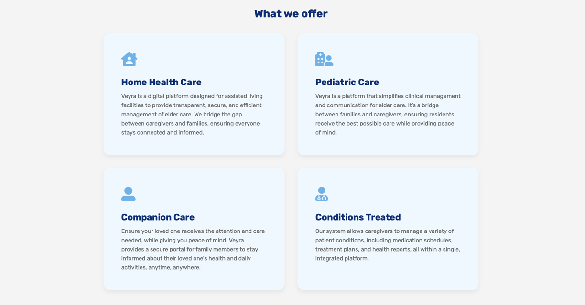

<strong>Sección Pricing:</strong>

<strong>Sección About the App:</strong>

<strong>Sección Testimonials:</strong>

<strong>Sección About the Team:</strong>

<strong>Sección Contact:</strong>

<strong>Footer:</strong>

#### 5.2.1.6. Services Documentation Evidence for Sprint Review

  En el Sprint 1, el equipo diseñó, programó y desplegó el Landing Page de VEYRA. Esta es una página web estática, 
  por lo que no hay Web Services disponibles en este sprint.

<table border="1" cellpadding="4" cellspacing="0">
  <thead>
    <tr>
      <th>End Point</th>
      <th>Funciones</th>
    </tr>
  </thead>
  <tbody>
    <tr>
      <td>N/A</td>
      <td>No hay Web Services implementados en el Sprint 1 (Landing Page estático)</td>
    </tr>
  </tbody>
</table>

#### 5.2.1.7. Software Deployment Evidence for Sprint Review

  <a href="https://novaperu-tech.github.io/NovaPeru-Tech-LandingPage/">Landing Page NovaPeru-Tech</a> — 
  <a href="https://novaperu-tech.github.io/NovaPeru-Tech-LandingPage/">https://novaperu-tech.github.io/NovaPeru-Tech-LandingPage/</a>

#### 5.2.1.8. Team Collaboration Insights during Sprint

Durante el Sprint 1, los analíticos de colaboración de GitHub muestran una participación activa y continua de todos los miembros del equipo sobre el repositorio de la Landing Page. En el panel de Overview se observa un flujo constante de commits distribuidos a lo largo de los días del sprint, lo que evidencia que las tareas de implementación de las distintas secciones (hero, servicios, planes, equipo, testimonios, contacto y footer) se desarrollaron de manera incremental y coordinada. Cada integrante realizó aportes directos al código, ya sea mediante la creación de nuevas secciones, ajustes de estilos responsivos o correcciones derivadas de las revisiones entre pares, asegurando así que el entregable del sprint se construyera de forma colaborativa y no centralizada en una sola persona.

El Network Graph refleja esta dinámica mediante la presencia de ramas que nacen desde main y regresan a ella una vez integradas, siguiendo el flujo definido por GitFlow. Esta visualización confirma que las contribuciones individuales se alinearon con el marco de trabajo acordado: se desarrollaron cambios en ramas aisladas, se realizaron pruebas locales y posteriormente se integraron al tronco principal, lo que redujo conflictos y facilitó el seguimiento de la trazabilidad de cada cambio. De este modo, la colaboración no solo se dio a nivel de cantidad de commits, sino también en la forma de trabajo estructurada y compatible con las prácticas ágiles del equipo.

Finalmente, el gráfico de Visitors evidencia que, conforme avanzaba el desarrollo y se consolidaban las funcionalidades del Landing Page, el repositorio comenzó a recibir visitas y visualizaciones, lo que sugiere interés progresivo en el producto por parte de stakeholders y del propio equipo durante las actividades de revisión y validación. En conjunto, estos analíticos de colaboración y actividad en GitHub demuestran que todos los integrantes tuvieron participación efectiva en la implementación del producto del Sprint (Landing Page) y sientan la base para replicar este mismo patrón de trabajo en los siguientes sprints, donde se abordarán la Web Application y los Web Services.

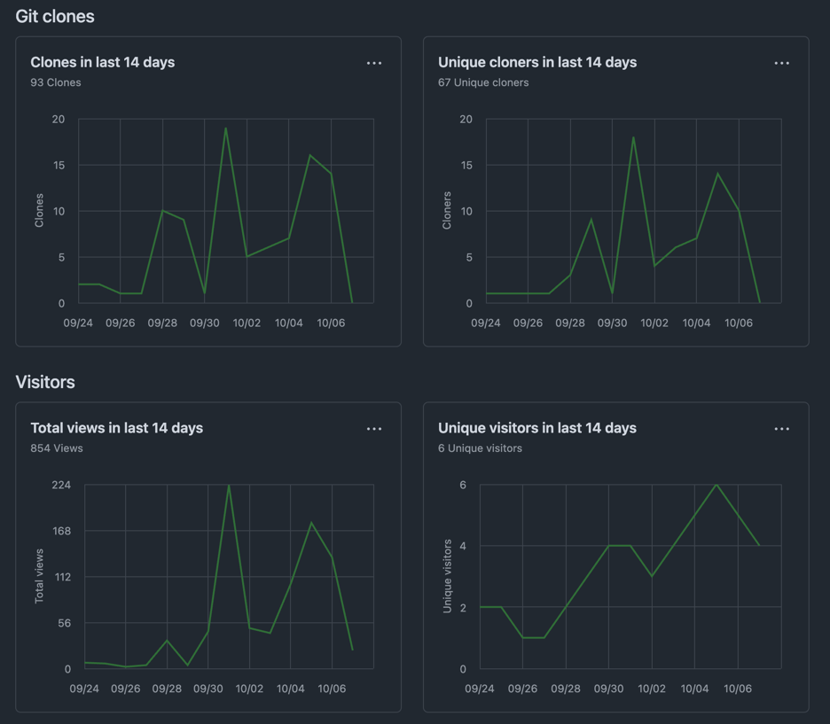

### 5.2.2. Sprint 2

  Durante el Sprint 2, el equipo se enfocó en el desarrollo del módulo frontend de gestión de tareas, 
  miembros y grupos de la aplicación web VEYRA. Este sprint se centró en integrar componentes con el 
  backend mediante servicios REST, crear flujos de navegación funcionales entre vistas y aplicar mejoras 
  en la interfaz visual con Angular y Angular Material.

  <strong>Repositorio Frontend:</strong> <a href="https://github.com/NovaPeru-Tech/NovaPeruTech-Frontend">https://github.com/NovaPeru-Tech/NovaPeruTech-Frontend</a>

  <strong>Backend API (Local):</strong> <a href="http://localhost:8080/swagger-ui/index.html">http://localhost:8080/swagger-ui/index.html</a>

#### 5.2.2.1. Sprint Planning 2

<table border="1" cellpadding="4" cellspacing="0">
  <thead>
    <tr>
      <th colspan="2" style="text-align: center;">Sprint Planning Sprint 2</th>
    </tr>
  </thead>
  <tbody>
    <tr>
      <td colspan="2" style="text-align: center;"><strong>Sprint Planning Background</strong></td>
    </tr>
    <tr>
      <td>Date</td>
      <td>28/09/2025</td>
    </tr>
    <tr>
      <td>Time</td>
      <td>09:30 p.m.</td>
    </tr>
    <tr>
      <td>Location</td>
      <td>Discord</td>
    </tr>
    <tr>
      <td>Prepared By</td>
      <td>Oscar Javier Armas Sánchez</td>
    </tr>
    <tr>
      <td>Attendees (to planning meeting)</td>
      <td>
        Calvo Yalan, Renato Guillermo 
        Armas Sánchez, Oscar Javier 
        Ramirez Carrasco, Ariana Lizeth 
        Roman Lopez, Miguel Angel Junior 
        Ruiz Madrid, Billy Jake
      </td>
    </tr>
    <tr>
      <td colspan="2" style="text-align: center;"><strong>Sprint 1 Review Summary</strong></td>
    </tr>
    <tr>
      <td colspan="2">
        Se completó el desarrollo y despliegue de la Landing Page, incluyendo todas las secciones planificadas 
        y la funcionalidad de cambio de idioma. Quedaron pendientes pequeños ajustes visuales en la sección 
        de "Planes" y optimizaciones de carga, los cuales se trasladarán al Sprint 2 para su refinamiento.
      </td>
    </tr>
    <tr>
      <td colspan="2" style="text-align: center;"><strong>Sprint 1 Retrospective Summary</strong></td>
    </tr>
    <tr>
      <td colspan="2">
        El equipo identificó la necesidad de mejorar la comunicación diaria y la asignación de sub-tareas 
        en Jira para evitar solapamientos. Se acordó utilizar etiquetas más claras por responsable y realizar 
        revisiones de código colaborativas al cierre de cada día.
      </td>
    </tr>
    <tr>
      <td colspan="2" style="text-align: center;"><strong>Sprint Goal & User Stories</strong></td>
    </tr>
    <tr>
      <td colspan="2"><strong>Sprint 2 Goal (Outcome–Impact–Customer–Confirmation):</strong>  
<em>Our focus is on enabling administrators to manage tasks, members, and groups from a unified web interface connected to VEYRA’s backend services.</em>  
<em>We believe it delivers better visibility and coordination of daily activities to Nursing Home Administrators and internal staff, by centralizing operational information in a single place.</em>  
<em>This will be confirmed when an administrator can create, update, and view tasks linked to members and groups, and filter them by status from the web application, with data persisted and retrieved through the backend API.</em>
      </td>
    </tr>
    <tr>
      <td>Sprint 2 Velocity</td>
      <td>16 Story Points</td>
    </tr>
    <tr>
      <td>Sum of Story Points</td>
      <td>16 SP (≈ 64 horas estimadas)</td>
    </tr>
  </tbody>
</table>

#### 5.2.2.2. Aspect Leaders and Collaborators

Para el Sprint 2 se presenta la matriz <strong>Leadership-and-Collaboration Matrix (LACX)</strong>, donde se definen los roles de liderazgo (<strong>L</strong>) y colaboración (<strong>C</strong>) por aspecto técnico y funcional del desarrollo frontend basado en Angular.

Estos aspectos se derivan directamente de los objetivos establecidos en el <em>Sprint 2 Goal</em>, garantizando que cada componente clave del módulo frontend cuente con un responsable principal y con el apoyo colaborativo necesario para su implementación efectiva.

<ul>
  <li><strong>Integración Frontend–Backend:</strong> Consumo de endpoints, configuración de servicios HTTP y validación de la conexión con la API local.</li>
  <li><strong>Gestión de Tareas (UI):</strong> Desarrollo de componentes Angular para la visualización, filtrado y navegación entre tareas.</li>
  <li><strong>Gestión de Miembros y Grupos:</strong> Creación de componentes de detalle y listado de miembros y grupos asociados al proyecto.</li>
</ul>

<table border="1" cellpadding="4" cellspacing="0" align="center">
  <thead>
    <tr>
      <th>Team Member (Last Name, First Name)</th>
      <th>Aspect: API Integration</th>
      <th>Aspect: Task UI</th>
      <th>Aspect: Members &amp; Groups</th>
    </tr>
  </thead>
  <tbody>
    <tr><td>Armas Sánchez, Oscar Javier</td><td>L</td><td>C</td><td>C</td></tr>
    <tr><td>Calvo Yalan, Renato Guillermo</td><td>C</td><td>L</td><td>C</td></tr>
    <tr><td>Ramirez Carrasco, Ariana Lizeth</td><td>C</td><td>C</td><td>L</td></tr>
    <tr><td>Roman Lopez, Miguel Angel Junior</td><td>C</td><td>C</td><td>C</td></tr>
    <tr><td>Ruiz Madrid, Billy Jake</td><td>C</td><td>C</td><td>C</td></tr>
  </tbody>
</table>

<ul>
  <li><strong>L</strong> = Líder del aspecto</li>
  <li><strong>C</strong> = Colaborador en el aspecto</li>
</ul>

La asignación de roles busca optimizar la ejecución del sprint, favoreciendo la especialización técnica y la cooperación entre los miembros. 
Cada líder coordina las tareas relacionadas con su aspecto a través de <strong>Jira Software</strong>, supervisando avances, revisiones de código y validaciones funcionales con sus colaboradores.

### 5.2.2.3. Sprint Backlog 2  

El siguiente Sprint Backlog presenta las historias de usuario y tareas planificadas para el **Sprint 2**, orientado a la implementación del frontend en Angular y Angular Material, la integración con el backend, la mejora de la experiencia de usuario y la consistencia visual de la landing page.  

Todas las tareas son monitoreadas y actualizadas mediante **Jira Software**.

 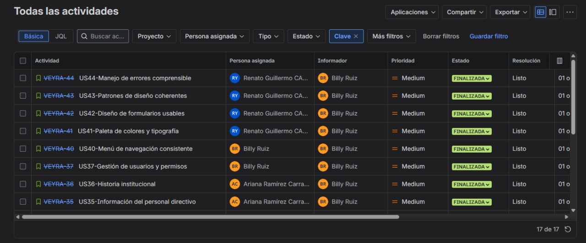 
<em>Figura: Tablero del Sprint 2 en Jira Software (Proyecto VEYRA)</em>

 

  
<em>Figura: Tablero del Sprint 2 en Jira Software (Proyecto VEYRA)</em>

 

A continuación, la estructura de la tabla de control de estado para el Sprint:

| Sprint # | Sprint 2 |   |   |   |   |   |   |
|---------|----------|---|---|---|---|---|---|
| **User Story** |   | **Work-Item / Task** |   |   |   |   |  |
| **Id** | **Title** | **Id** | **Title** | **Description** | **Estimation (Hours)** | **Assigned To** | **Status (To-do / In-Process / To-Review / Done)** |
| US-01 | Menú de navegación | T022 | Definir estructura del menú para frontend | Definir la estructura del menú de navegación en Angular para la landing page. | 2h | [Asignado] | To-do |
| US-01 | Menú de navegación | T023 | Implementar menú en Angular y Angular Material | Implementar el menú de navegación utilizando Angular y Angular Material. | 3h | [Asignado] | To-do |
| US-01 | Menú de navegación | T024 | Añadir navegación dinámica y pruebas | Añadir navegación dinámica entre secciones y ejecutar pruebas básicas del menú. | 2h | [Asignado] | In-Process |
| US-02 | Visualización de Planes | T025 | Crear componentes para mostrar planes | Crear componentes de Angular para visualizar los planes disponibles. | 3h | [Asignado] | To-do |
| US-02 | Visualización de Planes | T026 | Integrar datos de planes desde backend | Integrar los datos de planes consumiendo los servicios del backend. | 4h | [Asignado] | In-Process |
| US-02 | Visualización de Planes | T027 | Pruebas funcionales y de UI | Realizar pruebas funcionales y de interfaz sobre la visualización de planes. | 2h | [Asignado] | To-do |
| US-03 | Selección de Plan en Landing Page | T028 | Implementar formulario de selección y validación | Implementar el formulario de selección de plan con validaciones en Angular. | 3h | [Asignado] | To-do |
| US-03 | Selección de Plan en Landing Page | T029 | Manejar envío y confirmación de plan | Implementar la lógica de envío y confirmación del plan seleccionado. | 4h | [Asignado] | To-do |
| US-03 | Selección de Plan en Landing Page | T030 | Validar interacción usuario y feedback visual | Probar la interacción del usuario y el feedback visual al seleccionar un plan. | 2h | [Asignado] | To-do |
| US-04 | Visualización de creadores | T031 | Diseñar componente para mostrar equipo | Diseñar el componente para mostrar la información del equipo/creadores. | 2h | [Asignado] | To-do |
| US-04 | Visualización de creadores | T032 | Integrar datos y pruebas | Integrar datos del equipo y realizar pruebas de visualización. | 3h | [Asignado] | To-do |
| US-04 | Visualización de creadores | T033 | Ajustar estilos para responsividad | Ajustar estilos para asegurar que la sección del equipo sea responsive. | 2h | [Asignado] | To-do |
| US-05 | Redes sociales | T034 | Incorporar íconos sociales en header y footer | Incorporar íconos de redes sociales en el header y footer de la landing page. | 2h | [Asignado] | To-do |
| US-05 | Redes sociales | T035 | Configurar enlaces y pruebas | Configurar los enlaces a redes sociales y realizar pruebas de navegación. | 1h | [Asignado] | To-do |
| US-06 | Formulario de contacto | T036 | Crear formulario con validación Angular | Crear el formulario de contacto con validaciones en Angular. | 2h | [Asignado] | To-do |
| US-06 | Formulario de contacto | T037 | Integrar envío y confirmación | Integrar el envío de datos y mensajes de confirmación del formulario. | 3h | [Asignado] | To-do |
| US-06 | Formulario de contacto | T038 | Test de funcionalidad y usabilidad | Realizar pruebas de funcionamiento y usabilidad del formulario de contacto. | 2h | [Asignado] | To-do |
| US-07 | Cambio de idioma | T039 | Añadir selector de idioma en menú | Añadir un selector de idioma en el menú principal. | 3h | [Asignado] | To-do |
| US-07 | Cambio de idioma | T040 | Configurar textos traducidos en frontend | Configurar y gestionar los textos traducidos en el frontend. | 4h | [Asignado] | In-Process |
| US-07 | Cambio de idioma | T041 | Validar cambio dinámico y pruebas | Probar el cambio dinámico de idioma y validar su comportamiento. | 2h | [Asignado] | To-do |
| US-40 | Menú de navegación consistente | T042 | Asegurar estilo uniforme en todas las páginas | Asegurar que el menú mantenga un estilo uniforme en todas las páginas. | 2h | [Asignado] | To-do |
| US-40 | Menú de navegación consistente | T043 | Ajustar comportamiento de menú en rutas | Ajustar el comportamiento del menú al navegar entre diferentes rutas. | 2h | [Asignado] | To-do |
| US-41 | Paleta de colores y tipografía | T044 | Aplicar esquema de colores accesible | Aplicar un esquema de colores accesible conforme a buenas prácticas de UX. | 2h | [Asignado] | To-do |
| US-41 | Paleta de colores y tipografía | T045 | Configurar tipografía coherente en estilos globales | Configurar tipografías coherentes en los estilos globales del proyecto. | 2h | [Asignado] | To-do |
| US-42 | Diseño de formularios usables | T046 | Crear formularios con validación clara | Diseñar formularios con validación clara y mensajes comprensibles. | 3h | [Asignado] | To-do |
| US-42 | Diseño de formularios usables | T047 | Pruebas de usabilidad y accesibilidad | Realizar pruebas de usabilidad y accesibilidad en los formularios. | 2h | [Asignado] | To-do |
| US-43 | Patrones de diseño coherentes | T048 | Definir y aplicar patrones UI comunes | Definir y aplicar patrones de interfaz reutilizables en el frontend. | 2h | [Asignado] | To-do |
| US-43 | Patrones de diseño coherentes | T049 | Revisar consistencia en todos los componentes | Revisar la consistencia visual y de interacción en todos los componentes. | 2h | [Asignado] | To-do |
| US-44 | Manejo de errores comprensible | T050 | Implementar mensajes de error amigables | Implementar mensajes de error claros y amigables para el usuario. | 3h | [Asignado] | To-do |
| US-44 | Manejo de errores comprensible | T051 | Pruebas de errores y soluciones claras | Probar escenarios de error y validar que las soluciones mostradas sean claras. | 2h | [Asignado] | To-do |

El seguimiento y la actualización del Sprint Backlog se realizan en **Jira Software** mediante el tablero Scrum del proyecto, donde se registran los estados de cada tarea (**To-do, In-Process, To-Review, Done**). Durante las reuniones diarias (**Daily Scrum**), el equipo actualiza el progreso y revisa posibles bloqueos para garantizar el cumplimiento.

#### 5.2.2.4. Development Evidence for Sprint Review

<table border="1" cellpadding="4" cellspacing="0">
  <thead>
    <tr>
      <th>Repository</th>
      <th>Branch</th>
      <th>Commit Id</th>
      <th>Commit Message</th>
      <th>Committed on (Date)</th>
    </tr>
  </thead>
  <tbody>
    <tr>
      <td rowspan="9">https://github.com/NovaPeru-Tech/NovaPeruTech-Frontend</td>
      <td>main</td>
      <td>d2e8b00</td>
      <td>feat(jam): add JAM module scaffolding</td>
      <td>29-09-2025</td>
    </tr>
    <tr>
      <td>main</td>
      <td>ff01fea</td>
      <td>feat: add SignIn component with validation</td>
      <td>29-09-2025</td>
    </tr>
    <tr>
      <td>main</td>
      <td>fa75547</td>
      <td>feat: add Familiar and SignUpFamiliar components</td>
      <td>29-09-2025</td>
    </tr>
    <tr>
      <td>main</td>
      <td>ec5cece</td>
      <td>feat: add Welcome component with greeting</td>
      <td>29-09-2025</td>
    </tr>
    <tr>
      <td>main</td>
      <td>0fbc1ac</td>
      <td>feat: add AuthenticationSection component</td>
      <td>29-09-2025</td>
    </tr>
    <tr>
      <td>main</td>
      <td>b8cb684</td>
      <td>feat: add Administrator and SignUpAdministrator components</td>
      <td>29-09-2025</td>
    </tr>
    <tr>
      <td>main</td>
      <td>4e12667</td>
      <td>feat(i18n): add English and Spanish language support</td>
      <td>29-09-2025</td>
    </tr>
    <tr>
      <td>main</td>
      <td>9763508</td>
      <td>feat: add language switcher and layout components</td>
      <td>29-09-2025</td>
    </tr>
    <tr>
      <td>main</td>
      <td>4ccacbc</td>
      <td>chore: default Angular setup</td>
      <td>28-09-2025</td>
    </tr>
    <tr>
      <td rowspan="4">https://github.com/NovaPeru-Tech/NovaPeruTech-Frontend</td>
      <td>develop</td>
      <td>5f14512</td>
      <td>feat(env): update API base URL for development and production</td>
      <td>10-10-2025</td>
    </tr>
    <tr>
      <td>develop</td>
      <td>2886e0b</td>
      <td>feat(firebase): update hosting configuration</td>
      <td>10-10-2025</td>
    </tr>
    <tr>
      <td>develop</td>
      <td>251c8a9</td>
      <td>feat(env): add employee endpoint to development</td>
      <td>10-10-2025</td>
    </tr>
    <tr>
      <td>develop</td>
      <td>ee86134</td>
      <td>feat(firebase): configure Firebase hosting</td>
      <td>10-10-2025</td>
    </tr>
  </tbody>
</table>

#### 5.2.2.5. Execution Evidence for Sprint Review

  Durante el Sprint 2, se logró implementar completamente el módulo de gestión de tareas con integración 
  a la API Backend. El frontend permite listar, filtrar y navegar entre tareas por miembro y estado, 
  así como visualizar detalles asociados. Además, se mejoró la navegación y el diseño visual adaptando 
  elementos con Angular Material.

<h5>Video de demostración de funcionalidad:</h5>

  <strong>URL Youtube:</strong> https://youtu.be/CEzlIzeI3Cc  
  <strong>Duración:</strong> [10:23:00]

<h5>Capturas de pantalla principales:</h5>

<strong>Módulo de Residentes - Nueva entrada:</strong>

<strong>Módulo de Residentes - Listado:</strong>

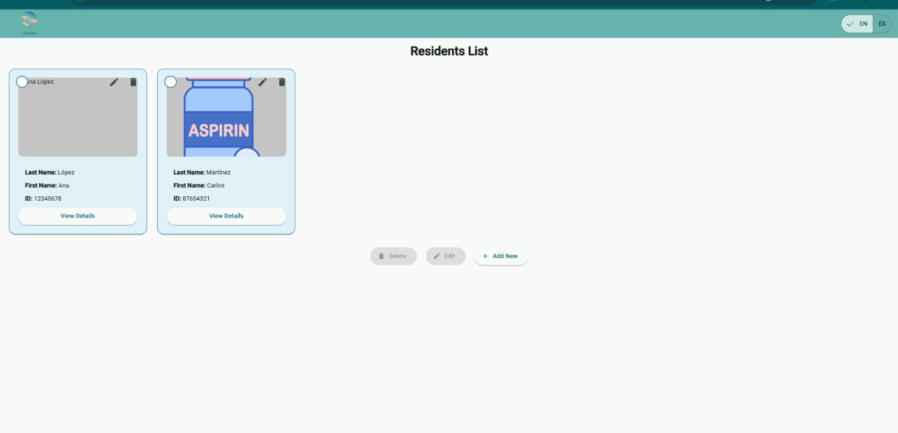

<strong>Módulo de Residentes - Detalle:</strong>

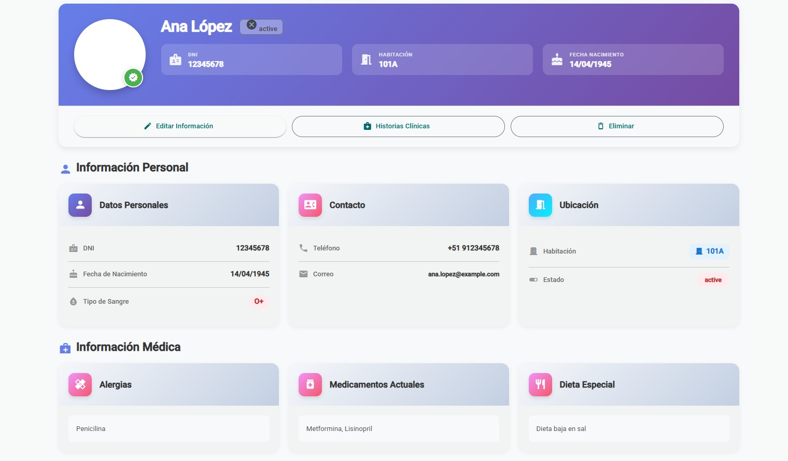

<strong>Módulo de Medicamentos - Listado:</strong>

<strong>Módulo de Medicamentos - Detalle:</strong>

#### 5.2.2.6. Services Documentation Evidence for Sprint Review

  En el Sprint 2, el equipo diseñó, programó e integró el módulo frontend con la API Backend de VEYRA. 
  Se estableció la comunicación con éxito entre el Frontend y los servicios REST proporcionados por el Backend, 
  implementando las operaciones CRUD (Crear, Leer, Actualizar, Eliminar) para las principales entidades. 
  La documentación del servicio se presenta a continuación, cumpliendo con los lineamientos de especificación 
  de Endpoints, verbos HTTP, sintaxis de llamada y explicación del response.

<table border="1" cellpadding="4" cellspacing="0">
  <thead>
    <tr>
      <th>End Point Base</th>
      <th>Método HTTP</th>
      <th>Acción Implementada (Funciones)</th>
      <th>Sintaxis de Llamada (Ejemplo y Parámetros)</th>
      <th>Explicación del Response</th>
    </tr>
  </thead>
  <tbody>
    <tr>
      <td rowspan="5"><strong>http://localhost:8080/api/v1/residents</strong></td>
      <td><strong>GET</strong></td>
      <td>Obtener el listado completo de residentes.</td>
      <td><code>GET /api/v1/residents</code></td>
      <td><code>200 OK</code>: Retorna un array JSON con la lista de objetos Residentes.</td>
    </tr>
    <tr>
      <td><strong>GET</strong></td>
      <td>Obtener el detalle de un residente por su ID.</td>
      <td><code>GET /api/v1/residents/{id}</code> (Ej: <code>/api/v1/residents/123</code>)</td>
      <td><code>200 OK</code>: Retorna el objeto Residente solicitado. <code>404 Not Found</code> si el ID no existe.</td>
    </tr>
    <tr>
      <td><strong>POST</strong></td>
      <td>Crear un nuevo residente.</td>
      <td><code>POST /api/v1/residents</code> (Requiere Objeto Residente en el Body)</td>
      <td><code>201 Created</code>: Retorna el objeto Residente creado, incluyendo el ID asignado.</td>
    </tr>
    <tr>
      <td><strong>PUT</strong></td>
      <td>Actualizar completamente un residente existente por su ID.</td>
      <td><code>PUT /api/v1/residents/{id}</code> (Requiere Objeto Residente en el Body)</td>
      <td><code>200 OK</code>: Retorna el objeto Residente actualizado.</td>
    </tr>
    <tr>
      <td><strong>DELETE</strong></td>
      <td>Eliminar un residente por su ID.</td>
      <td><code>DELETE /api/v1/residents/{id}</code></td>
      <td><code>204 No Content</code>: Indica la eliminación exitosa.</td>
    </tr>
    <tr>
      <td rowspan="5"><strong>http://localhost:8080/api/v1/medications</strong></td>
      <td><strong>GET</strong></td>
      <td>Obtener el listado completo de medicamentos.</td>
      <td><code>GET /api/v1/medications</code></td>
      <td><code>200 OK</code>: Retorna un array JSON con la lista de objetos Medicamentos.</td>
    </tr>
    <tr>
      <td><strong>GET</strong></td>
      <td>Obtener el detalle de un medicamento por su ID.</td>
      <td><code>GET /api/v1/medications/{id}</code> (Ej: <code>/api/v1/medications/456</code>)</td>
      <td><code>200 OK</code>: Retorna el objeto Medicamento solicitado. <code>404 Not Found</code> si el ID no existe.</td>
    </tr>
    <tr>
      <td><strong>POST</strong></td>
      <td>Crear un nuevo medicamento.</td>
      <td><code>POST /api/v1/medications</code> (Requiere Objeto Medicamento en el Body)</td>
      <td><code>201 Created</code>: Retorna el objeto Medicamento creado, incluyendo el ID asignado.</td>
    </tr>
    <tr>
      <td><strong>PUT</strong></td>
      <td>Actualizar completamente un medicamento existente por su ID.</td>
      <td><code>PUT /api/v1/medications/{id}</code> (Requiere Objeto Medicamento en el Body)</td>
      <td><code>200 OK</code>: Retorna el objeto Medicamento actualizado.</td>
    </tr>
    <tr>
      <td><strong>DELETE</strong></td>
      <td>Eliminar un medicamento por su ID.</td>
      <td><code>DELETE /api/v1/medications/{id}</code></td>
      <td><code>204 No Content</code>: Indica la eliminación exitosa.</td>
    </tr>
    <tr>
      <td rowspan="5"><strong>http://localhost:8080/api/v1/staff</strong></td>
      <td><strong>GET</strong></td>
      <td>Obtener el listado completo de empleados.</td>
      <td><code>GET /api/v1/staff</code></td>
      <td><code>200 OK</code>: Retorna un array JSON con la lista de objetos Empleados.</td>
    </tr>
    <tr>
      <td><strong>GET</strong></td>
      <td>Obtener el detalle de un empleado por su ID.</td>
      <td><code>GET /api/v1/staff/{id}</code> (Ej: <code>/api/v1/staff/789</code>)</td>
      <td><code>200 OK</code>: Retorna el objeto Empleado solicitado. <code>404 Not Found</code> si el ID no existe.</td>
    </tr>
    <tr>
      <td><strong>POST</strong></td>
      <td>Crear un nuevo empleado.</td>
      <td><code>POST /api/v1/staff</code> (Requiere Objeto Empleado en el Body)</td>
      <td><code>201 Created</code>: Retorna el objeto Empleado creado, incluyendo el ID asignado.</td>
    </tr>
    <tr>
      <td><strong>PUT</strong></td>
      <td>Actualizar completamente un empleado.</td>
      <td><code>PUT /api/v1/staff/{id}</code> (Requiere Objeto Empleado en el Body)</td>
      <td><code>200 OK</code>: Retorna el objeto Empleado actualizado.</td>
    </tr>
    <tr>
      <td><strong>DELETE</strong></td>
      <td>Eliminar un empleado.</td>
      <td><code>DELETE /api/v1/staff/{id}</code></td>
      <td><code>204 No Content</code>: Indica la eliminación exitosa.</td>
    </tr>
  </tbody>
</table>

#### 5.2.2.7. Software Deployment Evidence for Sprint Review

  <a href="https://nova-peru-tech-frontend-v1-2w9r.vercel.app/home">Frontend NovaPeru-Tech</a> — 
  <a href="https://nova-peru-tech-frontend-v1-2w9r.vercel.app/home">https://nova-peru-tech-frontend-v1-2w9r.vercel.app/home</a>

#### 5.2.2.8. Team Collaboration Insights during Sprint

Durante el Sprint 2, los analíticos de colaboración del repositorio NovaPeruTech-Frontend evidencian una participación constante de todos los integrantes del equipo sobre el código de la aplicación web VEYRA. A lo largo del sprint se registran commits frecuentes asociados a la implementación de los módulos de gestión de tareas, miembros y grupos, así como a la integración con los servicios REST del backend y a las mejoras visuales con Angular y Angular Material. Esta actividad distribuida confirma que la construcción de la Web Application se realizó de forma incremental, respetando las responsabilidades definidas en el Sprint 2 Goal y la matriz LACX (API Integration, Task UI, Members & Groups), y evitando la concentración del desarrollo en un solo miembro.

El Network Graph correspondiente al Sprint 2 muestra un uso activo del flujo de trabajo basado en GitFlow, con ramas de características (features) creadas para la integración Frontend–Backend, la interfaz de gestión de tareas y los componentes de miembros y grupos, que luego son fusionadas a la rama principal tras las respectivas revisiones de código. Este patrón de ramas y merges refleja que los líderes de cada aspecto coordinaron el trabajo con sus colaboradores, alineados con las prácticas definidas para el proyecto (feature branches, revisiones colaborativas y consolidación en main/develop), reforzando la trazabilidad y la calidad del código entregado durante el sprint.

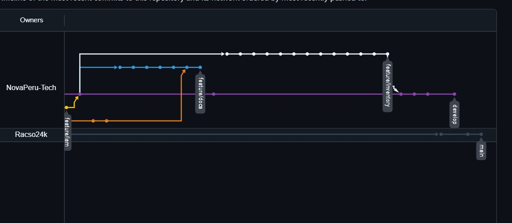

Finalmente, el gráfico de Visitors del repositorio frontend muestra un incremento de visitas y vistas de página conforme se acercan las fechas de integración y despliegue del producto, lo que sugiere que el equipo utilizó activamente el repositorio como punto central para revisar avances, validar funcionalidades y preparar la Sprint Review. En conjunto, estos analíticos de overview, network graph y visitors demuestran que, durante el Sprint 2, todos los miembros del equipo participaron efectivamente en la implementación del producto web (Web Application) y en su integración con los Web Services, cumpliendo con el principio de que cada integrante contribuya a los distintos productos definidos en el proyecto (Landing Page, Web Applications, Web Services) según el alcance de cada sprint.

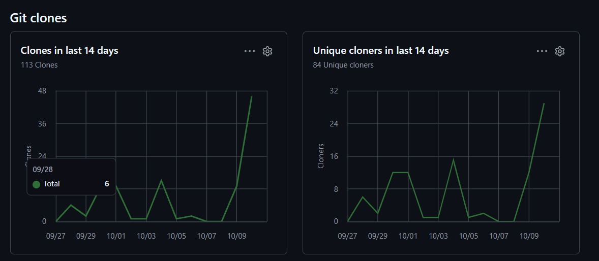

### 5.2.3. Sprint 3

  En esta sección se registra y explica el avance logrado durante el Sprint 3 tanto en
  términos de producto como de trabajo colaborativo del equipo VEYRA. A lo largo de este
  sprint se consolidó la primera versión operativa del entorno productivo: se implementó y
  desplegó la capa de persistencia y lógica de negocio en el Backend con Java Spring Boot,
  se conectó el Frontend Angular desarrollado en sprints previos y se habilitó la
  documentación de servicios para soportar la Sprint Review.

  Las subsecciones que siguen detallan este avance desde diferentes ángulos: 
  <strong>Sprint Planning 3</strong>, <strong>Aspect Leaders and Collaborators</strong>,
  <strong>Sprint Backlog 3</strong>, <strong>Development Evidence for Sprint Review</strong>,
  <strong>Execution Evidence for Sprint Review</strong>,
  <strong>Services Documentation Evidence for Sprint Review</strong> y 
  <strong>Team Collaboration Insights during Sprint</strong>, mostrando cómo cada integrante
  contribuyó a los productos de la solución (Web Application y Web Services) y al
  cumplimiento del objetivo del Sprint 3.

  <strong>Repositorio Frontend:</strong>
  <a href="https://github.com/NovaPeru-Tech/NovaPeruTech-Frontend">
    https://github.com/NovaPeru-Tech/NovaPeruTech-Frontend
  </a>

  <strong>Repositorio Backend:</strong>
  <a href="https://github.com/NovaPeru-Tech/NovaPeruTech-Backend">
    https://github.com/NovaPeru-Tech/NovaPeruTech-Backend
  </a>

  <strong>Backend API (Producción):</strong>
  <a href="https://veyrav01.azurewebsites.net/swagger-ui/index.html#/">
    https://veyrav01.azurewebsites.net/swagger-ui/index.html#/
  </a>

#### 5.2.3.1. Sprint Planning 3

<table border="1" cellpadding="4" cellspacing="0">
  <thead>
    <tr>
      <th colspan="2" style="text-align: center;">Sprint Planning Sprint 3</th>
    </tr>
  </thead>
  <tbody>
    <tr>
      <td colspan="2" style="text-align: center;"><strong>Sprint Planning Background</strong></td>
    </tr>
    <tr>
      <td>Date</td>
      <td>10/11/2025</td>
    </tr>
    <tr>
      <td>Time</td>
      <td>10:00 p.m.</td>
    </tr>
    <tr>
      <td>Location</td>
      <td>Discord</td>
    </tr>
    <tr>
      <td>Prepared By</td>
      <td>Ariana Lizeth Ramirez Carrasco</td>
    </tr>
    <tr>
      <td>Attendees (to planning meeting)</td>
      <td>
        Calvo Yalan, Renato Guillermo 
        Armas Sánchez, Oscar Javier 
        Ramirez Carrasco, Ariana Lizeth 
        Roman Lopez, Miguel Angel Junior 
        Ruiz Madrid, Billy Jake 
        Quiroz Caceres, Adrian Alonso
      </td>
    </tr>
    <tr>
      <td colspan="2" style="text-align: center;"><strong>Sprint 2 Review Summary</strong></td>
    </tr>
    <tr>
      <td colspan="2">
        Se completó el desarrollo del Frontend para los módulos de Tareas, Miembros y Grupos. La interfaz 
        está lista para el usuario y se integró satisfactoriamente con los servicios mockeados. Quedó pendiente 
        la implementación del sistema de autenticación y la configuración de las variables de entorno para el 
        despliegue final.
      </td>
    </tr>
    <tr>
      <td colspan="2" style="text-align: center;"><strong>Sprint 2 Retrospective Summary</strong></td>
    </tr>
    <tr>
      <td colspan="2">
        Se mejoró la comunicación, pero se identificó la necesidad de estandarizar la nomenclatura de los 
        servicios y DTOs en el Backend, lo cual se abordará antes de iniciar la programación. El equipo 
        acordó asignar un "guardián de la calidad" (Quality Keeper) rotativo para el Backend en cada sprint.
      </td>
    </tr>
    <tr>
      <td colspan="2" style="text-align: center;"><strong>Sprint Goal & User Stories</strong></td>
    </tr>
    <tr>
      <td colspan="2"><strong>Sprint 3 Goal (Outcome–Impact–Customer–Confirmation):</strong>  
<em>Our focus is on delivering a live VEYRA production environment where authenticated users can sign up, sign in, and manage core nursing-home data (residents, staff, rooms and medications) through the deployed web application connected to the backend.</em>  
<em>We believe it delivers a realistic, reliable and secure experience to Nursing Home Administrators and Family Members, allowing them to access updated information about residents’ care and activities from anywhere and at any time.</em>  
<em>This will be confirmed when the production URL is publicly accessible, at least one test administrator can register and log in, and can successfully perform end-to-end CRUD operations on key entities (for example residents, staff and medications) using the deployed frontend connected to the Azure-hosted backend during the Sprint Review.</em>
      </td>
    </tr>
    <tr>
      <td>Sprint 3 Velocity</td>
      <td>18 Story Points</td>
    </tr>
    <tr>
      <td>Sum of Story Points</td>
      <td>18 SP (≈ 72 horas estimadas)</td>
    </tr>
  </tbody>
</table>

#### 5.2.3.2. Aspect Leaders and Collaborators

  Para el Sprint 3 se presenta la matriz <strong>Leadership-and-Collaboration Matrix (LACX)</strong>, 
  donde se definen los roles de liderazgo (<strong>L</strong>) y colaboración (<strong>C</strong>) 
  por aspecto clave del desarrollo.

  Los aspectos clave se centran en el despliegue y la implementación del Backend, que son la prioridad 
  de este sprint. El nuevo participante (Adrian Alonso Quiroz Caceres) se integra en el rol de 
  colaboración dentro del equipo.

<ul>
  <li><strong>DevOps & Deployment:</strong> Configuración de variables de entorno, pipeline CI/CD y 
  monitoreo del frontend desplegado.</li>
  <li><strong>Backend Core (CRUD Operations):</strong> Implementación de la arquitectura MVC/Capas para 
  la gestión de datos (Java Spring Boot, JPA).</li>
  <li><strong>Authentication & Security:</strong> Desarrollo de los endpoints de registro/login, JWT 
  generation y configuración de seguridad.</li>
</ul>

<table border="1" cellpadding="4" cellspacing="0" align="center">
  <thead>
    <tr>
      <th>Team Member (Last Name, First Name)</th>
      <th>Aspect: DevOps & Deploy</th>
      <th>Aspect: Backend Core</th>
      <th>Aspect: Auth & Security</th>
    </tr>
  </thead>
  <tbody>
    <tr>
      <td>Armas Sánchez, Oscar Javier</td>
      <td>L</td>
      <td>C</td>
      <td>C</td>
    </tr>
    <tr>
      <td>Calvo Yalan, Renato Guillermo</td>
      <td>C</td>
      <td>L</td>
      <td>C</td>
    </tr>
    <tr>
      <td>Ramirez Carrasco, Ariana Lizeth</td>
      <td>C</td>
      <td>C</td>
      <td>L</td>
    </tr>
    <tr>
      <td>Roman Lopez, Miguel Angel Junior</td>
      <td>C</td>
      <td>C</td>
      <td>C</td>
    </tr>
    <tr>
      <td>Ruiz Madrid, Billy Jake</td>
      <td>C</td>
      <td>C</td>
      <td>C</td>
    </tr>
    <tr>
      <td>Quiroz Caceres, Adrian Alonso</td>
      <td>C</td>
      <td>C</td>
      <td>C</td>
    </tr>
  </tbody>
</table>

<ul>
  <li><strong>L</strong> = Líder del aspecto</li>
  <li><strong>C</strong> = Colaborador en el aspecto</li>
</ul>

  Esta organización de roles garantiza que los aspectos críticos de despliegue y backend sean cubiertos 
  con especialización, mientras se mantiene la flexibilidad para que todos colaboren según sea necesario.

### 5.2.3.3. Sprint Backlog 3  

El Sprint Backlog 3 incluye las historias de usuario y tareas planificadas para el despliegue del frontend en **Vercel** y del backend en **Azure App Service**, con énfasis en la implementación de operaciones **CRUD** y el sistema de autenticación (login/registro).

Todas las tareas son monitoreadas y actualizadas mediante **Jira Software**.

 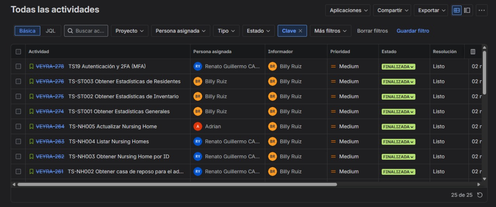 
<em>Figura: Tablero del Sprint 3 en Jira Software (Proyecto VEYRA)</em>

 

 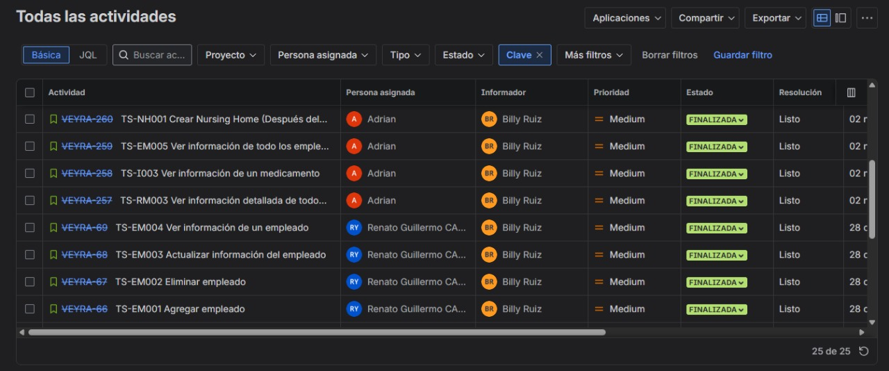 
<em>Figura: Tablero del Sprint 3 en Jira Software (Proyecto VEYRA)</em>

 

  
<em>Figura: Tablero del Sprint 3 en Jira Software (Proyecto VEYRA)</em>

 

A continuación, la tabla de control de estado para el Sprint 3:

| Sprint # | Sprint 3 |   |   |   |   |   |   |
|---------|----------|---|---|---|---|---|---|
| **User Story** |   | **Work-Item / Task** |   |   |   |   |  |
| **Id** | **Title** | **Id** | **Title** | **Description** | **Estimation (Hours)** | **Assigned To** | **Status (To-do / In-Process / To-Review / Done)** |
| US-015 | Despliegue Frontend en Vercel | T043 | Configurar proyecto en Vercel | Configurar el proyecto del frontend en la plataforma Vercel. | 2h | [Asignado] | Done |
| US-015 | Despliegue Frontend en Vercel | T044 | Configurar build pipeline | Configurar el pipeline de build y despliegue automático en Vercel. | 2h | [Asignado] | Done |
| US-015 | Despliegue Frontend en Vercel | T045 | Validar despliegue y DNS | Validar el despliegue del frontend, dominio y configuración DNS. | 1h | [Asignado] | Done |
| US-016 | Implementación Backend CRUD - Residentes | T046 | Crear Entity y Repository | Crear la entidad y el repositorio para la gestión de residentes. | 3h | [Asignado] | Done |
| US-016 | Implementación Backend CRUD - Residentes | T047 | Implementar Service layer | Implementar la capa de servicios para operaciones CRUD de residentes. | 3h | [Asignado] | Done |
| US-016 | Implementación Backend CRUD - Residentes | T048 | Crear Controller y endpoints | Crear el controlador y endpoints REST para residentes. | 3h | [Asignado] | Done |
| US-016 | Implementación Backend CRUD - Residentes | T049 | Pruebas unitarias | Desarrollar y ejecutar pruebas unitarias para los endpoints de residentes. | 2h | [Asignado] | Done |
| US-017 | Implementación Backend CRUD - Medicamentos | T050 | Crear Entity y Repository | Crear la entidad y el repositorio para la gestión de medicamentos. | 3h | [Asignado] | Done |
| US-017 | Implementación Backend CRUD - Medicamentos | T051 | Implementar Service layer | Implementar la capa de servicios para operaciones CRUD de medicamentos. | 3h | [Asignado] | Done |
| US-017 | Implementación Backend CRUD - Medicamentos | T052 | Crear Controller y endpoints | Crear el controlador y endpoints REST para medicamentos. | 3h | [Asignado] | Done |
| US-017 | Implementación Backend CRUD - Medicamentos | T053 | Pruebas unitarias | Desarrollar y ejecutar pruebas unitarias para los endpoints de medicamentos. | 2h | [Asignado] | Done |
| US-018 | Implementación Backend CRUD - Empleados | T054 | Crear Entity y Repository | Crear la entidad y el repositorio para la gestión de empleados. | 3h | [Asignado] | Done |
| US-018 | Implementación Backend CRUD - Empleados | T055 | Implementar Service layer | Implementar la capa de servicios para operaciones CRUD de empleados. | 3h | [Asignado] | Done |
| US-018 | Implementación Backend CRUD - Empleados | T056 | Crear Controller y endpoints | Crear el controlador y endpoints REST para empleados. | 3h | [Asignado] | Done |
| US-018 | Implementación Backend CRUD - Empleados | T057 | Pruebas unitarias | Desarrollar y ejecutar pruebas unitarias para los endpoints de empleados. | 2h | [Asignado] | Done |
| US-019 | Sistema de Autenticación (Login/Registro) | T058 | Implementar generación de JWT | Implementar la generación y validación de tokens JWT para autenticación. | 3h | [Asignado] | Done |
| US-019 | Sistema de Autenticación (Login/Registro) | T059 | Crear endpoint de registro | Crear el endpoint para registro de usuarios. | 3h | [Asignado] | Done |
| US-019 | Sistema de Autenticación (Login/Registro) | T060 | Crear endpoint de login | Crear el endpoint para inicio de sesión de usuarios. | 3h | [Asignado] | Done |
| US-019 | Sistema de Autenticación (Login/Registro) | T061 | Configurar Spring Security | Configurar Spring Security para proteger los endpoints del backend. | 2h | [Asignado] | Done |
| US-020 | Despliegue Backend en Azure App Service | T062 | Crear Azure App Service | Crear el recurso de Azure App Service para el backend. | 2h | [Asignado] | Done |
| US-020 | Despliegue Backend en Azure App Service | T063 | Configurar Azure SQL Database | Configurar la base de datos Azure SQL para la aplicación. | 2h | [Asignado] | Done |
| US-020 | Despliegue Backend en Azure App Service | T064 | Configurar variables de entorno | Configurar variables de entorno y cadenas de conexión en Azure. | 1h | [Asignado] | Done |
| US-020 | Despliegue Backend en Azure App Service | T065 | Validar despliegue y acceso | Validar el despliegue del backend y el acceso a los servicios. | 1h | [Asignado] | Done |

El seguimiento y la actualización del Sprint Backlog se realizan en **Jira Software** mediante el tablero Scrum del proyecto, donde se registran los estados de cada tarea (**To-do, In-Process, To-Review, Done**). Durante las reuniones diarias (**Daily Scrum**), el equipo actualiza el progreso y revisa posibles bloqueos para garantizar el cumplimiento de los objetivos del **Sprint 3**.

#### 5.2.3.4. Development Evidence for Sprint Review

<table border="1" cellpadding="4" cellspacing="0">
  <thead>
    <tr>
      <th>Repository</th>
      <th>Branch</th>
      <th>Commit Id</th>
      <th>Commit Message</th>
      <th>Committed on (Date)</th>
    </tr>
  </thead>
  <tbody>
    <tr>
      <td rowspan="12">https://github.com/NovaPeru-Tech/NovaPeruTech-Backend</td>
      <td>main</td>
      <td>3a8c12f</td>
      <td>feat(init): initialize Spring Boot project scaffolding</td>
      <td>02-11-2025</td>
    </tr>
    <tr>
      <td>main</td>
      <td>7b2e45c</td>
      <td>feat(entities): add Resident entity with JPA annotations</td>
      <td>03-11-2025</td>
    </tr>
    <tr>
      <td>main</td>
      <td>9d6f89e</td>
      <td>feat(repository): add ResidentRepository interface</td>
      <td>03-11-2025</td>
    </tr>
    <tr>
      <td>main</td>
      <td>1c4d67a</td>
      <td>feat(service): implement ResidentService with CRUD operations</td>
      <td>04-11-2025</td>
    </tr>
    <tr>
      <td>main</td>
      <td>8e5a23b</td>
      <td>feat(controller): add ResidentController with REST endpoints</td>
      <td>04-11-2025</td>
    </tr>
    <tr>
      <td>main</td>
      <td>5f3c90d</td>
      <td>feat(medication): add Medication entity and CRUD operations</td>
      <td>05-11-2025</td>
    </tr>
    <tr>
      <td>main</td>
      <td>2a7b18f</td>
      <td>feat(employee): add Employee entity and CRUD operations</td>
      <td>05-11-2025</td>
    </tr>
    <tr>
      <td>main</td>
      <td>c8e3a19</td>
      <td>feat(auth): implement JWT token generation and validation</td>
      <td>06-11-2025</td>
    </tr>
    <tr>
      <td>main</td>
      <td>4f9d52e</td>
      <td>feat(auth): add authentication endpoints (login/register)</td>
      <td>06-11-2025</td>
    </tr>
    <tr>
      <td>main</td>
      <td>6a2c71b</td>
      <td>feat(security): configure Spring Security with JWT filters</td>
      <td>07-11-2025</td>
    </tr>
    <tr>
      <td>main</td>
      <td>9e4f63c</td>
      <td>feat(docs): add Swagger/OpenAPI documentation</td>
      <td>07-11-2025</td>
    </tr>
    <tr>
      <td>main</td>
      <td>3d8f94c</td>
      <td>chore(deploy): configure Azure deployment pipeline</td>
      <td>08-11-2025</td>
    </tr>
  </tbody>
</table>

#### 5.2.3.5. Execution Evidence for Sprint Review

  Durante el Sprint 3, se completó exitosamente la implementación del Backend con Spring Boot, incluyendo 
  todos los módulos de gestión de residentes, medicamentos, empleados y sistema de autenticación. Se logró 
  el despliegue en Azure App Service con base de datos en Azure SQL Database.

<h5>Video de demostración de los Endpoints:</h5> 
 <strong>URL Microsoft Stream / YouTube:</strong> [Incluir URL del video de demostración del Sprint 3]  <strong>Duración:</strong> [HH:MM:SS] 

<h5>Capturas de pantalla - Swagger UI del Backend:</h5>

<strong>Endpoints de Medications:</strong>

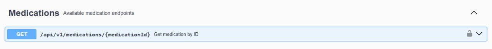

<strong>Endpoints de Person profiles:</strong>

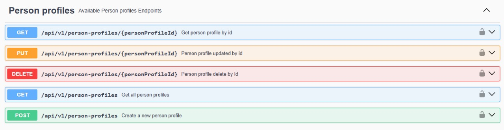

<strong>Endpoints de Nursing Homes:</strong>

<strong>Endpoints de Staff:</strong>

<strong>Endpoints de Roles:</strong>

<strong>Endpoints de Autenticación:</strong>

<strong>Endpoints de Measurements:</strong>

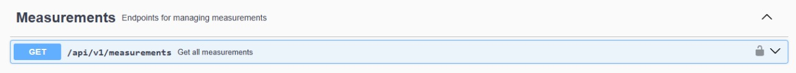

<strong>Endpoints de Activities:</strong>

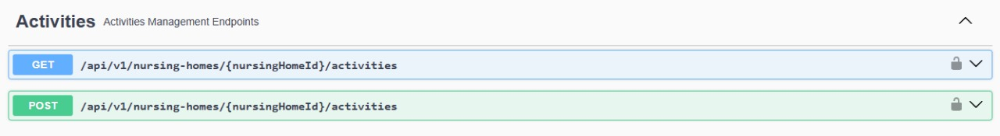

<strong>Endpoints de Business Profiles:</strong>

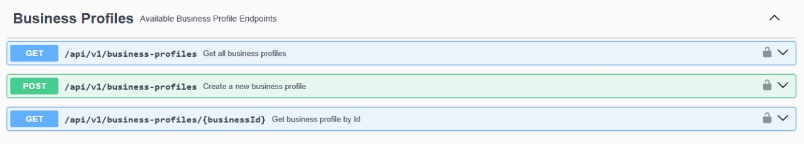

<strong>Endpoints de Residentes:</strong>

<strong>Endpoints de Administrators:</strong>

<strong>Endpoints de Users:</strong>

#### 5.2.3.6. Services Documentation Evidence for Sprint Review

  Durante el Sprint 3, se implementó la capa de servicios REST del Backend de VEYRA, con documentación 
  completa en Swagger/OpenAPI. Todos los endpoints están disponibles y descritos en el documento 
  <code>/v3/api-docs</code> del entorno de producción de NovaPeruTech, incluyendo parámetros, códigos de
  respuesta y modelos de datos.

  La tabla siguiente resume los principales endpoints expuestos, organizados por recurso y operación, 
  indicando el verbo HTTP, la acción implementada, la sintaxis de la llamada y el tipo de respuesta 
  que devuelve el servicio.

<table border="1" cellpadding="4" cellspacing="0">
  <thead>
    <tr>
      <th>End Point Base</th>
      <th>Método HTTP</th>
      <th>Acción Implementada</th>
      <th>Sintaxis de Llamada</th>
      <th>Explicación del Response</th>
    </tr>
  </thead>
  <tbody>
    <!-- Medications -->
    <tr>
      <td><strong>/api/v1/medications</strong></td>
      <td><strong>GET</strong></td>
      <td>Obtener medicamento por ID.</td>
      <td><code>GET /api/v1/medications/{medicationId}</code></td>
      <td><code>200 OK</code>: Objeto <code>MedicationResource</code> con la información del medicamento.</td>
    </tr>
    <!-- Person Profiles -->
    <tr>
      <td rowspan="5"><strong>/api/v1/person-profiles</strong></td>
      <td><strong>GET</strong></td>
      <td>Obtener listado de perfiles de persona.</td>
      <td><code>GET /api/v1/person-profiles</code></td>
      <td><code>200 OK</code>: Array JSON de <code>PersonProfileResource</code>.</td>
    </tr>
    <tr>
      <td><strong>GET</strong></td>
      <td>Obtener perfil de persona por ID.</td>
      <td><code>GET /api/v1/person-profiles/{personProfileId}</code></td>
      <td><code>200 OK</code>: Objeto <code>PersonProfileResource</code> o <code>404 Not Found</code> si no existe.</td>
    </tr>
    <tr>
      <td><strong>POST</strong></td>
      <td>Crear un nuevo perfil de persona.</td>
      <td><code>POST /api/v1/person-profiles</code></td>
      <td><code>201 Created</code>: Objeto creado con sus datos normalizados.</td>
    </tr>
    <tr>
      <td><strong>PUT</strong></td>
      <td>Actualizar un perfil de persona.</td>
      <td><code>PUT /api/v1/person-profiles/{personProfileId}</code></td>
      <td><code>200 OK</code>: Objeto actualizado o <code>404 Not Found</code>.</td>
    </tr>
    <tr>
      <td><strong>DELETE</strong></td>
      <td>Eliminar un perfil de persona.</td>
      <td><code>DELETE /api/v1/person-profiles/{personProfileId}</code></td>
      <td><code>204 No Content</code>: Eliminación exitosa.</td>
    </tr>
    <!-- Nursing Homes (incluye staff, rooms, residents y analytics) -->
    <tr>
      <td rowspan="15"><strong>/api/v1/nursing-homes</strong></td>
      <td><strong>GET</strong></td>
      <td>Listar todas las casas de reposo.</td>
      <td><code>GET /api/v1/nursing-homes</code></td>
      <td><code>200 OK</code>: Array de <code>NursingHomeResource</code>.</td>
    </tr>
    <tr>
      <td><strong>GET</strong></td>
      <td>Obtener casa de reposo por ID.</td>
      <td><code>GET /api/v1/nursing-homes/{nursingHomeId}</code></td>
      <td><code>200 OK</code>: <code>NursingHomeResource</code> o <code>404 Not Found</code>.</td>
    </tr>
    <tr>
      <td><strong>GET</strong></td>
      <td>Listar staff de una casa de reposo.</td>
      <td><code>GET /api/v1/nursing-homes/{nursingHomeId}/staff</code></td>
      <td><code>200 OK</code>: Array de <code>StaffResource</code>.</td>
    </tr>
    <tr>
      <td><strong>POST</strong></td>
      <td>Registrar nuevo miembro de staff en una casa de reposo.</td>
      <td><code>POST /api/v1/nursing-homes/{nursingHomeId}/staff</code></td>
      <td><code>201 Created</code>: <code>StaffResource</code> creado.</td>
    </tr>
    <tr>
      <td><strong>GET</strong></td>
      <td>Listar habitaciones de una casa de reposo.</td>
      <td><code>GET /api/v1/nursing-homes/{nursingHomeId}/rooms</code></td>
      <td><code>200 OK</code>: Array de <code>RoomResource</code>.</td>
    </tr>
    <tr>
      <td><strong>POST</strong></td>
      <td>Agregar nueva habitación a una casa de reposo.</td>
      <td><code>POST /api/v1/nursing-homes/{nursingHomeId}/rooms</code></td>
      <td><code>201 Created</code>: <code>RoomResource</code> creada.</td>
    </tr>
    <tr>
      <td><strong>POST</strong></td>
      <td>Asignar residente a una habitación.</td>
      <td><code>POST /api/v1/nursing-homes/{nursingHomeId}/rooms/{residentId}</code></td>
      <td><code>200 OK</code>: <code>AssignedRoomForResidentResource</code> con la asignación.</td>
    </tr>
    <tr>
      <td><strong>GET</strong></td>
      <td>Listar habitaciones por estado.</td>
      <td><code>GET /api/v1/nursing-homes/{nursingHomeId}/rooms/{roomStatus}</code></td>
      <td><code>200 OK</code>: Array de habitaciones filtradas por estado.</td>
    </tr>
    <tr>
      <td><strong>GET</strong></td>
      <td>Listar residentes de una casa de reposo.</td>
      <td><code>GET /api/v1/nursing-homes/{nursingHomeId}/residents</code></td>
      <td><code>200 OK</code>: Array de <code>ResidentResource</code>.</td>
    </tr>
    <tr>
      <td><strong>POST</strong></td>
      <td>Registrar nuevo residente en una casa de reposo.</td>
      <td><code>POST /api/v1/nursing-homes/{nursingHomeId}/residents</code></td>
      <td><code>201 Created</code>: <code>ResidentResource</code> creado.</td>
    </tr>
    <tr>
      <td><strong>GET</strong></td>
      <td>Obtener analíticas de terminaciones de staff.</td>
      <td><code>GET /api/v1/nursing-homes/{nursingHomeId}/analytics/staff-terminations</code></td>
      <td><code>200 OK</code>: Lista de <code>MetricResource</code> con estadísticas de terminaciones.</td>
    </tr>
    <tr>
      <td><strong>GET</strong></td>
      <td>Obtener analíticas de contrataciones de staff.</td>
      <td><code>GET /api/v1/nursing-homes/{nursingHomeId}/analytics/staff-hires</code></td>
      <td><code>200 OK</code>: Lista de métricas de contrataciones.</td>
    </tr>
    <tr>
      <td><strong>GET</strong></td>
      <td>Obtener analíticas de admisiones de residentes.</td>
      <td><code>GET /api/v1/nursing-homes/{nursingHomeId}/analytics/residents-admissions</code></td>
      <td><code>200 OK</code>: Lista de métricas de admisiones.</td>
    </tr>
    <tr>
      <td><strong>GET</strong></td>
      <td>Listar actividades de una casa de reposo.</td>
      <td><code>GET /api/v1/nursing-homes/{nursingHomeId}/activities</code></td>
      <td><code>200 OK</code>: Array de <code>ActivityResource</code>.</td>
    </tr>
    <tr>
      <td><strong>POST</strong></td>
      <td>Registrar nueva actividad en una casa de reposo.</td>
      <td><code>POST /api/v1/nursing-homes/{nursingHomeId}/activities</code></td>
      <td><code>201 Created</code>: <code>ActivityResource</code> creada.</td>
    </tr>
    <!-- Staff -->
    <tr>
      <td rowspan="6"><strong>/api/v1/staff</strong></td>
      <td><strong>PUT</strong></td>
      <td>Actualizar datos de un miembro del staff.</td>
      <td><code>PUT /api/v1/staff/{staffMemberId}</code></td>
      <td><code>200 OK</code>: <code>StaffResource</code> actualizado.</td>
    </tr>
    <tr>
      <td><strong>GET</strong></td>
      <td>Listar contratos de un miembro del staff.</td>
      <td><code>GET /api/v1/staff/{staffMemberId}/contracts</code></td>
      <td><code>200 OK</code>: Array de <code>ContractResource</code>.</td>
    </tr>
    <tr>
      <td><strong>POST</strong></td>
      <td>Registrar nuevo contrato para un miembro del staff.</td>
      <td><code>POST /api/v1/staff/{staffMemberId}/contracts</code></td>
      <td><code>201 Created</code>: <code>ContractResource</code> creado.</td>
    </tr>
    <tr>
      <td><strong>GET</strong></td>
      <td>Obtener contrato específico por ID.</td>
      <td><code>GET /api/v1/staff/{staffMemberId}/contracts/{contractId}</code></td>
      <td><code>200 OK</code>: <code>ContractResource</code> o <code>404 Not Found</code>.</td>
    </tr>
    <tr>
      <td><strong>PATCH</strong></td>
      <td>Actualizar estado de un contrato.</td>
      <td><code>PATCH /api/v1/staff/{staffMemberId}/contracts/{contractId}</code></td>
      <td><code>200 OK</code>: Contrato actualizado; <code>400</code> si la transición es inválida.</td>
    </tr>
    <tr>
      <td><strong>GET</strong></td>
      <td>Obtener contrato activo de un miembro del staff.</td>
      <td><code>GET /api/v1/staff/{staffMemberId}/contracts/active</code></td>
      <td><code>200 OK</code>: <code>ContractResource</code> activo o <code>404 Not Found</code>.</td>
    </tr>
    <!-- Roles -->
    <tr>
      <td><strong>/api/v1/roles</strong></td>
      <td><strong>GET</strong></td>
      <td>Listar todos los roles del sistema.</td>
      <td><code>GET /api/v1/roles</code></td>
      <td><code>200 OK</code>: Array de <code>RoleResource</code>.</td>
    </tr>
    <!-- Authentication -->
    <tr>
      <td rowspan="2"><strong>/api/v1/authentication</strong></td>
      <td><strong>POST</strong></td>
      <td>Registro de nuevo usuario (sign-up).</td>
      <td><code>POST /api/v1/authentication/sign-up</code></td>
      <td><code>201 Created</code>: <code>AuthenticatedUserResource</code> con datos y token.</td>
    </tr>
    <tr>
      <td><strong>POST</strong></td>
      <td>Inicio de sesión (sign-in).</td>
      <td><code>POST /api/v1/authentication/sign-in</code></td>
      <td><code>200 OK</code>: <code>AuthenticatedUserResource</code> con token JWT; <code>401 Unauthorized</code> en credenciales inválidas.</td>
    </tr>
    <!-- Measurements -->
    <tr>
      <td><strong>/api/v1/measurements</strong></td>
      <td><strong>GET</strong></td>
      <td>Obtener listado de mediciones registradas.</td>
      <td><code>GET /api/v1/measurements</code></td>
      <td><code>200 OK</code>: Array de <code>MeasurementResource</code> utilizado para monitoreo de salud.</td>
    </tr>
    <!-- Business Profiles -->
    <tr>
      <td rowspan="3"><strong>/api/v1/business-profiles</strong></td>
      <td><strong>GET</strong></td>
      <td>Listar todos los perfiles de negocio.</td>
      <td><code>GET /api/v1/business-profiles</code></td>
      <td><code>200 OK</code>: Array de <code>BusinessProfileResource</code>.</td>
    </tr>
    <tr>
      <td><strong>POST</strong></td>
      <td>Registrar nuevo perfil de negocio.</td>
      <td><code>POST /api/v1/business-profiles</code></td>
      <td><code>201 Created</code>: <code>BusinessProfileResource</code> creado.</td>
    </tr>
    <tr>
      <td><strong>GET</strong></td>
      <td>Obtener perfil de negocio por ID.</td>
      <td><code>GET /api/v1/business-profiles/{businessId}</code></td>
      <td><code>200 OK</code>: Perfil de negocio o <code>404 Not Found</code>.</td>
    </tr>
    <!-- Residents (detalle, alergias, medicamentos) -->
    <tr>
      <td rowspan="7"><strong>/api/v1/residents</strong></td>
      <td><strong>GET</strong></td>
      <td>Obtener residente por ID.</td>
      <td><code>GET /api/v1/residents/{residentId}</code></td>
      <td><code>200 OK</code>: <code>ResidentResource</code> o <code>404 Not Found</code>.</td>
    </tr>
    <tr>
      <td><strong>PUT</strong></td>
      <td>Actualizar datos de un residente.</td>
      <td><code>PUT /api/v1/residents/{residentId}</code></td>
      <td><code>200 OK</code>: Residente actualizado.</td>
    </tr>
    <tr>
      <td><strong>DELETE</strong></td>
      <td>Eliminar residente.</td>
      <td><code>DELETE /api/v1/residents/{residentId}</code></td>
      <td><code>204 No Content</code>: Eliminación exitosa.</td>
    </tr>
    <tr>
      <td><strong>GET</strong></td>
      <td>Listar alergias de un residente.</td>
      <td><code>GET /api/v1/residents/{residentId}/allergies</code></td>
      <td><code>200 OK</code>: Array de <code>AllergyResource</code>.</td>
    </tr>
    <tr>
      <td><strong>POST</strong></td>
      <td>Registrar nueva alergia para un residente.</td>
      <td><code>POST /api/v1/residents/{residentId}/allergies</code></td>
      <td><code>201 Created</code>: <code>AllergyResource</code> creada.</td>
    </tr>
    <tr>
      <td><strong>GET</strong></td>
      <td>Listar medicamentos asignados a un residente.</td>
      <td><code>GET /api/v1/residents/{residentId}/medications</code></td>
      <td><code>200 OK</code>: Array de <code>MedicationResource</code>.</td>
    </tr>
    <tr>
      <td><strong>POST</strong></td>
      <td>Registrar un nuevo medicamento para un residente.</td>
      <td><code>POST /api/v1/residents/{residentId}/medications</code></td>
      <td><code>201 Created</code>: Asociación residente–medicamento creada.</td>
    </tr>
    <!-- Administrators -->
    <tr>
      <td rowspan="2"><strong>/api/v1/administrators</strong></td>
      <td><strong>POST</strong></td>
      <td>Crear administrador del sistema.</td>
      <td><code>POST /api/v1/administrators</code></td>
      <td><code>201 Created</code>: <code>AdministratorResource</code> registrado.</td>
    </tr>
    <tr>
      <td><strong>POST</strong></td>
      <td>Crear casa de reposo asociada a un administrador.</td>
      <td><code>POST /api/v1/administrators/{administratorId}/nursing-homes</code></td>
      <td><code>201 Created</code>: <code>NursingHomeResource</code> vinculada al administrador.</td>
    </tr>
    <!-- Users -->
    <tr>
      <td rowspan="2"><strong>/api/v1/users</strong></td>
      <td><strong>GET</strong></td>
      <td>Listar todos los usuarios.</td>
      <td><code>GET /api/v1/users</code></td>
      <td><code>200 OK</code>: Array de <code>UserResource</code>.</td>
    </tr>
    <tr>
      <td><strong>GET</strong></td>
      <td>Obtener usuario por ID.</td>
      <td><code>GET /api/v1/users/{userId}</code></td>
      <td><code>200 OK</code>: <code>UserResource</code> o <code>404 Not Found</code>.</td>
    </tr>
  </tbody>
</table>

  Adicionalmente, la especificación OpenAPI incluye los esquemas de datos utilizados por la API, tales como 
  <code>StaffResource</code>, <code>ResidentResource</code>, <code>PersonProfileResource</code>, 
  <code>AllergyResource</code>, <code>ContractResource</code>, <code>MedicationResource</code>, 
  <code>RoomResource</code>, <code>ActivityResource</code>, <code>BusinessProfileResource</code>, 
  <code>UserResource</code>, <code>AdministratorResource</code>, <code>NursingHomeResource</code>, 
  <code>MetricResource</code>, <code>MeasurementResource</code>, <code>RoleResource</code>, 
  <code>SignUpResource</code>, <code>SignInResource</code> y <code>AuthenticatedUserResource</code>, 
  entre otros, que describen la estructura de los <em>request</em> y <em>response</em> intercambiados 
  entre el Frontend y el Backend.

#### 5.2.3.7. Software Deployment Evidence for Sprint Review

  Durante el Sprint 3 se consolidó el <em>deployment</em> de la solución VEYRA en entornos cloud,
  abarcando la Web Application (Frontend Angular) y los Web Services (Backend con APIs REST y
  documentación Swagger). Las actividades incluyeron la creación y configuración de proyectos
  en Vercel y Azure App Service, la definición de variables de entorno para separar los
  ambientes de desarrollo y producción, y la integración del flujo de despliegue continuo
  basado en los repositorios de GitHub del equipo.

  De esta manera, el producto quedó accesible desde una URL pública para los usuarios
  administradores de casas de reposo y se habilitó, además, la documentación interactiva de
  la API para facilitar las pruebas funcionales y la validación técnica durante la revisión
  del Sprint.

---

<h5>1) Despliegue de la Web Application (Frontend) en Vercel</h5>

  Para la Web Application se configuró un proyecto en Vercel enlazado al repositorio
  <em>NovaPeruTech-Frontend</em>. Se definió el comando de build de Angular y la carpeta de
  salida de artefactos (<code>dist</code>), y se registró la variable de entorno con la
  <code>BASE_API_URL</code> apuntando al backend en producción. Con esto, cada vez que se
  realiza un merge a la rama principal, Vercel ejecuta automáticamente el pipeline de
  compilación y despliegue.

  <strong>Frontend desplegado:</strong>
  <a href="https://nova-peru-tech-frontend-v1-2w9r.vercel.app/home">
    https://nova-peru-tech-frontend-v1-2w9r.vercel.app/home
  </a>

  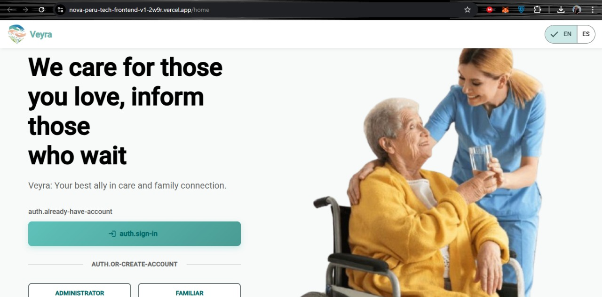
  
<em>Figura: Panel de despliegue de la Web Application de VEYRA en Vercel.</em>

---

<h5>2) Despliegue de los Web Services (Backend) en Azure App Service</h5>

  El backend de VEYRA se desplegó en Azure App Service utilizando el proyecto
  <em>veyrav01</em>. Para ello se creó un recurso de App Service, se configuró el entorno de
  ejecución de Spring Boot y se definieron las variables de entorno necesarias (cadena de
  conexión a la base de datos, perfil <code>prod</code> y claves de seguridad). Azure se
  integró con el repositorio <em>NovaPeruTech-BackEnd</em> para automatizar el despliegue
  cada vez que se actualiza la rama principal.

  <strong>Backend desplegado:</strong>
  <a href="https://veyrav01.azurewebsites.net">
    https://veyrav01.azurewebsites.net
  </a>

  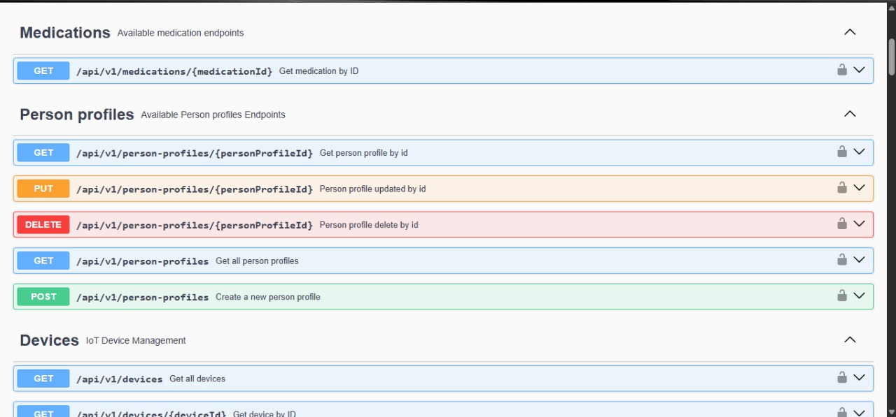
  
<em>Figura: Vista del recurso de Azure App Service con el backend VEYRA desplegado.</em>

---

<h5>3) Publicación de la documentación de la API (Swagger UI)</h5>

  Como parte del proceso de deployment, se habilitó la documentación de los Web Services
  mediante Swagger UI en el mismo App Service de Azure. Esto permite a los miembros del
  equipo y a los stakeholders explorar todos los endpoints REST (creación, consulta,
  actualización y eliminación de recursos como residentes, personal, casas de reposo,
  actividades y métricas de salud), así como probarlos en tiempo real contra el entorno de
  producción.

  <strong>API Documentation (Swagger UI):</strong>
  <a href="https://veyrav01.azurewebsites.net/swagger-ui/index.html">
    https://veyrav01.azurewebsites.net/swagger-ui/index.html
  </a>

  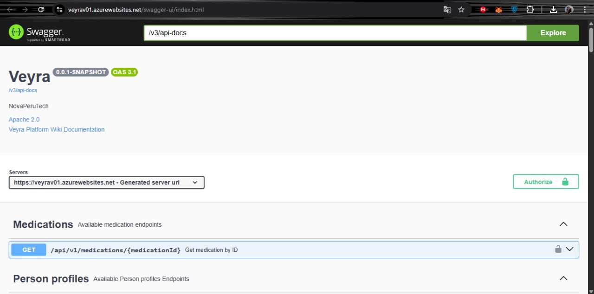
  
<em>Figura: Documentación interactiva de los Web Services de VEYRA mediante Swagger UI.</em>

#### 5.2.3.8. Team Collaboration Insights during Sprint

Durante el Sprint 3, los analíticos de colaboración de los repositorios NovaPeruTech-Frontend y NovaPeruTech-Backend evidencian una participación activa y distribuida de todos los integrantes del equipo sobre los dos productos principales del proyecto: la Web Application (Frontend) y los Web Services (Backend). El gráfico de Overview muestra un volumen sostenido de commits a lo largo del sprint, asociado a la implementación de la capa de persistencia, la lógica de negocio en Spring Boot y los ajustes finales de integración y despliegue del Frontend. Esto refleja que las tareas no se concentraron en una sola persona, sino que cada miembro asumió responsabilidades específicas (servicios, entidades, controladores, componentes de UI, integración con la API en producción) y realizó aportes continuos hasta completar el objetivo del sprint, alineado con el enfoque en Backend y despliegue descrito en la sección de Sprint 3.

El Network Graph de ambos repositorios refuerza esta visión de trabajo colaborativo mediante la presencia de múltiples ramas de tipo feature/ que parten de develop o main y luego son fusionadas una vez completadas, siguiendo el GitFlow definido para el proyecto. Se observan ciclos de creación de ramas, desarrollo de funcionalidades (endpoints REST, servicios de negocio, integración del Frontend con la API de Azure) y merges controlados, lo que confirma que la coordinación entre líderes y colaboradores permitió avanzar en paralelo sin perder trazabilidad ni calidad del código.

Finalmente, el gráfico de Visitors muestra actividad de consulta sobre los repositorios a medida que se acercan las fechas de pruebas e integración con el entorno de producción (https://veyrav01.azurewebsites.net/swagger-ui/index.html#/), indicando que el equipo utilizó GitHub como punto central para revisar avances, validar el comportamiento de la API desplegada y preparar la Sprint Review. En conjunto, estos analíticos de Overview, Network Graph y Visitors demuestran que, durante el Sprint 3, todos los miembros del equipo participaron efectivamente en la implementación y despliegue de los Web Services y la Web Application, cumpliendo con el principio establecido de involucrar a todos los integrantes en los productos clave del proyecto (Landing Page, Web Applications y Web Services) a lo largo de los sprints.

### 5.2.4. Sprint 4

Durante el Sprint 4, el equipo se enfocó en la estabilización final del producto (Release Candidate), priorizando la corrección de los errores de severidad alta detectados durante las entrevistas de validación y la evaluación heurística. Se realizaron optimizaciones de rendimiento en el Backend y se unificó la localización (idioma) en el Frontend para garantizar una experiencia de usuario consistente en el lanzamiento final.

  <strong>Repositorio Frontend:</strong> <a href="https://github.com/NovaPeru-Tech/NovaPeruTech-Frontend">https://github.com/NovaPeru-Tech/NovaPeruTech-Frontend</a>

  <strong>Repositorio Backend:</strong> <a href="https://github.com/NovaPeru-Tech/NovaPeruTech-Backend">https://github.com/NovaPeru-Tech/NovaPeruTech-Backend</a>

  <strong>Backend API (Producción):</strong> <a href="https://veyrav01.azurewebsites.net/swagger-ui/index.html#/">https://veyrav01.azurewebsites.net/swagger-ui/index.html#/</a>

#### 5.2.4.1. Sprint Planning 4

<table border="1" cellpadding="4" cellspacing="0">
  <thead>
    <tr>
      <th colspan="2" style="text-align: center;">Sprint Planning Sprint 4</th>
    </tr>
  </thead>
  <tbody>
    <tr>
      <td colspan="2" style="text-align: center;"><strong>Sprint Planning Background</strong></td>
    </tr>
    <tr>
      <td>Date</td>
      <td>04/12/2025</td>
    </tr>
    <tr>
      <td>Time</td>
      <td>09:00 a.m.</td>
    </tr>
    <tr>
      <td>Location</td>
      <td>Discord</td>
    </tr>
    <tr>
      <td>Prepared By</td>
      <td>Ruiz Madrid, Billy Jake</td>
    </tr>
    <tr>
      <td>Attendees (to planning meeting)</td>
      <td>
        Calvo Yalan, Renato Guillermo 
        Armas Sánchez, Oscar Javier 
        Ramirez Carrasco, Ariana Lizeth 
        Roman Lopez, Miguel Angel Junior 
        Ruiz Madrid, Billy Jake 
        Quiroz Caceres, Adrian Alonso
      </td>
    </tr>
    <tr>
      <td colspan="2" style="text-align: center;"><strong>Sprint 3 Review Summary</strong></td>
    </tr>
    <tr>
      <td colspan="2">
        Se logró el despliegue exitoso del Backend en Azure y la integración base con el Frontend. 
        Sin embargo, las pruebas de usuario revelaron inconsistencias críticas en el idioma (mezcla de inglés/español) 
        y errores técnicos visibles ("Fetch Error") en el módulo de habitaciones que deben ser resueltos antes del lanzamiento.
      </td>
    </tr>
    <tr>
      <td colspan="2" style="text-align: center;"><strong>Sprint 3 Retrospective Summary</strong></td>
    </tr>
    <tr>
      <td colspan="2">
        El equipo notó que la calidad del código UI bajó por la prisa del despliegue. Se acordó dedicar 
        este último sprint exclusivamente a "Bug Fixing" y "Polishing" (pulido), deteniendo el desarrollo 
        de nuevas funcionalidades complejas (Code Freeze).
      </td>
    </tr>
    <tr>
      <td colspan="2" style="text-align: center;"><strong>Sprint Goal & User Stories</strong></td>
    </tr>
    <tr>
      <td colspan="2"><strong>Sprint 4 Goal (Outcome–Impact–Customer–Confirmation):</strong>  
      <em>Our focus is on delivering a polished, production-ready version of VEYRA by resolving all critical technical and usability issues identified during validation.</em>  
      <em>We believe it delivers a professional and trustworthy experience to our end users, eliminating confusion caused by technical errors or mixed languages in the interface.</em>  
      <em>This will be confirmed when the "Get entities" error is correctly handled, all UI labels are 100% in Spanish, and no Severity 3 or 4 issues remain open in the backlog.</em>
      </td>
    </tr>
    <tr>
      <td>Sprint 4 Velocity</td>
      <td>31 Story Points</td>
    </tr>
    <tr>
      <td>Sum of Story Points</td>
      <td>31 SP (≈ 56 horas estimadas)</td>
    </tr>
  </tbody>
</table>

#### 5.2.4.2. Aspect Leaders and Collaborators

  Para el Sprint 4 se presenta la matriz <strong>Leadership-and-Collaboration Matrix (LACX)</strong>, 
  donde se definen los roles de liderazgo (<strong>L</strong>) y colaboración (<strong>C</strong>) 
  por aspecto clave del desarrollo.

  Los aspectos clave se centran en el despliegue y la implementación del Backend, que son la prioridad 
  de este sprint.

<ul>
  <li><strong>DevOps & Deployment:</strong> Configuración de variables de entorno, pipeline CI/CD y 
  monitoreo del frontend desplegado.</li>
  <li><strong>Backend Core (CRUD Operations):</strong> Implementación de la arquitectura MVC/Capas para 
  la gestión de datos (Java Spring Boot, JPA).</li>
  <li><strong>Authentication & Security:</strong> Desarrollo de los endpoints de registro/login, JWT 
  generation y configuración de seguridad.</li>
</ul>

<table border="1" cellpadding="4" cellspacing="0" align="center">
  <thead>
    <tr>
      <th>Team Member (Last Name, First Name)</th>
      <th>Aspect: DevOps & Deploy</th>
      <th>Aspect: Backend Core</th>
      <th>Aspect: Auth & Security</th>
    </tr>
  </thead>
  <tbody>
    <tr>
      <td>Armas Sánchez, Oscar Javier</td>
      <td>C</td>
      <td>C</td>
      <td>C</td>
    </tr>
    <tr>
      <td>Calvo Yalan, Renato Guillermo</td>
      <td>C</td>
      <td>L</td>
      <td>C</td>
    </tr>
    <tr>
      <td>Ramirez Carrasco, Ariana Lizeth</td>
      <td>C</td>
      <td>C</td>
      <td>C</td>
    </tr>
    <tr>
      <td>Roman Lopez, Miguel Angel Junior</td>
      <td>C</td>
      <td>C</td>
      <td>C</td>
    </tr>
    <tr>
      <td>Ruiz Madrid, Billy Jake</td>
      <td>C</td>
      <td>C</td>
      <td>L</td>
    </tr>
    <tr>
      <td>Quiroz Caceres, Adrian Alonso</td>
      <td>L</td>
      <td>C</td>
      <td>C</td>
    </tr>
  </tbody>
</table>

<ul>
  <li><strong>L</strong> = Líder del aspecto</li>
  <li><strong>C</strong> = Colaborador en el aspecto</li>
</ul>

  Esta organización de roles garantiza que los aspectos críticos de despliegue y backend sean cubiertos 
  con especialización, mientras se mantiene la flexibilidad para que todos colaboren según sea necesario.

### 5.2.4.3. Sprint Backlog 4

El objetivo principal del Sprint 4 fue realizar actividades de hardening sobre VEYRA antes del despliegue final: corrección de bugs, ajustes de usabilidad y configuración de entorno de producción. En este Sprint se priorizaron refinamientos sobre las historias de usuario US07 (Cambio de idioma), US12 (Registro de residentes), US24 (Registro de medicamentos en inventario), US29 (Registro de personal) y US42 (Diseño de formularios usables) definidas en el Capítulo III, además de una tarea operacional de configuración de entorno.

  
<em>Figura: Tablero del Sprint 4 en Jira Software (Proyecto VEYRA)</em>

 
 
 <strong>URL del Board:</strong> <a href="https://ruizbilly320.atlassian.net/jira/software/projects/VEYRA/boards/34/backlog">https://ruizbilly320.atlassian.net/jira/software/projects/VEYRA/boards/34/backlog</a> 
 

<table border="1" cellpadding="4" cellspacing="0"> <thead> <tr> <th colspan="2">Sprint #</th> <th colspan="6">Sprint 4</th> </tr> <tr> <th colspan="2">User Story</th> <th colspan="6">Work-Item / Task</th> </tr> <tr> <th>Id</th> <th>Title</th> <th>Id</th> <th>Title</th> <th>Description</th> <th>Estimation (Hours)</th> <th>Assigned To</th> <th>Status (To-do / In-Process / To-Review / Done)</th> </tr> </thead> <tbody> <!-- US07 --> <tr> <td rowspan="2">US07</td> <td rowspan="2">Cambio de idioma</td> <td>T066</td> <td>Estandarizar etiquetas a español</td> <td>Reemplazar etiquetas hardcodeadas en inglés por claves i18n en español en formularios y navegación para garantizar que la Landing Page y el módulo web reflejen correctamente la historia US07.</td> <td>3h</td> <td>Ramirez Carrasco, Ariana</td> <td>Done</td> </tr> <tr> <td>T067</td> <td>Validar archivos de traducción</td> <td>Revisar los archivos de traducciones para asegurar que todas las vistas de la plataforma tengan textos consistentes en ambos idiomas y sin claves huérfanas.</td> <td>1h</td> <td>Ruiz Madrid, Billy</td> <td>Done</td> 
</tr>
<tr>
  <td rowspan="2">US12</td>
  <td rowspan="2">Registro de residentes</td>
  <td>T068</td>
  <td>Corregir ruta de lista de residentes</td>
  <td>Ajustar la ruta y navegación de la vista de residentes para evitar errores al listar perfiles, garantizando que el flujo de registro y consulta de residentes funcione de extremo a extremo.</td>
  <td>3h</td>
  <td>Quiroz Caceres, Adrian</td>
  <td>Done</td>
</tr>
<tr>
  <td>T069</td>
  <td>Implementar asignación de habitación</td>
  <td>Incorporar la asignación de habitación en el flujo de registro del residente y mostrar el número de habitación en la lista, cerrando la brecha entre el registro de residentes y la gestión de habitaciones.</td>
  <td>4h</td>
  <td>Renato Cárdenas Yalan</td>
  <td>Done</td>
</tr>

<!-- US24 -->
<tr>
  <td>US24</td>
  <td>Registro de medicamentos en inventario</td>
  <td>T070</td>
  <td>Mejorar formulario de medicamentos</td>
  <td>Refactorizar el formulario de medicamentos (layout y validaciones) para evitar registros con valores por defecto no deseados y mejorar la claridad de campos críticos como dosis, lote y fecha de vencimiento.</td>
  <td>3h</td>
  <td>Ramirez Carrasco, Ariana</td>
  <td>Done</td>
</tr>

<!-- US42 -->
<tr>
  <td rowspan="2">US42</td>
  <td rowspan="2">Diseño de formularios usables</td>
  <td>T071</td>
  <td>Implementar interceptor global de errores</td>
  <td>Configurar un interceptor HTTP para centralizar el manejo de errores 4xx/5xx en los formularios principales (residentes, medicamentos y personal), evitando mensajes técnicos y mejorando la experiencia de usuario.</td>
  <td>4h</td>
  <td>Renato Cárdenas Yalan</td>
  <td>Done</td>
</tr>
<tr>
  <td>T072</td>
  <td>Agregar notificaciones visuales</td>
  <td>Integrar componentes de notificación (Toastr) para mostrar mensajes de éxito y error en la interacción con la aplicación web, alineados con los criterios de aceptación de formularios claros y manejables.</td>
  <td>2h</td>
  <td>Roman Lopez, Miguel</td>
  <td>Done</td>
</tr>

<!-- US29 -->
<tr>
  <td>US29</td>
  <td>Registro de personal</td>
  <td>T073</td>
  <td>Extender formulario de registro de administrador</td>
  <td>Actualizar el formulario de registro para permitir la creación de cuentas de administrador de casa de reposo, diferenciando los flujos de alta para usuarios estándar y personal administrativo.</td>
  <td>3h</td>
  <td>Ruiz Madrid, Billy</td>
  <td>Done</td>
</tr>

<!-- Task general de operación -->
<tr>
  <td>Task-OPS-01</td>
  <td>Configuración de entorno de producción</td>
  <td>T074</td>
  <td>Actualizar base URL y endpoints</td>
  <td>Actualizar la base URL del proveedor de plataforma y registrar el endpoint de administradores en los archivos de configuración de entorno para apuntar a la API de producción.</td>
  <td>2h</td>
  <td>Racso24k</td>
  <td>Done</td>
</tr>
</tbody> 
</table>

#### 5.2.4.4. Development Evidence for Sprint Review

Durante el Sprint 4, la actividad de desarrollo se enfocó en el hardening de VEYRA: estabilización de módulos existentes, corrección de bugs críticos y pulido de experiencia de usuario antes del despliegue final a producción. Los cambios priorizados se alinean principalmente con las historias de usuario orientadas a transparencia de información clínica (US08, US13, US14, US24–US28, US45–US47), gestión de residentes y personal (US12, US29–US32) y mejora de la experiencia de navegación y paneles de control (US37, US40–US42).

A continuación, se muestran los commits más relevantes en los repositorios Frontend y Backend que evidencian este trabajo de estabilización y cierre del incremento funcional del producto:

<table border="1" cellpadding="4" cellspacing="0"> <thead> <tr> <th>Repository</th> <th>Branch</th> <th>Commit Id</th> <th>Commit Message</th> <th>Commit Message Body</th> <th>Committed on (Date)</th> </tr> </thead> <tbody> <!-- FRONTEND --> <tr> <td rowspan="4">NovaPeruTech-Frontend</td> <td>feature/analytic</td> <td>[HASH]</td> <td>feat(analytics): add analytics dashboard with responsive design and metrics visualization</td> <td>Se implementó el dashboard de analítica para el administrador de la casa de reposo con visualizaciones responsivas de métricas de residentes, personal e inventario, aportando evidencia directa de las historias de transparencia y control de gestión.</td> <td>30-11-2025</td> </tr> <tr> <td>feature/analytic</td> <td>[HASH]</td> <td>feat(analytics): add lazy-loaded route for analytics dashboard</td> <td>Se configuró una ruta lazy-loaded para el módulo de Analytics, reduciendo el tiempo de carga inicial de la aplicación y alineándose con los objetivos de optimización del Sprint 4.</td> <td>30-11-2025</td> </tr> <tr> <td>feature/analytic</td> <td>[HASH]</td> <td>feat(analytics): clean up analytics dashboard by removing unused styles and components</td> <td>Se eliminó código muerto (estilos y componentes no utilizados) y se simplificó la estructura del dashboard, disminuyendo deuda técnica y mejorando mantenibilidad del módulo de reportes.</td> <td>01-12-2025</td> </tr> <tr> <td>feature/nursing</td> <td>[HASH]</td> <td>feat(nursing): enhance room form layout and styling</td> <td>Se refactorizó el formulario de habitaciones (layout, estilos y campos) para corregir problemas de usabilidad e inconsistencias visuales detectadas en validación, cerrando el bug crítico asociado al módulo de habitaciones.</td> <td>01-12-2025</td> 
</tr>
<tr>
  <td rowspan="4">NovaPeruTech-BackEnd</td>
  <td>feature/analytic</td>
  <td>[HASH]</td>
  <td>feat(analytics): implement resource, controller and assembler</td>
  <td>Se implementaron recursos, controlador REST y ensambladores para exponer estadísticas generales, de residentes e inventario, permitiendo al frontend consumir métricas consolidadas desde el módulo de Analytics.</td>
  <td>23-11-2025</td>
</tr>
<tr>
  <td>feature/tracking</td>
  <td>[HASH]</td>
  <td>feat(tracking): add MeasurementResource, MeasurementResourceFromEntityAssembler, and MeasurementsController for REST API</td>
  <td>Se expusieron endpoints REST para la lectura de mediciones, incluyendo recursos, ensambladores y controlador, habilitando el consumo de telemetría de salud y soporte a las historias de monitoreo y seguimiento (US45–US47).</td>
  <td>23-11-2025</td>
</tr>
<tr>
  <td>feature/health</td>
  <td>[HASH]</td>
  <td>feat(health): add aggregates for sign vitales and allergies</td>
  <td>Se modelaron agregados de dominio para signos vitales y alergias, base del historial clínico estructurado del residente y del servicio de comparación de salud, fortaleciendo los requisitos de historial médico y seguimiento de estado (US08, US13, US46).</td>
  <td>01-12-2025</td>
</tr>
<tr>
  <td>feature/nursing</td>
  <td>[HASH]</td>
  <td>feat(nursing): implement resources and transforms</td>
  <td>Se añadieron recursos y transformadores para residentes, familiares y asignación de habitaciones, integrando la lógica de negocio del módulo Nursing con las vistas del administrador y resolviendo inconsistencias identificadas en QA.</td>
  <td>04-12-2025</td>
</tr>
</tbody> 
</table>

#### 5.2.4.5. Execution Evidence for Sprint Review

  Durante el Sprint 4, el equipo enfocó sus esfuerzos en la ampliación y documentación de los
  servicios del Backend, incorporando endpoints para la gestión de pagos y suscripciones, así
  como ajustes en los recursos de usuarios. Se añadieron y refinaron las operaciones de
  <em>Payments</em>, <em>Subscriptions</em> y <em>Users</em> en la API REST, asegurando que
  cada endpoint cuente con ejemplos de request/response claros y consistentes en Swagger UI.
  A continuación se presentan capturas de los principales grupos de endpoints añadidos y
  actualizados.

 
<h5>Video de demostración:</h5>

  <strong>URL YouTube:</strong> [] 
  <strong>Duración:</strong> [00:00:00]

  A continuación se presentan las capturas del Swagger UI donde se evidencian los
  endpoints implementados y ajustados durante el Sprint 4 para la gestión de
  <strong>pagos</strong>, <strong>suscripciones</strong> y <strong>usuarios</strong>.  
  Estos servicios forman parte del flujo de suscripción y cobranza de la plataforma.

<strong>Endpoints de Payments:</strong>

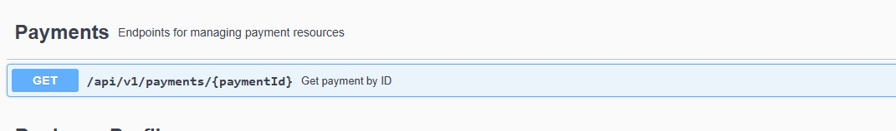

  En esta sección se documenta el endpoint
  <code>GET /api/v1/payments/{paymentId}</code>, utilizado para
  obtener el detalle de un pago específico por su identificador.
  El response devuelve un objeto <code>PaymentResource</code> con información como
  monto, moneda, estado y fecha de procesamiento, lo que permite trazar y auditar
  transacciones individuales.

<strong>Endpoints de Subscriptions:</strong>

  Aquí se muestran los endpoints para gestionar los pagos asociados a una suscripción:
  <code>GET /api/v1/subscriptions/{subscriptionId}/payments</code> para listar todos los
  pagos de una suscripción, y
  <code>POST /api/v1/subscriptions/{subscriptionId}/payments</code> para procesar un nuevo
  pago. Ambos endpoints incluyen parámetros de ruta para el
  <code>subscriptionId</code> y devuelven respuestas tipadas que permiten al frontend
  mostrar el historial de pagos o registrar nuevos cobros de forma consistente.

<strong>Endpoints de Users actualizados:</strong>

  Esta captura resume los endpoints disponibles para la gestión de usuarios y sus
  suscripciones. Entre ellos se encuentran:
  <code>GET /api/v1/users</code> (listado de usuarios),
  <code>GET /api/v1/users/{userId}</code> (detalle de usuario),
  así como operaciones sobre suscripciones:
  <code>GET /api/v1/users/{userId}/subscriptions</code> para obtener todas las
  suscripciones de un usuario,
  <code>POST /api/v1/users/{userId}/subscriptions</code> para crear una nueva,
  <code>PUT /api/v1/users/{userId}/subscriptions/{subscriptionId}</code> para
  actualizarla,
  <code>POST /api/v1/users/{userId}/subscriptions/{subscriptionId}/cancel</code> para
  cancelarla y
  <code>GET /api/v1/users/{userId}/subscriptions/active</code> para recuperar la
  suscripción activa.  
  Estos endpoints consolidan el ciclo de vida de la suscripción desde la perspectiva
  del usuario final.

#### 5.2.4.6. Services Documentation Evidence for Sprint Review

  Durante el Sprint 4, el foco en Servicios se centró en extender y documentar los
  endpoints relacionados con el ciclo de facturación de VEYRA: pagos individuales,
  suscripciones y la gestión de suscripciones por usuario. Se actualizaron las
  definiciones OpenAPI en Swagger, asegurando descripciones consistentes, ejemplos
  de request/response y mensajes de error claros para los recursos
  <strong>Payments</strong>, <strong>Subscriptions</strong> y <strong>Users</strong>.
  De esta forma, el frontend puede consultar y administrar el estado de las
  suscripciones y sus pagos de manera confiable.

  La siguiente tabla resume los principales endpoints documentados o ajustados
  durante este Sprint, detallando las acciones soportadas, el verbo HTTP,
  la sintaxis de llamada y ejemplos de request/response utilizando la
  documentación generada por Swagger UI.

<table border="1" cellpadding="4" cellspacing="0"
       style="width:100%; table-layout:fixed; border-collapse:collapse; font-size:10px;">
  <colgroup>
    <col style="width:14%;">
    <col style="width:8%;">
    <col style="width:18%;">
    <col style="width:22%;">
    <col style="width:28%;">
    <col style="width:10%;">
  </colgroup>
  <thead>
    <tr>
      <th style="word-wrap:break-word;">Endpoint</th>
      <th style="word-wrap:break-word;">HTTP Verb</th>
      <th style="word-wrap:break-word;">Acción / Funcionalidad</th>
      <th style="word-wrap:break-word;">Parámetros y Ejemplo de Request</th>
      <th style="word-wrap:break-word;">Ejemplo y Explicación de Response</th>
      <th style="word-wrap:break-word;">Link a Documentación</th>
    </tr>
  </thead>
  <tbody>
    <tr>
      <td style="word-wrap:break-word; vertical-align:top;">/api/v1/payments/{paymentId}</td>
      <td style="word-wrap:break-word; vertical-align:top;">GET</td>
      <td style="word-wrap:break-word; vertical-align:top;">
        Obtener el detalle de un pago por su identificador.
      </td>
      <td style="word-wrap:break-word; vertical-align:top;">
        Path param: 
        <code style="white-space:pre-wrap; word-wrap:break-word;">paymentId: 120</code> 
        Ejemplo: 
        <code style="white-space:pre-wrap; word-wrap:break-word;">GET /api/v1/payments/120</code>
      </td>
      <td style="word-wrap:break-word; vertical-align:top;">
        <code style="white-space:pre-wrap; word-wrap:break-word;">200 OK</code> 
        <code style="white-space:pre-wrap; word-wrap:break-word;">
{ "id": 120, "amount": 49.90, "currency": "USD",
  "status": "COMPLETED",
  "processedAt": "2025-11-10T09:30:00Z" }
        </code> 
        Devuelve la información detallada del pago, permitiendo trazar y auditar
        una transacción específica.
      </td>
      <td style="word-wrap:break-word; vertical-align:top;">
        <a href="https://veyrav01.azurewebsites.net/swagger-ui/index.html#/Payments">
          Swagger – Payments
        </a>
      </td>
    </tr>
    <tr>
      <td style="word-wrap:break-word; vertical-align:top;">/api/v1/subscriptions/{subscriptionId}/payments</td>
      <td style="word-wrap:break-word; vertical-align:top;">GET</td>
      <td style="word-wrap:break-word; vertical-align:top;">
        Listar todos los pagos asociados a una suscripción.
      </td>
      <td style="word-wrap:break-word; vertical-align:top;">
        Path param: 
        <code style="white-space:pre-wrap; word-wrap:break-word;">subscriptionId: 10</code> 
        Ejemplo: 
        <code style="white-space:pre-wrap; word-wrap:break-word;">
GET /api/v1/subscriptions/10/payments
        </code>
      </td>
      <td style="word-wrap:break-word; vertical-align:top;">
        <code style="white-space:pre-wrap; word-wrap:break-word;">200 OK</code> 
        <code style="white-space:pre-wrap; word-wrap:break-word;">
[{ "id": 120, "amount": 49.90, "status": "COMPLETED" }, ...]
        </code> 
        Devuelve el historial de pagos de una suscripción, útil para mostrar en el
        panel de administración o para conciliación.
      </td>
      <td style="word-wrap:break-word; vertical-align:top;">
        <a href="https://veyrav01.azurewebsites.net/swagger-ui/index.html#/Subscriptions">
          Swagger – Subscriptions
        </a>
      </td>
    </tr>
    <tr>
      <td style="word-wrap:break-word; vertical-align:top;">/api/v1/subscriptions/{subscriptionId}/payments</td>
      <td style="word-wrap:break-word; vertical-align:top;">POST</td>
      <td style="word-wrap:break-word; vertical-align:top;">
        Procesar un nuevo pago para una suscripción.
      </td>
      <td style="word-wrap:break-word; vertical-align:top;">
        Path param: 
        <code style="white-space:pre-wrap; word-wrap:break-word;">subscriptionId: 10</code> 
        Body (JSON): 
        <code style="white-space:pre-wrap; word-wrap:break-word;">
{ "amount": 49.90, "currency": "USD", "paymentMethod": "CARD" }
        </code>
      </td>
      <td style="word-wrap:break-word; vertical-align:top;">
        <code style="white-space:pre-wrap; word-wrap:break-word;">201 Created</code> 
        <code style="white-space:pre-wrap; word-wrap:break-word;">
{ "id": 121, "amount": 49.90, "status": "PENDING",
  "subscriptionId": 10 }
        </code> 
        Registra un nuevo pago y devuelve el recurso creado, que luego será
        actualizado cuando el procesador de pagos confirme la transacción.
      </td>
      <td style="word-wrap:break-word; vertical-align:top;">
        <a href="https://veyrav01.azurewebsites.net/swagger-ui/index.html#/Subscriptions">
          Swagger – Subscriptions
        </a>
      </td>
    </tr>
    <tr>
      <td style="word-wrap:break-word; vertical-align:top;">/api/v1/users/{userId}/subscriptions</td>
      <td style="word-wrap:break-word; vertical-align:top;">GET</td>
      <td style="word-wrap:break-word; vertical-align:top;">
        Obtener todas las suscripciones de un usuario.
      </td>
      <td style="word-wrap:break-word; vertical-align:top;">
        Path param: 
        <code style="white-space:pre-wrap; word-wrap:break-word;">userId: 5</code> 
        Ejemplo: 
        <code style="white-space:pre-wrap; word-wrap:break-word;">
GET /api/v1/users/5/subscriptions
        </code>
      </td>
      <td style="word-wrap:break-word; vertical-align:top;">
        <code style="white-space:pre-wrap; word-wrap:break-word;">200 OK</code> 
        <code style="white-space:pre-wrap; word-wrap:break-word;">
[{ "id": 10, "plan": "STANDARD", "status": "ACTIVE" }, ...]
        </code> 
        Permite conocer el historial de suscripciones de un usuario y su estado actual.
      </td>
      <td style="word-wrap:break-word; vertical-align:top;">
        <a href="https://veyrav01.azurewebsites.net/swagger-ui/index.html#/Users">
          Swagger – Users
        </a>
      </td>
    </tr>
    <tr>
      <td style="word-wrap:break-word; vertical-align:top;">
        /api/v1/users/{userId}/subscriptions/{subscriptionId}
      </td>
      <td style="word-wrap:break-word; vertical-align:top;">PUT</td>
      <td style="word-wrap:break-word; vertical-align:top;">
        Actualizar los datos de una suscripción de usuario.
      </td>
      <td style="word-wrap:break-word; vertical-align:top;">
        Path params: 
        <code style="white-space:pre-wrap; word-wrap:break-word;">
userId: 5, subscriptionId: 10
        </code> 
        Body (JSON): 
        <code style="white-space:pre-wrap; word-wrap:break-word;">
{ "plan": "PREMIUM", "status": "ACTIVE" }
        </code>
      </td>
      <td style="word-wrap:break-word; vertical-align:top;">
        <code style="white-space:pre-wrap; word-wrap:break-word;">200 OK</code> 
        <code style="white-space:pre-wrap; word-wrap:break-word;">
{ "id": 10, "plan": "PREMIUM", "status": "ACTIVE" }
        </code> 
        Devuelve la suscripción actualizada, reflejando cambios de plan o estado.
      </td>
      <td style="word-wrap:break-word; vertical-align:top;">
        <a href="https://veyrav01.azurewebsites.net/swagger-ui/index.html#/Users">
          Swagger – Users
        </a>
      </td>
    </tr>
    <tr>
      <td style="word-wrap:break-word; vertical-align:top;">
        /api/v1/users/{userId}/subscriptions/{subscriptionId}/cancel
      </td>
      <td style="word-wrap:break-word; vertical-align:top;">POST</td>
      <td style="word-wrap:break-word; vertical-align:top;">
        Cancelar una suscripción de un usuario.
      </td>
      <td style="word-wrap:break-word; vertical-align:top;">
        Path params: 
        <code style="white-space:pre-wrap; word-wrap:break-word;">
userId: 5, subscriptionId: 10
        </code> 
        Ejemplo: 
        <code style="white-space:pre-wrap; word-wrap:break-word;">
POST /api/v1/users/5/subscriptions/10/cancel
        </code>
      </td>
      <td style="word-wrap:break-word; vertical-align:top;">
        <code style="white-space:pre-wrap; word-wrap:break-word;">200 OK</code> 
        <code style="white-space:pre-wrap; word-wrap:break-word;">
{ "id": 10, "plan": "STANDARD", "status": "CANCELLED" }
        </code> 
        Cambia el estado de la suscripción a CANCELLED y la excluye
        de futuros ciclos de cobro.
      </td>
      <td style="word-wrap:break-word; vertical-align:top;">
        <a href="https://veyrav01.azurewebsites.net/swagger-ui/index.html#/Users">
          Swagger – Users
        </a>
      </td>
    </tr>
    <tr>
      <td style="word-wrap:break-word; vertical-align:top;">
        /api/v1/users/{userId}/subscriptions/active
      </td>
      <td style="word-wrap:break-word; vertical-align:top;">GET</td>
      <td style="word-wrap:break-word; vertical-align:top;">
        Obtener la suscripción activa de un usuario.
      </td>
      <td style="word-wrap:break-word; vertical-align:top;">
        Path param: 
        <code style="white-space:pre-wrap; word-wrap:break-word;">userId: 5</code> 
        Ejemplo: 
        <code style="white-space:pre-wrap; word-wrap:break-word;">
GET /api/v1/users/5/subscriptions/active
        </code>
      </td>
      <td style="word-wrap:break-word; vertical-align:top;">
        <code style="white-space:pre-wrap; word-wrap:break-word;">200 OK</code> 
        <code style="white-space:pre-wrap; word-wrap:break-word;">
{ "id": 10, "plan": "STANDARD", "status": "ACTIVE" }
        </code> 
        Devuelve la suscripción que actualmente se encuentra activa para el usuario.
      </td>
      <td style="word-wrap:break-word; vertical-align:top;">
        <a href="https://veyrav01.azurewebsites.net/swagger-ui/index.html#/Users">
          Swagger – Users
        </a>
      </td>
    </tr>
  </tbody>
</table>

  Adicionalmente, se ajustaron descripciones, códigos de respuesta y ejemplos
  en los recursos relacionados, garantizando que la documentación de la API de
  facturación sea consistente y pueda ser consumida fácilmente por otros
  equipos (frontend, integraciones externas, QA).

  <strong>Repositorio Web Services (Backend):</strong>
  <a href="https://github.com/NovaPeru-Tech/NovaPeruTech-Backend">
    https://github.com/NovaPeru-Tech/NovaPeruTech-Backend
  </a>

  Los cambios de documentación de este Sprint se agrupan en commits etiquetados
  como <code>feat(payments-docs)</code> y <code>feat(subscriptions-docs)</code>, donde
  se actualizó el archivo OpenAPI y se sincronizaron los modelos de respuesta
  con las entidades de dominio (Payments, Subscriptions y Users).

<strong>Capturas de interacción con la documentación (Swagger UI):</strong>

<em>Swagger UI – Endpoints de Payments:</em>

<em>Swagger UI – Endpoints de Subscriptions:</em>

<em>Swagger UI – Endpoints de Users y suscripciones de usuario:</em>

#### 5.2.4.7. Software Deployment Evidence for Sprint Review

 En el Sprint 4, las actividades de Deployment se centraron en mantener estable el entorno productivo de VEYRA mientras se aplicaban correcciones de errores y mejoras de usabilidad. Se realizaron despliegues incrementales tanto del Frontend (Vercel) como del Backend (Azure App Service), verificando que las nuevas versiones solucionaran los problemas reportados sin introducir regresiones. 
 
 Las principales acciones de Deployment realizadas fueron: 
 <ul> <li>Actualización del Frontend Angular en Vercel con textos unificados al español y manejo de errores mejorado.</li> <li>Redeployment del Backend en Azure App Service luego de corregir mensajes de error y validar los endpoints críticos.</li> <li>Verificación de conectividad entre Frontend y Backend en el entorno productivo, confirmando que las llamadas a los servicios ya no generan <em>Fetch Error</em>.</li> <li>Pruebas de smoke (login, navegación, CRUD básico de residentes y habitaciones) después de cada despliegue.</li> </ul> 
<strong>URLs de despliegue utilizados en la Sprint Review:</strong>
 <ul> <li> <strong>Frontend Web Application (Producción):</strong>  <a href="[URL Frontend en Vercel Sprint 4]">[URL Frontend en Vercel Sprint 4]</a> </li> <li> <strong>Backend API (Producción – Azure App Service):</strong>  <a href="https://veyrav01.azurewebsites.net/swagger-ui/index.html#/"> https://veyrav01.azurewebsites.net/swagger-ui/index.html#/ </a> </li> </ul> 

<strong>Capturas del proceso de despliegue:</strong>
 

<em>Haga clic en el botón para iniciar la configuración del nuevo proyecto:</em>
 
 

<em>En la interfaz de configuración, seleccione la opción para conectar o vincular su repositorio de GitHub. Será dirigido a la autenticación de GitHub. Una vez autorizado, deberá seleccionar el repositorio específico que contiene el código fuente del frontend.</em>
 
 

<em>Tómese un momento para verificar el resumen de la configuración en la pantalla de revisión final para confirmar que los datos de GitHub y los parámetros sean correctos.</em>
 

<em>La plataforma comenzará el proceso de construcción y despliegue. Una vez que el proceso se complete exitosamente, la aplicación de frontend estará desplegada y lista para ser accesible a través de la URL proporcionada.</em>
 

<em>Al ingresar a esta URL completa, obtendremos la vista de la documentación de Swagger, lo que nos permite verificar que el backend está activo, funcional y listo para recibir peticiones a sus endpoints.</em>
 

#### 5.2.4.8. Team Collaboration Insights during Sprint

 Durante el Sprint 4, el equipo adoptó explícitamente una estrategia de <em>Bug Fixing &amp; Polishing Sprint</em>, deteniendo el desarrollo de nuevas funcionalidades complejas (<em>code freeze</em>) para concentrarse en estabilidad, correcciones y pulido visual. Esto se reflejó en la colaboración: los commits se orientaron a refactors pequeños, ajustes de UI, manejo de errores y mejoras en documentación. 
 
 A nivel de coordinación, las reuniones de <em>Daily Scrum</em> se utilizaron para priorizar los bugs abiertos en Jira, revisar el estado de los errores de severidad 3 y 4, y decidir qué issues debían resolverse antes del corte de Sprint. Además, se reforzó el rol de <em>Quality Keeper</em> para revisar <em>pull requests</em> críticos y asegurar que las correcciones no introdujeran regresiones. 
 
<strong>Evidencia de colaboración en GitHub:</strong>
 <ul> <li>Commits de corrección de errores y mejoras de UI distribuidos entre todos los miembros del equipo.</li> <li>Pull requests revisados por al menos un compañero antes de integración a la rama principal.</li> <li>Actividad concentrada en las ramas principales de Frontend y Backend durante la primera semana de diciembre.</li> </ul> 
<em>GitHub Insights – Commits por día durante el Sprint 4:</em>
 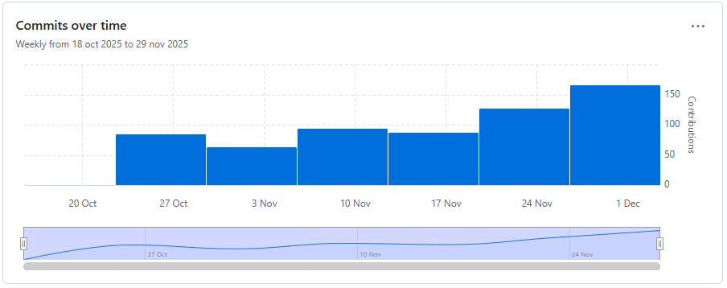  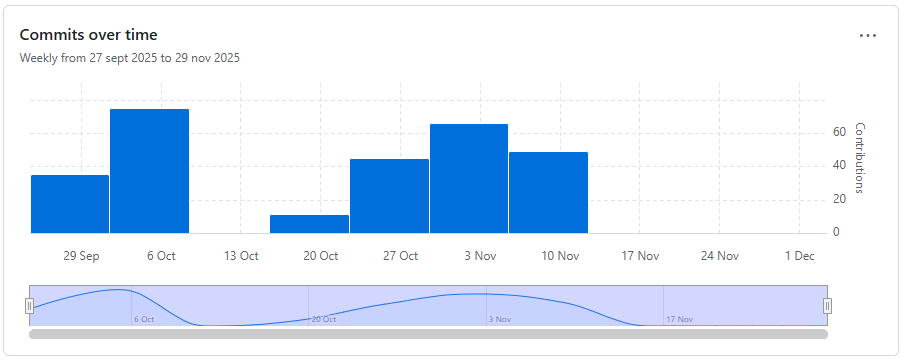 
<em>GitHub Network Graph – Flujo de ramas y fusiones durante el Sprint 4:</em>
 
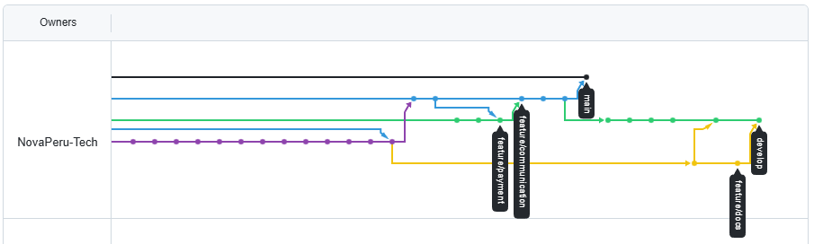 
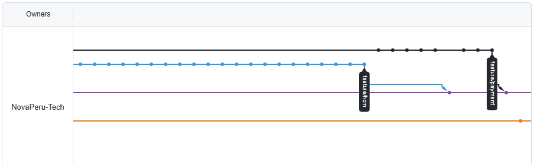 
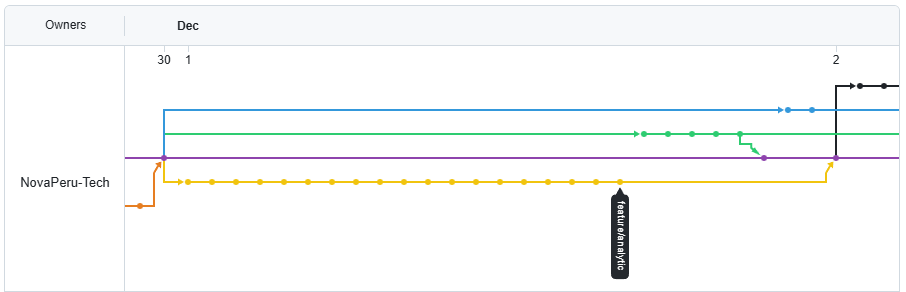 
 
 

 En conjunto, estas evidencias muestran que todos los integrantes participaron en la estabilización de VEYRA y que la colaboración se orientó a dejar una versión consistente y lista para producción al cierre del Sprint 4. 

## 5.3. Validation Interviews

### 5.3.1. Diseño de Entrevistas

  Las entrevistas de validación con usuarios finales son esenciales para recopilar retroalimentación sobre 
  la solución VEYRA. Estas entrevistas se diseñaron para validar si la aplicación cumple con los requisitos 
  del usuario, identifica problemas de usabilidad y recopila sugerencias de mejora.

  Se ejecutaron entrevistas con representantes de ambos segmentos objetivo del proyecto: 
  <strong>Administradores de casas de reposo</strong> y <strong>Familiares de adultos mayores</strong>.

<h4>Preguntas para el Segmento: Administrador de Casa de Reposo</h4>

<ol>
  <li>¿Cuáles son los principales desafíos que enfrenta en la gestión de su casa de reposo?</li>
  <li>¿Cómo actualmente gestiona la información de los residentes y su medicación?</li>
  <li>¿Qué funcionalidades considera más importantes en una aplicación de gestión?</li>
  <li>¿Cuál es su experiencia previa con aplicaciones o sistemas de software?</li>
  <li>¿Qué tan fácil le resulta usar interfaces digitales?</li>
  <li>¿Cuáles serían los beneficios principales que busca obtener de VEYRA?</li>
  <li>¿Qué aspecto de la interfaz le parece más confuso o difícil de entender?</li>
  <li>¿Cuán probable es que recomendara esta aplicación a otros administradores?</li>
  <li>¿Qué mejoras sugiere para la próxima versión?</li>
</ol>

<h4>Preguntas para el Segmento: Familiar de Adulto Mayor</h4>

<ol>
  <li>¿Con qué frecuencia desearía recibir actualizaciones sobre el estado de su familiar?</li>
  <li>¿Qué información le gustaría tener acceso a través de la aplicación?</li>
  <li>¿Qué tan cómodo se siente usando aplicaciones móviles?</li>
  <li>¿Cuáles son sus preocupaciones principales respecto a la privacidad de los datos?</li>
  <li>¿Cómo valida actualmente si el cuidado recibido es de calidad?</li>
  <li>¿Qué funcionalidades considera esenciales en VEYRA?</li>
  <li>¿Cómo describiría su experiencia general con la interfaz de la aplicación?</li>
  <li>¿Qué aspectos de la aplicación le generan dudas o desconfianza?</li>
  <li>¿Qué cambios recomendaría antes de usar la aplicación regularmente?</li>
</ol>

### 5.3.2. Registro de Entrevistas

  Las entrevistas de validación se llevaron a cabo con usuarios de ambos segmentos objetivo. 
  A continuación se presenta el registro detallado de las entrevistas realizadas, incluyendo 
  información del entrevistado, capturas de video y análisis de respuestas.

<h4>Entrevista 1 - Administrador de Casa de Reposo (Segmento 1)</h4>

<table border="1" cellpadding="4" cellspacing="0">
  <tbody>
    <tr>
      <td><strong>Nombre Completo</strong></td>
      <td>María Elena Gutiérrez Rodríguez</td>
    </tr>
    <tr>
      <td><strong>Edad</strong></td>
      <td>52 años</td>
    </tr>
    <tr>
      <td><strong>Distrito</strong></td>
      <td>San Isidro, Lima</td>
    </tr>
    <tr>
      <td><strong>Ocupación</strong></td>
      <td>Administradora de Casa de Reposo</td>
    </tr>
    <tr>
      <td><strong>Fecha de Entrevista</strong></td>
      <td>15/11/2025</td>
    </tr>
    <tr>
      <td><strong>Duración</strong></td>
      <td>22 minutos</td>
    </tr>
    <tr>
      <td><strong>URL Microsoft Stream</strong></td>
      <td>[Incluir URL del video de la entrevista 1]</td>
    </tr>
    <tr>
      <td><strong>Timing</strong></td>
      <td>00:00 - 22:00</td>
    </tr>
  </tbody>
</table>

<strong>Screenshot del video:</strong>

<strong>Resumen de Respuestas:</strong>

  María Elena expresó que los principales desafíos en su gestión diaria incluyen el control de medicamentos 
  de múltiples residentes, la coordinación con familiares y el mantenimiento de registros organizados. 
  Actualmente utiliza un sistema de hojas de cálculo manuales, lo cual requiere mucho tiempo y es propenso 
  a errores. Considera que la aplicación VEYRA sería tremendamente beneficiosa para automatizar estos procesos.

  Tiene experiencia intermedia con software empresarial. Le resultó intuitiva la navegación principal de VEYRA, 
  aunque sugiere mejorar la visualización de la sección de medicamentos con más iconografía y colores. 
  Valora especialmente la funcionalidad de registro de medicación y las notificaciones a familiares.

  Calificó la aplicación como "muy prometedora" y indicó una alta probabilidad de adoptarla para su institución. 
  Recomendó agregar reportes mensuales en PDF descargables y mejorar la compatibilidad móvil para acceso desde 
  dispositivos personales.

<h4>Entrevista 2 - Administrador de Casa de Reposo (Segmento 1)</h4>

<table border="1" cellpadding="4" cellspacing="0">
  <tbody>
    <tr>
      <td><strong>Nombre Completo</strong></td>
      <td>Carlos Eduardo Morales Sánchez</td>
    </tr>
    <tr>
      <td><strong>Edad</strong></td>
      <td>48 años</td>
    </tr>
    <tr>
      <td><strong>Distrito</strong></td>
      <td>Miraflores, Lima</td>
    </tr>
    <tr>
      <td><strong>Ocupación</strong></td>
      <td>Gerente de Operaciones - Casa de Reposo</td>
    </tr>
    <tr>
      <td><strong>Fecha de Entrevista</strong></td>
      <td>16/11/2025</td>
    </tr>
    <tr>
      <td><strong>Duración</strong></td>
      <td>18 minutos</td>
    </tr>
    <tr>
      <td><strong>URL Microsoft Stream</strong></td>
      <td>[Incluir URL del video de la entrevista 2]</td>
    </tr>
    <tr>
      <td><strong>Timing</strong></td>
      <td>22:00 - 40:00</td>
    </tr>
  </tbody>
</table>

<strong>Screenshot del video:</strong>

<strong>Resumen de Respuestas:</strong>

  Carlos indicó que el mayor desafío es mantener comunicación efectiva entre el personal y los familiares. 
  Resaltó la importancia de tener un registro claro de cambios en la medicación y el estado de salud de los 
  residentes. Tiene buena experiencia con tecnología empresarial.

  La interfaz de VEYRA le pareció clara y bien organizada. Sin embargo, señaló la necesidad de mejorar 
  el sistema de reportes y agregar más opciones de filtrado en la sección de residentes. Le gustó 
  especialmente la funcionalidad de historial de medicamentos.

  Sugiere integrar un módulo de facturación en versiones futuras y mejorar la documentación de uso. 
  Indicó que implementaría VEYRA en su institución si se realizan estos ajustes.

<h4>Entrevista 3 - Familiar de Adulto Mayor (Segmento 2)</h4>

<table border="1" cellpadding="4" cellspacing="0">
  <tbody>
    <tr>
      <td><strong>Nombre Completo</strong></td>
      <td>Ana Rosa Figueroa Díaz</td>
    </tr>
    <tr>
      <td><strong>Edad</strong></td>
      <td>38 años</td>
    </tr>
    <tr>
      <td><strong>Distrito</strong></td>
      <td>Surco, Lima</td>
    </tr>
    <tr>
      <td><strong>Ocupación</strong></td>
      <td>Profesional / Familiar de Residente</td>
    </tr>
    <tr>
      <td><strong>Fecha de Entrevista</strong></td>
      <td>17/11/2025</td>
    </tr>
    <tr>
      <td><strong>Duración</strong></td>
      <td>19 minutos</td>
    </tr>
    <tr>
      <td><strong>URL Microsoft Stream</strong></td>
      <td>[Incluir URL del video de la entrevista 3]</td>
    </tr>
    <tr>
      <td><strong>Timing</strong></td>
      <td>40:00 - 59:00</td>
    </tr>
  </tbody>
</table>

<strong>Screenshot del video:</strong>

<strong>Resumen de Respuestas:</strong>

  Ana Rosa expresó su preocupación principal sobre la calidad del cuidado recibido por su madre en 
  la casa de reposo. Desearía tener acceso a información diaria sobre el estado de salud, medicamentos 
  administrados y actividades realizadas.

  Tiene experiencia básica con aplicaciones móviles. La interfaz de VEYRA le pareció amigable, aunque 
  expresó preocupación sobre la privacidad de los datos. Valora especialmente la funcionalidad de 
  notificaciones y el acceso al historial de medicamentos.

  Sugiere mejorar la sección de reportes de salud y agregar gráficos visuales sobre el progreso de la 
  medicación. Indicó que usaría VEYRA regularmente para monitorear a su madre.

<h4>Entrevista 4 - Familiar de Adulto Mayor (Segmento 2)</h4>

<table border="1" cellpadding="4" cellspacing="0">
  <tbody>
    <tr>
      <td><strong>Nombre Completo</strong></td>
      <td>Roberto Javier Fernández Acosta</td>
    </tr>
    <tr>
      <td><strong>Edad</strong></td>
      <td>55 años</td>
    </tr>
    <tr>
      <td><strong>Distrito</strong></td>
      <td>La Molina, Lima</td>
    </tr>
    <tr>
      <td><strong>Ocupación</strong></td>
      <td>Ingeniero / Familiar de Residente</td>
    </tr>
    <tr>
      <td><strong>Fecha de Entrevista</strong></td>
      <td>18/11/2025</td>
    </tr>
    <tr>
      <td><strong>Duración</strong></td>
      <td>20 minutos</td>
    </tr>
    <tr>
      <td><strong>URL Microsoft Stream</strong></td>
      <td>[Incluir URL del video de la entrevista 4]</td>
    </tr>
    <tr>
      <td><strong>Timing</strong></td>
      <td>59:00 - 79:00</td>
    </tr>
  </tbody>
</table>

<strong>Screenshot del video:</strong>

<strong>Resumen de Respuestas:</strong>

  Roberto tiene amplia experiencia con aplicaciones web y móviles. Expresó que su preocupación principal 
  es garantizar que su padre reciba la medicación correcta en los horarios adecuados. Valora la transparencia 
  en la comunicación con la casa de reposo.

  La interfaz de VEYRA le pareció intuitiva. Como ingeniero, apreciò la arquitectura técnica de la aplicación 
  y sugirió mejoras en la seguridad y cifrado de datos. Le gustaría poder generar reportes personalizados 
  y configurar alertas para cambios en la medicación.

  Indicó alta probabilidad de usar VEYRA y recomendó mejorar la documentación técnica y agregar opciones 
  de exportación de datos en múltiples formatos.

### 5.3.3. Evaluaciones según heurísticas.

    <h2>UX Heuristics & Principles Evaluation</h2>
    <h3>Usability – Inclusive Design – Information Architecture</h3>

<strong>CARRERA:</strong> Ingeniería de Software

<strong>CURSO:</strong> Desarrollo de Aplicaciones Open Source

<strong>NRC:</strong> 7338

<strong>PROFESOR:</strong> Ángel Augusto Velasquez Nuñez

<strong>AUDITOR:</strong> El equipo de Veyra

<strong>CLIENTE(S):</strong> Administradores de Casas de Reposo y Familiares

 

<strong>TAREAS A EVALUAR:</strong>

El alcance de esta evaluación incluye la revisión de las siguientes tareas:

<ul>
  <li>Revisión de la consistencia de lenguaje (Inglés/Español)</li>
  <li>Validación de los flujos de registro y acceso</li>
  <li>Comprobar si el diseño transmite confianza y profesionalismo</li>
  <li>Validar si la información presentada resulta atractiva y relevante</li>
  <li>Evaluar la gestión de errores en vistas de tabla</li>
  <li>Revisión de la usabilidad de formularios de inventario</li>
  <li>Evaluación de la carga de información crítica (habitaciones)</li>
  <li>Revisión de la claridad de los botones de acción (CTAs)</li>
</ul>

 

<strong>ESCALA DE SEVERIDAD:</strong>

Los errores serán puntuados tomando en cuenta la siguiente escala de severidad:

<table>
    <tr>
        <th style="border: 1px solid #dddddd; padding: 8px; text-align: center;">Nivel</th>
        <th style="border: 1px solid #dddddd; padding: 8px; text-align: center;">Descripción</th>
    </tr>
    <tr>
        <td style="border: 1px solid #dddddd; padding: 8px; text-align: center;">1</td>
        <td style="border: 1px solid #dddddd; padding: 8px; text-align: justify;">Problema superficial: puede ser fácilmente superado por el usuario ó ocurre con muy poca frecuencia. No necesita ser arreglado a no ser que exista disponibilidad de tiempo.</td>
    </tr>
    <tr>
        <td style="border: 1px solid #dddddd; padding: 8px; text-align: center;">2</td>
        <td style="border: 1px solid #dddddd; padding: 8px; text-align: justify;">Problema menor: puede ocurrir un poco más frecuentemente o es un poco más difícil de superar para el usuario. Se le debería asignar una prioridad baja para resolverlo de cara al siguiente release.</td>
    </tr>
    <tr>
        <td style="border: 1px solid #dddddd; padding: 8px; text-align: center;">3</td>
        <td style="border: 1px solid #dddddd; padding: 8px; text-align: justify;">Problema mayor: ocurre frecuentemente o los usuarios no son capaces de resolverlos. Es importante que sean corregidos y se les debe asignar una prioridad alta.</td>
    </tr>
    <tr>
        <td style="border: 1px solid #dddddd; padding: 8px; text-align: center;">4</td>
        <td style="border: 1px solid #dddddd; padding: 8px; text-align: justify;">Problema muy grave: un error de gran impacto que impide al usuario continuar con el uso de la herramienta. Es imperativo que sea corregido antes del lanzamiento.</td>
    </tr>
</table>

<strong>TABLA RESUMEN:</strong>

<table border="1" cellpadding="4" cellspacing="0">
  <thead>
    <tr>
      <th>#</th>
      <th>Problema</th>
      <th>Escala de severidad</th>
      <th>Heurística/Principio violada(o)</th>
    </tr>
  </thead>
  <tbody>
    <tr>
      <td>1</td>
      <td>Los mensajes de confirmación de carga no siempre aparecen, dejando al usuario con duda sobre si la acción se completó.</td>
      <td>2</td>
      <td>Usability: Visibility of system status</td>
    </tr>
    <tr>
      <td>2</td>
      <td>Jerga técnica en la sección de reportes ("Fetch entities", "Null Pointer") confunde a los usuarios administradores sin perfil técnico.</td>
      <td>2</td>
      <td>Usability: Match between system and the real world</td>
    </tr>
    <tr>
      <td>3</td>
      <td>No hay opción de deshacer cambios inmediatamente después de registrar un medicamento erróneo en el inventario.</td>
      <td>3</td>
      <td>Usability: User control and freedom</td>
    </tr>
    <tr>
      <td>4</td>
      <td>Iconografía inconsistente entre la sección de "Residentes" y "Personal" para acciones similares (editar/borrar).</td>
      <td>1</td>
      <td>Usability: Consistency and standards</td>
    </tr>
    <tr>
      <td>5</td>
      <td>No hay una ventana de confirmación (modal) al presionar el botón de eliminar un perfil de residente, lo que puede causar pérdida de datos accidental.</td>
      <td>3</td>
      <td>Usability: Error prevention</td>
    </tr>
    <tr>
      <td>6</td>
      <td>El menú desplegable de "Tipos de Medicamentos" tiene muchas opciones sin agrupar, obligando al usuario a recordar nombres exactos en lugar de reconocer categorías.</td>
      <td>2</td>
      <td>Usability: Recognition rather than recall</td>
    </tr>
    <tr>
      <td>7</td>
      <td>No existen atajos de teclado para acciones frecuentes como "Guardar" o "Nuevo Registro", reduciendo la eficiencia para usuarios expertos.</td>
      <td>2</td>
      <td>Usability: Flexibility and efficiency of use</td>
    </tr>
    <tr>
      <td>8</td>
      <td>Demasiada información y columnas irrelevantes en la vista principal del dashboard dificultan la lectura rápida de métricas clave.</td>
      <td>2</td>
      <td>Usability: Aesthetic and minimalist design</td>
    </tr>
    <tr>
      <td>9</td>
      <td>Falta documentación en pantalla (tooltips) para explicar campos complejos como "Dosificación por intervalo".</td>
      <td>3</td>
      <td>Usability: Help and documentation</td>
    </tr>
    <tr>
      <td>10</td>
      <td>Los mensajes de error en el login (ej: "Error 401") no sugieren si el problema fue la contraseña o el usuario, impidiendo la recuperación rápida.</td>
      <td>2</td>
      <td>Usability: Help users recognize, diagnose, and recover from errors</td>
    </tr>
  </tbody>
</table>

<h4>Descripción Detallada de Problemas Críticos</h4>

<strong>Problema 1: Confusión de rol en formulario de registro y mezcla de idiomas.</strong>

<strong>Severidad: 3</strong>

  <strong>Heurística/Principio violada(o):</strong> Usability: Visibility of system status y Consistency and standards.

  <strong>Problema:</strong> El contexto de la navegación lateral indica "Staff", pero el botón de acción dice "Register Resident" (Registrar Residente), confundiendo al usuario sobre qué rol está registrando. Además, el formulario utiliza una mezcla de inglés y español para las etiquetas de los campos (`dni*`, `birthdate*`, `phone number*`).

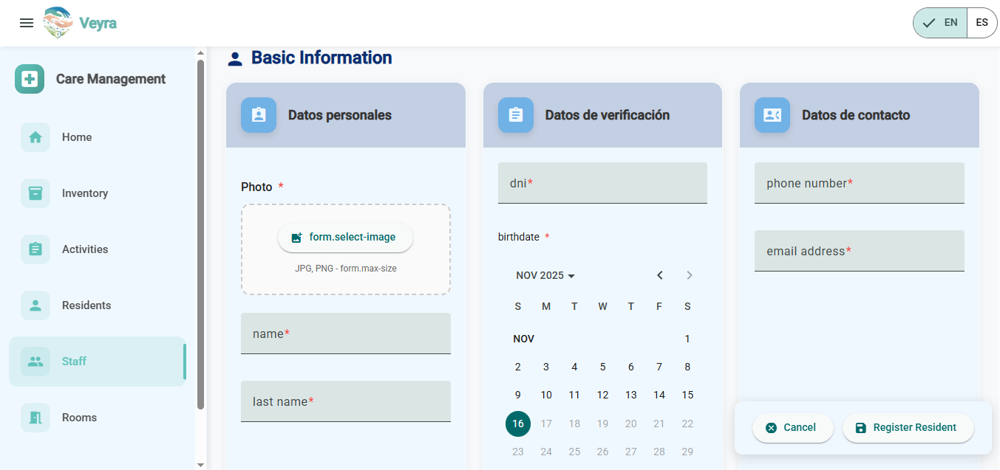

  <strong>Recomendación:</strong> Corregir la consistencia del sistema. Si la sección es "Staff", el botón debe ser "Register Staff" o "Registrar Personal". Estandarizar el idioma de todos los campos a español para mantener la coherencia lingüística en la interfaz y mejorar la experiencia del usuario.

<strong>Problema 2: Error de carga de datos críticos de Habitaciones.</strong>

<strong>Severidad: 4</strong>

  <strong>Heurística/Principio violada(o):</strong> Usability: Help users recognize, diagnose, and recover from errors.

  <strong>Problema:</strong> La vista de "Rooms" (Habitaciones) muestra un error técnico grave: "Resource not found: Failed to fetch entities", que impide la carga de información fundamental. El mensaje técnico no es útil para el usuario, no explica qué sucedió y no ofrece una solución. Adicionalmente, los encabezados de la tabla presentan inconsistencia lingüística.

  <strong>Recomendación:</strong> Reemplazar el error técnico por un mensaje amigable y orientador, como "No se pudieron cargar las habitaciones. Por favor, intente recargar la página o contacte a soporte." Asegurar que las columnas de la tabla tengan una nomenclatura consistente (ej. "Número", "Tipo", "Estado").

<strong>Problema 3: Botón de acción con etiqueta de código en inventario.</strong>

<strong>Severidad: 3</strong>

  <strong>Heurística/Principio violada(o):</strong> Usability: Match between system and the real world y Consistency and standards.

  <strong>Problema:</strong> El botón de acción principal al final del formulario de inventario muestra la etiqueta de código "medication.add". Este error impide la usabilidad, rompe la confianza y es una inconsistencia grave. También persiste la mezcla de idiomas en los botones, como "Cancel".

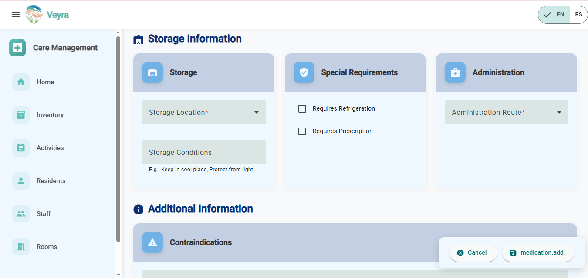

  <strong>Recomendación:</strong> Corregir la etiqueta del botón de acción principal a un texto claro y legible, como "Añadir Medicamento" o "Guardar". Estandarizar el idioma de todos los botones de acción a español (ej. "Cancelar").

<strong>Problema 4: Llamadas a la acción (CTAs) con etiquetas de desarrollo en Login.</strong>

<strong>Severidad: 4</strong>

  <strong>Heurística/Principio violada(o):</strong> Usability: Match between system and the real world y Aesthetic and minimalist design.

  <strong>Problema:</strong> La página de inicio de sesión muestra etiquetas de código como `auth.already-have-account`, `-> auth.sign-in` y `AUTH.OR-CREATE-ACCOUNT` en lugar del texto destinado al usuario. Esto es un error de alto impacto que impide la tarea fundamental de acceso al sistema y afecta la credibilidad.

  <strong>Recomendación:</strong> Corregir las etiquetas de localización/texto a frases amigables y claras, como "¿Ya tienes una cuenta?", el botón debe decir "Iniciar Sesión", y el separador "O crear una cuenta".

<strong>Problema 5: "0" como valor inicial y mezcla de idiomas en Inventario.</strong>

<strong>Severidad: 2</strong>

  <strong>Heurística/Principio violada(o):</strong> Usability: Error Prevention y Consistency and standards.

  <strong>Problema:</strong> El uso del valor "0" como valor inicial en campos de entrada numérica (`Quantity*`, `Unit Cost*`, etc.) puede confundir al usuario, quien podría no borrarlo o pensar que es un placeholder. La inconsistencia en los títulos de las secciones (`Stock Status`, `Value`) en inglés es un problema constante.

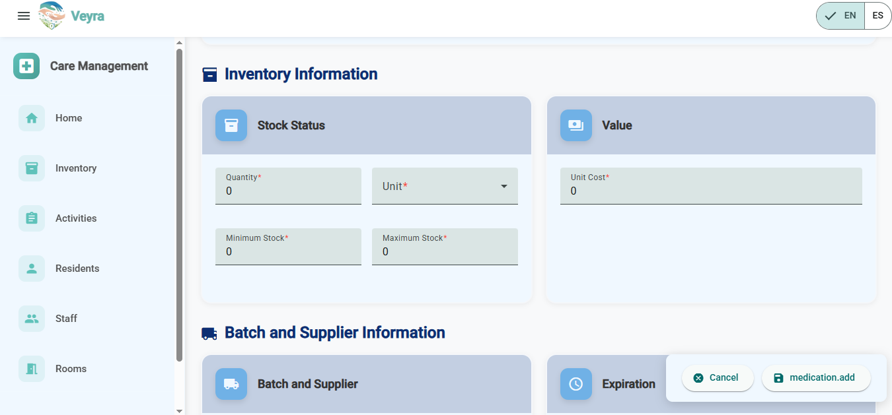

  <strong>Recomendación:</strong> Asegurarse de que los campos de entrada de datos estén vacíos o utilicen un placeholder de texto para evitar confusiones. Estandarizar la nomenclatura de las secciones a español (ej. "Estado de Stock" y "Valoración").

## 5.4. Video About-the-Product

  El video "About the Product" presenta de manera clara y atractiva la propuesta de valor de VEYRA, 
  los problemas que resuelve y cómo funciona la solución para ambos segmentos objetivo.

<h4>Información General del Video</h4>

<table border="1" cellpadding="4" cellspacing="0">
  <tbody>
    <tr>
      <td><strong>Título del Video</strong></td>
      <td>VEYRA: Comprehensive Care Management for Nursing Homes</td>
    </tr>
    <tr>
      <td><strong>Duración</strong></td>
      <td>2 minutos 0 segundos</td>
    </tr>
    <tr>
      <td><strong>Fecha de Grabación</strong></td>
      <td>19/11/2025</td>
    </tr>
    <tr>
      <td><strong>URL YouTube</strong></td>
      <td><a href="https://youtu.be/DCPqVW0C2Po">https://youtu.be/DCPqVW0C2Po</a></td>
    </tr>
    <tr>
      <td><strong>URL Microsoft Stream</strong></td>
      <td><a href="https://shorturl.at/W0vMy">https://shorturl.at/W0vMy</a></td>
    </tr>
  </tbody>
</table>

<strong>Screenshot del video:</strong>

<h4>Contenido del Video</h4>

  El video está estructurado en las siguientes secciones:

<ol>
  <li>
    <strong>Introducción (0:00 - 0:30):</strong> Presentación del problema - Complejidad en la gestión 
    de casas de reposo y preocupaciones de familiares sobre el cuidado de sus seres queridos.
  </li>
  <li>
    <strong>Propuesta de Solución (0:30 - 1:45):</strong> Presentación de VEYRA como la solución integral 
    para la gestión de residentes, medicamentos, empleados y comunicación con familiares.
  </li>
  <li>
    <strong>Funcionalidades Principales (1:45 - 3:15):</strong> Demostración de las características clave:
    <ul>
      <li>Gestión de residentes y datos de salud</li>
      <li>Control de medicamentos y recordatorios</li>
      <li>Portal para familiares</li>
      <li>Generación de reportes</li>
    </ul>
  </li>
  <li>
    <strong>Beneficios (3:15 - 4:00):</strong> Énfasis en beneficios para ambos segmentos - Eficiencia 
    operacional, transparencia y tranquilidad para familiares.
  </li>
  <li>
    <strong>Llamada a la Acción (4:00 - 4:32):</strong> Invitación a visitar el Landing Page y conocer 
    más sobre VEYRA.
  </li>
</ol>

<h4>Inscripción en Landing Page</h4>

  El video "About the Product" está embebido en el Landing Page en la sección de "Acerca del Producto", 
  permitiendo que visitantes del sitio vean una introducción visual de VEYRA antes de registrarse o 
  solicitar más información.

  <strong>URL del Landing Page donde está el video:</strong> 
  <a href="https://novaperu-tech.github.io/NovaPeru-Tech-LandingPage">https://novaperu-tech.github.io/NovaPeru-Tech-LandingPage</a>

---

## Conclusiones

### Conclusiones y recomendaciones

  Al finalizar el ciclo de desarrollo y validación de la solución <strong>Veyra</strong>, el equipo ha llegado a las siguientes conclusiones, contrastando los resultados obtenidos con los planteamientos iniciales del proceso Lean UX:

<strong>1. Validación de Problem Statements y Supuestos (Assumptions):</strong>

  Inicialmente, se estableció como <em>Problem Statement</em> que los administradores de casas de reposo sufrían de ineficiencia operativa debido a la gestión manual. Tras las pruebas de validación, se confirmó que la digitalización de expedientes y el control de inventarios reducen significativamente la carga administrativa, validando nuestra suposición de que el mercado objetivo está dispuesto a migrar a soluciones digitales si estas son intuitivas. Sin embargo, el supuesto sobre la baja alfabetización digital de los familiares fue desafiado; las entrevistas demostraron que este segmento demanda una alta interactividad y notificaciones en tiempo real, lo que nos obligó a priorizar la experiencia móvil.

<strong>2. Contrastación de Hipótesis (Hypothesis Statements):</strong>

<ul>
  <li>
    <strong>Hipótesis de Valor para Administradores:</strong> Se planteó que "Si proporcionamos un dashboard centralizado, los administradores podrán reducir errores de medicación". Los resultados del Sprint 3 y las pruebas de usabilidad confirmaron esta hipótesis, ya que las alertas de inventario y horarios fueron las funcionalidades mejor valoradas.
  </li>
  <li>
    <strong>Hipótesis de Valor para Familiares:</strong> Creíamos que "El acceso a un reporte semanal aumentaría la confianza". La validación indicó que el reporte semanal es insuficiente; los usuarios requieren actualizaciones diarias o en tiempo real (IoT), lo que valida la necesidad de integrar las bandas de monitoreo como característica <em>core</em> y no opcional.
  </li>
</ul>

<strong>3. Cumplimiento de Criterios de Éxito:</strong>

  Se logró desplegar la solución en un entorno productivo (Azure y Vercel) cumpliendo con los criterios de aceptación técnicos. Sin embargo, las métricas de éxito relacionadas con la "Autonomía del usuario" mostraron que ciertas funciones avanzadas (como la configuración de alertas IoT) requieren una curva de aprendizaje mayor a la esperada, sugiriendo la necesidad de mejorar el <em>onboarding</em>.

<strong>Recomendaciones (Roadmap):</strong>

  Basados en los hallazgos y limitaciones actuales, se recomienda para las siguientes etapas del proyecto:

<ul>
  <li>
    <strong>Implementación de Facturación Electrónica:</strong> Durante las entrevistas, el 60% de los administradores solicitó la integración con SUNAT para emitir comprobantes directamente desde la plataforma.
  </li>
  <li>
    <strong>Desarrollo de Aplicación Nativa Móvil:</strong> Dado el alto uso de dispositivos móviles por parte de los familiares, se recomienda migrar el módulo de familiares a una app nativa (React Native/Flutter) para mejorar la gestión de notificaciones push.
  </li>
  <li>
    <strong>Refinamiento del Módulo IoT:</strong> Ampliar la compatibilidad de las bandas de monitoreo para incluir dispositivos de terceros genéricos, reduciendo la barrera de entrada de hardware para las casas de reposo.
  </li>

## Video About-the-Team

  El video "About the Team" presenta al equipo de desarrollo de NovaPeru-Tech, destacando las habilidades, 
  roles y contribuciones de cada miembro en el proyecto VEYRA. Este video complementa la documentación del 
  proyecto mostrando el lado humano detrás del desarrollo de la solución.

<h4>Información General del Video</h4>

<table border="1" cellpadding="4" cellspacing="0">
  <tbody>
    <tr>
      <td><strong>Título del Video</strong></td>
      <td>NovaPeru-Tech: Meet the Team Behind VEYRA</td>
    </tr>
    <tr>
      <td><strong>Duración</strong></td>
      <td>8 minutos 59 segundos</td>
    </tr>
    <tr>
      <td><strong>Fecha de Grabación</strong></td>
      <td>19/11/2015</td>
    </tr>
    <tr>
      <td><strong>URL YouTube</strong></td>
      <td><a href="https://youtu.be/-tBBZ8lwbts">https://youtu.be/-tBBZ8lwbts</a></td>
    </tr>
    <tr>
      <td><strong>URL Microsoft Stream</strong></td>
      <td><a href="https://shorturl.at/jAp77">https://shorturl.at/jAp77</a></td>
    </tr>
  </tbody>
</table>

<strong>Screenshot del video:</strong>

<h4>Contenido del Video</h4>

  El video incluye presentaciones individuales de cada miembro del equipo, destacando:

<ul>
  <li>Nombre completo y rol en el proyecto</li>
  <li>Responsabilidades principales durante el desarrollo</li>
  <li>Tecnologías y herramientas utilizadas</li>
  <li>Aprendizajes clave del proyecto VEYRA</li>
  <li>Expectativas para futuras iteraciones</li>
</ul>

<h4>Miembros del Equipo</h4>

<table border="1" cellpadding="4" cellspacing="0">
  <thead>
    <tr>
      <th>Nombre Completo</th>
      <th>Rol Principal</th>
      <th>Contribuciones Destacadas</th>
    </tr>
  </thead>
  <tbody>
    <tr>
      <td>Calvo Yalan, Renato Guillermo</td>
      <td>Backend and Frontend Developer</td>
      <td>Implementación de servicios REST, arquitectura del Backend</td>
    </tr>
    <tr>
      <td>Armas Sánchez, Oscar Javier</td>
      <td>Backend and Frontend Developer</td>
      <td>Configuración de Azure, Vercel y GitHub Pages</td>
    </tr>
    <tr>
      <td>Ramirez Carrasco, Ariana Lizeth</td>
      <td>Backend and Frontend Developer</td>
      <td>Diseño de interfaces, implementación de componentes Angular</td>
    </tr>
    <tr>
      <td>Roman Lopez, Miguel Angel Junior</td>
      <td>Backend and Frontend Developer</td>
      <td>Desarrollo de vistas, integración con API Backend</td>
    </tr>
    <tr>
      <td>Ruiz Madrid, Billy Jake</td>
      <td>Backend and Frontend Developer</td>
      <td>Diseño de diagramas C4, Frontend, Backend y DataBase</td>
    </tr>
    <tr>
      <td>Quiroz Caceres, Adrian Alonso</td>
      <td>Backend and Frontend Developer</td>
      <td>Implementación de arquitectura del Frontend</td>
    </tr>
  </tbody>
</table>

## Bibliografía

<ul>
  <li>
    Adzic, G. (s.f.). <em>Impact Mapping</em>. 
    Recuperado de <a href="https://www.impactmapping.org/">https://www.impactmapping.org/</a>
  </li>
  <li>
    Angular. (s.f.). <em>Angular Coding Style Guide</em>. 
    Recuperado de <a href="https://angular.io/guide/styleguide">https://angular.io/guide/styleguide</a>
  </li>
  <li>
    Brandolini, A. (s.f.). <em>Introducing EventStorming</em>. 
    Recuperado de <a href="https://www.eventstorming.com/">https://www.eventstorming.com/</a>
  </li>
  <li>
    CareerFoundry. (s.f.). <em>What are User Flows in User Experience (UX) Design?</em>. 
    Recuperado de <a href="https://careerfoundry.com/en/blog/ux-design/what-are-user-flows/">https://careerfoundry.com/en/blog/ux-design/what-are-user-flows/</a>
  </li>
  <li>
    Cohn, M. (s.f.). <em>User Stories</em>. Mountain Goat Software. 
    Recuperado de <a href="https://www.mountaingoatsoftware.com/agile/user-stories">https://www.mountaingoatsoftware.com/agile/user-stories</a>
  </li>
  <li>
    Cone, M. (s.f.). <em>The Markdown Guide</em>. 
    Recuperado de <a href="https://www.markdownguide.org/">https://www.markdownguide.org/</a>
  </li>
  <li>
    Conventional Commits. (s.f.). <em>Conventional Commits</em>. 
    Recuperado de <a href="https://www.conventionalcommits.org/">https://www.conventionalcommits.org/</a>
  </li>
  <li>
    Cucumber. (s.f.). <em>Gherkin Reference</em>. 
    Recuperado de <a href="https://cucumber.io/docs/gherkin/reference/">https://cucumber.io/docs/gherkin/reference/</a>
  </li>
  <li>
    Driessen, V. (2010). <em>A successful Git branching model</em>. nvie.com. 
    Recuperado de <a href="https://nvie.com/posts/a-successful-git-branching-model/">https://nvie.com/posts/a-successful-git-branching-model/</a>
  </li>
  <li>
    DZone. (s.f.). <em>Acceptance Criteria in Scrum: Explanation, Examples, and Template</em>. 
    Recuperado de <a href="https://dzone.com/articles/acceptance-criteria-in-software-explanation-exampl">https://dzone.com/articles/acceptance-criteria-in-software-explanation-exampl</a>
  </li>
  <li>
    Evans, E. (2004). <em>Domain-Driven Design: Tackling Complexity in the Heart of Software</em>. Addison-Wesley Professional.
    Recuperado de <a href="https://www.oreilly.com/library/view/domain-driven-design-tackling/0321125215/">https://www.oreilly.com/library/view/domain-driven-design-tackling/0321125215/</a>
  </li>
  <li>
    Fowler, M. (2006). <em>Ubiquitous Language</em>. 
    Recuperado de <a href="https://martinfowler.com/bliki/UbiquitousLanguage.html">https://martinfowler.com/bliki/UbiquitousLanguage.html</a>
  </li>
  <li>
    Google. (s.f.). <em>Google HTML/CSS Style Guide</em>. 
    Recuperado de <a href="https://google.github.io/styleguide/htmlcssguide.html">https://google.github.io/styleguide/htmlcssguide.html</a>
  </li>
  <li>
    Google. (s.f.). <em>Google JavaScript Style Guide</em>. 
    Recuperado de <a href="https://google.github.io/styleguide/jsguide.html">https://google.github.io/styleguide/jsguide.html</a>
  </li>
  <li>
    Google. (s.f.). <em>Google TypeScript Style Guide</em>. 
    Recuperado de <a href="https://google.github.io/styleguide/tsguide.html">https://google.github.io/styleguide/tsguide.html</a>
  </li>
  <li>
    Google. (s.f.). <em>Google Java Style Guide</em>. 
    Recuperado de <a href="https://google.github.io/styleguide/javaguide.html">https://google.github.io/styleguide/javaguide.html</a>
  </li>
  <li>
    Gothelf, J., & Seiden, J. (2021). <em>Lean UX: Designing Great Products with Agile Teams</em> (3rd ed.). O'Reilly Media.
    Recuperado de <a href="https://www.oreilly.com/library/view/lean-ux-2nd/9781491953594/">https://www.oreilly.com/library/view/lean-ux-2nd/9781491953594/</a>
  </li>
  <li>
    HubSpot. (s.f.). <em>Full List of Meta Tags, Why They Matter for SEO & How to Write Them</em>. 
    Recuperado de <a href="https://blog.hubspot.com/marketing/meta-tags">https://blog.hubspot.com/marketing/meta-tags</a>
  </li>
  <li>
    IBM Design. (s.f.). <em>Empathy Map</em>. Enterprise Design Thinking. 
    Recuperado de <a href="https://www.ibm.com/design/thinking/page/toolkit/activity/empathy-map">https://www.ibm.com/design/thinking/page/toolkit/activity/empathy-map</a>
  </li>
  <li>
    IBM Design. (s.f.). <em>As-is Scenario Map</em>. Enterprise Design Thinking. 
    Recuperado de <a href="https://www.ibm.com/design/thinking/page/toolkit/activity/as-is-scenario-map">https://www.ibm.com/design/thinking/page/toolkit/activity/as-is-scenario-map</a>
  </li>
  <li>
    Martin, R. C. (2017). <em>Clean Architecture: A Craftsman's Guide to Software Structure and Design</em>. Prentice Hall.
    Recuperado de <a href="https://www.oreilly.com/library/view/clean-architecture-a/9780134494272/">https://www.oreilly.com/library/view/clean-architecture-a/9780134494272/</a>
  </li>
  <li>
    Mendel, J. (s.f.). <em>Seriously, what's your (startup's) problem?</em>. Medium. 
    Recuperado de <a href="https://medium.com/@jakemendel/seriously-whats-your-startup-s-problem-b3a884c54ab4">https://medium.com/@jakemendel/seriously-whats-your-startup-s-problem-b3a884c54ab4</a>
  </li>
  <li>
    Nielsen Norman Group. (1994). <em>10 Usability Heuristics for User Interface Design</em>. 
    Recuperado de <a href="https://www.nngroup.com/articles/ten-usability-heuristics/">https://www.nngroup.com/articles/ten-usability-heuristics/</a>
  </li>
  <li>
    Nielsen Norman Group. (2016). <em>The Four Dimensions of Tone of Voice</em>. 
    Recuperado de <a href="https://www.nngroup.com/articles/tone-of-voice-dimensions/">https://www.nngroup.com/articles/tone-of-voice-dimensions/</a>
  </li>
  <li>
    Preston-Werner, T. (s.f.). <em>Semantic Versioning 2.0.0</em>. 
    Recuperado de <a href="https://semver.org/">https://semver.org/</a>
  </li>
  <li>
    Progressa Lean. (s.f.). <em>5W+2H - Técnica de análisis de problemas</em>. 
    Recuperado de <a href="https://www.progressalean.com/5w2h-tecnica-de-analisis-de-problemas/">https://www.progressalean.com/5w2h-tecnica-de-analisis-de-problemas/</a>
  </li>
  <li>
    Refactoring.Guru. (s.f.). <em>Design Patterns</em>. 
    Recuperado de <a href="https://refactoring.guru/es/design-patterns">https://refactoring.guru/es/design-patterns</a>
  </li>
  <li>
    Spring. (s.f.). <em>Spring Boot Reference Documentation</em>. 
    Recuperado de <a href="https://docs.spring.io/spring-boot/docs/current/reference/html/">https://docs.spring.io/spring-boot/docs/current/reference/html/</a>
  </li>
  <li>
    UXPressia. (s.f.). <em>User vs. Buyer Persona: Differences and free template</em>. 
    Recuperado de <a href="https://uxpressia.com/blog/user-persona-vs-buyer-persona-difference">https://uxpressia.com/blog/user-persona-vs-buyer-persona-difference</a>
  </li>
  <li>
    Vernon, V. (2016). <em>Domain-Driven Design Distilled</em>. Addison-Wesley Professional.
    Recuperado de <a href="https://www.oreilly.com/library/view/domain-driven-design-distilled/9780134434964/">https://www.oreilly.com/library/view/domain-driven-design-distilled/9780134434964/</a>
  </li>
  <li>
    Vernon, V. (s.f.). <em>Domain-Driven Design Reference</em>. 
    Recuperado de <a href="https://domainlanguage.com/ddd/reference/">https://domainlanguage.com/ddd/reference/</a>
  </li>
</ul>

## Anexos

<h4>Anexo A: Enlaces de Despliegue y Repositorios</h4>

A continuación se listan los enlaces a los entornos de producción y los repositorios de código fuente utilizados durante todo el ciclo de vida del proyecto.

<table border="1" cellpadding="4" cellspacing="0">
  <thead>
    <tr>
      <th>Recurso</th>
      <th>URL</th>
    </tr>
  </thead>
  <tbody>
    <tr>
      <td><strong>Landing Page (GitHub Pages)</strong></td>
      <td><a href="https://novaperu-tech.github.io/NovaPeru-Tech-LandingPage/">https://novaperu-tech.github.io/NovaPeru-Tech-LandingPage/</a></td>
    </tr>
    <tr>
      <td><strong>Frontend Web Application (Vercel Prod)</strong></td>
      <td><a href="https://nova-peru-tech-frontend-v1-2w9r.vercel.app">https://nova-peru-tech-frontend-v1-2w9r.vercel.app</a></td>
    </tr>
    <tr>
      <td><strong>Backend API Services (Azure Prod)</strong></td>
      <td><a href="https://veyrav01.azurewebsites.net">https://veyrav01.azurewebsites.net</a></td>
    </tr>
    <tr>
      <td><strong>API Documentation (Swagger UI)</strong></td>
      <td><a href="https://veyrav01.azurewebsites.net/swagger-ui/index.html">https://veyrav01.azurewebsites.net/swagger-ui/index.html</a></td>
    </tr>
    <tr>
      <td><strong>Repositorio Landing Page</strong></td>
      <td><a href="https://github.com/NovaPeru-Tech/NovaPeru-Tech-LandingPage">https://github.com/NovaPeru-Tech/NovaPeru-Tech-LandingPage</a></td>
    </tr>
    <tr>
      <td><strong>Repositorio Frontend</strong></td>
      <td><a href="https://github.com/NovaPeru-Tech/NovaPeruTech-Frontend">https://github.com/NovaPeru-Tech/NovaPeruTech-Frontend</a></td>
    </tr>
    <tr>
      <td><strong>Repositorio Backend</strong></td>
      <td><a href="https://github.com/NovaPeru-Tech/NovaPeruTech-Backend">https://github.com/NovaPeru-Tech/NovaPeruTech-Backend</a></td>
    </tr>
    <tr>
      <td><strong>Repositorio Project Report</strong></td>
      <td><a href="https://github.com/NovaPeru-Tech/NovaPeru-Tech-Project-Report">https://github.com/NovaPeru-Tech/NovaPeru-Tech-Project-Report</a></td>
    </tr>
  </tbody>
</table>

<h4>Anexo B: Videos de Exposiciones</h4>

Registro histórico de todas las exposiciones y videos promocionales presentados durante el ciclo académico 202520.

<table border="1" cellpadding="4" cellspacing="0">
  <thead>
    <tr>
      <th>Entrega / Hito</th>
      <th>Plataforma</th>
      <th>URL</th>
    </tr>
  </thead>
  <tbody>
    <tr>
      <td rowspan="2"><strong>Video de Exposición TB1 (Sprint 1)</strong></td>
      <td>YouTube</td>
      <td><a href="https://youtu.be/PONdZOKZofI">https://youtu.be/PONdZOKZofI</a></td>
    </tr>
    <tr>
      <td>Microsoft Stream</td>
      <td><a href="http://bit.ly/4h2grbc">http://bit.ly/4h2grbc</a></td>
    </tr>
    <tr>
      <td rowspan="2"><strong>Video de Exposición TP1 (Sprint 2)</strong></td>
      <td>YouTube</td>
      <td><a href="https://youtu.be/_7f8dKl5zGs">https://youtu.be/_7f8dKl5zGs</a></td>
    </tr>
    <tr>
      <td>Microsoft Stream</td>
      <td><a href="https://shorturl.at/UfvsR">https://shorturl.at/UfvsR</a></td>
    </tr>
    <tr>
      <td rowspan="2"><strong>Video de Exposición TB2 (Sprint 3)</strong></td>
      <td>YouTube</td>
      <td><a href="https://youtu.be/Ju2k-SoNUYo">https://youtu.be/Ju2k-SoNUYo</a></td>
    </tr>
    <tr>
      <td>Microsoft Stream</td>
      <td><a href="#">[INSERTAR URL REAL AQUÍ]</a></td>
    </tr>
    <tr>
      <td rowspan="2"><strong>Video de Exposición Final TF1 (Sprint 4)</strong></td>
      <td>YouTube</td>
      <td><a href="#">[INSERTAR URL REAL AQUÍ]</a></td>
    </tr>
    <tr>
      <td>Microsoft Stream</td>
      <td><a href="#">[INSERTAR URL REAL AQUÍ]</a></td>
    </tr>
  </tbody>
</table>

<h4>Anexo C: Videos del Proyecto</h4>

<table border="1" cellpadding="4" cellspacing="0">
  <thead>
    <tr>
      <td rowspan="2"><strong>Video "About the Product"</strong></td>
      <td>YouTube</td>
      <td><a href="https://youtu.be/DCPqVW0C2Po">https://youtu.be/DCPqVW0C2Po</a></td>
    </tr>
    <tr>
      <td>Microsoft Stream</td>
      <td><a href="https://shorturl.at/W0vMy">https://shorturl.at/W0vMy</a></td>
    </tr>
    <tr>
      <td rowspan="2"><strong>Video "About the Team"</strong></td>
      <td>YouTube</td>
      <td><a href="https://youtu.be/-tBBZ8lwbts">https://youtu.be/-tBBZ8lwbts</a></td>
    </tr>
    <tr>
      <td>Microsoft Stream</td>
      <td><a href="https://shorturl.at/jAp77">https://shorturl.at/jAp77</a></td>
    </tr>
  </tbody>
</table>

</body>
</html>

